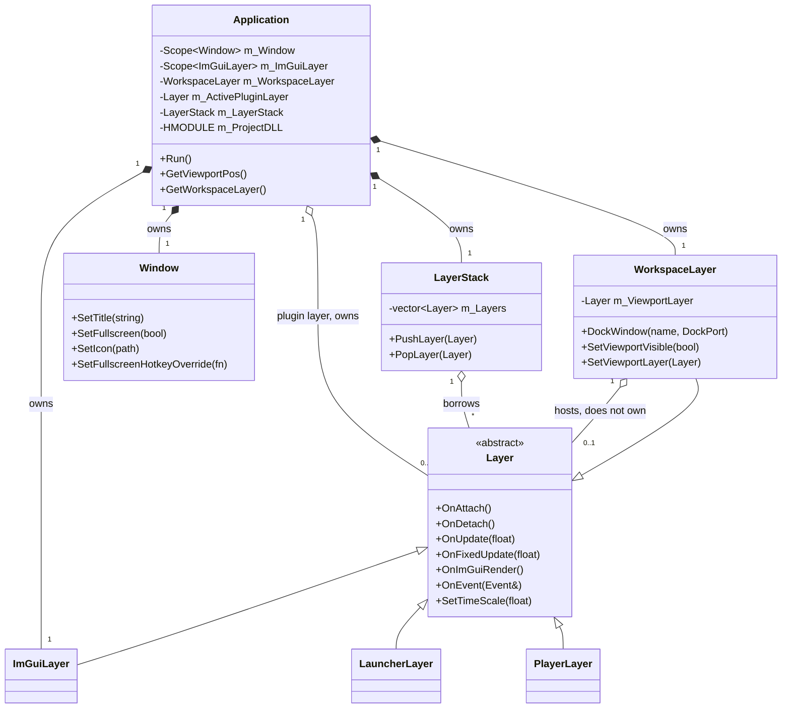
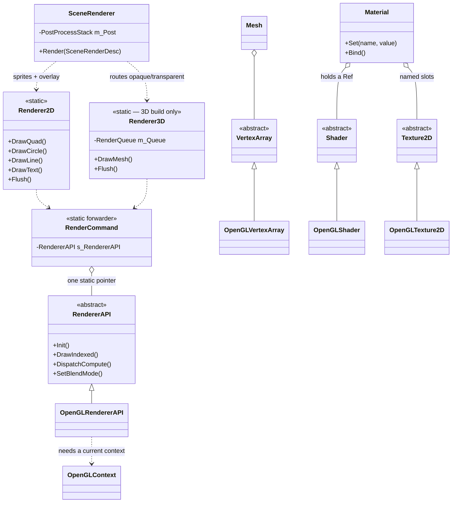

# Cosmic Engine

> **How to use this document:** This is the **overview** — what Cosmic is, how to build it, and a
> tour of every subsystem with enough detail to get oriented and reach for the right thing. Each
> section links to its full chapter in [`docs/guide/`](docs/guide/README.md). The
> [Command Reference (§1.5)](#15-command-reference--every-command) and
> [The Two Engine Configurations (§1.6)](#16-the-two-engine-configurations) live here in full.

## 📚 Documentation map

```
README.md ....................... you are here — overview, §1.5 commands, §1.6 configurations
docs/
├── guide/ ...................... "how do I build things with Cosmic"  → per-topic chapters
├── reference/ .................. "what exactly does this call do"     → per-call API lookup
├── systems/ .................... "how does it work and why"           → subsystem explainers
├── design/ ..................... decisions of record, specs, audits
├── plans/ ...................... roadmap, phase plans, feature matrix
└── installer-guide.md .......... build → ship → install a setup exe
```

| Tier | Start here | Answers |
| --- | --- | --- |
| 📖 **Guide** | [`docs/guide/README.md`](docs/guide/README.md) | *"How do I do X in my project?"* — task-oriented chapters with worked examples |
| 🔎 **API Reference** | [`docs/reference/README.md`](docs/reference/README.md) | *"What exactly does this call do?"* — one entry per command: signature, behavior, failure modes, pitfalls |
| ⚙️ **System Explainers** | [`docs/systems/README.md`](docs/systems/README.md) | *"How does this actually work, and why is it built that way?"* — plain-English first, then implementation |
| 🧭 **Design & Plans** | [`docs/design/`](docs/design/README.md) · [`docs/plans/00-MASTER-ROADMAP.md`](docs/plans/00-MASTER-ROADMAP.md) | Decisions of record, the roadmap, and every phase's work orders |
| 🗂️ **Docs index** | [`docs/README.md`](docs/README.md) | The map of the whole documentation set |

**Most-asked pages:** [Getting Started](docs/guide/getting-started.md) ·
[Project Anatomy](docs/guide/project-anatomy.md) ·
[Command Reference](#15-command-reference--every-command) ·
[The Two Engine Configurations](#16-the-two-engine-configurations) ·
[2D Rendering](docs/guide/rendering-2d.md) ·
[3D Rendering](docs/guide/rendering-3d.md) ·
[Lighting & Environment](docs/guide/lighting-and-environment.md) ·
[World Systems](docs/guide/world-systems.md) ·
[Animation](docs/guide/animation.md) ·
[Voxels](docs/guide/voxels.md) ·
[Sprites & Tilemaps](docs/guide/sprites-and-tilemaps.md) ·
[In-Game UI](docs/guide/game-ui.md) ·
[Cameras & Navigation](docs/guide/cameras.md) ·
[Materials & Shaders](docs/guide/materials-and-shaders.md) ·
[Entities & Components](docs/guide/entities-and-components.md) ·
[Scenes & Serialization](docs/guide/scenes-and-serialization.md) ·
[Scripting](docs/guide/scripting.md) ·
[Flow & Story](docs/guide/flow-and-story.md) ·
[Logging & Diagnostics](docs/guide/logging-and-diagnostics.md) ·
[Physics](docs/guide/physics.md) ·
[Navigation & AI](docs/guide/navigation-and-ai.md) ·
[Assets & the VFS](docs/guide/assets-and-vfs.md) ·
[Audio](docs/guide/audio.md) ·
[Simulation Math](docs/guide/sim-math-toolkit.md) ·
[Serial & Telemetry](docs/guide/serial-and-telemetry.md) ·
[Jobs & Parallelism](docs/guide/jobs-and-parallelism.md) ·
[Windowing & the Viewport](docs/guide/windowing-and-viewport.md) ·
[Editor UI & Theming](docs/guide/editor-ui-and-theming.md) ·
[Building & Shipping](docs/guide/building-and-shipping.md)

> **The guide tier is complete.** All 29 chapters are written; every Part I section below is now an
> overview with a link to its chapter. This file stays the **overview** — plus
> [§1.5](#15-command-reference--every-command) and
> [§1.6](#16-the-two-engine-configurations), which live here in full. Part II's engine internals
> are moving to [`docs/systems/`](docs/systems/README.md) next; see
> [§42.5](#425-where-the-rest-of-part-ii-lives--the-systems-directory) for what is there today.

---

## Table of Contents

### Part 1: Client Developer Guide

1. [Getting Started](#1-getting-started) — overview; full chapter:
   [`docs/guide/getting-started.md`](docs/guide/getting-started.md)
   - [1.5 Command Reference — Every Command](#15-command-reference--every-command)
   - [1.6 The Two Engine Configurations](#16-the-two-engine-configurations)
2. [Memory Management](#2-memory-management) — overview; full chapter:
   [`docs/guide/project-anatomy.md`](docs/guide/project-anatomy.md)
3. [Application Lifecycle](#3-application-lifecycle) — overview; full chapter:
   [`docs/guide/project-anatomy.md`](docs/guide/project-anatomy.md)
4. [The Layer System](#4-the-layer-system) — overview; full chapter:
   [`docs/guide/project-anatomy.md`](docs/guide/project-anatomy.md)
5. [The Event System](#5-the-event-system) — overview; full chapter:
   [`docs/guide/events-and-input.md`](docs/guide/events-and-input.md)
6. [Input Polling](#6-input-polling) — overview; full chapter:
   [`docs/guide/events-and-input.md`](docs/guide/events-and-input.md)
7. [Time & Timeline System](#7-time--timeline-system) — overview; full chapter:
   [`docs/guide/time-and-ticks.md`](docs/guide/time-and-ticks.md)
8. [2D Rendering API](#8-2d-rendering-api) — overview; full chapter:
   [`docs/guide/rendering-2d.md`](docs/guide/rendering-2d.md)
9. [Materials and Shaders](#9-materials-and-shaders) — overview; full chapter:
   [`docs/guide/materials-and-shaders.md`](docs/guide/materials-and-shaders.md)
10. [The Shader Contract](#10-the-shader-contract) — overview; full chapter:
    [`docs/guide/materials-and-shaders.md`](docs/guide/materials-and-shaders.md)
11. [Sprite Sheets and SubTexture2D](#11-sprite-sheets-and-subtexture2d) — overview; full chapter:
    [`docs/guide/rendering-2d.md`](docs/guide/rendering-2d.md)
12. [SDF Circles](#12-sdf-circles) — overview; full chapter:
    [`docs/guide/rendering-2d.md`](docs/guide/rendering-2d.md)
13. [Instanced Rendering](#13-instanced-rendering) — overview; full chapter:
    [`docs/guide/rendering-2d.md`](docs/guide/rendering-2d.md)
14. [RenderPass and Multi-Camera Rendering](#14-renderpass-and-multi-camera-rendering) — overview;
    full chapter: [`docs/guide/rendering-2d.md`](docs/guide/rendering-2d.md)
15. [Entity Component System](#15-entity-component-system) — overview; full chapter:
    [`docs/guide/entities-and-components.md`](docs/guide/entities-and-components.md)
16. [Camera System](#16-camera-system) — overview; full chapter:
    [`docs/guide/cameras.md`](docs/guide/cameras.md)
17. [Virtual File System](#17-virtual-file-system) — overview; full chapter:
    [`docs/guide/assets-and-vfs.md`](docs/guide/assets-and-vfs.md)
18. [Framebuffer](#18-framebuffer) — overview; full chapter:
    [`docs/guide/materials-and-shaders.md`](docs/guide/materials-and-shaders.md)
19. [Logging](#19-logging) — overview; full chapter:
    [`docs/guide/logging-and-diagnostics.md`](docs/guide/logging-and-diagnostics.md)
20. [Serial Communication](#20-serial-communication) — overview; full chapter:
    [`docs/guide/serial-and-telemetry.md`](docs/guide/serial-and-telemetry.md)
    - [20.5 SerialLink — Managed Connections](#205-seriallink--managed-connections) — retired
    - [20.6 Binary Framing — COBS + CRC16](#206-binary-framing--cobs--crc16) — retired
21. [The Template Project](#21-the-template-project) — retired; see
    [`docs/guide/getting-started.md`](docs/guide/getting-started.md) and
    [`docs/guide/project-anatomy.md`](docs/guide/project-anatomy.md). §21.5 is still live.
22. [Job System & Parallel Pipeline](#22-job-system--parallel-pipeline) — overview; full chapter:
    [`docs/guide/jobs-and-parallelism.md`](docs/guide/jobs-and-parallelism.md)
23. [Scene System](#23-scene-system) — overview; full chapter:
    [`docs/guide/scenes-and-serialization.md`](docs/guide/scenes-and-serialization.md)
24. [Window System](#24-window-system) — overview; full chapter:
    [`docs/guide/windowing-and-viewport.md`](docs/guide/windowing-and-viewport.md)
25. [Complete API Reference Tables](#25-complete-api-reference-tables) — retired; the API surface
    lives in [`docs/reference/`](docs/reference/README.md)
26. [Telemetry System](#26-telemetry-system) — overview; full chapter:
    [`docs/guide/serial-and-telemetry.md`](docs/guide/serial-and-telemetry.md)
27. [Fonts and Text Rendering](#27-fonts-and-text-rendering) — overview; full chapters:
    [`docs/guide/editor-ui-and-theming.md`](docs/guide/editor-ui-and-theming.md) (UI text) and
    [`docs/guide/rendering-2d.md`](docs/guide/rendering-2d.md) (world-space text)
28. [ImGui Overlay & Image Helpers](#28-imgui-overlay--image-helpers) — overview; full chapter:
    [`docs/guide/editor-ui-and-theming.md`](docs/guide/editor-ui-and-theming.md)
    - [28.5 Themes, Icons & Fonts](#285-themes-icons--fonts) — retired
29. [Viewport Visibility & Center Docking](#29-viewport-visibility--center-docking) — overview; full
    chapters: [`docs/guide/windowing-and-viewport.md`](docs/guide/windowing-and-viewport.md) and
    [`docs/guide/editor-ui-and-theming.md`](docs/guide/editor-ui-and-theming.md)

---

### Part 2: Engine Internals

30. [Source File Map](#30-source-file-map)
31. [Hot-Reloadable DLL Architecture](#31-hot-reloadable-dll-architecture)
32. [Top-Down Time Propagation Waterfall](#32-top-down-time-propagation-waterfall)
33. [The Double-Tick Trap](#33-the-double-tick-trap)
34. [The OpenGL Graphics Pipeline](#34-the-opengl-graphics-pipeline)
35. [Hardware Abstraction Architecture](#35-hardware-abstraction-architecture)
36. [Batch Rendering Deep Dive](#36-batch-rendering-deep-dive)
37. [Shader Preprocessing System](#37-shader-preprocessing-system)
38. [RenderPass Stack — Implementation Details](#38-renderpass-stack--implementation-details)
39. [Parallel Pipeline Architecture](#39-parallel-pipeline-architecture)
40. [Build System](#40-build-system) — overview; full chapter:
    [`docs/guide/building-and-shipping.md`](docs/guide/building-and-shipping.md)
41. [Event System — Implementation Details](#41-event-system--implementation-details)
42. [Telemetry System — Implementation Details](#42-telemetry-system--implementation-details)
    - [42.5 Where the rest of Part II lives — the systems directory](#425-where-the-rest-of-part-ii-lives--the-systems-directory)
43. [Known Limitations & Roadmap](#43-known-limitations--roadmap) — pointer to the roadmap and the
    feature matrix

---

# Part I — Client Developer Guide

---

## 1. Getting Started

### What is Cosmic?

Cosmic is a **C++20 engine for 2D and 3D real-time applications**, built on **OpenGL 4.5 core
profile** and targeting **Windows x64** only. It compiles to one shared library, `Cosmic.dll`; your
own code compiles to a **separate DLL that a host executable loads at runtime**. That plugin
boundary is the organising idea of the SDK — you rebuild your project in seconds without touching
the engine, the editor can hot-reload it while it runs, and the same DLL is what a packaged app
ships.

The engine builds in **two configurations from one source tree**: the full 3D engine, and a
pure-2D engine that never compiles terrain, voxels, water, navigation, particles or `Renderer3D`
(see [§1.6](#16-the-two-engine-configurations)). Both ship physics, sprites and tilemaps, canvas
UI, flow and story graphs, the asset/VFS stack, audio, jobs, and the Starforge editor.

Alongside the game-engine surface it carries what a **simulation** needs and a game engine usually
does not: a TOML config facade, fixed-step integrators and filters, lookup tables, deterministic
PCG32 RNG, a serial-port service, and a columnar telemetry recorder with replay. That is why
`SF_Telem` and `ViperSim` live in the same tree as `ForgePong`.

Two executables run it. `Starforge.exe` opens the **editor** — the front door for making
something. `CosmicApp.exe` is the generic host: it boots a **Launcher** that lists every plugin DLL
it can find, or goes straight into one with `--project <Name>`.

**→ Full chapter: [`docs/guide/getting-started.md`](docs/guide/getting-started.md)** — first-time
setup, building, both kinds of project you can create, the tree layout, the minimal plugin
skeleton, the VFS, and the two build configurations, with the pitfalls each one has.

---

## 1.5 Command Reference — Every Command

Every command you can run against this SDK, in one place. All `.bat` scripts run from the **repo root** and pause on completion — except `package_installer.bat`, which does not. (Contract: any PR that adds or changes a script, flag, or option updates this section — see `docs/plans/12-documentation-plan.md` §11 (contract carried from archived doc 06 D1).)

> **This is the list; the depth is one click away.**
> [`docs/guide/building-and-shipping.md`](docs/guide/building-and-shipping.md) explains what each
> script does to your build tree, what turning each option off actually removes, and the whole
> packaging/installer pipeline.

### Build & setup scripts

| Command | What it does |
| --- | --- |
| `setup.bat` | One-time SDK registration: permanently sets the `COSMIC_SDK` environment variable to the repo root (via `setx`). Project `CMakeLists.txt` files use it to find the engine when a project is configured standalone (they fall back to `$ENV{COSMIC_SDK}` when `-DCOSMIC_SDK_DIR` isn't passed). Build-time only — packaged apps never need it. Restart terminals/VS afterwards. |
| `build.bat [Debug\|Release]` | **Incremental** build of everything (engine + runtime + all projects + tests). Default config `Debug`. Creates/reconfigures `build/` automatically, including flipping the cache back if it was last configured engine-only. |
| `build_all.bat [Debug\|Release]` | **Clean** rebuild: deletes `build/`, reconfigures, builds everything. Default `Debug`. |
| `build_all_release.bat` | Clean rebuild pinned to `Release`. Release *is* the distribution configuration (console-less subsystem, launcher New-Project UI disabled, `/O2`) — there is no separate dist flag. |
| `build_engine.bat [Debug\|Release]` | Engine-only incremental build (`Cosmic` + `CosmicApp` targets, configured with `COSMIC_BUILD_ENGINE_ONLY=ON`). Fastest loop for engine-core work; skips all project DLLs. |
| `build_2d.bat [Debug\|Release]` | **Switches this tree to the 2D-only engine** and builds it. Reconfigures with `-DCOSMIC_2D_ONLY=ON` whenever the cache is absent or says OFF. The cache is sticky, so afterwards plain `build.bat` keeps building 2D in this tree. See [§1.6](#16-the-two-engine-configurations). |
| `build_3d.bat [Debug\|Release]` | The symmetric setter: switches this tree back to the **full 3D engine** (`-DCOSMIC_2D_ONLY=OFF`) and builds it. |
| `build_all_2d.bat [Debug\|Release]` | **Clean** rebuild in 2D-only mode (mirrors `build_all.bat`). |

`build.bat`, `build_all.bat` and `build_engine.bat` are **mode-preserving**: they read
`COSMIC_2D_ONLY` out of `build\CMakeCache.txt` and echo `[MODE] 2D-only engine` or
`[MODE] full 3D engine`, but never change it. Only `build_2d.bat` / `build_3d.bat` /
`build_all_2d.bat` set the mode.

Examples:

```bat
build.bat                    :: incremental Debug in whatever mode this tree is — the everyday command
build.bat Release            :: incremental Release
build_engine.bat Debug       :: engine core only
build_2d.bat                 :: switch this tree to the 2D engine, then build Debug
build_3d.bat Release         :: switch it back to the full 3D engine, then build Release
```

### Packaging & installer scripts

| Command | What it does |
| --- | --- |
| `package.bat` | Clean Release build → `cmake --install` staging → self-contained **full SDK** distributable at `dist\Cosmic\` (launcher + every project + assets + VC++ runtime DLLs) → `dist\Cosmic.zip`. |
| `package.bat <AppName>` | Same, but **single-app**: stages `dist\<AppName>\`, prunes every other project DLL and asset folder. Example: `package.bat SF_Telem`. |
| `package_installer.bat <AppName>` | Runs `package.bat <AppName>`, then compiles `installer\CosmicSetup.iss` with Inno Setup 6 → `dist\<AppName>-Setup-<version>.exe` (version read from `Cosmic/src/core/Version.h`). Requires [Inno Setup 6](https://jrsoftware.org/isinfo.php). Full walkthrough: [`docs/installer-guide.md`](docs/installer-guide.md). |

Environment switch: set `COSMIC_NOPAUSE=1` to suppress `package.bat`'s final pause (used when chained from `package_installer.bat`).

### Running the engine — `CosmicApp.exe` and `Starforge.exe`

| Command | What it does |
| --- | --- |
| `CosmicApp.exe` | Boots into the **Launcher** (project picker / New Project UI). |
| `CosmicApp.exe --project <NameOrDll>` | Boots **directly into that project**, skipping the Launcher. Accepts a bare name (`SF_Telem`), a DLL name (`SF_Telem.dll`), or an absolute path. Resolution order: `projects\<name>.dll` next to the exe, then the exe dir, then absolute. A missing DLL logs an error and falls back to the Launcher — never a dead exe. |
| `CosmicApp.exe --project=<NameOrDll>` | Same flag, `=` form. |
| `CosmicApp.exe --replay <file>` | Stores the path in the `COSMIC_REPLAY_FILE` environment variable for the running app to read on boot. Registered as a file association by the Starforge-generated installer. **Nothing in the engine or any shipped app reads that variable today** — the flag parses and has no effect. |
| `Starforge.exe` | The dev-tree editor host: the same `Main.cpp` with `COSMIC_STARTUP_PROJECT="Starforge"` compiled in, plus its own VERSIONINFO and taskbar identity. `--project` and a `boot.cfg` both override the baked-in default. Not produced by `cmake --install`, so it exists only in the dev tree. |

Any other argument prints `unrecognized argument` to stderr and is ignored. Two non-flag inputs also
steer the boot: a **`boot.cfg`** next to the exe (first non-empty, non-`#` line = the project name)
is used when no `--project` is given and is the **only** thing that switches `user://` to per-app
isolation; and a compiled-in `COSMIC_STARTUP_PROJECT` is the lowest-priority fallback. Dev-tree
example:

```bat
build\Runtime\Debug\CosmicApp.exe --project SF_Telem
```

### Tests

| Command | What it does |
| --- | --- |
| `build\Runtime\<Config>\CosmicTests.exe` | Runs the headless doctest suite (built by default with any full build). |
| `CosmicTests.exe -ts="*COBS*"` | Filter by test-suite/name (any doctest filter flag works). |
| `ctest -C Debug --output-on-failure` | Same suite via CTest, from inside `build\`. |

### Raw CMake configure options (what the scripts pass for you)

| Option | Default | Effect |
| --- | --- | --- |
| `-DCOSMIC_BUILD_ENGINE_ONLY=ON\|OFF` | `OFF` | `ON` skips the `Projects/` scanner (engine + runtime only). The build scripts flip this automatically. |
| `-DCOSMIC_BUILD_TESTS=ON\|OFF` | `ON` | Build the `CosmicTests` target. Never installed/packaged either way. |
| `-DCOSMIC_2D_ONLY=ON\|OFF` | `OFF` | `ON` builds the **2D-only engine**: no terrain/voxel/water/nav/particles, no 3D renderer passes, no model or skeletal loading, and assimp + recastnavigation are not even configured. Set by `build_2d.bat` / `build_3d.bat` or the `2d` / `default` presets. [§1.6](#16-the-two-engine-configurations) |
| `-DCOSMIC_WITH_JOLT=ON\|OFF` | `ON` | Build the Jolt physics backend. `OFF` is supported: it drops `physics/backends/JoltBackend.cpp` and leaves the null backend plus whatever an app registers through `IPhysicsBackend`. Orthogonal to `COSMIC_2D_ONLY` — Jolt ships on both configurations. |
| `-DCOSMIC_WITH_ASSIMP=ON\|OFF` | `ON` | FBX/STL/DAE/PLY import via vendored assimp. Ignored in the 2D configuration, which never configures assimp at all. |
| `-DCOSMIC_BUILD_RENDER_TESTS=ON\|OFF` | `OFF` | Build `CosmicRenderTests`, the golden-image target. Needs a real GPU and is driver-specific, so it is local-only and never runs in CI. |
| `-DCOSMIC_SKIP_PROJECTS="A;B"` | mode-derived | Semicolon-separated `Projects/` directory names the scanner skips. Defaults to nothing in 3D and `Frontier;Engine3DDemo;ForgeIsle;ViperSim` in 2D; a hand-set value is left alone. |
| `-DCOSMIC_SDK_DIR=<path>` | repo root (cache) | Where project builds look for the engine; standalone project configures fall back to the `COSMIC_SDK` env var from `setup.bat`. |

CMake presets are available for the two engine configurations:

```bash
cmake --preset default
```

```bash
cmake --preset 2d
```

### In-app global hotkeys

| Key | Effect |
| --- | --- |
| `F11` | Toggle borderless-windowed fullscreen. Projects can intercept/replace this via `Window::SetFullscreenHotkeyOverride` — see [`docs/guide/windowing-and-viewport.md`](docs/guide/windowing-and-viewport.md#bind-your-own-fullscreen-key). |

All other shortcuts are app-defined (check the project's own docs/panels).

---

## 1.6 The Two Engine Configurations

Cosmic builds as **two engines from one source tree**, selected by a single CMake flag.

| | **Full 3D engine** | **2D-only engine** |
| --- | --- | --- |
| Flag | `COSMIC_2D_ONLY=OFF` (default) | `COSMIC_2D_ONLY=ON` |
| Branch | **`main`** — the trunk | **`engine-2d`** |
| Working tree | `C:\dev\Cosmic` | `C:\dev\Cosmic-2D` (a git worktree) |
| Preset / script | `cmake --preset default` · `build_3d.bat` | `cmake --preset 2d` · `build_2d.bat` |
| Ships | everything | everything **except** the 3D subsystems below |
| CI | GitHub Actions watches this | none — verified locally |

**What the 2D configuration leaves out:** the terrain, voxel, water, navigation and particle
source trees; `Renderer3D` and the GPU resources only it owns (shadow maps, the IBL environment
cube, coverage capture, the instancing pool); model loading and skeletal animation; the 3D half of
the scene layer (`Components3D.h`, `Scene3D.cpp`, `TypeRegistry3D.cpp`, `ScenePicker`); the
`Frontier`, `Engine3DDemo`, `ForgeIsle` and `ViperSim` projects; and — the big one for build times
— the **assimp** and **recastnavigation** vendored dependencies, which are not even configured.

**What it keeps:** sprites, sprite animation, tilemaps, 2D lights, canvas UI, flow and story
graphs, the 2D camera rig, the whole asset/VFS/audio/serial/telemetry/jobs/UI stack, the Starforge
editor (in 2D mode), SF_Telem — and **all of physics**. Rigid bodies, box/sphere/capsule colliders
and the character controller are dimension-agnostic and ship in both; only mesh and terrain-
heightfield colliders are 3D-only.

**Both branches carry byte-identical tracked files.** Nothing is deleted on `engine-2d` — the
difference is entirely the build cache and which preset you pick. Carrying a change across is
copying the same file to the same path (or `git merge`, which is near-conflict-free by
construction). Anything that *must* differ between the branches is a design bug.

To work on both at once, use the worktree rather than a second build folder — `COSMIC_SDK_DIR` is
source-relative, so two binary directories in one source tree would clobber each other's
`Cosmic.dll`:

```bash
git worktree add ../Cosmic-2D engine-2d
```

**Writing code that works in both.** A file that names anything under `terrain/`, `voxel/`,
`water/`, `nav/`, `particles/`, `Renderer3D`, `ShadowMap`, `EnvironmentMap`, `Model` or `Skeleton`
is 3D-only and belongs in the exclusion list; everything else is shared. In shared code, guard 3D
references with `#ifndef COSMIC_2D_ONLY` — the macro is defined **publicly** on the `Cosmic`
target, so your project sees exactly the same value the engine was built with. Prefer excluding a
whole file over fencing one; a file the 2D build never compiles costs nothing.

Full details — the exclusion table, the classification rule, the recorded build times, and the
carry-over workflow — are in
[`docs/systems/build-2d-3d-split.md`](docs/systems/build-2d-3d-split.md).

---

## 2. Memory Management

`Core.h` gives the standard smart pointers names that state intent, and nothing more.
**`Scope<T>`** is `std::unique_ptr<T>` — exactly one owner, built with `CreateScope<T>(args…)`.
**`Ref<T>`** is `std::shared_ptr<T>` — shared, released when the last holder lets go, built with
`CreateRef<T>(args…)` or, better, the type's own factory (`Texture2D::Create`, `Material::Create`,
`Scene::Create`, `FrameBuffer::Create`) which does the resource work a bare `CreateRef` cannot.

Sharing a `Ref<T>` across the DLL boundary is safe because **every module in the process shares one
allocator**: the engine is built as one `Cosmic.dll` and nothing in the build overrides CMake's MSVC
default of the dynamic CRT, so the engine and every project DLL allocate from the same heap and see
one `shared_ptr` control block per resource. Break that — statically link the engine, or force `/MT`
in one target — and releasing a shared resource from both sides double-frees, usually silently,
usually during shutdown.

The one deliberate exception is the raw `Layer*` returned by `CreatePluginLayer()`. The engine takes
ownership of it and destroys it before `FreeLibrary` unmaps your code. **Never `delete` it, and never
push your own child layers onto the engine's `LayerStack`** — the engine would run their destructors
against unmapped memory. Release GPU-backed `Ref<>` handles in `OnDetach()`, while the OpenGL context
is still alive.

**→ Full chapter: [`docs/guide/project-anatomy.md`](docs/guide/project-anatomy.md)** — the
shared-allocator rule with the CMake facts behind it, the ownership contract at the plugin boundary,
teardown ordering, and the composite-layer pattern.

---

## 3. Application Lifecycle

`Application` is the engine's root object and its only real singleton, reached through
`Cosmic::Application::Get()`. Its constructor boots everything — logging first, then the job pool,
audio, the window, the renderer, the main framebuffer, the ImGui overlay, and finally either the
Launcher or the startup project — and its destructor tears all of that down in a deliberately staged
order so that GPU and audio resources are released while their contexts are still alive. Note that
`s_Instance` is assigned *before* `Initialize()` runs, because subsystems started there call back
through `Get()`; the cost is that `Get()` from a static initializer, before the object exists,
dereferences null.

Each frame runs `PollEvents`, then a fixed pass (`OnFixedUpdate`, zero to fifteen times, clamped
against the spiral of death), then a variable pass (`UpdateLayerTime` + `OnUpdate` — which is also
where **all drawing** happens in this engine), then the ImGui pass and `SwapBuffers`. Use
`OnFixedUpdate` for physics, integrators and serial I/O; never issue draw calls from it. `Pause()` is
a first-class state distinct from `SetTimeScale(0)`: it skips the fixed pass entirely so there is no
catch-up burst on `Resume()`, runs the variable pass with `dt = 0` so the scene stays on screen, and
leaves ImGui fully interactive.

The bottom of the loop is **the Safe Zone** — the one point per frame where no `LayerStack` iteration
is active. Every structural change lands there: mounting and unmounting project DLLs, and pushing,
popping or deleting layers. `TransitionFromLauncherToWorkspace()` and `TransitionToLauncher()` only
set a flag, which is what makes them safe to call from any hook.

**→ Full chapter: [`docs/guide/project-anatomy.md`](docs/guide/project-anatomy.md)** — construction
and shutdown step by step, the full control API, diagram **DG-3** (one frame end to end), diagram
**DG-11** (the Launcher ⇄ Workspace state machine), and the Safe Zone handshake. Time in depth:
[§7](#7-time--timeline-system).

---

## 4. The Layer System

A `Layer` is the engine's one polymorphic unit of work — a game world, a simulation mode, a tool
panel, a UI overlay. You override only the hooks you need: `OnAttach`/`OnDetach` for setup and
release, `OnUpdate(dt)` for animation, cameras and drawing, `OnFixedUpdate(dt)` for deterministic
simulation, `OnImGuiRender()` for UI, and `OnEvent(Event&)` for one-shot reactions. `Layer` also
declares `OnRender()`; **nothing calls it** — issue draw calls from `OnUpdate`. Every layer carries
its own scalable local clock (`GetLocalTime`, `SetTimeScale`), so one mode can run in slow motion
independently of the global scale.

The `LayerStack` keeps layers below overlays: `PushLayer` inserts at the layer/overlay boundary,
`PushOverlay` appends. Update and render walk bottom-to-top so overlays draw last; events walk
top-to-bottom so overlays see them first — which is how ImGui eats a click before the world does.
The stack **borrows** raw pointers and never owns them; `Application` owns every layer on it and is
responsible for `delete`.

That ownership rule is why a project DLL **must not push its own layers**. For anything with multiple
modes, use the **composite-layer pattern**: a root manager layer holds its children in a
`std::vector<std::shared_ptr<Layer>>` and forwards its own hooks to them. `OnAttach`/`OnDetach` and
window-category events fan out to all children; input and the per-frame hooks go to the active one.
`Cosmic/templates/ExampleProject/` is the working example.

Two engine layers are client-reachable. **`PlayerLayer`** (exported) runs a Starforge-made project
with no editor — manifest, startup scene, scripts, physics and the shared `SceneRenderer` — and is
what `CS_MODULE_END` returns for you. **`WorkspaceLayer`** (the editor shell) is reachable through
its inline members: `DockWindow`, `SetViewportVisible`, `SetBottomInsetPixels`,
`BeginViewportOverlay` and friends.

**→ Full chapter: [`docs/guide/project-anatomy.md`](docs/guide/project-anatomy.md)** — every hook and
when it fires, stack ordering, the two client-reachable engine layers and exactly what is reachable
on each, the composite-layer pattern in full, and owning your own services.

---

## 5. The Event System

Events are Cosmic's **push** channel. A GLFW callback — fired inside `Window::PollEvents()` at the
top of each frame, before any update runs — wraps the signal in a typed `Event` object, and
`Application::OnEvent` walks it through the `LayerStack` in **reverse** order so overlays see it
first. Any handler can set `e.Handled = true` to stop it there. Inside a layer, `EventDispatcher`
routes by type: `dispatcher.Dispatch<KeyPressedEvent>(lambda)`, where the lambda returns `bool` and
**`true` is the only thing that consumes an event** — `Handled` is never cleared once set.

Two stops on that path surprise people. `Window::HandleFullscreenHotkey` runs *before* any `Event`
object exists, so **`F11` is consumed for fullscreen** and never reaches a handler unless you
register `SetFullscreenHotkeyOverride`. And `Application::OnWindowClose` returns `true`, so
**`WindowCloseEvent` never reaches any layer** — window close cannot be vetoed from client code.
`WindowResizeEvent`, by contrast, is handled *and* keeps propagating, so every layer gets a chance to
re-derive its projection. Further down, `ImGuiLayer` marks mouse and keyboard events handled whenever
ImGui wants the input — except while the Viewport panel is hovered or focused, where `WorkspaceLayer`
turns that blocking off so raw input reaches your layer.

Each event carries a category bitmask (`EventCategoryApplication`, `Input`, `Keyboard`, `Mouse`,
`MouseButton`) for filtering whole families at once — note that resize, close and **file drop** are
`Application` only, never `Input`. The concrete types are `WindowResizeEvent`, `WindowCloseEvent`,
`WindowFileDropEvent`, `KeyPressed`/`KeyReleased`/`KeyTypedEvent`, `MouseMoved`, `MouseScrolled` and
the two `MouseButton` events. Events carry no modifier bits; poll `CS_KEY_LEFT_CONTROL` for chords.

**→ Full chapter: [`docs/guide/events-and-input.md`](docs/guide/events-and-input.md)** — diagram
**DG-4** (the whole propagation path), the `EventDispatcher` contract, the full event catalogue with
the traps in it (`KeyTypedEvent` carries a Unicode codepoint, not a key code; `GetRepeatCount()` is a
flag, not a counter), handling `WindowFileDropEvent`, and how events reach scripts.

---

## 6. Input Polling

`Input` is the **pull** channel: static queries that ask the hardware what is true *right now*. Use
it for anything continuous — walking, camera pan, throttle — and use events for anything one-shot.
The surface is small: `IsKeyPressed`, `IsMouseButtonPressed`, `GetMousePosition`/`GetMouseX`/
`GetMouseY`, `GetMouseScreenPosition`, and the gamepad calls. There is no polled scroll wheel; scroll
exists only as a `MouseScrolledEvent` delta you accumulate yourself.

The critical detail is that **there are two mouse coordinate spaces**. `GetMousePosition()` is
window-client pixels; `GetMouseScreenPosition()` is OS screen pixels, which is the space ImGui uses
under multi-viewport and therefore the space `Application::GetViewportPos()/GetViewportSize()` live
in. Compare like with like, or picking is off by the window's desktop position — a bug that hides
perfectly when the window is maximized at the top-left of the primary monitor.

**Gamepads have been supported since Phase 2** and are pure polling — no events, no connect
notifications, no initialization. `IsGamepadConnected`, `GetGamepadAxis`, `IsGamepadButtonPressed`,
`GetGamepadAxisCount`, `GetGamepadButtonCount` and `GetGamepadName` all take an optional slot
(`CS_GAMEPAD_1`…`CS_GAMEPAD_LAST`) and are safe on a disconnected slot. Mapped pads use the
standardized `CS_GAMEPAD_AXIS_*` / `CS_GAMEPAD_BUTTON_*` layout; unmapped devices — RC transmitters
in USB-joystick mode, sim yokes — fall back to raw indices through the same calls. **The engine
applies no deadzone**, and triggers report `-1` released to `+1` pressed.

One thing polling deliberately does *not* do: respect ImGui. `Input` talks straight to GLFW, so a
polled `CS_KEY_W` keeps walking your character while the user types into a text field. Gate it on
`ImGui::GetIO().WantCaptureKeyboard`, or move the binding to an event.

**→ Full chapter: [`docs/guide/events-and-input.md`](docs/guide/events-and-input.md)** — the
complete keyboard, mouse and **gamepad** code tables generated from `codes/`, both deadzone idioms
used in the tree, the coordinate-space worked example, and a keyboard-plus-stick walker.

---

## 7. Time & Timeline System

Cosmic runs **two update rates in one frame**. The variable pass (`OnUpdate(float ts)`) tracks the
display and is also where **all drawing** happens. The fixed pass (`OnFixedUpdate(float dt)`) drains
an accumulator at `GetFixedTimestepHz()` — 60 Hz by default, clamped to `[1, 1000]` — and runs zero
to fifteen times per frame, the cap coming from a 0.25 s spiral-of-death clamp on the frame time.
Physics, integrators, control loops and serial polling belong in the fixed pass; cameras, animation
and every draw call belong in the variable one.

`SetTimeScale(s)` multiplies the variable delta and the rate at which the fixed accumulator fills —
but **not the magnitude of `dt`**, which stays exactly `1/FixedHz` so that fixed-step simulation
stays stable. A negative scale does not rewind physics: the accumulator runs backwards, the drain
loop never fires, and the debt has to be repaid before fixed updates resume. Rewind works for
visuals, which read `GetLocalTime()`.

`Pause()` is a first-class state, orthogonal to the scale, and the distinction is the subtle part.
`Pause()` skips the fixed pass entirely and freezes the accumulator, so there is **no catch-up burst
on `Resume()`**, and it preserves whatever speed the user had chosen — `SetTimeScale(0)` destroys it.
Both leave the variable pass running with `ts = 0` (so the scene stays on screen, frozen) and ImGui
fully interactive. `GetAbsoluteTime()` keeps advancing through all of it; `GetLocalTime()` does not.
The engine binds no pause hotkey.

Every `Layer` also owns a local clock and its own scale, advanced for you as
`m_LocalTime += ts × layerScale` before `OnUpdate`. `GetLocalTime()` is therefore the right source
for shader `u_Time` and particle age — it already carries both scales. One asymmetry to know:
layers on the engine `LayerStack` receive a globally-scaled `ts` only, while a **plugin layer**
receives `ts` and `dt` already multiplied by its own scale, because `WorkspaceLayer` applies it when
forwarding. Do not multiply again there.

**→ Full chapter: [`docs/guide/time-and-ticks.md`](docs/guide/time-and-ticks.md)** — diagram
**DG-10** (the time waterfall), the four clocks, the pause-versus-`TimeScale(0)` table, the
per-layer/plugin-layer differences, and the physics fixed-step contract. Internals for now live in
[§32](#32-top-down-time-propagation-waterfall).

---

## 8. 2D Rendering API

`Renderer2D` is the 2D drawing surface, and it is a **batching** renderer: a `DrawQuad` call writes
four vertices into a CPU-side array and talks to no GPU at all. Geometry reaches the driver when a
batch *flushes* — at the end of a pass, when a limit fills, or when some piece of GPU state has to
change. Wrap work in `BeginScene(camera)` / `EndScene()`, or in a scoped `RenderPass`, and the
renderer collapses thousands of sprites into a handful of draw calls. Quads come in sixteen
overloads (flat colour, texture, sprite-sheet tile, or a full `Material`, each with `vec2`/`vec3`
positions and a rotated twin); alongside them sit SDF circles and rings, lines and wireframe boxes,
world-space SDF text through `Cosmic::Font`, and two hardware-instanced paths for tens of thousands
of identical objects.

The batch limits are fixed at compile time — 10,000 quads, 10,000 lines, 10,000 circles, 10,000
glyphs, 31 distinct textures per batch, 20,000 instances per instanced chunk — and **hitting one is
never an error**: the renderer flushes and carries on, so the only visible effect is an extra draw
call. Batches also break on state changes that are easy to trigger by accident, the expensive one
being a material switch: alternating materials costs one draw call per quad. Draw order deserves a
warning of its own — within a single flush the renderer always emits quads, then lines, then
circles, then text, regardless of the order you called them in.

Two counters-worth of instrumentation ships with it, and **`Renderer2D`'s statistics are off by
default** (`StatsEnabled` is `false` and nothing in the engine arms it), with `ResetStats()` likewise
left to the caller. Since Phase 27/29 the 2D output no longer reaches the backbuffer directly:
sprites draw in `SceneRenderer`'s transparent phase with an HDR target bound, pass through tonemap
and the post chain, and canvas UI composites after that in LDR — the same spine the 3D path uses, in
both engine configurations.

**→ Full chapter: [`docs/guide/rendering-2d.md`](docs/guide/rendering-2d.md)** — every overload with
its failure behaviour, sprite sheets, circles, lines, text, the instanced paths and when they
actually win, multi-camera `RenderPass`, the stats counters, **the complete batch-limit and
flush-behaviour tables cited to `Renderer2D.cpp`**, and the `SceneRenderer` compositing spine
including `BlendMode::Multiply`. Internals live in
[§36](#36-batch-rendering-deep-dive) and [§38](#38-renderpass-stack--implementation-details).

---

## 9. Materials and Shaders

A **`Shader`** is a compiled GPU program built from a single `.glsl` file containing every stage; a
**`Material`** is that shader plus a named cache of uniform values. The split lets many objects
share one compiled program and still look different. `Shader::Create` is the engine's one factory
that returns **`nullptr`** on failure — it does not resolve VFS paths either, so route shader loads
through `AssetLibrary::GetShader`, which resolves, caches by normalised path, and deliberately does
not cache failures.

`Material::Set` takes floats, `vec2`/`vec3`/`vec4` and textures, and **validates nothing**: a name
the shader does not declare resolves to location `-1` at upload and is dropped in silence. That
permissiveness is what lets one material feed a shader and its instancing and skinned twins, and it
is also why a mistyped uniform name fails without a single log line. Getters have asymmetric
defaults worth remembering — `GetVector4` returns opaque white on a miss, on purpose, so a missing
tint brightens rather than erases; every other getter returns zero or null.

The rule that catches people is **when** values are uploaded. `Renderer3D` captures the material *by
reference* and reads its values at flush, so mutating one material between two draws gives both
draws the last value rather than per-draw variation — `Material::Clone` per variant is the supported
answer, spelled out with migration examples in
[`docs/guide/rendering-3d.md`](docs/guide/rendering-3d.md#the-one-rule-that-breaks-migrated-code-material-values-are-read-at-flush).
`Renderer2D` is a partial exception: `u_Color` and `u_Texture` are read at submit and baked into
vertex data, while the rest of the cache uploads once at flush.

**→ Full chapter:
[`docs/guide/materials-and-shaders.md`](docs/guide/materials-and-shaders.md)** — loading, the three
bind verbs (`Bind` / `BindFull` / `BindFullTo`) and when each is right, `Clone` and the
render-queue hints, `.cmat` assets, per-submesh material slots, and framebuffers.

---

## 10. The Shader Contract

What reaches the GLSL compiler is not what you wrote. `OpenGLShader::PreProcess` splits a file at
`#type` directives (`vertex`, `fragment`/`pixel`, `compute`), then rewrites each stage before
compiling it. A file with a fragment block but no vertex block gets a generated batch-layout vertex
shader; a file with no `#type` at all but containing `mainImage` or `iTime` is wrapped as a
Shadertoy-style fragment shader with `iTime` and `iResolution` aliased. Anything else is a hard
error and `Shader::Create` returns `nullptr` — with the **fully preprocessed, line-numbered source
dumped to the log**, which is what you want to read, because GLSL's line numbers refer to that text
and not to your file.

Three engine uniforms are injected per stage when a stage mentions one without declaring it:
`u_ViewProjection` (**vertex stage only**), `u_Time`, and `u_ViewportSize`, each triggered by a small
set of compatibility spellings. A fragment stage additionally gets `v_TexCoord`, `v_Color` and a
location-0 output injected if it declares none. Comments are stripped from a working copy before
that scan, so a commented-out declaration does *not* suppress injection — it produces a duplicate.
Declaring the uniform explicitly opts out cleanly, and is the habit to build.

Two things the contract does **not** give you. There is **no `#include`, import or snippet system** —
no shader in the tree uses one, and shared GLSL is duplicated today. And **nothing feeds `u_Time`
for a client material**: the preprocessor declares it and four engine subsystems set it on their own
shaders, but there is no global upload, so a shader that reads `u_Time` needs
`material->Set("u_Time", GetLocalTime())`. What *is* wired for you is `u_Textures[]` — the sampler
index array is uploaded automatically at link time.

Any shader drawing batched 2D geometry must match `Renderer2D`'s vertex attribute layout exactly
(`a_Position`, `a_Color`, `a_TexCoord`, `a_TexIndex`, `a_TilingFactor` at locations 0–4). Those
pointers are configured once at engine init and never change, so a mismatch misreads vertex data
with no runtime error at all.

**→ Full chapter:
[`docs/guide/materials-and-shaders.md`](docs/guide/materials-and-shaders.md)** — the three routing
paths, the injection table with every trigger keyword, the canonical boilerplate, and compute
shaders. Internals live in [§37](#37-shader-preprocessing-system).

---

## 11. Sprite Sheets and SubTexture2D

`SubTexture2D` is a UV rectangle plus a reference to a parent atlas. It creates **no GPU object**,
which is the whole point: every tile cut from one sheet shares one texture and therefore one batch
slot, so a tilemap drawn from a single atlas costs one draw call rather than one per tile.

`SubTexture2D::CreateFromCoords(texture, coords, cellSize, spriteSize)` cuts a tile from a regular
grid. `coords` is `(column, row)` indexed **from the bottom-left** — GL's texture origin, not an
image editor's — and `spriteSize` (default `{1,1}`) spans multiple cells for a larger sprite. The
coordinates are floats, so fractional offsets are legal. If you already have normalised UVs, the
constructor is public and takes `min`/`max` directly. `GetTexCoords()` hands back the four corners
counter-clockwise from bottom-left, matching the quad winding, which is why a sub-texture quad needs
no extra transform.

Every `DrawQuad`/`DrawRotatedQuad` position/rotation form accepts a `Ref<SubTexture2D>` with an
optional tint. There is deliberately **no tiling factor** on this path — tiling an atlas tile would
bleed into its neighbours. One sharp edge: unlike the plain-texture overload, which warns and falls
back to white on a null `Ref`, the sub-texture overloads dereference immediately.

**→ Full chapter: [`docs/guide/rendering-2d.md`](docs/guide/rendering-2d.md#draw-a-sprite-from-a-sprite-sheet)**
— the UV maths, the per-frame-versus-cached trade-off, and a worked animation example. For the
component-driven path — `SpriteRendererComponent`, flipbook animation, tilemaps, 2D lights and the
2D camera rig — see
**[`docs/guide/sprites-and-tilemaps.md`](docs/guide/sprites-and-tilemaps.md)**.

---

## 12. SDF Circles

`Renderer2D::DrawCircle` rasterises a quad and evaluates a signed distance field in the fragment
shader, so the edge stays smooth at any camera zoom instead of degrading into a polygon fan. Circles
have their own batch, separate from quads, and their own shader (`Circle.glsl`).

`size` is the **bounding quad's** full width and height, so a circle of world radius `r` needs
`{ 2r, 2r }` — and a non-uniform size gives an ellipse. `thickness` is the ring wall as a fraction
of the radius, `1.0` meaning a filled disc and small values a thin ring; `fade` is the anti-aliased
edge width, `0.005` reading crisp and larger values reading as glow. Note the asymmetry between the
overloads: `thickness` and `fade` have defaults only on the `vec2` form, and the `vec3` form
requires both.

Both forms take an optional `Ref<Shader>` that replaces the built-in SDF shader for that call. The
renderer tracks the active circle shader and **breaks the batch whenever it changes**, so
alternating two custom shaders costs one draw call per circle; a null shader — including a `Ref`
dropped during a hot reload — falls back to the engine default rather than crashing.

**→ Full chapter:
[`docs/guide/rendering-2d.md`](docs/guide/rendering-2d.md#draw-circles-and-rings)** — the parameter
reference, the batch limit and its flush behaviour, and the instanced circle path for large counts.

---

## 13. Instanced Rendering

`DrawInstancedQuads` and `DrawInstancedCircles` bypass batching entirely: you fill a flat array of
plain structs, the renderer streams it into a per-instance vertex buffer, and one
`glDrawElementsInstanced` draws all of it. `InstanceQuadData` is exactly 60 bytes — `static_assert`ed
against `QuadInstance.glsl`'s attribute stride — and carries position, scale, colour, a UV rect for
atlas tiles, a texture slot index and a tiling factor. `InstanceCircleData` is 44 bytes: position,
scale, colour, thickness, fade. Both calls are safe at any count; they stream in 20,000-instance
chunks and issue one draw per chunk.

They are **not** a draw-call rescue for a few thousand sprites — the batcher already collapses those
into one call. Instancing wins when the data is already in an array (no per-object call, no vertex
expansion), when you need per-instance shader attributes a batched quad cannot express, or when
counts run into the tens of thousands. It loses at small counts, because both entry points call an
unconditional flush up front for pipeline isolation: fifty instances flush everything pending and
then add a draw call of their own. It also loses when you need per-object textures — the instanced
path binds only the white texture to slot 0, so any non-zero `TexIndex` samples whatever a previous
batch left bound unless you bind it yourself.

**→ Full chapter:
[`docs/guide/rendering-2d.md`](docs/guide/rendering-2d.md#draw-thousands-of-things-at-once)** — the
full struct layouts, a worked example from the template project's benchmark layer, and the
when-it-wins/when-it-loses breakdown.

---

## 14. RenderPass and Multi-Camera Rendering

`Renderer2D` keeps one view-projection matrix and one viewport at a time, so two cameras drawing in
the same frame would overwrite each other's state. `RenderPass` is the RAII fix: construction
flushes anything pending and pushes a new matrix + viewport pair onto an internal stack; destruction
flushes and pops, restoring the previous pass. Scope one per camera and any number of cameras render
sequentially — a world view, a minimap, a rear-view inset — with no manual state tracking.

The constructor takes **any `Camera`**, 2D or 3D, since only `GetViewProjectionMatrix()` is read.
Viewport bounds are `{ x, y, width, height }` in pixels from the **bottom-left**, the GL convention.
Targeting a framebuffer is just a matter of binding one around the scope. `RenderPass` is
non-copyable and non-movable by design, so one scope owns one stack entry, and every push resets
every batch counter, so geometry can never leak across a pass boundary.

`Renderer2D::PushRenderPass` / `PopRenderPass` are available for manual control — which is what
`Scene::OnRenderSprites` uses, having a matrix but no `Camera` object. Prefer the RAII wrapper in
ordinary code: a mismatched pop is `pop_back()` on an empty stack, and the assertion that would
catch it is compiled out in every configuration.

**→ Full chapter:
[`docs/guide/rendering-2d.md`](docs/guide/rendering-2d.md#render-more-than-one-camera)** — worked
multi-camera and render-to-framebuffer examples, the quadrant bounds table, and how passes interact
with batch flushing. Internals live in [§38](#38-renderpass-stack--implementation-details).

---

## 15. Entity Component System

> **Full chapter: [`docs/guide/entities-and-components.md`](docs/guide/entities-and-components.md)** —
> the entity handle, the **complete catalogue of all 34 built-in components** (fields, units,
> defaults and which pass reads each one), hierarchy, the `Active`/`Enabled` gates, queries,
> the `System` tier, and what the engine draws automatically.

A scene is a table: an **entity** is a row with no columns of its own, a **component type** is a
column that exists only for the rows that opted into it. Cosmic uses
[EnTT](https://github.com/skypjack/entt) underneath. `Cosmic::Entity` is a 16-byte value type — an
`entt::entity` integer plus a `Scene*` — with `AddComponent` / `GetOrAddComponent` / `GetComponent` /
`HasComponent` / `RemoveComponent` forwarding into the scene's registry. `Scene` owns the registry
and is the only correct factory: `CreateEntity` emplaces an `IDComponent` (a fresh UUID), a
`TransformComponent` and a `TagComponent`, and indexes the UUID so hierarchy and prefab references
can resolve it later.

The reason the catalogue matters more than the API is that **most of the engine is driven by
components you never call into**. Attach a `PointLightComponent` and the 3D pass lights with it;
attach a `TerrainComponent` with a recipe and the render path builds the terrain on first use;
attach a `RigidBodyComponent` and a collider and a Jolt body appears when Play starts. 19 components
ship in every configuration — identity and transform, the 2D renderables, camera and environment,
the scripts, and the whole dimension-agnostic physics tier — and 15 more exist only in the 3D build
(meshes and LODs, skeletal animation, the 3D lights, terrain/water/particles/voxels, the two
geometry-derived colliders, navigation). A 2D build cannot even name the second group; scenes that
contain them survive a round-trip regardless, because unregistered component blocks are preserved
verbatim.

Two independent switches turn things off: the per-entity `TagComponent::Active` flag, which
`Scene::IsActiveInHierarchy` combines with every ancestor's and which suppresses rendering, physics
baking and script ticks for a whole subtree; and per-component `Enabled` flags that disable one
feature in place. Hierarchy is opt-in via `RelationshipComponent` (UUID-based, cycle-refusing,
composed by `Scene::GetWorldTransform`) — and note that the 2D sprite and tilemap passes
deliberately use the raw transform rather than the composed one.

Custom components are plain structs. Any component type that crosses the project-DLL boundary
**must** carry `CS_REGISTER_COMPONENT(Type)` at global scope in its header — EnTT's default
sequential type ids differ between the engine's data segment and yours, which silently corrupts
component storage. Reflecting the type additionally buys an Inspector row per field, `.cscene`
round-tripping and undo/redo. Both are covered in the chapter, along with `System` /
`ParallelSystem` / `SystemQuery` and the automatic-draw contract.

---

## 16. Camera System

> **Overview.** Full chapter: [`docs/guide/cameras.md`](docs/guide/cameras.md).

`Camera` is a pure interface with four getters — view, projection, view-projection, position — and
no data of its own. `Renderer2D::BeginScene`, `Renderer3D::BeginScene` and `RenderPass` all take
`const Camera&` and call only those four, so any camera works anywhere, including one you write
yourself. Two concrete cameras implement it: `OrthographicCamera` (bounds, Z-rotation, an optional
explicit depth range) and `PerspectiveCamera` (vertical FOV, aspect, near/far, a quaternion pose,
and `LookAt`). Both cache their matrices; the getters just expose the cache.

On top sit four **controllers**, each owning a camera plus its input handling.
`Camera2DController` is the modern 2D rig — MMB pan, scroll zoom-about-cursor, a `Focus` point and
a `Zoom` half-height, with pure `ScreenToWorld` / `PanBy` / `ZoomAboutPoint` statics.
`OrthographicCameraController` is the original keyboard rig: WASD pan scaled by zoom, smooth
scroll-wheel zoom, remappable bindings, optional Q/E roll. `OrbitCameraController` rides a
spherical mount around a target and is the editor camera — two binding schemes (`NavStyle::Classic`
and SolidWorks-style `NavStyle::CAD` with orbit-about-cursor and zoom-toward-cursor), seven
`ViewPreset` snap views, and animated `FrameBounds` / `FrameSphere`. `FlyCameraController` flies the
camera itself: RMB mouse-look, WASD/QE movement, Shift boost, scroll-to-change-speed, and an
optional ground clamp. All four share one contract — poll in `OnUpdate(ts)`, dispatch in
`OnEvent(e)`, never consume an event, and take absolute mouse positions in
`Input::GetMouseScreenPosition()` space.

Around the cameras sits the viewport-navigation tier. `NavigationCube` renders an orientation cube
into its own framebuffer and turns a click on a face into a `ViewPreset`. `ScenePicker` turns a
viewport pixel into the `Entity` under it by reading the entity-ID MRT attachment that
`Scene::OnRender3D` already writes — x from the left, y from the top, GL's flip handled internally —
and can reconstruct the world point under the cursor, which is what feeds `OrbitCameraController`'s
CAD pivot probe. `Gizmo` wraps vendored ImGuizmo behind engine-only enums for translate / rotate /
scale / universal manipulation, with `IsUsing()` and `IsOver()` as the etiquette hooks a camera and
a click-to-select path must both respect. **`NavigationCube` and `ScenePicker` are 3D-configuration
only** (see [§1.6](#16-the-two-engine-configurations)); everything else, `Gizmo` included, ships in
both.

The chapter covers all of it with worked examples — the per-controller tuning surfaces and their
failure modes, the CAD navigation flow end to end, the picking coordinate contract, gizmo hotkeys
and undo coalescing, and rendering from a scene `CameraComponent`.

---

## 17. Virtual File System

> **Overview.** Full chapter: [`docs/guide/assets-and-vfs.md`](docs/guide/assets-and-vfs.md).

`FileSystem::Resolve` is a pure string transform — no disk I/O, no failure mode — that turns a
URI-style path into a real one. Three schemes: `engine://x` → `assets/x` for engine-owned read-only
content, `project://x` → your project's own content, and `user://x` → **the only writable root**,
where logs, preferences, saves, recordings and screenshots belong. Anything with no recognised
scheme comes back unchanged, which is what makes `Resolve` safe to call on an already-resolved
path. Results are always forward-slashed and drop straight into `std::ifstream`, `Shader::Create`
and `Texture2D::Create` — neither of which resolves VFS paths itself.

`project://` mounts two ways and the last setter wins. `SetActiveProject("Name")` is NAME mode, the
in-tree `assets/projects/<name>/` layout that shipped plugin apps use; `SetActiveProjectPath(root)`
is PATH mode, a self-contained project folder anywhere on disk, probing once at mount time for an
`assets/` subdirectory. The mount state lives in the engine DLL, so there is exactly one active
project per process — the old "resolve in your own DLL because the state is per-DLL" rule that
several samples still teach was fixed in Phase 20 and no longer applies. Both setters are
main-thread only.

`user://` is where the interesting behaviour is, and none of it existed when this section was first
written. A **packaged** boot — one whose startup project came from a `boot.cfg` next to the exe —
calls `FileSystem::SetAppIdentity`, and `user://` then isolates per app: `<exe>/user/` when the exe
directory is writable or a `portable.txt` sits beside it, `%LOCALAPPDATA%/<AppName>/` when it is
installed somewhere read-only. Boots without an identity (the Launcher, `--project`, a dedicated
`COSMIC_STARTUP_PROJECT` exe) keep the historical shared root: `.` in a writable working directory,
`%LOCALAPPDATA%/Cosmic/` otherwise. The root is decided **once, at first use**, so the identity has
to be set before anything resolves `user://` — which is why it happens in `Runtime/Main.cpp` before
`Application` is constructed. Every boot logs where it landed.

The chapter covers all of that with resolved examples for dev-tree versus packaged layouts, plus
everything stacked on top: the `AssetLibrary` cache and exactly what each verb does on a miss (the
conventions differ on purpose — a failed texture is *cached* as a degraded object, a failed shader
is not), model and texture import with the `.cmeta` unit sidecar, TOML configuration through
`Config`, and the utility surface — `FileDialog`, `FileWatcher`, `ImageIO` and `DataExport`.

---

## 18. Framebuffer

A framebuffer object is a GPU render target that behaves like a virtual screen: bind one and every
draw call lands in its textures instead of the display surface, after which those textures can be
sampled, read back, or shown inside an ImGui panel. That last case is why the editor needs them at
all — the shell draws its UI into the back buffer, so the scene has to render somewhere else and
composite in as an image.

You rarely create one for the main view. `WorkspaceLayer` owns the viewport FBO and binds it before
calling your layer, and `Application::Get().GetFrameBuffer()` returns that object when you need its
size. Create your own for **secondary** targets: minimaps, portals, thumbnails, render-to-texture
effects, post-processing.

`FramebufferSpecification` carries width, height and an attachment list; an **empty** list means the
default `{ RGBA8, DEPTH24STENCIL8 }`, so every existing call site keeps its behaviour. Available
formats are `RGBA8`, `RGBA16F` (the HDR target), `RED_INTEGER` (entity-ID picking) and
`DEPTH24STENCIL8`. Naming more than one colour format gives you MRT — the engine calls
`glDrawBuffers` for you, up to a ceiling of eight. `Samples` and `SwapChainTarget` are **reserved
and unimplemented**: MSAA does nothing.

Read-back has four verbs, all requiring the FBO to be bound, and two different coordinate
conventions that are easy to mix up. `ReadPixel` (integer attachments) and `ReadDepth` take **GL
coordinates**, so the caller flips Y; `ReadPixels` returns a whole attachment as 8-bit RGBA with a
**top-left origin**, ready for `stb_image_write`. Integer attachments need `ClearAttachment` each
frame — `glClear` does not reliably clear them.

**→ Full chapter:
[`docs/guide/materials-and-shaders.md`](docs/guide/materials-and-shaders.md#render-into-a-texture)**
— creating and resizing targets, the MRT shader-side contract, every read-back verb with its
conventions and failure behaviour, and displaying an attachment in ImGui.

---

## 19. Logging

Cosmic wraps spdlog into two logger families. **Use `CS_TRACE` / `CS_INFO` / `CS_WARN` / `CS_ERROR` /
`CS_CRITICAL` in your project** — they write to the `APP` logger and `App_<timestamp>.log`. Engine
internals use the `CS_CORE_*` twins, which write to `COSMIC` and `Cosmic_<timestamp>.log`. Keeping
the two apart is what makes the editor Console's source filter and a one-file support request work.
All of them take `{fmt}` format strings — `{}`, indexed `{0}`, and full specs like `{:.2f}`.

`Application`'s constructor initializes logging as its second statement, into
`user://logs` — the writable user-data root, so an installed app under *Program Files* still gets its
logs. Both loggers are thread-safe (safe from `JobSystem` workers) and configured
`flush_on(trace)`, so no line is lost to a crash. There is **no runtime level filter and no
rotation**: every message is written and flushed, and each launch leaves one more pair of files
behind. A `CS_TRACE` on a per-frame path really does write sixty lines a second.

Two things bite people. First, the colored console sink only has somewhere to go in **Debug** —
Release links `/SUBSYSTEM:WINDOWS`, so the log file and any in-app console are your only output.
Second, `Log::AddSink` with a `CallbackSink` is how you mirror the log into your own UI (this is
exactly how Starforge's Console panel works), and the matching `Log::RemoveSink` in `OnDetach` is
**mandatory** — the sink list outlives your DLL.

**→ Full chapter:
[`docs/guide/logging-and-diagnostics.md`](docs/guide/logging-and-diagnostics.md)** — the loggers and
sinks in full, log-file locations, the editor Console panel, the 2D/3D renderer statistics counters
(both have a real gotcha), the per-pass GPU profiler, and why the `CS_ASSERT` macros do nothing in
any configuration.

---

## 20. Serial Communication

> **Full chapter: [`docs/guide/serial-and-telemetry.md`](docs/guide/serial-and-telemetry.md)** —
> `SerialPort` and the async connect, `SerialLink` as an owner-ticked service, COBS + CRC16 framing,
> telemetry channels, columnar recording, replay, the panel, and entity selection. The two
> subsections below (**§20.5**, **§20.6**) are retired into that chapter along with this one.

Cosmic talks to hardware over a COM port through two layers. `Cosmic::SerialPort` is the raw
transport: a Win32 handle opened 8N1 with overlapped I/O, plus a background thread that accumulates
received bytes into a mutex-protected buffer you drain with `FlushBuffer()`. `Cosmic::SerialLink`
sits on top and owns everything an application actually needs around that — the discovered-port
list, the selected port and baud, connect intent, an auto-reconnect policy, staleness tracking, and
a drop-in connection UI. Reach for `SerialLink` unless you have a specific reason not to.

The one rule worth carrying out of this section: **connecting is asynchronous.** `CreateFileA` on an
unreachable Bluetooth SPP port blocks for 10–20 seconds, and calling the blocking `SerialPort::Open`
from the render thread froze early apps solid — repeatedly, because the auto-reconnect retry kept
re-freezing them. `SerialLink` always goes through `SerialPort::BeginOpen`, which runs the blocking
call on a one-shot worker; you poll `GetState()` for `Idle`/`Connecting`/`Open`/`Failed`. `Write` is
implemented and exported on both classes, is binary-safe, and is a bounded blocking overlapped write
that is safe to call while the read thread has its own pending read on the same handle.

The engine ships transport and framing, never a protocol. `serial/Framing.h` provides the binary
option: COBS byte stuffing so a single `0x00` unambiguously terminates each frame, plus a
CRC16-CCITT-FALSE appended big-endian before encoding. That header is deliberately freestanding — no
engine includes, no STL beyond `<stdint.h>`, no heap, never throws — so the *same file* compiles on
a Teensy or Arduino toolchain and becomes the shared wire contract for hardware-in-the-loop work.
`Projects/ViperSim/src/fc_glue/HilBridge.h` and its flight-computer firmware are the worked example.
The alternative is plain ASCII line framing, which is what `Projects/SF_Telem` uses.

`SerialPort` is Windows-only: `CreateFileA` with `FILE_FLAG_OVERLAPPED`, `WaitForMultipleObjects`,
and a registry walk of `HARDWARE\DEVICEMAP\SERIALCOMM` for discovery. Everything downstream of it —
framing, recording, replay, the panel — is portable C++.

### §20.5 SerialLink — Managed Connections

> Retired into [`docs/guide/serial-and-telemetry.md`](docs/guide/serial-and-telemetry.md#connect-to-a-device).
> The full member table, the auto-reconnect policy (including the case where it silently reselects a
> different COM port), and the owner-ticked wiring pattern live there.

### §20.6 Binary Framing — COBS + CRC16

> Retired into [`docs/guide/serial-and-telemetry.md`](docs/guide/serial-and-telemetry.md#frame-a-binary-protocol).
> The wire format, the buffer-sizing helpers, the receive loop, and the failure conventions (every
> codec function reports failure as `0` and logs nothing) live there.

---

## 21. The Template Project

> **Retired without a successor section.** Creating a project and its folder layout are covered by
> **[`docs/guide/getting-started.md`](docs/guide/getting-started.md)**; the composite-layer
> architecture the template demonstrates is covered by
> **[`docs/guide/project-anatomy.md`](docs/guide/project-anatomy.md#the-composite-layer-pattern)**.
> §21.5 below is **not** retired — it is still the live description of the multi-screen app shape.

`Cosmic/templates/ExampleProject/` is the in-tree reference implementation of a multi-mode project:
a root manager layer (`TemplateProject`) owning five child mode layers — rendering, sprites, an
instanced-render benchmark, telemetry and a theme showcase — plus `Components.h` (custom components
with `CS_REGISTER_COMPONENT`), `AgentSystem.h` (the tree's only live `ParallelSystem`) and
`BallPhysicsSystem.h`. It is worth reading whole; it is the shape most tool-style Cosmic apps grow
into, and the two chapters above explain the patterns it uses rather than restating its file list
here.

The one rule the template exists to teach is the composite-layer discipline: **the child layers are
never pushed onto the engine's `LayerStack`.** The root drives them from its own hooks, forwarding
application-category events to every child and input only to the active one. Pushing a
DLL-allocated layer onto the stack crashes on unload, and driving a stacked child manually as well
produces the double-tick trap (§33) — double-speed simulation and corrupted accumulated time.

### §21.5 Real-World Pattern: Homescreen + Screens

The template's composite pattern scales up into the recommended shape for **tool-style apps**: a root layer that presents a homescreen tile menu and routes between full-screen "screens" that share expensive resources. `Projects/SF_Telem/src` is the production reference — one app, four screens, one serial connection:

```
                      SF_Telem (root Layer — the only layer on the engine stack)
                      │  owns: SerialLink (ONE connection for the whole app)
                      │        TelemHub   (decode + record + replay backbone)
                      │        top bar    (Home button + screen tabs)
                      │
        ┌─────────────┼──────────────┬───────────────┐
        ▼             ▼              ▼               ▼
   MainLayer     TestingManager  DrivetrainLayer  ReplayLayer
   (live dash)   (bench tests)   (calculator)     (load + scrub)
        │                                            │
        └────────── DashboardView (shared) ──────────┘
                    live data drives it ←→ replay data drives it
```

The rules that make this shape work:

- **One root layer on the engine stack.** Screens are plain `Layer`-derived classes stored in `shared_ptr` members, driven manually from the root's hooks (`OnUpdate`, `OnFixedUpdate`, `OnImGuiRender`, `OnEvent`) — exactly the composite pattern above, with an enum (`SCREEN_HOME`, `SCREEN_MAIN`, …) instead of a mode index.
- **Shared services live on the root, passed by pointer.** The `SerialLink` and the `TelemHub` (recorder + player + decoded samples) are root members handed to each screen at construction. Switching screens never drops the serial connection or the recording session.
- **The homescreen is just another screen state** — a tile menu (image + caption per tile) drawn by the root itself. A persistent top bar offers Home + screen tabs from anywhere.
- **Replay drives the same UI as live data.** `DashboardView` renders from a data snapshot struct; the Main screen fills it from live telemetry, the Replay screen fills it from `DataPlayer` at the scrub position. One dashboard implementation, zero duplication.
- **Dock layouts are per-screen.** The root tracks a dock-state key (screen + sub-mode) and reapplies the appropriate `DockBuilder` layout when it changes, so each screen keeps its own panel arrangement.

Start from the template's composite pattern, then graduate to this shape the moment your app grows a second screen or a resource that must survive screen switches.

---

## 22. Job System & Parallel Pipeline

> **Full chapter: [`docs/guide/jobs-and-parallelism.md`](docs/guide/jobs-and-parallelism.md)** —
> the worker pool, `ParallelFor` and its async twins, the `ParallelSystem` four-pass tick,
> `SystemQuery` staging, `ComponentArray`, `DoubleBuffer`, the live job counters, and the
> threading contract that governs all of it.

A serial simulation loop uses one core. `Cosmic::JobSystem` is the engine's answer: a persistent
pool of worker threads, sized to *logical cores minus one* so the main thread keeps a slot, created
once during `Application::Initialize` — before audio, before the window, before the GL context —
and joined first thing in `Application::Shutdown`, before the project DLL is unloaded. You never
initialise or shut it down yourself. `Submit(job)` enqueues any `void()` callable from any thread;
`WaitIdle()` blocks until the queue is empty and no job is still executing.

Above the pool sit three layers of convenience. `ParallelFor` splits an index range or a typed span
into contiguous per-worker chunks and waits before returning, so it reads like an ordinary loop; its
`…Async` twins submit without waiting. `ParallelSystem` wires that into the ECS as four passes the
`Scene` runs in order — sequential systems, then stage + prepare, then a submit-only parallel pass
closed by a **single** `WaitIdle` barrier shared by every system, then merge + commit. `SystemQuery`
(`ReadWriteQuery<T>` / `ReadOnlyQuery<T>`) removes the plumbing entirely: declare one as a member,
pass `this`, and the engine snapshots the component pool before the parallel pass and writes results
back after the merge.

**The contract is the part that matters, and it comes down to one fact:** there is exactly one
OpenGL context and one ImGui context, both bound to the main thread and never rebound. So a worker
may not touch GL, `Renderer2D`/`Renderer3D`/`SceneRenderer`, `AssetLibrary` (which has no locking at
all), ImGui, or the EnTT registry. What it *may* do is pure CPU work — and the engine's own async
paths all take the same shape: build CPU data on a worker, upload on the main thread after the
barrier. `Scene::SyncVoxelVolumes` meshes chunks that way, `SceneNav::BeginBake` bakes navmeshes
that way, and Frontier builds a whole island world that way behind an `IsLoading()` poll.

One thing the guide chapter states that this section never did: **nothing in the engine calls
`Scene::OnUpdate` or `Scene::OnFixedUpdate`**, so a registered `System` or `ParallelSystem` never
runs unless the scene's owner ticks the scene itself. See
[`docs/guide/jobs-and-parallelism.md`](docs/guide/jobs-and-parallelism.md#register-the-system--and-tick-the-scene).

Part II's [§39 Parallel Pipeline Architecture](#39-parallel-pipeline-architecture) covers the
implementation side.

---

## 23. Scene System

> **Full chapter: [`docs/guide/scenes-and-serialization.md`](docs/guide/scenes-and-serialization.md)** —
> creating and loading scenes, the `.cscene` format and the reflection registry that generates it,
> UUIDs and `EntityRef` fields, **prefabs**, `SceneManager` async load + fade transitions,
> `CommandStack` undo/redo, and the guarantee that a build which does not know a component type
> still loses nothing when it opens and re-saves a scene.

`Scene` owns the EnTT registry and is the coordinator for entities, components and systems. It is
created with `Scene::Create()` and passed around as a `Ref<Scene>`, because everything that holds
one — the editor, `SceneManager`, a running screen flow — shares ownership. `CreateEntity(name)` is
the only correct factory: it emplaces an `IDComponent` carrying a fresh 64-bit `UUID`, a
`TransformComponent` and a `TagComponent`, and indexes the UUID so `FindByUUID` is O(1). An entity
made directly on the registry has no UUID and is invisible to serialization entirely.

Scenes persist as **`.cscene` JSON**, and nothing writes that file by hand. One generic visitor
walks the reflection registry (`Reflect::GetRegistry()`, owned by the engine DLL and shared by every
DLL in the process): each registered component's reflected fields are read and written with zero
per-component code, which is why adding a field to a component — or a whole new component type in
your game DLL — serializes for free. The same machinery produces `.cprefab` subtrees and standalone
reflected assets such as `.cmat`. A component block whose type this build does not know is kept
verbatim in an `OpaqueComponentsComponent` and re-emitted unchanged on save, which is what lets the
2D and 3D configurations share project files without data loss.

Around that sit three services you own and tick yourself, none of them singletons: `SceneSerializer`
(save/load, atomic write plus one rotating `.bak`), `SceneManager` (a fade-out → load → fade-in
state machine that hides the single main-thread load frame), and `CommandStack` (a bounded,
coalescing undo/redo history that knows nothing about scenes — Starforge's editor commands
subclass its `ICommand` and reference entities by UUID so undo survives a delete/recreate).

Note that `Scene::OnUpdate` / `OnFixedUpdate` — the registered-`System` tick — have **no callers in
the engine**. `PlayerLayer` and Starforge tick `ScriptHost`, sprite animations and animators
directly. If you register a `System`, tick the scene from your own layer.

---

## 24. Window System

> **Full chapter: [`docs/guide/windowing-and-viewport.md`](docs/guide/windowing-and-viewport.md)** —
> the whole `Window` surface, borderless custom chrome and drawing your own title bar, DPI, borderless
> fullscreen and `SetFullscreenHotkeyOverride`, the render-while-dragging contract, `SetIcon` and
> drop-a-file branding, and viewport space with its screen-pixel mouse contract.

`Window` is reached through `Application::Get().GetWindow()`. It wraps one GLFW window and its
OpenGL 4.5 core context, translates OS messages into engine events, and owns fullscreen. The
everyday surface is small — `GetWidth`/`GetHeight`, `SetTitle`, `SetSize`, `SetVSync`,
`Minimize`/`Maximize`/`Restore`, `SetFullscreen` — and most apps touch none of it, because the
defaults are already the intended behaviour.

Three of those defaults are load-bearing and worth knowing before you go looking for a setting.
**Fullscreen is borderless-windowed** (`F11`): the window's style bits are stripped and it is
stretched over the monitor with no display-mode switch, so Alt-Tab, capture overlays and
multi-monitor cursor movement keep working; the cover rect is deliberately 1 px taller than the
monitor to stop DWM promoting the window to independent flip. **Borderless custom chrome is on by
default on Windows**: the OS title bar is gone, the app draws its own and reports its draggable
region through `SetTitlebarHitTestCallback`, while Windows still supplies native resize, Aero Snap
and the drop shadow. And **dragging or resizing the window does not freeze rendering** — a
`WM_TIMER` pumped inside the Win32 modal loop keeps running full engine frames, everything except
`PollEvents` and the Safe Zone. That last one is client-toggleable with
`Application::SetRenderWhileDragging(false)`; its design record is
[`docs/design/responsive-rendering-and-pause.md`](docs/design/responsive-rendering-and-pause.md).

The other half of this topic is **viewport space**. A project running in the workspace shell does not
draw to the backbuffer — it draws into `Application::GetFrameBuffer()`, which the shell displays as
an image inside the Viewport panel. `Application::GetViewportPos()` / `GetViewportSize()` give that
panel's rectangle in **desktop pixels**, which is the space `Input::GetMouseScreenPosition()` lives
in — *not* the window-client space of `Input::GetMousePosition()`. Getting that pair wrong is the
single most common source of "picking is off by exactly the title-bar height".

Two debugging levers: `COSMIC_WINDOW_TRACE=1` logs every window-state transition with millisecond
timestamps (and any `SwapBuffers` slower than 25 ms), and `COSMIC_FULLSCREEN_COMPAT=exact|oversize`
A/Bs the fullscreen sizing strategy without a rebuild. Background on the HiDPI work:
[`docs/engineering-notes/borderless-window-dpi.md`](docs/engineering-notes/borderless-window-dpi.md).

---

## 25. Complete API Reference Tables

> **Retired.** This section used to hold hand-maintained signature tables for `Renderer2D`,
> `Material`, `Shader`, `Texture2D`, `FrameBuffer`, `Input`, `Scene` and `Window`. That is exactly
> what [`docs/reference/`](docs/reference/README.md) is for, entry by entry — signature,
> behaviour, failure modes, worked example, pitfalls — with an upkeep contract that binds any PR
> touching public API. **The heading and number stay** (README section numbers are frozen), but the
> API surface is no longer maintained in two places.

| Looking for | Go to |
| --- | --- |
| The formal per-call lookup | [`docs/reference/README.md`](docs/reference/README.md) — chaptered by domain, with a coverage manifest mapping every public header to its chapter |
| How to *use* a subsystem | [`docs/guide/README.md`](docs/guide/README.md) — one task-oriented chapter per topic |
| Why it works that way | [`docs/systems/README.md`](docs/systems/README.md) — subsystem explainers |
| Commands, flags, CMake options, hotkeys | [§1.5](#15-command-reference--every-command) — still canonical, still here |

Several reference chapters are still skeletons awaiting their work order; until one lands, the
matching **guide** chapter is the client-facing source and says so in its header block. The guide
index marks which is which.

---

## 26. Telemetry System

> **Full chapter: [`docs/guide/serial-and-telemetry.md`](docs/guide/serial-and-telemetry.md)** —
> defining channels, recording from worker threads, the autosave failsafe, the v1 binary format
> read off the writer, replay with interpolation and scrubbing, the panel's three draw entry
> points, and the entity-selection service behind the plots. The serial transport those bytes
> arrive on is **§20**, retired into the same chapter.

Five components record, export and replay per-entity float-channel data. `DataRecorder` is the
capture side: register each entity once with a fixed channel list, get a stable `uint32_t` ID back,
then call `Record(id, values)` every tick — from any thread. Storage is columnar
(`columns[channel][frame]`), each entity carries its own mutex, and after one `ReserveCapacity` call
the hot path performs no allocation at all, which is what makes recording from a `ParallelSystem`'s
workers a normal thing to do rather than a stunt. `DataPlayer` reads the files back and answers
"what was this entity doing at time *t*" with a binary search plus linear interpolation, so
scrubbing and reverse playback work regardless of the recorded rate. `TelemetryPanel` bridges either
source to ImGui/ImPlot and tracks an explicit `Mode` (`None`/`Live`/`Replay`) so the source is never
ambiguous. `EntitySelection` is the process-wide "which entity is selected" service the panel
subscribes to, and `EntityPicker` turns a viewport click into a hit against any entity carrying the
empty `SelectableComponent` tag.

`Flush` snapshots every entity under its lock and writes on a background thread, producing
`<session>/scene.bin` plus one CSV per entity. `SetAutosave` makes `Tick` roll that same
non-blocking write to a fixed folder every few seconds of recorded time, so a hard crash costs at
most one interval — the session name is forced non-empty precisely so each snapshot overwrites one
folder rather than spawning a new one. Every row in the binary file carries its own simulation
timestamp, which is why a recording made under a non-unit time scale replays at its authored speed.

Two things to know before you go looking. The binary format is **v1**, and it is the only version
the loader accepts — but `DataRecorder.cpp` still carries a comment calling the write "v3 format",
three lines above `const uint32_t version = 1u;`. Read the writer, not the comment. And neither
`DataRecorder::Flush` nor `DataPlayer::Load` resolves VFS paths: hand them a raw filesystem path, or
wrap it in `Cosmic::FileSystem::Resolve` yourself.

Part II's [§42 Telemetry System — Implementation Details](#42-telemetry-system--implementation-details)
covers the internals.

---

## 27. Fonts and Text Rendering

> **Full chapters:** UI text →
> [`docs/guide/editor-ui-and-theming.md`](docs/guide/editor-ui-and-theming.md#fonts-and-lucide-icons) ·
> world-space text →
> [`docs/guide/rendering-2d.md`](docs/guide/rendering-2d.md#draw-world-space-text)

Cosmic has **two** text systems, and they are fed by the same `.ttf`/`.otf` files dropped into a
fonts folder — `engine://fonts` (bundled with the engine) or `project://fonts` (per-project faces).
The engine ships **Roboto** Regular / Medium / Bold, plus the **Lucide** icon font.

**UI text** goes through `Cosmic::UI::Fonts`, which registers every face into ImGui's own glyph atlas
at startup and hands back `ImFont*` handles by file stem — `Fonts::Push("Roboto-Bold",
Fonts::SizeHeading)` / `Fonts::Pop()`, with a 13 / 16 / 22 / 32 px size ladder. Roboto is the
**global default**, so a panel that pushes nothing already renders in it, and Lucide is merged into
every face so `ICON_LC_*` glyphs work inline in any label.

**World-space text** goes through `Cosmic::Font` + `Renderer2D::DrawString`, which bakes a font into
a single-channel **signed distance field** atlas (cached to disk after the first bake) so text stays
crisp at any camera zoom. It lives in the scene: it scales and rotates with the camera, batches
alongside quads, and is what a game's score readout or a world label should use.

Both are covered in full by the chapters above — the ImGui side in the editor-UI chapter, the SDF
side in the 2D rendering chapter.

---

## 28. ImGui Overlay & Image Helpers

> **Full chapter: [`docs/guide/editor-ui-and-theming.md`](docs/guide/editor-ui-and-theming.md)** —
> `ImGuiLayer`, the docking model and every `DockPort`, the never-store-a-dock-node-id rule,
> `SetBottomInsetPixels`, viewport overlays, `ThemeManager` and the Theme Studio, fonts and Lucide
> icons, the `Widgets` kit, `PlotStyle`, and the `Overlay` helpers summarised here.

> **This section is the EDITOR/tool UI system, not the game's.** Everything here is ImGui —
> immediate-mode calls drawn over the window, themed by `ThemeManager`, for panels a *developer*
> sees. A game's menus, HUD and dialogue boxes are built from **scene entities** instead
> (`CanvasComponent`, `RectTransformComponent`, `UiImage`/`UiText`/`UiButton`), which serialize,
> undo, prefab and ship inside the packaged app; that system has its own chapter,
> **[`docs/guide/game-ui.md`](docs/guide/game-ui.md)**. The two are unrelated and easy to confuse —
> if a player sees it, it belongs there; if a developer sees it, it belongs here.

`Cosmic::UI` (`ui/Overlay.h`, header-only so it compiles into whichever module includes it) provides
reusable ImGui drawing primitives for image overlays and free-form text — the shape a dashboard
needs when it annotates a photo or a diagram with live values. `ImageFitted(tex)` letterboxes a
texture into a region and returns its on-screen `Rect`; `Rect::At(nx, ny)` maps a normalized `[0,1]`
coordinate inside that rect to a screen pixel, which makes hand-tuned overlay positions trivial;
`Text` / `TextThick` draw a string in a chosen face with nine-way alignment; `ReadoutBox` is a
framed label-over-value box built on top of `Text`, and `ImageWindow` is a floating pop-out for a
reference image.

Alongside them sits the rest of the editor-UI tier: the reusable `Widgets` kit (`StatCard`,
`ToggleSwitch`, `SectionHeader`, `IconButton`, `AccentButton`, `ThemeSelector`, `WindowControls`),
`PlotStyle` for keeping ImPlot charts in step with the active theme, and the `WorkspaceLayer`
docking surface that hosts all of it.

### §28.5 Themes, Icons & Fonts

> **Retired — see
> [`docs/guide/editor-ui-and-theming.md` § Themes](docs/guide/editor-ui-and-theming.md#themes) and
> [§ Fonts and Lucide icons](docs/guide/editor-ui-and-theming.md#fonts-and-lucide-icons).**

The engine's look is **data-driven**: a `Cosmic::Theme` is plain data — a name, an accent colour, a
*complete* `ImGuiCol_` table and the structural style knobs — so applying one deterministically
replaces the previous look rather than layering a subset over it. `Cosmic::ThemeManager` owns the
registry, and because its storage lives in the engine DLL there is exactly **one** registry shared by
the engine and every project: a theme your app registers appears in the engine's picker, and vice
versa. Eleven themes ship built in (Sleek Pro is the default), `.ctheme` text files under
`project://themes` are loaded at project mount, and the template project's **Theme Studio** layer is
a working live editor — tweak with preview, then save as a new named theme.

Fonts and icons follow the same drop-a-file idea. Every `.ttf`/`.otf` under `engine://fonts` or
`project://fonts` is registered by file stem, **Roboto becomes the global UI default**, and the
**Lucide** icon font is merged into every face so `ICON_LC_*` glyphs render inline in any label —
`ImGui::Button(ICON_LC_ROCKET "  Launch")`.

---

## 29. Viewport Visibility & Center Docking

> **Full chapters:** viewport visibility and the screen-pixel mouse contract →
> [`docs/guide/windowing-and-viewport.md`](docs/guide/windowing-and-viewport.md#work-in-viewport-space) ·
> the docking model and every `DockPort` →
> [`docs/guide/editor-ui-and-theming.md`](docs/guide/editor-ui-and-theming.md#dock-a-panel-into-a-port)

A screen with no 3D scene should not show an empty Viewport tab. `WorkspaceLayer::SetViewportVisible(false)`
stops the central Viewport being drawn *and* docked, and `DockPort::Center` binds a client window
into the node it vacated — multiple windows bound to `Center` become tabs, with the Viewport among
them when it is visible. Both calls re-run the dock builder on the next frame, so flipping them per
screen is the intended pattern; Frontier, SF_Telem and ViperSim all do it.

```cpp
auto* ws = Cosmic::Application::Get().GetWorkspaceLayer();
ws->SetViewportVisible(false);                          // remove the empty Viewport tab
ws->DockWindow("Dashboard", Cosmic::DockPort::Center);  // own the central node
```

When the viewport *is* visible, `Application::GetViewportPos()` / `GetViewportSize()` give the
rendered image's rectangle in **desktop pixels** — the space `Input::GetMouseScreenPosition()` lives
in, not the window-client space of `Input::GetMousePosition()`. Subtracting the origin from the
screen mouse position is the whole contract every picker, gizmo and world↔screen conversion depends
on.

---

# Cosmic Engine — Part 2: Engine Internals

> **Audience:** Engine contributors and advanced client developers who need to understand how Cosmic works under the hood. Assumes familiarity with [Part I — Client Developer Guide](#table-of-contents) (§1–§29 above).

---

## §30 Source File Map

> **Verified against the tree at Phase 29.** Directories are listed with the files a contributor
> reaches for first, not exhaustively — `Cosmic/src/` is the truth. Entries marked **3D** are
> excluded from the 2D engine build; see [the partition](#the-2d-partition) below and
> [`docs/systems/build-2d-3d-split.md`](docs/systems/build-2d-3d-split.md).

```
Cosmic/src/
├── Cosmic.h                          Single-include public API (the manifest of client surface)
├── CosmicPCH.h                       Precompiled header — force-included, never #include'd
├── core/
│   ├── Application.h/.cpp            Main loop, DLL load/unload, time system, the Safe Zone
│   ├── Window.h/.cpp                 GLFW window, borderless chrome, DPI, fullscreen
│   ├── Layer.h  LayerStack.h/.cpp    Layer base + timeline API; ordered container
│   ├── Input.h/.cpp                  Keyboard/mouse/gamepad polling
│   ├── Log.h/.cpp                    spdlog wrappers, CS_* / CS_CORE_* macros
│   ├── CommandStack.h/.cpp           Undo/redo (editor + any client)
│   ├── UUID.h/.cpp   Timestep.h      Stable ids; the frame delta wrapper
│   ├── Core.h                        Ref<T>, Scope<T>, COSMIC_API, BIT(), assert macros
│   └── Version.h                     COSMIC_VERSION_* — the version source of truth
├── events/                           Event.h (+ dispatcher), Application/Key/Mouse events
├── codes/                            KeyCodes.h, MouseButtonCodes.h, GamepadCodes.h
├── renderer/
│   ├── Renderer2D.h/.cpp             Batch renderer: quads, circles, lines, text, instancing
│   ├── Renderer3D.h/.cpp         3D  Sorted queue: submit → cull → sort → auto-instance → flush
│   ├── SceneRenderer.h/.cpp          The pass graph / compositor (runs on BOTH configurations)
│   ├── PostProcessStack.h/.cpp       Tonemap, FXAA, bloom, vignette, god rays
│   ├── Light2DRenderer.h/.cpp        Half-res 2D light buffer, composited in the HDR phase
│   ├── ShadowMap.*  EnvironmentMap.*  CoverageCapture.*  InstanceSet.*                      3D
│   ├── RenderCommand.h/.cpp          Static forwarder → RendererAPI
│   ├── RendererAPI.h/.cpp            Abstract GPU verbs (draw, state, compute, GPU zones)
│   ├── RenderPass.h  RenderQueue.h   RAII camera/viewport scope; the sort-key queue
│   └── BindingPoints.h  CameraUniforms.h   UBO/SSBO slot registry; shared camera block
├── graphics/
│   ├── Shader.*  Texture.*  TextureCube.*  Material.*  MaterialAsset.h
│   ├── Buffer.*  VertexArray.*  UniformBuffer.*  StorageBuffer.*  FrameBuffer.*
│   ├── Mesh.*  SubTexture2D.*  Font.*  Gizmo.*  GraphicsContext.h
│   └── Model.*  Skeleton.*  AnimationClip.*  CgltfImpl.cpp                                  3D
├── scene/
│   ├── Scene.h/.cpp                  entt registry, hierarchy, system dispatch, 4-pass pipeline
│   ├── Scene3D.cpp               3D  the 3D half of Scene (split out in Phase 29 W5)
│   ├── Entity.h  System.h  ComponentRegistry.h  SelectableComponent.h
│   ├── Components.h                  Transform/Tag/ID/Sprite/Camera/2D/UI/physics components
│   ├── Components3D.h            3D  mesh renderer, lights, environment, animator, world systems
│   ├── SceneSerializer.*             .cscene / .cprefab JSON, opaque-field preservation
│   ├── SceneManager.*                Async scene load/swap
│   ├── EventBus.*                    Signals between entities, scripts and UI
│   ├── FlowMachine.*  StoryGraph.*   .cflow screen flow; .cstory dialogue
│   ├── WorldSystemRecipes.*      3D  scene-authored terrain/water/emitter → spec
│   ├── SceneNav.*  ScenePicker.*  3D  navmesh bake + .cnav; 3D viewport picking
│   └── ui/                           UiComponents.h, UiSystem.* — in-game canvas UI
├── reflect/                          TypeDescriptor.h, TypeRegistry.* (+ TypeRegistry3D.cpp 3D)
├── scripting/                        ScriptableEntity.h, ScriptHost.*, ModuleRegistry.*,
│                                     ModuleMacros.h — CS_SCRIPT/CS_SYSTEM + the eight proxies
├── physics/
│   ├── PhysicsWorld.*                Dispatcher over IPhysicsBackend (pimpl)
│   ├── PhysicsBackend.*              Backend registry; default "jolt" or "null"
│   ├── PhysicsBody.h  PhysicsTypes.h  CharacterController.h
│   ├── ScenePhysics.*                Component → collider desc, scene stepping
│   └── backends/                     JoltBackend.cpp, NullBackend.cpp, BuiltinBackends.h
├── camera/                           Camera.h, Perspective/Orthographic, Camera2DController,
│                                     Orbit/Fly/OrthographicCameraController, NavigationCube 3D
├── nav/                          3D  NavWorld.* (Recast/Detour behind a pimpl), NavTypes.h
├── terrain/                      3D  Terrain.* — heightmap composition, quadtree LOD
├── water/                        3D  Water.*, GerstnerWave.h, Presets.h
├── particles/                    3D  ParticleSystem.* (GPU compute), Presets.h
├── voxel/                        3D  VoxelVolume, BlockPalette, VoxelMesher/Generator/Render
├── jobs/                             JobSystem.*, ParallelSystem.h, SystemQuery.h,
│                                     ParallelFor.h, DoubleBuffer.h, ComponentArray.h
├── math/                             Spatial.h, Integrators.h, Filters.h, LookupTable.h,
│                                     Noise.h, Random.h, Frustum.h  (header-only)
├── assets/                           AssetLibrary.* (cache) + MeshImport.* 3D (assimp/cgltf)
├── audio/                            AudioEngine.h, Sound.h, Audio.cpp, MiniaudioImpl.cpp
├── serial/                           SerialPort.*, SerialLink.*, Framing.h (COBS + CRC16)
├── telemetry/                        TelemetryChannel.h, DataRecorder.*, DataPlayer.*,
│                                     TelemetryPanel.*, EntitySelection.*, EntityPicker.h
├── ui/                               Fonts.*, ThemeManager.*, Theme.h, Widgets.*, PlotStyle.*,
│                                     Overlay.h, IconsLucide.h   (editor-side ImGui helpers)
├── layers/                           ImGuiLayer.*, ImGuiThemes.h, WorkspaceLayer.*,
│                                     LauncherLayer.*, PlayerLayer.*
├── utils/                            FileSystem.* (VFS), Config.* (TOML), DataExport.*,
│                                     FileWatcher.*, FileDialog.*, ImageIO.*, ExeResources.*,
│                                     Branding.*
└── platform/OpenGL/                  OpenGLContext, RendererAPI, Shader, Buffer, VertexArray,
                                      Texture, TextureCube, FrameBuffer, Uniform/StorageBuffer

Runtime/          Main.cpp (bootloader) + CosmicApp.rc / Starforge.rc / CosmicApp.manifest
Cosmic/templates/ExampleProject/     The canonical C++ plugin template the Launcher scaffolds
Projects/         Starforge (editor), SF_Telem, Frontier, Engine3DDemo, ForgeIsle, ViperSim
tests/            CosmicTests (headless doctest) + tests/render/ (golden images, opt-in)
```

### DG-2 — the core object model

Ownership as the code actually holds it: `Application` owns everything, and `LayerStack` is a
**non-owning** borrow container — which is why every `PopLayer` is paired with a `delete` at the
same site.



**The plugin layer is never on the `LayerStack`.** `WorkspaceLayer::SetViewportLayer` calls its
`OnAttach` and forwards every hook by hand; only the shell layers are pushed. A project DLL must
therefore never call `Application::PushLayer` with its own objects — see
[`docs/guide/project-anatomy.md`](docs/guide/project-anatomy.md).

### The 2D partition

Since Phase 29 the same source tree builds **two engines**. The 2D configuration is produced by
`list(FILTER … EXCLUDE REGEX …)` calls in `Cosmic/CMakeLists.txt` (lines 178–210) — one per row of
the partition table, in table order, so the two stay auditable against each other. Nothing is
deleted and no file differs between the branches; the difference is entirely which files reach the
compiler.

| Excluded in the 2D build | What goes |
| --- | --- |
| Whole subsystem trees | `terrain/`, `voxel/`, `water/`, `nav/`, `particles/` |
| `renderer/` | `Renderer3D`, `EnvironmentMap`, `ShadowMap`, `CoverageCapture`, `InstanceSet` |
| `graphics/` | `Model`, `Skeleton`, `AnimationClip`, `CgltfImpl` |
| `camera/` | `NavigationCube` (its `Render()` issues direct `Renderer3D` calls) |
| `scene/` | `Scene3D`, `Components3D`, `SceneNav`, `ScenePicker`, `WorldSystemRecipes` |
| `reflect/` | `TypeRegistry3D` |
| `assets/` | `MeshImport.cpp` (the header stays, so the fences read the same on both) |
| Vendored | **assimp** (159 TUs) and **recastnavigation** (26) are never configured |

`physics/` is **shared and unfenced** — Jolt ships on both configurations. `SceneRenderer` and
`PostProcessStack` ship on both too: a 2D frame runs the same HDR → tonemap → overlay spine. The
authoritative exclusion table, the classification rule for new code, and the recorded build times
are in [`docs/systems/build-2d-3d-split.md`](docs/systems/build-2d-3d-split.md); the client-facing
summary is [§1.6](#16-the-two-engine-configurations).

---

## §31 Hot-Reloadable DLL Architecture

> **Diagram DG-5 — the full plugin-DLL lifecycle** (discovery → load → run → unload) is built in
> [`docs/guide/project-anatomy.md`](docs/guide/project-anatomy.md#dg-5--the-plugin-dll-lifecycle),
> which also carries the verified step-by-step client view. The sequences below are the
> engine-internal detail.

### Overview

Cosmic separates the engine host (the `.exe`) from client workspaces (`.dll` files). The engine compiles once; client projects are rebuilt and hot-reloaded without restarting the host process.

### Required DLL Exports

Every client DLL must export exactly two C-linkage functions:

```cpp
extern "C"
{
    __declspec(dllexport) void InitializePluginContexts(Cosmic::HostContext context)
    {
        ImGui::SetCurrentContext(context.ImGuiCtx);
        ImPlot::SetCurrentContext(context.ImPlotCtx);
    }

    __declspec(dllexport) Cosmic::Layer* CreatePluginLayer()
    {
        return new Workspace::TemplateProject();
    }
}
```

`HostContext` is defined in `Cosmic.h`:

```cpp
struct HostContext
{
    ImGuiContext*  ImGuiCtx;
    ImPlotContext* ImPlotCtx;
};
```

Both ImGui and ImPlot store global state in a per-module pointer. Because the `.dll` is a separate module from the `.exe`, each has its own default context pointer — initially null in the DLL. `InitializePluginContexts` copies the host's live context pointer into the DLL's module-local global, making all subsequent `ImGui::*` calls in the DLL write to the same draw list the host will render.

### Load Sequence (`Application::LoadProjectDLL`)

```
LoadLibraryA(dllPath)
  └─ GetProcAddress("InitializePluginContexts")  → call immediately
  └─ GetProcAddress("CreatePluginLayer")          → call to get Layer*
       └─ WorkspaceLayer::SetViewportLayer(layer)
            └─ layer->OnAttach()                  ← GPU resources created here
```

All steps occur inside the **Safe Zone** — the end of a frame loop iteration after the LayerStack iterator has been destroyed and before the next iteration begins. This ensures no iterator invalidation occurs.

> **`CreatePluginLayer()` null guard:** If the plugin's `CreatePluginLayer` export returns `nullptr` (e.g. internal allocation failure), the engine logs an error, frees the library, and aborts the load. `SetViewportLayer` is never called with a null pointer.

> **Launcher discovery:** The launcher's project scanner only lists DLLs that actually export `CreatePluginLayer`. Each DLL in the executable directory is probed with `LoadLibraryExA(..., DONT_RESOLVE_DLL_REFERENCES)` + `GetProcAddress("CreatePluginLayer")` before appearing in the project list. Engine DLLs (`Cosmic.dll`), renderer backends, and third-party libraries are silently excluded without requiring a hardcoded name list.

### WorkspaceLayer ownership note

`m_WorkspaceLayer` is tracked by two places simultaneously: as a typed raw pointer on `Application` (for direct access) and as a `Layer*` inside the `LayerStack` (for iteration). This is intentional — the `LayerStack` is a non-owning borrow container. `Application` holds the sole ownership and is responsible for both `PopLayer` and `delete` in the correct order. These two operations are always paired in the codebase; separating them would cause either a leak (`PopLayer` without `delete`) or a dangling iterator (`delete` without `PopLayer`). The long-term fix would mirror how `m_ImGuiLayer` is managed — a `Scope<WorkspaceLayer>` whose raw pointer is lent to the stack — but that requires restructuring the shutdown sequence and is deferred.

### Unload Sequence (`Application::UnloadProjectDLL`)

```
WorkspaceLayer::ClearViewportLayer()               ← Application.cpp:785
  └─ layer->OnDetach()                            ← GPU resources freed here
delete m_ActivePluginLayer                         ← :791  destructor runs in DLL code
Window::ClearFullscreenHotkeyOverride()            ← :797  lambda lifetime ends
FileSystem::SetActiveProject("")                   ← :805  project:// mount dropped
FreeLibrary(hModule)                               ← :808  DLL code unmapped after delete
```

**Critical ordering:** `delete` must happen **before** `FreeLibrary`. The destructor body lives in DLL code. Freeing the library first would unmap that code, causing an access violation when the destructor executes.

`ClearFullscreenHotkeyOverride` running here is belt-and-braces for the plugin path — but it is the
**only** protection for Starforge's game-module hot reload, which does not route through
`UnloadProjectDLL`. Clearing the override in your own `OnDetach` is still the rule.

### Component Type ID Stability

EnTT assigns type IDs via a static counter. If the engine and a DLL see different counter values for the same component type (because each module has its own static storage), registry lookups silently corrupt.

`CS_REGISTER_COMPONENT(T)` forces a deterministic hash:

```cpp
#define CS_REGISTER_COMPONENT(T) \
    template<> struct entt::type_hash<T> { \
        static constexpr entt::id_type value() noexcept { \
            return entt::hashed_string::value(#T); \
        } \
    };
```

Every component used across the DLL boundary must appear in a `CS_REGISTER_COMPONENT` call **in a header shared by both the engine and the client**.

---

## §32 Top-Down Time Propagation Waterfall

The engine applies a two-level time system. Understanding the exact multiplication order is essential for building correct per-layer timelines.

### Hardware Timer

`Application::Run()` uses `glfwGetTime()` (a monotonically increasing double, seconds since GLFW init):

```cpp
double time         = glfwGetTime();
float  rawTimestep  = static_cast<float>(time - m_LastFrameTime);
m_LastFrameTime     = time;
```

`rawTimestep` is always a positive wall-clock delta — unaffected by `TimeScale`.

### Global Scaling

```cpp
float scaledTs = rawTimestep * m_TimeScale;   // m_TimeScale set by SetTimeScale()
m_AbsoluteTime += rawTimestep;                // always raw — monotonically increasing
```

`scaledTs` is what flows down to layers. `m_AbsoluteTime` accumulates raw wall-clock time (unaffected by `TimeScale`), so it never pauses or rewinds.

### Fixed Accumulator

```cpp
m_FixedAccumulator += scaledTs;
constexpr float fixedDt = 1.0f / 60.0f;
constexpr float maxAccumulation = 0.25f;       // spiral-of-death clamp

if (m_FixedAccumulator > maxAccumulation)
    m_FixedAccumulator = maxAccumulation;

while (m_FixedAccumulator >= fixedDt)
{
    // OnFixedUpdate fired for all layers
    m_FixedAccumulator -= fixedDt;
}
```

The 0.25 s clamp means a frame that stalls for 500 ms will still only dispatch at most 15 fixed steps (0.25 / 0.016̄ ≈ 15), keeping physics stable at the cost of simulated time dilation.

### Layer Dispatch

**Layers on the Application LayerStack** (engine-internal, non-plugin):

Variable-rate:

```
Application::Run()
  → scaledTs  →  Layer::OnUpdate(scaledTs)
                   → Layer::UpdateLayerTime(scaledTs)
                       m_LocalTime += scaledTs * m_LocalTimeScale
```

Fixed-rate:

```
Application::Run()
  → fixedDt * sign(TimeScale)  →  Layer::OnFixedUpdate(signedDt)
```

`fixedDt` is `1/60` in magnitude, but its sign matches `TimeScale`: positive during normal play, negative during rewind. A client layer can read the sign of `dt` in `OnFixedUpdate` to know whether to simulate forward or backward — no need to query `GetTimeScale()` separately.

**Plugin layers loaded via WorkspaceLayer** (DLL client layers):

The WorkspaceLayer applies an additional per-layer time scale multiplication before forwarding to the plugin. Both `OnUpdate` and `OnFixedUpdate` respect the plugin layer's own `SetTimeScale`:

Variable-rate:
```
WorkspaceLayer::OnUpdate(scaledTs)
  → pluginLayer->UpdateLayerTime(scaledTs)         // local time accumulates as normal
      m_LocalTime += scaledTs * m_LocalTimeScale
  → pluginLayer->OnUpdate(scaledTs * pluginLayer->GetTimeScale())
```

Fixed-rate:
```
WorkspaceLayer::OnFixedUpdate(fixedDt)
  → pluginLayer->OnFixedUpdate(fixedDt * pluginLayer->GetTimeScale())
```

This means a plugin layer that calls `SetTimeScale(0.5f)` will receive half-speed deltas in both its `OnUpdate` and `OnFixedUpdate` — in addition to any global time scale already applied. Layers on the engine's own LayerStack do not get this treatment; their `OnUpdate`'s `ts` argument is global-scaled only, and `m_LocalTimeScale` only affects `GetLocalTime()`.

### Full Waterfall Diagram

```
Wall clock (glfwGetTime)
   │
   ▼
rawTimestep
   │  × m_TimeScale  (Application global)
   ▼
scaledTs
   │
   ├──► LayerStack layers: OnUpdate(scaledTs)
   │       UpdateLayerTime(scaledTs)
   │           m_LocalTime += scaledTs × m_LocalTimeScale
   │
   └──► Plugin layer (via WorkspaceLayer):
           UpdateLayerTime(scaledTs)
               m_LocalTime += scaledTs × m_LocalTimeScale
           OnUpdate(scaledTs × pluginLayer.GetTimeScale())

fixedDt (constant 1/60 × sign(TimeScale), fire when ready)
   │
   ├──► LayerStack layers: OnFixedUpdate(fixedDt)
   │
   └──► Plugin layer: OnFixedUpdate(fixedDt × pluginLayer.GetTimeScale())
```

---

## §33 The Double-Tick Trap

### What It Is

If a child layer is both **pushed onto the engine `LayerStack`** and **driven manually** by a parent layer, every hook fires twice per frame. This produces doubled physics integration, doubled renderer draw calls, and doubled ImGui widget registration (which crashes ImGui with duplicate IDs).

### How It Happens

```cpp
// WRONG — child layer pushed onto LayerStack AND driven by parent
void TemplateProject::OnAttach()
{
    auto child = std::make_shared<TemplateRenderLayer>(m_SharedMaterial);
    Cosmic::Application::Get().PushLayer(child.get());  // ← engine will call OnUpdate
    m_Modes.push_back(child);                           // ← OnUpdate called again by parent
}
```

### The Correct Pattern

Child layers must **never** be pushed onto the engine `LayerStack`. The root manager layer owns them and drives them exclusively:

```cpp
// CORRECT — child layers are invisible to the engine
void TemplateProject::OnAttach()
{
    m_Modes.push_back(std::make_shared<TemplateRenderLayer>(m_SharedMaterial));
    // NOT pushed onto the engine LayerStack

    for (auto& mode : m_Modes)
        mode->OnAttach();   // ← manual GPU resource init
}

void TemplateProject::OnUpdate(float ts)
{
    m_Modes[m_ActiveModeIndex]->OnUpdate(ts);   // ← manual drive
}
```

The engine sees exactly one `Layer` object (`TemplateProject`). All child layers are an implementation detail of that object.

### Application-Event Broadcast Exception

Input events route only to the active child layer. Application events (resize, etc.) must broadcast to **all** child layers so inactive cameras don't accumulate stale projection matrices:

```cpp
void TemplateProject::OnEvent(Cosmic::Event& e)
{
    if (e.IsInCategory(Cosmic::EventCategoryApplication))
    {
        for (auto& mode : m_Modes)
            mode->OnEvent(e);   // all modes receive resize
        return;
    }

    // Input — active mode only
    if (e.Handled) return;
    m_Modes[m_ActiveModeIndex]->OnEvent(e);
}
```

---

## §34 The OpenGL Graphics Pipeline

### Command Flow

```
Client code
  └─ Renderer2D::DrawQuad(...)         [high-level batch API]
       └─ RenderCommand::DrawIndexed(vertexArray, count)
            └─ s_RendererAPI->DrawIndexed(vertexArray, count)   [virtual dispatch]
                 └─ OpenGLRendererAPI::DrawIndexed(...)
                      └─ glDrawElements(GL_TRIANGLES, count, GL_UNSIGNED_INT, nullptr)
```

`RenderCommand` is a pure static class — all methods forward to a single `RendererAPI*` stored as a static member. The abstraction allows a future DirectX backend to be swapped in without touching any call site above `RenderCommand`.

### `RendererAPI` Virtual Interface

```cpp
class RendererAPI
{
public:
    enum class API { None = 0, OpenGL = 1, DirectX = 2 };

    virtual void Init() = 0;
    virtual void SetViewport(uint32_t x, uint32_t y, uint32_t width, uint32_t height) = 0;
    virtual void SetClearColor(const glm::vec4& color) = 0;
    virtual void Clear() = 0;

    // Pipeline state — engine enums, translated by the platform layer
    virtual void SetDepthTest(bool enabled) = 0;
    virtual void SetDepthWrite(bool enabled) = 0;
    virtual void SetCullMode(CullMode mode) = 0;
    virtual void SetBlendMode(BlendMode mode) = 0;
    virtual void SetPolygonMode(PolygonMode mode) = 0;
    virtual void SetLineWidth(float width) = 0;

    // Draw
    virtual void DrawIndexed(const Ref<VertexArray>& va, uint32_t indexCount = 0, uint32_t indexOffset = 0) = 0;
    virtual void DrawLines(const Ref<VertexArray>& va, uint32_t vertexCount) = 0;
    virtual void DrawIndexedInstanced(const Ref<VertexArray>& va, uint32_t indexCount, uint32_t instanceCount) = 0;
    virtual void DrawArrays(PrimitiveTopology topology, uint32_t first, uint32_t count) = 0;

    // Compute + binding + GPU timing
    virtual void DispatchCompute(uint32_t x, uint32_t y, uint32_t z) = 0;
    virtual void GpuMemoryBarrier(GpuBarrier bits) = 0;
    virtual void BindTextureSlot(uint32_t slot, uint32_t rendererID) = 0;
    virtual void BindTextureCubeSlot(uint32_t slot, uint32_t rendererID) = 0;
    virtual uint32_t GetBoundFramebuffer() const = 0;
    virtual void     BindFramebufferHandle(uint32_t id) = 0;
    virtual void BeginGpuZone(const char* name) = 0;
    virtual void EndGpuZone() = 0;
    virtual const std::vector<GpuZoneResult>& GetGpuZoneResults() const = 0;

    static API GetAPI();
};
```

The interface grew well past "draw a triangle": pipeline state (depth/cull/blend/polygon) so no call
site touches a GL enum, `DispatchCompute` + `GpuMemoryBarrier` for the compute-shader particle
system, explicit texture-slot and framebuffer-handle binds for the pass graph, and GPU timer zones
behind `BeginGpuZone`/`EndGpuZone`. `DrawIndexed` also gained an `indexOffset` for per-submesh
material slots. The full signatures are in `renderer/RendererAPI.h`, which is the truth for this
table.

### OpenGL Context Initialization and GLAD

The engine requests **OpenGL 4.5 core** at window creation — `Window.cpp:327-329` sets
`GLFW_CONTEXT_VERSION_MAJOR 4`, `MINOR 5` and `GLFW_OPENGL_CORE_PROFILE`. The loader matches
exactly: `dependencies/glad` is glad 0.1.36 generated with `--api="gl=4.5" --profile="core"`, so
`GLAD_GL_VERSION_4_5` is the highest version symbol it defines. **The engine neither uses nor can
detect anything above 4.5**, and a driver that offers 4.6 is used as a 4.5 context. 4.5 is a hard
floor, not a preference.

`OpenGLContext::Init()` calls `gladLoadGLLoader((GLADloadproc)glfwGetProcAddress)` to fill in every
function pointer, then logs the version and renderer string it actually got — that log line is the
reliable way to find out what a user's machine gave you.

> **The failure path is not what it looks like.** `OpenGLContext.cpp:36` guards the load with
> `CS_CORE_ASSERT(status, …)`, and **that macro is compiled out in every configuration** —
> `Core.h` gates it on `GLCORE_DEBUG || CS_DEBUG`, and neither symbol is defined by any target in
> this tree. So a failed load does not abort; it continues with null function pointers and
> access-violates on the first real GL call. `Window`'s constructor has the same shape (it logs
> `CS_CORE_CRITICAL` and returns early on a context failure, leaving a null handle behind an assert
> that never fires). There is no recoverable fallback either way — a machine without OpenGL 4.5
> crashes rather than degrading — but it crashes later and less legibly than this section used to
> claim.

### `DrawLines` VAO Binding

`OpenGLRendererAPI::DrawLines` binds the provided `vertexArray` internally before issuing `glDrawArrays`. This makes the VAO parameter active, not merely advisory — the bound array at draw time is always the one passed to the function, regardless of what was previously current on the GPU.

Note: `DrawIndexed` and `DrawIndexedInstanced` do **not** bind the vertex array internally; callers are responsible for binding before those calls. `DrawLines` is the exception because its parameter was previously unused (a latent bug), and the fix adds the bind for robustness.

### Frame Lifecycle

> **This sketch is the 2D-only shape and predates the pass graph.** It is still correct for a
> project that renders through `Renderer2D` into the workspace framebuffer, which is why it is kept
> — but a scene rendered through `SceneRenderer` runs shadow, coverage, reflection/refraction, main
> HDR, water, particles and the post chain before the image reaches that ImGui blit. The
> authoritative pass contract is [`docs/design/frame-lifecycle.md`](docs/design/frame-lifecycle.md),
> the diagram is **DG-8** in
> [`docs/guide/lighting-and-environment.md`](docs/guide/lighting-and-environment.md#dg-8--the-pass-graph),
> and the host-side frame sequence is **DG-3** in
> [`docs/guide/project-anatomy.md`](docs/guide/project-anatomy.md#dg-3--the-frame-sequence).

```
Application::Run() each frame:
  ├── RenderCommand::SetClearColor(...)
  ├── RenderCommand::Clear()
  ├── FrameBuffer::Bind()              ← offscreen FBO
  │
  ├── [LayerStack OnUpdate loop]
  │     └── Layer::OnUpdate(ts)
  │           └── RenderPass rp(camera, bounds)   ← PushRenderPass
  │                 └── Renderer2D::BeginScene(...)
  │                       └── ... draw calls ...
  │                 └── Renderer2D::EndScene()     ← flush batch
  │           └── [rp destructor]                 ← PopRenderPass
  │
  ├── FrameBuffer::Unbind()            ← back to default FBO
  ├── WorkspaceLayer renders FBO color attachment as ImGui image
  └── ImGui::Render() + SwapBuffers()
```

---

## §35 Hardware Abstraction Architecture

### DG-6 — the renderer stack

Everything above `RenderCommand` is backend-agnostic; everything below it is the OpenGL
implementation. `RenderCommand` is a pure static forwarder holding one `RendererAPI*`, which is the
single swap point a future backend would replace.



Two things the diagram encodes that are easy to get wrong. **`SceneRenderer` ships in both engine
configurations** — a 2D frame runs the same HDR → tonemap → overlay spine; what the 2D build drops
is `Renderer3D` and the resources only it owns. And **resources are abstract-with-one-backend**:
`Shader::Create` / `Texture2D::Create` are factories returning the OpenGL subclass, which is why
client code never names an `OpenGL*` type.

### Buffer Layout System

`BufferLayout` describes how vertex data is packed into a VBO:

```cpp
BufferLayout layout = {
    { ShaderDataType::Float3, "a_Position"                    },
    { ShaderDataType::Float4, "a_Color"                       },
    { ShaderDataType::Float2, "a_TexCoord"                    },
    { ShaderDataType::Float,  "a_TexIndex"                    },
    { ShaderDataType::Float,  "a_TilingFactor"                },
    // Instanced attributes set Instanced = true:
    { ShaderDataType::Float3, "a_InstancePosition", true      },
};
```

`BufferElement` carries `Name`, `Type`, `Size`, `Offset`, and an `Instanced` bool. When `Instanced == true`, `OpenGLVertexArray::AddVertexBuffer` calls `glVertexAttribDivisor(location, 1)`, enabling hardware instancing — the GPU advances that attribute once per instance rather than once per vertex.

`BufferLayout::CalculateOffsetsAndStride()` is called in the `BufferLayout` constructor and walks the element list to set per-element byte offsets and the total stride.

### `ShaderDataType` → GL Type Mapping

| `ShaderDataType` | GL type    | Component count |
| ---------------- | ---------- | --------------- |
| `Float`          | `GL_FLOAT` | 1               |
| `Float2`         | `GL_FLOAT` | 2               |
| `Float3`         | `GL_FLOAT` | 3               |
| `Float4`         | `GL_FLOAT` | 4               |
| `Mat3`           | `GL_FLOAT` | 3×3 = 9         |
| `Mat4`           | `GL_FLOAT` | 4×4 = 16        |
| `Int`            | `GL_INT`   | 1               |
| `Bool`           | `GL_BOOL`  | 1               |

### `VertexBuffer::SetData`

Allows dynamic update of buffer contents without reallocating the GPU object:

```cpp
vertexBuffer->SetData(myVertexData, sizeof(myVertexData));
// Internally: glBufferSubData(GL_ARRAY_BUFFER, 0, size, data)
```

The batch renderer uses this each frame to upload the CPU-side vertex staging buffer to the GPU.

### Object Hierarchy

```
VertexArray  (owns)
  ├── vector<Ref<VertexBuffer>>   (one or more VBOs)
  └── Ref<IndexBuffer>            (one IBO)
```

The VAO stores the attrib-pointer configuration. Binding a `VertexArray` is sufficient to restore the full pipeline state for a draw call.

---

## §36 Batch Rendering Deep Dive

### Purpose

OpenGL draw calls carry significant CPU-side overhead (driver state validation, command encoding). The batch renderer accumulates many logical draw requests (quads, circles, lines) into a single VBO upload and a single `glDrawElements` call per flush.

### Quad Batch Internals

Each quad occupies 4 vertices and 6 indices (two triangles). The batch maintains:

- A CPU-side vertex staging array sized for `MaxQuads * 4` vertices
- A pre-computed index buffer for `MaxQuads * 6` indices (filled once at init, never changed)
- A flush counter tracking how many quads have been added this batch

`Renderer2D::DrawQuad` appends 4 `QuadVertex` structs to the staging array. When the staging array is full, `Renderer2D::FlushAndReset` uploads it via `VertexBuffer::SetData`, issues `RenderCommand::DrawIndexed`, and resets the pointer to the start of the staging buffer.

At `EndScene()`, any remaining unflushed geometry is flushed with a final `DrawIndexed` call.

### Texture Slot Management

OpenGL shaders access textures via integer indices (`a_TexIndex`). The batch pre-binds up to `MaxTextureSlots` textures (typically 32, queried from `GL_MAX_TEXTURE_IMAGE_UNITS`). When `DrawQuad` is called with a texture not currently bound, it:

1. Checks if the texture is already in the slot array — reuses the slot index if found.
2. Otherwise appends the texture to the slot array.
3. If the slot array is full, flushes the current batch first (triggering a draw call), then binds the new texture in slot 0 of the fresh batch.

Slot 0 is always reserved for a 1×1 white pixel texture used for untextured quads and solid-color fills.

### `Statistics` Struct

```cpp
struct Statistics
{
    uint32_t DrawCalls = 0;
    uint32_t QuadCount = 0;
    uint32_t LineCount = 0;

    uint32_t GetTotalVertexCount() const { return QuadCount * 4 + LineCount * 2; }
    uint32_t GetTotalIndexCount()  const { return QuadCount * 6; }
};
```

`ResetStats()` zeros all fields. Call it once per frame (typically at the start of `OnUpdate`) so the displayed counts reflect the current frame only.

### Instanced Rendering Path

For `N` identical-geometry objects (e.g., 100,000 physics balls), the standard quad batch still submits `ceil(N / MaxQuads)` draw calls. The instanced path submits **one** draw call regardless of N:

```
DrawInstancedQuads(data, count)
  └─ upload instance VBO  (VertexBuffer::SetData)
  └─ RenderCommand::DrawIndexedInstanced(vao, 6, count)
       └─ glDrawElementsInstanced(GL_TRIANGLES, 6, GL_UNSIGNED_INT, nullptr, count)
```

The vertex shader reads per-instance attributes (Position, Scale, Color, etc.) from the instance VBO via `glVertexAttribDivisor(location, 1)`. The six static quad indices are shared — the GPU replays them `count` times, incrementing the instance attribute pointer once per replay.

`InstanceQuadData` layout (60 bytes / 15 floats):

| Field          | Type  | Bytes |
| -------------- | ----- | ----- |
| Position       | vec3  | 12    |
| Scale          | vec2  | 8     |
| Color          | vec4  | 16    |
| TexCoordOffset | vec2  | 8     |
| TexCoordScale  | vec2  | 8     |
| TexIndex       | float | 4     |
| TilingFactor   | float | 4     |

`InstanceCircleData` layout:

| Field     | Type  | Bytes |
| --------- | ----- | ----- |
| Position  | vec3  | 12    |
| Scale     | vec2  | 8     |
| Color     | vec4  | 16    |
| Thickness | float | 4     |
| Fade      | float | 4     |

---

## §37 Shader Preprocessing System

### Three Input Formats

`OpenGLShader::PreProcess` recognizes three input formats and normalizes them to `{GLenum → source}` maps:

**Format 1 — Explicit split (`#type` directives)**

```glsl
#type vertex
#version 330 core
// vertex source ...

#type fragment
#version 330 core
// fragment source ...
```

The preprocessor splits on `#type` tokens. Both stages are compiled independently.

**Format 2 — Fragment-only**

```glsl
#version 330 core
// fragment source only (no #type directives present)
```

Detected when no `#type` token is found. A hardcoded passthrough vertex shader is injected automatically.

**Format 3 — Shadertoy-style**

```glsl
void mainImage(out vec4 fragColor, in vec2 fragCoord) { ... }
```

Detected by the presence of `mainImage`. The preprocessor wraps it with a `main()` stub and a Shadertoy-compatible uniform block, then injects the passthrough vertex shader.

### Auto-Injected Uniforms

After preprocessing and before compilation, the system inspects the fragment source for these uniforms and injects declarations if they are absent:

| Uniform            | Type    | Injected value source           |
| ------------------ | ------- | ------------------------------- |
| `u_ViewProjection` | `mat4`  | `RenderPass` camera matrix      |
| `u_Time`           | `float` | Active layer's `GetLocalTime()` |
| `u_ViewportSize`   | `vec2`  | Framebuffer width/height        |

This means a minimal fragment shader can use `u_Time` without declaring it — the preprocessor will add the `uniform float u_Time;` line before the GLSL compiler sees the source.

### Compilation Pipeline (`OpenGLShader::Compile`)

```
PreProcess(source)
  └─ returns map<GLenum, string>

For each {GL_VERTEX_SHADER, source} and {GL_FRAGMENT_SHADER, source}:
  glCreateShader(type)
  glShaderSource(...)
  glCompileShader(...)
  glGetShaderiv(GL_COMPILE_STATUS)
    → on failure: glGetShaderInfoLog → CS_CORE_ERROR + glDeleteShader

glCreateProgram()
  glAttachShader(program, vertexShader)
  glAttachShader(program, fragmentShader)
  glLinkProgram(program)
  glGetProgramiv(GL_LINK_STATUS)
    → on failure: glGetProgramInfoLog → CS_CORE_ERROR + glDeleteProgram

glDetachShader(program, each)
glDeleteShader(each)
```

`m_UniformLocationCache` (an `unordered_map<string, GLint>`) caches `glGetUniformLocation` results. The first `SetFloat("u_Time", ...)` call queries GL and stores the location; subsequent calls use the cached value directly.

### Debug Helper

`DumpPreprocessedShader()` writes the post-preprocessed, pre-compilation GLSL to the log at `CS_CORE_TRACE` level. Useful for debugging auto-injected uniforms or Shadertoy conversion.

---

## §38 RenderPass Stack — Implementation Details

### RAII Contract

`RenderPass` is a non-copyable, non-movable RAII guard:

```cpp
class RenderPass
{
public:
    RenderPass(const OrthographicCamera& camera, const glm::vec4& viewportBounds);
    ~RenderPass();

    RenderPass(const RenderPass&)            = delete;
    RenderPass& operator=(const RenderPass&) = delete;
    RenderPass(RenderPass&&)                 = delete;
    RenderPass& operator=(RenderPass&&)      = delete;
};
```

Constructor calls `Renderer2D::PushRenderPass(camera.GetViewProjectionMatrix(), viewportBounds)`.
Destructor calls `Renderer2D::PopRenderPass()`.

Because copy and move are both deleted, `RenderPass` objects cannot be transferred. They must be stack-allocated and will always be destroyed in LIFO order — maintaining the stack invariant.

### Stack Semantics

`Renderer2D` maintains an internal stack of `{viewProjectionMatrix, viewportBounds}` pairs. `PushRenderPass` pushes; `PopRenderPass` pops and restores the previous camera state.

This allows nested render passes (e.g., render a scene to a texture inside a larger scene pass) without manual state save/restore.

### `viewportBounds`

`viewportBounds` is a mandatory `glm::vec4{x, y, width, height}` in pixels (bottom-left origin). The renderer calls `glViewport` with it on push and restores the previous viewport on pop. There is no "leave the viewport unchanged" form — every pass declares its target region explicitly (see the §14 examples, which all pass explicit bounds).

---

## §39 Parallel Pipeline Architecture

### Thread Pool — `JobSystem`

`JobSystem` is a singleton initialized before any other engine subsystem in `Application::Initialize()`:

```cpp
JobSystem::Get().Initialize();
```

`Initialize()` queries `GetSystemInfo().dwNumberOfProcessors` and spawns `coreCount - 1` worker threads (reserving one core for the main thread). Workers block on a condition variable (`m_WorkAvailable`) until a job is submitted.

```cpp
using Job = std::function<void()>;

void Submit(Job job);   // thread-safe: locks m_QueueMutex, notifies m_WorkAvailable
void WaitIdle();        // blocks caller on m_AllIdle until m_ActiveJobs == 0
```

`WaitIdle()` is the synchronization point between the parallel execute phase and the merge phase. The `m_ActiveJobs` counter is an `atomic<uint32_t>` incremented on submit and decremented (with `m_AllIdle.notify_all()`) when a worker finishes a job and the queue is empty.

`Shutdown()` is called first in `Application::Shutdown()`. It sets `m_Stopping = true`, notifies all workers, and joins every thread. Shutdown before any other subsystem teardown prevents jobs from accessing freed resources.

### `ParallelSystem` 4-Pass Pipeline

`Scene` separates serial and parallel systems internally. `AddSystem<T>()` uses `dynamic_cast<ParallelSystem*>` to detect parallel systems and adds them to a separate `m_ParallelSystems` vector (non-owning) alongside the owning `m_Systems` vector.

Each fixed-step frame the `Scene` executes four passes in order:

```
Pass A — Serial systems:
  for each System in m_Systems (serial only):
    system->OnFixedUpdate(scene, fixedDt)

Pass B — Parallel prepare (main thread):
  for each ParallelSystem:
    system->StageQueries(scene)     ← snapshots all registered queries
    system->OnFixedPrepare(scene, fixedDt)

Pass C — Parallel execute (worker threads):
  for each ParallelSystem:
    system->OnFixedParallelExecute(scene, fixedDt)   ← submits jobs, returns immediately
  JobSystem::Get().WaitIdle()       ← single barrier for ALL systems

Pass D — Merge (main thread):
  for each ParallelSystem:
    system->OnFixedMerge(scene, fixedDt)
    system->CommitQueries(scene)    ← writes staged data back to registry
```

The single `WaitIdle()` after all systems have submitted means systems can overlap their parallel work — system B's workers run while system A's workers are still running, maximizing thread utilization.

### `SystemQuery<T>` — Staged Snapshot Protocol

`ReadWriteQuery<T>` and `ReadOnlyQuery<T>` implement `ISystemQuery`. Registering a query:

```cpp
Cosmic::ReadWriteQuery<PhysicsBody> m_Bodies{ this };
// passes `this` (the ParallelSystem*) to RegisterQuery(&m_Bodies)
```

`RegisterQuery` appends the query pointer to `m_Queries`. The engine calls `StageQueries` → each query's `Stage(Scene&)` before Pass B, and `CommitQueries` → each query's `Commit(Scene&)` after Pass D.

**`ReadWriteQuery<T>::Stage(Scene&)`**

1. Iterates the registry view for `T`.
2. Copies component values and entity handles into internal `std::vector<T>` and `std::vector<entt::entity>` arrays.
3. Sets a dirty flag.

**`ReadWriteQuery<T>::Commit(Scene&)`**

1. Iterates the snapshot arrays.
2. For each entity, if still valid in the registry, patches the registry component with the staged value.

**`ReadOnlyQuery<T>::Commit`** — no-op. The snapshot is never written back.

### `ForEachAsync` Internals

```cpp
m_Bodies.ForEachAsync([](PhysicsBody& body) { ... }, /*minChunkSize=*/32);
```

`ForEachAsync` divides `Count()` elements across worker count, with chunks of at least `minChunkSize`. For each chunk, one `Job` lambda is submitted to `JobSystem::Submit`. The lambda captures a raw pointer range into the staging vector (safe because the vector is stable for the lifetime of the parallel execute phase).

Serial fallback: when `JobSystem::GetWorkerCount() <= 1`, `ForEachAsync` runs the lambda synchronously inline rather than submitting to the (empty) pool.

### `DoubleBuffer<T>` — Inter-Entity Parallel Safety

When a system needs to read one entity's component while writing another's — a pattern that creates data races with a single buffer — `DoubleBuffer<T>` provides read/write separation:

```cpp
DoubleBuffer<glm::vec2> velocities;
velocities.Resize(entityCount);

// Each tick, main thread:
velocities.CopyReadToWrite();   // seed write buffer from last frame's results
velocities.Swap();              // O(1): m_ReadIndex ^= 1u

// Workers read from GetReadBuffer() and write to GetWriteBuffer() — no overlap
```

`Swap()` is an XOR on a single index: `m_ReadIndex ^= 1u`. It is O(1) and does not move any data. It must be called on the main thread before workers are dispatched.

> **Trivial-copyability requirement:** `DoubleBuffer<T>` uses `std::memcpy` internally (`CopyReadToWrite`). `T` must be trivially copyable — plain structs of scalars, `glm::vec*`, or similar POD types. Types that contain `std::string`, `std::shared_ptr`, `Ref<>`, or any other non-trivially-copyable member will compile but produce double-frees or corrupted reference counts at runtime. A `static_assert` fires at instantiation time if `T` is not trivially copyable. Use `ReadWriteQuery<T>` for component types with non-trivial copy semantics.

### `ComponentArray<T>` vs `FlatComponentArray<T>`

EnTT stores component data in paged arrays (default page size 1024). `ComponentArray<T>` gets a non-owning pointer to the **first page only**:

```cpp
auto arr = ComponentArray<PhysicsBody>::From(registry);
// arr.Data()  — pointer into registry's first storage page
// arr.Count() — count of entities on that page (≤ 1024 for small counts)
```

Safe for entity counts that fit within a single EnTT storage page (≤ ~1024 by default). Cheaper than `FlatComponentArray` (zero allocation, zero copy).

> **Single-page limit:** `ComponentArray<T>::Data()` points only to EnTT's first storage page. `Count()` reflects the total component count across all pages, so accessing indices past the first page is undefined behaviour. A debug assert (`CS_CORE_ASSERT`) fires at `From()` time if the pool spans more than one page. Use `FlatComponentArray<T>` whenever component count may exceed one page.

`FlatComponentArray<T>` copies **all pages** into a single contiguous buffer:

```cpp
auto flat = FlatComponentArray<PhysicsBody>::From(registry);
// flat.Data()  — owned contiguous copy
// flat.Count() — total entity count across all pages

// After parallel mutation:
flat.WriteBack(registry);   // patches registry component-by-component
```

Required when entity count exceeds one page, or when writing back mutated values.

### `ParallelFor` Free Functions

Six functions in `ParallelFor.h`:

**Synchronous (block until done):**

```cpp
ParallelFor(count, [](size_t i) { ... }, minChunkSize);
ParallelForEach<T>(span<T>, [](T& item) { ... }, minChunkSize);
ParallelForEachIndexed<T>(span<T>, [](T& item, size_t i) { ... }, minChunkSize);
```

**Async (submit and return immediately — caller must WaitIdle):**

```cpp
ParallelForAsync(count, [](size_t i) { ... }, minChunkSize);
ParallelForEachAsync<T>(span<T>, [](T& item) { ... }, minChunkSize);
ParallelForEachIndexedAsync<T>(span<T>, [](T& item, size_t i) { ... }, minChunkSize);
```

Chunk size: `max(minChunkSize, ceil(totalCount / workerCount))`. This ensures at most one job per worker thread, avoiding over-subscription on small datasets.

---

## §40 Build System

> **Full chapter:** [`docs/guide/building-and-shipping.md`](docs/guide/building-and-shipping.md) —
> every CMake option and what turning it off removes, what each of the ten `.bat` scripts actually
> does, the packaging pipeline, the installer, the exe icon and `VERSIONINFO`, and what a shipped
> folder really contains. The canonical command list stays in
> [§1.5](#15-command-reference--every-command); the configuration comparison in
> [§1.6](#16-the-two-engine-configurations).

Three `CMakeLists.txt` files carry the whole build. The **root** one sets the global compiler
posture (`/utf-8 /std:c++20`, and `/MP` at directory scope so every target — engine, projects,
tests and vendored dependencies alike — compiles its translation units across all cores), declares
the configuration options, pulls in the redistributable CRT via
`InstallRequiredSystemLibraries`, and runs the **project scanner**: any directory under `Projects/`
with a `CMakeLists.txt` is added automatically, along with a matching pair of `install()` rules, so
dropping in a new project needs no registration anywhere. **`Cosmic/`** builds the engine DLL —
vendored dependencies, the source glob and its 2D partition filters, the link lists, and the two
install rules that put `Cosmic.dll` and the engine assets into a package. **`Runtime/`** builds the
two host executables, `CosmicApp.exe` and `Starforge.exe`, from the same `Main.cpp`; they differ
only in a compiled-in `COSMIC_STARTUP_PROJECT`, a resource script and a taskbar identity.

Two flags shape what gets built. **`COSMIC_2D_ONLY`** selects the engine configuration — it filters
the source glob, skips the assimp and recastnavigation dependencies entirely, and changes the
project skip-list; it is the only engine define exported `PUBLIC`, because public headers carry
`#ifndef COSMIC_2D_ONLY` fences that must resolve identically in the engine and in every consumer.
**`COSMIC_BUILD_ENGINE_ONLY`** skips the project scanner. Everything else — `COSMIC_WITH_JOLT`,
`COSMIC_WITH_ASSIMP`, `COSMIC_BUILD_TESTS`, `COSMIC_BUILD_RENDER_TESTS`, `COSMIC_SKIP_PROJECTS` — is
a narrower switch on one subsystem or target.

**Release is the distribution build**, decided per-configuration by generator expression rather than
by a cache flag that could be left stale: `$<$<CONFIG:Release>:COSMIC_DIST>` compiles out the
Launcher's project-generator UI, and `/SUBSYSTEM:WINDOWS` + `/ENTRY:mainCRTStartup` mean no console
window opens. Release still emits PDBs (`/Zi` with `/DEBUG /OPT:REF /OPT:ICF`) so a shipped crash
dump can be symbolised — they are simply never packaged. `RelWithDebInfo` is the escape hatch when
you want optimised code with the dev Launcher and a console.

Every target writes to one flat directory per configuration,
`${COSMIC_SDK_DIR}/build/Runtime/$<CONFIG>`, with engine and project assets synced in beside it by
`POST_BUILD` copies. That is what makes a freshly built project DLL immediately visible to the
Launcher — and also why two binary directories in one source tree clobber each other's
`Cosmic.dll`, so the second engine configuration belongs in a git worktree rather than a second
`build/` folder.

Packaging is a separate mechanism from the dev tree: `cmake --install` runs the four `install()`
rules into `dist/<Name>/`, `package.bat <App>` prunes that down to a single app, and
`package_installer.bat <App>` compiles an Inno Setup script into a per-user setup exe. Anything
outside those four rules — import libraries, PDBs, `CosmicTests.exe`, `Starforge.exe`, Starforge's
`branding/` folder — exists only in the dev tree. The full pipeline, including a verified listing of
what a staged folder contains, is in the chapter above; the end-to-end ship-and-install walkthrough
is [`docs/installer-guide.md`](docs/installer-guide.md).

### Precompiled Headers

The engine target uses a precompiled header (`Cosmic/src/CosmicPCH.h`) to avoid re-parsing heavy third-party headers on every translation unit. It is registered in `Cosmic/CMakeLists.txt`:

```cmake
target_precompile_headers(Cosmic PRIVATE src/CosmicPCH.h)
```

CMake injects the PCH into every engine `.cpp` automatically via the compiler's force-include flag (`/FI` on MSVC). **You do not add `#include "CosmicPCH.h"` to any source file** — the injection happens at the compiler command line level.

#### What belongs in the PCH

The PCH only contains headers that are **stable** — headers you will never edit during development. If any header inside the PCH changes, the compiler invalidates the cached parse result and rebuilds it, then recompiles every translation unit in the target. One bad choice in the PCH turns any small change into a full engine rebuild.

| Belongs in PCH | Stays as explicit includes |
| --- | --- |
| Standard library (`<string>`, `<vector>`, `<windows.h>`, etc.) | Engine headers (`core/Log.h`, `renderer/Renderer2D.h`, etc.) |
| Third-party libraries you do not modify (glm, spdlog) | Any header that changes during active development |
| Platform headers (`<windows.h>`) | Headers with ordering constraints (e.g. `<glad/glad.h>`) |

#### glad ordering note

`<glad/glad.h>` is intentionally excluded from the PCH. Glad must be included before any code that would pull in `<GL/gl.h>` from the system SDK. The PCH force-includes `<windows.h>` first, but `<windows.h>` with `WIN32_LEAN_AND_MEAN` does not include `<GL/gl.h>`, so there is no conflict. Files that use glad (`OpenGLBuffer.cpp`, `OpenGLVertexArray.cpp`, etc.) continue to list `#include <glad/glad.h>` as their first explicit include and this remains correct.

---

## 41 Event System — Implementation Details

### `Event` Base Class

```cpp
class Event
{
public:
    bool Handled = false;

    virtual EventType       GetEventType()   const = 0;
    virtual const char*     GetName()        const = 0;
    virtual int             GetCategoryFlags() const = 0;
    virtual std::string     ToString()       const { return GetName(); }

    bool IsInCategory(EventCategory category) const
    {
        return GetCategoryFlags() & category;
    }
};
```

`Handled` is a public mutable flag. An event handler sets `Handled = true` to stop propagation. Subsequent handlers in the dispatch chain check `e.Handled` and bail out early.

### `EventDispatcher` Template

```cpp
class EventDispatcher
{
public:
    explicit EventDispatcher(Event& event) : m_Event(event) {}

    template<typename T, typename F>
    bool Dispatch(const F& func)
    {
        if (m_Event.GetEventType() == T::GetStaticType())
        {
            if (func(static_cast<T&>(m_Event)))
                m_Event.Handled = true;
            return true;
        }
        return false;
    }

private:
    Event& m_Event;
};
```

Key details:

- `T::GetStaticType()` is a static method on every concrete event class (generated by macro) that returns the `EventType` enum value.
- `static_cast<T&>` is safe because `GetEventType()` has already confirmed the dynamic type.
- `Handled` is only ever set to `true` — never cleared. A handler that returns `false` leaves `Handled` unchanged, so a prior handler that already set it `true` is not overridden.
- `Dispatch` returns `true` if the type matched (regardless of `func`'s return value), `false` if the type did not match. This return value is rarely used but allows the caller to distinguish "wrong type" from "handled/not handled."

### Event Propagation — `LayerStack` Order

Events enter `Application::OnEvent()` and are dispatched to the `LayerStack` in **reverse order** (overlays first, base layers last):

```cpp
void Application::OnEvent(Event& e)
{
    EventDispatcher dispatcher(e);
    dispatcher.Dispatch<WindowCloseEvent>([this](WindowCloseEvent& e) { return OnWindowClose(e); });
    dispatcher.Dispatch<WindowResizeEvent>([this](WindowResizeEvent& e) { return OnWindowResize(e); });

    for (auto it = m_LayerStack.rbegin(); it != m_LayerStack.rend(); ++it)
    {
        if (e.Handled) break;
        (*it)->OnEvent(e);
    }
}
```

Overlays (pushed via `PushOverlay`) sit at the end of the `LayerStack` container and are therefore visited first during reverse iteration. This mirrors the rendering order inversion: overlays render on top visually, and intercept events first logically.

### `EventCategory` Flags

```cpp
enum EventCategory
{
    EventCategoryApplication = BIT(0),   // WindowClose, WindowResize, ...
    EventCategoryInput       = BIT(1),   // All key and mouse events
    EventCategoryKeyboard    = BIT(2),   // KeyPressed, KeyReleased, KeyTyped
    EventCategoryMouse       = BIT(3),   // MouseMoved, MouseScrolled
    EventCategoryMouseButton = BIT(4),   // MouseButtonPressed, MouseButtonReleased
};
```

`BIT(x)` expands to `(1u << (x))` (unsigned shift, avoids UB for bits ≥ 31). A single event can belong to multiple categories — `KeyPressedEvent` sets flags for `Input | Keyboard`. `IsInCategory` tests with bitwise AND.

`MouseButtonPressedEvent` and `MouseButtonReleasedEvent` carry all three flags: `EventCategoryMouse | EventCategoryInput | EventCategoryMouseButton`. This means `IsInCategory(EventCategoryMouseButton)` correctly returns `true` for button clicks and `false` for `MouseMovedEvent` / `MouseScrolledEvent`, which only carry `EventCategoryMouse | EventCategoryInput`.

> **Rebuild note — `IsInCategory` is `const`:** `IsInCategory` reads no state and is correctly declared `const`, allowing it to be called on `const Event&` references. Because `Event` is `COSMIC_API`-exported, MSVC encodes `const`-ness into the mangled DLL symbol name (`QEAA` non-const → `QEBA` const). If you see an "entry point not found" error for `IsInCategory` when loading a client DLL, it means the client was compiled against an older header before this change. **The fix is a clean rebuild of both `Cosmic.dll` and the client DLL together** — the mismatch only occurs when the two sides were compiled against different versions of `Event.h`.

The `TemplateProject::OnEvent` broadcast pattern uses `IsInCategory(EventCategoryApplication)` to route resize events to all child layers without inspecting specific event types.

### Concrete Event Macros

Every concrete event class uses two macros:

```cpp
#define EVENT_CLASS_TYPE(type) \
    static  EventType GetStaticType()           { return EventType::type; } \
    virtual EventType GetEventType()  const override { return GetStaticType(); } \
    virtual const char* GetName()     const override { return #type; }

#define EVENT_CLASS_CATEGORY(category) \
    virtual int GetCategoryFlags() const override { return category; }
```

Example usage in `KeyPressedEvent`:

```cpp
class KeyPressedEvent : public Event
{
public:
    EVENT_CLASS_TYPE(KeyPressed)
    EVENT_CLASS_CATEGORY(EventCategoryInput | EventCategoryKeyboard)
    // ...
};
```

This pattern provides `GetStaticType()` (for `EventDispatcher`'s type comparison), `GetEventType()` (virtual, for polymorphic dispatch), and `GetName()` (for logging/`ToString()`), all without virtual table overhead for the type comparison path.

---

## 42 Telemetry System — Implementation Details

### Source Files

```
Cosmic/src/telemetry/
├── TelemetryChannel.h      Shared POD — TelemetryFrame, EntityTelemetryInfo
├── EntitySelection.h/.cpp  Global selection service, subscription callbacks
├── EntityPicker.h          Header-only AABB picker + screen-to-world math
├── DataRecorder.h/.cpp     Columnar capture engine, binary v1 writer
├── DataPlayer.h/.cpp       Binary v1 reader, timestamp-based interpolation
└── TelemetryPanel.h/.cpp   Mode state machine, ring buffer, ImPlot UI

Cosmic/src/scene/
└── SelectableComponent.h   Empty EnTT tag — marks entities as pickable

Cosmic/templates/ExampleProject/src/
├── AgentSystem.h           ParallelSystem + DataRecorder integration example
└── TemplateTelemetryLayer.h/.cpp   End-to-end wiring of all five subsystems
```

The telemetry subsystem has no dependency on any renderer or GPU state — only `scene/`, `core/`, ImGui, and ImPlot. All telemetry headers can be included from both engine-side and DLL-side code without pulling in OpenGL.

### DataRecorder — Columnar Storage

Earlier iterations stored data as `vector<TelemetryFrame>`, where each frame contained a `vector<float>`. Every `Record()` call allocated memory to grow that inner vector. At 60 Hz across 20 entities this was 1,200 allocations per second.

The current design flips the layout from **row-major** (one object per frame) to **columnar** (one contiguous array per channel):

```cpp
struct EntityRecord
{
    std::vector<float>              timestamps;  // [frame_index]
    std::vector<std::vector<float>> columns;     // [channel_index][frame_index]
    mutable std::mutex              mutex;       // per-entity; held <1 µs in Record()
};
```

After `ReserveCapacity(N)` each inner vector is pre-allocated for N floats. Subsequent `push_back` calls never trigger a reallocation — `Record()` performs **zero heap allocations** in the hot path. Multiple threads can record to different entities simultaneously because each entity owns an independent mutex; there is no global contention point.

`m_Records` is a `vector<unique_ptr<EntityRecord>>` that is populated exclusively on the main thread during `Register()` and never resized afterward. This means `m_Records[id]` is safe to dereference lock-free from any worker thread.

### DataRecorder — Thread Safety Model

| Variable | Writer | Readers | Synchronization |
| -------- | ------ | ------- | --------------- |
| `columns`, `timestamps` | Worker via `Record()` | Main via `GetCurrentFrame()`, `Flush()` | Per-entity `mutex` |
| `m_Records` (vector of ptrs) | Main via `Register()` | All threads via `Record()` | None — never resized after registration is complete |
| `m_ElapsedTime` | Main via `Tick()` | Worker via `RecordImpl()` | `std::atomic<float>`, relaxed ordering |
| `m_Flushing` | Flush thread | Main via `IsFlushing()` | `std::atomic<bool>` |

Relaxed ordering on `m_ElapsedTime` is sufficient on x86-64 because the TSO memory model makes stores from one core visible to other cores in program order regardless of the C++ memory order tag. The practical consequence is that a worker thread may see a timestamp that is one tick stale — acceptable for telemetry data.

### DataRecorder — Binary v1 Format

```
Offset   Size    Field
[0]      4       char    magic[4]       = "CSMC"
[4]      4       uint32  version        = 1
[8]      4       uint32  entity_count
[12]     4       float   sample_rate

── descriptor table, entity_count entries ──
For each entity:
  [+0]    64     char    entity_name[64]
  [+64]   64     char    entity_tag[64]
  [+128]  4      uint32  channel_count
  [+132]  4      uint32  sample_count     ← per-entity
  [+136]  channel_count × 32  char channel_name[32]

── data table, entity_count contiguous blocks ──
For each entity:
  sample_count × (channel_count + 1) × sizeof(float)
  float32, row-major — each row is [timestamp, ch0, ch1, …, ch(N-1)]
```

Storing the simulation timestamp in each row means the player reconstructs exact timing regardless of any global time scale that was active during recording. Duration is derived from the last frame's stored timestamp, not from `(sample_count − 1) / sample_rate`.

### DataPlayer — Format Compatibility

| Version | Identifies via | Produced by |
| ------- | -------------- | ----------- |
| v1 | `magic == "CSMC"`, `version == 1` | Current `DataRecorder::Flush()` |

`Load(directory)` looks for `scene.bin` and loads it if found. If `scene.bin` is absent (or produced no entities), the player falls back to loading **every individual `*.bin` file** in the directory — the legacy per-entity session layout. The fallback only runs when `scene.bin` yielded nothing, so entities are never duplicated when both layouts coexist in one folder.

### DataPlayer — Timestamp-Based Interpolation

Each frame carries its recorded simulation timestamp. Given playback position `P` seconds:

```
i    = last index where frames[i].timestamp ≤ P   (binary search)
span = frames[i+1].timestamp − frames[i].timestamp
frac = clamp((P − frames[i].timestamp) / span, 0, 1)

out.values[ch] = frames[i].values[ch] × (1 − frac)
               + frames[i+1].values[ch] × frac
```

This is correct for recordings made under any time scale. `SampleAt(name, seconds, out)` runs the same lookup at an arbitrary position without modifying `m_Position`. The template layer uses it for **trail reconstruction**: when the user scrubs the playhead, the trail is rebuilt by sampling the entity's position at evenly-spaced past timestamps rather than replaying all intermediate frames in order.

### TelemetryPanel — Mode State Machine

```
         SetRecorder(non-null)
                 │
         ┌───────▼──────┐
         │  Mode::Live   │ ◄─── SetMode(Live) — called by layer when a new
         └───────┬───────┘       recording session starts while replay was loaded
                 │
     User clicks Load → file succeeds
                 │
         ┌───────▼───────┐
         │  Mode::Replay  │
         └───────────────┘
```

`OnUpdate` branches on `m_Mode` so that:
- In `Live` mode: `DataRecorder::GetCurrentFrame()` is polled and pushed into the ring buffer.
- In `Replay` mode: `DataPlayer::Tick(dt)` advances the playhead; the ring buffer is updated only if the position moved by more than 1 µs — keeping plots frozen while paused and updating correctly during scrub.

Frozen recorder data never bleeds into replay plots because the mode gate is exclusive.

### TelemetryPanel — Ring Buffer

Up to 512 samples per channel are retained for ImPlot. The buffer is described by two indices rather than a single write pointer:

```
m_PlotOffset  — index of the oldest valid sample (read head)
m_PlotCount   — number of valid samples currently in the ring
write index   = (m_PlotOffset + m_PlotCount) % k_PlotCapacity
```

**Write (push one frame):**
```
if m_PlotCount == k_PlotCapacity:
    m_PlotOffset = (m_PlotOffset + 1) % k_PlotCapacity  // evict oldest slot
else:
    m_PlotCount++
m_PlotBuffers[ch][writeIndex] = value
m_PlotTimes[writeIndex]       = timestamp
```

**Read (for ImPlot):** samples are not contiguous in memory. ImPlot is given two spans described by `(m_PlotOffset, k_PlotCapacity)` then `(0, writeIndex)`, covering all `m_PlotCount` valid samples from oldest to newest.

Y-axis limits are computed over only the `m_PlotCount` valid slots — not all 512. This prevents zero-initialized slots from collapsing the Y scale during the first few seconds after a buffer rebuild.

### EntitySelection — Subscription Model and Notify Safety

```cpp
SubscriptionHandle OnChanged(Callback cb);  // returns opaque handle
void Unsubscribe(SubscriptionHandle id);     // call from subscriber's destructor
```

`TelemetryPanel` stores its handle as a member (`m_SubHandle`) and calls `Unsubscribe(m_SubHandle)` in its destructor. If this is omitted, the captured `this` pointer inside the lambda becomes dangling after the panel is destroyed; the next selection change fires the dead callback and crashes.

`Notify` snapshots the subscriber list before firing to prevent re-entrant deadlock:

```cpp
// Simplified from EntitySelection.cpp
static void Notify(const std::string& name, const std::string& tag)
{
    std::vector<Subscription> snapshot;
    {
        std::lock_guard lock(s_Mutex);
        snapshot = s_Callbacks;      // copy under lock
    }
    for (auto& sub : snapshot)       // fire outside lock
        sub.cb(name, tag);
}
```

Without the snapshot, if a callback called `EntitySelection::Set()` or `Unsubscribe()`, that call would attempt to acquire `s_Mutex` on the same thread that already holds it — a deadlock. The snapshot releases the lock before any callback runs, making re-entrant calls from inside callbacks safe.

### EntityPicker — Screen-to-World Math

#### Viewport Offset (critical)

`glfwGetCursorPos` (and therefore `Input::GetMousePosition()`) returns coordinates relative to the top-left corner of the **OS window**, not the rendered image. The rendered image lives inside the "Viewport" ImGui panel which is offset from the window origin by any docked panels and ImGui title bars. Passing raw GLFW coordinates to `ScreenToWorld` maps the wrong pixel to NDC and the pick misses.

The correct pipeline:

```
mouseWindow  = Input::GetMousePosition()          // GLFW window space
vpPos        = Application::GetViewportPos()       // top-left of image content
vpSize       = Application::GetViewportSize()      // width × height of image content
mouseViewport = mouseWindow − vpPos                // relative to image top-left
```

Reject clicks where `mouseViewport` is outside `[0, vpSize]` before calling `ScreenToWorld`.

#### Y-Axis Flip

GLFW places (0,0) at the **top-left** of its coordinate space. OpenGL NDC places (0,0) at the **bottom-left** of the clip volume. The Y-axis must be flipped during unprojection:

```
// 1. Normalize to [0, 1] — input is already relative to image top-left
normX = mouseViewport.x / vpSize.x
normY = mouseViewport.y / vpSize.y

// 2. Map to NDC in [−1, +1]; flip Y
ndcX =  normX * 2.0 − 1.0
ndcY =  1.0 − normY * 2.0      ← flip here

// 3. Inverse view-projection
world = inverse(VP) × vec4(ndcX, ndcY, 0, 1)

// 4. Perspective divide (w == 1 for orthographic; kept for correctness)
world.xy /= world.w
```

#### AABB Hit Test

Once in world space, `Pick` tests each entity with `TransformComponent + SelectableComponent`:

```
hitX = |worldPos.x − entity.Position.x| ≤ entity.Scale.x × 0.5
hitY = |worldPos.y − entity.Position.y| ≤ entity.Scale.y × 0.5
```

An optional `std::function<bool(Entity)>` predicate can be passed as the third argument to `Pick` to reject entities that pass the AABB test but fail a custom condition (e.g. tag filter, lock state). Passing `nullptr` or omitting the argument accepts all `SelectableComponent`-tagged entities.

`EntityPicker` is header-only and carries no `COSMIC_API` export — the class is never instantiated, only called through its two static members.

### AgentSystem — Component Layout and Parallel Integration

`AgentComponent` is exactly 48 bytes — one cache line on common x86-64 hardware:

```
Offset  Bytes  Field
0       8      glm::vec2 velocity   worker-owned XY velocity
8       8      glm::vec2 target     current steering target in world space
16      8      glm::vec2 position   worker-owned; merged to TransformComponent in OnFixedMerge
24      4      float     speed      max movement speed (units/s)
28      4      float     power      sinusoidal cosmetic channel
32      4      float     heading    atan2(vy, vx) in radians
36      4      uint32_t  recordId   DataRecorder registration ID
40      8      float[2]  _pad       explicit alignment pad → 48 bytes total
```

Storing `recordId` on `AgentComponent` means each worker thread reads and records data from the same 48-byte cache line — no second cache miss to retrieve the ID.

`AgentSystem` uses `ReadWriteQuery<AgentComponent>` with `ForEachAsync` (the async variant that does not call `WaitIdle`). The scene issues a single `WaitIdle` barrier after all systems have submitted their parallel work, allowing `AgentSystem` jobs to overlap with any other `ParallelSystem` registered in the same scene.

`OnFixedMerge` then walks the staged results with `ForEachWithEntity` and copies `agent.position` back to `TransformComponent`. This two-buffer discipline — `AgentComponent.position` written in parallel, `TransformComponent.Position` written on the main thread in merge — is what makes the renderer safe: the renderer reads `TransformComponent` in `OnUpdate`, which follows the fixed-update pass where `OnFixedMerge` has already completed and the engine has committed the query back to the registry.

---

## §42.5 Where the rest of Part II lives — the systems directory

Part II above is the older half of the internals documentation: it goes deep on the pieces that
existed when it was written (the DLL model, the time waterfall, the OpenGL abstraction, batching,
shader preprocessing, the parallel pipeline, the build system, events, telemetry). Everything since
— and eventually this material too — belongs in [`docs/systems/`](docs/systems/README.md), one
document per subsystem, each following a fixed shape: plain-English overview a non-graphics
programmer can follow, then mental model, then the source-grounded implementation.

**Read [`architecture-overview.md`](docs/systems/architecture-overview.md) first** — it is the map;
everything else is a territory. Twenty-one documents:

| Document | Covers |
| --- | --- |
| [`architecture-overview.md`](docs/systems/architecture-overview.md) | The whole engine: module map, the DLL plugin model, one frame end to end |
| [`core-runtime.md`](docs/systems/core-runtime.md) | `Application` lifecycle, frame loop, layer stack, time & timeline, the Safe Zone |
| [`windowing.md`](docs/systems/windowing.md) | Win32 window, borderless chrome, DPI, fullscreen, responsive drag/resize |
| [`events-input.md`](docs/systems/events-input.md) | Event objects, propagation and the `Handled` short-circuit, polling, gamepad |
| [`ecs-scene.md`](docs/systems/ecs-scene.md) | The entt-backed entity/component model, systems, scene render hooks |
| [`cameras-navigation.md`](docs/systems/cameras-navigation.md) | Camera hierarchy, orbit/fly controllers, CAD-style navigation, the nav cube, picking, gizmos |
| [`rendering-2d.md`](docs/systems/rendering-2d.md) | Batching, texture slots, SDF circles, instancing, text |
| [`rendering-3d.md`](docs/systems/rendering-3d.md) | The sorted queue: submit → cull → sort → auto-instance → flush; transparency; LOD |
| [`rendering-pipeline.md`](docs/systems/rendering-pipeline.md) | `SceneRenderer`'s pass graph, HDR, PBR + IBL, shadows, SSAO/bloom/FXAA, sky and time of day |
| [`terrain.md`](docs/systems/terrain.md) | Heightmap composition, quadtree LOD, splat/triplanar materials, CPU height queries |
| [`water.md`](docs/systems/water.md) | Gerstner waves, planar reflection/refraction, underwater rendering, buoyancy |
| [`particles.md`](docs/systems/particles.md) | GPU particle pools, compute-shader simulation, billboards and ribbons, presets |
| [`physics-backends.md`](docs/systems/physics-backends.md) | `PhysicsWorld` as a dispatcher over `IPhysicsBackend`; the registry; writing your own |
| [`assets-vfs.md`](docs/systems/assets-vfs.md) | The asset cache, model import, the `engine://` / `project://` / `user://` schemes, shader preprocessing |
| [`audio.md`](docs/systems/audio.md) | The miniaudio backend, one-shots, loops and groups |
| [`math-sim-toolkit.md`](docs/systems/math-sim-toolkit.md) | Spatial frames (NED vs Y-up), integrators, filters, lookup tables, noise, deterministic RNG |
| [`jobs-parallelism.md`](docs/systems/jobs-parallelism.md) | The worker pool, parallel ECS systems, double buffering |
| [`serial-telemetry.md`](docs/systems/serial-telemetry.md) | Serial ports and links, COBS framing, columnar recording, replay |
| [`ui-theming.md`](docs/systems/ui-theming.md) | ImGui integration, the docking model, the theme manager, fonts and icons, widgets |
| [`build-plugin-packaging.md`](docs/systems/build-plugin-packaging.md) | CMake layout, hot-reloadable project DLLs, the packaging/installer pipeline |
| [`build-2d-3d-split.md`](docs/systems/build-2d-3d-split.md) | `COSMIC_2D_ONLY`: what each configuration excludes, the classification rule for new code, presets and scripts, recorded build times, the carry-over workflow |

> **Most of those are still skeletons.** Only `build-2d-3d-split.md` and `physics-backends.md` are
> written; the rest carry a `STATUS: SKELETON` banner until their work order lands. **The Status
> column in [`docs/systems/README.md`](docs/systems/README.md) is the only reliable signal** — do
> not assume a linked document is populated. Where an explainer is still a skeleton, the matching
> [guide chapter](docs/guide/README.md) is written and is the client-facing source.

---

## §43 Known Limitations & Roadmap

> **This section is a pointer, not a list.** It used to hand-maintain a mixture of shipped-work
> announcements, postmortem summaries and open limitations, which meant it went stale the moment a
> phase landed and duplicated documents that are kept current by contract. Two living documents own
> that material now:

| Document | What it is authoritative for |
| --- | --- |
| [`docs/plans/00-MASTER-ROADMAP.md`](docs/plans/00-MASTER-ROADMAP.md) | **The roadmap.** Phase order, what each phase contains, what is done and what is next, and a link to every live plan doc. Start here. |
| [`docs/plans/FEATURE-MATRIX.md`](docs/plans/FEATURE-MATRIX.md) | **Every missing, partial or parked feature** → the phase that owns it → what unlocks it. This is the "known limitations" list, kept current by the per-phase documentation hook. |

Supporting material, unchanged in purpose:

| Document | Purpose |
| --- | --- |
| [`docs/plans/`](docs/plans/) | Live per-phase plan docs with PR-sized work orders and acceptance checks. Completed plans move to [`docs/plans/archive/`](docs/plans/archive/) — the rule is that a *live* doc contains only unimplemented work. |
| [`docs/engineering-notes/`](docs/engineering-notes/) | Root-caused postmortems (borderless-window DPI, GL teardown, telemetry resync, the Starforge homescreen z-order). Why a bug happened and what fixed it. |
| [`docs/design/`](docs/design/) | Accepted design documents and specs of record — [`frame-lifecycle.md`](docs/design/frame-lifecycle.md), [`responsive-rendering-and-pause.md`](docs/design/responsive-rendering-and-pause.md), [`water-rendering-notes.md`](docs/design/water-rendering-notes.md). |
| [`docs/archive/`](docs/archive/) | Historical analyses (2026-05/06 audits and improvement passes) — superseded, kept for the "why". |

**Where limitations are actually recorded now.** Each guide chapter carries a `Pitfalls` section
written symptom-first, and the ones that are engine defects rather than usage mistakes are recorded
there with what they do and what would fix them. That is deliberate: a limitation is most useful
next to the API it limits, not in a list at the bottom of the README. The
[guide index](docs/guide/README.md) is the entry point.

