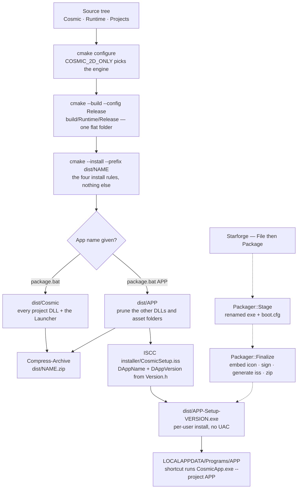

# Building & Shipping — Guide

**What this covers:** the two engine configurations and how to pick one; every CMake option the
build understands and what turning it off actually removes; what each of the ten root `.bat`
scripts really does; packaging (`cmake --install` staging → `dist/<Name>` prune → zip) and exactly
what a staged folder contains; the Inno Setup installer flow — both the hand-run one and the one
Starforge generates; the exe icon, the live window icon and `VERSIONINFO`; and how a shipped app
decides which project to boot and where it writes user data.
**Source of truth:** `CMakeLists.txt`, `Cosmic/CMakeLists.txt`, `Runtime/CMakeLists.txt`,
`CMakePresets.json`, the ten root `*.bat` scripts, `installer/CosmicSetup.iss`,
`installer/AppSetup.iss`, `Runtime/Main.cpp`, `Runtime/CosmicApp.rc`, `Runtime/Starforge.rc`,
`Runtime/CosmicApp.manifest`, `Cosmic/src/core/Version.h`, `Cosmic/src/utils/FileSystem.cpp`,
`Cosmic/src/utils/Branding.{h,cpp}`, `Cosmic/src/utils/ExeResources.h`,
`Projects/Starforge/src/Packager.{h,cpp}`
**API Reference:** [`../reference/assets-io.md`](../reference/assets-io.md) *(skeleton — D16;
`utils/ExeResources.h` and `utils/Branding.h` have **no manifest row** — see below)*
**How it works:** [`../systems/build-plugin-packaging.md`](../systems/build-plugin-packaging.md)
*(skeleton — D34)* and
[`../systems/build-2d-3d-split.md`](../systems/build-2d-3d-split.md) *(written)*
**Configuration:** **both.** Everything here works identically on the 3D and 2D engine builds —
choosing between them is one of the things this chapter is *about*.

> **This chapter is the client-facing source for `utils/ExeResources.h`.** That header is included
> by `Cosmic.h` directly and unfenced yet has no row in the
> [reference coverage manifest](../reference/README.md#coverage-manifest--every-public-header-maps-to-a-chapter)
> (one of the four found by D58). `utils/Branding.h` is worse: `COSMIC_API`-exported, called from a
> project DLL, and not included by `Cosmic.h` at all (found by D60). Until D5 closes those gaps,
> read this chapter and [`windowing-and-viewport.md`](windowing-and-viewport.md) for the branding
> half.

> **Windows x64 only.** Every script is a `.bat`, the packager shells out to PowerShell's
> `Compress-Archive`, `ExeResources::SetIcon` is `UpdateResource`, and the installer is Inno Setup.
> The CMake files carry a `-Wall -Wextra -std=c++20` else-branch for GCC/Clang, but nothing in the
> shipping path has ever been exercised off Windows.

---

## Quick start

Three commands cover almost everything:

```bat
build.bat                       :: incremental Debug build of everything — the everyday loop
package.bat SF_Telem            :: clean Release build -> dist\SF_Telem\ + dist\SF_Telem.zip
package_installer.bat SF_Telem  :: the same, plus dist\SF_Telem-Setup-0.9.0.exe
```

The first is covered on day one in [`getting-started.md`](getting-started.md#build-the-engine-and-every-project);
the canonical one-line list of every script, flag and option is root README
[§1.5](../../README.md#15-command-reference--every-command). **This chapter does not repeat either
list** — it explains what those commands *do to the build tree*, what they leave out, and where the
sharp edges are.

### DG-14 — from source tree to installed app



The dotted path is Starforge's in-editor packager. It produces the same shape of folder by a
different route — see [Two packagers, not one](#two-packagers-not-one).

---

## Choose a configuration before you build anything

Two axes, and they are independent:

| Axis | Values | Set by | Sticky? |
| --- | --- | --- | --- |
| **Engine configuration** | full 3D · 2D-only | `COSMIC_2D_ONLY` | **Yes** — lives in `build\CMakeCache.txt` |
| **Build configuration** | `Debug` · `Release` · `RelWithDebInfo` | `--config` at build time | No — multi-config generator |

The engine configuration is the one that bites, because it is sticky and invisible. `build.bat`,
`build_all.bat` and `build_engine.bat` **read** it out of the cache and echo `[MODE] 2D-only engine`
or `[MODE] full 3D engine` without ever changing it; only `build_2d.bat`, `build_3d.bat` and
`build_all_2d.bat` set it. The full comparison table lives in root README
[§1.6](../../README.md#16-the-two-engine-configurations) and the mechanism in
[`../systems/build-2d-3d-split.md`](../systems/build-2d-3d-split.md).

**`Release` is the distribution build.** There is no separate dist flag — that decision was made
per-config with generator expressions so it can never be left stale in a cache:

| Effect | Where |
| --- | --- |
| `COSMIC_DIST` defined → Launcher's project-generator UI compiled out | `Cosmic/CMakeLists.txt:246` — `$<$<CONFIG:Release>:COSMIC_DIST>` |
| `/SUBSYSTEM:WINDOWS` + `/ENTRY:mainCRTStartup` → **no console window** | `Runtime/CMakeLists.txt:34-37`, `:67-70` |
| `/O2` optimisation | MSVC's own Release defaults |
| `/Zi` + `/DEBUG /OPT:REF /OPT:ICF` → PDBs are still emitted and still usable | root `CMakeLists.txt:34-39` |

That last row is the one people get wrong: **Release does produce symbols.** The linker flags were
chosen specifically so a console-less shipped build still symbolises a crash dump. The PDBs simply
do not get *packaged* — no `install()` rule copies them.

If you want optimised code with the dev Launcher and a console, use **`RelWithDebInfo`**: it is not
`Release`, so the generator expression does not fire, so it is not a distribution build.

> **Release has no console at all** — not a hidden one. spdlog's console sink writes into the void
> and `std::cerr` from `Main.cpp`'s argument parser goes nowhere. In a Release build the log file
> under `user://logs` is your only output. See
> [`logging-and-diagnostics.md`](logging-and-diagnostics.md).

---

## The build scripts, and which one to reach for

Ten scripts in the repo root. They are thin: every one finds MSVC through `vswhere`, calls
`VsDevCmd.bat -arch=x64` if it finds it, then runs `cmake` and `cmake --build … --parallel`. What
distinguishes them is *which cache state they insist on*.

| Script | Configures with | Cache behaviour | Use when |
| --- | --- | --- | --- |
| `setup.bat` | — | — | Once per machine. `setx COSMIC_SDK <repo root>`. |
| `build.bat [cfg]` | `ENGINE_ONLY=OFF` | Reconfigures **only** if the cache says `ENGINE_ONLY=ON`; preserves the engine mode | The everyday command |
| `build_all.bat [cfg]` | `ENGINE_ONLY=OFF` (+ mode flag) | **Deletes `build/`**, then re-applies the mode it read *before* deleting | A glob went stale, or you want a known-clean tree |
| `build_all_release.bat` | `ENGINE_ONLY=OFF` | Deletes `build/`; pinned to `Release`; **does not preserve the 2D mode** | A clean Release you will run in place |
| `build_engine.bat [cfg]` | `ENGINE_ONLY=ON` | Reconfigures if the cache says `OFF`; builds only `Cosmic` + `CosmicApp` | Engine-core work |
| `build_2d.bat [cfg]` | `2D_ONLY=ON` | **Mode setter.** Reconfigures unless already 2D | Switching this tree to the 2D engine |
| `build_3d.bat [cfg]` | `2D_ONLY=OFF` | **Mode setter.** Reconfigures if the cache is absent or 2D | Switching back |
| `build_all_2d.bat [cfg]` | `2D_ONLY=ON` | Deletes `build/`, clean 2D configure | Clean 2D rebuild |
| `package.bat [App]` | `ENGINE_ONLY=OFF` | **Deletes `build/` *and* `dist/`**; always Release | Making something to hand over |
| `package_installer.bat <App>` | via `package.bat` | Same, plus ISCC | Making a setup exe |

Every script defaults to `Debug` and takes the configuration as `%1`; `build_all_release.bat` is the
one exception (pinned), and `setup.bat` / `package.bat` / `package_installer.bat` take no config
argument at all (`package*.bat` take an app name there instead). All of them `pause` at the end
**except `package_installer.bat`**, which is the only script in the set that is safe to drive from an
automated shell as-is. Set `COSMIC_NOPAUSE=1` to suppress `package.bat`'s pause (that is exactly what
`package_installer.bat` does before calling it); the build scripts have no such switch, so drive
`cmake` directly instead:

```bat
cmake --build build --config Release --parallel
```

**Two gaps worth knowing.** `build_all_release.bat` does *not* read the engine mode before deleting
`build/`, unlike `build_all.bat` — run it in a 2D tree and you get a clean **3D** Release. And two
projects (`Engine3DDemo`, `SF_Telem`) ship their own `Projects/<name>/build.bat` that configures a
**separate** CMake cache under `Projects/<name>/build/` against `%COSMIC_SDK%`; the other four do
not. That standalone path is for building a project outside the SDK tree — it links against the
already-built `Cosmic.lib` and never rebuilds the engine.

---

## Every CMake option

Root README [§1.5](../../README.md#15-command-reference--every-command) is the canonical one-line
table. This section is the *consequences* — what actually disappears, and what fails when it does.

### `COSMIC_2D_ONLY` (default `OFF`) — the engine configuration

Declared in **both** the root and `Cosmic/CMakeLists.txt` (line 67 and line 16). The duplicate is
deliberate: `option()` is a no-op once the cache entry exists, and declaring it in both places keeps
`Cosmic/` configurable standalone while letting the root forward it to the project scanner.

It is the **only** engine define that is `PUBLIC` on the `Cosmic` target
(`Cosmic/CMakeLists.txt:234`). Every other define — `COSMIC_BUILD_DLL`, `COSMIC_DIST`,
`COSMIC_WITH_JOLT`, `COSMIC_WITH_ASSIMP` — is `PRIVATE`. That is because public headers
(`Cosmic.h`, `Components.h`, `SceneRenderer.h`) carry `#ifndef COSMIC_2D_ONLY` fences, so the flag
has to resolve identically in the engine and in every consumer or the ABI silently diverges. It is
why `#ifndef COSMIC_2D_ONLY` works in your project code with no extra wiring.

Mechanically it does three things:

1. **Filters the engine source glob** — one `list(FILTER … EXCLUDE REGEX …)` per row of the
   partition table (`Cosmic/CMakeLists.txt:178-210`): the whole `terrain/`, `voxel/`, `water/`,
   `nav/` and `particles/` trees, five renderer TUs, four `graphics/` TUs, `NavigationCube`, five
   `scene/` TUs, `TypeRegistry3D` and `MeshImport.cpp`.
2. **Skips two vendored dependencies entirely** — assimp (159 TUs) and recastnavigation (26) are
   never `add_subdirectory`'d, which is the dominant term in the 2D build-time win.
3. **Changes the project skip-list default** to `Frontier;Engine3DDemo;ForgeIsle;ViperSim`.

### `COSMIC_BUILD_ENGINE_ONLY` (default `OFF`)

`ON` skips the whole `Projects/` scanner — no project DLLs, and (because the install rules live
*inside* the scanner loop) nothing project-shaped in a package either. `build_engine.bat` sets it.
Do not package from an engine-only tree: you get a Launcher with nothing to launch.

### `COSMIC_WITH_JOLT` (default `ON`)

Orthogonal to `COSMIC_2D_ONLY` — Jolt ships on **both** engine configurations, because rigid
bodies, box/sphere/capsule colliders and the character controller are dimension-agnostic. `OFF` is
a supported configuration, not a broken one: it drops `physics/backends/JoltBackend.cpp` from the
glob, does not link `Jolt`, and does not define `COSMIC_WITH_JOLT`, so `PhysicsBackend.cpp` defaults
the registry to `"null"` instead of `"jolt"`. Physics calls then succeed and do nothing until an app
registers its own `IPhysicsBackend`. See [`physics.md`](physics.md#swap-the-backend).

### `COSMIC_WITH_ASSIMP` (default `ON`)

Declared in `Cosmic/CMakeLists.txt:121` only. Gates FBX/OBJ/STL/DAE/PLY import; `OFF` leaves the
OBJ-only fallback. **The condition is `COSMIC_WITH_ASSIMP AND NOT COSMIC_2D_ONLY`** in three places
that must agree — the `add_subdirectory`, the `target_link_libraries` and the
`target_compile_definitions` — because in a 2D tree the `assimp` target does not exist and a bare
`assimp` in the link list would reach the linker as `assimp.lib`. So the option is silently ignored
in the 2D configuration. `MeshImport::AssimpEnabled()` reports the gate at runtime.

### `COSMIC_BUILD_TESTS` (default `ON`) and `COSMIC_BUILD_RENDER_TESTS` (default `OFF`)

`CosmicTests` builds by default and has **no install rule anywhere**, so it can never end up in a
package. `CosmicRenderTests` is the golden-image target: it opens a real window and compares GPU
output against committed PNGs, which makes it driver-specific and local-only. It runs under both
engine configurations (the 2D goldens are shared; the 3D ones are gated inside the target).

### `COSMIC_SKIP_PROJECTS` (default derived from the mode)

Semicolon-separated `Projects/` directory names the scanner skips. The default is mode-derived, and
the cache is sticky, so a stored value can go stale two ways: flipping `COSMIC_2D_ONLY` in an
existing tree, or an edit to the default in `CMakeLists.txt`. `COSMIC_SKIP_PROJECTS_APPLIED` (an
`INTERNAL` cache entry) remembers the default the tree last derived, so both cases are detected and
re-derived — while a **hand-set** list is left alone. If you set it by hand, it stays set.

### `COSMIC_SDK_DIR` — a `set(… CACHE PATH)`, not an `option()`

Defaults to the root `CMAKE_CURRENT_SOURCE_DIR`. Every target's output directory is
`${COSMIC_SDK_DIR}/build/Runtime/$<CONFIG>`, which is why **two binary directories in one source
tree clobber each other's `Cosmic.dll`** — use a git worktree for the other engine configuration,
not a second `build/` folder. Standalone project configures fall back to `$ENV{COSMIC_SDK}`, the
variable `setup.bat` sets.

### Presets

`CMakePresets.json` defines a hidden `base` (VS generator, x64, `binaryDir = <source>/build`,
`ENGINE_ONLY=OFF`) and two configure presets that differ in one cache variable:

```bash
cmake --preset default
```

```bash
cmake --preset 2d
```

They are exactly equivalent to `build_3d.bat` / `build_2d.bat`'s configure step, minus the build.

### Global compiler flags you inherit

Set once at root scope, ahead of every `add_subdirectory`, so they reach the engine, the projects,
the tests and the vendored dependencies alike:

- `/utf-8 /std:c++20` — `/std:c++20` is what activates concepts, `<bit>` and `<compare>` on MSVC.
- **`/MP`** — parallel compilation *within* each target. `cmake --build --parallel` does not cover
  this: on the Visual Studio generator it gives you parallel *projects*, and this build is a deep
  chain of few projects. Adding it cut a clean Release build by roughly 70 %.

> **Never express a global flag as `-DCMAKE_CXX_FLAGS=/MP`.** It *replaces* CMake's MSVC defaults
> (`/DWIN32 /D_WINDOWS /EHsc`), which silently disables exceptions — the observed symptom was 222
> doctest static-assert failures. Use `add_compile_options`.

> **The engine source list is globbed without `CONFIGURE_DEPENDS`.** Adding or removing a file under
> `Cosmic/src/` needs an explicit reconfigure; a plain rebuild will not notice it. `build_all.bat`
> is the blunt fix.

---

## Package a distributable

```bat
package.bat                 :: full SDK dist -> dist\Cosmic\  + dist\Cosmic.zip
package.bat SF_Telem        :: single app    -> dist\SF_Telem\ + dist\SF_Telem.zip
```

Four stages, and each one is destructive in a way worth knowing before you run it:

| Stage | What happens | Destructive? |
| --- | --- | --- |
| 1. Configure | `rmdir /s /q build` then `cmake .. -A x64 -DCOSMIC_BUILD_ENGINE_ONLY=OFF` | **Deletes your whole build tree** |
| 2. Build | `cmake --build . --config Release --parallel` | — |
| 3. Stage | `rmdir /s /q dist` then `cmake --install . --config Release --prefix dist\<Name>` | **Deletes all of `dist/`**, including other apps you staged earlier |
| 3b. Prune | single-app only: delete every `projects\*.dll` and `assets\projects\*` except the named one | — |
| 4. Zip | PowerShell `Compress-Archive` → `dist\<Name>.zip` | Warns and continues on failure |

Stage 1 failing, stage 2 failing and stage 3 failing each abort with an explicit `[ERROR]` and a
non-zero exit. Stage 4 is the only soft one: a zip failure prints `[WARN]` and leaves the staged
folder valid, which is what the installer flow actually consumes.

**Packaging always builds `Release`, and that is not a style choice** — only the Release CRT is
redistributable, and `include(InstallRequiredSystemLibraries)` with
`CMAKE_INSTALL_SYSTEM_RUNTIME_DESTINATION "."` is what puts `msvcp140.dll` & friends next to the
exe so the app runs on a machine with no VC++ redist installed.

**Note the sticky-cache interaction.** `package.bat` reconfigures from scratch *without* passing
`-DCOSMIC_2D_ONLY`, so it always packages the **3D** engine regardless of what the tree was in.
There is no `package_2d.bat`. To package a 2D app today, configure and install by hand:

```bat
cmake -S . -B build -A x64 -DCOSMIC_BUILD_ENGINE_ONLY=OFF -DCOSMIC_2D_ONLY=ON
cmake --build build --config Release --parallel
cmake --install build --config Release --prefix dist\MyApp
```

### Which `install()` rules exist

Only four, in three files. Everything in a package comes from one of them:

| Rule | Destination | File |
| --- | --- | --- |
| `install(TARGETS CosmicApp RUNTIME DESTINATION .)` | `<dist>/CosmicApp.exe` | `Runtime/CMakeLists.txt:74` |
| `install(TARGETS Cosmic RUNTIME/LIBRARY DESTINATION .)` | `<dist>/Cosmic.dll` | `Cosmic/CMakeLists.txt:304` |
| `install(DIRECTORY assets/ DESTINATION assets)` | `<dist>/assets/…` | `Cosmic/CMakeLists.txt:307` |
| per-project, inside the scanner loop | `<dist>/projects/<Name>.dll` and `<dist>/assets/projects/<Name>/` | root `CMakeLists.txt:171-178` |

Three consequences fall out of that list:

- **No import libraries.** Both `TARGETS` rules name `RUNTIME` and `LIBRARY` but not `ARCHIVE`, so
  `Cosmic.lib` and the project `.lib`/`.exp` files are never staged.
- **`StarforgeEditor` is not installed.** `Runtime/CMakeLists.txt` installs `CosmicApp` only, so a
  package has no `Starforge.exe` — but it *does* have `projects/Starforge.dll` (the editor is a
  project like any other), reachable as `CosmicApp.exe --project Starforge`.
- **Starforge's `branding/icon.png` is not installed either.** It reaches the dev tree through a
  `POST_BUILD` copy, not an install rule, and it lives outside `assets/`. A packaged app therefore
  falls through to the next candidate in the icon resolution order.

A project is installed **only if the scanner added it**, because the install rules live inside the
same `if()`. A skipped project is not built *and* not installed — which is the correct coupling, but
it means a 2D-configured tree silently cannot package `Frontier`.

---

## What a shipped folder actually contains

Verified against the staged output, not the install rules alone:

```
dist/Cosmic/
├── CosmicApp.exe                 ← the host (icon + VERSIONINFO + DPI manifest embedded)
├── Cosmic.dll                    ← the engine
├── msvcp140.dll  msvcp140_1.dll  msvcp140_2.dll
├── msvcp140_atomic_wait.dll  msvcp140_codecvt_ids.dll
├── vcruntime140.dll  vcruntime140_1.dll  concrt140.dll   ← the redistributable CRT set
├── assets/
│   ├── shaders/  fonts/  textures/  models/              ← engine assets  (engine://)
│   └── projects/<Name>/…                                 ← per-project assets (project://)
├── projects/
│   └── <Name>.dll                ← one per built project; the Launcher scans here
├── include/GLFW/glfw3.h  glfw3native.h                   ← ✗ should not be here
└── lib/glfw3.lib  lib/cmake/glfw3/*.cmake  lib/pkgconfig/glfw3.pc   ← ✗ should not be here
```

**Those last two rows are a real defect, not a documentation quirk.** GLFW is the only vendored
dependency added through its own `add_subdirectory` (every other one is an `add_library` we declare
ourselves, and those have no install rules). GLFW's `CMakeLists.txt` defaults `GLFW_INSTALL` to `ON`
and nothing in this tree turns it off, so `cmake --install` faithfully stages GLFW's public headers,
its static import library and its CMake package-config files into every distributable — roughly
2 MB of developer SDK in an end-user folder. The one-line fix is `set(GLFW_INSTALL OFF)` before
`add_subdirectory(dependencies/glfw)`. Until then, prune `include\` and `lib\` by hand if a clean
handover matters.

What is **not** there, and should not be: `.lib`/`.exp` for the engine or any project, `.pdb` files,
CMake build artifacts, `CosmicTests.exe`, `Starforge.exe`, `templates/`, `logs/` (created at
runtime, next to the exe or under `user://` — see below), or `boot.cfg` (only Starforge's packager
writes one).

A single-app dist is the same tree with `projects/` and `assets/projects/` pruned to one entry.

---

## Ship an installer

```bat
package_installer.bat SF_Telem
```

Five stages: read the version, locate ISCC, run `package.bat <App>`, compile the script, done.

- **Version** comes from `Cosmic/src/core/Version.h` — a `findstr` for
  `#define COSMIC_VERSION_STRING`, taking token 3. Reformat that line and the version silently reads
  `0.0.0`. It is the single source of truth and three files must be bumped together (see
  [Version numbers](#version-numbers)).
- **ISCC** is probed at `%ProgramFiles(x86)%\Inno Setup 6\ISCC.exe`, then `%ProgramFiles%`, then
  `where ISCC`. Not found → hard exit with a link to the download. Get it from
  [jrsoftware.org/isinfo.php](https://jrsoftware.org/isinfo.php).
- **The script** is `installer/CosmicSetup.iss`, invoked as
  `ISCC /DAppName=<App> /DAppVersion=<ver>`. Output: `dist\<App>-Setup-<ver>.exe`.

What that installer produces on the target machine:

| Setting | Value | Consequence |
| --- | --- | --- |
| `PrivilegesRequired=lowest` | per-user | **No UAC prompt**; `{autopf}` resolves to `%LOCALAPPDATA%\Programs` |
| `[Files]` | `recursesubdirs createallsubdirs ignoreversion` | the whole staged folder, verbatim |
| `[Icons]` | `CosmicApp.exe` with `Parameters: --project <App>` | desktop + Start menu; boots straight into the app |
| `ArchitecturesAllowed=x64compatible` | x64 | refuses to install on x86 |
| `UninstallDisplayIcon` | `{app}\CosmicApp.exe` | normal Settings → Apps uninstall entry |

The desktop shortcut carries `--project <App>` rather than relying on a `boot.cfg`, and that one
detail changes where user data lands — see [Where a shipped app writes](#where-a-shipped-app-writes).

The end-to-end walkthrough, including what a *recipient* hits (SmartScreen, antivirus) and the
five-minute release acceptance check, is [`../installer-guide.md`](../installer-guide.md).

### Two packagers, not one

There are two independent paths to a shipped app, and they differ in ways that matter:

| | `package_installer.bat` + `CosmicSetup.iss` | Starforge ▸ File ▸ Package (`Packager.cpp`) |
| --- | --- | --- |
| Exe | `CosmicApp.exe`, unchanged | copied and **renamed** to `<App>.exe` |
| Boot | shortcut passes `--project <App>` | **`boot.cfg`** written next to the exe |
| Icon | whatever `Runtime/app.ico` was compiled in | `ExeResources::SetIcon` **re-embeds** your PNG into the copied exe |
| Content | `cmake --install` rules | direct file copy, skipping `build`, `.git`, `.starforge`, `src`, `CMakeLists.txt`, `.vs`, `.gitignore` |
| Script | the checked-in `installer/CosmicSetup.iss` | **generates** `dist/<App>.iss`, self-contained (no `/D` defines) |
| Compile | ISCC probed in Program Files | `where iscc` on `PATH` only; otherwise writes the script and warns |
| Signing | not wired | `signtool sign /fd SHA256 /f <cert>` hook, skipped with a log when no cert is set |
| Zip | `dist\<App>.zip` | `dist\<App>-<version>.zip` |

`installer/AppSetup.iss` is the checked-in *reference* form of what Starforge generates — compile it
by hand with `ISCC /DAppName=MyRover /DAppVersion=0.9.0 installer\AppSetup.iss`. Starforge
self-packages through the same path: the editor is just a project named `Starforge`.

> **Both `AppSetup.iss` and Starforge's generated script register a `.cham` file association**
> pointing at `<App>.exe --replay "%1"`, and **that association cannot work.** `Main.cpp` parses
> `--replay`, `_putenv_s`es the path into `COSMIC_REPLAY_FILE` — and a tree-wide grep for that
> variable returns only those two lines. Nothing reads it. Worse, the engine never writes a `.cham`
> file: `DataRecorder::Flush` writes `scene.bin` + `<name>.csv`, and `DataPlayer::Load` accepts a
> directory or a `.bin` path. Leave the `[Registry]` section out unless you are also fixing both
> halves.

---

## Where a shipped app writes

`user://` resolves once, lazily, in `FileSystem::GetUserDataRoot()`, and the decision has two inputs:
whether an **app identity** was set, and whether the **exe directory is writable** (probed by
creating and deleting `.cosmic_write_probe` in the working directory, which `Main.cpp` has already
forced to the exe's own folder).

| Identity | Exe dir writable (or `portable.txt` present) | `user://` resolves to |
| --- | --- | --- |
| set (`boot.cfg`) | yes | `<exe dir>/user/` |
| set (`boot.cfg`) | no | `%LOCALAPPDATA%\<AppName>\` |
| **not set** (`--project`, Launcher, `COSMIC_STARTUP_PROJECT`) | yes | `<exe dir>` itself |
| **not set** | no | `%LOCALAPPDATA%\Cosmic\` |

The identity is set **only** from `boot.cfg` (`Main.cpp:100-101`) — explicitly not from `--project`
and not from a compiled-in `COSMIC_STARTUP_PROJECT`, so dev boots keep the shared root.

Two consequences that contradict what the installer scripts' own comments claim:

- **A `package_installer.bat` app never gets per-app isolation.** Its shortcut uses `--project`, so
  the identity stays empty and `user://` is the flat `%LOCALAPPDATA%\Cosmic` root shared with every
  other non-`boot.cfg` boot — not `%LOCALAPPDATA%\Cosmic\<ProjectName>`.
- **A per-user install directory is writable**, so in practice the probe succeeds and both installed
  flavours run in *portable* mode: data lands under `%LOCALAPPDATA%\Programs\<App>\` (flat for the
  `--project` flavour, in a `user/` subfolder for the `boot.cfg` flavour), not under
  `%LOCALAPPDATA%`. `CosmicSetup.iss`'s header comment ("goes to `%LOCALAPPDATA%\Cosmic` … NOT into
  `{app}`") describes the intent, not the behaviour.

The engine logs the answer on every boot — `Main.cpp:137` prints
`user:// root -> <path>` immediately after construction. In a Release build that line is in the log
file, not on a console. When in doubt, read it rather than reasoning about the table.

### Which project boots

`Main.cpp` picks a startup project by first hit, in this order:

1. `--project <NameOrDll>` (or `--project=<NameOrDll>`) — a bare name, a DLL name, or an absolute
   path. Resolved against `<exe dir>/projects/` first, then `<exe dir>`, then as an absolute path.
2. `boot.cfg` next to the exe — first non-empty, non-`#` line. **This is the only path that sets the
   app identity.**
3. `COSMIC_STARTUP_PROJECT`, compiled in via `target_compile_definitions` — this is what makes
   `Starforge.exe` a distinct app rather than a shortcut with a flag.
4. Nothing → the **Launcher**.

A `--project` that does not resolve logs an error and falls back to the Launcher; it is never a dead
exe. Any unrecognised argument is reported on stderr and ignored.

The AppUserModelID is derived from the same decision (`"Cosmic." + stem`, sanitised to
`[A-Za-z0-9._-]`, truncated to 127 chars) so each shipped app gets its own taskbar grouping instead
of every boot stacking as one anonymous host.

---

## Brand the exe

Four separate mechanisms, easy to confuse, all live at once:

| What you see | Source | Changed by |
| --- | --- | --- |
| **Explorer / taskbar-pin / Alt-Tab exe icon** | `IDI_ICON1` in `Runtime/CosmicApp.rc` → `app.ico` | replace `Runtime/app.ico`, rebuild; or `ExeResources::SetIcon` post-build |
| **Live window + taskbar icon** | `GLFW_ICON` named resource in the same `.rc` — GLFW looks it up itself, no `glfwSetWindowIcon` call | same file; or `Window::SetIcon` at runtime |
| **Runtime logo / re-brandable icon** | `Branding::ResolveIcon` — first hit of `<exe>/branding/icon.png`, `user://branding/icon.png`, the manifest icon, `project://icon.png` | drop a PNG on disk; a running editor hot-swaps it |
| **Properties → Details** | `VERSIONINFO` block in the `.rc` | edit the `.rc`; keep it in sync with `Version.h` |

Both hosts embed the *same* `app.ico` today; `Starforge.rc` differs only in its `VERSIONINFO`
strings (`FileDescription "Starforge — Cosmic Engine Editor"`, `OriginalFilename "Starforge.exe"`,
`ProductName "Starforge"`). Point it at a dedicated `.ico` to give the editor its own mark — no code
changes needed.

`Runtime/CosmicApp.manifest` is embedded into **both** hosts (`Runtime/CMakeLists.txt:8` and `:51`)
by CMake's automatic `mt.exe` handling. It declares `PerMonitorV2` DPI awareness — the
Windows-correct declaration, made before any of our code runs, so the first frame is never
DWM-scaled — and `longPathAware`, which lifts `MAX_PATH` for deep asset and recording paths.

Starforge's packager takes the fourth route: `ExeResources::SetIcon(exe, png)` rewrites the icon
group **in the copied exe** with `UpdateResource`, which is why it runs *before* code signing (the
rewrite would invalidate a signature).

### Version numbers

`Cosmic/src/core/Version.h` is the single source of truth (`COSMIC_VERSION_MAJOR/MINOR/PATCH` and
`COSMIC_VERSION_STRING`). Three consumers must be bumped with it, and only one of them is automatic:

| Consumer | Kept in sync how |
| --- | --- |
| `installer/CosmicSetup.iss` | **automatic** — `package_installer.bat` `findstr`s the header and passes `/DAppVersion` |
| `Runtime/CosmicApp.rc` | **by hand** — `FILEVERSION`, `PRODUCTVERSION`, and the two string values |
| `Runtime/Starforge.rc` | **by hand** — same four places |

Grep for `COSMIC_VERSION` when bumping; the header says so and it is the only protection there is —
and note that **`Version.h`'s own "KEEP IN SYNC" list names only `CosmicApp.rc` and
`CosmicSetup.iss`.** `Starforge.rc` was added later and is missing from it, so following the header
literally leaves the editor's Explorer version behind. Starforge's in-editor packager sidesteps this
entirely: `PackageInputs::Version` defaults to the string `"0.9.0"` in `Packager.h`, hard-coded and
unconnected to `Version.h`.

---

## Common patterns

**Hand something over without an installer.** `package.bat <App>` and send the zip. It is
self-contained: unzip anywhere, double-click `CosmicApp.exe`, pick the app from the Launcher — or
add a `boot.cfg` containing the project name so it boots straight in and gets its own `user://`.

**Ship the editor.** Starforge is a project, so it packages like one. `package.bat Starforge` gives
you the editor plus its templates; its `branding/icon.png` will *not* come along (no install rule),
so add it to the staged folder by hand if you want the molten-orange mark.

**Test a package without a second machine.** Rename `%LOCALAPPDATA%\Cosmic` out of the way, unzip
into a directory you have not built in, and run from there. The two things that actually differ on a
clean machine are the VC++ runtime (bundled, so fine) and `user://` resolution (which the boot log
line tells you).

**Keep both engine configurations packageable.** Use the worktree from README
[§1.6](../../README.md#16-the-two-engine-configurations) and run the manual three-command install
above in the 2D tree. `package.bat` cannot do it for you.

**Automate around the `pause`.** None of these scripts are CI-friendly as written. Call `cmake`
directly for builds and `cmake --install` for staging; the scripts are convenience wrappers, not the
interface.

---

## Pitfalls

**"I built 2D but I'm getting 3D binaries" (or the reverse).** The mode lives in the sticky CMake
cache, not in the command you just typed. `build.bat` preserves it and prints it. Read the `[MODE]`
line; if it disagrees with you, run `build_2d.bat` / `build_3d.bat`, not `build.bat`.

**`build_all_release.bat` silently switches a 2D tree back to 3D.** Unlike `build_all.bat`, it does
not read the mode before deleting `build/`. Use `build_2d.bat Release` (incremental) or configure by
hand.

**`package.bat` deleted my other staged app.** Stage 3 does `rmdir /s /q dist` before installing —
the *whole* `dist/` folder, not just the target one. Copy anything you care about out first.

**My new engine source file isn't in the build.** The glob has no `CONFIGURE_DEPENDS`. Reconfigure
(`build_all.bat`, or `cmake -S . -B build`).

**`[ERROR] Project DLL "<App>.dll" was not produced by the build!`** Three causes, in order of
likelihood: the project directory name differs from its CMake target name (the packaging rule
assumes they match); the project is on `COSMIC_SKIP_PROJECTS` for this engine mode; or it simply
failed to compile — scroll up past the prune stage to the Release build log.

**The version reads `0.0.0`.** `package_installer.bat` parses `Version.h` with `findstr` and takes
whitespace token 3. Keep the line shaped exactly `#define COSMIC_VERSION_STRING "x.y.z"`.

**The installer built, but the app opens the Launcher instead of my app.** The shortcut's
`--project <Name>` did not resolve — `projects\<Name>.dll` is missing from the install. Check the
prune stage's output, then the staged folder.

**A recipient sees "Windows protected your PC".** The exe is unsigned and low-reputation.
*More info → Run anyway*. Signing is a hook in Starforge's packager (`signtool`), unwired in the
`.bat` path, and no certificate is configured. Same root cause when antivirus quarantines the
download.

**The packaged folder has `include/` and `lib/` in it.** That is GLFW's install rules leaking, not
something you did — see [what a shipped folder contains](#what-a-shipped-folder-actually-contains).

**Assets are missing from the package but present in the dev tree.** The dev tree is populated by
`POST_BUILD` copy commands; the package is populated by `install()` rules. They are different
mechanisms with different coverage — anything outside `Cosmic/assets/` or
`Projects/<Name>/assets/` (Starforge's `branding/`, for instance) exists only in the dev tree.

**No console output from a Release build.** By design — `/SUBSYSTEM:WINDOWS`. Read
`user://logs`. If you want an optimised build *with* a console and the dev Launcher, build
`RelWithDebInfo`.

**Debug asserts will not save you.** `CS_ASSERT` / `CS_CORE_ASSERT` are gated on `GLCORE_DEBUG` or
`CS_DEBUG`, and **neither symbol is defined by any target in this tree** — so they are compiled out
in *every* configuration, Debug included. Do not choose Debug expecting contract checks to fire.

**Never benchmark in Debug.** MSVC iterator debugging plus no optimisation puts hot loops 5–10×
off. Measure in `Release` (or `RelWithDebInfo` if you need the Launcher).

---

## See also

- [`getting-started.md`](getting-started.md) — day-one setup, `setup.bat`, first build, first run
- [`project-anatomy.md`](project-anatomy.md) — the plugin-DLL model the packaging layout exists to
  serve, and **DG-5**, the load/unload lifecycle
- Root README [§1.5](../../README.md#15-command-reference--every-command) — the canonical
  command/flag/option list · [§1.6](../../README.md#16-the-two-engine-configurations) — the
  configuration comparison
- [`../installer-guide.md`](../installer-guide.md) — the end-to-end ship-and-install walkthrough,
  including recipient-side troubleshooting and the release acceptance check
- [`../systems/build-2d-3d-split.md`](../systems/build-2d-3d-split.md) — the full exclusion table,
  the classification rule for new code, and the recorded build times
- [`../systems/build-plugin-packaging.md`](../systems/build-plugin-packaging.md) *(skeleton — D34)*
  — where the architecture-level "why" will live
- [`windowing-and-viewport.md`](windowing-and-viewport.md) — `Window::SetIcon`, the drop-a-file
  branding convention, DPI
- [`assets-and-vfs.md`](assets-and-vfs.md) — `engine://` / `project://` / `user://` in full
- [`logging-and-diagnostics.md`](logging-and-diagnostics.md) — where the log file is and what is in
  it when there is no console
