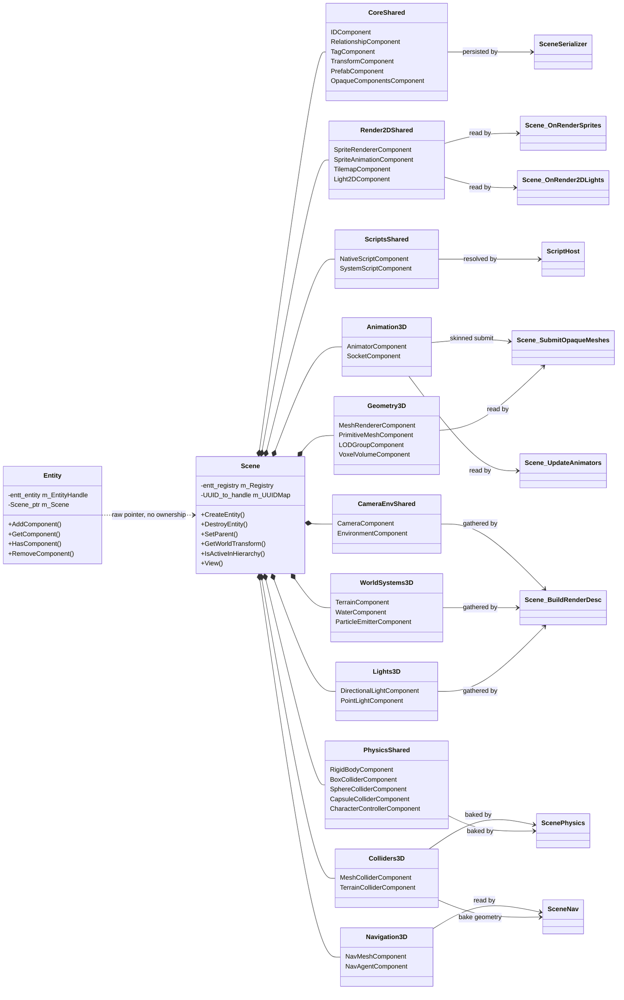

# Entities & Components — Guide

**What this covers:** the entity handle and what it really is; the **complete catalogue of all 34
built-in components** with fields, units, defaults and *who reads them*; what a 2D build sees;
parent/child hierarchy; the two independent off-switches (`Active` and per-component `Enabled`);
querying; the `System` / `ParallelSystem` tier; and the contract for **what the engine draws for you
automatically**.
**Source of truth:** `Cosmic/src/scene/Entity.h`, `scene/Scene.{h,cpp}`, `scene/Scene3D.cpp`,
`scene/Components.h`, `scene/Components3D.h`, `scene/System.h`, `scene/ComponentRegistry.h`,
`reflect/TypeRegistry{,3D}.cpp`, `jobs/ParallelSystem.h`, `jobs/SystemQuery.h`,
`physics/ScenePhysics.cpp`, `scripting/ScriptHost.cpp`
**API Reference:** [../reference/ecs.md](../reference/ecs.md) ·
[../reference/physics.md](../reference/physics.md) · **How it works:**
[../systems/ecs-scene.md](../systems/ecs-scene.md)
**Configuration:** both — **19** of the 34 built-in components exist in every build; **15** are 3D
only. See [What a 2D build sees](#what-a-2d-build-sees) and
[../systems/build-2d-3d-split.md](../systems/build-2d-3d-split.md).

A Cosmic scene is a table. Each **entity** is a row with no columns of its own; each **component
type** is a column that only exists for the rows that opted into it. Nothing about an entity is
inherited, virtual, or subclassed — you compose behaviour by attaching data, and the engine's own
passes find that data by asking "which rows have a `MeshRendererComponent`?"

The important consequence, and the reason this chapter is long: **a large part of the engine is
driven by components you never call into.** Attach a `PointLightComponent` and the 3D pass lights
with it. Attach a `TerrainComponent` with `UseRecipe` set and the render path builds the terrain the
first time it runs. Attach a `RigidBodyComponent` and a collider and a body appears when Play
starts. The catalogue below names the consumer for every single component, so you know both what to
attach and what *not* to draw by hand.

---

## Quick start

```cpp
#include <Cosmic.h>

Cosmic::Ref<Cosmic::Scene> scene = Cosmic::Scene::Create();

// CreateEntity always emplaces three components: IDComponent (fresh UUID),
// TransformComponent and TagComponent.
Cosmic::Entity crate = scene->CreateEntity("Crate");

auto& transform = crate.GetComponent<Cosmic::TransformComponent>();
transform.Position = { 0.0f, 1.0f, -4.0f };
transform.Rotation = { 0.0f, 30.0f, 0.0f };   // Euler DEGREES
transform.Scale    = { 1.0f, 1.0f, 1.0f };    // vec3 since S4.3

// A parametric box: store the shape, not the mesh. The render path rebuilds
// the sibling MeshRendererComponent's mesh whenever the parameters change.
auto& prim = crate.AddComponent<Cosmic::PrimitiveMeshComponent>();
prim.ShapeType = Cosmic::PrimitiveMeshComponent::Shape::Box;
prim.Size      = { 1.0f, 1.0f, 1.0f };

auto& mesh = crate.GetOrAddComponent<Cosmic::MeshRendererComponent>();
mesh.Color = { 0.8f, 0.5f, 0.2f, 1.0f };      // Lambert tint (no material assigned)

// Make it fall. A body needs a RigidBody + at least one collider.
crate.AddComponent<Cosmic::RigidBodyComponent>(Cosmic::MotionType::Dynamic);
crate.AddComponent<Cosmic::BoxColliderComponent>();   // HalfExtents default to 0.5
```

Nothing else is required. Once a host renders this scene — the editor viewport, `PlayerLayer` in a
packaged game, or your own layer calling `Scene::OnRender3D` — the crate draws, casts a shadow, and
falls onto whatever else has a collider.

---

## The entity handle

`Cosmic::Entity` is **not** an object that owns anything. It is a 16-byte value type: an
`entt::entity` integer plus a raw `Scene*` (`scene/Entity.h:152`). Copy it freely, pass it by value,
store it in a `std::vector`. Everything it does is a forwarded call into the scene's
[EnTT](https://github.com/skypjack/entt) registry.

```cpp
template<typename T, typename... Args> T&   AddComponent(Args&&...);
template<typename T, typename... Args> T&   GetOrAddComponent(Args&&...);
template<typename T>                   T&   GetComponent();
template<typename T>                   bool HasComponent() const;
template<typename T>                   void RemoveComponent();
operator bool() const;                    // valid + scene-bound + still alive
operator entt::entity() const;
operator uint32_t() const;
```

### The four things that surprise people

**1. `AddComponent<T>()` on a component you already have does not fail.** It logs a core warning and
returns the existing component untouched — the guard exists because forwarding a second `emplace` to
EnTT trips a sparse-set assertion and aborts the process. Use `GetOrAddComponent<T>()` when
"add if missing" is what you actually mean; it does the same thing silently.

**2. `GetComponent<T>()` on a component you do *not* have is unchecked in practice.** The
`CS_ASSERT` in `Entity::GetComponent` is compiled out in **every** configuration: `core/Core.h:61`
gates `CS_ENABLE_ASSERTS` on `GLCORE_DEBUG || CS_DEBUG`, and neither symbol is defined anywhere in
the tree. What actually fires is EnTT's own `ENTT_ASSERT` inside the component pool — which is a
plain `assert()`, so it aborts in a **Debug** build and compiles away under `NDEBUG` in **Release**,
where the read is undefined behaviour. Guard with `HasComponent<T>()`, or use
`GetRegistry().try_get<T>(handle)` which returns `nullptr` cleanly:

```cpp
if (auto* rb = scene->GetRegistry().try_get<Cosmic::RigidBodyComponent>((entt::entity)e))
    rb->GravityFactor = 0.0f;
```

**3. Adding a component can invalidate references to other components of the same type.** Any
`emplace` may reallocate that type's pool. This is safe:

```cpp
auto& a = e1.AddComponent<Cosmic::PointLightComponent>();
auto& b = e2.AddComponent<Cosmic::PointLightComponent>();   // `a` may now dangle
a.Intensity = 2.0f;                                         // ← undefined
```

Re-fetch after any structural change. `Scene::SetParent` is written this way on purpose
(`Scene.cpp:288`): it emplaces both `RelationshipComponent`s *before* taking any reference.

**4. Empty (tag) components share one instance.** For a `T` where `std::is_empty_v<T>` — such as
`SelectableComponent` or `TerrainColliderComponent` — EnTT stores no data at all, so `AddComponent`
and `GetComponent` return a reference to a process-lifetime static sentinel. Presence is the entire
signal; never write through the reference expecting per-entity storage.

### Validity and dangling handles

```cpp
Cosmic::Entity e = scene->CreateEntity("Temp");
scene->DestroyEntity(e);
if (e) { /* not taken — operator bool re-checks registry.valid() */ }
```

`operator bool` checks all three conditions (non-null scene, non-null handle, live registry slot),
so a stale copy evaluates to `false` rather than silently aliasing a recycled slot. It does **not**
protect `GetComponent` — see point 2. Discard handles after `DestroyEntity`.

`Scene::DestroyEntity(entity, destroyChildren = true)` destroys the whole subtree by default; pass
`false` to orphan the children instead (their `Parent` link is cleared). Either way the entity is
detached from its own parent's `Children` list and dropped from the UUID index.

> **Create entities through the scene, not the registry.** `Scene::CreateEntity` /
> `CreateEntityWithUUID` are what populate `m_UUIDMap`. An entity you conjure with
> `GetRegistry().create()` has no `IDComponent`, is invisible to `FindByUUID`, and cannot take part
> in the hierarchy (parent links are UUIDs, not handles).

---

## DG-9 — Scene, registry, entity, components

Who owns what, and which pass consumes which family. Component families are grouped; the full
per-component consumer list is the [catalogue](#the-component-catalogue).



---

## The component catalogue

Every built-in component, grouped the way the headers group them. **19 live in
`scene/Components.h`** (present in both engine configurations) and **15 in `scene/Components3D.h`**
(3D configuration only).

**How to read these tables.** *Default* is the value in the header — that is what you get from
`AddComponent<T>()`. *Read by* names the code that actually consumes the component; if nothing is
listed, nothing in the engine reads it and it is yours to interpret. Fields marked **runtime** are
not reflected: they are neither shown in the Inspector nor written to a `.cscene`, and the engine
recomputes them. Fields marked **hidden** are reflected (so they serialize) but deliberately absent
from the Inspector's field list.

### Core — identity and structure

#### `IDComponent` — stable 64-bit identity

| Field | Type | Default | Meaning |
| --- | --- | --- | --- |
| `ID` | `UUID` | fresh random | Stable identity across save/load |

Emplaced by `Scene::CreateEntity`. **Not reflected** — the serializer writes it as the per-entity
`"id"` key, not as a component block. **Read by** `Scene::FindByUUID` (the UUID index),
`RelationshipComponent` links, `EntityRef` fields, `PrefabComponent`, `ScenePhysics`
(`BodyDesc::EntityId`, which is how contact events map back to entities). There is no
`Entity::GetUUID()` helper — read `GetComponent<IDComponent>().ID.Value()`.

#### `RelationshipComponent` — parent/child links

| Field | Type | Default | Meaning |
| --- | --- | --- | --- |
| `Parent` | `UUID` | `0` (root) | Back-link; `0` means no parent |
| `Children` | `std::vector<UUID>` | empty | Ordered, authoritative child list |

Present **only** on entities that participate in a hierarchy. **Not reflected**; the serializer
handles it structurally. **Read by** `Scene::WorldOf` / `GetWorldTransform`,
`IsActiveInHierarchy`, `IsAncestor`, `DestroyEntity`, `Scene::FindAnimatorFor`,
`ScenePhysics::WriteBackWorldPose`. **Mutate only through `Scene::SetParent`** — see
[Parent and child](#parent-and-child).

> `Parent` must default to `UUID(0)`. A default-constructed `UUID` is **random**, so a
> hand-emplaced `RelationshipComponent{}` with an uninitialised parent would point at nothing and
> silently detach the entity.

#### `TagComponent` — name + the per-entity active flag

| Field | Type | Default | Meaning |
| --- | --- | --- | --- |
| `Tag` | `std::string` | `"GenericEntity"` | Display name; the Hierarchy label |
| `Active` | `bool` | `true` | **hidden**, omit-if-true. Per-entity enable (T13) |

Reflected as `Tag` / `Tag.Active`. `Active` is driven by the Hierarchy panel's eye toggle rather
than an Inspector row, and is omitted from serialization while `true` so unchanged scenes stay
byte-identical. **Read by** `Scene::IsActiveInHierarchy`, which nearly every pass consults — see
[Turning things off](#turning-things-off).

#### `TransformComponent` — placement

| Field | Type | Default | Units | Meaning |
| --- | --- | --- | --- | --- |
| `Position` | `vec3` | `{0,0,0}` | world units (metres in 3D) | Local translation |
| `Rotation` | `vec3` | `{0,0,0}` | **degrees** | Euler X, Y, Z; Z is 2D roll |
| `Scale` | `vec3` | `{1,1,1}` | multiplier | Per-axis scale |
| `RotationQuat` | `quat` | identity `(w,x,y,z)` | — | Used only when `UseQuatRotation` |
| `UseQuatRotation` | `bool` | `false` | — | Switches `GetTransform()` to the quaternion |

`GetTransform()` returns `T · R · S`, where `R` is either `mat4_cast(RotationQuat)` or the
`X·Y·Z` Euler product.

> **The two rotation representations are independent — writing one does not sync the other.**
> Pick one per entity. There are no Euler↔quat helpers on the component; conversion is deferred
> until an editor needs it.
>
> Two engine paths flip `UseQuatRotation` to `true` behind your back:
> `ScenePhysics::WriteBackWorldPose` (every dynamic body and character, every fixed step) and
> `Scene::SetParent(..., keepWorldPose = true)`. After either, the Euler `Rotation` field is stale
> and ignored. Read the pose you care about from `GetWorldTransform`, not from `Rotation`.

**Read by** effectively everything. Note the split: the **3D** submit paths compose the full
hierarchy through `Scene::WorldOf`, while the **2D** paths (`OnRenderSprites`, `OnRender2DLights`,
tilemaps) deliberately use the **raw** `TransformComponent`. See
[the hierarchy caveat](#hierarchy-does-not-apply-to-2d-draws).

#### `PrefabComponent` — "this subtree came from a prefab"

| Field | Type | Default | Meaning |
| --- | --- | --- | --- |
| `SourcePath` | `std::string` | `""` | e.g. `"project://prefabs/Foo.cprefab"`, an `AssetPath("prefab")` slot |

No per-field override tracking in v1 — an instance is a plain detached copy that remembers where it
came from. **Read by** the editor's "Revert to Prefab". Prefabs themselves are
[`scenes-and-serialization.md`](scenes-and-serialization.md)'s topic.

#### `OpaqueComponentsComponent` — forward-compatibility store

| Field | Type | Default | Meaning |
| --- | --- | --- | --- |
| `Blocks` | `vector<pair<string,string>>` | empty | `(component name → verbatim JSON text)` |

You never attach this by hand. When a scene loads a component block whose type is not registered in
this build, the serializer parks the raw JSON here and re-emits it unchanged on save. It is the
reason a 3D scene can be opened, edited and saved by a 2D editor without losing a single 3D block.
**Read by** `SceneSerializer` only. **Not reflected.**

### 2D renderables — shared, and the only renderables a 2D build has

#### `SpriteRendererComponent`

| Field | Type | Default | Meaning |
| --- | --- | --- | --- |
| `ActiveMaterial` | `Ref<Material>` | `nullptr` | **runtime**. Legacy material path |
| `Color` | `vec4` | `{1,1,1,1}` | Tint, or the flat quad colour when untextured |
| `FlipX` / `FlipY` | `bool` | `false` | Applied as negative draw scale |
| `SourceRect` | `vec4` | `{0,0,1,1}` | Sampled sub-rect in **normalized UV** `{u0,v0,u1,v1}`, V top-left origin |
| `PixelsPerUnit` | `float` | `100.0` | Texels per world unit |
| `ZOrder` | `int32` | `0` | Primary painter key within the 2D pass |
| `TexturePath` | `std::string` | `""` | `AssetPath("texture")`; the modern path |
| `YSort` | `bool` | `false` | Within a `ZOrder`, sort by `-Position.y` instead of `Position.z` |
| `Enabled` | `bool` | `true` | **hidden**, omit-if-true. `false` skips the sprite |
| `Resolved`, `ResolvedPath` | `Ref<Texture2D>`, `string` | — | **runtime**. Lazy texture cache |

Sizing rule (`SpriteRendererComponent::WorldSize`, a pure static shared by the draw and by editor
picking): textured → `(SourceRect texels / PixelsPerUnit) × Transform.Scale.xy`; untextured → the
scale *is* the size. Draw precedence is `TexturePath` → `ActiveMaterial` → flat `Color`.

**Read by** `Scene::BuildSpriteDrawList` and `Scene::OnRenderSprites`; also
`Scene::UpdateSpriteAnimations` (which overwrites `SourceRect`) and the legacy
`Scene::OnRender`.

#### `SpriteAnimationComponent` — flipbook

| Field | Type | Default | Meaning |
| --- | --- | --- | --- |
| `SheetPath` | `std::string` | `""` | `AssetPath("texture")` — the sprite sheet |
| `FrameW` / `FrameH` | `int32` | `16` / `16` | Cell size in **texels** |
| `Frames` | `int32` | `1` | Number of cells played along `Row` |
| `Row` | `int32` | `0` | 0-based row; **row 0 is the TOP of the sheet** |
| `FPS` | `float` | `8.0` | Playback rate |
| `Playing` | `bool` | `true` | Advance the clock |
| `Loop` | `bool` | `true` | Wrap vs clamp to the last frame |
| `Elapsed` | `float` | `0.0` | **runtime**. Accumulated seconds |

Two pure statics are exposed and headless-tested: `SelectFrame(elapsed, fps, frames, loop)` and
`FrameUV(texW, texH, frameW, frameH, row, frame)`.

**Read by** `Scene::UpdateSpriteAnimations`, which writes the frame's UV into the sibling
`SpriteRendererComponent::SourceRect`. It needs a `SpriteRendererComponent` on the same entity and
the sheet must resolve for its pixel size; if the texture is unavailable the sprite keeps its last
`SourceRect`.

#### `TilemapComponent` — tile grid

| Field | Type | Default | Meaning |
| --- | --- | --- | --- |
| `TilesetPath` | `std::string` | `""` | `AssetPath("texture")` — the tile atlas |
| `TileW` / `TileH` | `int32` | `16` / `16` | Atlas tile size in texels |
| `Columns` | `int32` | `0` | Atlas columns; `0` derives from texture width / `TileW` |
| `GridW` / `GridH` | `int32` | `32` / `32` | Map size in cells, clamped to `1..kMaxGrid` (1024) |
| `ZOrder` | `int32` | `0` | Painter key, shared with sprites |
| `Cells` | `vector<uint16>` | empty | **not reflected** — row-major `[y*GridW + x]`, `y = 0` is the bottom row. `0` = empty, `v > 0` = atlas tile `v - 1` |
| `Resolved`, `ResolvedPath` | — | — | **runtime**. Lazy atlas cache |

World mapping: **one cell = one world unit**, the entity's `Position` is the map's **bottom-left**
corner, cells grow +X/+Y. Entity rotation and scale are ignored in v1. Helpers: `EnsureCells()`
(clamp + resize), `InBounds`, `At`, and the pure static `FloodFill` shared by the editor's fill tool
and its tests.

`Cells` is serialized by a `SceneSerializer` special case as a plain integer array (diff-friendly),
not as a reflected field. **Read by** `BuildSpriteDrawList` / `OnRenderSprites`, which walk only the
cells inside the camera's world rect and build one `SubTexture2D` per distinct tile id per draw.

> `TilemapComponent` has **no `Enabled` field**. Unlike sprites, the only way to switch a tilemap
> off is the entity's `Active` flag.

#### `Light2DComponent` — additive 2D point light

| Field | Type | Default | Units | Meaning |
| --- | --- | --- | --- | --- |
| `Color` | `vec3` | `{1, 0.85, 0.6}` | linear RGB | Warm campfire default |
| `Radius` | `float` | `4.0` | world units | Reach |
| `Intensity` | `float` | `1.5` | HDR | Brightness at the centre |
| `Falloff` | `float` | `2.0` | exponent | Higher = tighter |
| `Enabled` | `bool` | `true` | — | Visible Inspector row (unlike most `Enabled` flags) |

**Read by** `Scene::OnRender2DLights`, which accumulates every active light into a half-res HDR
buffer cleared to `EnvironmentComponent::Ambient2D` and **multiplies** it over the 2D output. The
light sits at the entity's raw `Transform.Position.xy`. With no lights and a white `Ambient2D` the
pass returns before any GL call, so unlit 2D output is byte-identical. Normal-mapped 2D lights are
out of scope in v1.

### Camera and environment — shared

#### `CameraComponent`

| Field | Type | Default | Meaning |
| --- | --- | --- | --- |
| `Primary` | `bool` | `true` | First primary camera wins |
| `ProjectionType` | `Projection` | `Perspective` | `Perspective = 0`, `Orthographic = 1` |
| `FovDeg` | `float` | `60.0` | Vertical FOV in **degrees** (perspective) |
| `Near` / `Far` | `float` | `0.1` / `1000.0` | Clip planes, metres |
| `OrthoSize` | `float` | `10.0` | Half-**height** in world units (orthographic) |

Position and orientation come from the entity's `TransformComponent`; this holds only the
projection. `GetProjection(aspect)` matches `glm::perspective` / `glm::ortho`.

**Read by** `PlayerLayer::UpdateCamera` (`view = inverse(worldTransform)`; a warning fires once and
a fixed ¾ view is used if no primary camera exists), Starforge's Play mode and its
"adopt camera pose on scene open", and `EditorCameraRig`'s read-only Possess mode.

#### `EnvironmentComponent` — the scene's rendering environment

The editor keeps exactly one entity (named `"Environment"`) carrying this;
`Scene::FindEnvironment()` returns the first one found. Every field defaults to the current
`SceneRenderer` default, so a scene *without* one renders exactly as it did before this component
existed. **Read by** `SceneRenderer::ApplyEnvironment` (called by the host, not by the scene) and by
`Scene::OnRender2DLights` for `Ambient2D`.

| Field | Type | Default | Meaning |
| --- | --- | --- | --- |
| `SunDirection` | `vec3` | `{-0.4,-1,-0.3}` | Direction the light **travels** |
| `SunColor` | `vec3` | `{1,1,1}` | Colour picker |
| `SunIntensity` | `float` | `1.0` | Range 0–10 |
| `Sky` | `SkyMode` | `Procedural` | `Procedural=0`, `Detailed=1`, `HDRI=2`, `Physical=3` |
| `HdriPath` | `string` | `""` | `AssetPath("hdri")`, equirectangular `.hdr`; used when `Sky == HDRI` |
| `Turbidity` | `float` | `2.5` | **Physical only.** Haze: scales Mie density (1 pristine … 10 smoggy) |
| `RayleighScale` | `float` | `1.0` | **Physical only.** Blue-scattering scale |
| `MieScale` | `float` | `1.0` | **Physical only.** White-haze / sun-halo scale |
| `MieG` | `float` | `0.80` | **Physical only.** Mie phase asymmetry, 0–0.99 |
| `TimeOfDay` | `float` | `12.0` | Hours 0–24 (sun scrub) |
| `Skybox` | `bool` | `true` | Draw the sky |
| `IBL` | `bool` | `true` | Image-based lighting from the environment cube |
| `IBLIntensity` | `float` | `1.0` | Range 0–4 |
| `Exposure` | `float` | `1.0` | Tonemap exposure |
| `AmbientIntensity` | `float` | `1.0` | Scales the ambient/IBL term (1 = unchanged) |
| `Gamma` | `float` | `2.2` | Tonemap output gamma |
| `SunAngularSize` | `float` | `0.53` | Sun-disc **diameter** in degrees (Detailed/Physical). Real sun ≈ 0.53 |
| `Ambient2D` | `vec3` | `{1,1,1}` | 2D light-buffer clear colour; **white = no darkening** |
| `Fog` | `bool` | `false` | Height fog on |
| `FogColor` | `vec3` | `{0.70,0.80,0.92}` | — |
| `FogDensity` | `float` | `0.02` | — |
| `FogHeightFalloff` | `float` | `0.12` | — |
| `FogBaseHeight` | `float` | `0.0` | World Y, metres |
| `Bloom` | `bool` | `false` | — |
| `BloomThreshold` | `float` | `1.0` | — |
| `BloomIntensity` | `float` | `0.6` | — |
| `SSAO` | `bool` | `false` | — |
| `SsaoRadius` | `float` | `0.5` | — |
| `FXAA` | `bool` | `true` | — |
| `LensFlare` | `bool` | `false` | — |
| `LensFlareIntensity` | `float` | `0.35` | — |
| `Vignette` | `bool` | `false` | Post-tonemap edge darkening |
| `VignetteAmount` | `float` | `0.35` | Blend strength |
| `VignetteRadius` | `float` | `0.9` | — |
| `VignetteFeather` | `float` | `0.4` | — |
| `VignetteColor` | `vec3` | `{0,0,0}` | Edge colour |

The physical-atmosphere block is ignored by every sky mode except `Physical`, and the `Vignette`
block is a no-op while `Vignette` is false — both were added under a byte-identical-output
constraint. `Ambient2D` is the one field a pure-2D project cares about.

### Scripts — shared

#### `NativeScriptComponent`

| Field | Type | Default | Meaning |
| --- | --- | --- | --- |
| `ClassName` | `std::string` | `""` | Registered script class (via `CS_SCRIPT` / `ModuleRegistry`) |
| `Instance` | `ScriptableEntity*` | `nullptr` | **runtime**, owned by `ScriptHost` |
| `Fields` | `unordered_map<string, Reflect::FieldValue>` | empty | Reflected per-instance overrides |

`ClassName` is the only plain reflected field; `Fields` is (de)serialized out-of-band against the
script's descriptor. **Read by** `ScriptHost::Bind` (resolve the class, construct, push fields, then
`OnCreate` on everyone, then `OnStart` on everyone) and `ScriptHost::Tick` / `FixedTick`. An unknown
class name warns once and leaves the entity inert.

#### `SystemScriptComponent`

Same three fields, but the class is a `SystemScript` registered with `CS_SYSTEM`, and there is **one
instance per component** that receives the whole matching entity set each tick via `OnUpdateAll` /
`OnFixedUpdateAll`. Systems are resolved after per-entity scripts and run **before** them each tick.
Held on any single entity — it is scene-level logic, not entity logic. Full treatment:
[`scripting.md`](scripting.md).

### Physics — shared, because Jolt ships in both configurations

A body is a `RigidBodyComponent` **plus at least one collider on the same entity** (multiple
colliders compound into one shape). **A collider without a rigid body is an implicit static body** —
that is how you build ground and world geometry. Bodies exist only while a physics session runs
(editor Play / `PlayerLayer`); edit mode holds no Jolt objects, so these components are the authored
truth and the bodies are derived. **All of them are read by `ScenePhysics::BuildColliderDesc` /
`BuildBodies`**, and the collider set is *also* read by `SceneNav` when a navmesh bake gathers
geometry.

#### `RigidBodyComponent`

| Field | Type | Default | Units | Meaning |
| --- | --- | --- | --- | --- |
| `Motion` | `MotionType` | `Static` | — | `Static = 0` world/ground, `Kinematic = 1` script-moved, `Dynamic = 2` simulated |
| `Mass` | `float` | `1.0` | kg | Dynamic only |
| `Friction` | `float` | `0.5` | 0–2 slider | — |
| `Restitution` | `float` | `0.1` | 0–1 | 0 = no bounce, 1 = elastic |
| `LinearDamping` | `float` | `0.05` | — | — |
| `AngularDamping` | `float` | `0.05` | — | — |
| `GravityFactor` | `float` | `1.0` | multiplier | 0 = floats |
| `CCD` | `bool` | `false` | — | Continuous collision for fast small bodies |
| `StartAsleep` | `bool` | `false` | — | — |
| `CollisionCategory` | `uint32` | `0x0001` | bits | Stored as 16-bit; `uint32` for reflection |
| `CollidesWith` | `uint32` | `0xFFFF` | mask | Two bodies collide iff **each one's category is in the other's mask** |

A `RigidBodyComponent` with no collider logs `"RigidBody on entity N has no collider — no body
created."` and produces nothing.

#### `BoxColliderComponent` / `SphereColliderComponent` / `CapsuleColliderComponent`

| Component | Fields (default) |
| --- | --- |
| `BoxColliderComponent` | `HalfExtents` `{0.5,0.5,0.5}` · `Offset` `{0,0,0}` · `IsTrigger` `false` · `Enabled` `true` (**hidden**) |
| `SphereColliderComponent` | `Radius` `0.5` m · `Offset` `{0,0,0}` · `IsTrigger` `false` · `Enabled` `true` (**hidden**) |
| `CapsuleColliderComponent` | `Radius` `0.5` m · `HalfHeight` `0.5` m · `Offset` `{0,0,0}` · `IsTrigger` `false` · `Enabled` `true` (**hidden**) |

Extents and radii are **pre-scale**: the entity's decomposed world scale is baked into the shape at
build time. `HalfHeight` is half the **cylinder** section only, excluding the two hemispherical
caps, and the capsule is Y-axis aligned. `IsTrigger` makes the shape a sensor — overlap events, no
contact response; if *any* collider on the entity is a trigger, the whole body is one.
`Enabled = false` skips that collider at bake time; it has no effect on a session already running.

#### `CharacterControllerComponent`

| Field | Type | Default | Units |
| --- | --- | --- | --- |
| `Height` | `float` | `1.8` | m, total capsule height including caps |
| `Radius` | `float` | `0.3` | m |
| `MaxSlopeDeg` | `float` | `45.0` | degrees |
| `StepHeight` | `float` | `0.35` | m |
| `Mass` | `float` | `80.0` | kg |

A kinematic capsule with slope and step handling (Jolt `CharacterVirtual`). It **owns its own
capsule** — it needs neither a `RigidBodyComponent` nor a collider, and `BuildBodies` handles it in
a separate first pass, skipping such entities in the rigid-body pass. Gravity is set to −9.81 m/s²
at creation. Drive it from a script through the `Character()` proxy.

---

### 3D geometry — `Components3D.h`

#### `MeshRendererComponent`

| Field | Type | Default | Meaning |
| --- | --- | --- | --- |
| `MeshAsset` | `Ref<Mesh>` | `nullptr` | **runtime**. Entity is skipped when null |
| `MaterialAsset` | `Ref<Material>` | `nullptr` | **runtime**. Null → the Lambert `Color` path |
| `Color` | `vec4` | `{1,1,1,1}` | Lambert tint used when no material resolves |
| `CastShadows` | `bool` | `true` | Consulted by the depth-only passes |
| `Enabled` | `bool` | `true` | **hidden**, omit-if-true. Hides the mesh in *every* pass |
| `MeshPath` | `string` | `""` | `AssetPath("mesh")`, resolved once via `AssetLibrary::GetMesh` |
| `MaterialPath` | `string` | `""` | `AssetPath("material")`, resolved once via `AssetLibrary::GetMaterial` |
| `MaterialPaths` | `vector<string>` | empty | **not reflected** — per-submesh material slots; special-cased by the serializer, bespoke Inspector list |
| `MaterialAssets` | `vector<Ref<Material>>` | empty | **runtime**, parallel to `MaterialPaths` |
| `MeshPathResolved`, `MaterialPathResolved`, `MaterialPathsResolved` | `bool` | `false` | **runtime**. One-shot resolution guards |

**Read by** `Scene::SyncPrimitiveMeshes` (path resolution, once per session per path, regardless of
outcome — a missing file logs once, not every frame) and `Scene::SubmitOpaqueMeshes`, which picks
one of three paths per entity:

1. **skinned** — mesh `IsSkinned()`, a material is set, and an animator in the parent chain has a
   live palette of the right size → `DrawMeshSkinned`;
2. **multi-material** — not skinned, `MaterialAssets` non-empty, mesh `HasSubmeshes()` → one
   `DrawMeshRange` per submesh (depth-only passes collapse this to a single whole-mesh caster);
3. **single** — `DrawMesh` with the material, or with `Color` if none.

An empty `MaterialPaths` keeps path 3 byte-identical to the pre-slots behaviour; that is the compat
gate.

#### `PrimitiveMeshComponent` — parametric shape

| Field | Type | Default | Meaning |
| --- | --- | --- | --- |
| `ShapeType` | `Shape` | `Box` | `Box=0, Sphere=1, Plane=2, Cylinder=3, Cone=4, Torus=5` |
| `Size` | `vec3` | `{1,1,1}` | Box: **full** extents. Plane: X = width, Z = depth |
| `Radius` | `float` | `0.5` | Sphere/Cylinder/Cone radius; Torus **ring** radius |
| `Height` | `float` | `1.0` | Cylinder/Cone height |
| `TubeRadius` | `float` | `0.2` | Torus tube radius |
| `Segments` | `int32` | `24` | Radial / longitude subdivisions (clamped ≥ 3 at build) |
| `Rings` | `int32` | `16` | Sphere latitude bands / Torus tube sides (clamped ≥ 3) |
| `BuiltSignature` | `size_t` | `0` | **runtime**. Hash of the params the current mesh was built from |

The scene stores the shape, never the mesh. **Read by** `Scene::SyncPrimitiveMeshes`, which
`get_or_emplace`s a sibling `MeshRendererComponent` (so you never have to add one) and rebuilds its
`MeshAsset` whenever the parameter hash disagrees — Inspector edit, undo, script, or hand-edited
scene, no dirty flag required.

#### `LODGroupComponent` — distance-switched level of detail

| Field | Type | Default | Meaning |
| --- | --- | --- | --- |
| `Levels` | `vector<Level>` | empty | **Code-only** (see the warning). `Level { Ref<Mesh> MeshAsset; float MaxDistance = 25.0f; }`, ordered nearest → farthest |
| `MaterialAsset` | `Ref<Material>` | `nullptr` | **runtime**. Shared by all levels; null → Lambert |
| `Color` | `vec4` | `{1,1,1,1}` | Lambert tint |
| `CastShadows` | `bool` | `true` | — |

`SelectLevel(levels, distance)` is a pure, unit-tested static: the first level whose `MaxDistance`
covers the distance, or `-1` beyond the last (a built-in distance cull). The same level is chosen in
the shadow and coverage passes using the **real** camera distance, so a caster always matches its
lit mesh. Switches are hard cuts; cross-fade is a documented follow-up.

> **`Levels` is neither reflected nor special-cased by the serializer.** Only `Color` and
> `CastShadows` are registered. LOD levels must be assigned from C++ and **do not survive a scene
> save/load**. The worked example is `Projects/Engine3DDemo/src/Engine3DDemo.cpp:400`.

**Read by** `Scene::SubmitOpaqueMeshes`.

#### `VoxelVolumeComponent` — editable chunked voxels

| Field | Type | Default | Meaning |
| --- | --- | --- | --- |
| `Volume`, `Palette`, `Render` | `Ref<…>` | `nullptr` | **runtime**. Chunk store, block table, GPU meshes + atlas |
| `PalettePath` | `string` | `""` | `AssetPath` `.cpal`; empty → default palette |
| `VolumePath` | `string` | `""` | `AssetPath` `.cvox`; empty → empty/generated volume |
| `VoxelSize` | `float` | `1.0` | **metres per voxel** |
| `ViewRadius` | `int32` | `8` | **Chunk** radius streamed around the camera |
| `Greedy` | `bool` | `true` | Greedy-merged vs culled per-face render mesh |
| `GenEnabled` | `bool` | `false` | Procedurally stream-generate chunks in view |
| `Seed` | `uint32` | `1337` | — |
| `SurfaceLevel` | `float` | `32.0` | Average ground height, in **voxels** (world Y) |
| `Amplitude` | `float` | `24.0` | ± voxels of height variation |
| `Frequency` | `float` | `0.010` | Noise frequency, per voxel |
| `Octaves` | `int32` | `5` | — |
| `Lacunarity` | `float` | `2.0` | — |
| `Gain` | `float` | `0.5` | — |
| `Ridged` | `bool` | `false` | Ridged multifractal vs fBm |
| `CaveThreshold` | `float` | `0.0` | `0` = no caves |
| `CaveFrequency` | `float` | `0.05` | — |
| `DirtDepth` | `int32` | `4` | Voxels of dirt under the surface |
| `SandLevel` | `float` | `-1.0e9` | Surface at/below this height is sand |
| `GrassBlock` / `DirtBlock` / `StoneBlock` / `SandBlock` | `uint32` | `1` / `2` / `3` / `4` | Palette indices |
| `BuiltGenSignature` | `size_t` | `0` | **runtime**. Generation-recipe signature |

The voxel **data** rides a `.cvox` sidecar, not the scene JSON. **Read by**
`Scene::SyncVoxelVolumes` (lazy palette/volume load, placement at the entity's world translation,
atlas rebuild on palette change, streamed generation with a budget of 2 chunks per call, and
re-meshing of dirty chunks — workers build the mesh data, the main thread uploads up to 24 per
call), `Scene::SubmitOpaqueMeshes` (one draw per uploaded chunk mesh, frustum-culled per chunk), and
`ScenePhysics::BuildVoxelBodies` / `RebuildDirtyVoxelChunks` for static collision.

### 3D animation

#### `AnimatorComponent`

| Field | Type | Default | Meaning |
| --- | --- | --- | --- |
| `ClipPath` | `string` | `""` | `AssetPath("animation")`. `"project://models/Fox.glb#Run"` by name, `"…glb#0"` by index, bare path → first clip |
| `Speed` | `float` | `1.0` | Rate multiplier, may be negative (slider −4…4) |
| `Loop` | `bool` | `true` | — |
| `Playing` | `bool` | `true` | — |
| `NormalizedTime` | `float` | `0.0` | `[0,1]` play head; **scrub it while paused to re-pose** |
| `ClipRef`, `ResolvedClipPath`, `SkelRef`, `TimeSeconds` | — | — | **runtime**. Resolution + clock |
| `Palette` | `vector<mat4>` | empty | **runtime**. This frame's skinning matrices |
| `JointModelMatrices` | `vector<mat4>` | empty | **runtime**. Baked-space joint **frames** (no inverse-bind) — what sockets read |
| `ScratchLocals`, `ScratchLocalsB`, `ScratchGlobals` | — | — | **runtime**. Reused sampling buffers |
| `NextClipPath`, `NextClipRef`, `ResolvedNextClipPath`, `NextTimeSeconds`, `FadeDuration`, `FadeElapsed` | — | — | **runtime**. Crossfade state |

`CrossfadeTo(clipPath, seconds)` sets intent only: same clip or empty cancels a pending fade,
`seconds <= 0` switches immediately, otherwise the blend runs in `UpdateAnimators`. v1 plays **one
clip** per animator; blend trees and state machines are parked.

**Read by** `Scene::UpdateAnimators`, which resolves the clip, finds the skinned mesh it drives (own
entity or any descendant), advances or honours the scrubbed head, blends a crossfade via
`AnimationClip::BlendLocals`, promotes the next clip when the fade completes, and publishes both the
skinning `Palette` and `JointModelMatrices`. A rig with no clip holds its **bind pose** so sockets
still track, while `Palette` stays empty — which keeps the draw on the static path.

> `Scene::OnUpdate` calls `UpdateAnimators`, but nothing calls `Scene::OnUpdate` (see
> [Systems](#systems--the-tier-nothing-ticks-for-you)). `PlayerLayer` and Starforge call
> `UpdateAnimators` **directly** each frame, and skip it while the app is paused.

#### `SocketComponent` — attach to a joint

| Field | Type | Default | Units |
| --- | --- | --- | --- |
| `Joint` | `string` | `""` | Target joint **name**, e.g. `"hand.r"` |
| `Position` | `vec3` | `{0,0,0}` | metres, offset from the joint |
| `Rotation` | `quat` | identity | offset rotation |
| `Scale` | `vec3` | `{1,1,1}` | offset scale |

**Read by** `Scene::WorldOf` — the socket override runs **before** the ordinary parent walk:

```
socketWorld = ancestorWorld · jointFrame · (T(Position) · R(Rotation) · S(Scale))
```

where `jointFrame` is the nearest animated ancestor's published
`AnimatorComponent::JointModelMatrices[j]`. **The entity's own `TransformComponent` local is ignored
while the socket resolves** — the offset lives on the socket. If no ancestor animates that joint
yet, it falls through to the normal parent-relative transform, so a socket behaves as an ordinary
child until the rig poses.

### 3D lights

| Component | Field | Type | Default | Meaning |
| --- | --- | --- | --- | --- |
| `DirectionalLightComponent` | `Direction` | `vec3` | `{-0.4,-1,-0.3}` | Direction the light **travels** |
| | `Color` | `vec3` | `{1,1,1}` | — |
| | `Intensity` | `float` | `1.0` | 0–10 |
| | `Enabled` | `bool` | `true` | **hidden**, omit-if-true |
| `PointLightComponent` | `Color` | `vec3` | `{1,1,1}` | — |
| | `Intensity` | `float` | `8.0` | 0–20. Raised from 1 → 8 because the windowed inverse-square falloff made 1 nearly invisible a few metres out |
| | `Radius` | `float` | `10.0` | metres |
| | `Enabled` | `bool` | `true` | **hidden**, omit-if-true |

**Read by** `GatherSceneLights` (`Scene3D.cpp`), shared by `Scene::OnRender3D` and
`Scene::BuildRenderDesc` so there is one truth for "what lights this scene has". The **first
enabled + active** directional light becomes the sun and the loop stops there — extra directional
lights are silently ignored. Point lights use the entity's `Transform.Position` and are all
collected; `Renderer3D::SetLights` is the single truncation point at
`Renderer3D::kMaxPointLights = 16`.

### 3D world systems — recipe components

All three follow the same shape: a runtime `Ref<>` asset plus a **reflected recipe**, with
`UseRecipe` (**hidden**, but serialized) gating regeneration. An asset assigned from **code** keeps
`UseRecipe` false and is never touched — that is the compat gate for hand-built scenes such as
Frontier's.

#### `TerrainComponent`

| Field | Type | Default | Units / meaning |
| --- | --- | --- | --- |
| `TerrainAsset` | `Ref<Terrain>` | `nullptr` | **runtime**. Entity skipped when null |
| `UseRecipe` | `bool` | `false` | **hidden**. Gates regeneration |
| `WorldSize` | `float` | `512.0` | metres along X and Z |
| `Resolution` | `int32` | `513` | Vertices per side; **snapped to `32·2^k + 1`** (65…1025) at build |
| `HeightScale` | `float` | `60.0` | World height of a 1.0 sample |
| `BaseHeight` | `float` | `0.0` | World Y of a 0.0 sample |
| `Seed` | `uint32` | `1337` | — |
| `Octaves` | `int32` | `6` | — |
| `Frequency` | `float` | `3.0` | fBm periods across the terrain |
| `Lacunarity` | `float` | `2.0` | — |
| `Gain` | `float` | `0.5` | — |
| `EdgeFalloff` | `float` | `0.0` | 0 = none; else island edge fade (0–1) |
| `HeightmapPath` | `string` | `""` | `AssetPath("texture")`; empty → procedural fBm |
| `GrassColor` / `RockColor` / `SnowColor` / `SandColor` | `vec3` | `{0.24,0.38,0.15}` / `{0.36,0.33,0.31}` / `{0.92,0.94,0.98}` / `{0.55,0.48,0.36}` | Auto-splat layer tints |
| `GrassTex` / `RockTex` / `SnowTex` / `SandTex` | `string` | `""` | Optional splat albedo, `AssetPath("texture")` |
| `SnowHeight` | `float` | `30.0` | World Y where snow fades in |
| `SnowBlend` | `float` | `6.0` | Smoothstep half-width for the snow band |
| `BuiltSignature` | `size_t` | `0` | **runtime**. `0` = never built |

Terrain is **world geometry placed by its own spec** — the entity's `TransformComponent` is *not*
applied to it. **Read by** `Scene::SyncWorldSystems` (which auto-builds **once only**, because the
build is expensive; the editor's WorldSystems panel drives explicit rebuilds off the JobSystem),
`Scene::OnRender3D` (quadtree LOD around the pass camera), `Scene::BuildRenderDesc` (first built
terrain becomes `TerrainSystem` and the shore-attenuation source for water), and
`ScenePhysics` via `TerrainColliderComponent`.

#### `WaterComponent`

| Field | Type | Default | Units / meaning |
| --- | --- | --- | --- |
| `WaterAsset` | `Ref<Water>` | `nullptr` | **runtime** |
| `UseRecipe` | `bool` | `false` | **hidden** |
| `Preset` | `WaterPreset` | `Lake` | `Lake=0, Ocean=1, Storm=2` — seeds the wave stack + base optics |
| `Center` | `vec2` | `{0,0}` | World **XZ** centre of the plane |
| `Extent` | `vec2` | `{200,200}` | World size along X and Z |
| `SurfaceHeight` | `float` | `0.0` | World Y of the calm surface |
| `GridResolution` | `int32` | `129` | Vertices per side of the displaced grid |
| `Amplitude` | `float` | `1.0` | Multiplies the preset wave heights |
| `Choppiness` | `float` | `1.0` | Multiplies the preset wave steepness |
| `ShallowColor` | `vec3` | `{0.10,0.42,0.45}` | — |
| `DeepColor` | `vec3` | `{0.02,0.12,0.20}` | — |
| `CausticStrength` / `WhitecapStrength` / `SparkleStrength` | `float` | `0.0` | — |
| `Enabled` | `bool` | `true` | **hidden**, omit-if-true — but see the warning below |
| `BuiltSignature` | `size_t` | `0` | **runtime** |

Cheap to rebuild (`Water::Create` is GL-free), so `SyncWorldSystems` regenerates on **any** recipe
change, making Inspector edits live. **Read by** `SyncWorldSystems`, `Scene::OnRenderWorldFX` (the
simple path, with the cheap IBL-fallback reflection) and `Scene::BuildRenderDesc`, which pushes
every built body and marks the one **nearest the camera** as `PrimaryReflectionWater` — the only
surface that gets a real planar reflection.

#### `ParticleEmitterComponent`

| Field | Type | Default | Units / meaning |
| --- | --- | --- | --- |
| `Emitter` | `Ref<ParticleEmitter>` | `nullptr` | **runtime** |
| `UseRecipe` | `bool` | `false` | **hidden** |
| `Enabled` | `bool` | `true` | **hidden**, omit-if-true — see the warning below |
| `MaxParticles` | `uint32` | `2048` | Pool size |
| `SpawnRate` | `float` | `60.0` | particles / second |
| `Shape` | `EmitterShape` | `Cone` | `Point=0, Sphere=1, Cone=2, Box=3` |
| `ShapeRadius` | `float` | `0.5` | metres — Sphere radius / Cone base |
| `ConeAngleDeg` | `float` | `20.0` | degrees |
| `BoxExtents` | `vec3` | `{1,1,1}` | Box shape extents |
| `SpeedMin` / `SpeedMax` | `float` | `1.0` / `3.0` | m/s |
| `LifeMin` / `LifeMax` | `float` | `1.0` / `2.5` | seconds |
| `Gravity` | `vec3` | `{0, 1.5, 0}` | m/s² — **positive Y by default**: hot air lifts embers |
| `Drag` | `float` | `0.6` | — |
| `Wind` | `vec3` | `{0.4, 0, 0}` | m/s |
| `SizeStart` / `SizeEnd` | `float` | `0.10` / `0.02` | world units |
| `ColorStart` | `vec4` | `{1, 0.75, 0.30, 1}` | RGBA |
| `ColorEnd` | `vec4` | `{1, 0.25, 0.05, 0}` | RGBA (fades out) |
| `Blend` | `ParticleBlend` | `Additive` | `Alpha=0, Additive=1` |
| `Space` | `ParticleSpace` | `World` | `World=0, Local=1` |
| `TexturePath` | `string` | `""` | `AssetPath("texture")`; empty → procedural puff |
| `FlipbookTilesX` / `FlipbookTilesY` | `int32` | `1` / `1` | Sheet grid |
| `FlipbookFps` | `float` | `0.0` | 0 = no flipbook |
| `FlipbookBlend` | `bool` | `false` | Blend between frames |
| `SoftFadeDistance` | `float` | `0.2` | metres — depth soft-fade |
| `StretchByVelocity` | `float` | `0.0` | 0–1 |
| `NoiseEnabled` | `bool` | `false` | Curl-noise turbulence; off = byte-identical |
| `NoiseStrength` | `float` | `3.0` | Acceleration scale |
| `NoiseFrequency` | `float` | `0.4` | Spatial frequency |
| `NoiseOctaves` | `int32` | `2` | Clamped 1–4 at build |
| `BoundsExtents` | `vec3` | `{0,0,0}` | Local half-extents; **all-zero = unbounded**, a zero axis is unbounded |
| `BoundsWrap` | `bool` | `false` | Past bounds: `false` kills, `true` wraps |
| `BuiltSignature` | `size_t` | `0` | **runtime** |

The reflected recipe **is** the `.cemitter` preset format. Defaults describe a warm additive
campfire ember cone. **Read by** `SyncWorldSystems`, `Scene::OnRenderWorldFX` (update + draw at the
entity's world transform) and `Scene::BuildRenderDesc` (which *advances* the emitter and hands
`SceneRenderer` a pointer — the renderer only draws).

> **`WaterComponent::Enabled` and `ParticleEmitterComponent::Enabled` do not switch off an
> already-built asset on the `SceneRenderer` path.** `SyncWorldSystems` and `OnRenderWorldFX` both
> honour `Enabled` and `IsActiveInHierarchy`, but `Scene::BuildRenderDesc` gathers water bodies and
> emitters on `if (!wc.WaterAsset)` / `if (!pc.Emitter)` alone (`Scene3D.cpp:819`, `:840`) — with no
> enable or active check. `BuildRenderDesc` is the path Starforge's viewport and `PlayerLayer` use,
> so unticking a water body that has already been built leaves it rendering. Until that is fixed,
> clear the recipe or destroy the entity rather than relying on the flag.

### 3D colliders and navigation

| Component | Field | Default | Meaning |
| --- | --- | --- | --- |
| `MeshColliderComponent` | `Convex` | `false` | `true` → `ConvexHullShape` (dynamic-capable); `false` → static/kinematic-only triangle mesh |
| | `IsTrigger` | `false` | — |
| | `Enabled` | `true` | **hidden**, omit-if-true |
| `TerrainColliderComponent` | *(no fields)* | — | An empty tag component; everything comes from the sibling `TerrainComponent` |

`MeshColliderComponent` sources geometry from a sibling `PrimitiveMeshComponent` first. Failing
that, it falls back to the `MeshRendererComponent` mesh's **local AABB as a box** and warns —
triangle colliders for imported meshes wait on CPU-side mesh retention, a documented v1 limit. A
concave mesh on a dynamic body warns and is treated as static.

`TerrainColliderComponent` builds a Jolt `HeightFieldShape` from the terrain's CPU heightfield.
Because Jolt rounds its sample count up to a multiple of 2 and terrain resolutions are odd
(`32·2^k + 1`), the build uses an `(n−1)²` grid — **the far +X/+Z edge row is dropped**, a
documented, harmless loss at the rim. Terrain is always static and the entity transform is ignored
(the shape is already world-space). No built terrain → warn and skip.

#### `NavMeshComponent` — the bake recipe

| Field | Type | Default | Units / meaning |
| --- | --- | --- | --- |
| `Nav` | `Ref<NavWorld>` | `nullptr` | **runtime**. Baked navmesh; null = none |
| `BuiltSignature` | `size_t` | `0` | **runtime** |
| `Baking` | `bool` | `false` | **runtime**. An async bake is in flight |
| `SidecarPath` | `string` | `""` | `AssetPath("navmesh")` `.cnav`; empty → derived beside the scene |
| `CellSize` | `float` | `0.30` | m — XZ rasterization voxel |
| `CellHeight` | `float` | `0.20` | m — Y rasterization voxel |
| `AgentRadius` | `float` | `0.6` | m — walkable area is eroded by this |
| `AgentHeight` | `float` | `2.0` | m — vertical clearance |
| `AgentMaxClimb` | `float` | `0.9` | m — max auto-step |
| `AgentMaxSlope` | `float` | `45.0` | degrees |
| `RegionMinSize` | `float` | `8.0` | voxels (area = size²) |
| `RegionMergeSize` | `float` | `20.0` | voxels |
| `EdgeMaxLen` | `float` | `12.0` | m |
| `EdgeMaxError` | `float` | `1.3` | voxels |
| `DetailSampleDist` | `float` | `6.0` | × `CellSize` |
| `DetailSampleMaxError` | `float` | `1.0` | × `CellHeight` |
| `VertsPerPoly` | `int32` | `6` | 3–6 |
| `TileSize` | `float` | `0.0` | voxels; `0` = solo (single-tile) build in v1 |
| `SourceMode` | `NavSourceMode` | `FromChildren` | `FromChildren=0` this entity's descendants only; `WholeScene=1` every collidable entity |
| `AutoGenerate` | `bool` | `false` | Rebake when the recipe/geometry signature changes |
| `AlwaysRenderHelper` | `bool` | `false` | Draw the nav overlay even when unselected |

The built navmesh rides a `.cnav` sidecar, not the scene JSON. Bake geometry is the **collision**
view of the scene (colliders / terrain heightfield / voxel chunks). **Read by** `Scene::SyncNavMeshes`
(lazy sidecar load only — baking is driven by the editor / `SceneNav`) and `SceneNav`.

#### `NavAgentComponent`

| Field | Type | Default | Units |
| --- | --- | --- | --- |
| `Radius` | `float` | `0.4` | m — footprint |
| `Height` | `float` | `1.8` | m |
| `MaxSpeed` | `float` | `3.5` | m/s |
| `MaxAccel` | `float` | `8.0` | m/s² |
| `StoppingDistance` | `float` | `0.4` | m — arrival tolerance; emits `nav.arrived` |
| `AutoRepath` | `bool` | `true` | Re-plan when the path is invalidated |

Steered by DetourCrowd **only while a play session runs** — the same lifetime rule as physics
bodies — and the transform is written back each fixed step like a body. **Read by**
`Scene::OnNavStart` / `OnNavStep` / `OnNavStop` and `SceneNavRuntime`; scripts drive it through
`Nav().SetTarget` / `Stop`.

### Components declared outside these two headers

Two more families are real components and will show up in the Inspector, but they are not part of
the 34 and are covered by other chapters:

| Component | Header | Configuration | Covered in |
| --- | --- | --- | --- |
| `CanvasComponent`, `RectTransformComponent`, `UiImageComponent`, `UiTextComponent`, `UiButtonComponent`, `UiWorldAnchorComponent` | `scene/ui/UiComponents.h` | both | [`game-ui.md`](game-ui.md) |
| `SelectableComponent` (empty tag) | `scene/SelectableComponent.h` | both | Read by `EntityPicker::Pick`, which tests CPU bounding boxes for entities that have **both** it and a `TransformComponent` |

`MaterialAsset` is also in the reflection registry under the name `Material`, but it is a `.cmat`
asset struct, not an entity component — see [`materials-and-shaders.md`](materials-and-shaders.md).

---

## What a 2D build sees

The engine ships in two configurations (root README §1.6). In the pure-2D configuration
(`COSMIC_2D_ONLY`), `scene/Components3D.h` is **dropped from the build outright** and `Cosmic.h`
includes it behind the same fence — a 2D engine never compiles a line of it.

**Practically, for you:**

- The **19** components in `scene/Components.h` are available in both configurations, unchanged.
- Naming any of the **15** 3D components in a 2D build is a **compile error**, not a silent no-op.
  In a 3D build, a translation unit that names one must `#include "scene/Components3D.h"` —
  `Components.h` alone no longer declares them. Including `<Cosmic.h>` does it for you.
- The struct bodies, field order, defaults and registered names are the pre-split text verbatim, so
  type ids and serialized scenes are unaffected in either direction.
- A 3D scene opened in a 2D editor keeps every 3D component block byte-for-byte, because
  `OpaqueComponentsComponent` preserves unregistered blocks verbatim.
- Physics is **shared**, not 3D-only. `RigidBodyComponent`, the box/sphere/capsule colliders and
  `CharacterControllerComponent` all exist in a 2D build; only `MeshColliderComponent` and
  `TerrainColliderComponent` are 3D. This is a common wrong assumption.

The per-file partition table (which components, which `.cpp`, which registration file) lives in
[`../systems/ecs-scene.md`](../systems/ecs-scene.md); the full rules are in
[`../systems/build-2d-3d-split.md`](../systems/build-2d-3d-split.md). It is not repeated here.

---

## Parent and child

Hierarchy is opt-in: `RelationshipComponent` is only present on entities that participate in one,
and it stores **UUIDs**, not handles, so links survive save/load.

```cpp
Cosmic::Entity turret = scene->CreateEntity("Turret");
Cosmic::Entity barrel = scene->CreateEntity("Barrel");

// Re-parent. keepWorldPose defaults to true: the child's local transform is
// rewritten so its WORLD pose does not move.
scene->SetParent(barrel, turret);

// Detach back to root: pass an invalid parent.
scene->SetParent(barrel, Cosmic::Entity{});

// World-space matrix = parent-world x local, walking the whole chain.
glm::mat4 world = scene->GetWorldTransform(barrel);
```

`SetParent` returns `bool`. It **refuses cycles** — parenting an entity to itself or to one of its
own descendants logs `"Scene::SetParent refused: the operation would create a cycle."` and returns
`false` without touching anything. `Children` order is the append order of `SetParent` calls, and it
is authoritative: the serializer preserves it.

> `keepWorldPose = true` decomposes the recovered local matrix and writes `Position`, `Scale`,
> `RotationQuat` **and sets `UseQuatRotation = true`** so the exact rotation survives. The entity's
> Euler `Rotation` is left behind. If you author with Euler angles, re-parent with
> `keepWorldPose = false` and fix the local transform yourself.

`Scene::IsAncestor(ancestor, node)` walks the chain for you. `GetWorldTransform` on an entity with
no `RelationshipComponent` is just its local transform, so flat scenes cost nothing.

### Hierarchy does not apply to 2D draws

This one bites. The 3D submit paths compose the full chain through `Scene::WorldOf`. The 2D paths
deliberately do **not**:

| Pass | Transform used |
| --- | --- |
| `SubmitOpaqueMeshes` — meshes, LOD groups, voxels | `WorldOf(entity)` — full hierarchy |
| `BuildRenderDesc` — particle emitters | `WorldOf(entity)` |
| `SyncVoxelVolumes` — volume placement | `WorldOf(entity)` |
| `ScenePhysics` — body build + kinematic push + write-back | `GetWorldTransform(entity)` |
| **`OnRenderSprites` — sprites and tilemaps** | **raw `TransformComponent`** |
| **`OnRender2DLights` — 2D lights** | **raw `Transform.Position.xy`** |
| **`OnRender` — the legacy 2D path** | **raw `TransformComponent`** |

Parenting a sprite under a moving entity therefore does *not* move the sprite. This matches the
legacy 2D path and is called out in the source (`Scene.cpp:585`, `:739`). If you need a moving 2D
rig, drive the child's `Position` from a script.

Also note that `TransformComponent::GetTransform()` applies all three Euler angles, but the 2D draws
pass only `Rotation.z` — an entity with a non-zero X or Y rotation renders differently in 2D than
its matrix says.

---

## Turning things off

There are **two independent switches**, and they behave differently.

### `TagComponent::Active` — the whole entity, and its subtree

`Scene::IsActiveInHierarchy(entity)` is `Active` **AND every ancestor's** `Active`. It walks the
parent chain exactly like `WorldOf` (with a 4096-step cycle guard), and an entity with no
`TagComponent` counts as active. Deactivating a parent deactivates its whole subtree.

**Honoured by:** the sprite draw list and sprite pass · the 2D light composite · the legacy 2D pass ·
`SubmitOpaqueMeshes` (meshes, LOD groups, voxel volumes) · `GatherSceneLights` (both light types) ·
`SyncWorldSystems` (water and particle builds) · `OnRenderWorldFX` (water and particle draws) ·
`ScenePhysics::BuildBodies` (inactive entities are not baked into bodies or characters) ·
`ScriptHost::Tick` and `FixedTick`.

**Not honoured by** — verified, and worth knowing:

- **`ScriptHost::Bind`.** An inactive entity's script is still constructed and still receives
  `OnCreate` and `OnStart`; only the per-frame ticks are skipped. Guard work in `OnCreate` if that
  matters.
- **Terrain.** `Scene::OnRender3D` draws every `TerrainComponent` with a built asset, and
  `BuildRenderDesc` picks the first built terrain, with no active or enable check anywhere.
- **`BuildRenderDesc`'s water and particle gather** — see the warning in
  [world systems](#particleemittercomponent).
- **Physics sessions already running.** Bodies are built once at `OnPhysicsStart`; toggling `Active`
  mid-session does not create or destroy them.

### Per-component `Enabled` — one feature, in place

A Phase 23 addition. Every `Enabled` flag defaults to `true` and is **omit-if-true** in
serialization, so unchanged scenes stay byte-identical.

| Has `Enabled` | Effect when `false` | Inspector |
| --- | --- | --- |
| `SpriteRendererComponent` | Sprite skipped in the draw list | hidden (header checkbox) |
| `Light2DComponent` | Light not accumulated | **visible row** |
| `MeshRendererComponent` | Mesh hidden in every pass, including shadow submit | hidden |
| `DirectionalLightComponent`, `PointLightComponent` | Light not collected | hidden |
| `WaterComponent`, `ParticleEmitterComponent` | Build + `OnRenderWorldFX` draw skipped (**but see the `BuildRenderDesc` warning**) | hidden |
| `BoxColliderComponent`, `SphereColliderComponent`, `CapsuleColliderComponent`, `MeshColliderComponent` | Collider omitted from the shape list at bake time | hidden |

**No `Enabled` field at all:** `TilemapComponent`, `LODGroupComponent`, `TerrainComponent`,
`VoxelVolumeComponent`, `CameraComponent`, `CharacterControllerComponent`, `AnimatorComponent`
(use `Playing`), `NavMeshComponent`, `NavAgentComponent`, `TerrainColliderComponent`,
`RigidBodyComponent`. For those, the entity's `Active` flag is the only switch.

---

## Querying entities

```cpp
// Scene::View<...> forwards to entt::registry::view — all listed types required.
for (auto [entity, transform, sprite]
     : scene->View<Cosmic::TransformComponent, Cosmic::SpriteRendererComponent>().each())
{
    transform.Position.x += speed * ts;
}

// Handles only, fetch selectively:
auto view = scene->View<Cosmic::TransformComponent, Cosmic::PointLightComponent>();
for (auto e : view)
{
    const auto& pl = view.get<Cosmic::PointLightComponent>(e);
    if (!pl.Enabled) continue;
    // …
}

// Optional components: try_get on the registry, never GetComponent.
auto& reg = scene->GetRegistry();
if (auto* anim = reg.try_get<Cosmic::AnimatorComponent>(handle))
    anim->CrossfadeTo("project://models/Hero.glb#Run", 0.2f);
```

`Scene::GetRegistry()` gives you the raw `entt::registry` for anything the wrapper does not cover
(`try_get`, `any_of`, `all_of`, `get_or_emplace`, groups, sorting).

> **Do not add or destroy while iterating a view.** Structural changes invalidate the iteration.
> Collect handles into a `std::vector` first and mutate afterwards — that is exactly what
> `Scene::SyncPrimitiveMeshes` does before it `get_or_emplace`s sibling mesh renderers
> (`Scene3D.cpp:162`).

To turn a UUID back into a handle, use `Scene::FindByUUID(id)` — O(1), and it returns an invalid
`Entity` if the id is unknown or the slot is dead.

---

## Systems — the tier nothing ticks for you

`Cosmic::System` (`scene/System.h`) is a three-line base class:

```cpp
class COSMIC_API System
{
public:
    virtual ~System() = default;
    virtual void OnUpdate(Scene& scene, float deltaTime) {}
    virtual void OnFixedUpdate(Scene& scene, float deltaTime) {}
};
```

Register with `Scene::AddSystem<T>(args…)` (returns `T&`; the scene owns it via `Scope<T>`),
retrieve with `Scene::GetSystem<T>()`, clear with `RemoveAllSystems()`.

> **`Scene::GetSystem<T>()` is O(n) with a `dynamic_cast` per entry.** Cache the pointer in your
> layer's `OnAttach`; never call it per frame.

> **Nothing in the engine calls `Scene::OnUpdate` or `Scene::OnFixedUpdate`.** Verified across
> `Cosmic/src`, `Projects/` and `tests/`: `PlayerLayer` ticks `ScriptHost`,
> `UpdateSpriteAnimations` and `UpdateAnimators` directly, and Starforge does the same. The one
> in-tree caller of `Scene::OnFixedUpdate` is
> `Cosmic/templates/ExampleProject/src/TemplateTelemetryLayer.cpp:313` — the project scaffold.
> **If you register a `System`, you must tick the scene yourself** from whichever layer owns it.
> That is the same owner-ticked-service pattern as `SceneManager`, `SerialLink` and `ScriptHost`
> (see [`project-anatomy.md`](project-anatomy.md)).
>
> If you want per-entity or per-class-of-entity logic that the engine *does* drive automatically,
> use the script tier instead: `NativeScriptComponent` and `SystemScriptComponent`
> ([`scripting.md`](scripting.md)).

### Parallel systems

`Cosmic::ParallelSystem` (`jobs/ParallelSystem.h`) extends `System` with a four-pass model that
`Scene::OnUpdate` / `OnFixedUpdate` drive when at least one parallel system is registered:

| Pass | Hook | Thread | Rule |
| --- | --- | --- | --- |
| A | `OnUpdate` / `OnFixedUpdate` (base `System`) | main | Sequential logic |
| B | `StageQueries` then `OnPrepare` / `OnFixedPrepare` | main | Snapshot and size buffers. **Do not submit jobs** |
| C | `OnParallelExecute` / `OnFixedParallelExecute` | main submits, workers run | **Async variants only**; no `WaitIdle`; no registry access from workers |
| — | `JobSystem::Get().WaitIdle()` | main | **One barrier for all systems**, so their jobs overlap |
| D | `OnMerge` / `OnFixedMerge` then `CommitQueries` | main | Write back, swap buffers, structural changes |

`ParallelSystem` is non-copyable and non-movable on purpose: `ReadWriteQuery` members self-register
in their constructors, so a copy would register every query twice and stage/commit it twice per
frame. Always store subclasses via `Scope<T>` — which is what `AddSystem` does.

### `SystemQuery` — how a parallel system reads components

Declare `ReadWriteQuery<T>` / `ReadOnlyQuery<T>` members, passing `this`. The engine stages them
before Pass B and commits them after Pass D; you never write snapshot or writeback code.

```cpp
// Modelled on Cosmic/templates/ExampleProject/src/AgentSystem.h — the live example.
class AgentSystem : public Cosmic::ParallelSystem
{
public:
    void OnFixedParallelExecute(Cosmic::Scene& scene, float fixedDt) override
    {
        if (m_Agents.IsEmpty()) return;
        const float dt = fixedDt;                       // capture by VALUE — the call
        m_Agents.ForEachAsync([dt](AgentComponent& a)   // returns before jobs run
        {
            a.position += a.velocity * dt;
        }, 2);                                          // minChunkSize
    }

    void OnFixedMerge(Cosmic::Scene& scene, float fixedDt) override
    {
        auto& reg = scene.GetRegistry();
        m_Agents.ForEachWithEntity([&reg](AgentComponent& a, entt::entity e)
        {
            if (!reg.valid(e)) return;
            auto& t = reg.get<Cosmic::TransformComponent>(e);
            t.Position.x = a.position.x;
            t.Position.y = a.position.y;
        });
    }

private:
    Cosmic::ReadWriteQuery<AgentComponent> m_Agents{ this };
};
```

Workers own disjoint index ranges, so two workers never touch the same element. Reading element
`[i+5]` from inside a worker is still a race — for cross-element algorithms (collision, flocking)
pair a `ReadOnlyQuery` (stable snapshot) with a `ReadWriteQuery` (output); both stage independently
from the same frame's registry state, so they start identical.

> `ReadWriteQuery::Commit` contains a guard against the EnTT id-recycling hazard — creating and
> destroying entities between Stage and Commit can hand stale data to a recycled slot. That guard is
> a `CS_CORE_ASSERT` under `#ifdef CS_ENABLE_ASSERTS`, and **`CS_ENABLE_ASSERTS` is never defined**
> in this tree, so the check does not exist in any build. Obey the rule anyway: no structural
> registry changes between Pass B and Pass D.

Depth on the job system itself: [`jobs-and-parallelism.md`](jobs-and-parallelism.md).

---

## What the engine draws for you

This is the contract that tells you what **not** to draw by hand. The scene owns each of these
passes end to end — in particular, **`OnRender3D`, `OnRender` and `OnRenderWorldFX` own their own
`BeginScene`/`EndScene`; never wrap them in your own.**

### `Scene::OnRender3D(camera)` — the cheap direct 3D path

In order, automatically:

1. `SyncPrimitiveMeshes()` — rebuild changed parametric meshes, resolve `MeshPath` /
   `MaterialPath` / `MaterialPaths`.
2. `SyncWorldSystems()` — build terrain (once), water and emitters from their recipes.
3. `SyncVoxelVolumes(cameraPos)` — stream, generate and re-mesh voxel chunks.
4. `SyncNavMeshes()` — lazily load `.cnav` sidecars.
5. `GatherSceneLights` → `Renderer3D::SetLights` — first enabled+active directional light as the
   sun, every enabled+active point light up to 16.
6. Terrain draw, with its own quadtree LOD around the pass camera.
7. `SubmitOpaqueMeshes` — every `MeshRendererComponent`, `LODGroupComponent` and voxel chunk mesh,
   with skinning, submesh materials, LOD selection, `Enabled` and active filtering all applied.

Not included: water, particles (call `OnRenderWorldFX`), sprites (`OnRenderSprites`), UI, sky,
shadows, HDR and post — those are `SceneRenderer`'s job.

### `Scene::BuildRenderDesc(camera, dt, out)` — the full path

The bridge that makes `SceneRenderer` the editor's *and* the shipped player's render path. It runs
the same four syncs, advances the world clock, fills camera + time, gathers lights, picks the
terrain and every built water body (marking the nearest as the planar-reflection surface), advances
and collects particle emitters, and installs a `DrawOpaque` callback so meshes appear in shadow,
reflection and main passes alike. The caller then applies `FindEnvironment()` through
`SceneRenderer::ApplyEnvironment` and calls `Render`.

In the 2D configuration this function still exists — a twin in `Scene.cpp` that advances the clock
and fills camera + time — so call sites need no fences.

### `Scene::OnRenderSprites(viewProjection, w, h)` — 2D content

Draws every enabled, effectively-active sprite **and** tilemap in painter order:
ascending `(ZOrder, key, entity id)`, where `key` is `-Position.y` for a `YSort` sprite and
`Position.z` otherwise. `Scene::BuildSpriteDrawList()` is the pure, headless-testable function that
decides that order and the **only** place it is decided.

It runs inside the main scene pass under the transparent-queue contract — depth **test** on (so 3D
geometry occludes sprites in 2.5D scenes), depth **write** off, straight alpha — and restores depth
write on exit. Call it from a `SceneRenderDesc::DrawTransparent` hook while HDR is still bound, or
after `OnRender3D`. A scene with no sprites and no tilemaps returns before any GL call.

`Scene::OnRender2DLights(viewProjection, w, h)` goes immediately after, on the same target.

### The rest of the automatic tier

| Call | Does |
| --- | --- |
| `Scene::UpdateSpriteAnimations(dt)` | Advances every flipbook and writes the frame UV into the sibling sprite. Call once per variable tick, before the 2D draw |
| `Scene::UpdateAnimators(dt)` | Samples every skeletal animator, runs crossfades, publishes palettes and joint frames. 3D only |
| `Scene::OnPhysicsStart/Step/Stop` + `DispatchPhysicsEvents` | The body lifecycle. Fixed-step order is **scripts `OnFixedUpdate` → `OnPhysicsStep` → (3D) `OnNavStep` → `DispatchPhysicsEvents`** |
| `Scene::OnRenderWorldFX(...)` | Water + particles into the bound target after the opaque world. Editor and `PlayerLayer` only |

What a shipped game gets for free, from `PlayerLayer`: primary-camera selection, UI pointer input,
flow updates, script ticks, sprite-animation and animator advance (all skipped while paused),
`BuildRenderDesc` → `SceneRenderer::Render` with sprites and 2D lights hooked into the transparent
phase and canvas UI into the overlay phase.

> **`Scene::OnRender(const OrthographicCamera&)` — the legacy 2D path — has no callers anywhere** in
> the engine, the editor, the samples or the tests. It still works (material-bucketed quads, sorted
> by `Position.z` within each bucket, honouring `Enabled` and `Active`), but it predates
> `SourceRect`, `TexturePath`, `ZOrder`, `YSort` and tilemaps, and it draws straight to whatever is
> bound rather than compositing through `SceneRenderer`. Use `OnRenderSprites` in new code.

---

## Custom components

Any plain struct is a component. Two things to do:

**1. Register the type id if it crosses a DLL boundary — which, in a project, it always does.**

```cpp
// MyComponents.h — in your project
#include <scene/ComponentRegistry.h>

namespace Workspace
{
    struct PhysicsBody
    {
        glm::vec2 Position{ 0.0f };
        glm::vec2 Velocity{ 0.0f };
    };
}

CS_REGISTER_COMPONENT(Workspace::PhysicsBody)   // global scope, after the struct
```

EnTT assigns type ids with sequential static counters by default. The engine DLL and your project
DLL have separate data segments, so the same type gets **different** ids on each side and component
storage silently corrupts. `CS_REGISTER_COMPONENT` replaces that with a compile-time hash of the
type name.

The macro expands to a full specialisation of `entt::type_hash<T>` at global scope, so it must
appear in the **header**, and its only member must stay a `consteval` function returning a
compile-time constant — no static data members, no non-`consteval` members, no TU-dependent
initialisation. That is what makes the definition token-for-token identical in every translation
unit and therefore ODR-safe.

**2. Reflect it if you want the Inspector, serialization and undo.**

```cpp
Cosmic::Reflect::Class<Workspace::PhysicsBody>("PhysicsBody", "Gameplay")
    .Field("Position", &Workspace::PhysicsBody::Position)
    .Field("Velocity", &Workspace::PhysicsBody::Velocity).Tooltip("m/s");
```

One registration gives you an Inspector row per field, `.cscene` round-tripping and undo/redo for
free. Field kinds are deduced from the member type; hints (`.Range`, `.Step`, `.Doc`, `.Meters`,
`.Degrees`, `.Seconds`, `.Color`, `.AsAssetPath`, `.EnumValue`, `.ReadOnly`, `.HideInInspector`,
`.NoSerialize`, `.OmitIfTrue`) modify the field just added. Full treatment:
[`scenes-and-serialization.md`](scenes-and-serialization.md).

An unregistered component still works perfectly in code — it just never appears in the editor and
never reaches a `.cscene`.

---

## Common patterns

**Params, not assets.** `PrimitiveMeshComponent`, the world-system recipes and
`VoxelVolumeComponent`'s generation block all store *parameters* and let a sync pass rebuild the
heavy object, keyed on a signature hash. Scenes stay small, diffable text; edits apply live with no
dirty-flag bookkeeping. Follow the pattern for your own generated content.

**Runtime state next to authored state.** Every heavy component keeps its `Ref<>` and caches as
unreflected members: `Resolved`/`ResolvedPath`, `BuiltSignature`, `Palette`, `Instance`. Authored
fields serialize; runtime fields are rebuilt. Copying such a component (prefab instantiate,
undo restore) carries only the authored half meaningfully.

**Guarded one-shot resolution.** `MeshPathResolved`, `ResolvedClipPath`, `ResolvedPath` — set the
guard *before* attempting the load so a miss logs once instead of every frame.

**Collider without a body = static world.** Do not add a `RigidBodyComponent` to your ground.

**Read poses through `GetWorldTransform`.** Physics, sockets and re-parenting all write
`RotationQuat` and set `UseQuatRotation`. `Transform.Rotation` is authoring input, not a live
readout.

---

## Pitfalls

**"I added the component twice and it silently did nothing."** `AddComponent` on an existing
component warns to the core log and returns the existing instance, discarding your constructor
arguments. Use `GetOrAddComponent`, or `HasComponent` first.

**"It crashes in Debug and produces garbage in Release."** Almost always `GetComponent<T>()` on a
component the entity does not have. Cosmic's own assert is compiled out in every configuration;
EnTT's fires only in Debug. Use `HasComponent` or `try_get`.

**"My reference went bad after I added a component."** Adding a component may reallocate that type's
pool. Re-fetch references after any structural change.

**"My sprite doesn't follow its parent."** By design — the 2D passes use the raw
`TransformComponent`. See [the hierarchy caveat](#hierarchy-does-not-apply-to-2d-draws).

**"I set Rotation but the object faces the wrong way."** Something set `UseQuatRotation = true`
(physics write-back, or `SetParent` with `keepWorldPose`). Write `RotationQuat`, or clear the flag
and accept the pose jump.

**"Nothing draws and there's no error."** Check in this order: the entity's `Active` and every
ancestor's · the component's `Enabled` · `MeshAsset`/`Emitter`/`WaterAsset` actually resolved (a
missing `MeshPath` logs **once**, at first resolution) · a primary `CameraComponent` exists · for
sprites, that the host actually calls `OnRenderSprites`.

**"I disabled the water/emitter and it's still there."** Known: `BuildRenderDesc` ignores those
`Enabled` flags. See the [warning above](#particleemittercomponent).

**"My LOD levels vanished after a save."** `LODGroupComponent::Levels` is code-only — not reflected,
not serialized.

**"My `System` never runs."** Nothing calls `Scene::OnUpdate`/`OnFixedUpdate`. Tick the scene from
your layer.

**"My tilemap won't turn off."** It has no `Enabled` field; use the entity's `Active` flag.

**"Two directional lights, only one works."** By design — `GatherSceneLights` takes the first
enabled + active one and stops.

**"Only some of my point lights light the scene."** `Renderer3D::kMaxPointLights` is 16; the rest
are dropped at `SetLights`.

**"My entity has no UUID / can't be parented."** It was created through the registry instead of
`Scene::CreateEntity`.

**"Physics changed my object's scale."** It does not — `WriteBackWorldPose` writes position and
rotation only. If scale moved, something else did it.

**"A script on a disabled entity still ran."** `OnCreate`/`OnStart` are not gated by
`IsActiveInHierarchy`; only `OnUpdate`/`OnFixedUpdate` are.

---

## See also

- [`../reference/ecs.md`](../reference/ecs.md) — exact signatures for `Entity`, `Scene` and every
  component.
- [`../systems/ecs-scene.md`](../systems/ecs-scene.md) — how the registry, views and the Phase 29
  file partition actually work.
- [`../systems/build-2d-3d-split.md`](../systems/build-2d-3d-split.md) — the full 2D/3D rules.
- [`scenes-and-serialization.md`](scenes-and-serialization.md) — `.cscene`, reflection, prefabs,
  UUIDs, undo, opaque preservation.
- [`scripting.md`](scripting.md) — `ScriptableEntity`, `SystemScript`, and the proxies that drive
  components at runtime.
- [`physics.md`](physics.md) · [`../reference/physics.md`](../reference/physics.md) — bodies,
  colliders, the character controller, queries and contact events.
- [`rendering-3d.md`](rendering-3d.md) · [`lighting-and-environment.md`](lighting-and-environment.md)
  · [`world-systems.md`](world-systems.md) · [`voxels.md`](voxels.md) ·
  [`animation.md`](animation.md) · [`navigation-and-ai.md`](navigation-and-ai.md) — the subsystems
  behind the 3D components.
- [`sprites-and-tilemaps.md`](sprites-and-tilemaps.md) · [`game-ui.md`](game-ui.md) — the 2D and UI
  component families in depth.
- [`jobs-and-parallelism.md`](jobs-and-parallelism.md) — the job system under `ParallelSystem`.
</content>
</invoke>
