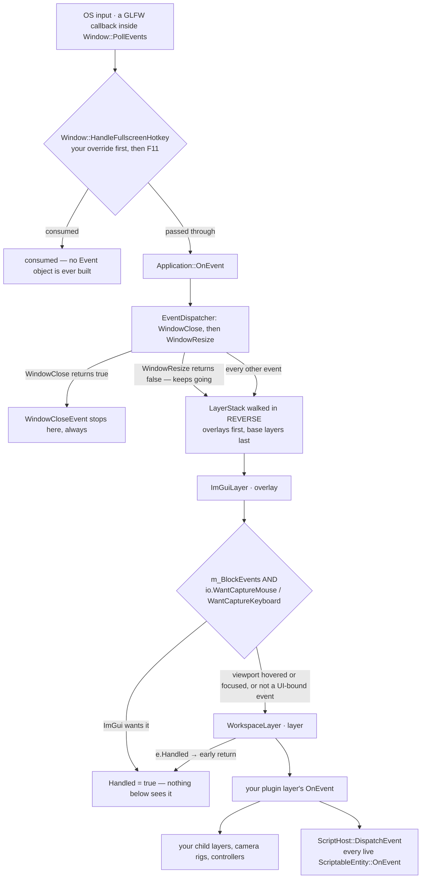

# Events & Input — Guide

**What this covers:** The `Event` hierarchy and its category bitmask; how an OS signal travels from
GLFW to your layer and your scripts; `EventDispatcher` and the `Handled` contract; dropped files;
polled input for keyboard, mouse and **gamepad**; and the complete code tables.
**Source of truth:** `Cosmic/src/events/{Event,ApplicationEvent,KeyEvent,MouseEvent}.h`,
`core/Input.{h,cpp}`, `codes/{KeyCodes,MouseButtonCodes,GamepadCodes}.h`,
`core/Application.cpp` (`OnEvent`), `core/Window.cpp` (the GLFW callbacks),
`layers/{ImGuiLayer,WorkspaceLayer,PlayerLayer}.cpp`, `scripting/ScriptHost.cpp`
**API Reference:** [../reference/events-input.md](../reference/events-input.md) · **How it works:**
[../systems/events-input.md](../systems/events-input.md)
**Configuration:** both — events and input are identical in the 3D and 2D engine builds.

Cosmic gives you input two ways, and they are not interchangeable:

- **Events are push.** The OS says "the user just pressed Escape", the engine wraps it in a typed
  object, and that object falls through the layer stack until someone claims it.
- **`Input` is pull.** You ask, in the middle of your update, "is `W` held down *right now?*"

Use events for things that happen *once* — a menu toggle, a jump, a file drop. Use `Input` for
things that are true *continuously* — walking, aiming, holding a trigger.

---

## Quick start

```cpp
#include <Cosmic.h>

class MyLayer : public Cosmic::Layer
{
public:
    MyLayer() : Cosmic::Layer("MyLayer") {}

    // PUSH — one-shot reactions.
    void OnEvent(Cosmic::Event& e) override
    {
        Cosmic::EventDispatcher dispatcher(e);

        dispatcher.Dispatch<Cosmic::KeyPressedEvent>(
            [this](Cosmic::KeyPressedEvent& key) { return OnKeyPressed(key); });

        dispatcher.Dispatch<Cosmic::WindowResizeEvent>(
            [this](Cosmic::WindowResizeEvent& r)
            {
                m_Aspect = (float)r.GetWidth() / (float)r.GetHeight();
                return false;              // don't consume — other layers need it too
            });
    }

    // PULL — continuous state, sampled once per frame.
    void OnUpdate(float ts) override
    {
        glm::vec2 move{ 0.0f };
        if (Cosmic::Input::IsKeyPressed(CS_KEY_A)) move.x -= 1.0f;
        if (Cosmic::Input::IsKeyPressed(CS_KEY_D)) move.x += 1.0f;

        // A gamepad, if one is plugged in, adds to the same vector.
        const float stickX = Cosmic::Input::GetGamepadAxis(Cosmic::CS_GAMEPAD_AXIS_LEFT_X);
        if (std::fabs(stickX) > 0.2f) move.x += stickX;

        m_Position += move * m_Speed * ts;
    }

private:
    bool OnKeyPressed(Cosmic::KeyPressedEvent& e)
    {
        if (e.GetKeyCode() == CS_KEY_ESCAPE && e.GetRepeatCount() == 0)
        {
            TogglePauseMenu();
            return true;                   // consumed — layers below never see it
        }
        return false;
    }

    glm::vec2 m_Position{ 0.0f };
    float     m_Speed  = 5.0f;
    float     m_Aspect = 16.0f / 9.0f;
};
```

Two things to notice, because both are contracts the rest of this chapter unpacks: the handler
returns **`bool`**, and returning `true` is the *only* way an event stops propagating. And the
`WindowResizeEvent` handler deliberately returns `false` — application events almost always want to
reach everyone.

---

## Events versus polling

| Reach for `OnEvent` | Reach for `Input::` |
| --- | --- |
| "The user just pressed Escape" | "Is `W` held down?" |
| Menu toggles, jumps, weapon fire, hotkeys | Walking, camera pan, throttle, aiming |
| Text entry (`KeyTypedEvent`) | Modifier chords (`Ctrl` + click) |
| Window resize, file drop | Cursor position, scroll *accumulation* you do yourself |
| Runs **before** the frame's updates | Runs wherever you call it |
| Can be **blocked** by ImGui | Never blocked — see the pitfall below |

The most consequential row is the last one. `Input::IsKeyPressed` talks straight to GLFW and knows
nothing about ImGui, focus, or the viewport. A layer that polls `CS_KEY_W` will keep walking your
character while the user types "world" into a text box. Events are the layer that solves that, which
is why anything the user could confuse with UI interaction belongs in `OnEvent`.

---

## How an event reaches your code

### The path

Every event starts in a GLFW callback installed by `Window`, and those callbacks fire **inside
`Window::PollEvents()`**, which `Application::Run` calls at the top of each iteration — before
`RenderSingleFrame`. There is no queue and no deferral: by the time your `OnUpdate` runs, every event
for that frame has already been delivered and fully processed.

### DG-4 — event propagation



### What each stop does

**1. `Window::HandleFullscreenHotkey` — before the event system exists.** The key callback offers
every keystroke to a registered override first, then to the built-in **F11 toggles fullscreen**
handler. If either consumes the key, **no `Event` object is constructed at all** — your layer never
sees it, and neither does ImGui. This is why `F11` never reaches a client handler unless you take it
over:

```cpp
// Take over F11 (or steal any key at the very top of the pipeline).
Cosmic::Application::Get().GetWindow().SetFullscreenHotkeyOverride(
    [](int key, int action, int mods) -> bool
    {
        if (key == CS_KEY_F11 && action == 1 /* GLFW_PRESS */)
            return false;                 // let the key become a normal KeyPressedEvent
        return false;
    });
```

`action` and `mods` are **raw GLFW values** — the engine defines no `CS_ACTION_*` or `CS_MOD_*`
constants (press is `1`, release `0`, repeat `2`). `Application::UnloadProjectDLL` calls
`ClearFullscreenHotkeyOverride()` for you, so a project DLL cannot leave a dangling `std::function`
behind after unload.

**2. `Application::OnEvent` — two events get special handling.**

| Event | Application does | Result |
| --- | --- | --- |
| `WindowCloseEvent` | sets `m_Running = false`, returns `true` | **`Handled` — no layer ever receives it** |
| `WindowResizeEvent` | resizes the main framebuffer, calls `Renderer::OnWindowResize`, returns `false` | not handled — **propagates to every layer** |

There is no supported way to veto application shutdown from a layer. If you need a "save before
quit?" prompt, drive it from your own UI and call `Application::Get().Close()` when the user
confirms.

**3. The `LayerStack`, in reverse.** `Application` iterates `rbegin() → rend()`, so **overlays see
events before layers** — the exact opposite of the update order. It re-checks `e.Handled` at the top
of every iteration and breaks out as soon as it is set.

**4. `ImGuiLayer` (the only overlay the engine pushes).** When its `m_BlockEvents` flag is on
(**default `true`**), it marks mouse events handled if `io.WantCaptureMouse`, and keyboard events
handled if `io.WantCaptureKeyboard`. That is how clicking a panel button doesn't also fire your
weapon.

`WorkspaceLayer` re-arms this flag **every ImGui frame** from the viewport's state:

```cpp
// WorkspaceLayer::OnImGuiRender
Application::Get().GetImGuiLayer()->BlockEvents(!m_ViewportFocused && !m_ViewportHovered);
```

So while the cursor is over the Viewport panel, blocking is **off** and raw input reaches your
layer unmodified. When no viewport is visible at all, blocking is forced on and ImGui owns
everything. You can override the flag yourself with
`Application::Get().GetImGuiLayer()->BlockEvents(false)` — useful for a captured-cursor first-person
mode — but you then own the consequences for every panel in the app.

> The `WantCapture*` values ImGui reports during `PollEvents` are from the **previous** frame's UI,
> because `ImGui::NewFrame()` has not run yet for this one. That one-frame lag is invisible in
> practice but explains why a panel that appears *because of* a click still lets that first click
> through.

**5. `WorkspaceLayer` → your plugin layer.** The shell early-returns on `e.Handled`, then calls
`m_ClientViewportLayer->OnEvent(e)`. Remember that **your plugin layer is not on the engine's
`LayerStack`** — the shell forwards to it (see
[`project-anatomy.md`](project-anatomy.md#the-load-sequence)). One practical consequence: your layer
is always last, so anything ImGui or the shell claimed is already gone.

**6. Scripts.** `ScriptableEntity::OnEvent` exists and is fed by `ScriptHost::DispatchEvent`, which
fans the event to every live script instance. Two hosts call it:

| Host | When |
| --- | --- |
| `PlayerLayer` (a shipped game) | every event, **unless `Application::IsPaused()`** |
| `StarforgeApp` (the editor) | only while the Play session is `Playing` |

`ScriptHost::DispatchEvent` does **not** check `Handled` and does not stop early — every live script
sees the event, in `m_Live` order. Scripts are covered in [`scripting.md`](scripting.md).

---

## Handle an event in your layer

`EventDispatcher` is a three-line helper that replaces a `switch` on `GetEventType()`. It compares
the runtime type against `T::GetStaticType()`, and on a match calls your function with the event
already downcast to `T&`:

```cpp
void MyLayer::OnEvent(Cosmic::Event& e)
{
    Cosmic::EventDispatcher dispatcher(e);

    dispatcher.Dispatch<Cosmic::KeyPressedEvent>(
        [this](Cosmic::KeyPressedEvent& key) { return OnKeyPressed(key); });
    dispatcher.Dispatch<Cosmic::MouseButtonPressedEvent>(
        [this](Cosmic::MouseButtonPressedEvent& btn) { return OnClick(btn); });
    dispatcher.Dispatch<Cosmic::MouseScrolledEvent>(
        [this](Cosmic::MouseScrolledEvent& s) { m_Zoom -= s.GetYOffset() * 0.1f; return true; });
}
```

The **contract**, verified in `Event.h`:

- Your function returns `bool`. **`true` sets `Handled`; `false` leaves it exactly as it was.**
- `Handled` is only ever set to `true`, never cleared — a handler returning `false` cannot un-consume
  an event a previous layer already claimed.
- `Dispatch<T>` itself returns whether the *type matched*, not whether the event was consumed. That
  return value is rarely useful; ignore it.
- Dispatching several types in a row is fine and cheap: only the matching one runs.

You can also set `e.Handled = true` directly, which is the right move when you want to swallow a
whole category rather than one type — see [category filtering](#filter-by-category).

`Core.h` still defines the legacy macro `CS_BIND_EVENT_FN(fn)`, which expands to
`std::bind(&fn, this, std::placeholders::_1)`. It compiles and behaves identically. Prefer lambdas in
new code: they read better and don't drag in `<functional>` semantics you don't need.

### Forwarding to things your layer owns

Camera controllers, gizmos and mode children all want events. Forward first, then handle what's
left:

```cpp
void MyLayer::OnEvent(Cosmic::Event& e)
{
    m_CameraController.OnEvent(e);        // may consume scroll / drag
    if (e.Handled) return;

    Cosmic::EventDispatcher dispatcher(e);
    dispatcher.Dispatch<Cosmic::KeyPressedEvent>(
        [this](Cosmic::KeyPressedEvent& key) { return OnKeyPressed(key); });
}
```

For a root layer with several child modes, the split is **not** uniform, and getting it wrong is a
classic bug: application events must reach **every** child, or an inactive child keeps a stale
projection matrix and snaps the first time you switch to it.

```cpp
void MyRootLayer::OnEvent(Cosmic::Event& e)
{
    if (e.IsInCategory(Cosmic::EventCategoryApplication))
    {
        for (auto& mode : m_Modes)        // resize/file-drop → ALL children
            mode->OnEvent(e);
        return;
    }

    if (e.Handled) return;
    m_Modes[m_Active]->OnEvent(e);        // input → the active child only
}
```

`Cosmic/templates/ExampleProject/src/TemplateProject.cpp` is the shipped reference for this shape;
the pattern itself is covered in [`project-anatomy.md`](project-anatomy.md#the-composite-layer-pattern).

---

## Filter by category

Every event carries a bitmask, so you can act on a whole family without naming types. The flags come
from `EventCategory` in `Event.h`, built with `BIT(n)` = `1u << n`:

| Category | Bit | Value | Set on |
| --- | --- | --- | --- |
| `EventCategoryApplication` | `BIT(0)` | 1 | `WindowResizeEvent`, `WindowCloseEvent`, `WindowFileDropEvent` |
| `EventCategoryInput` | `BIT(1)` | 2 | every key and mouse event |
| `EventCategoryKeyboard` | `BIT(2)` | 4 | `KeyPressedEvent`, `KeyReleasedEvent`, `KeyTypedEvent` |
| `EventCategoryMouse` | `BIT(3)` | 8 | `MouseMovedEvent`, `MouseScrolledEvent`, both button events |
| `EventCategoryMouseButton` | `BIT(4)` | 16 | `MouseButtonPressedEvent`, `MouseButtonReleasedEvent` only |

```cpp
void MyLayer::OnEvent(Cosmic::Event& e)
{
    // Swallow all input during a cutscene — window events still get through.
    if (m_CutscenePlaying && e.IsInCategory(Cosmic::EventCategoryInput))
    {
        e.Handled = true;
        return;
    }
    // ... normal dispatch
}
```

Two facts worth pinning, because both are easy to assume wrong:

- **`EventCategoryInput` does not include window events.** Resize, close and file drop are
  `EventCategoryApplication` *only*. Blocking input never blocks a resize.
- **`WindowFileDropEvent` is an application event, not an input event** — even though a human dragged
  the file. If your cutscene guard blocks `EventCategoryApplication`, you will silently drop file
  imports.

---

## The event catalogue

Nine concrete classes, all header-only, all in `Cosmic/src/events/`. `Cosmic.h` pulls in all four
headers, so a project needs no extra include.

| Class | Accessors | Fired when | Categories |
| --- | --- | --- | --- |
| `WindowResizeEvent` | `GetWidth()`, `GetHeight()` → `uint32_t` | the OS window changes size, and once synthetically at boot from `SynchronizeRenderingState` | Application |
| `WindowCloseEvent` | — | the window's close button / `Alt+F4`. **Consumed by `Application`; layers never see it** | Application |
| `WindowFileDropEvent` | `GetPaths()` → `const std::vector<std::string>&` | files are dropped on the window; paths are absolute UTF-8 | Application |
| `KeyPressedEvent` | `GetKeyCode()`, `GetRepeatCount()` | key press **and** OS auto-repeat | Keyboard, Input |
| `KeyReleasedEvent` | `GetKeyCode()` | key release | Keyboard, Input |
| `KeyTypedEvent` | `GetKeyCode()` — **a Unicode codepoint** | a character is produced, after the OS applies layout, modifiers and dead keys | Keyboard, Input |
| `MouseMovedEvent` | `GetX()`, `GetY()` → `float` | cursor moves | Mouse, Input |
| `MouseScrolledEvent` | `GetXOffset()`, `GetYOffset()` | wheel or trackpad scroll | Mouse, Input |
| `MouseButtonPressedEvent` | `GetMouseButton()` | button down | Mouse, Input, MouseButton |
| `MouseButtonReleasedEvent` | `GetMouseButton()` | button up | Mouse, Input, MouseButton |

Every event also inherits `GetName()` (the type name as a string), `GetEventType()`, and
`ToString()`, which produces a readable one-liner — handy while debugging:

```cpp
CS_TRACE("{0}", e.ToString());     // "KeyPressedEvent: 87 (0 repeats)"
```

### Four details that bite

**`KeyTypedEvent::GetKeyCode()` is not a key code.** It is the UTF-32 codepoint from GLFW's character
callback — `65` means the user produced a capital `A`, whether by `Shift+A` or a dead-key sequence,
whereas `KeyPressedEvent`'s `65` is the physical `CS_KEY_A` regardless of case. Use `KeyTyped` for
text entry and `KeyPressed` for controls; never mix the two namespaces.

**`GetRepeatCount()` is a flag, not a counter.** `Window.cpp` passes a literal `0` for a fresh press
and `1` for every OS auto-repeat. It never counts upward. `== 0` is the idiomatic "freshly pressed"
test:

```cpp
if (e.GetKeyCode() == CS_KEY_SPACE && e.GetRepeatCount() == 0)
    Jump();                    // once per press, no matter how long it's held
```

**`MouseMovedEvent` coordinates are window-client pixels**, top-left origin — the same space as
`Input::GetMousePosition()`. They are **not** screen coordinates, and they are not viewport-relative.
For anything involving an ImGui rectangle (picking, gizmos, zoom-to-cursor) see
[mouse coordinate spaces](#the-two-mouse-coordinate-spaces).

**Events carry no modifier bits.** `KeyPressedEvent` has no `GetMods()`. To detect `Ctrl+S`, poll the
modifier while handling the key:

```cpp
bool MyLayer::OnKeyPressed(Cosmic::KeyPressedEvent& e)
{
    const bool ctrl = Cosmic::Input::IsKeyPressed(CS_KEY_LEFT_CONTROL)
                   || Cosmic::Input::IsKeyPressed(CS_KEY_RIGHT_CONTROL);

    if (ctrl && e.GetKeyCode() == CS_KEY_S) { Save(); return true; }
    return false;
}
```

(The raw `mods` bitfield *is* available, but only inside a fullscreen-hotkey override — the one place
the engine hands you GLFW's own arguments.)

> **Three `EventType` values have no class.** The enum in `Event.h` declares `WindowFocus`,
> `WindowLostFocus` and `WindowMoved`, but no event class returns them and no callback produces them.
> They are placeholders. Do not write a handler expecting focus notifications — poll
> `Window::IsFocused`-style state or use ImGui's focus flags instead.

---

## React to dropped files

`WindowFileDropEvent` (Phase 23) is the engine's generic OS-drop signal. GLFW hands over absolute
UTF-8 paths; the engine attaches **no meaning** to them — nothing is imported, copied or opened
unless you do it. A shipped app can ignore the event entirely.

The editor's handler is the worked example, and shows the idiom of *queueing* the paths rather than
acting inside the event:

```cpp
void StarforgeApp::OnEvent(Cosmic::Event& e)
{
    Cosmic::EventDispatcher dispatch(e);
    dispatch.Dispatch<Cosmic::WindowFileDropEvent>(
        [this](Cosmic::WindowFileDropEvent& drop)
        {
            if (!m_Ctx.ProjectOpen) return false;      // not consumed — nothing to drop onto
            for (const std::string& p : drop.GetPaths())
                m_Ctx.PendingDroppedFiles.push_back(p);
            return true;
        });
}
```

Do the work next frame, not here. `OnEvent` runs inside `PollEvents`, before the frame's ImGui
context exists — opening a modal, touching a panel's state, or loading an asset from the handler is
at best awkward and at worst a crash.

`GetPaths()` returns a reference to a vector owned by the event object, which dies when the callback
returns. Copy anything you keep.

---

## Poll input

`Input` is a static class over GLFW. Every call needs a live `Application` (it reaches through
`Application::Get().GetWindow()`), so nothing here works from a static initializer.

```cpp
// Keyboard
bool held = Cosmic::Input::IsKeyPressed(CS_KEY_W);        // true while down OR auto-repeating

// Mouse
bool lmb  = Cosmic::Input::IsMouseButtonPressed(CS_MOUSE_BUTTON_LEFT);
glm::vec2 p = Cosmic::Input::GetMousePosition();          // window-client pixels
float x = Cosmic::Input::GetMouseX();
float y = Cosmic::Input::GetMouseY();
glm::vec2 s = Cosmic::Input::GetMouseScreenPosition();    // OS screen pixels
```

There is **no polled scroll wheel** — GLFW reports scroll only as a delta. Accumulate it yourself
from `MouseScrolledEvent`.

### The two mouse coordinate spaces

This is the single most common input bug in the codebase, and the reason `GetMouseScreenPosition`
exists:

| Call | Space | Compare against |
| --- | --- | --- |
| `GetMousePosition()` / `GetMouseX()` / `GetMouseY()` | **window client**, top-left of *your window* | `Window::GetWidth()/GetHeight()`, `MouseMovedEvent` |
| `GetMouseScreenPosition()` | **OS screen**, virtual-desktop origin | `Application::GetViewportPos()/GetViewportSize()`, any ImGui rect, `ImGui::GetIO().MousePos` |

ImGui runs with multi-viewport enabled, so every ImGui rectangle — including the Viewport panel — is
in screen coordinates. Mixing the two spaces produces picking that is off by exactly the window's
desktop position, which is *zero* when the window is maximized at the top-left of the primary
monitor. That is why the bug survives testing and appears the moment someone moves the window.

```cpp
// Mouse position inside the rendered viewport image, in viewport pixels.
const glm::vec2 vpPos  = Cosmic::Application::Get().GetViewportPos();     // screen space
const glm::vec2 vpSize = Cosmic::Application::Get().GetViewportSize();
const glm::vec2 local  = Cosmic::Input::GetMouseScreenPosition() - vpPos; // screen space − screen space

const bool inside = local.x >= 0.0f && local.y >= 0.0f
                 && local.x <  vpSize.x && local.y <  vpSize.y;
```

---

## Read a gamepad

Gamepad support has shipped since Phase 2 and is **pure polling** — there are no gamepad events, no
connect/disconnect notifications, and no engine-side state to initialize. Every call takes an
optional slot index defaulting to the first pad:

```cpp
bool        Cosmic::Input::IsGamepadConnected     (int gamepad = 0);
float       Cosmic::Input::GetGamepadAxis         (int axis,   int gamepad = 0);   // [-1, 1]
bool        Cosmic::Input::IsGamepadButtonPressed (int button, int gamepad = 0);
int         Cosmic::Input::GetGamepadAxisCount    (int gamepad = 0);
int         Cosmic::Input::GetGamepadButtonCount  (int gamepad = 0);
std::string Cosmic::Input::GetGamepadName         (int gamepad = 0);
```

Slots are `CS_GAMEPAD_1` … `CS_GAMEPAD_LAST` (0–15). Every call is **safe on a disconnected or
out-of-range slot** — axes return `0.0f`, buttons `false`, counts `0`, and the name `""`. You never
have to guard, though checking `IsGamepadConnected` first lets you show a "plug in a controller"
message.

### Mapped pads versus raw sticks

The same two calls serve two kinds of device, and knowing which you have decides whether the
`CS_GAMEPAD_*` constants mean anything:

| | **Mapped** — Xbox, PlayStation, most modern pads | **Unmapped** — RC transmitters in USB-joystick mode, sim yokes, HOTAS |
| --- | --- | --- |
| Detected by | GLFW's built-in controller database | anything not in it |
| `GetGamepadAxis(CS_GAMEPAD_AXIS_LEFT_X)` | the standardized left stick X | **raw axis 0** — whatever the device calls it |
| Button constants | `CS_GAMEPAD_BUTTON_A` really is A | raw button indices |
| Axis/button count | fixed 6 / 15 | device-specific — ask `GetGamepadAxisCount()` |
| `GetGamepadName()` | the mapping-database name | the raw device name |

The engine deliberately does not expose *which* kind you got. If you support unmapped hardware, drive
your bindings off `GetGamepadAxisCount()` and let the user assign axes — the template project ships a
live readout that exists exactly for this discovery step:

```cpp
if (Cosmic::Input::IsGamepadConnected())
{
    ImGui::Text("Pad: %s  (%d axes, %d buttons)",
        Cosmic::Input::GetGamepadName().c_str(),
        Cosmic::Input::GetGamepadAxisCount(),
        Cosmic::Input::GetGamepadButtonCount());

    const int axisCount = std::min(Cosmic::Input::GetGamepadAxisCount(), 6);
    for (int i = 0; i < axisCount; ++i)
    {
        const float v = Cosmic::Input::GetGamepadAxis(i);
        char label[32];
        snprintf(label, sizeof(label), "axis %d: %+.3f", i, v);
        ImGui::ProgressBar(v * 0.5f + 0.5f, ImVec2(-1.0f, 0.0f), label);
    }
}
else
{
    ImGui::TextDisabled("No gamepad connected (plug one in — values appear live).");
}
```

*(`Cosmic/templates/ExampleProject/src/TemplateProject.cpp`. Wiggle each stick and watch which bar
moves — that is your axis index.)*

### Deadzones are yours to apply

Sticks rest near, but not at, zero. **The engine applies no deadzone** — `GetGamepadAxis` returns
exactly what the driver reports. Two idioms ship in the tree, and the choice matters:

```cpp
// Threshold — simplest. Below the cut, nothing; above it, the raw value.
// Movement "pops" to 0.2 the instant it engages. Fine for walk/run input.
const float gx = Cosmic::Input::GetGamepadAxis(Cosmic::CS_GAMEPAD_AXIS_LEFT_X);
if (std::fabs(gx) > 0.2f) dir.x += gx;
```

```cpp
// Rescaled deadband — no pop: the surviving range is stretched back to full scale.
// Use this for anything analogue (flight, throttle, camera speed).
float Deadband(float v, float db = 0.12f)
{
    return std::fabs(v) < db ? 0.0f : (v - (v > 0 ? db : -db)) / (1.0f - db);
}
```

*(Threshold: `Projects/Starforge/assets/templates/src/scripts/WalkController.h`. Rescaled:
`Projects/ViperSim/src/SimHub.cpp`, which flies the whole simulator from four axes.)*

**Triggers report `-1` fully released and `+1` fully pressed** on mapped pads — not `0`..`1`. Convert
before treating one as a throttle:

```cpp
const float raw     = Cosmic::Input::GetGamepadAxis(Cosmic::CS_GAMEPAD_AXIS_RIGHT_TRIGGER);
const float throttle = (raw + 1.0f) * 0.5f;    // now 0 .. 1
```

Also note **Y axes point down**: pushing a stick forward gives a *negative* `LEFT_Y`. `WalkController`
adds `gy` straight into `dir.z` because forward is `-Z`; `SimHub` negates it for climb. Decide once
and comment it.

### A complete gamepad + keyboard walker

Both paths write into one vector, so a player can use either at any moment without a mode switch —
this is the shipped `WalkController` script, trimmed:

```cpp
void OnFixedUpdate(float /*dt*/) override
{
    using namespace Cosmic;

    glm::vec3 dir(0.0f);
    if (Input::IsKeyPressed(CS_KEY_W)) dir.z -= 1.0f;   // forward = -Z
    if (Input::IsKeyPressed(CS_KEY_S)) dir.z += 1.0f;
    if (Input::IsKeyPressed(CS_KEY_A)) dir.x -= 1.0f;
    if (Input::IsKeyPressed(CS_KEY_D)) dir.x += 1.0f;

    const float gx = Input::GetGamepadAxis(CS_GAMEPAD_AXIS_LEFT_X);
    const float gy = Input::GetGamepadAxis(CS_GAMEPAD_AXIS_LEFT_Y);
    if (std::fabs(gx) > 0.2f) dir.x += gx;
    if (std::fabs(gy) > 0.2f) dir.z += gy;

    if (glm::length(dir) > 1.0f)
        dir = glm::normalize(dir);      // diagonal + stick must not exceed full speed

    Character().Move(dir * MoveSpeed);

    if (Input::IsKeyPressed(CS_KEY_SPACE) && Character().IsGrounded())
        Character().Jump(JumpSpeed);
}
```

Polling from `OnFixedUpdate` is correct **here** because the consumer is the physics character
controller, which advances on the fixed step. Poll from `OnUpdate` for anything visual. See
[`time-and-ticks.md`](time-and-ticks.md#fixed-versus-variable).

---

## Code tables

Generated from `Cosmic/src/codes/`. Keyboard and mouse constants are `#define`s at global scope
(usable unqualified); gamepad constants are `inline constexpr int` **inside `namespace Cosmic`**, so
they need `Cosmic::` unless you have a `using namespace`. All values mirror GLFW's, which is why
passing a raw GLFW code also happens to work — don't rely on that.

### Keyboard — printable keys

| Constant | Value | | Constant | Value |
| --- | --- | --- | --- | --- |
| `CS_KEY_SPACE` | 32 | | `CS_KEY_A` … `CS_KEY_Z` | 65 … 90 |
| `CS_KEY_APOSTROPHE` `'` | 39 | | `CS_KEY_LEFT_BRACKET` `[` | 91 |
| `CS_KEY_COMMA` `,` | 44 | | `CS_KEY_BACKSLASH` `\` | 92 |
| `CS_KEY_MINUS` `-` | 45 | | `CS_KEY_RIGHT_BRACKET` `]` | 93 |
| `CS_KEY_PERIOD` `.` | 46 | | `CS_KEY_GRAVE_ACCENT` `` ` `` | 96 |
| `CS_KEY_SLASH` `/` | 47 | | `CS_KEY_WORLD_1` | 161 |
| `CS_KEY_0` … `CS_KEY_9` | 48 … 57 | | `CS_KEY_WORLD_2` | 162 |
| `CS_KEY_SEMICOLON` `;` | 59 | | | |
| `CS_KEY_EQUAL` `=` | 61 | | | |

Letters and digits use their ASCII values, so `CS_KEY_A + 1 == CS_KEY_B` and `CS_KEY_0 + n` works for
digit rows.

### Keyboard — function and navigation keys

| Constant | Value | | Constant | Value |
| --- | --- | --- | --- | --- |
| `CS_KEY_ESCAPE` | 256 | | `CS_KEY_CAPS_LOCK` | 280 |
| `CS_KEY_ENTER` | 257 | | `CS_KEY_SCROLL_LOCK` | 281 |
| `CS_KEY_TAB` | 258 | | `CS_KEY_NUM_LOCK` | 282 |
| `CS_KEY_BACKSPACE` | 259 | | `CS_KEY_PRINT_SCREEN` | 283 |
| `CS_KEY_INSERT` | 260 | | `CS_KEY_PAUSE` | 284 |
| `CS_KEY_DELETE` | 261 | | `CS_KEY_F1` … `CS_KEY_F12` | 290 … 301 |
| `CS_KEY_RIGHT` | 262 | | `CS_KEY_F13` … `CS_KEY_F25` | 302 … 314 |
| `CS_KEY_LEFT` | 263 | | | |
| `CS_KEY_DOWN` | 264 | | | |
| `CS_KEY_UP` | 265 | | | |
| `CS_KEY_PAGE_UP` | 266 | | | |
| `CS_KEY_PAGE_DOWN` | 267 | | | |
| `CS_KEY_HOME` | 268 | | | |
| `CS_KEY_END` | 269 | | | |

> **`CS_KEY_F11` never arrives as an event** — `Window` consumes it to toggle fullscreen. See
> [the propagation path](#what-each-stop-does).

### Keyboard — keypad and modifiers

| Constant | Value | | Constant | Value |
| --- | --- | --- | --- | --- |
| `CS_KEY_KP_0` … `CS_KEY_KP_9` | 320 … 329 | | `CS_KEY_LEFT_SHIFT` | 340 |
| `CS_KEY_KP_DECIMAL` | 330 | | `CS_KEY_LEFT_CONTROL` | 341 |
| `CS_KEY_KP_DIVIDE` | 331 | | `CS_KEY_LEFT_ALT` | 342 |
| `CS_KEY_KP_MULTIPLY` | 332 | | `CS_KEY_LEFT_SUPER` | 343 |
| `CS_KEY_KP_SUBTRACT` | 333 | | `CS_KEY_RIGHT_SHIFT` | 344 |
| `CS_KEY_KP_ADD` | 334 | | `CS_KEY_RIGHT_CONTROL` | 345 |
| `CS_KEY_KP_ENTER` | 335 | | `CS_KEY_RIGHT_ALT` | 346 |
| `CS_KEY_KP_EQUAL` | 336 | | `CS_KEY_RIGHT_SUPER` | 347 |
| | | | `CS_KEY_MENU` | 348 |

Left and right modifiers are **distinct codes**. Test both, or a user pressing the right `Shift` will
find your chord dead.

### Mouse buttons

| Constant | Value | Alias | Typical use |
| --- | --- | --- | --- |
| `CS_MOUSE_BUTTON_1` | 0 | `CS_MOUSE_BUTTON_LEFT` | primary action, select |
| `CS_MOUSE_BUTTON_2` | 1 | `CS_MOUSE_BUTTON_RIGHT` | context menu, look/orbit |
| `CS_MOUSE_BUTTON_3` | 2 | `CS_MOUSE_BUTTON_MIDDLE` | pan |
| `CS_MOUSE_BUTTON_4` … `CS_MOUSE_BUTTON_8` | 3 … 7 | — | extra buttons; `CS_MOUSE_BUTTON_LAST` = `_8` |

### Gamepad slots

| Constant | Value |
| --- | --- |
| `Cosmic::CS_GAMEPAD_1` … `CS_GAMEPAD_4` | 0 … 3 |
| `Cosmic::CS_GAMEPAD_LAST` | 15 |

### Gamepad axes — mapped layout, all in `[-1, 1]`

| Constant | Value | Notes |
| --- | --- | --- |
| `Cosmic::CS_GAMEPAD_AXIS_LEFT_X` | 0 | −1 left, +1 right |
| `Cosmic::CS_GAMEPAD_AXIS_LEFT_Y` | 1 | **−1 up / forward**, +1 down |
| `Cosmic::CS_GAMEPAD_AXIS_RIGHT_X` | 2 | |
| `Cosmic::CS_GAMEPAD_AXIS_RIGHT_Y` | 3 | same sign convention as `LEFT_Y` |
| `Cosmic::CS_GAMEPAD_AXIS_LEFT_TRIGGER` | 4 | **−1 released, +1 pressed** |
| `Cosmic::CS_GAMEPAD_AXIS_RIGHT_TRIGGER` | 5 | same |
| `Cosmic::CS_GAMEPAD_AXIS_LAST` | 5 | |

### Gamepad buttons — mapped layout

| Constant | Value | Xbox | PlayStation |
| --- | --- | --- | --- |
| `Cosmic::CS_GAMEPAD_BUTTON_A` | 0 | A | ✕ |
| `Cosmic::CS_GAMEPAD_BUTTON_B` | 1 | B | ○ |
| `Cosmic::CS_GAMEPAD_BUTTON_X` | 2 | X | □ |
| `Cosmic::CS_GAMEPAD_BUTTON_Y` | 3 | Y | △ |
| `Cosmic::CS_GAMEPAD_BUTTON_LEFT_BUMPER` | 4 | LB | L1 |
| `Cosmic::CS_GAMEPAD_BUTTON_RIGHT_BUMPER` | 5 | RB | R1 |
| `Cosmic::CS_GAMEPAD_BUTTON_BACK` | 6 | View | Share |
| `Cosmic::CS_GAMEPAD_BUTTON_START` | 7 | Menu | Options |
| `Cosmic::CS_GAMEPAD_BUTTON_GUIDE` | 8 | Xbox | PS |
| `Cosmic::CS_GAMEPAD_BUTTON_LEFT_THUMB` | 9 | LS click | L3 |
| `Cosmic::CS_GAMEPAD_BUTTON_RIGHT_THUMB` | 10 | RS click | R3 |
| `Cosmic::CS_GAMEPAD_BUTTON_DPAD_UP` | 11 | | |
| `Cosmic::CS_GAMEPAD_BUTTON_DPAD_RIGHT` | 12 | | |
| `Cosmic::CS_GAMEPAD_BUTTON_DPAD_DOWN` | 13 | | |
| `Cosmic::CS_GAMEPAD_BUTTON_DPAD_LEFT` | 14 | | |
| `Cosmic::CS_GAMEPAD_BUTTON_LAST` | 14 | | |

The D-pad is **buttons, not an axis** on mapped pads. Triggers are the reverse — axes, not buttons.

---

## Common patterns

**Edge-detect a polled key.** `Input` has no "just pressed" query. Either use `KeyPressedEvent` with
`GetRepeatCount() == 0`, or keep one bool:

```cpp
const bool down = Cosmic::Input::IsKeyPressed(CS_KEY_F);
if (down && !m_WasFDown) Interact();       // rising edge
m_WasFDown = down;
```

**Accumulate scroll.** There is no polled wheel state; consume the delta in `OnEvent` and keep the
total yourself.

```cpp
dispatcher.Dispatch<Cosmic::MouseScrolledEvent>(
    [this](Cosmic::MouseScrolledEvent& s)
    {
        m_Zoom = std::clamp(m_Zoom - s.GetYOffset() * 0.25f, 1.0f, 50.0f);
        return true;
    });
```

**Let the same code take keyboard or stick.** Sum both into one input vector, normalize once (the
walker above). Don't branch on "is a pad connected" — a disconnected pad already reads as zero.

**Poll where the consumer lives.** Visual and camera input in `OnUpdate`; physics and character
input in `OnFixedUpdate`. Reading a key in `OnFixedUpdate` for a purely visual effect makes it
stutter; reading it in `OnUpdate` for physics makes it frame-rate dependent.

**Free the cursor before you need the mouse.** For a captured first-person mode, pair
`Window::SetCursorCaptured(true)` with `GetImGuiLayer()->BlockEvents(false)`, and undo both when a
menu opens.

---

## Pitfalls

**"My hotkey works in the game but does nothing when a panel is focused."** ImGui claimed it.
`ImGuiLayer` marks keyboard events handled whenever `io.WantCaptureKeyboard` is set — which any
focused text field does. Move the binding to a polled check, or use `BlockEvents(false)` while your
mode is active.

**"My `F11` handler never fires."** `Window::HandleFullscreenHotkey` consumes `F11` before any
`Event` is built. Register a `SetFullscreenHotkeyOverride` if you want it.

**"I can't cancel window close."** You can't. `Application::OnWindowClose` returns `true`, so
`WindowCloseEvent` is `Handled` before the layer walk begins. Drive confirmation from your own UI and
call `Application::Get().Close()`.

**"Clicks in the 3D viewport are being eaten."** Only when the viewport is neither hovered nor
focused — `WorkspaceLayer` re-arms `BlockEvents` from exactly those two flags every ImGui frame. If
it happens while hovering, something else set `BlockEvents(true)` after the shell did.

**"My camera keeps orbiting while I type in a text box."** You are polling `Input` instead of
handling events. Polling bypasses ImGui entirely — that is the design, not a bug. Gate it:
`if (!ImGui::GetIO().WantCaptureKeyboard) { … }`.

**"Picking is off by a constant offset, but only sometimes."** You compared
`Input::GetMousePosition()` (window-client space) with `Application::GetViewportPos()` (screen
space). They agree only when the window sits at the desktop origin. Use `GetMouseScreenPosition()`.

**"`KeyTypedEvent` gives me the wrong key."** It gives a *character*, not a key. `GetKeyCode()` there
is a Unicode codepoint. `KeyPressedEvent` is the one that speaks `CS_KEY_*`.

**"Holding a key fires my action repeatedly."** The OS auto-repeat generates fresh
`KeyPressedEvent`s. Guard with `GetRepeatCount() == 0`.

**"My gamepad drifts."** No deadzone is applied anywhere in the engine. Apply your own — see
[deadzones](#deadzones-are-yours-to-apply).

**"The trigger reads −1 when I'm not touching it."** That is the mapped-pad convention. Remap with
`(raw + 1) * 0.5f`.

**"`CS_GAMEPAD_AXIS_LEFT_X` returns nonsense on my RC transmitter."** The device has no GLFW mapping,
so the constants are just raw indices. Use `GetGamepadAxisCount()` and a live readout to find the
real ones.

**"Nothing happens when I drop a file."** `WindowFileDropEvent` has no engine-side consumer — you
must handle it. And check your category guards: it is an **application** event, not an input event.

**"`Input::IsKeyPressed` crashed at startup."** It calls `Application::Get()`. There is no null
guard; never poll from a static initializer or a file-scope constructor.

---

## See also

- [`project-anatomy.md`](project-anatomy.md) — the `LayerStack`, why your plugin layer isn't on it,
  and the composite-layer forwarding pattern.
- [`time-and-ticks.md`](time-and-ticks.md) — which tick to poll from, and what `ts`/`dt` contain.
- [`scripting.md`](scripting.md) — `ScriptableEntity::OnEvent` and the script tier.
- [`cameras.md`](cameras.md) — controllers that consume these events; CAD navigation and picking.
- [`game-ui.md`](game-ui.md) — in-game UI entities and their hit-testing, which is *not* this system.
- [`editor-ui-and-theming.md`](editor-ui-and-theming.md) — `ImGuiLayer`, docking, and the chrome that
  competes for input.
- [`windowing-and-viewport.md`](windowing-and-viewport.md) — cursor capture, fullscreen, the viewport
  rectangle.
- [`../reference/events-input.md`](../reference/events-input.md) — formal per-call signatures.
- [`../systems/events-input.md`](../systems/events-input.md) — why dispatch is immediate and how the
  category bitmask works internally.
