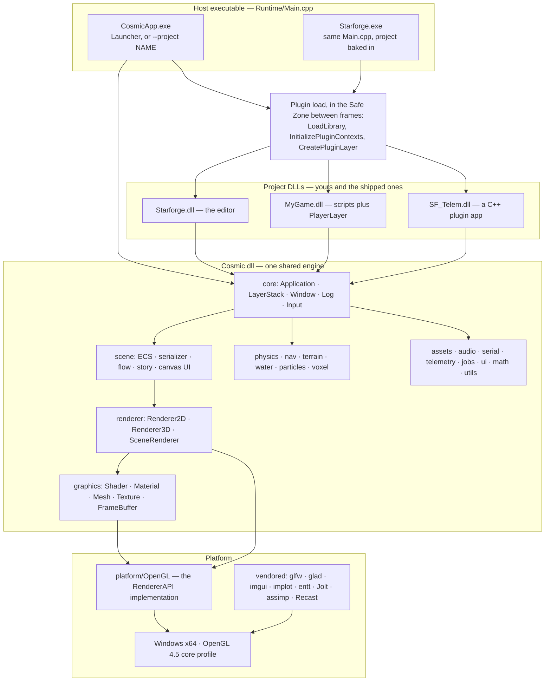

# Getting Started — Guide

**What this covers:** What Cosmic is, first-time setup, building the SDK, the two kinds of project
you can create, the tree layout, the minimal plugin skeleton, and the two build configurations.
**Source of truth:** `Runtime/Main.cpp`, root `CMakeLists.txt`, `Cosmic/CMakeLists.txt`,
`Cosmic/src/layers/LauncherLayer.cpp`, `Cosmic/src/core/Application.cpp`,
`Cosmic/src/utils/FileSystem.cpp`, `Cosmic/templates/ExampleProject/`,
`Projects/Starforge/assets/templates/`
**API Reference:** [../reference/core.md](../reference/core.md) · **How it works:**
[../systems/architecture-overview.md](../systems/architecture-overview.md) ·
[../systems/build-plugin-packaging.md](../systems/build-plugin-packaging.md)
**Configuration:** both — the differences are called out in
[Pick a build configuration](#pick-a-build-configuration)

---

## Quick start

From a clean clone, on Windows x64 with Visual Studio's C++ x64 toolset installed:

```bat
setup.bat
build_all.bat
build\Runtime\Debug\Starforge.exe
```

`setup.bat` registers the SDK root once per machine. `build_all.bat` does a clean configure and
builds the engine, both host executables, every project under `Projects/`, and the test suite.
`Starforge.exe` is the editor — the front door if you want to *make* something. To browse the
sample apps and demos instead, run `build\Runtime\Debug\CosmicApp.exe`, which boots the Launcher.

Both `.bat` scripts `pause` at the end, so run them from Explorer or a terminal you can see.

---

## What Cosmic is

Cosmic is a **C++20 engine for 2D and 3D real-time applications**, built on **OpenGL 4.5 core
profile** and targeting **Windows x64 only** (`Cosmic/src/core/Core.h` fails the build with
`#error "x86 Builds are not supported!"` on a 32-bit configure). The version is **0.9.0**
(`Cosmic/src/core/Version.h`).

The engine compiles to a single shared library, `Cosmic.dll`. Your code compiles to a **separate
DLL that the host executable loads at runtime** and hands the engine's ImGui contexts to. That
plugin boundary is the organising idea of the whole SDK: you rebuild your DLL in seconds without
touching the engine, the editor can hot-reload it while it runs, and the exact same DLL is what a
packaged app ships.

Beyond rendering, the engine carries the parts a simulation needs and a game engine usually
doesn't: a TOML config facade, fixed-step integrators, filters, lookup tables, deterministic
PCG32 RNG, a serial-port service, and a columnar telemetry recorder with replay. Those are why
projects like `SF_Telem` and `ViperSim` live in the same tree as `ForgePong`.

Cosmic also builds as **two engines from one source tree** — the full 3D engine and a pure-2D
engine that never compiles terrain, voxels, water, navigation, particles or `Renderer3D`. See
[Pick a build configuration](#pick-a-build-configuration).

### DG-1 — how the pieces fit



The vendored dependencies are linked **PRIVATE** into `Cosmic.dll` wherever their types would
otherwise leak: Jolt lives behind the `PhysicsWorld` pimpl, Recast behind `NavWorld`, assimp
behind `MeshImport`, ImGuizmo behind `Cosmic::Gizmo`. Your DLL sees `imgui`, `implot`, `glm`,
`entt`, `glad` and `glfw` (linked PUBLIC), and nothing else.

---

## Set up the SDK for the first time

**Prerequisites.** Visual Studio with the *Desktop development with C++* workload (x64 toolset)
and CMake ≥ 3.21. Every build script locates the toolchain itself through
`vswhere.exe -requires Microsoft.VisualStudio.Component.VC.Tools.x86.x64` and then calls
`VsDevCmd.bat -arch=x64`, so you do **not** need a Developer Command Prompt. If Visual Studio
isn't found the scripts fall back to whatever CMake generator is on `PATH` and say so.

**Run `setup.bat` once per machine.** It does exactly one thing:

```bat
setx COSMIC_SDK "<the folder setup.bat lives in>"
```

Two things about that are worth getting right, because the old README got both wrong:

- The variable is **`COSMIC_SDK`**, not `COSMIC_SDK_DIR`. `COSMIC_SDK_DIR` is a *CMake cache
  variable*; the root `CMakeLists.txt` sets it to the source directory, and a project's own
  `CMakeLists.txt` falls back to `$ENV{COSMIC_SDK}` only when it wasn't passed one.
- `setx` writes the persistent environment, so it affects **new** processes only. Restart your
  terminal and Visual Studio afterwards.

You can skip `setup.bat` entirely if you only ever build through the root `CMakeLists.txt` — the
scanner-built projects inherit `COSMIC_SDK_DIR` from the root scope. You need it the moment you
configure a project **standalone**, which is what a project's own `build.bat` and everything
Starforge builds do. Missing and unset, the configure fails loudly:

```
CMake Error: Cosmic Engine SDK path not found! Set COSMIC_SDK environment variable
or pass -DCOSMIC_SDK_DIR=<path>.
```

---

## Build the engine and every project

The everyday command is `build.bat`. Everything else is a variation on it.

| Command | What it does |
| --- | --- |
| `build.bat [Debug\|Release]` | Incremental build of everything. Default `Debug`. Configures `build/` if absent. |
| `build_all.bat [Debug\|Release]` | Deletes `build/` and does a clean configure + build. Use after cloning or when a glob went stale. |
| `build_engine.bat [Debug\|Release]` | Configures with `COSMIC_BUILD_ENGINE_ONLY=ON` and builds only the `Cosmic` + `CosmicApp` targets. The fastest loop for engine work. |
| `build_2d.bat` / `build_3d.bat` | Switch this tree's engine configuration and build. See [below](#pick-a-build-configuration). |

The full command reference — every script, every exe flag, every CMake option, with defaults — is
root README [§1.5](../../README.md#15-command-reference--every-command). It is the canonical list;
this chapter only covers what you need on day one.

Two behaviours of the scripts are easy to trip over:

- **They flip the CMake cache when it disagrees with them.** `build.bat` reconfigures if the cache
  says `COSMIC_BUILD_ENGINE_ONLY=ON`, and `build_engine.bat` reconfigures if it says `OFF`. So
  alternating between them costs a reconfigure each time, not just a compile.
- **The engine source list is globbed without `CONFIGURE_DEPENDS`.** Adding or deleting a file
  under `Cosmic/src/` needs an explicit reconfigure — a plain rebuild will not notice it. That is
  what `build_all.bat` is for. (Project targets vary: `SF_Telem` and the Starforge game-module
  template *do* use `CONFIGURE_DEPENDS`; the `ExampleProject` template does not.)

### What the build produces

Everything lands in **one flat output directory per configuration** —
`build/Runtime/Debug/` or `build/Runtime/Release/` — because every target sets
`RUNTIME_OUTPUT_DIRECTORY` to `${COSMIC_SDK_DIR}/build/Runtime/$<CONFIG>` rather than letting CMake
scatter binaries under `build/`:

```
build/Runtime/Debug/
├── CosmicApp.exe        ← the host: Launcher, or --project <name>
├── Starforge.exe        ← the same host with "Starforge" compiled in as the default project
├── Cosmic.dll           ← the engine (+ Cosmic.lib, the import library projects link)
├── Starforge.dll        ← the editor, as a project DLL
├── SF_Telem.dll         ← one DLL per project the scanner built
├── Frontier.dll  ViperSim.dll  Engine3DDemo.dll  ForgeIsle.dll
├── CosmicTests.exe      ← the headless doctest suite (built by default)
└── assets/
    ├── shaders/ fonts/ themes/ …     ← engine assets, synced POST_BUILD; this is engine://
    └── projects/<Name>/…             ← each project's assets, synced POST_BUILD
```

A DLL sitting flat next to the exe is exactly what the Launcher scans for, so a freshly built
project shows up with no further wiring.

**Release is the distribution configuration.** There is no separate dist flag: `Cosmic/CMakeLists.txt`
defines `COSMIC_DIST` via `$<$<CONFIG:Release>:…>`, which disables the Launcher's project-generator
UI, and `Runtime/CMakeLists.txt` links Release with `/SUBSYSTEM:WINDOWS` so no console window
opens. Release still emits PDBs (`/Zi` plus `/DEBUG /OPT:REF /OPT:ICF`) so a shipped crash dump can
be symbolised; the PDBs are not copied into a package.

### Run the tests

`CosmicTests` is built by default and never installed or packaged:

```bat
build\Runtime\Debug\CosmicTests.exe
```

Any doctest filter works (`CosmicTests.exe -ts="*COBS*"`), or run it through CTest from inside
`build\` with `ctest -C Debug --output-on-failure`.

---

## Run what you built

There are **two host executables**, both compiled from the same `Runtime/Main.cpp`:

| Executable | Boots into | Why it exists |
| --- | --- | --- |
| `CosmicApp.exe` | the **Launcher** — a picker listing every plugin DLL it can find | The generic host. `--project <NameOrDll>` skips the Launcher and boots straight into a project. |
| `Starforge.exe` | the **editor**, directly | The same bootloader with `COSMIC_STARTUP_PROJECT="Starforge"` compiled in, plus its own icon, VERSIONINFO and taskbar identity, so the editor is a real double-clickable app instead of a command line. |

`Main.cpp` decides what to boot in a fixed priority order — the first of these that yields a name
wins:

1. `--project <NameOrDll>` (or `--project=<NameOrDll>`) on the command line.
2. A `boot.cfg` file next to the exe. The first non-blank, non-`#` line is the project name. This
   is what a packaged app ships.
3. `COSMIC_STARTUP_PROJECT`, baked in at compile time (only `Starforge.exe` has one).
4. Nothing → the Launcher.

`--replay <file>` is also accepted; it is forwarded to the app through the `COSMIC_REPLAY_FILE`
environment variable, and apps that don't support replay ignore it. Anything else prints
`unrecognized argument` to stderr and is skipped.

A name resolves to a DLL by trying `<exeDir>/projects/<name>.dll` first, then
`<exeDir>/<name>.dll`; absolute paths are accepted as-is. **A missing DLL is not fatal** — it logs
an error and falls back to the Launcher, so a bad `--project` never gives you a dead window.

`Main.cpp` also forces the working directory to the exe's own directory before anything else, so
every relative path resolves the same whether you double-clicked, ran it from a terminal, or used
a shortcut.

> **The Launcher only lists real plugins.** `LauncherLayer::ScanForProjects` loads every `*.dll` in
> `projects/` and the exe directory with `DONT_RESOLVE_DLL_REFERENCES` and keeps it only if
> `GetProcAddress(handle, "CreatePluginLayer")` succeeds. `Cosmic.dll` and any third-party library
> are therefore skipped by structure, not by a name blacklist. The list re-scans every 2 seconds,
> so a DLL you just rebuilt appears without pressing anything.

---

## Create a game project (Starforge)

This is the path for making a game or an interactive app: **a self-contained project folder
anywhere on disk**, authored in the editor, with C++ scripts compiled into one game-module DLL.

1. Run `Starforge.exe`. Its homescreen lists known projects from its registry at
   `user://starforge/projects.toml`.
2. Create a new project, giving a name and a parent folder. `StarforgeApp::NewProjectAt` refuses
   if the folder already exists, then copies the editor's template tree
   (`Projects/Starforge/assets/templates/`, which syncs to
   `assets/projects/Starforge/templates/`) into `<location>/<Name>/`, substituting `@PROJECT_NAME@`
   in every file.
3. The new project opens immediately, mounting `project://` at its folder and loading
   `project://scenes/Main.cscene`.
4. Press **Ctrl+B** to build the game module. The editor watches `src/` and prompts on a fresh
   scaffold.

A scaffolded project looks like this:

```
MyGame/
├── project.cproj          ← TOML manifest: name, startup_scene, fixed_dt_hz, icon, [window]
├── CMakeLists.txt         ← builds src/ into MyGame.dll, standalone against the SDK
├── scenes/
│   └── Main.cscene        ← JSON scene, driven by the reflection registry
├── src/
│   ├── Module.cpp         ← the registration DSL: one CS_SCRIPT / CS_SYSTEM block per class
│   └── scripts/*.h,*.cpp  ← your ScriptableEntity subclasses
├── build/<Config>/        ← the module DLL, in the project's own tree (GAME_OUTPUT_DIR)
└── .starforge/            ← editor-local state: layout, thumbnail cache
```

`project.cproj` is the contract between the editor and the shipped app. Both read it through
`Cosmic::Config`:

```toml
name          = "MyGame"
startup_scene = "scenes/Main.cscene"
fixed_dt_hz   = 60
window_title  = "MyGame"
```

Optional keys: `startup_flow` (boot a `.cflow` screen flow instead of a single scene), `icon`,
`pixel_art` (point-filter every texture), and a `[window]` table with `title` / `width` / `height`.
`ProjectManifest::Save` rewrites the whole file from the known key set, so hand-added comments and
unknown keys in it will not survive an edit made from the Project Settings dialog.

`src/Module.cpp` is the only file with engine-facing boilerplate, and it is two macros deep:

```cpp
#include <Cosmic.h>
#include "scripts/HoverController.h"

CS_MODULE_BEGIN(MyGame)
    CS_SCRIPT(HoverController)
        CS_FIELD(TargetAltitude).Range(0.0f, 100.0f)
        CS_FIELD(Kp)
        CS_FIELD(Kd)
    CS_END;
CS_MODULE_END()
```

`CS_MODULE_BEGIN`/`CS_MODULE_END` expand to **three** exported functions (the header comment says
"two" — it predates the context export):

| Export | Called by | Does |
| --- | --- | --- |
| `CosmicModule_Register(ModuleRegistry&)` | the editor, on every hot reload | Registers scripts, systems and custom components. Touches no ImGui state. |
| `CreatePluginLayer()` | the Launcher, `--project`, a packaged exe | Registers the module, then returns a `Cosmic::PlayerLayer` — the editor-free player that reads `project.cproj`, loads the startup scene, ticks scripts and renders through the same `SceneRenderer` the editor viewport uses. |
| `InitializePluginContexts(HostContext)` | the host, before `CreatePluginLayer` | Adopts the host's ImGui and ImPlot contexts. |

So the same DLL the editor hot-reloads is the one a shipped build runs. There is no separate
"export" step, and no second code path to keep honest.

> **Where the module DLL goes.** The template passes `-DGAME_OUTPUT_DIR=<projectRoot>/build` for an
> external project, so the DLL lives in the project's own tree and the editor loads it by absolute
> path. Each editor rebuild appends a `GAME_HOT_SUFFIX` (`MyGame_hot3.dll`) so a still-loaded DLL
> can never block the next build.

---

## Create a C++ plugin project

This is the other path — an **engine-level app** rather than a scene-driven game. `SF_Telem`,
`ViperSim` and `Frontier` are built this way: no `.cproj`, no scene required, just a `Layer`
subclass that owns everything. Use it when your app *is* the tooling — a telemetry dashboard, a
flight sim, a benchmark harness.

Two ways to start one:

**From the Launcher.** The button is labelled **"New C++ plugin (advanced)"**, on the right-hand
Actions column. It is compiled out of Release builds (`#ifndef COSMIC_DIST`), so use a Debug host.
It defaults the target directory to `<SDK root>/Projects/`, then recursively copies
`Cosmic/templates/ExampleProject/`, replacing `TemplateProject` with your name in both file
contents and file *names*, and `ENGINE_SDK_PATH_TOKEN` with your SDK path. Only `.cpp`, `.h`,
`.txt` and `.bat` files get token substitution; everything else is copied byte-for-byte. It then
launches the generated `build.bat` in a new console.

**By hand.** Copy `Cosmic/templates/ExampleProject/` to `Projects/<YourName>/`, then rename
`TemplateProject` throughout — the target name in `CMakeLists.txt` must match, and the root
scanner's install rule assumes **target name == directory name**.

Either way, **any directory under `Projects/` containing a `CMakeLists.txt` is picked up
automatically** on the next configure. You never edit the root `CMakeLists.txt` to register a
project. The one exception is `COSMIC_SKIP_PROJECTS`, which the 2D configuration uses to drop the
3D flagships — see [below](#pick-a-build-configuration).

The template project is worth reading before you delete anything from it. It is a *working*
example of the composite-layer pattern, VFS resolution, TOML config, gamepad polling, audio
one-shots and loops, dock-port layout, and a fullscreen-hotkey override — all in code that
compiles green in both engine configurations (it names no 3D-only API at all).

---

## Find your way around the tree

```
C:\dev\Cosmic\
├── Cosmic/                     ← the engine
│   ├── src/                    ← engine source; src/Cosmic.h is the one public header
│   ├── assets/                 ← engine assets — shaders, fonts, themes  (engine://)
│   ├── dependencies/           ← vendored: glfw glad glm entt imgui implot spdlog
│   │                             stb_* miniaudio cgltf tomlplusplus nlohmann
│   │                             ImGuizmo JoltPhysics recastnavigation assimp
│   └── templates/ExampleProject/  ← the C++ plugin template the Launcher copies
├── Runtime/                    ← Main.cpp + the two host exe targets (+ .rc, .manifest)
├── Projects/                   ← scanned automatically; one subfolder per project
│   ├── Starforge/              ← the editor (a project DLL like any other)
│   ├── SF_Telem/  ViperSim/    ← simulation / telemetry apps
│   └── Frontier/  Engine3DDemo/  ForgeIsle/   ← 3D flagships
├── tests/                      ← CosmicTests (doctest) + tests/render (golden images)
├── docs/                       ← guide/ reference/ systems/ design/ plans/
├── installer/                  ← CosmicSetup.iss (Inno Setup script)
├── build/Runtime/<Config>/     ← every binary, flat, plus the synced assets/ tree
├── dist/                       ← staged distributables + zips (package.bat)
├── CMakeLists.txt              ← the root: flags, both configurations, the project scanner
├── CMakePresets.json           ← presets "default" (3D) and "2d"
├── setup.bat                   ← run once: sets COSMIC_SDK
├── build.bat  build_all.bat  build_engine.bat
├── build_2d.bat  build_3d.bat  build_all_2d.bat  build_all_release.bat
└── package.bat  package_installer.bat
```

Your own Starforge game projects do **not** have to live in this tree. Since Phase 16 they can sit
anywhere on disk; the editor keeps a registry of them and mounts `project://` at the folder you
opened.

---

## Write the minimal plugin from scratch

A plugin is one `Layer` subclass plus two exported C functions. This is the whole contract —
modelled on `Cosmic/templates/ExampleProject/src/TemplateProject.{h,cpp}`, which compiles today.

**`MyApp.h`**

```cpp
#pragma once
#include <Cosmic.h>

namespace Workspace
{
    class MyApp : public Cosmic::Layer
    {
    public:
        MyApp();
        ~MyApp() override = default;

        void OnAttach() override;
        void OnDetach() override;
        void OnUpdate(float ts) override;
        void OnFixedUpdate(float fixedDt) override;
        void OnImGuiRender() override;
        void OnEvent(Cosmic::Event& e) override;

    private:
        Cosmic::OrthographicCameraController m_Camera{ 1280.0f / 720.0f };
        Cosmic::Ref<Cosmic::Config>          m_Config;   // null if the file is absent
    };
}
```

**`MyApp.cpp`**

```cpp
#include "MyApp.h"
#include <imgui.h>

namespace Workspace
{
    MyApp::MyApp() : Cosmic::Layer("MyApp") {}

    void MyApp::OnAttach()
    {
        // Mount this project's assets. The DLL stem already sets this engine-side,
        // but be explicit — it is what makes "project://" mean your folder.
        Cosmic::FileSystem::SetActiveProject("MyApp");

        // Resolve VFS paths, then pass real paths across the DLL boundary.
        m_Config = Cosmic::Config::Load(
            Cosmic::FileSystem::Resolve("project://config/app.toml"));

        CS_INFO("MyApp attached. Config: {}",
                m_Config ? m_Config->GetSource() : "<none>");
    }

    void MyApp::OnDetach()
    {
        m_Config.reset();   // release Ref<> handles while the GL context is alive
    }

    void MyApp::OnUpdate(float ts)
    {
        m_Camera.OnUpdate(ts);

        Cosmic::Renderer2D::BeginScene(m_Camera.GetCamera());
        Cosmic::Renderer2D::DrawQuad({ 0.0f, 0.0f, 0.0f },
                                     { 1.0f, 1.0f },
                                     { 0.9f, 0.4f, 0.1f, 1.0f });
        Cosmic::Renderer2D::EndScene();
    }

    void MyApp::OnFixedUpdate(float fixedDt) { /* deterministic logic, physics, serial */ }

    void MyApp::OnImGuiRender()
    {
        ImGui::Begin("MyApp");
        ImGui::Text("%.1f fps", ImGui::GetIO().Framerate);
        ImGui::End();
    }

    void MyApp::OnEvent(Cosmic::Event& e) { m_Camera.OnEvent(e); }
}

// ============================================================================
// Required C-linkage exports — do not rename or remove.
// ============================================================================
extern "C"
{
    __declspec(dllexport) void InitializePluginContexts(Cosmic::HostContext context)
    {
        ImGui::SetCurrentContext(context.ImGuiCtx);
        ImPlot::SetCurrentContext(context.ImPlotCtx);
    }

    __declspec(dllexport) Cosmic::Layer* CreatePluginLayer()
    {
        return new Workspace::MyApp();
    }
}
```

The host calls `InitializePluginContexts` **before** `CreatePluginLayer`, handing over its own
ImGui/ImPlot context pointers. ImGui's symbols are not re-exported from `Cosmic.dll`, so your DLL
ends up with its own copy of ImGui's global state, and this call is what makes the two agree on one
UI. Omit it and the first `ImGui::Begin` in your layer dereferences a null context.

`Layer` declares an `OnRender()` hook. **Nothing calls it** — `Application::RenderSingleFrame`
drives `OnFixedUpdate`, `UpdateLayerTime`, `OnUpdate` and `OnImGuiRender`, and that is all. Issue
your draw calls from `OnUpdate`.

### Where files live: the three VFS protocols

Resolve every path through `Cosmic::FileSystem::Resolve` rather than hardcoding one:

| Prefix | Resolves to | Use for |
| --- | --- | --- |
| `engine://` | `assets/…` next to the exe | Engine-shipped shaders, fonts, themes. Read-only. |
| `project://` | `assets/projects/<name>/…` (a DLL-based project), or `<projectRoot>/[assets/]…` (a folder-based project) | Your own assets, scenes, config. Read-only. |
| `user://` | see below | **Everything you write.** Logs, prefs, recordings, `imgui.ini`. |

`user://` is decided once, at first use, by probing whether the exe directory is writable:

- **Dev / shared** (no app identity — the Launcher, `--project`, `Starforge.exe`): a writable exe
  directory keeps user data next to the app (`.`); otherwise `%LOCALAPPDATA%/Cosmic/`.
- **Packaged** (identity set from `boot.cfg`): a `portable.txt` next to the exe, or a writable exe
  directory, gives `<exe>/user/`; a read-only exe directory — an app installed under
  *Program Files* — gives `%LOCALAPPDATA%/<AppName>/`, so two shipped apps never share prefs,
  logs or recordings.

**Never write to the exe directory directly.** An installed app cannot, and the failure only shows
up on someone else's machine. Every boot logs its resolved root (`user:// root -> …`) as the first
line after construction, so a support question is one log line away from an answer.

`project://` mounting is **main-thread only** and the last setter wins: `SetActiveProject(name)`
switches to name mode and clears any absolute mount; `SetActiveProjectPath(absoluteRoot)` switches
to path mode, probing once for an `assets/` subdirectory. The state lives in `Cosmic.dll`, so all
modules in the process agree on one active project.

---

## Pick a build configuration

Cosmic builds **two engines from one source tree**, selected by `COSMIC_2D_ONLY`. The full table —
what each configuration ships, which branch and worktree it lives on, and the recorded build times
— is root README [§1.6](../../README.md#16-the-two-engine-configurations), and the mechanism is
explained in [`../systems/build-2d-3d-split.md`](../systems/build-2d-3d-split.md). What you need on
day one:

```bat
build_3d.bat     :: switch this tree to the full 3D engine, then build
build_2d.bat     :: switch this tree to the 2D-only engine, then build
```

or, equivalently, `cmake --preset default` / `cmake --preset 2d`.

- **`build_2d.bat` and `build_3d.bat` are the only mode setters.** `build.bat`, `build_all.bat` and
  `build_engine.bat` *read* `COSMIC_2D_ONLY` out of `build\CMakeCache.txt`, echo
  `[MODE] 2D-only engine` or `[MODE] full 3D engine`, and never change it. The cache is sticky, so
  after one `build_2d.bat` this tree stays 2D until you say otherwise. **Check the `[MODE]` line**
  when a build behaves oddly.
- **Use a git worktree, not a second build folder**, to have both at once. `COSMIC_SDK_DIR` is the
  *source* directory and every target writes to `${COSMIC_SDK_DIR}/build/Runtime/$<CONFIG>`, so two
  binary directories in one source tree overwrite each other's `Cosmic.dll`.
- **The 2D configuration skips four projects** by default (`Frontier`, `Engine3DDemo`, `ForgeIsle`,
  `ViperSim`) via `COSMIC_SKIP_PROJECTS`. Starforge is *not* skipped — the editor builds in both.
- **`COSMIC_2D_ONLY` is a PUBLIC compile definition** on the `Cosmic` target, unlike every other
  engine define. Your project sees exactly the value the engine was built with, so
  `#ifndef COSMIC_2D_ONLY` guards work identically in engine and client code.
- **Physics ships in both.** Rigid bodies, box/sphere/capsule colliders and the character
  controller are dimension-agnostic; only mesh and terrain-heightfield colliders are 3D-only. This
  is the most common wrong assumption about the split.

> **A freshly scaffolded Starforge project does not compile against the 2D engine as generated.**
> The template's `src/Module.cpp` registers `VoxelDigger` (which uses the `Voxels()` script proxy)
> and `NavCritter` (which uses `NavAgentComponent`), and there is no `#ifndef COSMIC_2D_ONLY`
> anywhere in `Projects/Starforge/assets/templates/`. Both proxies are fenced out of
> `ScriptableEntity` in the 2D build. Delete those two `CS_SCRIPT`/`CS_SYSTEM` blocks and their
> includes — plus `WalkController`'s siblings if you don't want them — for a 2D game. The
> `ExampleProject` C++ plugin template has no such problem; it names no 3D-only API.

---

## Common patterns

**Iterate on your DLL, not the engine.** The whole point of the plugin boundary. `build.bat` after
a project-only change relinks one DLL. If you are working on the engine itself,
`build_engine.bat` skips every project.

**Own your child layers; never push them.** A project DLL must not call
`Application::PushLayer` with its own objects. The engine owns and `delete`s everything on the
`LayerStack`, and it would run your destructor after `FreeLibrary` had unmapped the code. Instead
hold children in a `std::vector<std::shared_ptr<Cosmic::Layer>>` on your root layer and drive them
from your own hooks — the *composite-layer pattern* the template project demonstrates. The full
ownership rule, and what the engine guarantees about teardown order, is in
[`project-anatomy.md`](project-anatomy.md).

**Resolve VFS paths on your side of the boundary.** `FileSystem::Resolve` returns a plain path that
passes through engine-side resolution unchanged, so resolving in your DLL and passing the result
in always works.

**Dock panels by port, not by magic name.** Bind any window name to a slot in `OnAttach`:

```cpp
if (auto* ws = Cosmic::Application::Get().GetWorkspaceLayer())
{
    ws->DockWindow("MyApp",     Cosmic::DockPort::LeftTop);
    ws->DockWindow("Telemetry", Cosmic::DockPort::BottomCenter);
    ws->ShowThemeSelector(true, Cosmic::DockPort::RightTop, "Themes");
}
```

Window names are arbitrary — they only have to match the string you pass `ImGui::Begin`. Two
windows on the same port become tabs. (Cosmic once required the literal names
`"Project Inspector Top"` / `"Project Inspector"` / `"Project Inspector Bottom"` for pre-docked
slots; that is no longer true, and no name is special any more.) See
[`editor-ui-and-theming.md`](editor-ui-and-theming.md).

**Ship with `package.bat`.** `package.bat` stages the full SDK to `dist\Cosmic\`;
`package.bat <AppName>` stages one app and prunes the rest; `package_installer.bat <AppName>` adds
an Inno Setup installer. A Starforge-built game is packaged from *inside the editor*, which also
renames the exe, stamps its icon and writes `boot.cfg`. Details in
[`building-and-shipping.md`](building-and-shipping.md) and
[`docs/installer-guide.md`](../installer-guide.md).

---

## Pitfalls

**"CMake Error: Cosmic Engine SDK path not found!"** — `COSMIC_SDK` is unset in *this* process.
Run `setup.bat`, then restart the terminal or Visual Studio; `setx` only affects new processes. Or
pass `-DCOSMIC_SDK_DIR=<path>` explicitly.

**Missing-include errors that name engine headers, only in a project's own `build.bat`.** Same
cause: a standalone configure needs `COSMIC_SDK`. Building through the root `CMakeLists.txt`
inherits `COSMIC_SDK_DIR` and hides the problem.

**Your project doesn't appear in the Launcher.** The scan keeps only DLLs that export
`CreatePluginLayer`. Check that (a) the DLL is in `projects/` or next to the exe, (b) your
`extern "C"` export block is actually compiled in, and (c) you didn't rename the function. The list
refreshes every 2 seconds, so no rescan click is needed once it is right.

**Instant crash on the first `ImGui::Begin` in your layer.** You omitted
`InitializePluginContexts`, or you renamed it. Your DLL has its own ImGui context and it is null
until the host hands its own over.

**Overriding `OnRender()` and seeing nothing.** Nothing calls it. Draw from `OnUpdate`.

**A new file under `Cosmic/src/` isn't compiled.** The engine glob has no `CONFIGURE_DEPENDS`.
Reconfigure — `build_all.bat`, or delete `build/CMakeCache.txt`.

**A 3D project silently stops building.** Check the `[MODE]` line the script prints. In 2D mode the
scanner skips `Frontier`, `Engine3DDemo`, `ForgeIsle` and `ViperSim`, and the cache is sticky:
`build.bat` will keep building 2D forever. `build_3d.bat` switches back.

**Two build folders in one source tree.** They clobber each other's `Cosmic.dll`, because
`COSMIC_SDK_DIR` is source-relative. Use `git worktree add ../Cosmic-2D engine-2d`.

**Writes that work for you and fail for your users.** Anything under the exe directory fails once
the app is installed to *Program Files*. Route every write through `user://`.

**A packaged single-app dist doesn't get its own user-data folder.** Per-app isolation is armed
only when the identity came from `boot.cfg` (`Main.cpp`: `if (fromBootCfg && !startupProject.empty())`).
`package.bat <AppName>` builds a dist whose shortcut passes `--project`, which leaves the identity
empty and keeps the shared root; a Starforge-packaged app writes `boot.cfg` and does get isolation.

**`-DCMAKE_CXX_FLAGS=/MP`.** Don't. It *replaces* CMake's MSVC defaults (`/DWIN32 /D_WINDOWS
/EHsc`), silently disabling exceptions. `/MP` is already applied globally in the root
`CMakeLists.txt`.

---

## See also

- [`project-anatomy.md`](project-anatomy.md) — the plugin-DLL model in depth, the `Application`
  lifecycle and frame loop, the layer system, `Ref`/`Scope` and the shared-allocator rule, the
  Safe Zone.
- [`building-and-shipping.md`](building-and-shipping.md) — the two configurations in full, every
  CMake option, packaging, the installer.
- [`assets-and-vfs.md`](assets-and-vfs.md) — `AssetLibrary`, import, and TOML config.
- [`scripting.md`](scripting.md) — `ScriptableEntity`, `ScriptHost`, the registration DSL, hot
  reload, and every script proxy.
- Root README [§1.5](../../README.md#15-command-reference--every-command) — the canonical command
  reference. [§1.6](../../README.md#16-the-two-engine-configurations) — the two configurations.
- [`../systems/architecture-overview.md`](../systems/architecture-overview.md) ·
  [`../systems/build-plugin-packaging.md`](../systems/build-plugin-packaging.md) ·
  [`../systems/build-2d-3d-split.md`](../systems/build-2d-3d-split.md)
- [`../reference/core.md`](../reference/core.md) — `Application`, `Layer`, `Window`, `Log`, the
  plugin boundary.
