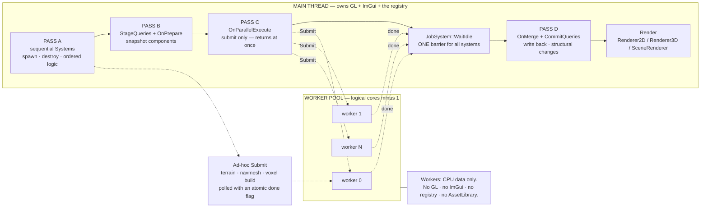

# Jobs & Parallelism — Guide

**What this covers:** the worker pool (`JobSystem`), splitting a loop across cores (`ParallelFor`),
running an ECS system in parallel (`ParallelSystem` + `SystemQuery`), getting a raw pointer to a
component pool (`ComponentArray`), cross-entity double buffering (`DoubleBuffer`), the live job
counters — and, above all, **exactly what a worker thread may and may not touch**.
**Source of truth:** `Cosmic/src/jobs/JobSystem.{h,cpp}`, `jobs/ParallelFor.h`,
`jobs/ParallelSystem.h`, `jobs/SystemQuery.h`, `jobs/ComponentArray.h`, `jobs/DoubleBuffer.h`,
`Cosmic/src/scene/Scene.{h,cpp}` (the four-pass tick), `scene/Scene3D.cpp` (voxel meshing),
`scene/SceneNav.cpp` (async navmesh bake), `core/Application.cpp` (`Initialize`/`Shutdown`),
`Projects/Frontier/src/worlds/IslandWorld.{h,cpp}`,
`Projects/Starforge/src/panels/{WorldSystemsPanel,SystemPanel}.cpp`,
`Cosmic/templates/ExampleProject/src/{AgentSystem.h,BallPhysicsSystem.h,TemplateTelemetryLayer.cpp}`
**API Reference:** [`../reference/jobs.md`](../reference/jobs.md) *(skeleton — D17 unwritten; this
chapter is the client-facing source until it lands)* · **How it works:**
[`../systems/jobs-parallelism.md`](../systems/jobs-parallelism.md) *(skeleton — D33)*
**Configuration:** **both.** All six headers are included by `Cosmic.h` unfenced and compile
identically on the 2D and 3D engines.

> **This chapter exists for one reason: the threading contract.** Everything else here is
> convenience API. Get the contract wrong and you get a crash that reproduces once a week on one
> machine. Read the next section before you write a job.

## The threading contract

The engine has **one** OpenGL context, made current exactly once on the main thread
(`OpenGLContext::Init`), and **one** ImGui context. Nothing re-binds them. That single fact
determines everything below.

**Main thread only — never from a job:**

| Surface | Why |
| --- | --- |
| Anything that creates or binds a GPU resource — `Shader::Create`, `Texture2D::Create`, `Mesh::Create`, `VertexArray`/`Buffer`/`FrameBuffer` factories, `Material::Bind` | The GL context is not current on a worker. Calls fail or crash inside the driver. |
| `Renderer2D` / `Renderer3D` / `SceneRenderer` — every verb, including `BeginScene` and stats | Same context, plus process-wide renderer state. |
| `AssetLibrary` — **all** of it, including `GetTexture`/`GetMesh` | It builds GPU resources *and* it has no internal locking whatsoever. Two workers touching the cache corrupt it. |
| ImGui / ImPlot — every call | Single context, per-frame state machine. |
| The EnTT registry — `AddComponent`, `DestroyEntity`, `CreateEntity`, `GetComponent`, views | No locking. Structural changes reallocate pools and invalidate every pointer another worker holds. |
| `JobSystem::Initialize` / `Shutdown` | Lifecycle, owned by `Application`. |
| `DataRecorder::Register` / `ReserveCapacity` / `Flush` | Registration resizes the record vector that `Record` indexes lock-free. |
| `DoubleBuffer::Swap` / `Resize` | Documented main-thread-only; no synchronisation inside. |

**Safe on a worker:**

| Surface | Why |
| --- | --- |
| Pure CPU builders that allocate no GPU state — `Terrain::Create`, `Water::Create`, `VoxelMesher::BuildChunk`, `NavWorld::Build` | Verified: each produces CPU data only; GL resources are created lazily on the first *render*, on the main thread. |
| `DataRecorder::Record` | Purpose-built for it — per-entity mutex, lock-free record lookup, atomic elapsed time. See [`serial-and-telemetry.md`](serial-and-telemetry.md). |
| `CS_CORE_INFO` / `CS_INFO` and friends | Every spdlog sink the engine installs is an `_mt` (thread-safe) sink. |
| Copying a `Ref<T>` | `Ref<T>` is `std::shared_ptr<T>`; its control block is atomic. **The pointee is not** — sharing a `Ref<Mesh>` is fine, mutating the `Mesh` from two threads is not. |
| Reading a `SystemQuery`'s staged array, or a `DoubleBuffer`'s read buffer | That is what staging and double buffering are for. |
| Your own math, containers and files, given disjoint ownership | Ordinary C++ rules. |

**The engine's own async work follows one shape, and it is the shape to copy: build CPU data on a
worker, upload to the GPU on the main thread after the barrier.** `Scene::SyncVoxelVolumes` submits
`VoxelMesher::BuildChunk` jobs, waits, then calls `Mesh::Create` on the results. Frontier builds
terrain and water on a worker, then adopts them on the main thread and lets the first render create
their GL resources.

Two rules that are not about GL:

- **Never block a job on another job.** The pool is fixed-size; a job that waits on work still in
  the queue deadlocks. `JobSystem.h` states this and nothing enforces it.
- **Never `Submit` from inside a running job.** Nested dispatch will not deadlock, but it saturates
  the queue and starves the barrier. Keep parallelism flat.

### DG-12 — Where the work actually runs



## Quick start

Split a loop across every core. `ParallelFor` submits the chunks **and waits**, so it reads as an
ordinary synchronous call:

```cpp
#include <Cosmic.h>

std::vector<Particle> particles(200'000);

Cosmic::ParallelFor(particles.size(),
    [&particles, dt](size_t begin, size_t end)
    {
        for (size_t i = begin; i < end; ++i)
        {
            particles[i].Velocity.y -= 9.81f * dt;
            particles[i].Position   += particles[i].Velocity * dt;
        }
    });

// Every element is done here. Results are safe to read immediately.
```

You never initialise the pool. `Application::Initialize` calls `JobSystem::Get().Initialize()` as
its **very first** step — before audio, before the window, before the GL context exists — and
`Application::Shutdown` calls `Shutdown()` as *its* first step, before the project DLL is unloaded
and before GL teardown. That ordering is deliberate: a job holding a function pointer into your game
DLL has already finished by the time the DLL is freed.

## Run something in the background

`Submit` takes any `void()` callable and returns immediately. Use it for one-off heavy CPU work you
want off the frame — a world build, a navmesh bake, an import.

The pattern the engine uses everywhere is **shared result + atomic done flag, polled from
`OnUpdate`**. No `WaitIdle`, because waiting is exactly what you are trying to avoid:

```cpp
struct LoadResult
{
    Cosmic::Ref<Cosmic::Terrain> Terrain;
    std::atomic<bool>            Ready{ false };
};

void MyWorld::OnAttach()
{
    m_Load = std::make_shared<LoadResult>();

    // Capture a shared_ptr to the result and a COPY of the parameters — never `this`.
    auto load = m_Load;
    TerrainSpecification spec = m_Spec;
    Cosmic::JobSystem::Get().Submit([load, spec]()
    {
        load->Terrain = Cosmic::Terrain::Create(spec);   // CPU only — no GL on this thread
        load->Ready.store(true, std::memory_order_release);
    });
}

void MyWorld::OnUpdate(float ts)
{
    if (m_Load && m_Load->Ready.load(std::memory_order_acquire) && !m_Adopted)
    {
        m_Terrain = m_Load->Terrain;   // adopt on the MAIN thread
        m_Adopted = true;              // the first render creates its GL resources, here
    }
}

bool MyWorld::IsLoading() const
{
    return !m_Load || !m_Load->Ready.load(std::memory_order_acquire);
}
```

**Capture by value, and capture a `shared_ptr` to the result rather than `this`.** The layer may be
detached while the job is still running; a captured `this` becomes a dangling pointer, while a
captured `shared_ptr` keeps the result alive until the job drops it. `IslandWorld::OnAttach` does
exactly this and says so in a comment.

Frontier holds its loading overlay up for a few extra frames after `Ready` flips
(`m_RevealFrames < 3`), so the first-frame shader-compile and GPU-upload hitch — which happens on
the main thread, after adoption — stays hidden. Worth copying; the CPU build finishing is not the
same as the world being ready to look at.

Starforge does the same thing for editor terrain builds (`WorldSystemsPanel`), and
`SceneNav::BeginBake` does it for navmesh bakes with a `NavBakeJob` you poll via `FinishBake`.

**Guard on `IsInitialized()` when the code might run headless.** Tests and tools construct no
`Application`, so the pool never spawns. Both engine sites handle it the same way:

```cpp
Cosmic::JobSystem& js = Cosmic::JobSystem::Get();
if (js.IsInitialized()) js.Submit(std::move(work));
else                    work();               // run inline — no pool in this process
```

`WaitIdle()` blocks until the queue is empty **and** every executing job has returned. It is safe to
call with nothing submitted (it returns immediately) and safe to call repeatedly. It is a
**global** barrier — it waits for every job in the process, not just yours — so calling it in a
system tick waits for someone else's background terrain build too. That is the reason
`ParallelSystem` forbids it inside `OnParallelExecute`.

`Shutdown()` drains rather than aborts: workers exit only once the stopping flag is set *and* the
queue is empty, so queued jobs still run. `~JobSystem` calls `Shutdown()` itself, as a last line of
defence against an exit path that skips `~Application` (destroying a joinable `std::thread` would
otherwise call `std::terminate`).

## Split a loop across cores

`ParallelFor.h` provides six functions: three synchronous and three `…Async` twins. The difference is
one line, and it is the whole API.

| Synchronous — submits **and** calls `WaitIdle` | Async — submits only |
| --- | --- |
| `ParallelFor(count, func, minChunk = 64)` — `func(size_t begin, size_t end)` | `ParallelForAsync(...)` |
| `ParallelForEach(data, count, func, minChunk)` — `func(T* begin, T* end)` | `ParallelForEachAsync(...)` |
| `ParallelForEachIndexed(data, count, func, minChunk)` — `func(T& item, size_t index)` | `ParallelForEachIndexedAsync(...)` |

Use the **synchronous** ones anywhere you would write a normal loop. Use the **async** ones *only*
inside `ParallelSystem::OnParallelExecute`, where the `Scene` issues one barrier for all systems.

```cpp
// Typed span — clearest when you have one array.
Cosmic::ParallelForEach(bodies.data(), bodies.size(),
    [dt](PhysicsBody* begin, PhysicsBody* end)
    {
        for (auto* b = begin; b != end; ++b)
            b->Position += b->Velocity * dt;
    });

// Element + global index — when you need to reach a parallel array.
Cosmic::ParallelForEachIndexed(bodies.data(), bodies.size(),
    [&colors](PhysicsBody& body, size_t i) { body.Tint = colors[i]; });
```

The range is cut into **contiguous** chunks, one per worker, never interleaved — so each worker
walks a cache-friendly run. `minChunkSize` (default 64) is the floor: below it, the whole range runs
**serially on the calling thread**, because scheduling would cost more than the work. The same
serial fast path is taken when the pool has one worker or is uninitialised, which is why
`ParallelFor` works fine in a headless test.

Two consequences worth internalising:

- **Intra-chunk order is preserved; inter-chunk order is not.** Never write code whose result
  depends on which chunk finished first.
- **`minChunkSize` changes the number of jobs, not just their size.** The template's `AgentSystem`
  passes `2` precisely so 20 agents become 10 chunks instead of one serial run.

### Capture rules

They differ between the two families, and this is the single easiest thing to get wrong.

**Synchronous:** the call does not return until every chunk is done, so `func` and any local it
references are still alive. Capturing locals by reference is safe.

**Async:** the call returns immediately and workers run *after* your stack frame unwinds. The
functor is stored **by value** in each job closure — but a lambda captured by value that itself
holds `[&local]` still dangles. Capture everything by value:

```cpp
// WRONG — `bounds` and `dt` die when OnParallelExecute returns.
m_Agents.ForEachAsync([&](AgentComponent& a) { a.pos = glm::clamp(a.pos, -bounds, bounds); });

// RIGHT — copy the scalars into locals, then capture those by value.
const float bounds = m_Bounds;
const float dt     = fixedDt;
m_Agents.ForEachAsync([bounds, dt](AgentComponent& a) { /* ... */ });
```

The async entry points `static_assert` that the functor is copy-constructible, so a move-only
functor fails at compile time with an explanatory message. Nothing can catch a dangling reference
*inside* a copyable lambda — that one is on you.

> **The two paths have different requirements, and the serial fast path hides the bug.** With a
> small count or a single-worker machine, `ParallelForAsync` runs `func` synchronously and a
> by-reference capture works perfectly. Cross the `minChunkSize` threshold on a multi-core machine
> and the same code reads freed stack. Always write captures as if the parallel path will run.

## Get a raw pointer to a component pool

`ComponentArray<T>::From(registry)` hands you EnTT's underlying storage as a `T*` + count, with no
iterator abstraction in the way — which is what `ParallelForEach` wants and what lets the optimiser
vectorise the inner loop.

```cpp
auto arr = Cosmic::ComponentArray<TransformComponent>::From(scene.GetRegistry());
Cosmic::ParallelForEach(arr.Data(), arr.Count(),
    [dt](TransformComponent* begin, TransformComponent* end) { /* ... */ });
```

It is **non-owning** and it maps **page 0 only**. EnTT stores components in pages; once a pool grows
past one page, page 0 covers just a prefix of `Count()`, and indexing past it is undefined. Rather
than hand back a half-valid pointer, `From` logs

```
ComponentArray<T>::From: pool spans N pages; page 0 covers only a subset.
Use FlatComponentArray<T> for pools larger than one page. Returning empty view.
```

and returns an **empty view** — `Data() == nullptr`, `Count() == 0`. The guard runs in every
configuration (it used to be a Debug-only assert, and those are compiled out everywhere; see
[`logging-and-diagnostics.md`](logging-and-diagnostics.md)). So the failure mode is *nothing
happens*, loudly in the log and silently on screen. If your loop mysteriously stops running as the
entity count grows, this is why.

`FlatComponentArray<T>` is the answer: it copies every page into one contiguous allocation and
tracks the matching entity handles alongside, so `WriteBack(registry)` can put results back
entity-by-entity. Use it past roughly 50 000 components, when you need cross-page correctness, or
when you want write-back without a `DoubleBuffer`. `PrepareFromView(registry, view)` fills it from a
multi-component view instead, keeping indices aligned across pools.

Both are only valid while **no structural change** happens to the registry. Build one inside a
system tick, use it, drop it. Never store one across frames.

## Write a parallel ECS system

`ParallelSystem` extends `System` with three hooks (plus fixed-step twins) that the `Scene` runs as
four passes:

```
PASS A   main thread   every System::OnUpdate / OnFixedUpdate
PASS B   main thread   for each ParallelSystem: StageQueries() then OnPrepare()
PASS C   main thread   for each ParallelSystem: OnParallelExecute()   <- submits, returns at once
                       JobSystem::WaitIdle()                          <- ONE barrier, all systems
PASS D   main thread   for each ParallelSystem: OnMerge() then CommitQueries()
```

Passes B, C and D are skipped entirely when no `ParallelSystem` is registered, so the pipeline costs
nothing if you don't use it. Every hook itself runs on the **main** thread — only the jobs submitted
during Pass C run on workers.

| Hook | Fixed-step twin | Do here |
| --- | --- | --- |
| `OnPrepare(scene, dt)` | `OnFixedPrepare` | Per-tick setup: pre-scale constants, resize output buffers, start a profiling timer. Registry access is safe. **Do not submit jobs.** |
| `OnParallelExecute(scene, dt)` | `OnFixedParallelExecute` | Submit with the **async** helpers only. No `WaitIdle`. No registry. No GL. |
| `OnMerge(scene, dt)` | `OnFixedMerge` | All jobs are done. Sync results to other components, create/destroy entities, emit events. |

Because *every* system submits before the single barrier, systems overlap — one system's jobs are
still running while the next submits its own. The cost is that **systems cannot depend on each
other's output within a pass**. If B needs A's results, either make A a sequential `System` or
arrange for A's merge to run first.

The worked example is `Cosmic/templates/ExampleProject/src/AgentSystem.h` — 20 steering agents that
integrate on workers and record telemetry as they go:

```cpp
class AgentSystem : public Cosmic::ParallelSystem
{
public:
    AgentSystem(Cosmic::DataRecorder* recorder, float bounds)
        : m_Recorder(recorder), m_Bounds(bounds) {}

    void OnFixedParallelExecute(Cosmic::Scene& scene, float fixedDt) override
    {
        if (m_Agents.IsEmpty()) return;

        Cosmic::DataRecorder* recorder = m_Recorder;   // copies, captured by value
        const float bounds = m_Bounds;
        const float dt     = fixedDt;

        m_Agents.ForEachAsync([recorder, bounds, dt](AgentComponent& agent)
        {
            agent.position += agent.velocity * dt;
            agent.position.x = glm::clamp(agent.position.x, -bounds, bounds);
            recorder->Record(agent.recordId, { agent.position.x, agent.position.y });
        }, 2);   // minChunkSize 2 -> 10 chunks for 20 agents
    }

    void OnFixedMerge(Cosmic::Scene& scene, float fixedDt) override
    {
        auto& reg = scene.GetRegistry();
        m_Agents.ForEachWithEntity([&reg](AgentComponent& agent, entt::entity e)
        {
            if (!reg.valid(e)) return;
            auto& t = reg.get<Cosmic::TransformComponent>(e);
            t.Position.x = agent.position.x;
            t.Position.y = agent.position.y;
        });
    }

private:
    Cosmic::DataRecorder*                  m_Recorder = nullptr;
    float                                  m_Bounds   = 5.0f;
    Cosmic::ReadWriteQuery<AgentComponent> m_Agents{ this };   // self-registers
};

CS_REGISTER_COMPONENT(Workspace::AgentComponent)   // global scope, after the struct
```

`ParallelSystem` is **non-copyable and non-movable on purpose**. Query members register themselves
with `this` in their constructors, so a copy or move would register every query a second time and
stage/commit it twice per frame. Store subclasses by `Scope<T>` — which `Scene::AddSystem` already
does — never in a `std::vector<T>` that can reallocate.

### Stage components automatically

`ReadWriteQuery<T>` and `ReadOnlyQuery<T>` are the data-access API. Declare them as members, pass
`this`, and the engine snapshots them before `OnPrepare` and (for `ReadWriteQuery`) writes them back
after `OnMerge`. You never write staging code.

| Method | Valid in | Signature |
| --- | --- | --- |
| `ForEachAsync(func, minChunk = 64)` | `OnParallelExecute` | `void(T&)` — `void(const T&)` on `ReadOnlyQuery` |
| `DispatchAsync(func, minChunk = 64)` | `OnParallelExecute` | `void(T* begin, T* end)` — range form, for SIMD or manual unrolling |
| `ForEach(func)` | `OnPrepare` / `OnMerge` | `void(T&)`, on the calling thread |
| `ForEachWithEntity(func)` | `OnMerge` | `void(T&, entt::entity)` — `ReadWriteQuery` only |
| `Data()` / `Count()` / `IsEmpty()` / `operator[]` / `EntityAt(i)` | any phase | the staged array |

Workers operate on disjoint index ranges, so two workers never touch the same element — there is no
race *within* one `ReadWriteQuery`. What is **not** safe is reading element `[i + 5]` while another
worker writes it. For algorithms that need a stable view of the whole dataset (collision, flocking,
influence fields), pair the two query types:

```cpp
class CollisionSystem : public Cosmic::ParallelSystem
{
    Cosmic::ReadOnlyQuery<PhysicsBody>  m_Read { this };   // stable snapshot
    Cosmic::ReadWriteQuery<PhysicsBody> m_Write{ this };   // output

    void OnFixedParallelExecute(Cosmic::Scene& scene, float dt) override
    {
        const PhysicsBody* stable = m_Read.Data();
        const size_t       count  = m_Read.Count();

        m_Write.DispatchAsync([stable, count, dt](PhysicsBody* begin, PhysicsBody* end)
        {
            for (auto* b = begin; b != end; ++b)
                for (size_t j = 0; j < count; ++j)
                    ResolveCollision(*b, stable[j]);       // read stable, write *b
        });
    }
};
```

Both queries stage independently from the same registry, so they begin each frame as identical
snapshots.

`Commit` writes back only where `reg.valid(entity) && reg.all_of<T>(entity)`, so an entity destroyed
during the frame is skipped rather than resurrected.

> **The structural-change guard does not exist in any build.** `ReadWriteQuery::Commit` contains a
> `CS_CORE_ASSERT` comparing the living-entity count against Stage time, and the member it compares
> is `#ifdef CS_ENABLE_ASSERTS` — a symbol defined nowhere in the tree — while `CS_CORE_ASSERT`
> itself compiles out in every configuration. The rule is real: creating or destroying entities
> between Stage and Commit lets EnTT recycle an ID, and a recycled ID receives another entity's
> staged data. Nothing warns you. Do structural work in `OnMerge` **after** the queries commit, or
> in a sequential `System`.

### Register the system — and tick the scene

```cpp
auto& agents = m_Scene->AddSystem<AgentSystem>(&m_Recorder, 5.0f);
agents.SomeTunable = 2.0f;   // AddSystem returns a reference to the constructed system
```

`AddSystem` allocates a `Scope<T>`, `dynamic_cast`s it to `ParallelSystem*`, and — if that
succeeds — also files it in the parallel list. A plain `System` subclass is simply not in that list
and never sees passes B–D. `RemoveAllSystems()` destroys the owned systems first, then clears the
non-owning parallel pointers.

> **Nothing in the engine calls `Scene::OnUpdate` or `Scene::OnFixedUpdate`.** The four-pass
> pipeline lives inside those two methods, and a tree-wide search finds **no caller** in
> `Cosmic/src`, `Projects/` or `tests/` — `PlayerLayer` and Starforge tick `ScriptHost`,
> `UpdateSpriteAnimations` and `UpdateAnimators` directly instead. The only in-tree caller of either
> is `Cosmic/templates/ExampleProject/src/TemplateTelemetryLayer.cpp`, which calls
> `m_Scene->OnFixedUpdate(dt)` from its own fixed hook. **A registered `System` or `ParallelSystem`
> never runs unless the scene's owner ticks the scene.** If your parallel system does nothing, this
> is the first thing to check:
>
> ```cpp
> void MyLayer::OnFixedUpdate(float dt)
> {
>     if (dt <= 0.0f) return;
>     m_Scene->OnFixedUpdate(dt);   // <- runs passes A-D. Without this, nothing ticks.
> }
> ```
>
> `Scene::AddSystem` has exactly one call site tree-wide, which is why this has gone unnoticed.

## Double-buffer cross-entity state

`DoubleBuffer<T>` is the other answer to the read-while-writing problem, and the one to reach for
when the data is not an ECS component. Workers read exclusively from the read buffer and write
exclusively to the write buffer, so there is no race however many threads are running; the main
thread flips them with an O(1) `Swap()` after the barrier.

```cpp
Cosmic::DoubleBuffer<BallState> m_Balls;

void OnPrepare(Cosmic::Scene& scene, float dt) override
{
    if (!m_Balls.IsReady()) m_Balls.Resize(count);   // main thread, before jobs
    m_Balls.CopyReadToWrite();                       // carry-forward when most elements won't change
}

void OnParallelExecute(Cosmic::Scene& scene, float dt) override
{
    const BallState* read  = m_Balls.GetReadBuffer();
    BallState*       write = m_Balls.GetWriteBuffer();
    const size_t     n     = m_Balls.Count();

    Cosmic::ParallelForAsync(n, [read, write, n, dt](size_t begin, size_t end)
    {
        for (size_t i = begin; i < end; ++i)
            write[i] = Integrate(read[i], read, n, dt);   // read all, write only [i]
    });
}

void OnMerge(Cosmic::Scene& scene, float dt) override
{
    m_Balls.Swap();   // main thread, after WaitIdle — promote the write buffer
}
```

`T` must be trivially copyable — there is a `static_assert`, and `CopyReadToWrite` is a `memcpy`.
For non-trivial types the header points you at `ReadWriteQuery<T>`. `Resize` **destroys existing
data in both buffers** and resets the read index to 0; size once, up front.

`GetReadBuffer()` is safe for concurrent reads. `GetWriteBuffer()` requires that each index be owned
by exactly one thread, which `ParallelFor`'s disjoint chunking guarantees — as long as job `i` only
writes `[begin, end)`.

## Read the job counters

`JobSystem` exposes four read-only queries. `GetQueuedCount()` briefly takes the queue lock; the
other three are atomic loads.

```cpp
Cosmic::JobSystem& js = Cosmic::JobSystem::Get();
ImGui::Text("Workers:   %u  (of %u logical cores)", js.GetWorkerCount(), js.GetCoreCount());
ImGui::Text("Queued:    %u",   js.GetQueuedCount());
ImGui::Text("Active:    %u",   js.GetActiveCount());
ImGui::Text("Completed: %llu", (unsigned long long)js.GetCompletedCount());
```

That is verbatim Starforge's **System panel ▸ Jobs tab** (`SystemPanel.cpp`), the T18 surface.
`GetCompletedCount()` is monotonic since `Initialize` — never reset — so it is a lifetime total, not
a per-frame figure. Sample it across two frames if you want a rate.

Worker count is `logical cores − 1`, floored at 1: one slot is left for the main thread so the OS
scheduler is not fighting itself. On a 12-thread machine that is 11 workers. There is no way to
override it — the count comes straight from `GetSystemInfo`.

## Common patterns

**Prefer `ParallelFor` to raw `Submit`.** It handles chunking, the serial fast path, the
single-worker case and the barrier. Reach for `Submit` only for genuinely one-off background work
whose completion you want to poll rather than wait on.

**Copy the scalars, then capture.** Hoisting `m_Bounds` and `fixedDt` into `const` locals before an
async lambda is not style — it is the difference between capturing a member through `this` and
capturing a value. Every shipped parallel system does it.

**Split CPU from GPU at the barrier.** Build meshes, terrain, navmeshes and images on workers;
create the GL objects on the main thread after `WaitIdle` (or after your done-flag poll).
`Scene::SyncVoxelVolumes` is the compact reference: submit `BuildChunk` per dirty chunk, `WaitIdle`,
then `Mesh::Create` each result.

**Budget the work per frame.** `SyncVoxelVolumes` meshes at most 24 chunks per call and re-queues
the rest; the collision pass does 8 bodies per fixed step. A frame that submits unbounded work just
moves the stall from one thread to eleven.

**Profile with `std::chrono` around the passes.** `AgentSystem` keeps `TimePrepareMs`,
`TimeExecuteMs` and `TimeMergeMs` as public members and displays them. Note what `TimeExecuteMs`
actually measures: the time to *submit*, since Pass C returns immediately — the real parallel time
is absorbed by the Scene's barrier and does not belong to any one system.

**Guard on `IsInitialized()` in engine-agnostic code.** Anything that might run in a test or a
headless tool should fall back to running inline.

## Pitfalls

**"It crashes inside `opengl32.dll` / `nvoglv64.dll`."** Something in a job touched GL. The usual
culprits are `AssetLibrary::GetTexture`, `Mesh::Create`, and a helper that transitively calls one.

**"The loop silently does nothing, and the entity count is large."** `ComponentArray::From` returned
an empty view because the pool spans multiple pages. Check the log for the `pool spans N pages`
error and switch to `FlatComponentArray`.

**"It works in Debug and corrupts in Release" / "it works on my 4-core laptop."** Almost always a
by-reference capture in an async lambda. On a small range or a small machine the serial fast path
runs `func` synchronously and hides the bug; cross `minChunkSize` on a big machine and it reads
freed stack.

**"My parallel system never runs."** Nobody ticks the scene — see the box above. `Scene::OnUpdate`
and `Scene::OnFixedUpdate` have no engine caller.

**"Everything serialised — parallel is slower than the loop it replaced."** You called the
synchronous `ParallelFor` inside `OnParallelExecute`. It waits, so system B does not submit until
system A's jobs are done, and you paid the scheduling cost for nothing. Use the `…Async` twin.

**"`WaitIdle` hangs."** Either a job is blocked waiting on another job (fixed-size pool, guaranteed
deadlock), or something else in the process submitted long-running work — the barrier is global.

**"Component values snap back after the merge."** `ReadWriteQuery::Commit` runs *after* `OnMerge` and
overwrites `T` from the staged array. Writing to the live registry's `T` inside `OnMerge` is
therefore pointless. Write to the staged element instead, and use `OnMerge` only to sync to *other*
component types.

**"An entity got another entity's data."** You created or destroyed entities between Stage and
Commit and EnTT recycled an ID. Nothing catches this — the guard is compiled out in every build.

**"The counters read as huge."** `GetCompletedCount()` is a lifetime total since `Initialize`.

**"Nested `ParallelFor` got slower."** Nested dispatch saturates the queue; the inner calls compete
with the outer ones for the same fixed pool. Keep parallelism flat and single-level.

## See also

- [`entities-and-components.md`](entities-and-components.md) — the ECS, `System`, and the component
  catalogue the queries stage.
- [`serial-and-telemetry.md`](serial-and-telemetry.md) — `DataRecorder`, the one engine API designed
  to be called from a worker.
- [`world-systems.md`](world-systems.md) — terrain, water and particles, and the async-build pattern
  Frontier wraps around them.
- [`voxels.md`](voxels.md) · [`navigation-and-ai.md`](navigation-and-ai.md) — the engine's two other
  `Submit` sites, both CPU-build-then-upload.
- [`project-anatomy.md`](project-anatomy.md) — where `JobSystem::Initialize`/`Shutdown` sit in the
  `Application` lifecycle.
- [`logging-and-diagnostics.md`](logging-and-diagnostics.md) — why `CS_CORE_ASSERT` never fires, and
  the profiler/stats surfaces.
- [`../reference/jobs.md`](../reference/jobs.md) — per-call signatures (skeleton — D17).
- [`../systems/jobs-parallelism.md`](../systems/jobs-parallelism.md) — internals and rationale
  (skeleton — D33).
- In-tree exemplars: `Cosmic/templates/ExampleProject/src/AgentSystem.h` — the only registered
  `ParallelSystem` in the tree — and `BallPhysicsSystem.h`, a gravity + damping + bounds integrator
  over `ReadWriteQuery<PhysicsBody>` that ships in every generated project and is **never
  registered by anything**, so read it as a template rather than as running code;
  `Projects/Frontier/src/worlds/IslandWorld.cpp` (background world build);
  `Cosmic/src/scene/Scene3D.cpp` (`SyncVoxelVolumes`) and `scene/SceneNav.cpp`
  (`BeginBake`/`FinishBake`).
