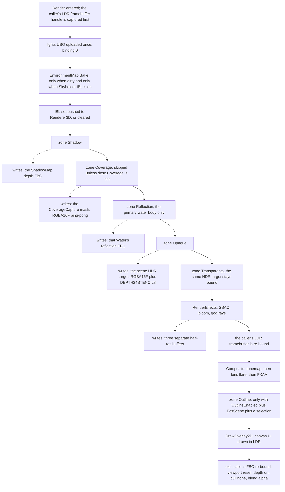

# Lighting & Environment — Guide

**What this covers:** `SceneRenderer` — the engine-owned frame orchestrator most 3D apps should
use instead of driving passes by hand: filling a `SceneRenderDesc` and calling `Render()`, the pass
graph in order, directional and point lights and the lights UBO, PBR + image-based lighting, the
four sky modes including the physical Rayleigh+Mie atmosphere, time-of-day, sun shadows, and the
full post chain — SSAO, bloom, FXAA, tonemap, fog, god rays, heat haze and vignette.
**Source of truth:** `Cosmic/src/renderer/SceneRenderer.{h,cpp}`,
`renderer/PostProcessStack.{h,cpp}`, `renderer/EnvironmentMap.{h,cpp}`,
`renderer/ShadowMap.{h,cpp}`, `renderer/CoverageCapture.h`, `renderer/BindingPoints.h`,
`renderer/Renderer3D.{h,cpp}`, `scene/Components.h` (`EnvironmentComponent`),
`scene/Components3D.h` (the two light components), `scene/Scene3D.cpp`,
`Cosmic/assets/shaders/{EnvSky,SkyDetail,Tonemap,PBR}.glsl`, `tests/render/render_3d.cpp`
**API Reference:** [../reference/rendering-pipeline.md](../reference/rendering-pipeline.md)
*(skeleton — D11)* · **How it works:**
[../systems/rendering-pipeline.md](../systems/rendering-pipeline.md) *(skeleton — D29)*
**Configuration:** **3D only.** `EnvironmentMap`, `ShadowMap` and `CoverageCapture` are filtered out
of the 2D engine build and their includes sit behind `#ifndef COSMIC_2D_ONLY` in `SceneRenderer.h`
(`:59-66`) — see [`../systems/build-2d-3d-split.md`](../systems/build-2d-3d-split.md). `SceneRenderer`
and `PostProcessStack` themselves ship in **both**: a 2D build runs the same class with the spine
`BeginHDR → sprites via DrawTransparent → tonemap/FXAA/bloom/vignette → DrawOverlay2D`, and
everything in this chapter except that spine and the post-chain toggles is fenced out. Naming
`EnvironmentMap`, `ShadowMap`, `desc.Lights`, `desc.TerrainSystem`, `desc.WaterBodies`,
`desc.Emitters`, `desc.DrawOpaque` or `desc.DetailedSky` in a `COSMIC_2D_ONLY` tree is a compile
error, by design.

There are two ways to render a 3D frame in Cosmic and only one of them is a good idea. You can drive
the passes yourself — bind a shadow map, render depth, mirror the camera for a water reflection,
bind the HDR target, draw, run SSAO and bloom, tonemap into the viewport — which is roughly 450
lines and is what Engine3DDemo deliberately still does so the primitives stay exercised. Or you can
describe *what* is in your frame in a `SceneRenderDesc`, hand it to `SceneRenderer::Render`, and let
the engine own *how*. **Everything shipped does the second thing**, including the editor viewport
and the packaged player, and this chapter is written that way: the quickstart is the whole API for
most apps, and driving passes by hand is a footnote near the end.

---

## Quick start

```cpp
#include "Cosmic.h"

class MyLayer : public Cosmic::Layer
{
public:
    void OnDetach() override
    {
        m_Renderer.Shutdown();          // free GPU resources while the context is live
    }

    void OnUpdate(float deltaTime) override
    {
        auto& app = Cosmic::Application::Get();
        Cosmic::Ref<Cosmic::FrameBuffer> viewport = app.GetFrameBuffer();
        if (!viewport || viewport->GetWidth() < 1)
            return;

        const uint32_t w = viewport->GetWidth(), h = viewport->GetHeight();
        if (!m_Renderer.IsInitialized())
            m_Renderer.Init(w, h);      // needs a live GL context
        m_Renderer.SetViewportSize(w, h);

        viewport->Bind();               // PRE-condition: the final LDR target is bound
        Cosmic::RenderCommand::SetViewport(0, 0, w, h);

        Cosmic::SceneRenderDesc desc;
        desc.SetCamera(m_Camera);
        desc.TimeSeconds = m_Clock;
        desc.DeltaTime   = deltaTime;
        desc.Exposure    = 1.0f;

        desc.Lights.SunDirection = glm::normalize(glm::vec3{ -0.4f, -1.0f, -0.3f });
        desc.Lights.SunColor     = { 1.0f, 0.96f, 0.88f };
        desc.Lights.SunIntensity = 3.0f;
        desc.Lights.Ambient      = 0.25f;

        desc.Settings.Shadows      = true;
        desc.Settings.ShadowCenter = m_Camera.GetPosition();   // the map follows the viewer
        desc.Settings.ShadowRadius = 40.0f;

        desc.DrawOpaque = [this](const Cosmic::SceneDrawContext& c)
        {
            c.DrawMesh(m_Ground, glm::mat4(1.0f), m_GroundMat);
            c.DrawMesh(m_Box,    m_BoxTransform,  m_BoxMat);
        };

        m_Renderer.Render(desc);
        m_Clock += deltaTime;
    }

private:
    Cosmic::SceneRenderer m_Renderer;
    Cosmic::PerspectiveCamera m_Camera{ 60.0f, 16.0f / 9.0f, 0.1f, 1000.0f };
    Cosmic::Ref<Cosmic::Mesh>     m_Ground, m_Box;
    Cosmic::Ref<Cosmic::Material> m_GroundMat, m_BoxMat;
    glm::mat4 m_BoxTransform{ 1.0f };
    float m_Clock = 0.0f;
};
```

That frame gets you an HDR render target, a tonemapped resolve, FXAA, a fitted directional shadow
map with PCF, a procedural sky background and image-based ambient — none of which appear in the
code, because they are `SceneRendererSettings` defaults. Six things it is quietly asserting:

- **`Init` needs a live GL context and is one-shot.** `Init` returns immediately if already
  initialized (`SceneRenderer.cpp:203`), so the `shadowMapSize` third argument (default `2048`) can
  only be chosen on the *first* call. `Shutdown()` before context teardown; the destructor calls it
  if you forget, which is too late if the context is already gone.
- **`SceneRenderer` is non-copyable** (`SceneRenderer.h:280-281`) — it owns three GPU subsystems
  outright. Hold it by value as a member, or by `Ref`/`Scope`.
- **You bind the final target; the renderer restores it.** PRE: your LDR framebuffer is bound. POST:
  the same framebuffer is re-bound, the viewport is `(0, 0, w, h)`, and depth test/write are ON,
  cull is None, blend is Alpha (`SceneRenderer.h:288-294`).
- **`DrawOpaque` is invoked more than once per frame** — once per pass that needs your geometry
  (shadow, coverage, reflection, main). Write it as a pure submit function with no side effects. The
  `SceneDrawContext` tells you which pass you are in.
- **`Render` refuses to re-enter.** Calling it from inside a draw callback logs
  `SceneRenderer::Render re-entered` and returns (`:326-330`).
- **`Renderer3D::BeginScene`/`EndScene` are the renderer's job, not yours.** Inside `DrawOpaque` you
  use the context's verbs (or raw `Renderer3D::Draw*` in the Reflection/Main passes only, where a
  scene is open).

**Defaults, at a glance.** `Skybox`, `IBL`, `Shadows`, `WaterReflections`, `TerrainCastsShadows` and
`FXAA` start **on**; `SSAO`, `Bloom`, `Fog`, `GodRays`, `HeatHaze`, `Underwater`, `LensFlare`,
`Vignette`, `Wireframe` and `OutlineEnabled` start **off** (`SceneRenderer.h:162-213`).

---

## DG-8 — the pass graph



This is the client-facing view. The authoritative pass-by-pass spec — including the FBO-ownership
rule and the render-state contract every subsystem restores — is
[`../design/frame-lifecycle.md`](../design/frame-lifecycle.md) §4–§5; this chapter summarises it and
does not restate it.

### What each pass does, and what turns it off

| # | GPU zone | Runs when | What it submits | Skipped if |
| --- | --- | --- | --- | --- |
| 1 | *(no zone)* | always | `Renderer3D::SetLightDirection`/`SetAmbient`/`SetAmbientIntensity`/`SetLights` from `desc.Lights` | never |
| 2 | *(no zone)* | `Settings.IBL \|\| Settings.Skybox` | `EnvironmentMap::Bake` — sky cube → irradiance → prefilter | nothing dirty, or both flags off |
| 3 | `Shadow` | `Settings.Shadows` | `DrawOpaque` with a `ShadowDepth` context + ECS `MeshRenderer`/`LODGroup` casters + `Terrain::RenderDepth` | `Shadows` off ⇒ `Renderer3D::ClearShadow()` and everything is lit |
| 4 | `Coverage` | `desc.Coverage` is set and initialized | the same casters with a `TopDownDepth` context, then `UpdateCoverage` | `desc.Coverage == nullptr` (the default) |
| 5 | `Reflection` | `Settings.WaterReflections` and `PrimaryReflectionWater` indexes a real body | mirrored camera + oblique clip: sky, terrain, `DrawOpaque` | no water, `PrimaryReflectionWater < 0`, or the index is out of range |
| 6 | `Opaque` | always | `BeginHDR` + clear, skybox, terrain, `DrawOpaque`, then `EcsScene->OnRender3D` | nothing — the HDR bind and clear always happen |
| 7 | `Transparents` | always | water far→near, particle emitters, ribbons, then `DrawTransparent` | the individual lists are empty |
| 8 | `Post+Composite` | always | `RenderEffects` (SSAO/bloom/god rays), then `Composite` into your FBO | individual effects by their flags |
| 8b | `Outline` | `OutlineEnabled` **and** `EcsScene` **and** a non-empty `SelectedEntities` | an id-mask pass + a fullscreen edge detect over the LDR frame | any of the three missing |
| 9 | *(no zone)* | `desc.DrawOverlay2D` set | your callback, LDR bound, after everything | callback null |

The zone names are the rows of the GPU profiler HUD (see
[`logging-and-diagnostics.md`](logging-and-diagnostics.md)); a disabled feature shrinks or zeroes
its zone, which is the cheapest way to confirm a toggle actually took effect.

> **GPU zone timings only exist if something calls `SceneRenderer::Render`.** `Render` owns the only
> `GpuFrameMark` in the engine (`:336`), and results lag one to three frames by design. An app that
> drives passes by hand gets no profiler rows.

### Two callbacks, three places geometry can come from

`SceneRenderDesc` accepts opaque geometry from two independent sources and they are **not**
interchangeable:

| Source | Reaches shadow? | Reaches reflection? | Reaches main? |
| --- | --- | --- | --- |
| `desc.DrawOpaque` | ✅ (routed to `ShadowMap::DrawCaster`) | ✅ | ✅ |
| `desc.EcsScene` | ✅ (a separate `MeshRenderer`/`LODGroup` walk in `PassShadow`) | ❌ **never** | ✅ (via `Scene::OnRender3D`) |
| `desc.DrawTransparent` | ❌ | ❌ | ✅, in the transparent pass |

`Scene::BuildRenderDesc` deliberately leaves `EcsScene` **null** and routes everything through
`DrawOpaque` instead (`Scene3D.cpp:851-853`) — that is what makes ECS meshes reflect, and setting
both would double-draw. The submit function it installs, `Scene::SubmitOpaqueMeshes`, is **private**,
so you cannot reproduce that wiring yourself: **if you are rendering a `Scene`, call
`BuildRenderDesc` and then override what you need on the returned desc.** Setting `desc.EcsScene`
directly is the supported-but-lesser path, and it costs you reflections.

> **`Scene::OnRender3D` re-uploads the lights UBO from the scene's own light components**, so
> `PassOpaqueHDR` re-asserts `desc.Lights` right after calling it (`SceneRenderer.cpp:619-624`).
> With `EcsScene` set, the *scene's* lights win for the ECS geometry and `desc.Lights` wins for the
> transparent tail. One more reason to prefer the `DrawOpaque` route.

---

## Lights

### The sun

There is exactly **one** directional light per frame, and it is a field on the desc, not a scene
object:

```cpp
desc.Lights.SunDirection = glm::normalize(glm::vec3{ -0.4f, -1.0f, -0.3f });  // TRAVEL direction
desc.Lights.SunColor     = { 1.0f, 0.96f, 0.88f };
desc.Lights.SunIntensity = 3.0f;
desc.Lights.Ambient      = 0.25f;   // flat floor for faces turned away from the sun
```

> **`SunDirection` is the direction light *travels*, not the direction *to* the sun.** Every
> renderer-side API in this chapter uses the travel convention — `SceneLightsDesc::SunDirection`,
> `DirectionalLightComponent::Direction`, `ShadowMap::SetLight`, `PostProcessStack::SetLensFlareSun`.
> **`EnvironmentMap::SetSunDirection` is the one exception: it takes the direction *to* the sun**
> (`EnvironmentMap.h:113`). `ApplyEnvironment` negates for you (`SceneRenderer.cpp:291-293`); code
> that drives the environment directly must do it itself, and getting it backwards puts the sun
> disc on the opposite horizon from the shadows.

The values are uploaded once, up front, into the std140 lights block at binding `0`
(`Bindings::LightsUbo`), before any pass runs — so the reflection pass, the opaque pass and the
transparent tail all read the same lighting.

### Point lights

```cpp
Cosmic::Renderer3D::PointLightDesc p;
p.Position  = { 4.0f, 2.0f, -3.0f };
p.Radius    = 12.0f;
p.Color     = { 1.0f, 0.55f, 0.2f };
p.Intensity = 8.0f;
desc.Lights.Points.push_back(p);
```

| Fact | Value | Where |
| --- | --- | --- |
| Hard cap | **16** (`kMaxPointLights`) | `Renderer3D.h` |
| Over the cap | extras dropped, **one** `static bool` warning for the whole process run | `Renderer3D::SetLights` |
| Falloff | `pow(clamp(1 − (d/r)⁴, 0, 1), 2) / (d² + 1)` — windowed inverse-square, so `Radius` is a **hard cut**, not an asymptote | `PBR.glsl:314` |
| Read by | every shader declaring the std140 `LightsBlock`: `PBR`, `PBRInstanced`, `PBRSkinned`, `MeshLit`, `Mesh3D`, `Terrain`, `Water`, `WaterFlow`, `FlowEmissive` | — |
| Ignored by | anything that does not declare the block | — |

A scene permanently over 16 lights therefore logs **one line, ever**, and then silently renders the
first sixteen every frame. If your lighting looks wrong in a dense scene, count the lights first.

### Letting the scene supply the lights

If you are rendering a `Scene`, `Scene::BuildRenderDesc` fills `desc.Lights` for you from the ECS —
`GatherSceneLights` (`Scene3D.cpp:96-127`):

- **The first `DirectionalLightComponent` that is `Enabled` *and* active in the hierarchy becomes
  the sun, and the walk stops there** (`:110`). Additional directional lights are silently ignored.
  There is no "which one is the sun" flag; it is registry iteration order.
- **Every** enabled, active `PointLightComponent` is pushed with the entity's `Transform.Position`
  as its world position. `SetLights` is the single place truncation happens.
- `lights.Ambient` is seeded from `Renderer3D::GetAmbient()` — the process-wide value, *not*
  anything on the `EnvironmentComponent`. `ApplyEnvironment` does not touch it either. To change
  ambient from an environment entity, use `AmbientIntensity` (which scales the ambient/IBL term)
  rather than expecting `Ambient` to move.

Component fields, units and defaults are catalogued in
[`entities-and-components.md`](entities-and-components.md); this chapter does not repeat them.

---

## PBR and image-based lighting

`EnvironmentMap` owns the whole IBL resource set and bakes it from the sky. Because the skybox
background and the lighting are convolutions of the **same cube**, they can never disagree — change
the sky and the ambient changes with it, automatically.

| Resource | Size | Built by |
| --- | --- | --- |
| Environment cube (mipmapped) | 256² per face | `EnvSky.glsl`, or `EquirectToCube.glsl` for an HDRI |
| Diffuse irradiance cube | 32² | `IrradianceConvolve.glsl` |
| Prefiltered specular cube | 128², **5 roughness mips** | `PrefilterEnv.glsl` |
| Split-sum BRDF LUT | 512², RG in RGBA16F | `BrdfLut.glsl`, baked **once** at `Init` |

`Render` calls `Bake()` when `IBL || Skybox` is on; `Bake()` is a no-op unless something marked the
environment dirty. **Every setter is change-guarded** — `SetSunDirection`, `SetSkyIntensity`,
`SetNightSky`, `SetMoon`, `SetPhysicalSky` and `SetHdri` all compare before assigning
(`EnvironmentMap.cpp:123-199`) — so calling them with unchanged values every frame is free.

Moving the sun is **not** free: a rebake is six cube faces plus mip generation, six irradiance
faces, and six faces × five prefilter mips. A continuously animated time-of-day cycle pays that
every frame. That is a deliberate trade (the lighting is always exactly right), but it is why
Frontier's day/night panel has a play/pause control rather than always running.

### What a material needs to receive IBL

Nothing, if it uses an engine PBR shader. `Renderer3D::ApplySceneBindings` pushes the whole set to
every material draw at flush time (`Renderer3D.cpp:985-1030`):

| Uniform | Meaning |
| --- | --- |
| `u_IrradianceMap` / `u_PrefilterMap` / `u_BrdfLut` | sampler units 8 / 9 / 10 — assigned **unconditionally**, whether or not IBL is active |
| `u_HasIBL` | `1.0` when an IBL set is registered, else `0.0` |
| `u_PrefilterMaxLod` | highest prefilter mip, for the roughness → LOD mapping |
| `u_ShadowMap` / `u_LightViewProj` / `u_ShadowBias` / `u_HasShadow` | unit 11 + the sun matrix |
| `u_AmbientIntensity` | `Settings.AmbientIntensity`, scales the ambient/IBL term |
| `u_Snow*` (incl. `u_SnowMaskMap`, unit 12) | the scene-wide snow overlay, when armed |

The unconditional sampler assignment is not cosmetic: leaving `samplerCube` uniforms at their
default unit 0 alongside a material's `sampler2D`s is two sampler *types* on one unit, which is a
draw-time `INVALID_OPERATION` per the GL spec — lenient on NVIDIA, fatal on Mesa/ANGLE-class
drivers. Reserved units are registered in `renderer/BindingPoints.h`; your material's own textures
bind from unit 0 upward and never collide.

> **The engine's convention uniforms are written *after* `Material::BindFull`, so they always win.**
> This is load-bearing in a place that looks like a bug: the glTF importer writes `u_HasIBL = 0`
> into every material it builds, and imported models still receive IBL because `ApplySceneBindings`
> overwrites it at flush. See
> [`materials-and-shaders.md`](materials-and-shaders.md) and
> [`rendering-3d.md`](rendering-3d.md) for the full uniform contract.

A custom shader that wants IBL declares the uniforms above and does the split-sum lookup itself; the
engine will feed it. A shader that declares none of them no-ops on location `-1` and is unaffected.

### Turning IBL off

`Settings.IBL = false` calls `Renderer3D::ClearIBL()` (`SceneRenderer.cpp:360`), which sets
`u_HasIBL = 0` everywhere. Materials then fall back to the flat `Ambient` floor, which is much
darker — expect to raise `desc.Lights.Ambient` or `AmbientIntensity` if you do this deliberately.

---

## Sky

Four modes exist on `EnvironmentComponent::SkyMode`, and they do not all reach the renderer the same
way.

| Mode | What it draws | Reached via `ApplyEnvironment`? |
| --- | --- | --- |
| `Procedural` (0) | the artistic gradient sky, baked into the cube | ✅ — the default |
| `Detailed` (1) | per-pixel `SkyDetail.glsl`: limb-darkened sun disc, hashed stars, milky way, phased moon | ❌ **no** — see below |
| `HDRI` (2) | an equirectangular `.hdr` projected onto the cube | ✅ |
| `Physical` (3) | analytic Rayleigh+Mie single scattering, baked into the cube | ✅ |

> **`SkyMode::Detailed` does nothing through `ApplyEnvironment`.** The detailed sky is drawn only
> when `desc.DetailedSky` is non-null (`SceneRenderer.cpp:548`, `:595`), and `ApplyEnvironment`
> never sets that pointer — it treats `Detailed` exactly like `Procedural` (clears any HDRI,
> disables the physical sky). A scene authored with `Sky = Detailed` renders the plain procedural
> cube. The only in-tree users of the detailed sky are Frontier's five worlds, which set the pointer
> by hand. `EnvironmentComponent::SunAngularSize` has the same shape: it is forwarded into
> `PhysicalSkyDesc` and therefore works in `Physical` mode, but the `SkyDetailDesc::SunAngularRadius`
> it would drive in `Detailed` mode is never written.

### Procedural (the default)

Nothing to do. `SetSunDirection` (direction **to** the sun) is the only input, plus
`SetSkyIntensity`.

> `EnvironmentComponent::IBLIntensity` maps onto `EnvironmentMap::SetSkyIntensity`
> (`SceneRenderer.cpp:294`), which scales the whole baked cube — **the visible skybox background as
> well as the lighting**, not just the IBL its name suggests.

### HDRI

```cpp
Cosmic::EnvironmentComponent env;
env.Sky      = Cosmic::EnvironmentComponent::SkyMode::HDRI;
env.HdriPath = "project://textures/sunset_4k.hdr";
renderer.ApplyEnvironment(env, desc);
```

`ApplyEnvironment` resolves the VFS path for you (`FileSystem::Resolve`, `:300`) — one of the few
engine paths that does. Driving `EnvironmentMap::SetHdri` directly requires an **already-resolved
filesystem path**; it will not resolve `project://` for you.

**A failed load never gives you a black scene.** `SetHdri` logs `could not load '…' — keeping the
procedural sky` and reverts (`EnvironmentMap.cpp:191-193`). If `EquirectToCube.glsl` itself is
missing, `Bake` logs and falls through to the procedural path (`:253-254`). Both symptoms read as
"my HDRI is being ignored" — check the log, not the pixels.

Note that with an HDRI active the physical-sky and sun-disc parameters are bypassed entirely: the
equirect projection replaces the analytic sky, and the convolution chain downstream is identical.

### Physical atmosphere (Phase 27)

```cpp
env.Sky           = Cosmic::EnvironmentComponent::SkyMode::Physical;
env.Turbidity     = 2.5f;    // haze: scales Mie density. 1 = pristine, 10 = smoggy
env.RayleighScale = 1.0f;    // the blue term
env.MieScale      = 1.0f;    // the white-haze / sun-halo term
env.MieG          = 0.80f;   // Mie phase asymmetry, 0..0.99 — tightens the halo
env.SunAngularSize = 0.53f;  // sun-disc DIAMETER in degrees; the real sun is ~0.53
```

`EnvSky.glsl` evaluates an analytic single-scattering model with real sea-level coefficients —
Rayleigh `(5.8, 13.5, 33.1) × 10⁻⁶`, Mie `21 × 10⁻⁶`, scale heights 8000 m and 1200 m
(`EnvSky.glsl:122-125`) — instead of the artistic gradient. Because it bakes into the same cube,
**the sky you see and the light in the scene are the same function**: raise `Turbidity` and the
scene goes hazier *and* the ambient warms, with no second knob.

`SunAngularSize` is authored as a **diameter in degrees** and converted to a radius in radians at
bake time (`EnvironmentMap.cpp:275-276`) — a common place to be off by 2×. Setting it to `0`
removes the crisp disc.

Every parameter is ignored unless `Sky == Physical`, so their presence keeps the other three modes
byte-identical to what they rendered before Phase 27 (`SceneRenderer.cpp:306-313`).

### Night, moon and the detailed sky

The bake has a night tier — `SetNightSky(true)` darkens the cube through twilight and hands over to
a moon-glow term, so the IBL yields cool moonlit ambient — and `SetMoon(toMoon, intensity)` feeds
it. The crisp moon *disc*, stars and milky way live in the per-pixel detailed sky, not the bake:

```cpp
// Frontier's pattern. m_Sky must OUTLIVE the Render call, so it is a member.
Cosmic::SkyDetailDesc m_Sky;
...
m_Sky.MoonDirection     = toMoon;
m_Sky.MoonIntensity     = 1.5f;
m_Sky.StarIntensity     = 1.0f;
m_Sky.StarDensity       = 90.0f;      // candidate stars per cube-face axis
m_Sky.MilkyWayIntensity = 0.35f;
m_Sky.Time              = timeSeconds; // star twinkle
desc.DetailedSky = &m_Sky;             // points at app-owned storage

renderer.GetEnvironment().SetSunDirection(toSun);   // still drives the IBL + the sun disc
renderer.GetEnvironment().SetNightSky(sunIsBelowHorizon);
renderer.GetEnvironment().SetMoon(toMoon, nightRamp);
```

The shader gates the moon and stars behind its own day/night ramp, so those values can stay constant
across the whole cycle.

---

## Time of day

There is **no engine time-of-day system.** The engine ships the generic verbs — move the sun,
rebake, set the night tier — and the *choreography* (sun path, colour palette, fog ramp, when night
starts) is app policy. That is deliberate: nothing scenario-shaped lives in the engine.

> **`EnvironmentComponent::TimeOfDay` is reflected, editable in the Inspector, set by three shipped
> sample scenes — and read by nothing.** A tree-wide search finds only writes and the reflection
> registration (`TypeRegistry.cpp:106`); `ApplyEnvironment` does not map it, and no panel derives a
> sun direction from it. Scrubbing it changes nothing. Author the sun with `SunDirection` (or the
> Environment panel's elevation/azimuth widget, which writes that vector).

The reference implementation is `Projects/Frontier/src/common/DayNightCycle.h` — a header-only pure
function mapping a `0..24` clock to a full lighting state. Its shape is worth copying:

```cpp
const DayState state = DayNightCycle::Evaluate(m_TimeHours, ctx.TimeSeconds);

// The REAL sun always drives the sky + IBL, so stars and the moon appear when it sets.
renderer.GetEnvironment().SetSunDirection(state.ToSun);
renderer.GetEnvironment().SetNightSky(state.Night);
renderer.GetEnvironment().SetMoon(state.MoonDir, state.MoonIntensity);

// The KEY light is separate: the sun by day, dim cool moonlight after dark.
desc.Lights.SunDirection = state.SunDir;
desc.Lights.SunColor     = state.SunColor;
desc.Lights.SunIntensity = state.SunIntensity;
desc.Lights.Ambient      = state.Ambient;
desc.Settings.FogColor   = state.FogColor;   // fog tracks the hour; density stays a control
m_Sky = state.Sky;
desc.DetailedSky = &m_Sky;
```

The split between `ToSun` (appearance) and `SunDir` (the key light) is the part people get wrong.
Keeping them coupled means the sky goes dark and the key light dies with it; keeping them separate
lets moonlight take over the key while the sky still shows the real sun below the horizon.

---

## Shadows

One directional shadow map, fitted to a bounding sphere you supply, sampled with 3×3 PCF in the lit
shaders. Cascaded shadow maps are a documented deferral, not a shipped feature — the API is
CSM-ready via the fitted matrix, but there is one map today.

```cpp
desc.Settings.Shadows      = true;                       // on by default
desc.Settings.ShadowCenter = { camPos.x, groundY, camPos.z };
desc.Settings.ShadowRadius = 40.0f;                      // world units; default 50
desc.Settings.ShadowBias   = 0.0015f;                    // default
desc.Settings.TerrainCastsShadows = true;                // default
```

| Knob | Effect | Set where |
| --- | --- | --- |
| `shadowMapSize` | texels per side (default `2048`) | **`Init()` only** — cannot be changed later |
| `ShadowCenter` / `ShadowRadius` | the world sphere the ortho frustum is fitted around | per frame |
| `ShadowBias` | slope-scaled bias in the lit shader, fighting acne | per frame |
| `TerrainCastsShadows` | includes `Terrain::RenderDepth` in the pass | per frame |
| `MeshRendererComponent::CastShadows` / `LODGroupComponent::CastShadows` | per-entity opt-out | on the component |

The fit is straightforward (`ShadowMap.cpp:57-72`): the light is pushed back `2 × radius` along the
travel direction, and the ortho box is `[-radius, radius]` with a far plane at `4 × radius`. Radius
below `1e-3` is clamped to `1`.

**`ShadowRadius` is the whole quality budget.** With a 2048 map and a 40-unit radius you get about
25 texels per world unit; at Frontier's 700-unit radius (a 4 km island) you get 1.5, which is why
that world's shadows are soft and coarse and why its `ShadowCenter` tracks the camera's ground point
every frame. Shrink the radius until the shadows crisp up, then move the centre to keep the viewer
inside it.

Front-face culling is enabled during the depth pass to push self-shadow acne onto back faces (the
peter-panning trade) and restored to `None` at `EndDepthPass` — so an unclosed mesh will shadow
oddly.

**Shadow casters follow the same LOD level the lit pass picks**, using the *real* camera distance
rather than the light's, so caster and receiver geometry agree (`SceneRenderer.cpp:451-455`).

**When `Shadows` is off**, `PassShadow` calls `Renderer3D::ClearShadow()` and returns — `u_HasShadow`
goes to `0` and everything is lit. God rays go off with it (below).

### Coverage capture (snow, and anything shaped like snow)

`CoverageCapture` is the generic top-down accumulation system — snow was its first use, but rust,
moss, dust and wetness all fit. Set `desc.Coverage` and the renderer runs a second depth pass from a
top-down ortho camera right after the shadow pass, then advances an RGBA16F mask (R = coverage,
G = encoded top-surface world Y):

```cpp
m_Coverage.Init(1024, worldMinXZ, worldSize, worldYMin, worldYMax);   // once
...
desc.Coverage            = &m_Coverage;
desc.CoverageAccumPerSec = 0.05f;
desc.CoverageMeltPerSec  = 0.0f;
// then, per frame, feed the result to the material overlay:
Cosmic::Renderer3D::SnowDesc snow;
snow.Amount = 0.9f; snow.Line = 360.0f; snow.BlendHalf = 50.0f;
m_Coverage.FillSnowDesc(snow);            // mask id + world rect + Y decode
Cosmic::Renderer3D::SetSnow(snow);        // sticky global — clear it when you leave the world
```

Without a mask (`MaskTextureID == 0`) coverage is **uniform**: snow appears on every up-facing
surface above `Line`, sheltered or not. The mask is what makes overhangs stay bare.
`Renderer3D::SetSnow` is process-wide state — `ClearSnow()` on teardown or the next scene inherits
it. Frontier's `IslandWorld::OnDetach` does exactly that (`IslandWorld.cpp:312`).

---

## The post chain

Everything here lives on `desc.Settings` and is applied to the owned `PostProcessStack` at the top
of pass 8 (`SceneRenderer.cpp:695-745`). Two stages: `RenderEffects` runs the screen-space passes
into their own buffers, then `Composite` folds them all into one tonemap draw against your LDR
target.

| Effect | Flag (default) | Parameters | Stage | Notes |
| --- | --- | --- | --- | --- |
| SSAO | `SSAO` (**off**) | `SsaoRadius` 0.5, `SsaoBias` 0.025 | `RenderEffects` → half-res, then a blur | Reconstructs view-space position from scene depth; needs `desc.Projection`, which `Render` passes for you |
| Bloom | `Bloom` (**off**) | `BloomThreshold` 1.0, `BloomKnee` 0.6, `BloomIntensity` 0.6 | `RenderEffects` → half-res | Soft-knee threshold then **10** separable Gaussian ping-pong passes |
| God rays | `GodRays` (**off**) | `GodRaysIntensity` 0.6, `GodRaysDensity` 0.04 | `RenderEffects` → half-res | Raymarches the **shadow map** — see the gate below |
| Height fog | `Fog` (**off**) | `FogColor`, `FogDensity` 0.02, `FogHeightFalloff` 0.12, `FogBaseHeight` 0 | folded into the tonemap | Reconstructs world position from depth |
| Underwater | `Underwater` (**off**) | `UnderwaterY`, `UnderwaterColor`, `UnderwaterDensity`, `UnderwaterTint`, `UnderwaterDeepColor`, `UnderwaterDepthReference`, `UnderwaterCaustic{Strength,Scale}` | folded into the tonemap | Gated *shader-side* against `UnderwaterY` — see below |
| Heat haze | `HeatHaze` (**off**) | `HeatHazeStrength` 0.02 | distortion field + tonemap fetch offset | Needs `DistortionEmitters` — see below |
| Tonemap | always | `desc.Exposure` 1.0, `Settings.Gamma` 2.2 | `Composite` | ACES; `Gamma` 2.2 reproduces the previously hardcoded curve |
| Vignette | `Vignette` (**off**) | `VignetteAmount` 0.35, `VignetteRadius` 0.9, `VignetteFeather` 0.4, `VignetteColor` black | folded into the tonemap | Post-tonemap edge darkening; amount 0 makes the shader skip the block |
| Lens flare | `LensFlare` (**off**) | `LensFlareIntensity` 0.35 | after tonemap, **before** FXAA | Tinted by `Lights.SunColor`; sun screen position derived from the camera |
| FXAA | `FXAA` (**on**) | — | last | Adds a full-res LDR intermediate; off means the tonemap writes straight to your FBO |
| Wireframe | `Wireframe` (**off**) | — | rasterization mode | Geometry passes draw as lines and the skybox is skipped; `Fill` restored before post |
| Selection outline | `OutlineEnabled` (**off**) | `OutlineColor`, `OutlineWidthPx` 2.0 | after composite | Requires `EcsScene` + `SelectedEntities`; editor-facing but generic |

Three of these have preconditions that are easy to trip:

**God rays silently require shadows.** `SceneRenderer` computes
`godRays = s.GodRays && s.Shadows` (`:728`) — shafts raymarch the shadow map, so with `Shadows` off
they are unconditionally disabled. Then `RenderEffects` adds a second gate,
`m_GodRaysEnabled && m_ShaftShadowMapID != 0` (`PostProcessStack.cpp:196`). No warning is logged for
either.

**Heat haze requires distortion emitters.** The tonemap only samples the offset field if something
wrote it: `s.HeatHaze && !desc.DistortionEmitters.empty()` (`:747`), and then
`m_HeatHazeEnabled && m_DistortionWritten` in `Composite` (`PostProcessStack.cpp:454`). Setting
`HeatHaze = true` with an empty `DistortionEmitters` list is a no-op. Populate it with the same
emitters you want writing the field:

```cpp
desc.Settings.HeatHaze         = true;
desc.Settings.HeatHazeStrength = 0.015f;
desc.DistortionEmitters.push_back(m_HazeEmitter.get());   // usually also in desc.Emitters
```

**Underwater is a per-frame decision, not a mode.** The tonemap tests the camera against
`UnderwaterY` shader-side, but the flag itself is yours to drive. The idiom (Frontier
`IslandWorld.cpp:538`) uses a small margin so crossing the surface is not an instant pop:

```cpp
desc.Settings.Underwater  = m_UnderwaterEnabled && (camPos.y < kOceanY + 1.0f);
desc.Settings.UnderwaterY = kOceanY;
```

Depth grading (`UnderwaterDeepColor` + `UnderwaterDepthReference`) darkens and blue-shifts as the
camera descends; `UnderwaterCausticStrength` (0 = off) dances light webs over submerged geometry and
needs `desc.TimeSeconds` to advance.

### The composite order, precisely

Inside one tonemap draw (`PostProcessStack::Composite`): scene fetch — displaced by the heat-haze
field if present — then height fog, then the underwater medium, then AO modulation, then additive
bloom, then additive sun shafts, then the ACES curve with exposure, then gamma, then vignette. Lens
flare is a second additive draw on top of that. FXAA, if on, is a third pass reading the LDR
intermediate. Anything you draw in `DrawOverlay2D` happens after all of it and is never touched by
post — that is the standing contract: **UI is LDR**.

### Driving the post chain from a scene

`SceneRenderer::ApplyEnvironment(env, desc)` maps an `EnvironmentComponent` onto the desc. It is
what the editor viewport and `PlayerLayer` call each frame for the scene's single `Environment`
entity. What it **does** map:

`Exposure` · `Skybox` · `IBL` · `Fog` + all four fog params · `Bloom`/`BloomThreshold`/
`BloomIntensity` · `SSAO`/`SsaoRadius` · `FXAA` · `LensFlare`/`LensFlareIntensity` · all five
vignette fields · `AmbientIntensity` · `Gamma` · the sun (direction/colour/intensity) · the
environment's sun direction, sky intensity, HDRI and physical-sky state.

What it does **not** map, and therefore stays at whatever you set on the desc: `Shadows`,
`ShadowCenter`, `ShadowRadius`, `ShadowBias`, `WaterReflections`, `TerrainCastsShadows`,
`ClearColor`, `BloomKnee`, `SsaoBias`, every god-ray / heat-haze / underwater / wireframe / outline
field, `Lights.Ambient`, and `Lights.Points`.

> **A scene with no `Environment` entity renders differently under `PlayerLayer`.** With
> `FindEnvironment()` returning null, `PlayerLayer` explicitly sets `Skybox`, `IBL` and `Shadows` to
> **false** (`PlayerLayer.cpp:385-390`) — the opposite of the `SceneRendererSettings` defaults. A
> packaged app whose scene lacks the entity gets a flat, shadowless, sky-less frame. Add an
> `Environment` entity to any scene you intend to ship.

---

## Rendering into a texture

`RenderToTexture(desc, target)` runs a complete frame — env, sky, shadows, post — into an offscreen
framebuffer instead of the bound viewport, then re-binds whatever was bound on entry. It is the
stable verb behind minimaps, security cameras, portals and thumbnails.

```cpp
m_Minimap.RenderToTexture(desc, m_MinimapTarget);   // a DEDICATED SceneRenderer
```

Use a **dedicated** `SceneRenderer` sized to the target. `RenderToTexture` calls `SetViewportSize`
when the sizes differ, so sharing your main renderer resizes the whole post stack twice per frame.
A headless, uninitialized or null target is a safe no-op. The minimap *logic* — what to draw, fog of
war, orientation — stays app-side; the engine ships only the generic verb.

> `SceneRenderer::RenderToTexture` produces a `Ref<FrameBuffer>`, while
> `UiImageComponent::RuntimeTexture` wants a `Ref<Texture2D>`, and **no engine call bridges them**.
> See [`game-ui.md`](game-ui.md) for the client-side adapter over the colour-attachment handle.

---

## Advanced: driving the passes by hand

You do not need this. It exists because Engine3DDemo is deliberately **not** migrated — it is the
low-level acceptance rig that proves the primitives `SceneRenderer` sequences, so the two paths keep
each other honest. Reach for it only when you need a pass order the orchestrator does not offer.

The three subsystems are independently usable and each documents its own frame shape in its header:

```cpp
post.SetViewportSize(w, h);
post.BeginHDR({ 0.1f, 0.1f, 0.1f, 1.0f });
    env.DrawSkybox(viewProjection);          // background fill, depth off
    Cosmic::Renderer3D::BeginScene(camera);
        // ... the world ...
    Cosmic::Renderer3D::EndScene();
post.RenderEffects(projection);
viewportFbo->Bind();
Cosmic::RenderCommand::SetViewport(0, 0, w, h);
post.Composite(exposure);
```

with the shadow map wrapped around it:

```cpp
shadow.SetLight(sunTravelDir, sceneCenter, sceneRadius);
shadow.BeginDepthPass();
    shadow.DrawCaster(mesh, transform);
shadow.EndDepthPass();                        // restores render state + FBO
shadow.PushToRenderer(bias);                  // lit materials now sample it
```

You can also reach the owned subsystems *through* a `SceneRenderer` — `GetEnvironment()`,
`GetPostStack()`, `GetShadowMap()` — which is the normal way to do sun policy (the environment's sun
is app-owned by design) without giving up the orchestration.

**Rules that still apply when you hand-drive:** every subsystem owns its own targets and nobody
binds a target it does not own; whoever changes render state restores it; the engine defaults are
depth test ON, depth write ON, cull **None**, blend Alpha. See
[`../design/frame-lifecycle.md`](../design/frame-lifecycle.md) §4.

---

## Common patterns

**One `SceneRenderer` per target, lazily initialized.** Both shipped hosts do the same thing: check
`IsInitialized()`, `Init` with the live viewport size on the first frame, `SetViewportSize` every
frame after, `Shutdown()` in `OnDetach` while the context is alive
(`FrontierApp.cpp:143-145`, `PlayerLayer.cpp:346-348`).

**Keep desc-referenced storage alive.** `desc.DetailedSky`, `desc.Coverage` and
`desc.SelectedEntities` are raw pointers into caller-owned storage that must outlive the `Render`
call. Members, not locals.

**Settings are a member, not a per-frame literal.** Frontier assembles `m_Settings` once in
`OnAttach` (~30 lines of look policy) and each frame copies it into the desc and overrides only what
actually changes — fog colour, shadow centre, the underwater flag. That keeps the per-frame code to
the handful of lines that are genuinely dynamic.

**Let the scene build the desc when you have one.** `Scene::BuildRenderDesc(camera, dt, desc)` runs
the asset syncs, gathers lights, finds the terrain, collects and orders water bodies, picks the
nearest as the reflection primary, advances every particle emitter, and wires `DrawOpaque`. Then
apply the environment and render:

```cpp
Cosmic::SceneRenderDesc desc;
scene->BuildRenderDesc(*camera, dt, desc);
if (auto* env = scene->FindEnvironment())
    renderer.ApplyEnvironment(*env, desc);
renderer.Render(desc);
```

**Reset the 3D stats yourself if you read them.** Nothing in the engine calls
`Renderer3D::ResetStats()`; Frontier and Engine3DDemo call it at the top of their update. See
[`logging-and-diagnostics.md`](logging-and-diagnostics.md).

---

## Pitfalls

**"The sun is on the wrong side / shadows point the wrong way."** `EnvironmentMap::SetSunDirection`
takes the direction **to** the sun; everything else takes the direction light **travels**. Negate
one of them.

**"Nothing casts a shadow."** Check, in order: `Settings.Shadows` is on; `ShadowRadius` actually
contains your geometry (default 50 units around `ShadowCenter` — which defaults to the world
origin); the caster reaches the pass (only `DrawOpaque` and the `EcsScene` walk do —
`DrawTransparent` never casts); `CastShadows` is true on the component.

**"Shadows are chunky and swim as I move."** One 2048² map covering `2 × ShadowRadius` world units.
Shrink the radius and track the camera with `ShadowCenter`. There is no cascade to fall back on.

**"God rays do nothing."** `Settings.Shadows` is off. The flag is ANDed with it silently.

**"Heat haze does nothing."** `DistortionEmitters` is empty. The flag alone writes no field.

**"My HDRI is ignored."** The load failed and reverted to procedural — the reason is in the log. Or
you called `EnvironmentMap::SetHdri` directly with an unresolved `project://` path.

**"`Sky = Detailed` looks exactly like `Procedural`."** It is. `ApplyEnvironment` never sets
`desc.DetailedSky`; only hand-built descs get the detailed sky.

**"Scrubbing TimeOfDay does nothing."** Nothing reads it. Drive `SunDirection`.

**"The packaged build is flat and washed out but the editor looked right."** The scene has no
`Environment` entity, so `PlayerLayer` forced `Skybox`, `IBL` and `Shadows` off.

**"Only some of my point lights work."** The cap is 16 and the overflow warning fires **once per
process**, so you will usually not see it.

**"Two directional lights, only one does anything."** By design — the first enabled, active one wins
and the search stops.

**"The frame goes black when I turn IBL off."** Not black, but much darker: `u_HasIBL = 0` removes
the ambient contribution and only `Lights.Ambient` remains. Raise it, or `AmbientIntensity`.

**"Animating time-of-day tanks the frame rate."** Every sun movement rebakes the environment cube,
irradiance and five prefilter mips. Step the sun on a coarser cadence, or accept the cost as
Frontier does with a play/pause control.

**"My ECS meshes are missing from the water reflection."** `PassReflection` never walks
`desc.EcsScene`. Route scene geometry through `DrawOpaque` instead — which is what
`BuildRenderDesc` does.

**"`Render` did nothing and there is no error."** `m_Initialized` is false — `Init` was never called,
or was called without a GL context.

---

## See also

- [`rendering-3d.md`](rendering-3d.md) — `Renderer3D`, the submit/cull/sort/instance queue, and the
  material-read-at-flush rule the lighting uniforms depend on
- [`world-systems.md`](world-systems.md) — terrain, water and particles: the content that fills
  `desc.TerrainSystem`, `desc.WaterBodies` and `desc.Emitters`
- [`materials-and-shaders.md`](materials-and-shaders.md) — the shader contract, `.cmat` assets,
  `BindingPoints`, and the reserved sampler units
- [`entities-and-components.md`](entities-and-components.md) — `EnvironmentComponent`,
  `DirectionalLightComponent`, `PointLightComponent` field-by-field
- [`../design/frame-lifecycle.md`](../design/frame-lifecycle.md) — the authoritative pass and
  render-state contract (§4–§5)
- [`../reference/rendering-pipeline.md`](../reference/rendering-pipeline.md) *(skeleton — D11)* ·
  [`../systems/rendering-pipeline.md`](../systems/rendering-pipeline.md) *(skeleton — D29)*
- [`../systems/build-2d-3d-split.md`](../systems/build-2d-3d-split.md) — what a 2D build keeps of
  this chapter
