# PendulumLab From Scratch — Walkthrough

**What this covers:** Building the PendulumLab showcase in the Starforge editor from an empty
**App** project — screens, bound widgets, the flow with its channel-guarded overlay, the C++
service, the live logic loop, the DataBus and source-link panels — and exporting it with
**File ▸ Package…** into a folder that runs from anywhere, the way SF_Telem ships. Every step
names the menu, panel, button and field exactly as the editor labels it, and every value is
literal. The pictures are of the real editor (`build\Runtime\Release\Starforge.exe`), captured
while the steps below were executed; the red box marks the control the step talks about.
**Source of truth:** `Projects/Starforge/src/StarforgeApp.cpp` (menus, toolbar, New Project,
Package Project), `StarforgeAppPlatform.cpp` (Entity ▸ UI widgets, template picker, live chip),
`panels/ScreensPanel.cpp`, `panels/DataBusPanel.cpp`, `panels/InspectorPanel.cpp`,
`editors/FlowEditor.cpp`, `widgets/VariablesPanel.cpp` (guard fields), `ScreenScaffold.cpp`,
`Packager.cpp`, `Projects/Starforge/assets/templates/app/`, and the finished reference project
`Projects/PendulumLab/`.
**API Reference:** [../reference/core.md](../reference/core.md) · **How it works:**
[../plans/app-platform-2026-09-18/01-Design-Contracts.md](../plans/app-platform-2026-09-18/01-Design-Contracts.md)
(§1 DataBus, §2 services, §3 bound widgets, §5 screens and flow, §6 live loop, §12 packaging)
**Configuration:** the 2D build (`-DCOSMIC_2D_ONLY=ON`); Release is what the packager ships.
**Verified by:** `tests/acceptance/fixtures/Run-GuideWalkthrough.ps1`, which runs every step of
this chapter inside the editor and against the exported exe (see [How this chapter was
verified](#how-this-chapter-was-verified)).

---

## What you are building

PendulumLab is the App Platform's one idea made literal: **the physics is a C++ service, the
visuals are scenes authored in the editor, and the DataBus is the only thing between them.**

```
  Settings screen                PendulumService (C++)              Lab screen
  UiSlider  --settings.length-->  reads settings.* every       --pendulum.angle_deg--> UiValueText, UiPlot
  UiSlider  --settings.gravity->  fixed step (240 Hz), RK4,    --pendulum.omega------> UiValueText, UiPlot
  UiSlider  --settings.damping->  publishes pendulum.*         --pendulum.energy-----> UiGauge, the flow's `when` guard
  UiToggle  --settings.small_angle                             --pendulum.running----> UiIndicator
                                  CS_PANEL("PhasePlot")  ----> UiHostedPanel "PhasePlot"
  UiButton signals: pendulum.start / pendulum.stop / pendulum.reset / pendulum.nudge / startstop_clicked
  Flow signals:     start_clicked / settings_clicked / back_clicked / home_clicked / resume_clicked / key:Escape
```

Screens: **Home** (title, Start / Settings / Quit), **Lab** (the rig, readouts, a gauge, a plot, the
hosted phase plot, controls), **Settings** (three sliders and a toggle) and the **Stopped** overlay,
which the flow pushes when `pendulum.energy < 0.01` and pops on `resume_clicked`.

Time budget: about an hour the first time. Three module builds happen along the way (each 20–60 s
on a warm machine); the export builds Release once more.

---

## Before you start

1. Build the SDK in Release (the packager stages `build\Runtime\Release`):
   ```
   cmake -S . -B build -A x64 -DCOSMIC_2D_ONLY=ON
   cmake --build build --config Release --parallel
   ```
2. Point `COSMIC_SDK` at the checkout in the shell you launch from — the project's `CMakeLists.txt`
   resolves the engine through it:
   ```
   $env:COSMIC_SDK = 'C:\dev\Cosmic'
   build\Runtime\Release\Starforge.exe
   ```
3. Have the reference open in another window: `Projects/PendulumLab/src/`. Step 9 pastes its
   service and screen scripts; everything else you author in the editor.

---

## Step 1 — New Project, template App

The editor opens on the **homescreen** (no project). Click **New Project**.

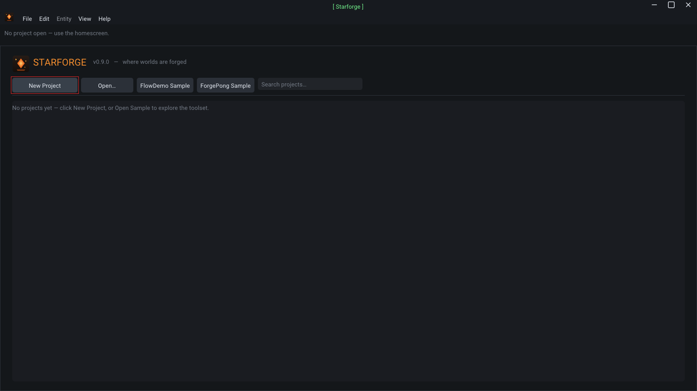

In the **New Project** dialog:

| Field | Value |
| --- | --- |
| **Name** | `PendulumLab2` |
| **Location** | leave the default (`%USERPROFILE%\Documents\Starforge Projects`) or **Browse…** to any folder outside the SDK tree |
| **Template** | select the radio button **App** — described as `A data-driven app: screens (Home / Dashboard / Settings), a service on the DataBus, bound widgets, live rebuild.` (an older build shows `@PROJECT_NAME@` here instead; see Troubleshooting) |
| **Pixel art (point-filtered textures)** | leave unchecked |

The dialog shows `Creates: <Location>/PendulumLab2/`. Click **Create**.

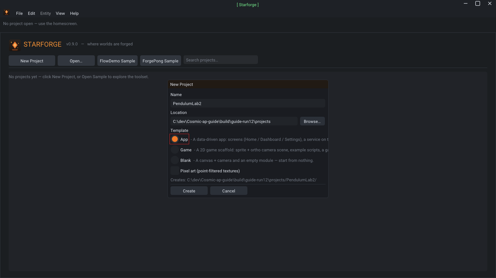

The editor opens the project on its flow's start screen, **Home**. What the App template gave you:

```
PendulumLab2/
├── project.cproj            name, kind = "app", startup_flow = "flows/Main.cflow", fixed_dt_hz = 60
├── flows/Main.cflow         Home -> Dashboard -> Settings; key:Escape back; @quit from Home
├── scenes/Home.cscene       Canvas + Camera + Logo, Title, Subtitle, Uptime, DashboardButton, SettingsButton, QuitButton, Hint
├── scenes/Dashboard.cscene  a plot, two gauges, an indicator, two buttons, a Diagnostics hosted panel
├── scenes/Settings.cscene   AmplitudeSlider / FrequencySlider / StepSlider + value texts, AutoToggle, Defaults, Back
├── src/Module.cpp           CS_SERVICE(AppService) + the CS_SCREENS_BEGIN/END markers + three CS_SCRIPT blocks
├── src/services/AppService.{h,cpp}   publishes app.uptime / app.sine / app.counter, CS_PANEL("Diagnostics")
├── src/screens/{Home,Dashboard,Settings}Screen.h
├── assets/ui/{logo,panel}.png
└── CMakeLists.txt           the external-consumer build against COSMIC_SDK
```

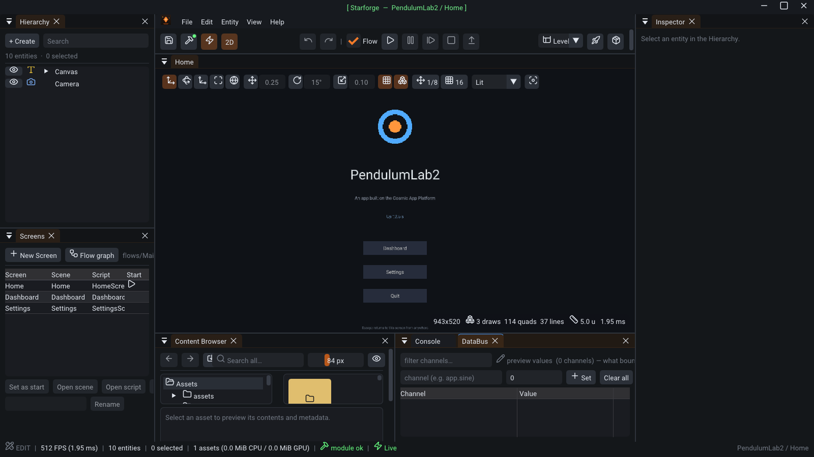

`kind = "app"` switches the editor's auto-build on: the status bar shows a green **Live** chip.
Nothing is built yet, though — the viewport says `Scripts not built - press Ctrl+B`.

---

## Step 2 — Build once and Play the template

Press **Ctrl+B** (or the hammer button in the toolbar, tooltip **Build Scripts (Ctrl+B)**). The
Console prints `[Build] Building 'PendulumLab2' -> PendulumLab2_hot1.dll` and, 20–60 s later, the
status bar's hammer text reads **module ok**. Creating the project does not trigger an auto-build
(the watcher only reacts to edits under `src/` made after the project opened), so this first build
is always yours.

Leave the toolbar's **Flow** checkbox ticked (tooltip: *Play the project's startup flow … from
its start state, like the shipped app*) and press the Play button (tooltip **Play the scene**).
The template runs: Home ▸ **Dashboard** shows a live sine. Press the Stop button (**Stop and
restore the edit scene**).

---

## Step 3 — Screens: add Lab and Stopped

Open the Screens panel: **View ▸ Screens**. It appears as a floating window; drag its tab into
the left column under the Hierarchy (the pictures below have it there). Open **View ▸ DataBus**
too and dock it next to the Console — you will want it in Step 10.

The panel lists the manifest flow's states: **Home** (marked as start), **Dashboard**,
**Settings** — one row per screen with its scene and script.

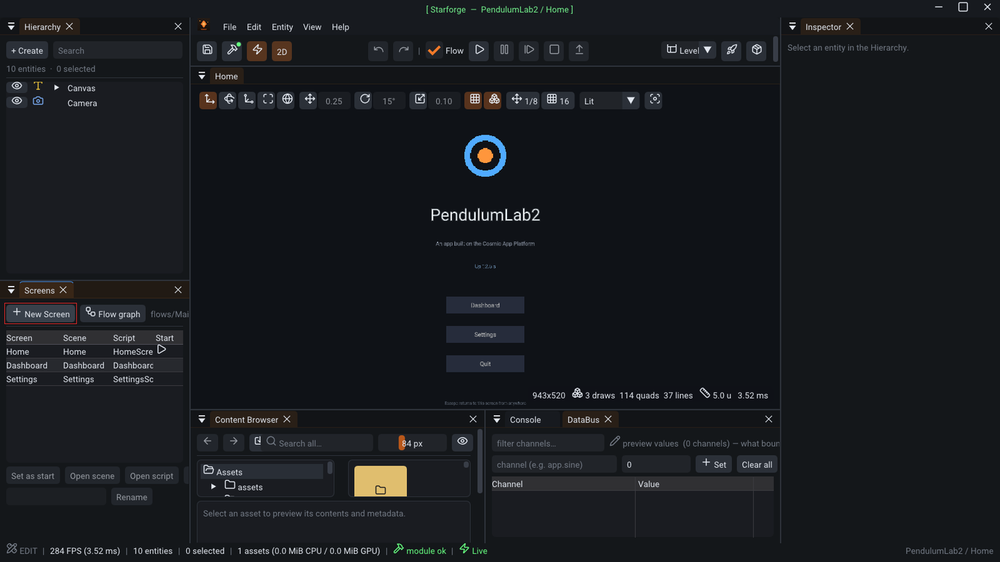

Click **+ New Screen**. In the **New Screen** popup type `Lab`, leave **Create script
(src/screens/<Name>Screen.h + CS_SCRIPT in Module.cpp)** checked, click **Create**. Repeat for
`Stopped`. Each one writes three things (the Console lists them):

- `scenes/<Name>.cscene` — a `Camera` (orthographic, primary) and a `Canvas` carrying
  `NativeScript{ClassName = "<Name>Screen"}`;
- a state `<Name>` in `flows/Main.cflow` pointing at `project://scenes/<Name>.cscene`;
- `src/screens/<Name>Screen.h` from the stub, plus `#include "screens/<Name>Screen.h"` and a
  `CS_SCRIPT(<Name>Screen) CS_FIELD(ExampleField) CS_END;` block between the `CS_SCREENS_BEGIN` /
  `CS_SCREENS_END` markers of `src/Module.cpp`.

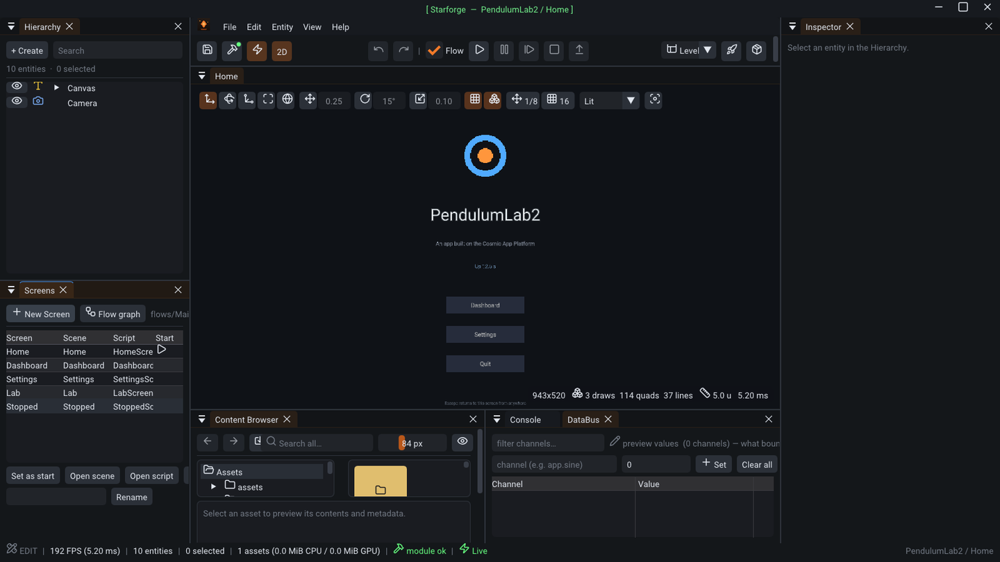

Because the writes touch `src/`, the live loop starts a rebuild (status chip **Building…**). Let
it finish. The Screens panel has no delete; **Dashboard** goes away in Step 8 (flow editor) and
Step 9 (files).

---

## Step 4 — Home: re-point the template's screen

Double-click **Home** in the Screens panel (or **Open scene**). Select each entity in the
**Hierarchy** and edit it in the **Inspector** (the top field of the Inspector is the entity's
name; components are collapsible headers named after their reflected type):

| Entity | Component ▸ Field | Value |
| --- | --- | --- |
| `Title` | UiText ▸ **Text** | `PENDULUM LAB` |
| `Subtitle` | UiText ▸ **Text** | `Physics in a C++ service, visuals authored in the editor, glued by the DataBus` |
| `Uptime` | name field | `Period` |
| `Period` | UiValueText ▸ **Channel** | `pendulum.period_est` |
| `Period` | UiValueText ▸ **Format** | `%.3f` |
| `Period` | UiValueText ▸ **Prefix** | `Last period estimate: ` |
| `Period` | UiValueText ▸ **Suffix** | ` s` |
| `DashboardButton` | name field | `StartButton` |
| `StartButton` | UiButton ▸ **Signal** | `start_clicked` |
| `StartButton` | UiText ▸ **Text** | `Start` |
| `Hint` | UiText ▸ **Text** | `Escape returns to this screen from the Lab` |
| `Logo` | — | select it and press **Delete** (or **Edit ▸ Delete**) |

`SettingsButton` (`settings_clicked`) and `QuitButton` (`quit_clicked`) stay as they are.
**Ctrl+S** saves the scene (`[Scene] Saved 'project://scenes/Home.cscene'` in the Console).

---

## Step 5 — Lab: build the screen by hand

Open **Lab** from the Screens panel. It has only `Camera` and `Canvas`.

### 5.1 The rig — three sprites

**Entity ▸ 2D ▸ Sprite** three times. Each new entity is called `Sprite`; rename it in the
Inspector's name field and set its **Transform** and **SpriteRenderer**:

| Name | Transform ▸ Position | Transform ▸ Scale | SpriteRenderer ▸ Color (RGBA) | SpriteRenderer ▸ ZOrder |
| --- | --- | --- | --- | --- |
| `Pivot` | `-2.5, 3.2, 0` | `0.16, 0.16, 1` | `0.85, 0.85, 0.9, 1` | `3` |
| `Rod` | `-2.5, 1.2, 0` | `0.05, 4.0, 1` | `0.75, 0.78, 0.85, 1` | `1` |
| `Bob` | `-2.5, -0.8, 0` | `0.6, 0.6, 1` | `1.0, 0.55, 0.15, 1` | `2` |

The names matter: `LabScreen` (Step 9) finds them by tag and moves `Rod` and `Bob` from
`pendulum.angle_deg` every frame; the rod's `Scale.y` (4.0 world units) is the pendulum length it
draws with, so resizing the rig here needs no C++.

### 5.2 The UI elements

Select `Canvas` in the Hierarchy first — **Entity ▸ UI ▸ …** parents the new element to the
current selection and gives it a `RectTransform`. The **UI** submenu has `Canvas`, `Image`,
`Text`, `Button`, then the **Bound widgets (DataBus)** group: `Value Text`, `Gauge`, `Indicator`,
`Plot`, `Slider`, `Toggle`, `Hosted Panel`.

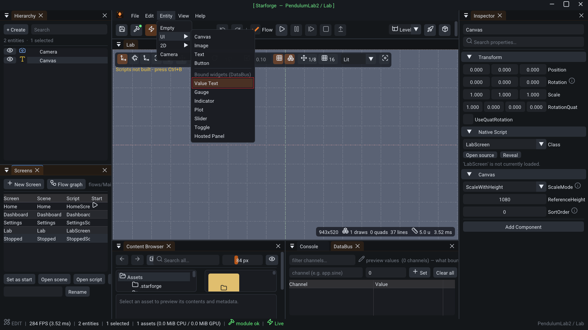

For each row: choose the menu entry, rename the entity, set its **RectTransform** (AnchorMin,
AnchorMax, OffsetMin, OffsetMax, ZOrder — `Pivot` stays `0.5, 0.5`), then the widget fields.
A **Button** is an image plus a `UiButton`; to give it a label click **Add Component** at the
bottom of the Inspector and pick **UI ▸ UiText**, then set `Text`. Every button's UiImage ▸
**Tint** is `0.16, 0.19, 0.25, 0.92` and its UiText ▸ **SizePx** is `26`.

| Menu | Name | AnchorMin | AnchorMax | OffsetMin | OffsetMax | Z | Fields |
| --- | --- | --- | --- | --- | --- | --- | --- |
| Image | `Header` | `0, 0` | `1, 0` | `0, 0` | `0, 64` | 1 | UiImage ▸ Tint `0.10, 0.11, 0.14, 0.85` |
| Text | `HeaderTitle` | `0, 0` | `0, 0` | `24, 14` | `400, 50` | 2 | Text `Lab`, SizePx `28`, HAlign `Left` |
| Indicator | `Running` | `0, 0` | `0, 0` | `120, 20` | `144, 44` | 2 | UiIndicator ▸ Channel `pendulum.running`, Op `==`, Threshold `1` |
| Text | `RunningLabel` | `0, 0` | `0, 0` | `152, 14` | `360, 50` | 2 | Text `running`, SizePx `18`, HAlign `Left`, Color `0.7, 0.74, 0.82, 1` |
| Value Text | `HeaderPeriod` | `1, 0` | `1, 0` | `-360, 14` | `-24, 50` | 2 | UiValueText ▸ Channel `pendulum.period_est`, Format `%.3f`, Prefix `period `, Suffix ` s`; UiText ▸ Text `--`, SizePx `20`, HAlign `Right`, Color `0.6, 0.8, 1, 1` |
| Value Text | `AngleValue` | `0.52, 0` | `0.75, 0` | `0, 84` | `0, 132` | 1 | Channel `pendulum.angle_deg`, Format `%+.2f`, Suffix ` deg`; UiText ▸ Text `--`, SizePx `40`, HAlign `Center` |
| Value Text | `OmegaValue` | `0.76, 0` | `1, 0` | `0, 84` | `-24, 132` | 1 | Channel `pendulum.omega`, Format `%+.3f`, Suffix ` rad/s`; UiText ▸ Text `--`, SizePx `40`, HAlign `Center` |
| Text | `EnergyLabel` | `0.52, 0` | `0.52, 0` | `0, 144` | `120, 172` | 1 | Text `energy`, SizePx `18`, HAlign `Left`, Color `0.7, 0.74, 0.82, 1` |
| Gauge | `EnergyGauge` | `0.52, 0` | `1, 0` | `124, 144` | `-24, 172` | 1 | UiGauge ▸ Channel `pendulum.energy`, Min `0`, Max `2` (Style `Bar`) |
| Plot | `Plot` | `0.52, 0` | `1, 0.52` | `0, 184` | `-24, 0` | 1 | UiPlot ▸ Channel `pendulum.angle_deg`, Channel2 `pendulum.omega`, WindowSeconds `10` |
| Hosted Panel | `PhasePlot` | `0.52, 0.53` | `1, 1` | `0, 0` | `-24, -84` | 1 | UiHostedPanel ▸ PanelName `PhasePlot` |
| Image | `Footer` | `0, 1` | `1, 1` | `0, -72` | `0, 0` | 1 | UiImage ▸ Tint `0.10, 0.11, 0.14, 0.85` |
| Button | `StartStopButton` | `0.1, 0.967` | `0.1, 0.967` | `-90, -22` | `90, 22` | 2 | UiButton ▸ Signal `startstop_clicked`; UiText ▸ Text `Start / Stop` |
| Button | `ResetButton` | `0.24, 0.967` | `0.24, 0.967` | `-75, -22` | `75, 22` | 2 | Signal `pendulum.reset`; Text `Reset` |
| Button | `NudgeButton` | `0.36, 0.967` | `0.36, 0.967` | `-75, -22` | `75, 22` | 2 | Signal `pendulum.nudge`; Text `Nudge` |
| Button | `SettingsButton` | `0.76, 0.967` | `0.76, 0.967` | `-90, -22` | `90, 22` | 2 | Signal `settings_clicked`; Text `Settings` |
| Button | `HomeButton` | `0.9, 0.967` | `0.9, 0.967` | `-75, -22` | `75, 22` | 2 | Signal `home_clicked`; Text `Home` |

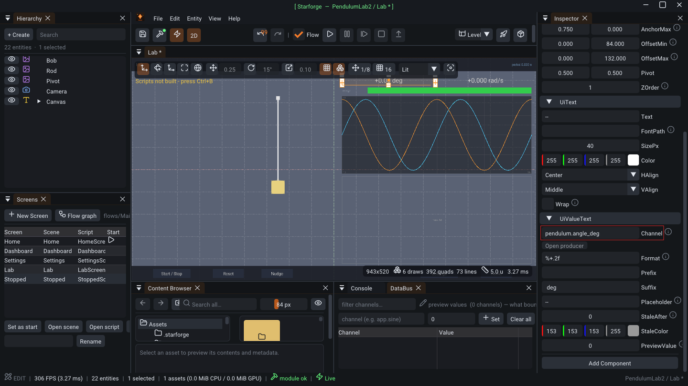

**Anchor idioms** (the RectTransform is Unity-style: `rect.Min = parent.Min + parent.Size *
AnchorMin + OffsetMin * scale`, same for Max; the canvas is 1080 design pixels high and scales
with the viewport height):

- *Full-width bar at the top:* AnchorMin `0, 0`, AnchorMax `1, 0`, OffsetMin `0, 0`, OffsetMax
  `0, 64` (`Header`). At the bottom: anchors `0, 1` / `1, 1`, offsets `0, -72` / `0, 0` (`Footer`).
- *Fixed-size box at a point:* AnchorMin == AnchorMax (`0.1, 0.967`), offsets `±half size`
  (every button).
- *Stretch a region:* different anchors, offsets as insets (`Plot` fills the right column from
  184 px down to 52 % of the height, 24 px in from the right edge).

While editing, a bound widget shows its **PreviewValue** (the DataBus panel's *preview values*
table lets you set fake channel values to see the layout). The Y axis points down in canvas
space: `0, 0` is the top-left.

**Ctrl+S**.

---

## Step 6 — Settings: re-point the template's rows

Open **Settings**. The template already has three slider rows (label, slider, value text) and a
toggle; rebind them instead of rebuilding:

| Entity (rename to) | Component ▸ Field | Value |
| --- | --- | --- |
| `AmplitudeSliderLabel` → `LengthSliderLabel` | UiText ▸ Text | `Length (m)` |
| `AmplitudeSlider` → `LengthSlider` | UiSlider ▸ Channel / Min / Max / PreviewValue | `settings.length` / `0.25` / `4` / `1` |
| `AmplitudeSliderValue` → `LengthSliderValue` | UiValueText ▸ Channel / Format / Suffix | `settings.length` / `%.2f` / ` m` |
| `FrequencySliderLabel` → `GravitySliderLabel` | UiText ▸ Text | `Gravity (m/s^2)` |
| `FrequencySlider` → `GravitySlider` | UiSlider ▸ Channel / Min / Max / Step / PreviewValue | `settings.gravity` / `1` / `25` / `0` / `9.80665` |
| `FrequencySliderValue` → `GravitySliderValue` | UiValueText ▸ Channel / Format / Suffix | `settings.gravity` / `%.3f` / ` m/s^2` |
| `StepSliderLabel` → `DampingSliderLabel` | UiText ▸ Text | `Damping (1/s)` |
| `StepSlider` → `DampingSlider` | UiSlider ▸ Channel / Min / Max / Step / PreviewValue | `settings.damping` / `0` / `1` / `0` / `0` |
| `StepSliderValue` → `DampingSliderValue` | UiValueText ▸ Channel / Format / Suffix | `settings.damping` / `%.3f` / ` 1/s` |
| `AutoLabel` → `SmallAngleLabel` | UiText ▸ Text | `Small-angle model` |
| `AutoToggle` → `SmallAngleToggle` | UiToggle ▸ Channel / Signal | `settings.small_angle` / `settings_changed` |
| `AutoValue` → `SmallAngleValue` | UiValueText ▸ Channel | `settings.small_angle` (a bool prints `true` / `false`) |
| `Note` | UiText ▸ Text | `Changes apply live: the service re-reads settings.* every fixed step. Reset re-releases from the release angle.` |

`DefaultsButton` (Signal `settings.defaults`) and `BackButton` (`back_clicked`) stay. A slider
writes `bus.Set(Channel, value)` on every drag; a toggle flips the bool on release. **Ctrl+S**.

---

## Step 7 — Stopped: the overlay

Open **Stopped**. Select `Canvas`, click **Add Component ▸ UI ▸ UiImage** and set its **Tint** to
`0, 0, 0, 0.6` — an image on the canvas entity itself is a full-bleed backdrop (v1 of the flow
renders only the top scene of the stack, so this is what you see behind the panel; drawing the
Lab underneath is a documented follow-up in `scene/FlowMachine.h`). Then, with `Canvas` selected,
add:

| Menu | Name | AnchorMin | AnchorMax | OffsetMin | OffsetMax | Z | Fields |
| --- | --- | --- | --- | --- | --- | --- | --- |
| Image | `Panel` | `0.5, 0.5` | `0.5, 0.5` | `-320, -150` | `320, 150` | 1 | Tint `0.10, 0.11, 0.14, 0.85` |
| Text | `Title` | `0.5, 0.42` | `0.5, 0.42` | `-300, -30` | `300, 30` | 2 | Text `The pendulum came to rest`, SizePx `36` |
| Value Text | `Energy` | `0.5, 0.5` | `0.5, 0.5` | `-300, -18` | `300, 18` | 2 | Channel `pendulum.energy`, Format `%.4f`, Prefix `energy `, Suffix ` J/kg (below the 0.01 threshold)`; UiText ▸ Text `--`, SizePx `20`, Color `0.7, 0.74, 0.82, 1` |
| Button | `ResumeButton` | `0.5, 0.6` | `0.5, 0.6` | `-140, -28` | `140, 28` | 2 | Signal `resume_clicked`; Text `Resume (reset)` |

**Ctrl+S**.

---

## Step 8 — The flow

Click **Flow graph** in the Screens panel (or **View ▸ Editors (Flow / Story)** and open
`flows/Main.cflow`). The **Editors** document host opens the flow: a node per state on the left,
the inspector on the right. Click a node to edit the state; click a row under **Transitions** to
edit that transition.

1. **Dashboard** node → **Delete State**.
2. **Home** node → select the transition `on dashboard_clicked -> Dashboard`. In the **Transition**
   section type `start_clicked` into **On (custom)** and press Enter, then pick `Lab` in **To**.
3. **Lab** node → **+ transition** four times and fill each one:

   | On | To | Extra |
   | --- | --- | --- |
   | radio **when (guard only)** | `Stopped` | tick **Push (overlay onto the stack)**; tick **Guard (if)**; **Compare** = `Channel`; **Channel** = `pendulum.energy`; **Op** = `<`; **Value** = `0.01` |
   | `settings_clicked` (the **On** combo lists the signals your buttons emit) | `Settings` | |
   | `home_clicked` | `Home` | |
   | `key:Escape` (the key picker that appears when **On** starts with `key:`) | `Home` | |

4. **Settings** node → both transitions' **To** from `Dashboard` to `Lab` (`back_clicked`, `key:Escape`).
5. **Stopped** node → tick **Overlay (keeps the under-scene)**; **+ transition**: **On**
   `resume_clicked`, **To** `@pop`.
6. **Home** node → **Start state** is already shown (it is the start); otherwise **Set as Start**.
7. Toolbar **Save**. The **Variables** label shows `valid` when `FlowAsset::Validate()` is happy
   — a `when` transition without a guard, or a missing scene, is reported there.


The saved `flows/Main.cflow` (the `when` transition is evaluated once per update after the signal
drain; at most one fires per update):

```json
{ "name": "Lab", "scene": "project://scenes/Lab.cscene",
  "transitions": [
    { "on": "when", "to": "Stopped", "push": true, "if": { "channel": "pendulum.energy", "op": "<", "value": 0.01 } },
    { "on": "settings_clicked", "to": "Settings" },
    { "on": "home_clicked", "to": "Home" },
    { "on": "key:Escape", "to": "Home" } ] }
```

Popping the overlay alone would re-arm the guard on the next update (the energy is still below
0.01); `StoppedScreen` (Step 9) turns the Resume click into a `pendulum.reset` as well.

---

## Step 9 — The C++: the service, the screen scripts, Module.cpp

Everything here is a file edit in your own editor; the live loop notices and rebuilds.

### 9.1 `src/services/PendulumService.h`

Delete `src/services/AppService.h` and `AppService.cpp`, create these two files. They are the
reference `Projects/PendulumLab/src/services/PendulumService.{h,cpp}` verbatim.

```cpp
#pragma once
// PendulumService.h — the physics of PendulumLab. One instance per run, constructed by the host
// after the module loads, stepped in OnFixedUpdate at project.cproj's fixed_dt_hz (240), torn
// down before the module unloads. It never touches an entity: it reads settings.* from the
// DataBus, writes pendulum.* back, and reacts to the signals the UI emits.
//
// Model (per unit mass, angle from the vertical, CCW positive):
//   theta'' = -(g / L) * f(theta) - c * theta'        f = sin (default) or identity
//   E       = 1/2 (L theta')^2 + g L (1 - cos theta)  (or 1/2 g L theta^2 linearised)
// Bus channels READ every fixed step (seeded on attach when missing): settings.length (1 m),
//   settings.gravity (9.80665), settings.damping (0), settings.theta0_deg (5), settings.small_angle (false)
// Bus channels PUBLISHED every fixed step: pendulum.angle_deg, pendulum.omega (rad/s),
//   pendulum.energy (J/kg), pendulum.period_est (s), pendulum.running (bool), pendulum.phaseplot_draws
// Signals handled: pendulum.start  pendulum.stop  pendulum.reset  pendulum.nudge  startstop_clicked  settings.defaults
// Hosted panel: CS_PANEL("PhasePlot") — an ImPlot theta/omega scatter of the bus history.

#include <Cosmic.h>

#include <vector>

class PendulumService : public Cosmic::AppService
{
public:
    struct State
    {
        double Theta = 0.0;   // rad
        double Omega = 0.0;   // rad/s
        State operator+(const State& o) const { return { Theta + o.Theta, Omega + o.Omega }; }
        State operator*(double k)       const { return { Theta * k, Omega * k }; }
    };

    struct Params
    {
        double Length     = 1.0;
        double Gravity    = 9.80665;
        double Damping    = 0.0;
        double Theta0Deg  = 5.0;
        bool   SmallAngle = false;
    };

    static constexpr double kPi           = 3.14159265358979323846;
    static constexpr double kNudgeOmega   = 1.0;    // rad/s added by pendulum.nudge
    static constexpr double kStopEnergy   = 0.01;   // the flow's `when` threshold (documentation only)
    static constexpr size_t kHistory      = 4096;   // ~17 s at 240 Hz for the plots

    static State  Step(const State& s, const Params& p, float dt);   // one RK4 step
    static double Energy(const State& s, const Params& p);
    static Params ReadParams(const Cosmic::DataBus& bus);

    const State& Current() const        { return m_State; }
    bool         Running() const        { return m_Running; }
    double       PeriodEstimate() const { return m_PeriodEst; }
    double       SimTime() const        { return m_Time; }
    int          PanelDraws() const     { return m_PanelDraws; }

protected:
    void OnAttach(Cosmic::AppContext& ctx) override;
    void OnFixedUpdate(float fixedDt) override;
    void OnSignal(const std::string& signal, Cosmic::Entity source) override;

private:
    void SeedDefaults(bool force);
    void Reset();
    void Publish();
    void DrawPhasePlot(const Cosmic::UiRect& rect);

    State  m_State;
    bool   m_Running   = false;
    double m_Time      = 0.0;    // simulated seconds since the last Reset
    double m_PeriodEst = 0.0;
    double m_LastCross = -1.0;   // time of the previous upward zero crossing (-1 = none)
    int    m_PanelDraws = 0;
    std::vector<Cosmic::DataSample> m_ScratchA, m_ScratchB;   // phase-plot history buffers
    std::vector<double>             m_PlotX, m_PlotY;
};
```

### 9.2 `src/services/PendulumService.cpp`

```cpp
// PendulumService.cpp — see PendulumService.h.

#include "PendulumService.h"

#include "scene/ui/UiComponents.h"   // UiRect
#include "math/Integrators.h"         // IntegrateRK4

#include <imgui.h>
#include <implot.h>

#include <algorithm>
#include <cmath>

// ---- pure pieces ------------------------------------------------------------------

PendulumService::State PendulumService::Step(const State& s, const Params& p, float dt)
{
    const double gl = p.Gravity / p.Length;
    const double c  = p.Damping;
    const bool   lin = p.SmallAngle;
    auto deriv = [gl, c, lin](const State& x, float /*t*/) -> State
    {
        const double restoring = lin ? x.Theta : std::sin(x.Theta);
        return { x.Omega, -gl * restoring - c * x.Omega };
    };
    return Cosmic::IntegrateRK4(s, deriv, 0.0f, dt);
}

double PendulumService::Energy(const State& s, const Params& p)
{
    const double v = p.Length * s.Omega;
    const double potential = p.SmallAngle ? 0.5 * p.Gravity * p.Length * s.Theta * s.Theta
                                          : p.Gravity * p.Length * (1.0 - std::cos(s.Theta));
    return 0.5 * v * v + potential;
}

PendulumService::Params PendulumService::ReadParams(const Cosmic::DataBus& bus)
{
    Params d;   // defaults
    Params p;
    p.Length     = bus.GetNumber("settings.length",     d.Length);
    p.Gravity    = bus.GetNumber("settings.gravity",    d.Gravity);
    p.Damping    = bus.GetNumber("settings.damping",    d.Damping);
    p.Theta0Deg  = bus.GetNumber("settings.theta0_deg", d.Theta0Deg);
    p.SmallAngle = bus.GetBool  ("settings.small_angle", d.SmallAngle);
    // Guard against a slider (or a stray write) driving the model singular.
    if (!(p.Length  > 1e-6) || !std::isfinite(p.Length))  p.Length  = d.Length;
    if (!(p.Gravity > 0.0)  || !std::isfinite(p.Gravity)) p.Gravity = d.Gravity;
    if (!(p.Damping >= 0.0) || !std::isfinite(p.Damping)) p.Damping = d.Damping;
    if (!std::isfinite(p.Theta0Deg)) p.Theta0Deg = d.Theta0Deg;
    return p;
}

// ---- service lifecycle --------------------------------------------------------------

void PendulumService::OnAttach(Cosmic::AppContext& ctx)
{
    (void)ctx;
    SeedDefaults(/*force=*/false);
    for (const char* ch : { "pendulum.angle_deg", "pendulum.omega", "pendulum.energy" })
        Bus().SetHistoryCapacity(ch, kHistory);
    Reset();
    Publish();
    CS_PANEL("PhasePlot", [this](const Cosmic::UiRect& rect) { DrawPhasePlot(rect); });
}

void PendulumService::OnFixedUpdate(float fixedDt)
{
    const Params p = ReadParams(Bus());
    if (m_Running && fixedDt > 0.0f)
    {
        const State prev = m_State;
        m_State = Step(m_State, p, fixedDt);
        const double tPrev = m_Time;
        m_Time += (double)fixedDt;

        // Upward zero crossing (theta: negative -> non-negative), linearly interpolated.
        if (prev.Theta < 0.0 && m_State.Theta >= 0.0)
        {
            const double frac  = prev.Theta / (prev.Theta - m_State.Theta);   // in [0, 1]
            const double cross = tPrev + frac * (double)fixedDt;
            if (m_LastCross >= 0.0)
                m_PeriodEst = cross - m_LastCross;
            m_LastCross = cross;
        }
    }
    Publish();
}

void PendulumService::OnSignal(const std::string& signal, Cosmic::Entity source)
{
    (void)source;
    if      (signal == "pendulum.start")    m_Running = true;
    else if (signal == "pendulum.stop")     m_Running = false;
    else if (signal == "startstop_clicked") m_Running = !m_Running;
    else if (signal == "pendulum.reset")    Reset();
    else if (signal == "pendulum.nudge")    m_State.Omega += kNudgeOmega;
    else if (signal == "settings.defaults") SeedDefaults(/*force=*/true);
    else return;
    Publish();
}

void PendulumService::SeedDefaults(bool force)
{
    const Params d;
    auto& bus = Bus();
    if (force || !bus.Has("settings.length"))      bus.Set("settings.length", d.Length);
    if (force || !bus.Has("settings.gravity"))     bus.Set("settings.gravity", d.Gravity);
    if (force || !bus.Has("settings.damping"))     bus.Set("settings.damping", d.Damping);
    if (force || !bus.Has("settings.theta0_deg"))  bus.Set("settings.theta0_deg", d.Theta0Deg);
    if (force || !bus.Has("settings.small_angle")) bus.SetBool("settings.small_angle", d.SmallAngle);
}

void PendulumService::Reset()
{
    const Params p = ReadParams(Bus());
    m_State     = { p.Theta0Deg * kPi / 180.0, 0.0 };
    m_Time      = 0.0;
    m_PeriodEst = 0.0;
    m_LastCross = -1.0;
}

void PendulumService::Publish()
{
    const Params p = ReadParams(Bus());
    auto& bus = Bus();
    bus.Set("pendulum.angle_deg", m_State.Theta * 180.0 / kPi);
    bus.Set("pendulum.omega", m_State.Omega);
    bus.Set("pendulum.energy", Energy(m_State, p));
    bus.Set("pendulum.period_est", m_PeriodEst);
    bus.SetBool("pendulum.running", m_Running);
    bus.Set("pendulum.phaseplot_draws", (double)m_PanelDraws);
}

// ---- hosted panel -------------------------------------------------------------------

void PendulumService::DrawPhasePlot(const Cosmic::UiRect& rect)
{
    ++m_PanelDraws;
    // Pair the two histories from the tail: both channels are written in the same
    // fixed step, so the newest N samples of each line up.
    const size_t na = Bus().History("pendulum.angle_deg", m_ScratchA, 10.0);
    const size_t nb = Bus().History("pendulum.omega",     m_ScratchB, 10.0);
    const size_t n  = std::min(na, nb);
    m_PlotX.resize(n); m_PlotY.resize(n);
    for (size_t i = 0; i < n; ++i)
    {
        m_PlotX[i] = m_ScratchA[na - n + i].Value;
        m_PlotY[i] = m_ScratchB[nb - n + i].Value;
    }
    const ImVec2 size(std::max(rect.Width() - 8.0f, 32.0f), std::max(rect.Height() - 8.0f, 32.0f));
    if (ImPlot::BeginPlot("Phase space##pendulum", size, ImPlotFlags_NoLegend | ImPlotFlags_NoMenus))
    {
        ImPlot::SetupAxes("theta (deg)", "omega (rad/s)", ImPlotAxisFlags_AutoFit, ImPlotAxisFlags_AutoFit);
        if (n > 0)
        {
            ImPlotSpec spec;
            spec.Marker = ImPlotMarker_Circle;
            spec.MarkerSize = 2.0f;
            ImPlot::PlotScatter("state", m_PlotX.data(), m_PlotY.data(), (int)n, spec);
        }
        ImPlot::EndPlot();
    }
    ImGui::Text("%zu samples  E = %.4f J/kg  T ~ %.3f s", n, Bus().GetNumber("pendulum.energy"), m_PeriodEst);
}
```

`CS_PANEL("PhasePlot", …)` registers the hosted panel under the name the `PhasePlot` element's
**PanelName** field carries; the host draws it inside that element's rect every frame (in the
editor only while playing). The module compiles ImGui/ImPlot in and adopts the host's contexts —
the template's `CMakeLists.txt` already does this.

### 9.3 The screen scripts

Replace the stubs the Screens panel wrote with the reference scripts. `src/screens/ScreenCommon.h`
is new — the one helper every screen shares:

```cpp
#pragma once
// ScreenCommon.h — find a scene entity by its Tag (screens are authored in Starforge; scripts
// address their elements by name, never by handle).

#include <Cosmic.h>

namespace PendulumLab
{
    inline Cosmic::Entity FindByTag(Cosmic::Scene& scene, const std::string& tag)
    {
        auto& reg = scene.GetRegistry();
        for (auto e : reg.view<Cosmic::TagComponent>())
            if (reg.get<Cosmic::TagComponent>(e).Tag == tag)
                return Cosmic::Entity(e, &scene);
        return {};
    }
}
```

`src/screens/LabScreen.h` — positions the rig from the bus and starts the service on entry:

```cpp
#pragma once
#include <Cosmic.h>
#include "scene/ui/UiComponents.h"
#include "ScreenCommon.h"

#include <cmath>

// Lab screen — the rig is three sprites authored in the editor ("Pivot", "Rod", "Bob"); this
// script places the rod and the bob from the bus every frame: pendulum.angle_deg is the only
// input. The rod length in world units is the authored rod sprite's Scale.y. On its first
// frame the screen asks the service to run if it is not already (pendulum.start).
class LabScreen : public Cosmic::ScriptableEntity
{
public:
    float RodWidth = 0.05f;   // world units; the rod sprite's x scale

protected:
    void OnStart() override
    {
        m_Pivot = PendulumLab::FindByTag(GetScene(), "Pivot");
        m_Rod   = PendulumLab::FindByTag(GetScene(), "Rod");
        m_Bob   = PendulumLab::FindByTag(GetScene(), "Bob");
        if (m_Rod && m_Rod.HasComponent<Cosmic::TransformComponent>())
            m_RodLength = m_Rod.GetComponent<Cosmic::TransformComponent>().Scale.y;
        if (!Data().GetBool("pendulum.running", false))
            Signals().Emit("pendulum.start");
        Place();
    }

    void OnUpdate(float ts) override
    {
        (void)ts;
        Place();
    }

    void OnSignal(const std::string& signal, Cosmic::Entity source) override { (void)signal; (void)source; }

private:
    void Place()
    {
        if (!m_Pivot || !m_Pivot.HasComponent<Cosmic::TransformComponent>()) return;
        const glm::vec3 pivot = m_Pivot.GetComponent<Cosmic::TransformComponent>().Position;
        const float thetaDeg = (float)Data().GetNumber("pendulum.angle_deg", 0.0);
        const float theta    = thetaDeg * 3.14159265f / 180.0f;
        const glm::vec2 dir{ std::sin(theta), -std::cos(theta) };   // hanging down at theta = 0, CCW positive

        if (m_Rod && m_Rod.HasComponent<Cosmic::TransformComponent>())
        {
            auto& t = m_Rod.GetComponent<Cosmic::TransformComponent>();
            t.Position = { pivot.x + dir.x * m_RodLength * 0.5f, pivot.y + dir.y * m_RodLength * 0.5f, t.Position.z };
            t.Rotation = { 0.0f, 0.0f, thetaDeg };
            t.Scale    = { RodWidth, m_RodLength, 1.0f };
        }
        if (m_Bob && m_Bob.HasComponent<Cosmic::TransformComponent>())
        {
            auto& t = m_Bob.GetComponent<Cosmic::TransformComponent>();
            t.Position = { pivot.x + dir.x * m_RodLength, pivot.y + dir.y * m_RodLength, t.Position.z };
        }
    }

    Cosmic::Entity m_Pivot, m_Rod, m_Bob;
    float          m_RodLength = 4.0f;
};
```

`src/screens/SettingsScreen.h` — keeps the note honest (the sliders need no code at all):

```cpp
#pragma once
#include <Cosmic.h>
#include "scene/ui/UiComponents.h"
#include "ScreenCommon.h"

#include <cmath>
#include <cstdio>

// Settings screen — the sliders write settings.length / gravity / damping and the toggle writes
// settings.small_angle straight onto the bus; PendulumService re-reads them every fixed step,
// so there is nothing to apply. This script only rewrites the "Note" text with the analytic
// small-angle period 2 pi sqrt(L / g) next to what the service measured.
class SettingsScreen : public Cosmic::ScriptableEntity
{
public:
    int ChangesSeen = 0;   // settings_changed signals (the toggle) received by this screen

protected:
    void OnStart() override
    {
        m_Note = PendulumLab::FindByTag(GetScene(), "Note");
    }

    void OnUpdate(float ts) override
    {
        (void)ts;
        if (!m_Note || !m_Note.HasComponent<Cosmic::UiTextComponent>()) return;
        const double L = Data().GetNumber("settings.length", 1.0);
        const double g = Data().GetNumber("settings.gravity", 9.80665);
        const double analytic = (L > 0.0 && g > 0.0) ? 2.0 * 3.14159265358979323846 * std::sqrt(L / g) : 0.0;
        char buf[256];
        std::snprintf(buf, sizeof(buf),
                      "Small-angle period 2 pi sqrt(L/g) = %.3f s   measured %.3f s\nChanges apply live; Reset re-releases from the release angle.",
                      analytic, Data().GetNumber("pendulum.period_est", 0.0));
        m_Note.GetComponent<Cosmic::UiTextComponent>().Text = buf;
    }

    void OnSignal(const std::string& signal, Cosmic::Entity source) override
    {
        (void)source;
        if (signal == "settings_changed")
            ++ChangesSeen;
    }

private:
    Cosmic::Entity m_Note;
};
```

`src/screens/StoppedScreen.h` — the Resume click also resets, so the `when` guard does not
re-arm:

```cpp
#pragma once
#include <Cosmic.h>
#include "scene/ui/UiComponents.h"
#include "ScreenCommon.h"

// Stopped overlay — the flow pushes this from Lab through the channel-guarded `when`
// (pendulum.energy < 0.01) and pops it on resume_clicked. This script turns the Resume click
// into a pendulum.reset as well: the service re-releases the bob, the energy jumps above the
// threshold, and the Lab resumes cleanly.
class StoppedScreen : public Cosmic::ScriptableEntity
{
public:
    bool ResetOnResume = true;

protected:
    void OnStart() override {}
    void OnUpdate(float ts) override { (void)ts; }
    void OnSignal(const std::string& signal, Cosmic::Entity source) override
    {
        (void)source;
        if (signal == "resume_clicked" && ResetOnResume)
            Signals().Emit("pendulum.reset");
    }
};
```

`HomeScreen.h` stays as the template wrote it (it pulses the `Title`). Delete
`src/screens/DashboardScreen.h` and `scenes/Dashboard.cscene`.

### 9.4 `src/Module.cpp`

Make these edits (the markers are what the Screens panel manages — keep them):

- `#include "services/AppService.h"` → `#include "services/PendulumService.h"`; remove
  `#include "screens/DashboardScreen.h"`.
- `CS_SERVICE(AppService).Order(0) CS_END;` → `CS_SERVICE(PendulumService).Order(0) CS_END;`
- Remove the `CS_SCRIPT(DashboardScreen) … CS_END;` block.
- In the block the panel wrote for Lab, `CS_FIELD(ExampleField)` →
  `CS_FIELD(RodWidth).Range(0.01f, 0.5f)`; in Stopped's block → `CS_FIELD(ResetOnResume)`.
  (`CS_FIELD` names must be members of the class — a stale `ExampleField` is a compile error.)

The result:

```cpp
#include <Cosmic.h>

#include "services/PendulumService.h"
#include "screens/HomeScreen.h"
#include "screens/SettingsScreen.h"
#include "screens/LabScreen.h"
#include "screens/StoppedScreen.h"

CS_MODULE_BEGIN(PendulumLab2)
    CS_SERVICE(PendulumService).Order(0) CS_END;

    // CS_SCREENS_BEGIN — managed by Starforge ▸ Screens (one CS_SCRIPT per screen script)
    CS_SCRIPT(HomeScreen)
        CS_FIELD(PulseHz).Range(0.0f, 5.0f)
        CS_FIELD(PulseMin).Range(0.0f, 1.0f)
    CS_END;

    CS_SCRIPT(SettingsScreen)
        CS_FIELD(ChangesSeen)
    CS_END;
    CS_SCRIPT(LabScreen)
        CS_FIELD(RodWidth).Range(0.01f, 0.5f)
    CS_END;
    CS_SCRIPT(StoppedScreen)
        CS_FIELD(ResetOnResume)
    CS_END;
    // CS_SCREENS_END
CS_MODULE_END()
```

### 9.5 Project Settings

**File ▸ Project Settings…**: **Fixed Hz** `240` (the RK4 step the service integrates at),
**Window title** `Pendulum Lab`, **Save**. This writes `fixed_dt_hz = 240` and `[window] title`
into `project.cproj`.

---

## Step 10 — Play it, and the live loop

Saving anything under `src/` starts the live loop: 500 ms after the last save the status chip
turns yellow **Building…**, the Console shows the compiler output, and when the build succeeds
the chip returns to green **Live** (blue **Reloading** for the frame the module is swapped).

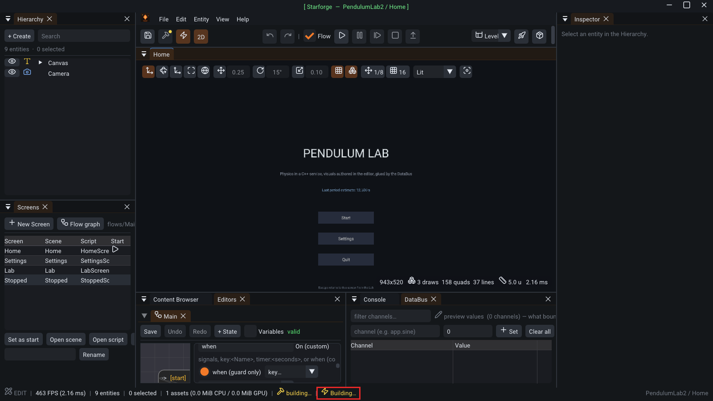

Open **Home** (Screens panel), keep **Flow** ticked and press **Play**. Click **Start** in the
game view: the flow goes to **Lab**, `LabScreen::OnStart` emits `pendulum.start`, and the bob
swings from its 5-degree release. The readouts, the gauge, the plot and the phase plot all draw
from the bus.

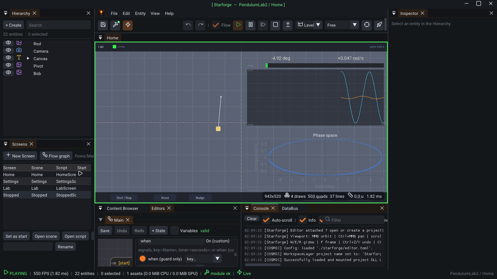

**DataBus panel while playing.** Every channel with its value, age and producer:
`pendulum.angle_deg … PendulumService`, the `settings.*` seeds, `pendulum.phaseplot_draws`
counting up. **Open** on a row opens the producer's `CS_SERVICE` site in your editor.

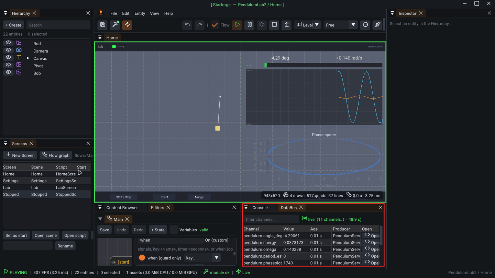

**Settings.** Click **Settings** in the Lab footer: the sliders show the seeded values
(`1.00 m`, `9.807 m/s^2`, `0.000 1/s`). Drag **Length** and watch the period change the next
time you are on Lab; **Back** returns (the service was never stopped).

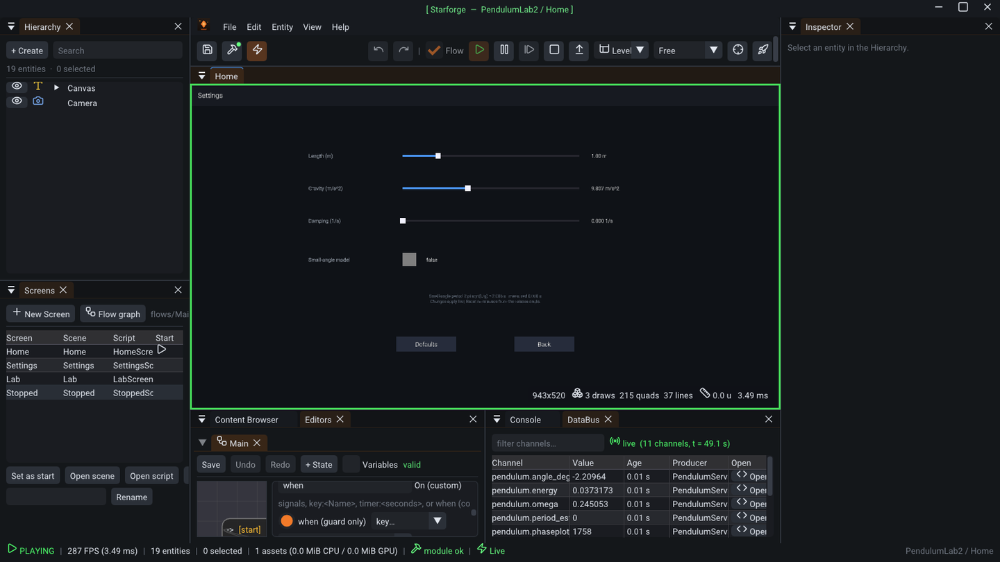

**The Stopped overlay.** Drag **Damping** to its right end (`1.000 1/s`) and go **Back**: the
energy decays, and the moment `pendulum.energy < 0.01` the flow pushes **Stopped** onto the stack
above Lab (the Lab state stays on the stack; only the top scene is drawn in v1). **Resume
(reset)** pops it and re-releases the bob.

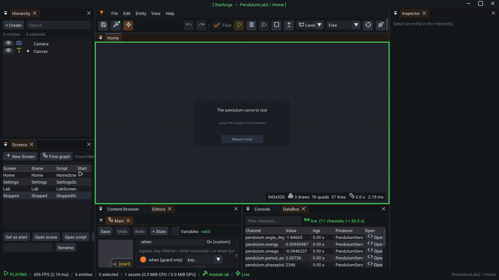

**Escape** on Lab returns to Home (`key:Escape`), and on Home it quits the flow (the template's
`@quit`) — in the editor that just stops Play.

**Edit while playing.** With Play running on Lab, change anything in `PendulumService.cpp` and
save. The editor stops Play, rebuilds, reloads the module and **resumes Play on the same
screen with the bus intact** — the plot keeps its history from before the rebuild. The chip
shows **Live** again.

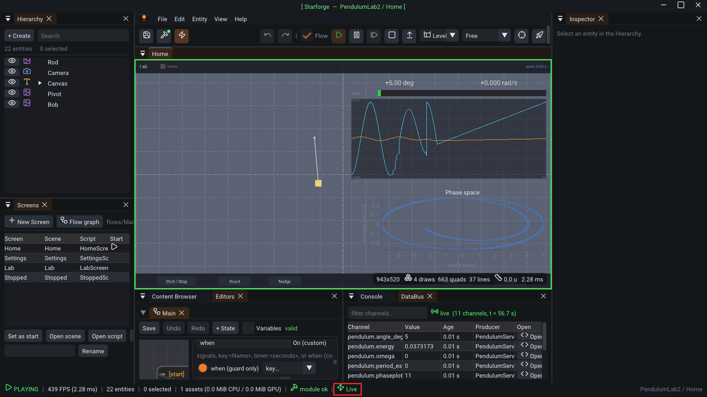

**Build failed.** Save a syntax error and the chip turns red **Build failed**; Play stays
stopped and the Console holds the compiler's error line (click it to see the file:line). Fix
the error and save: the next successful build resumes Play where it was. **Edit ▸ Auto-resume
Play after rebuild** turns the resume off if you prefer to press Play yourself.

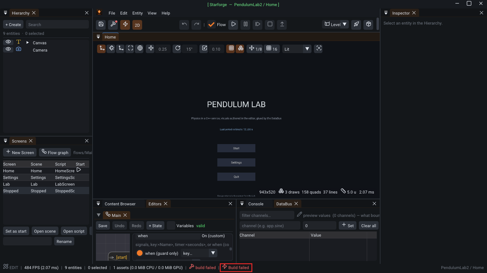

**Source links.** In the Inspector, a bound widget's **Channel** row gains **Open producer**
once the play bus has a producer for it (this opens `Module.cpp` at the `CS_SERVICE` line); a
`UiButton`'s **Signal** row has **Find handlers** (every `src/**` file quoting that signal —
`PendulumService.cpp` for `pendulum.reset`); a `UiHostedPanel` row and the Canvas's **Native
Script** row have **Open source** / **Reveal**. The Screens panel has **Open script** /
**Reveal** per screen, and a right-click on a selected element in the viewport offers **Open
logic source**, resolving hosted panel → channel producer → button signal → the entity's script.

---

## Step 11 — Export

Stop Play. **File ▸ Package…** (the package icon in the toolbar, tooltip **Package the project
for shipping...**, opens the same dialog).

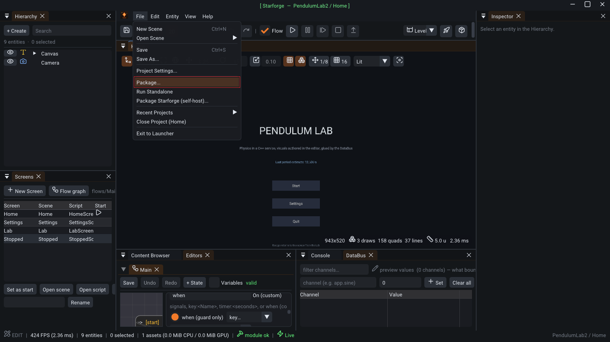

The **Package Project** dialog reads *Ship a standalone build of 'PendulumLab2'* and shows the
output path `<SDK>/dist/PendulumLab2`. Leave **Build Release first (recommended for shipping)**
checked, **Zip the output** and **Generate installer script (+ build if Inno on PATH)** as you
like, and click **Package**. The dialog shows `building… (see Console)` while it configures and
builds the project's Release DLL (`[package] configuring project`, `[package] building project
(Release)` in the Console), then `Done:` with the path and a **Show in Explorer** button.

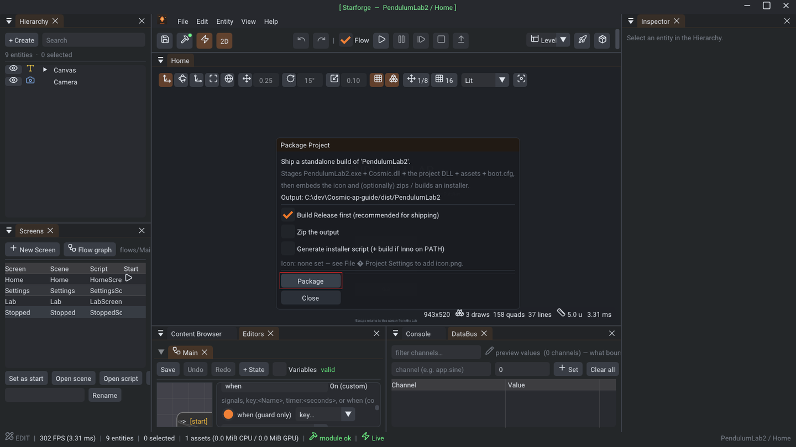

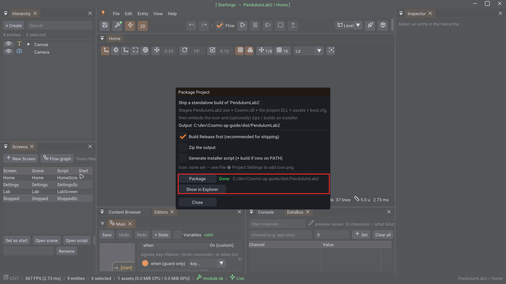

The staged folder — the one layout every Cosmic app ships in (SF_Telem included; contract §12):

```
<SDK>/dist/PendulumLab2/
├── PendulumLab2.exe            CosmicApp.exe renamed
├── PendulumLab2.dll            the module you just built, Release
├── Cosmic.dll
├── boot.cfg                    names PendulumLab2 (no --project flag; sets the user:// identity)
├── assets/                     engine assets: cache/fonts, fonts, shaders, textures — no other project
├── assets/projects/PendulumLab2/   project.cproj, flows/, scenes/, assets/ui/, README.md — no src/, build/
├── licenses/                   third-party licence texts from installer/licenses/MANIFEST.txt
└── user/README.txt             the portable-mode writable root: logs/, imgui.ini land here
```

Run it from somewhere else entirely:

```
cd C:\Temp
C:\dev\Cosmic\dist\PendulumLab2\PendulumLab2.exe
```

The app boots through `boot.cfg` (`PlayerLayer: running project 'PendulumLab2' (flow
'flows/Main.cflow', 240 Hz)` in `dist\PendulumLab2\user\logs\Cosmic_*.log`), opens on Home, and
**Start** swings the pendulum exactly as in the editor. Nothing is written into `C:\Temp`.

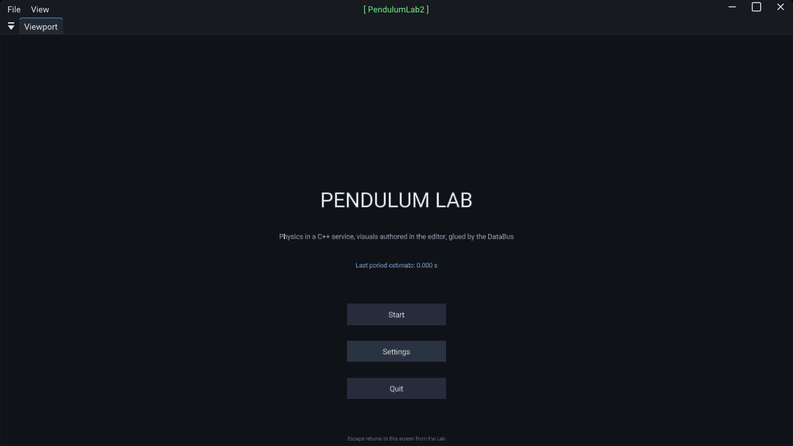

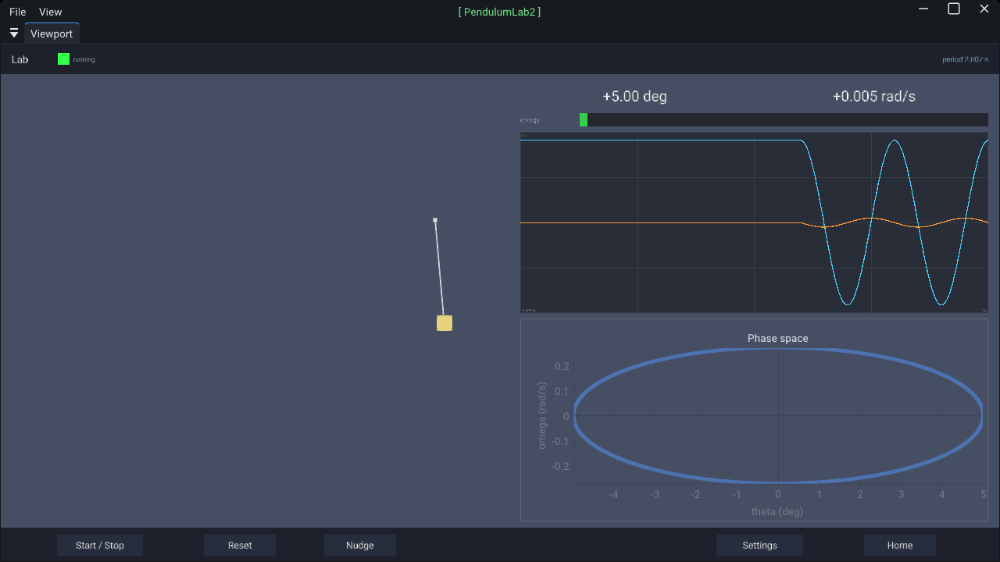

Escape on Lab returns to Home, whose period readout now shows what the service measured
(`Last period estimate: 2.007 s` at the defaults — 2π√(1 m / 9.80665 m/s²) = 2.006 s):

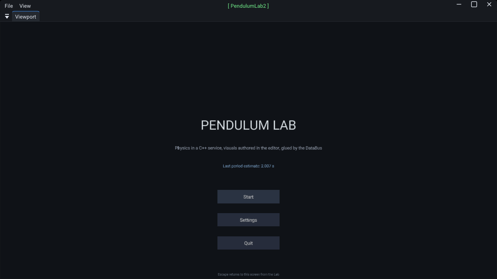

---

## What you should see

- [ ] Homescreen → **New Project** → **App** → project opens on **Home**; chip **Live**.
- [ ] **Ctrl+B** builds; status bar **module ok**; Play shows the template's Dashboard sine.
- [ ] Screens panel lists Home, Dashboard, Settings, then Lab and Stopped after **+ New Screen**.
- [ ] Every Lab widget shows its preview in edit mode (sine in the plot, `--` in value texts).
- [ ] Flow editor: **Variables** says `valid`; Lab has `on when -> Stopped` first in its list.
- [ ] After pasting the C++: **Building…** → **Live**; Console `[Module] Reloaded 'PendulumLab2_hotN' (4 script(s))`.
- [ ] Play → **Start** → Lab: `pendulum.angle_deg` swings −5…+5 deg with a 2.006 s period at the defaults; the **running** indicator is green; the phase plot draws an ellipse.
- [ ] DataBus panel: `pendulum.*` produced by `PendulumService`, `settings.*` seeded.
- [ ] Damping 1.0 → the **Stopped** overlay appears; **Resume (reset)** pops it and restarts the swing.
- [ ] Editing `PendulumService.cpp` in Play: **Building…**, then back in Play on the same screen with the plot history intact; a syntax error → **Build failed**; fixed → resumes.
- [ ] **File ▸ Package…** → `dist/PendulumLab2/` with the layout above (66 files); the exe runs from another directory and writes only under `dist/PendulumLab2/user/`.

---

## Troubleshooting

**Nothing builds after New Project.** Expected: the watcher only sees edits made after the
project opened. Press **Ctrl+B** once.

**`Scripts not built - press Ctrl+B` stays after a build.** Look at the Console: a red line from
the compiler. The usual one after Step 9 is `CS_FIELD(ExampleField)` left in a `CS_SCRIPT` block
whose class no longer has that member — replace it as in 9.4. `Cannot open include file:
'screens/DashboardScreen.h'` means the include is still in `Module.cpp` after the header was
deleted.

**The Screens panel put `#include "screens/LabScreen.h"` at the very top of `Module.cpp`, above
the header comment.** That was a scaffold defect found while writing this chapter (the scaffold
matched the words `CS_MODULE_BEGIN` inside the template's comment); it is fixed in this tree —
the include now goes after the last `#include` before the real `CS_MODULE_BEGIN(...)`. On an
older build the misplaced include still compiles; move it by hand.

**Start does nothing in Play.** Check the Home button's UiButton ▸ **Signal** is exactly
`start_clicked` and the Home state has `on start_clicked -> Lab` (the flow editor's **Variables**
label reads `valid`; an unknown target would be listed there).

**The Stopped overlay never appears.** Damping must be above 0 for the energy to decay (the
default is 0 — an undamped pendulum swings forever). The guard is `pendulum.energy < 0.01`: at
L = 1 m a 5-degree release starts at about 0.037 J/kg, so it takes a few seconds at damping 1.0.
If the overlay pops and immediately returns, `StoppedScreen` is not registered (rebuild) or
`ResetOnResume` was unticked.

**Escape quits instead of going Home.** You were on Home: its `key:Escape -> @quit` is the
template's choice (and the reference's). On Lab, Escape goes Home.

**Submenus of Entity ▸ UI open only after a short hover.** Click **UI** instead of waiting.

**The New Project dialog describes the App template as `@PROJECT_NAME@`.** The picker took the
first line of the template's README (its templated title) as the description; fixed in this tree
(the built-in description is shown). Pick **App** regardless — the project it creates is the same.

**Clicking a button in the exported exe does nothing (or hits the button above it).** The
standalone player hit-tested the UI in window coordinates while drawing it inside the Viewport
dock, so every button answered about 54 px above its picture; fixed in this tree
(`PlayerLayer::UpdateUI`). A package built from an older engine keeps the bug — repackage.

**The package contains `*.cscene.bak` files.** The editor's save backups next to each scene are
staged along with the project content (66 files instead of 62 for this project). They are
harmless; delete them from `scenes/` before packaging if you care. Reported as a packager
defect with this chapter.

**The exported exe opens on a blank window.** `assets/projects/PendulumLab2/project.cproj` must
be inside the package (the packager copies the project root except `src/`, `build/`, `.git/`,
`CMakeLists.txt`); the log in `user/logs/Cosmic_*.log` names what it could not load.

**`Package` says `A build is already running`.** The live loop is mid-build; wait for the chip.

---

## How this chapter was verified

Every step above was executed inside the real editor by an env-gated driver,
`Projects/Starforge/src/GuideWalkthroughSelfTest.cpp` (armed by `COSMIC_GUIDE_SELFTEST`), which
runs the same editor command each control runs — `NewProjectAt` for the New Project dialog's
**Create**, `ScreensPanel::NewScreen` for the New Screen popup, `Commands::Create` with the
Entity ▸ UI build lambdas, `Commands::SetField` / `Commands::AddComponent` for the Inspector,
`FlowAsset` Load/Save for the flow editor, `BuildScripts` for Ctrl+B, `PlayScene` for Play, OS
cursor clicks on the game view's buttons, `PackageProject` for **Package** — opening the menus
with injected pointer events and locating each pictured control through Dear ImGui's own
`DebugLocateItem` (the highlight it draws is the red box in the images). The wrapper
`tests/acceptance/fixtures/Run-GuideWalkthrough.ps1` then runs the exported exe from a different
directory, clicks **Start**, screenshots it and reads its log. Results, screenshots and the
package file list are under `docs/plans/app-platform-2026-09-18/evidence/GUIDE/`.

What the driver could not do the way a hand does: the New Project and New Screen dialogs are
filled programmatically after the click that opens them (the pictures show the dialogs with
their fields as you will see them); the flow edits are written through `FlowAsset` rather than
typed into the transition inspector (the picture shows the inspector with the finished
transition selected); the C++ is copied from `Projects/PendulumLab/src` rather than typed.
