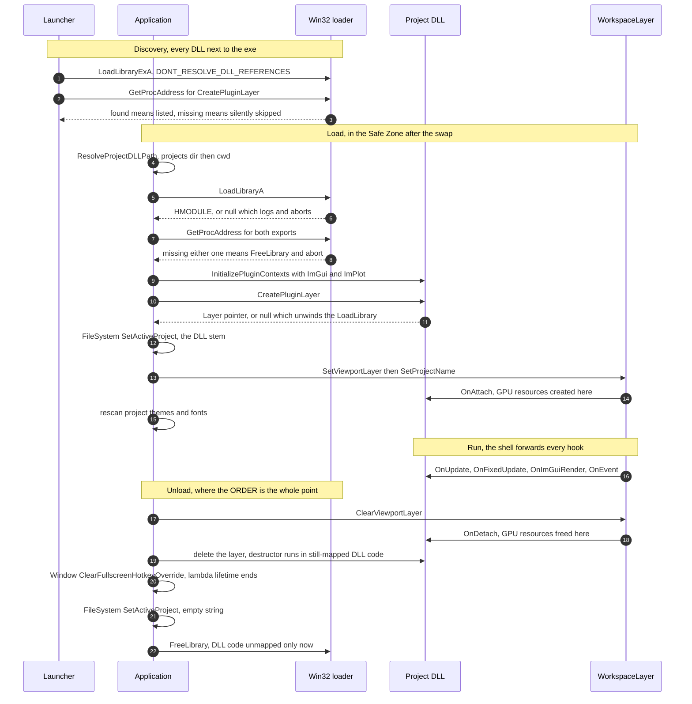
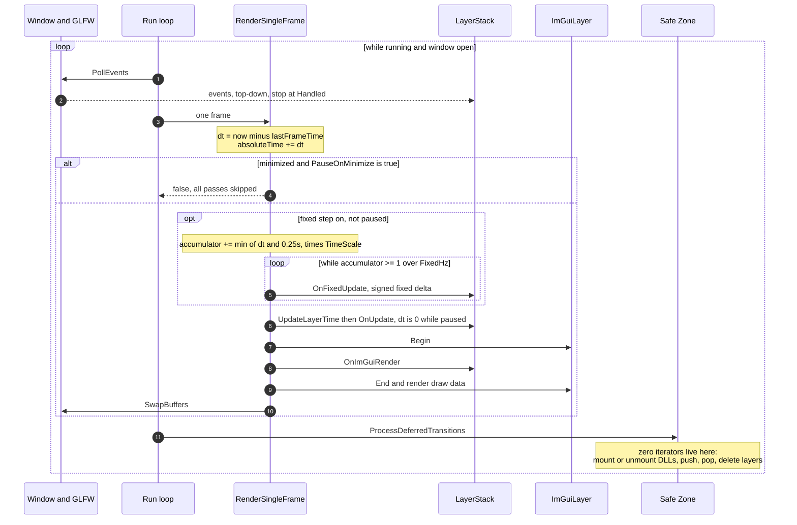

# Project Anatomy — Guide

**What this covers:** How a project DLL is loaded, hot-reloaded and unloaded; the `Application`
lifecycle and its frame loop; layers, the `LayerStack` and the composite-layer pattern; `Ref`/`Scope`
and the shared-allocator rule; the Safe Zone and teardown ordering; and owning your own services.
**Source of truth:** `Cosmic/src/core/Application.{h,cpp}`, `core/Layer.h`, `core/LayerStack.{h,cpp}`,
`core/Core.h`, `Cosmic/src/Cosmic.h`, `Cosmic/src/scripting/ModuleMacros.h`,
`Cosmic/src/layers/{ImGuiLayer,LauncherLayer,WorkspaceLayer,PlayerLayer}.{h,cpp}`,
`Runtime/Main.cpp`, `Projects/Starforge/src/{GameModule.h,StarforgeApp.cpp}`
**API Reference:** [../reference/core.md](../reference/core.md) · **How it works:**
[../systems/core-runtime.md](../systems/core-runtime.md) ·
[../systems/build-plugin-packaging.md](../systems/build-plugin-packaging.md)
**Configuration:** both — nothing in this chapter differs between the 3D and 2D engine builds.

Read [`getting-started.md`](getting-started.md) first if you have not built the SDK yet; it covers
setup, the tree layout and the bare minimum plugin. This chapter is the layer underneath: *who owns
what, when it runs, and when it is destroyed.*

---

## Quick start

A root layer that owns a child layer and a service. This is the shape almost every Cosmic project
converges on, and every rule in this chapter is visible in it:

```cpp
#pragma once
#include <Cosmic.h>
#include <memory>
#include <vector>

namespace Workspace
{
    class MyApp : public Cosmic::Layer
    {
    public:
        MyApp() : Cosmic::Layer("MyApp") {}
        ~MyApp() override = default;

        void OnAttach() override
        {
            Cosmic::FileSystem::SetActiveProject("MyApp");

            // Child layers are OWNED here and never pushed onto the engine stack.
            m_Modes.push_back(std::make_shared<PlayMode>());
            for (auto& m : m_Modes)
                m->OnAttach();
        }

        void OnDetach() override
        {
            for (auto& m : m_Modes)
                m->OnDetach();
            m_Modes.clear();      // release DLL-allocated children here, not in the dtor
            m_Link.Shutdown();    // owned service: we start it, we stop it
        }

        void OnUpdate(float ts) override
        {
            m_Link.OnUpdate(ts);              // owned services are ticked by their owner
            m_Scenes.OnUpdate(ts);
            if (!m_Modes.empty())
                m_Modes[m_Active]->OnUpdate(ts);
        }

        void OnFixedUpdate(float dt) override
        {
            if (!m_Modes.empty())
                m_Modes[m_Active]->OnFixedUpdate(dt);
        }

        void OnImGuiRender() override
        {
            ImGui::Begin("MyApp");
            ImGui::Text("%.1f fps", ImGui::GetIO().Framerate);
            ImGui::End();

            if (!m_Modes.empty())
                m_Modes[m_Active]->OnImGuiRender();
        }

        void OnEvent(Cosmic::Event& e) override
        {
            // Window/app events go to EVERY child; input goes only to the active one.
            if (e.IsInCategory(Cosmic::EventCategoryApplication))
            {
                for (auto& m : m_Modes)
                    m->OnEvent(e);
                return;
            }
            if (e.Handled) return;
            if (!m_Modes.empty())
                m_Modes[m_Active]->OnEvent(e);
        }

    private:
        std::vector<std::shared_ptr<Cosmic::Layer>> m_Modes;
        int                  m_Active = 0;
        Cosmic::SerialLink   m_Link;      // plain member — not a singleton
        Cosmic::SceneManager m_Scenes;    // plain member — not a singleton
    };
}
```

Three rules are already in force here, and the rest of the chapter is why:

1. **The engine owns whatever you hand it. You own everything else.** `CreatePluginLayer` gives the
   engine one `Layer*`; children stay in your vector.
2. **Services are objects you own and tick**, not globals you reach for.
3. **Release in `OnDetach`, not in the destructor** — `OnDetach` runs while the OpenGL context and
   the loaded DLL are both still alive.

---

## How a project gets loaded

### The exports

A project DLL is identified purely by what it exports. `Cosmic.h` declares the contract at the very
bottom of the file:

```cpp
extern "C" {
    __declspec(dllexport) Cosmic::Layer* CreatePluginLayer();
    __declspec(dllexport) void InitializePluginContexts(Cosmic::HostContext context);
}
```

`HostContext` carries exactly two pointers — `ImGuiContext*` and `ImPlotContext*`. ImGui's symbols
are not re-exported from `Cosmic.dll`, so your DLL links its own copy of ImGui's globals;
`InitializePluginContexts` is what makes both modules agree on one UI. The host always calls it
**before** `CreatePluginLayer`.

There are **two ways to satisfy the contract**, and which one you use decides what your project *is*:

| | Hand-written plugin | Starforge game module |
| --- | --- | --- |
| You write | a `Layer` subclass + the two exports | scripts + `CS_MODULE_BEGIN`/`CS_MODULE_END` |
| `CreatePluginLayer` returns | your own layer | `new Cosmic::PlayerLayer(moduleName)` |
| Exports produced | 2 | **3** — `CosmicModule_Register` as well |
| Editable in Starforge | no | yes, including hot reload |
| Model it on | `Cosmic/templates/ExampleProject/` | `Projects/ForgePong/`, `Projects/ForgeIsle/` |

`ModuleMacros.h` generates the second column. Its own header comment says the macros expand to
"the two exports"; they expand to **three** — `CosmicModule_Register`, `CreatePluginLayer` and
`InitializePluginContexts`. The extra one is the point: the editor calls
`CosmicModule_Register(ModuleRegistry&)` on hot reload to re-register your script and component
types **without touching ImGui or constructing a layer**.

Nothing stops a hand-written plugin from returning a `PlayerLayer` itself, or a scripted module from
also hand-writing panels — the two columns are conventions, not enforced modes.

### DG-5 — the plugin-DLL lifecycle

Discovery, load, run and unload, end to end. Everything below the dashed line happens in the **Safe
Zone** between frames — never mid-frame, never from the modal drag pump.



The two orderings that matter: `InitializePluginContexts` **before** `CreatePluginLayer`, so your
constructor can touch ImGui; and `delete` **before** `FreeLibrary`, so your destructor runs against
code that still exists. Reversing either one is an access violation, not a warning.

### The load sequence

Loading always happens in the Safe Zone between frames, never mid-frame. `Application::LoadProjectDLL`
runs these steps in order:

1. **Resolve the path.** `ResolveProjectDLLPath` accepts `"MyApp"`, `"MyApp.dll"` or an absolute
   path, appends `.dll` if absent, and searches `<cwd>/projects/` (the packaged dist layout) then
   `<cwd>/` (the dev build layout). `Main.cpp` has already `SetCurrentDirectory`'d to the exe
   directory, so "cwd" always means "next to the exe". A miss logs
   `Project DLL not found: '…' (searched '…' and '…')` and returns `""`.
2. **`LoadLibraryA`.** On failure: `Failed to load plugin: <path>`, and the load aborts. The most
   common cause is a *dependency* that could not be resolved, not the DLL itself.
3. **`GetProcAddress` for both exports.** Missing either one logs
   `Plugin is missing required engine export signatures!`, calls `FreeLibrary`, and aborts.
4. **`InitializePluginContexts(ctx)`** with the host's live ImGui/ImPlot contexts.
5. **`CreatePluginLayer()`.** A `nullptr` return logs and unwinds the `LoadLibrary`.
6. **Engine-side VFS binding.** `FileSystem::SetActiveProject(<DLL stem>)` runs *before* your layer
   is attached, so engine code that resolves `project://` during your `OnAttach` — `Config::Load`,
   the theme registry, the font libraries — sees the right project.
7. **Bind to the workspace shell.** `WorkspaceLayer::SetViewportLayer(layer)` +
   `SetProjectName(stem)`. `PushLayer` on the `WorkspaceLayer` happened one step earlier, in
   `ProcessDeferredTransitions`, so **`OnAttach` for your layer runs from
   `WorkspaceLayer::SetViewportLayer`, not from `LayerStack::PushLayer`** — your layer is never on
   the engine's `LayerStack` at all. The shell forwards every hook to it.
8. **Project-scoped theme and font rescan.** `ThemeManager::LoadFolder("project://themes")`,
   `UI::Fonts::LoadProjectFonts()`, `Font::LoadProjectFonts()`. These run here because
   `ThemeManager::Init` and `Fonts::Init` happen at ImGui-layer attach, long before any project is
   mounted. Adding ImGui fonts is safe at this point precisely because it is between frames.

> **A stale comment to ignore.** Step 5 in `Application.cpp` still explains itself with *"FileSystem
> is header-only with per-DLL static state."* That was true before `FileSystem.cpp` moved the state
> into the engine DLL. The call is still correct and still necessary — the reasoning in the comment
> is not. `FileSystem`'s active-project state is now single-copy and process-wide.

### Unloading

`UnloadProjectDLL` is the mirror image, and the ordering is the part that matters:

1. `WorkspaceLayer::ClearViewportLayer()` — stops all hook forwarding, and calls your `OnDetach`.
2. `delete m_ActivePluginLayer` — **while the DLL is still mapped**, so your destructor executes
   against code that still exists.
3. `Window::ClearFullscreenHotkeyOverride()`.
4. `FileSystem::SetActiveProject("")`. Project themes and fonts stay *registered* on purpose:
   dropping them here would dangle `ImFont*` / `Ref<Font>` handles that engine systems may still
   hold for the current frame. The registries replace by name on the next mount.
5. `FreeLibrary`.

Step 2 before step 5 is the entire reason a project must not push its own layers onto the engine
stack — see [the shared-allocator rule](#ref-scope-and-the-shared-allocator-rule).

---

## Hot-reload a module while the editor runs

Only Starforge hot-reloads, and only game modules. The orchestration is
`StarforgeApp::BuildScripts` → `BuildRunner` → `StarforgeApp::ReloadModule`; `GameModule` owns just
the handle and the registry lifecycle.

**Build** (`Ctrl+B`) refuses to run while a Play session is active, and refuses if the project has no
`CMakeLists.txt`. It bumps a counter and builds to a **new filename** — `MyGame_hot7.dll` — because
the currently loaded DLL is locked by the OS. Older `_hotN` files are swept afterwards; the locked
one silently survives the sweep, which is exactly what the suffix is for.

**Reload**, once the build reports success:

1. `SceneSerializer::SaveToString(scene)` — snapshot the edit scene **while the old module is still
   loaded**, so module-owned component types can still serialize themselves.
2. Stop Play if running; clear the selection and the undo stack.
3. `scene.reset()` — drop the scene *before* unloading, so module-typed component destructors run
   against valid code.
4. `GameModule::Unload()` — unregister the module's types from the process-wide `ModuleRegistry`,
   then `FreeLibrary`.
5. `GameModule::Load(...)` the new DLL and run its `CosmicModule_Register`.
6. Rebuild the scene from the snapshot. Script classes and custom components now resolve.

What survives: everything the snapshot captured, which is the scene as JSON. What does not: the undo
stack, the selection, and any live Play state. Unresolved script class names log **once** and stay
inert — a missing script never crashes a scene.

The generic host (`CosmicApp.exe` / `Starforge.exe` with a baked project) has **no** hot reload.
`Application` will `UnloadProjectDLL` before loading another, but the only client-reachable route is
`TransitionToLauncher()` and back in — which rebuilds the whole workspace.

---

## The Application lifecycle

`Application` is the engine's root object and its only real singleton. `Runtime/Main.cpp`
heap-allocates one, runs it, and deletes it inside a `try` block so that a thrown exception still
gets a graceful teardown with the GL context alive.

### Construction order

The constructor is not a thin initializer — it boots the whole engine:

```
m_StartupProjectDLL = startupProjectDll        // must be a ctor arg, see below
Log::Init(FileSystem::Resolve("user://logs"))  // logging is up before anything can fail
s_Instance = this                              // BEFORE Initialize()
Initialize()
```

`s_Instance` is assigned before `Initialize()` because subsystems started inside `Initialize()`
reach back through `Application::Get()` — `ImGuiLayer::OnAttach()` needs the window. The cost of
that ordering is that `Application::Get()` called from a static initializer, before the object
exists, dereferences null. There is no guard; do not call it from file-scope constructors.

The startup project is a **constructor argument** for the same reason: `Initialize()` decides
Launcher-versus-project boot, and it runs before the constructor returns. There is no
post-construction setter for it.

`Initialize()` then runs, in this order:

| Step | What | Notes |
| --- | --- | --- |
| 1 | `JobSystem::Get().Initialize()` | Worker pool first, so anything else may submit work. |
| 2 | `AudioEngine::Init()` | Headless-safe: a failed device logs a warning and the subsystem no-ops. |
| 3 | `Window` created, event callback installed | 1280×720, borderless custom chrome. |
| 4 | App icon resolved | `<exe>/branding/icon.png`, `user://` override. No file ⇒ platform default. |
| 5 | `SetVSync(true)` | |
| 6 | `Renderer::Init()` | |
| 7 | Main `FrameBuffer` created | Reachable via `Application::GetFrameBuffer()`. |
| 8 | `ImGuiLayer` created and **pushed as an overlay** | The only thing on the stack that is `Scope`-owned. |
| 9 | Launcher pushed, **or** the startup project queued | A direct boot routes through the same pending-DLL Safe-Zone path the Launcher uses, so a missing DLL degrades to the Launcher instead of a dead workspace. |
| 10 | `SynchronizeRenderingState()` | Fires a synthetic `WindowResizeEvent` from the *true* framebuffer size. Borderless chrome enlarges the client area during window construction, but that resize lands in a no-op callback before the real one is installed — without this step the engine renders at a stale viewport until the first user resize. |
| 11 | Modal frame-pump callback installed | Lets the Win32 modal move/size loop request full frames — responsive drag/resize. |

### Shutdown order

`~Application()` calls `Shutdown()`, which is a deliberately staged sequence. Every step exists
because a GPU or DLL resource would otherwise be released at the wrong moment:

1. `JobSystem::Get().Shutdown()` — no worker can touch anything below.
2. `UnloadProjectDLL()` — your layer's destructor runs while your code is mapped.
3. `PopOverlay(m_ImGuiLayer.get())` — pull the `Scope`-owned overlay out of the stack so it cannot
   be caught by the raw `delete` pass below.
4. Snapshot the remaining layer pointers into a local vector.
5. `LayerStack::ForceCleanForShutdown()` — empty the tracking vectors *now*, so no stray event or
   thread can walk dangling pointers during the deletions.
6. `delete` each snapshotted layer — destructors release textures, shaders and framebuffers **with
   the GL context still current**.
7. `m_ImGuiLayer.reset()`.
8. `AudioEngine::Shutdown()` → `AssetLibrary::Clear()` → `Renderer::Shutdown()`. Audio first: every
   layer-owned `Ref<Sound>` is gone by step 6, and the device graph must close before the context.
   `AssetLibrary::Clear()` releases cached GPU handles while the context lives.
9. `m_Window.reset()` — the OpenGL context dies last.

Note what step 5 skips: `ForceCleanForShutdown` deliberately does **not** call `OnDetach`. The
layers it wipes are engine-owned (`LauncherLayer`, `WorkspaceLayer`); their destructors run in step
6. Your own `OnDetach` already ran, in step 2.

### The control API

```cpp
Cosmic::Application& app = Cosmic::Application::Get();

// Time (see time-and-ticks.md for the full model)
app.UseFixedTimeStep(true);         // enable/disable the fixed pass entirely
app.SetFixedTimestepHz(120.0f);     // default 60, clamped to [1, 1000], picked up next frame
float hz    = app.GetFixedTimestepHz();
app.SetTimeScale(0.5f);             // 0 = frozen, negative = rewind (fixed dt goes negative)
float scale = app.GetTimeScale();
float up    = app.GetAbsoluteTime();  // seconds of uptime, never scaled, keeps running while paused

// First-class pause — orthogonal to TimeScale; Resume() never touches the user's scale
app.Pause();  app.Resume();  app.TogglePause();
bool paused = app.IsPaused();

// Window and viewport
app.GetWindow().GetWidth();
glm::vec2 vpPos  = app.GetViewportPos();    // ImGui SCREEN pixels, top-left of the rendered image
glm::vec2 vpSize = app.GetViewportSize();   // zero vectors when no workspace is active
Cosmic::Ref<Cosmic::FrameBuffer> fb = app.GetFrameBuffer();

// Behaviour toggles
app.SetPauseOnMinimize(true);       // DEFAULT IS FALSE — see the pitfall below
app.SetRenderWhileDragging(false);  // default ON: keep painting during a title-bar drag

// State transitions — queued for the Safe Zone, so these are safe to call from any hook
app.TransitionFromLauncherToWorkspace("MyProject.dll");
app.TransitionToLauncher();

// Shell access — nullptr until a workspace exists
Cosmic::WorkspaceLayer* ws = app.GetWorkspaceLayer();

app.Close();                        // clears m_Running; the loop exits after this frame
```

Two corrections to long-standing documentation, both verified in `Application.h`:

- **`SetPauseOnMinimize` defaults to `false`**, not `true`. The engine keeps ticking while
  minimized, which is what a simulation, a telemetry tool or a headless server needs. Pass `true`
  for a game that should freeze in the tray.
- **`GetViewportPos`/`GetViewportSize` are in ImGui *screen* pixels** (OS virtual-desktop
  coordinates), because multi-viewport is enabled. Compare them against
  `Input::GetMouseScreenPosition()`. The window-relative `Input::GetMousePosition()` only agrees
  when the window sits at the desktop origin.

`Application.h` also declares `Cosmic::CreateApplication()`. **Nothing defines it and nothing calls
it** — it is a relic. Do not implement it; `Main.cpp` constructs `Application` directly.

---

## One frame, end to end

### DG-3 — the frame sequence



### What each pass is for

**Pass 1A — fixed.** `OnFixedUpdate(dt)` at `GetFixedTimestepHz()` (default 60). Physics,
integrators, control loops, serial polling — anything that breaks under variable timing. The
accumulator clamps a single frame's contribution to **0.25 s** (spiral-of-death protection), so at
60 Hz you can see at most 15 substeps in one frame. `dt` is **signed**: with a negative `TimeScale`
layers receive a negative fixed delta so they can rewind. **Never issue draw calls here** — it may
run zero times or fifteen times in one frame.

**Pass 1B — variable.** For each layer, `UpdateLayerTime(dt)` and then `OnUpdate(dt)`. In Cosmic
this is also **the render pass**: world drawing happens in `OnUpdate`. That is why pause runs this
pass with `dt = 0` instead of skipping it — skipping would blank the screen.

**Pass 2 — ImGui.** `ImGuiLayer::Begin()`, every layer's `OnImGuiRender()`, `ImGuiLayer::End()`.
Then `SwapBuffers`.

`Layer::OnRender()` is declared and documented in `Layer.h`, and **nothing ever calls it.**
`RenderSingleFrame` drives exactly four hooks: `OnFixedUpdate`, `UpdateLayerTime`, `OnUpdate`,
`OnImGuiRender`. An override compiles, links, and silently never runs.

### Pause, minimize, and the modal pump

`Pause()` is a first-class state, independent of `SetTimeScale(0)`:

| | `Pause()` | `SetTimeScale(0)` |
| --- | --- | --- |
| Fixed pass | skipped entirely; accumulator frozen, so **no catch-up burst on `Resume()`** | runs with `dt = 0` |
| Variable pass | runs with `dt = 0` | runs with `dt = 0` |
| ImGui | fully interactive | fully interactive |
| `GetAbsoluteTime()` | keeps advancing | keeps advancing |
| Restoring | `Resume()` never touches the user's scale | you must remember the old scale |

The engine binds **no** pause hotkey. Bind your own in `OnEvent`.

`RenderSingleFrame` is factored out of `Run` for two callers beyond the main loop: the Win32 modal
move/size loop pumps it via `WM_TIMER` (this is what makes dragging the window keep painting), and a
fullscreen toggle fires it once immediately so the transition presents a correctly sized frame. It
carries a re-entrancy guard and **excludes** `PollEvents` and the Safe Zone — no DLL load and no
layer push can ever happen from inside a drag.

---

## The Safe Zone

Mutating the `LayerStack` while `Application` is iterating it invalidates live iterators. The engine
solves this structurally rather than defensively: `Application` wraps every iteration in
`SetIterating(true/false)`, and all structural changes are **queued** and applied at one point in
the frame where no iteration is active — the bottom of `Run`'s loop, in
`ProcessDeferredTransitions`. That is the Safe Zone.

It runs **even while minimized** (`RenderSingleFrame` early-returns, `Run` still calls it), so a
transition queued just before minimizing does not stall until the window is restored.

`SetIterating` guards `Push`/`Pop` with `CS_CORE_ASSERT`. **Those asserts are compiled out in every
configuration** — see [`logging-and-diagnostics.md`](logging-and-diagnostics.md#asserts-are-compiled-out-in-every-configuration).
Pushing a layer from inside `OnUpdate` is therefore silent undefined behaviour, not a diagnosed
error. Queue it instead.

### DG-11 — application states

```mermaid
stateDiagram-v2
    [*] --> Booting
    Booting --> Launcher: no startup project
    Booting --> PendingLoad: --project, boot.cfg,<br/>or a baked COSMIC_STARTUP_PROJECT

    Launcher --> PendingLoad: user picks a project
    PendingLoad --> Workspace: resolved, mounted,<br/>plugin layer bound
    PendingLoad --> Launcher: DLL missing;<br/>error logged, Launcher ensured

    Workspace --> PendingUnload: TransitionToLauncher
    PendingUnload --> AwaitTeardown: DLL unloaded,<br/>layout reset requested
    AwaitTeardown --> Launcher: shell reports ready;<br/>layer popped and deleted

    Workspace --> [*]: Close, or window close
    Launcher --> [*]: Close, or window close

    note right of PendingLoad
        Every transition out of a Pending
        state is applied in the Safe Zone,
        between frames.
    end note
```



`TransitionFromLauncherToWorkspace` and `TransitionToLauncher` **only set a flag**. They are cheap,
they never block, and they are safe from any hook — including from inside a `LayerStack` iteration,
which is the whole point.

Returning to the Launcher takes **two Safe-Zone passes**, because the shell needs an ImGui frame to
dismantle its dockspace:

- *Frame N, Safe Zone:* `UnloadProjectDLL()`, then `WorkspaceLayer::RequestLayoutReset()`.
- *Frame N+1, ImGui pass:* the shell removes its dock node and flags itself
  `IsReadyForDeletion()`, skipping the rest of its rendering that frame.
- *Frame N+1, Safe Zone:* `PopLayer` + `delete` the shell, push a fresh `LauncherLayer`, and
  `SynchronizeRenderingState()` to clear dockspace caching artifacts.

Do not try to shortcut this handshake. A project that deletes its own shell, or that calls
`PushLayer(new LauncherLayer())` itself, races that sequence.

---

## Write a layer

`Layer` is the engine's one polymorphic unit of work. Override only what you need — every hook has
an empty default body.

| Hook | Called | Use for |
| --- | --- | --- |
| `OnAttach()` | once, from `PushLayer`/`PushOverlay`, or from `SetViewportLayer` for a plugin layer | load textures, build scenes, register dock bindings |
| `OnDetach()` | once, from `PopLayer`/`PopOverlay`/`ClearViewportLayer` | reset `Ref<>` handles, stop services, close files |
| `OnUpdate(float)` | every frame, scaled dt | animation, cameras, **and all your drawing** |
| `OnFixedUpdate(float)` | 0..15× per frame, signed fixed dt | physics, integrators, serial polling |
| `OnImGuiRender()` | every frame, inside the ImGui frame | all UI |
| `OnEvent(Event&)` | per event, top of stack downward | one-shot reactions; set `e.Handled` to stop propagation |
| `OnRender()` | **never** | nothing. It is dead. |

Each layer also carries its own timeline — `UpdateLayerTime`, `GetLocalTime`, `SetLocalTime`,
`GetTimeScale`, `SetTimeScale`. The engine calls `UpdateLayerTime(scaledDelta)` for every stacked
layer each frame; the local clock advances by `delta × the layer's own scale`, so a layer can run in
slow motion independently of the global scale. Details and the full time waterfall are in
[`time-and-ticks.md`](time-and-ticks.md).

### `LayerStack` ordering

```
index:   0        1       ...     k-1      k        ...      N-1
         ├─────── layers ─────────┤        ├───── overlays ──────┤
                                  ▲
                          m_LayerInsertIndex

update / render:   0 → N-1     (layers first, overlays last, so overlays draw on top)
events:            N-1 → 0     (overlays see events first, so ImGui can eat a click)
```

`PushLayer` inserts at `m_LayerInsertIndex` and increments it — layers always stay beneath overlays.
`PushOverlay` appends. Both call `OnAttach()` immediately. `PopLayer`/`PopOverlay` call `OnDetach()`
and remove the pointer **without deleting it** — the stack borrows, it never owns.

### The layers the engine ships

Four concrete layers live in `Cosmic/src/layers/`. Which ones you can reach from a project DLL is a
linkage question, not a policy one:

| Layer | Exported? | Reachable from your DLL |
| --- | --- | --- |
| `ImGuiLayer` | `COSMIC_API` | Yes. `Application::GetImGuiLayer()`; `BlockEvents(false)` when you want raw input while ImGui is focused. |
| `PlayerLayer` | `COSMIC_API` | **Yes.** Construct and return one from `CreatePluginLayer` to ship a scene-driven app with no editor. This is what `CS_MODULE_END` generates for you. |
| `WorkspaceLayer` | **not exported** | Partially — see below. |
| `LauncherLayer` | not exported | No, and there is no reason to. |

**`PlayerLayer` is a client-reachable engine layer**, and the old README never mentioned it. Given a
project folder it reads `project://project.cproj` (startup scene or flow, `fixed_dt_hz`, window
title and size, `icon`, `pixel_art`, `capture_cursor`), loads the startup scene through a
`SceneManager`, instantiates and ticks the scene's scripts through a `ScriptHost`, steps a
`PhysicsWorld`, renders through the same `SceneRenderer` the editor viewport uses, and offers a
minimal Esc pause menu. It is the reason "ship from the editor" costs nothing: the DLL the editor
hot-reloads is the DLL the player runs.

**`WorkspaceLayer` is reachable, but only through its inline members.** The class is not
`COSMIC_API`-decorated, so its out-of-line methods have no import symbol; the header defines the
client-facing ones inline on purpose, and those compile straight into your DLL. In practice
everything you would want is inline:

```cpp
if (auto* ws = Cosmic::Application::Get().GetWorkspaceLayer())   // nullptr in the Launcher
{
    ws->ClearDockWindows();
    ws->DockWindow("MyApp",     Cosmic::DockPort::LeftTop);
    ws->DockWindow("Telemetry", Cosmic::DockPort::BottomCenter, Cosmic::DockFlags::NoTabBar);
    ws->SetViewportVisible(false);        // hide the central Viewport for a UI-only app
    ws->SetBottomInsetPixels(28.0f);      // reserve a status-bar band below the dockspace
    ws->SetChromeMenusVisible(false);     // you supply your own File menu
    ws->SetViewportTitle("Scene");        // display name only; dock identity stays "Viewport"

    if (ws->BeginViewportOverlay()) { /* gizmos, HUD chips, view cube */ }
    ws->EndViewportOverlay();             // ALWAYS pair
}
```

`SetViewportLayer`, `ClearViewportLayer` and the hook overrides are *not* inline; they are the
engine's own plumbing and calling them from a DLL fails to link. That is the intended boundary, and
this table is what "client-reachable" means for this class. Full docking coverage lives in
[`editor-ui-and-theming.md`](editor-ui-and-theming.md).

Two things the shell does for your layer, worth knowing before you reinvent them:

- **It binds the main framebuffer around your `OnUpdate`**, clears it, and sets the GL and
  `Renderer2D` viewports to the *panel's* size — resizing the framebuffer whenever the panel changes.
  Your draws land in the viewport image without any setup on your side.
- **It already applies your layer's own time scale.** `WorkspaceLayer::OnUpdate` calls
  `UpdateLayerTime(ts)` and then `OnUpdate(ts * GetTimeScale())`; `OnFixedUpdate` is scaled the same
  way. So the `dt` your root layer receives is *already* global × your own scale — do not multiply by
  `GetTimeScale()` again there. Apply scales for your **children** only (next section).

> **Docking by name is legacy, not dead.** If a project registers **zero** `DockWindow` bindings,
> `BuildDockspace` falls back to a fixed three-tier left sidebar and pre-docks the literal names
> `"Project Inspector Top"`, `"Project Inspector Mid"` and `"Project Inspector Bottom"`. The
> template project still relies on those names, which is why it looks right out of the box. Note
> the middle slot is **`"Project Inspector Mid"`** — bare `"Project Inspector"` is only the
> placeholder window the shell draws when no project is loaded. Register one `DockWindow` binding
> and the whole legacy path is bypassed; prefer ports in new code.

---

## The composite-layer pattern

For anything with more than one mode, the established shape is a **root manager layer** that owns
its children in a `std::vector<std::shared_ptr<Cosmic::Layer>>` and drives them from its own hooks.
The children are **never pushed onto the engine's `LayerStack`**.

This is not a style preference. `Application` owns and `delete`s everything on the stack, and it
does so *after* `FreeLibrary` in some paths — running your child's destructor against unmapped
memory. The full rule:

**Never call `Application::PushLayer` or `PushOverlay` with an object your DLL allocated.**

Both functions are public and exported, so nothing stops you at compile time. The failure is a
crash on unload or shutdown, often far from the cause.

Forwarding is where the pattern earns its keep, because the split is not uniform:

```cpp
void MyApp::OnEvent(Cosmic::Event& e)
{
    // Window/app events reach EVERY child. Skip this and inactive children keep
    // stale projection matrices, then snap on the next mode switch.
    if (e.IsInCategory(Cosmic::EventCategoryApplication))
    {
        for (auto& m : m_Modes)
            m->OnEvent(e);
        return;
    }

    if (e.Handled) return;
    m_Modes[m_Active]->OnEvent(e);   // input goes only to the active child
}
```

`OnAttach`/`OnDetach` fan out to **all** children; `OnUpdate`, `OnFixedUpdate` and `OnImGuiRender`
go to the **active** child only. And because a child is a `Layer`, it has its own time scale, so the
root is the natural place to apply it:

```cpp
void MyApp::OnUpdate(float ts)
{
    auto& active = m_Modes[m_Active];
    active->UpdateLayerTime(ts);                        // drives the child's GetLocalTime()
    active->OnUpdate(ts * active->GetTimeScale());      // child sees global × local scale
}
```

Do that once here and every child gets a working slow-motion/pause slider without re-applying the
scale itself. `Cosmic/templates/ExampleProject/src/TemplateProject.cpp` is the reference
implementation, with five children.

---

## `Ref`, `Scope`, and the shared-allocator rule

`Core.h` defines two aliases and their factories. Nothing more — they are `std::unique_ptr` and
`std::shared_ptr` with names that state intent:

| Alias | Underlying | Meaning | Create with |
| --- | --- | --- | --- |
| `Scope<T>` | `std::unique_ptr<T>` | exactly one owner | `CreateScope<T>(args…)` |
| `Ref<T>` | `std::shared_ptr<T>` | shared; dies with the last holder | `CreateRef<T>(args…)`, or the type's own `Create` |

Prefer a type's own factory when it has one — `Texture2D::Create`, `Material::Create`,
`Scene::Create`, `FrameBuffer::Create` — because they do the resource work `CreateRef` cannot.

### Why one `Cosmic.dll` makes this safe

`Ref<T>` crossing a DLL boundary is only sound because **every module in the process shares one
allocator**. Two facts, both checkable in the build:

- `Cosmic/CMakeLists.txt` builds the engine as `add_library(Cosmic SHARED …)`. There is exactly one
  `Cosmic.dll`, and every project links its import library.
- Nothing in the build sets `CMAKE_MSVC_RUNTIME_LIBRARY`, so CMake's MSVC default applies: the
  **dynamic** CRT (`/MD`, `/MDd` in Debug). Engine and project DLLs share one CRT heap.

Together those give one heap and one `shared_ptr` control block per resource, so a `Ref<Texture2D>`
created in the engine and released in your DLL — or the reverse — is fine.

Break either one and you get a double-free, usually during shutdown, usually silent until it isn't.
The realistic way to break it is a CMake edit: statically linking the engine, or forcing `/MT` in
one target. If you copy a `CMakeLists.txt` from somewhere else, check that it links `Cosmic.lib` —
the *import library* for `Cosmic.dll` — and does not override the runtime library.

### The `Layer*` exception, and what "the engine owns it" buys you

`CreatePluginLayer` returns a raw `Layer*` deliberately. A `Ref<Layer>` there would put the control
block on one side and the deleter on the other; a raw pointer with a documented owner is simpler and
safer. So:

- The engine takes ownership of the pointer you return.
- The engine `delete`s it — **before** `FreeLibrary`, so your destructor runs against mapped code.
- You never `delete` it, and you never push child layers for the engine to own.

### Teardown ordering for GPU resources

The one ordering rule you have to follow yourself: **release GPU-backed `Ref<>` handles in
`OnDetach`, not in your destructor.** Textures, shaders, meshes, framebuffers and sounds all free
their handles in their destructors, and those handles are only valid while the OpenGL context (and
the audio device) is alive. `OnDetach` is guaranteed to run at a point where both are. A destructor
may not be.

```cpp
void MyApp::OnDetach()
{
    m_Scene.reset();
    m_Material.reset();
    m_Texture.reset();
    m_Modes.clear();     // children hold Refs too
}
```

The engine holds up its end: `Shutdown()` deletes layers *before* `AudioEngine::Shutdown()`,
`AssetLibrary::Clear()`, `Renderer::Shutdown()` and the window teardown, in that order.

---

## Own and tick your services

Cosmic's engine services come in two flavours, and knowing which is which prevents most
lifetime bugs.

**Process-wide, engine-owned.** Reached through a static accessor, initialized and shut down by the
engine, never constructed by you: `Application::Get()`, `JobSystem::Get()`, `AudioEngine`,
`AssetLibrary`, `Renderer` / `Renderer2D` / `Renderer3D`, `RenderCommand`, `Log`, `FileSystem`,
`ThemeManager`, `ModuleRegistry`, `Reflect::GetRegistry()`.

**Owner-ticked.** Plain objects you hold as members, construct, drive, and tear down. This is the
established pattern for anything with per-app state, and it is the one the old README never
described:

| Service | You call | Notes |
| --- | --- | --- |
| `SceneManager` | `OnUpdate(dt)`; read `IsLoading()`, `Progress()`, `FadeAlpha()` | Its own header says it explicitly: *"a plain engine service (NOT a global singleton — owned + ticked by whoever runs the frame, exactly like SerialLink)."* The scene build runs on the calling (main) thread during the Loading frame. |
| `SerialLink` | `OnUpdate(dt)`, then `Poll()`; `Shutdown()` on teardown | Port scan and async auto-reconnect live in `OnUpdate`. `Poll()` hands you raw bytes; protocol parsing is yours. |
| `ScriptHost` | `Instantiate(scene)`, `Tick(ts)`, `FixedTick(dt)`, `DispatchEvent(e)`, `Destroy()` | Non-copyable — it owns heap instances. One per Play session. |
| `PhysicsWorld` | own it, bind scenes to it | `PlayerLayer` holds one as a member; scenes bind and unbind. |
| `SceneRenderer` | `Init(w,h)`, `SetViewportSize`, `Render(desc)` | Both the editor viewport and `PlayerLayer` own one. Same code path, so a packaged app matches the editor. |
| `FlowMachine`, `StoryGraph` | `OnUpdate(dt)`, `FeedSignal(...)` | Only when your manifest names a startup flow. |

`PlayerLayer` is the reference implementation of the pattern — five owned services on one layer,
driven in a documented order:

```cpp
// PlayerLayer::OnUpdate  (variable pass)
m_Scenes.OnUpdate(ts);        // advance any queued scene transition
RebindScripts();              // re-instantiate scripts if the scene swapped
UpdateUI(ts);                 // canvas UI -> scene EventBus signals
m_Flow.OnUpdate(ts);          // drain signals -> screen-flow transitions
// ... camera, then render

// PlayerLayer::OnFixedUpdate  (fixed pass — the J4 tick-order contract)
m_Scripts.FixedTick(fixedDt);              // 1. scripts
m_TrackedScene->OnPhysicsStep(fixedDt);    // 2. physics step
m_TrackedScene->OnNavStep(fixedDt);        // 3. navigation crowd (3D builds)
m_TrackedScene->DispatchPhysicsEvents(m_Scripts);   // 4. contact callbacks
```

Note there is no pause check in `OnFixedUpdate`: `Application` skips the entire fixed pass while
paused, so the simulation freezes and the frame keeps drawing, for free.

---

## Common patterns

**Queue transitions; never restructure the stack yourself.** `TransitionToLauncher()` and
`TransitionFromLauncherToWorkspace(name)` set a flag and return. Every structural change lands in
the Safe Zone. There is no supported way to push, pop or delete an engine layer from a project.

**Set the fixed rate from a manifest, not from code.** `PlayerLayer` reads `fixed_dt_hz` from
`project://project.cproj` and calls `SetFixedTimestepHz` on attach. For a high-rate control loop
prefer **substepping inside your own `OnFixedUpdate`** — raising the engine rate ticks *every*
layer faster, not just yours.

**Guard 3D-only members with the configuration fence.** In shared code, wrap what the 2D engine
does not compile:

```cpp
#ifndef COSMIC_2D_ONLY
    m_TrackedScene->OnNavStep(fixedDt);
#endif
```

See [`../systems/build-2d-3d-split.md`](../systems/build-2d-3d-split.md).

**Register dock bindings in `OnAttach`, before the first ImGui frame.** `DockWindow` and
`RequestExtraDockedPanel` both invalidate the layout and trigger a rebuild, so calling them later
works but visibly re-lays-out the UI.

**Let `Application::Get()` be your only global.** Everything else you need — the window, the ImGui
layer, the framebuffer, the workspace shell, viewport bounds, time controls — hangs off it.

---

## Pitfalls

**"It crashes on Return to Launcher, or on exit, and the stack is garbage."** You pushed a
DLL-allocated layer onto the engine's `LayerStack`. The engine deleted it after `FreeLibrary`
unmapped your code. Move the children into your root layer.

**"My layer's `OnRender()` never runs."** It never will. Nothing calls it. Draw from `OnUpdate`.

**"Draw calls from `OnFixedUpdate` flicker, double up, or vanish."** The fixed pass runs a variable
number of times per frame — zero while paused, up to 15 after a hitch. Draw in `OnUpdate` only.

**"I pushed a layer from `OnUpdate` and it mostly works."** It is undefined behaviour that happens
to survive. `LayerStack`'s iteration guards are `CS_CORE_ASSERT`s, and those are compiled out in
every configuration, so nothing tells you. Queue the change instead.

**"`GetWorkspaceLayer()` returns null."** No workspace exists yet — you are in the Launcher, or the
DLL load has not reached step 7. Always null-check it; it is null for the entire Launcher screen.

**"Unresolved external symbol `WorkspaceLayer::…`."** You called a non-inline member. `WorkspaceLayer`
is not `COSMIC_API`-exported; only its inline members are reachable from a DLL. Everything a client
needs is inline — check the header before working around it.

**"My app stops ticking when minimized" / "won't stop ticking when minimized."** `PauseOnMinimize`
defaults to **`false`**: the engine keeps running. Call `SetPauseOnMinimize(true)` for game-like
behaviour. Either way the Safe Zone still runs, so queued transitions are never stranded.

**"The engine renders at the wrong size until I resize the window."** Something bypassed
`SynchronizeRenderingState()`. The engine calls it at boot and after each shell swap for exactly
this reason; if you are driving a custom transition, fire a `WindowResizeEvent` from the true
framebuffer size.

**"`Application::Get()` crashed before `main` did anything."** `s_Instance` is null until the
constructor's third statement. Never call `Get()` from a static initializer or a file-scope
constructor.

**"Hot reload lost my undo history."** By design. `ReloadModule` clears the command stack and the
selection; only the scene survives, via a JSON snapshot taken while the old module was still loaded.

**"Hot reload can't write the DLL."** It never overwrites — it builds `MyGame_hot<N>.dll` because
the loaded one is locked. If your own tooling builds to a fixed name while the editor has it open,
the link will fail.

---

## See also

- [`getting-started.md`](getting-started.md) — setup, building, the tree, the minimal plugin, the
  VFS protocols, the two build configurations.
- [`time-and-ticks.md`](time-and-ticks.md) — `Timestep`, the time waterfall, per-layer clocks, pause
  versus `TimeScale(0)` in full.
- [`events-and-input.md`](events-and-input.md) — the `Event` hierarchy, category filtering,
  propagation and `Handled`, polled input.
- [`logging-and-diagnostics.md`](logging-and-diagnostics.md) — the loggers, log files, the Console
  panel, renderer counters, the GPU profiler, and why the assert macros do nothing.
- [`scripting.md`](scripting.md) — `ScriptableEntity`, the `CS_MODULE_*` DSL, `ScriptHost`, and hot
  reload from the script author's side.
- [`editor-ui-and-theming.md`](editor-ui-and-theming.md) — the docking model, every `DockPort`,
  themes, fonts.
- [`building-and-shipping.md`](building-and-shipping.md) — CMake options, packaging, `boot.cfg`,
  the installer.
- [`../reference/core.md`](../reference/core.md) — formal signatures for `Application`, `Layer`,
  `Window`, `Log` and the plugin boundary.
- [`../systems/core-runtime.md`](../systems/core-runtime.md) ·
  [`../systems/build-plugin-packaging.md`](../systems/build-plugin-packaging.md) ·
  [`../systems/build-2d-3d-split.md`](../systems/build-2d-3d-split.md)
