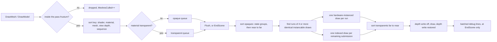

# 3D Rendering — Guide

**What this covers:** `Renderer3D` end to end — why `DrawMesh` **submits** instead of drawing, the
cull → sort → auto-instance → flush pipeline and what it means for your code, **the
material-read-at-flush rule that breaks naive per-draw tinting**, meshes and primitives, glTF/FBX
models, per-slot submesh materials, transparency, frustum culling, both instancing paths, LOD
groups, the statistics counters, and the batched debug-line verbs.
**Source of truth:** `Cosmic/src/renderer/Renderer3D.{h,cpp}`, `renderer/RenderQueue.h`,
`renderer/InstanceSet.{h,cpp}`, `math/Frustum.h`, `graphics/Mesh.{h,cpp}`,
`graphics/Model.{h,cpp}`, `graphics/Material.h`, `scene/Components3D.h`, `scene/Scene3D.cpp`,
`tests/test_render_queue.cpp`, `tests/render/render_3d.cpp`
**API Reference:** [../reference/rendering-3d.md](../reference/rendering-3d.md) *(skeleton — D10)* ·
**How it works:** [../systems/rendering-3d.md](../systems/rendering-3d.md) *(skeleton — D28)*
**Configuration:** **3D only.** `renderer/Renderer3D.*` and `renderer/InstanceSet.*` are filtered
out of the 2D engine build (`Cosmic/CMakeLists.txt:186`) and their includes sit behind
`#ifndef COSMIC_2D_ONLY` in `Cosmic.h` (`:36`, `:51`), as does `graphics/Model.h` (`:72`). Naming
`Renderer3D`, `InstanceSet` or `Model` in a `COSMIC_2D_ONLY` tree is a **compile error, by design** —
see [`../systems/build-2d-3d-split.md`](../systems/build-2d-3d-split.md). Two pieces of this
chapter's scope do survive into the 2D build because they are dimension-neutral: `graphics/Mesh.h`
(`Cosmic.h:70`, unfenced) and the header-only `math/Frustum.h` (`Cosmic.h:95`) both compile there —
there is simply nothing in a 2D build that draws a mesh.

`Renderer3D` is a **deferred** renderer. `DrawMesh` does not talk to the GPU: it records a command
into a per-scene queue, having first thrown the submission away if its bounds miss the camera
frustum. At `Flush()` — which `EndScene()` calls for you — the queue is sorted, runs of identical
work are collapsed into hardware-instanced draws, and only then does anything reach the driver. Two
consequences follow from that one fact and they account for almost every surprise in this chapter:
**submission order is not draw order**, and **the values a material holds at flush time are the
values every draw that referenced it gets**. The second one has a whole section to itself, and it is
the section to read twice.

---

## Quick start

```cpp
#include "Cosmic.h"

void MyLayer::OnAttach()
{
    m_Box = Cosmic::Mesh::CreateBox({ 1.0f, 1.0f, 1.0f });
}

void MyLayer::OnUpdate(float deltaTime)
{
    Cosmic::Renderer3D::BeginScene(m_Camera);            // any Camera subclass

    Cosmic::Renderer3D::DrawGrid(20.0f, 1.0f, { 0.3f, 0.32f, 0.36f, 1.0f });
    Cosmic::Renderer3D::DrawMesh(m_Box, glm::mat4(1.0f), { 0.8f, 0.25f, 0.2f, 1.0f });

    Cosmic::Renderer3D::EndScene();                      // sorts, instances, draws
}
```

Four things this is quietly asserting:

- **Drawing happens in `OnUpdate`.** `Layer::OnRender()` is declared but never called by the engine
  (D46 finding) — see [`time-and-ticks.md`](time-and-ticks.md).
- **`EndScene` is what draws.** Nothing between the two calls touches the GPU.
- **Depth testing is already on.** `RendererAPI::Init` enables `GL_DEPTH_TEST` and alpha blending
  process-wide (`OpenGLRendererAPI.cpp:17-20`), so opaque geometry sorts correctly with no setup.
- **You do not bind a framebuffer.** Under `WorkspaceLayer` (the editor and the packaged player) a
  viewport target is already bound. See [`windowing-and-viewport.md`](windowing-and-viewport.md)
  *(D60)*.

`Renderer3D::Init()` / `Shutdown()` are called by `Renderer::Init` (`Renderer.cpp:28`) — client code
never calls them.

---

## DG-7 — what one submission actually does



The queue lives in `Renderer3D.cpp`; the sorting logic itself is factored into the pure,
header-only `renderer/RenderQueue.h` so it can be unit-tested without a GL context
(`tests/test_render_queue.cpp`). Everything in the diagram is verified there or in the golden render
test `tests/render/render_3d.cpp`.

---

## The one rule that breaks migrated code: material values are read at flush

> **`Renderer3D` captures the material by *reference*, not by value.** `transform`, `color` and
> `entityID` are copied into the queued command; the `Ref<Material>` is stored as a pointer and its
> uniform cache is read when the queue flushes (`Renderer3D.cpp:575-603`, then `BindStateGroup` at
> `:674`). **Mutating one shared material between two `DrawMesh` calls does not give you two
> different draws — it gives you two draws with the material's *final* values.**

This is the single most common migration failure. The pattern that used to work with an immediate
renderer:

```cpp
// WRONG under the render queue — every sphere comes out with roughness 1.0.
for (int i = 0; i < 5; ++i)
{
    m_PbrMaterial->Set("u_Roughness", i / 4.0f);
    Cosmic::Renderer3D::DrawMesh(m_Sphere, XformFor(i), m_PbrMaterial);
}
```

Nothing warns. The frame looks plausible — five spheres appear, all identical — so the bug reads as
"my roughness slider does nothing".

**The fix is one clone per variant**, built once and reused across frames:

```cpp
// Build the variants once (OnAttach, or lazily the first time the grid is needed).
for (int i = 0; i < 5; ++i)
{
    Cosmic::Ref<Cosmic::Material> m =
        Cosmic::Material::Clone(m_PbrMaterial, "Sphere r" + std::to_string(i));
    m->Set("u_Roughness", i / 4.0f);
    m_SphereMaterials.push_back(m);
}

// Draw with them — no mutation between submissions.
for (int i = 0; i < 5; ++i)
    Cosmic::Renderer3D::DrawMesh(m_Sphere, XformFor(i), m_SphereMaterials[i]);
```

`Material::Clone(source, newName)` deep-copies the uniform and texture caches, the transparency
flag, and both shader twins, while **sharing the compiled `Ref<Shader>`** (`Material.h:23-28`,
`:151`) — so a clone per variant costs a hash map, not a shader compile. Engine3DDemo's PBR
metallic-roughness grid is exactly this pattern with 25 clones
(`Projects/Engine3DDemo/src/Engine3DDemo.cpp:543-576`), and its MeshLit aircraft caches one clone
per part colour (`:432-441`).

Three corollaries, all of them load-bearing:

**1. Scene state is read at flush too.** The sun direction, ambient, IBL set, shadow map and snow
overlay are pushed onto each shader at bind time inside `BindStateGroup` / `ApplySceneBindings`
(`Renderer3D.cpp:682-695`, `:985`). Calling `SetLightDirection` between two `DrawMesh` calls does
not light them differently — the last value wins for the whole scene. `SetLights` is a scene-level
call; make it before you start submitting.

**2. Changing a material every frame is fine.** The rule is about variation *within one flush*, not
across frames. A slider that pushes `u_Shininess` into a material once per frame works — that is
what Engine3DDemo does (`:1157-1159`).

**3. If you genuinely need custom GPU state around some draws, flush inside the scene.**

```cpp
Cosmic::Renderer3D::BeginScene(m_Camera);

Cosmic::Renderer3D::DrawMesh(m_Body, bodyXform, m_BodyMaterial);
Cosmic::Renderer3D::Flush();                    // everything above draws NOW, under engine defaults

Cosmic::RenderCommand::SetDepthTest(false);     // your state island
Cosmic::Renderer3D::DrawMesh(m_Overlay, overlayXform, m_OverlayMaterial);
Cosmic::Renderer3D::Flush();                    // …applies to these draws
Cosmic::RenderCommand::SetDepthTest(true);      // restore

Cosmic::Renderer3D::EndScene();
```

`Flush()` executes and **clears** both queues (`Renderer3D.cpp:922`, `:953`), so — unlike
`Renderer2D::Flush()`, which does not reset its counters and double-draws
([`rendering-2d.md`](rendering-2d.md#flush-is-public-and-does-not-reset)) — calling it mid-scene is
safe and idempotent. Starforge's asset-preview rig uses it to draw a mesh with depth on and then a
bone overlay with depth off (`Projects/Starforge/src/PreviewRig.cpp:249`).

For the common case of "these draws need alpha blending and no depth writes", **do not build a state
island** — flag the material transparent instead and let the queue do it. See
[Draw transparent geometry](#draw-transparent-geometry).

---

## Open and close a scene

```cpp
static void BeginScene(const glm::mat4& viewProjection, const glm::vec3& cameraPos);
static void BeginScene(const PerspectiveCamera& camera);
static void BeginScene(const Camera& camera);
static void EndScene();
static void Flush();
```

The `(mat4, vec3)` form is the primitive; the two camera overloads read only
`GetViewProjectionMatrix()` and `GetPosition()` and forward to it (`Renderer3D.cpp:333-341`), so any
`Camera` subclass — including one you write — works. Use the matrix form when you have a
view-projection but no camera object, which is what the reflection pass does with a mirrored oblique
matrix (`Engine3DDemo.cpp:1047`).

`BeginScene` does five things (`:294-331`):

| Step | Detail |
| --- | --- |
| Warns on a nested scene | `"BeginScene called while a scene is already open"` |
| Discards an unflushed queue | Warns with the count, then clears both queues |
| Extracts the pass frustum | `Frustum::FromViewProjection` — works on oblique/mirrored matrices |
| Resets the line batch and the scratch-instance index | Scratch `InstanceSet`s recycle per scene |
| Uploads the camera UBO | `CameraBlock` at binding 1 — every 3D shader reads it |

Because the camera lives in a UBO, **no shader needs a per-draw `u_ViewProjection`**. A custom mesh
shader declares `layout(std140, binding = 1) uniform CameraBlock { mat4 ViewProjection; vec4
CameraPosition; }` and gets it for free — see [`materials-and-shaders.md`](materials-and-shaders.md).

`EndScene` flushes the mesh queue first and the batched debug lines second, so lines depth-test
against the meshes you just drew (`:365-381`). It warns and returns if no scene is open.

**Complete a 3D scene before starting a 2D one.** The two renderers keep separate view-projection
state by design (`Renderer3D.h:41-43`); `Renderer3D` restores every render state it changes, so a
`Renderer2D::BeginScene` block afterwards behaves normally.

### What happens if you draw outside a scene

| Call | Behaviour |
| --- | --- |
| `DrawMesh` / `DrawMeshSkinned` / `DrawMeshInstanced` / `DrawLine` / `DrawInfiniteGrid` outside `BeginScene`/`EndScene` | Logs a `CS_CORE_WARN` naming the verb, then drops the call |
| `DrawMesh(nullptr, …)`, `DrawMesh(mesh, …, nullptr material)`, a material with no shader | **Returns silently** — no log line (`:609`, `:626`, `:633`) |
| `DrawModel(nullptr, …)` | Returns silently (`:1109`) |
| `EndScene` with no `BeginScene` | Warns, returns |
| `Flush()` outside a scene with a non-empty queue | Warns with the count and **discards** it (`:781-789`) |

The asymmetry is worth internalising: a *lifecycle* mistake is loud, a *null asset* is silent. If
nothing draws and the log is clean, suspect a null `Ref`.

---

## Make a mesh

A `Mesh` owns a `VertexArray` of indexed triangles in the engine's **canonical vertex layout**, which
every mesh shader declares verbatim (`Mesh.h:15-18`):

| Location | Attribute | Type |
| --- | --- | --- |
| 0 | `a_Position` | `vec3` |
| 1 | `a_Normal` | `vec3` |
| 2 | `a_TexCoord` | `vec2` |
| 3 | `a_Tangent` | `vec4` — `xyz` tangent, `w` bitangent handedness |

Tangents are generated automatically for **every** producer — primitives, OBJ and glTF alike — in the
`Mesh` constructor (`Mesh.cpp:102-105`), so normal mapping has a consistent TBN basis whether or not
the source file carried one. Skinned meshes add joints/weights at locations 4/5 in a second vertex
buffer (`Mesh.cpp:175-186`); static shaders never read them.

### Primitives

```cpp
Cosmic::Ref<Cosmic::Mesh> box      = Cosmic::Mesh::CreateBox({ 1.0f, 0.25f, 2.0f });
Cosmic::Ref<Cosmic::Mesh> ground   = Cosmic::Mesh::CreatePlane(24.0f, 24.0f);
Cosmic::Ref<Cosmic::Mesh> cylinder = Cosmic::Mesh::CreateCylinder(0.5f, 1.0f, 24);
Cosmic::Ref<Cosmic::Mesh> cone     = Cosmic::Mesh::CreateCone(0.5f, 1.0f, 24);
Cosmic::Ref<Cosmic::Mesh> sphere   = Cosmic::Mesh::CreateUVSphere(0.6f, 32, 48);
Cosmic::Ref<Cosmic::Mesh> torus    = Cosmic::Mesh::CreateTorus(0.5f, 0.2f, 32, 16);
```

All six are origin-centred with outward normals, so a plain scale matrix resizes them predictably.
The plane is an XZ ground quad with a `+Y` normal; the cylinder and cone stand along `+Y` (the cone's
base at `-height/2`, apex at `+height/2`); the torus lies in the XZ plane.

### `MeshData` — the GL-free half

Every primitive has a **pure `Build*` twin** that returns CPU geometry and touches no GPU resource
(`Mesh.h:158-173`). The `Create*` factories are one-line uploaders over them (`Mesh.cpp:194-199`).

```cpp
Cosmic::MeshData data = Cosmic::Mesh::BuildUVSphere(1.0f, 24, 32);
data.ApplyTransform(glm::scale(glm::mat4(1.0f), { 1.0f, 2.0f, 1.0f }));   // bake, normals fixed up
Cosmic::Ref<Cosmic::Mesh> stretched = Cosmic::Mesh::Create(data);
```

Use the split when you want to inspect, transform or merge geometry before upload — it is what the
importer does to apply a source file's unit scale and up-axis, and what headless tests assert vertex
counts and bounds on. `MeshData::ApplyTransform` is inline in the header so it links across DLL
boundaries without exporting the struct (`Mesh.h:113`).

### Raw geometry and OBJ

```cpp
static Ref<Mesh> Mesh::Create(const std::vector<MeshVertex>& vertices,
                              const std::vector<uint32_t>& indices);
static Ref<Mesh> Mesh::Create(const MeshData& data);
static Ref<Mesh> Mesh::CreateFromOBJ(const std::string& resolvedPath);
static MeshData  Mesh::BuildFromOBJ(const std::string& resolvedPath);
```

`Mesh::Create` **returns `nullptr` and logs an error** on empty vertex or index data
(`Mesh.cpp:131-135`); a non-multiple-of-three index count warns but proceeds (`:137`).
`CreateFromOBJ` returns `nullptr` after `BuildFromOBJ` has already logged the specific reason —
unopenable file, malformed face token, out-of-range index, or "contained no triangle geometry"
(`Mesh.cpp:482`, `:547`, `:559`, `:604`).

**Neither takes a VFS path.** Resolve first:

```cpp
Cosmic::Ref<Cosmic::Mesh> rover = Cosmic::Mesh::CreateFromOBJ(
    Cosmic::FileSystem::Resolve("project://models/rover.obj"));
```

Or route through the cache, which resolves *and* de-duplicates:

```cpp
Cosmic::Ref<Cosmic::Mesh> rover = Cosmic::AssetLibrary::GetMesh("project://models/rover.obj");
```

`AssetLibrary::GetMesh` sends every format the importer supports through `MeshImport` (so the
source's `.cmeta` unit scale and up-axis are applied) and falls back to the OBJ parser otherwise
(`AssetLibrary.cpp:136-147`). Prefer it. See [`assets-and-vfs.md`](assets-and-vfs.md) *(D58)*.

### What a mesh knows about itself

```cpp
mesh->GetVertexCount();  mesh->GetIndexCount();
mesh->GetLocalMin();     mesh->GetLocalMax();     mesh->GetLocalCenter();
mesh->HasSubmeshes();    mesh->GetSubmeshes();    mesh->GetMaterialSlotCount();
mesh->IsSkinned();       mesh->GetSkeleton();     mesh->GetGpuBytes();
```

The **local AABB** is computed once at construction from the vertex positions and is the input to
frustum culling, frame-to-fit navigation and CPU picking. An empty mesh reports a degenerate box at
the origin. `GetGpuBytes` is the estimate the Resources panel and status bar display, not an exact
driver allocation.

---

## Load a glTF or FBX model

```cpp
static Ref<Model> Model::CreateFromGLTF(const std::string& resolvedPath);   // .gltf / .glb
```

A `Model` is a list of `ModelPart`s — one per triangle primitive in the file — each holding a `Mesh`
with the node's **world transform already baked into the vertices**, the glTF metallic-roughness
factors, up to five textures, and a ready-to-draw `Ref<Material>` built against `PBR.glsl`
(`Model.h:44-65`). glTF is right-handed, +Y up, metres, which is exactly the engine's render frame,
so nothing is converted.

```cpp
// Cached (recommended) — resolves the VFS path and loads once.
Cosmic::Ref<Cosmic::Model> duck = Cosmic::AssetLibrary::GetModel("engine://models/Duck.glb");

// Or directly.
Cosmic::Ref<Cosmic::Model> duck2 = Cosmic::Model::CreateFromGLTF(
    Cosmic::FileSystem::Resolve("project://models/duck.glb"));

Cosmic::Renderer3D::DrawModel(duck, glm::translate(glm::mat4(1.0f), { 5.0f, 0.0f, 0.0f }));
```

`DrawModel` submits **one queued draw per part** — through the part's PBR material when the import
built one, and through the flat Lambert colour path with its base-colour factor when it did not
(`Renderer3D.cpp:1114-1120`). The `transform` you pass places the whole model; per-part placement is
already in the geometry.

**Import scope and failure modes:**

| Situation | Behaviour |
| --- | --- |
| Parse or buffer-load failure | `nullptr`, error logged naming the file (`Model.cpp:183`, `:190`) |
| No drawable triangle primitives | `nullptr`, error logged (`:315-318`) |
| Non-triangle primitive | Warned and skipped (`:246`) |
| Base64 image data-URI | Warned and skipped — external and embedded-buffer images work (`:51`) |
| `PBR.glsl` unavailable | `PbrMaterial` stays null; parts draw through the base-colour Lambert path |
| Skins and animation | **Ignored by `Model`** — the skeletal path is `Mesh::CreateSkinned` + the importer; see [`animation.md`](animation.md) *(D56)* |

Only the file's **default scene** graph is imported (roots plus all descendants); nodes outside it
are treated as authoring data. Files with no declared scene fall back to every node
(`Model.cpp:205-228`). A texture used by several parts uploads once — the loader caches per
`cgltf_image`.

### FBX, STL, DAE, PLY

Those formats route through `assets/MeshImport.h` (assimp, vendored and on by default) rather than
`Model`, which is glTF-only. `AssetLibrary::GetMesh("project://models/gun.fbx")` gives you a single
merged mesh; the fragment form `"project://models/gun.fbx#2"` addresses sub-mesh 2 and caches it as
its own asset slot (`assets/MeshImport.h`, `AssetLibrary.cpp:120-134`). Import parameters —
source-to-metre scale, up axis, UV flip, normal generation — live in a `<source>.cmeta` TOML sidecar
so a re-import is reproducible; the presets are STL mm, FBX cm. Full coverage is
[`assets-and-vfs.md`](assets-and-vfs.md) *(D58)*.

---

## Draw a lit model with your own material

This is the acceptance path: a PBR material, scene lights, one submission.

```cpp
void MyLayer::OnAttach()
{
    m_Model = Cosmic::AssetLibrary::GetModel("engine://models/Duck.glb");

    // A hand-built PBR material (the model's own imported materials work too).
    m_Material = Cosmic::Material::Create(
        Cosmic::AssetLibrary::GetShader("engine://shaders/PBR.glsl"), "Crate");
    m_Material->Set("u_Albedo",    glm::vec4{ 0.72f, 0.28f, 0.24f, 1.0f });
    m_Material->Set("u_Metallic",  0.0f);
    m_Material->Set("u_Roughness", 0.55f);
    m_Material->Set("u_AO",        1.0f);
    m_Material->Set("u_Emissive",  glm::vec3{ 0.0f });

    m_Crate = Cosmic::Mesh::CreateBox({ 1.0f, 1.0f, 1.0f });
}

void MyLayer::OnUpdate(float deltaTime)
{
    // Scene lighting — set it BEFORE submitting (read at flush).
    Cosmic::Renderer3D::SceneLightsDesc lights;
    lights.SunDirection = { -0.4f, -1.0f, -0.3f };     // the direction light TRAVELS
    lights.SunColor     = { 1.0f, 0.97f, 0.92f };
    lights.SunIntensity = 1.2f;
    lights.Ambient      = 0.25f;
    lights.Points = {
        { { 2.0f, 2.0f, 0.0f }, 10.0f, { 1.0f, 0.25f, 0.20f }, 1.0f },   // pos, radius, colour, intensity
        { { -2.0f, 1.5f, 1.0f }, 8.0f, { 0.25f, 0.40f, 1.0f }, 1.0f },
    };
    Cosmic::Renderer3D::SetLights(lights);

    Cosmic::Renderer3D::BeginScene(m_Camera);
    Cosmic::Renderer3D::DrawMesh(m_Crate, glm::mat4(1.0f), m_Material);
    Cosmic::Renderer3D::DrawModel(m_Model, glm::translate(glm::mat4(1.0f), { 3.0f, 0.0f, 0.0f }));
    Cosmic::Renderer3D::EndScene();
}
```

`SetLights` packs and uploads the `LightsBlock` UBO **immediately** (binding 0), so it is not subject
to the flush rule — but the *state it establishes* is scene-wide, which is why it belongs before the
submissions. Points beyond `kMaxPointLights = 16` are dropped with a **once-per-run** warning
(`Renderer3D.cpp:1200-1210`) — once per *process*, not per frame, so a scene permanently over the cap
logs exactly one line. When the ECS builds this description for you, the **first enabled and active**
`DirectionalLightComponent` becomes the sun and the loop breaks (`Scene3D.cpp:100-111`): extra suns
are silently ignored.

`SetLightDirection` / `SetAmbient` are the legacy single-sun setters. They patch the same UBO's sun
fields (`:1137-1144`, `:1156-1162`), so mixing them with `SetLights` is coherent — but prefer
`SetLights`, which is the whole description in one call.

> **`Material::Create` does not check its shader.** A null `Ref<Shader>` — which is what
> `AssetLibrary::GetShader` returns when the file is missing or fails to compile — produces a live
> material object with no shader (`Material.cpp:5-13`), and `DrawMesh` then drops every submission
> using it **silently** (`Renderer3D.cpp:633`). If a whole object is missing from the frame with a
> clean log, check the shader load, not the draw. `Material::Clone(nullptr, …)` is worse: it
> dereferences the source and crashes.

### What the engine sets on your shader, and when

`Material::BindFull()` uploads your cached uniforms and textures first; the engine's **convention
uniforms go on afterwards, so they always win** (`Renderer3D.cpp:687-696`). A shader opts in simply
by declaring the ones it uses — undeclared names resolve to location `-1` and are dropped in silence.

| Uniform | Stage | Set by |
| --- | --- | --- |
| `CameraBlock` (binding 1) — `ViewProjection`, `CameraPosition` | per scene | `BeginScene` |
| `LightsBlock` (binding 0) — sun + up to 16 points | per `SetLights` | `SetLights` |
| `u_LightDir` (`vec3`), `u_Ambient` (`float`) | per state group | `BindStateGroup` |
| `u_AmbientIntensity`, `u_IrradianceMap`, `u_PrefilterMap`, `u_BrdfLut`, `u_HasIBL`, `u_PrefilterMaxLod`, `u_ShadowMap`, `u_LightViewProj`, `u_ShadowBias`, `u_HasShadow`, the `u_Snow*` set | per state group | `ApplySceneBindings` |
| `u_Model` (`mat4`), `u_NormalMatrix` (`mat3`), `u_EntityID` (`int`) | per draw | `ExecuteSingle` |
| `u_Color` (`vec4`) | per draw, **Lambert path only** | `ExecuteSingle` |

Two consequences worth knowing. First, **`u_Color` is material-owned on the material path** — the
engine never sets it there (`Renderer3D.h:219`), so a material shader that wants a tint reads its own
cached value. Second, a material may cache a value the engine also sets — the glTF importer writes
`u_HasIBL = 0` into every material it builds (`Model.cpp:294`) — and the engine's later write wins,
which is why imported models still pick up image-based lighting.

`SetIBL` / `SetShadow` / `SetSnow` register scene-level resources by raw renderer ID and are normally
driven by `SceneRenderer`, not by you. They are covered in
[`lighting-and-environment.md`](lighting-and-environment.md). `ApplySceneBindings(shader)` is
public for the one case that needs it: an engine subsystem drawing with its **own** shader (terrain,
water) calls it right after binding so IBL and shadows still apply.

### Let the scene submit for you

Most projects never call `DrawMesh` directly. Attach a `MeshRendererComponent` (with a
`TransformComponent`) and `Scene::SubmitOpaqueMeshes` submits it into this same queue every pass —
lit, reflected, shadow-cast and coverage alike (`Scene3D.cpp:667-737`). The component chooses the
path for you: `MaterialAsset` set → the material path; null → the Lambert `Color` path; `MeshAsset`
null → the entity is skipped. `Enabled == false` or an inactive ancestor skips it everywhere;
`CastShadows == false` skips it in the depth passes only.

The full component catalogue is [`entities-and-components.md`](entities-and-components.md); the pass
graph that drives it is [`lighting-and-environment.md`](lighting-and-environment.md).

---

## Give one mesh several materials

An imported multi-part mesh carries a **submesh table** — contiguous index ranges, each naming a
material slot (`Mesh.h:85-96`). Primitives and OBJ meshes leave it empty, which means "one implicit
submesh over the whole mesh".

```cpp
static void DrawMesh(const Ref<Mesh>& mesh, const glm::mat4& transform,
                     const Ref<Material>& material, int entityID = -1,
                     uint32_t indexOffset = 0, uint32_t indexCount = 0);
```

`indexOffset` / `indexCount` are in **elements**, not bytes (`OpenGLRendererAPI.cpp:141-146`), and
`indexCount == 0` means the whole mesh — byte-identical to a pre-submesh draw. Drawing the slots by
hand:

```cpp
for (const Cosmic::Submesh& sm : mesh->GetSubmeshes())
{
    const Cosmic::Ref<Cosmic::Material>& slot = m_SlotMaterials[sm.MaterialIndex];
    Cosmic::Renderer3D::DrawMesh(mesh, xform, slot, -1, sm.IndexOffset, sm.IndexCount);
}
```

Each range becomes its own queue entry, so culling and sorting still apply per range. `mesh->
GetMaterialSlotCount()` is `max(MaterialIndex) + 1` — the length of the Inspector's *Materials* list.

Through the ECS this is automatic: fill `MeshRendererComponent::MaterialPaths` and the scene emits
one ranged draw per submesh, falling back to the single `MaterialAsset` (and then to the Lambert
colour) for any slot that is empty or unresolved (`Scene3D.cpp:710-731`). An empty `MaterialPaths`
keeps the legacy single-material path, byte-identical.

**Two limits.** A ranged draw is **never auto-instanced** (`Renderer3D.cpp:601` — the instanced path
draws the whole index buffer, so a range would be lost). And in the shadow and coverage passes the
scene submits a multi-material mesh as **one whole-mesh caster**, because depth does not care about
the material split (`Scene3D.cpp:713-718`).

---

## Draw transparent geometry

```cpp
material->SetTransparent(true);
```

That is the entire API. A transparent-flagged material's submissions go to a second queue that draws
**after every opaque**, sorted strictly far-to-near by squared view depth, with **depth writes off
and the depth test still on**, under the engine's default alpha blend — and depth writes are restored
to the engine default afterwards (`Renderer3D.cpp:926-953`).

```cpp
m_RiverMat = Cosmic::Material::Create(
    Cosmic::AssetLibrary::GetShader("engine://shaders/WaterFlow.glsl"), "River");
m_RiverMat->Set("u_Opacity", 0.55f);
m_RiverMat->SetTransparent(true);
```

Frontier's river and waterfall sheets are exactly this, and the source comment records that it
replaced a hand-rolled `SetDepthWrite(false/true)` island (`IslandWorld.cpp:404-411`). Prefer the
flag: it composes with sorting, whereas a manual island forces a flush and freezes the order.

Notes and limits:

- **The Lambert colour path can never be transparent.** The flag lives on `Material`, and the colour
  path has no material (`Renderer3D.cpp:573`).
- **Sorting is per object, by AABB centre.** Two interpenetrating transparent meshes still resolve in
  whole-object order; there is no per-triangle sort. Split the geometry if that matters.
- **Transparent submissions never auto-instance** (`:600`) — blending makes order part of the result.
- **State grouping is deliberately absent** in the transparent queue: only depth then sequence
  (`RenderQueue.h:67-71`, pinned by `tests/test_render_queue.cpp:69`). Expect more state changes
  there than in the opaque pass.
- `.cmat` assets carry the flag as `MaterialAsset::Transparent`, applied by
  `AssetLibrary::BuildMaterial` (`AssetLibrary.cpp:175`).

---

## Cull what the camera cannot see

Frustum culling is **on by default and automatic**. At submit, `Renderer3D` transforms the mesh's
eight local-AABB corners by your transform, tests the resulting world AABB against the pass frustum,
and drops the submission if it misses (`Renderer3D.cpp:524-569`). A dropped submission increments
`MeshesCulled` and costs nothing else.

```cpp
static void SetFrustumCullingEnabled(bool enabled);   // sticky global, default true
static bool IsFrustumCullingEnabled();
```

**Turn it off only for content whose shader moves vertices beyond the mesh's static AABB** — a
vertex-displacing custom shader, for example. The toggle is a global, not per scene; Engine3DDemo
wires it to a checkbox so you can watch the counters move (`Engine3DDemo.cpp:1878-1880`).

Two behaviours that are easy to miss:

- **Skinned draws get a padded box.** A posed skeleton can leave its bind-pose bounds, so
  `DrawMeshSkinned` inflates the cull box by half its extent per side before testing
  (`Renderer3D.cpp:556-564`).
- **`DrawMeshInstanced` is never engine-culled.** One AABB cannot describe a whole instance pool; the
  app culls those itself, once per frame, against the *main* camera frustum — see below.

### Culling your own instance pools

`math/Frustum.h` is pure, header-only maths (no GPU types, unit-tested in `tests/test_frustum.cpp`)
and is available in **both** engine configurations:

```cpp
Cosmic::Frustum f = Cosmic::Frustum::FromViewProjection(camera.GetViewProjectionMatrix());

if (f.IntersectsAABB(worldMin, worldMax)) { /* … */ }
if (f.IntersectsSphere(center, radius))   { /* … */ }
```

Planes are extracted Gribb–Hartmann with inward normals and are normalised, so the sphere test's
signed distance is metric. Both tests are conservative — a just-outside object may report as
intersecting, never the reverse.

The engine's policy for instanced content (`Frustum.h:12-16`) is **cull once, draw the survivors in
every pass**: build the frustum from the *main* camera, inflate by an object radius so near-offscreen
shadow casters survive, pack the survivors into an `InstanceSet`, and reuse that set for the shadow,
reflection and main passes.

---

## Draw a field of 5,000 instances

Two routes. Pick by whether you can hand the engine a pre-packed pool.

### Route A — explicit `InstanceSet` (the one to use for 5,000 of anything)

An `InstanceSet` is a CPU packer plus an std430 SSBO at binding 9 holding
`{ mat4 Model; vec4 Tint; }` per instance — 80 bytes each. The instanced shader reads it by
`gl_InstanceID`.

```cpp
// In the layer's header:
//   struct Placement { glm::mat4 Transform{ 1.0f }; glm::vec4 Tint{ 1.0f }; glm::vec3 Position{ 0.0f }; };
//   Cosmic::Ref<Cosmic::Mesh>        m_Rock;
//   Cosmic::Ref<Cosmic::Material>    m_RockMat;
//   Cosmic::Ref<Cosmic::InstanceSet> m_RockSet;
//   std::vector<Placement>  m_Placements;
//   std::vector<glm::mat4>  m_Xforms;
//   std::vector<glm::vec4>  m_Tints;

void MyLayer::OnAttach()
{
    m_Rock = Cosmic::Mesh::CreateUVSphere(0.5f, 10, 14);

    // The material's shader MUST be the instanced variant — the SSBO replaces u_Model.
    m_RockMat = Cosmic::Material::Create(
        Cosmic::AssetLibrary::GetShader("engine://shaders/PBRInstanced.glsl"), "Rock");
    m_RockMat->Set("u_Albedo",    glm::vec4{ 0.42f, 0.40f, 0.40f, 1.0f });
    m_RockMat->Set("u_Metallic",  0.0f);
    m_RockMat->Set("u_Roughness", 0.85f);
    m_RockMat->Set("u_AO",        1.0f);
    m_RockMat->Set("u_Emissive",  glm::vec3{ 0.0f });

    constexpr uint32_t kCount = 5000;
    Cosmic::Random rng(0x5ca77e00u);
    m_Placements.reserve(kCount);
    for (uint32_t i = 0; i < kCount; ++i)
    {
        const glm::vec3 pos{ rng.Range(-200.0f, 200.0f), 0.0f, rng.Range(-200.0f, 200.0f) };
        const float     s   = rng.Range(0.8f, 1.6f);   // UNIFORM scale — see the limitation below

        Placement p;
        p.Position  = pos;
        p.Transform = glm::scale(
            glm::rotate(glm::translate(glm::mat4(1.0f), pos),
                        rng.Range(0.0f, 6.2831853f), glm::vec3(0.0f, 1.0f, 0.0f)),
            glm::vec3(s));
        p.Tint = glm::vec4(rng.Range(0.85f, 1.15f), rng.Range(0.85f, 1.15f),
                           rng.Range(0.85f, 1.15f), 1.0f);
        m_Placements.push_back(p);
    }

    m_RockSet = Cosmic::InstanceSet::Create(kCount);   // nullptr if capacity is 0 or the SSBO fails
    m_Xforms.reserve(kCount);
    m_Tints.reserve(kCount);
}

void MyLayer::OnUpdate(float deltaTime)
{
    if (!m_RockSet)
        return;

    // Cull once, against the MAIN camera, and reuse the packed set in every pass.
    const Cosmic::Frustum frustum =
        Cosmic::Frustum::FromViewProjection(m_Camera.GetViewProjectionMatrix());

    m_Xforms.clear();
    m_Tints.clear();
    for (const Placement& p : m_Placements)
    {
        if (frustum.IntersectsSphere(p.Position + glm::vec3(0.0f, 2.0f, 0.0f), 2.0f))
        {
            m_Xforms.push_back(p.Transform);
            m_Tints.push_back(p.Tint);
        }
    }
    m_RockSet->SetInstances(m_Xforms.data(), m_Tints.data(),
                            static_cast<uint32_t>(m_Xforms.size()));

    Cosmic::Renderer3D::BeginScene(m_Camera);
    if (m_RockSet->GetCount() > 0)
        Cosmic::Renderer3D::DrawMeshInstanced(m_Rock, m_RockMat, m_RockSet, m_RockSet->GetCount());
    Cosmic::Renderer3D::EndScene();
}
```

Frontier scatters 5,000 pines and 1,500 boulders exactly this way; `Projects/Frontier/src/common/
Scatter.h` is the reusable version of the loop above and `IslandWorld.cpp:375-402` is the call site.

Contract details:

| Point | Detail |
| --- | --- |
| Shader | Must **be** the instanced variant (`PBRInstanced.glsl`), not a twin registered on a normal material. There is no per-draw `u_Model`/`u_NormalMatrix`. |
| Count | Clamped to the set's uploaded count *and* its capacity (`Renderer3D.cpp:1083`, `InstanceSet.cpp:54`) — over-asking draws fewer, never overruns |
| Tints | `nullptr` for the tint array gives every instance opaque white (`InstanceSet.cpp:62`); `Tint.rgb` multiplies albedo, `Tint.a` is reserved |
| Scale | **Uniform scale only.** The instanced shaders derive normals from `mat3(Model)`; a non-uniform instance scale skews them (`InstanceSet.h:21-25`) |
| Culling | Never done by the engine — that is your `Frustum` loop |
| Immediate | `DrawMeshInstanced` is **not** queued: it binds and draws on the spot (`Renderer3D.cpp:1091-1100`), so it does not participate in opaque sorting |
| Failure | `Create` returns `nullptr` (logged) on zero capacity or a failed SSBO allocation; `SetInstances` with a null transform pointer sets the count to 0 and returns |
| Counters | `ExplicitInstanceDraws` and `ExplicitInstances` |

Shadow and coverage passes have matching verbs — `ShadowMap::DrawCasterInstanced` and
`CoverageCapture::DrawCasterInstanced` — which `SceneDrawContext::DrawMeshInstanced` routes to
automatically, so a `SceneRenderer`-driven app writes the draw once and gets casters for free
(`SceneRenderer.h:144-147`).

### Route B — auto-instancing (free, but conditional)

If you submit the same mesh with the same material many times, the queue can collapse those
submissions into one instanced draw *without you packing anything*. All five preconditions must hold
(`Renderer3D.cpp:600-601`):

1. The material is **not** transparent.
2. The material has an **instancing twin** registered: `material->SetInstancingShader(twin)`.
3. `entityID == -1` — per-instance IDs are not in the SSBO, so batching a pickable entity would break
   ID picking.
4. Not a skinned draw, and not a submesh range.
5. After sorting, **at least 4** consecutive submissions share the same material *and* mesh
   (`kAutoInstanceMinRun = 4`, `:177`). Shorter runs are not worth the upload plus twin bind.

```cpp
m_RockMat = Cosmic::Material::Clone(m_PbrMaterial, "Rocks");
m_RockMat->Set("u_Albedo", glm::vec4{ 0.30f, 0.70f, 0.65f, 1.0f });
if (Cosmic::Ref<Cosmic::Shader> twin =
        Cosmic::AssetLibrary::GetShader("engine://shaders/PBRInstanced.glsl"))
    m_RockMat->SetInstancingShader(twin);

// …then just submit normally. entityID stays at its -1 default.
for (int i = 0; i < 48; ++i)
    Cosmic::Renderer3D::DrawMesh(m_Sphere, XformFor(i), m_RockMat);
```

The twin must declare the **same** uniform and texture contract as the base shader — the queue binds
your material's whole cache onto it with `Material::BindFullTo` (`Material.h:78-87`), which maps 1:1.
`PBR.glsl` → `PBRInstanced.glsl` is the shipped pair.

At flush the sorted opaque list is scanned by `RenderQueue::FindInstancableRuns` for maximal runs of
qualifying, same-material-and-mesh entries (`RenderQueue.h:88`). Each run is drawn in chunks of
`kScratchCapacity = 1024` from a pooled scratch `InstanceSet` — one set per chunk, so a run never
rewrites an SSBO a just-issued draw is still reading. A 5,000-entry run therefore becomes 5 draw
calls, not 1. If SSBO creation is unavailable the run silently falls back to individual draws
(`:869-903`).

The golden test `tests/render/render_3d.cpp:447` renders a 3×3 grid twice — once with the twin
registered, once without — asserts the two really took different paths (`AutoInstanceBatches >= 1`
vs `== 0`), and requires the frames to match. Auto-instancing is a pure win, not a visual change.

**Auto-instancing is opt-in and almost nothing opts in.** `AssetLibrary::BuildMaterial` — the `.cmat`
path — registers the *skinned* twin on every material it builds but **never** the instancing twin
(`AssetLibrary.cpp:157-176`), and neither does the glTF importer. So a `.cmat`-authored or imported
material can never auto-instance; you must register the twin in code. Auto-instanced runs also drop
the per-instance tint — the scratch set is uploaded with a null tint array (`Renderer3D.cpp:878`),
which is correct, since every member of a run shares one material anyway.

### Choosing between them

| | Auto-instancing | Explicit `InstanceSet` |
| --- | --- | --- |
| You write | One `SetInstancingShader` call | A cull loop plus `SetInstances` |
| Per-instance tint | No (all white) | Yes |
| Engine frustum culling | Yes, per submission | No — you do it |
| Sorted with the rest of the scene | Yes | No, draws immediately |
| Good for | Dozens to a few hundred repeats you already submit individually | Thousands of props you own as a pool |

At 5,000 objects, Route A. The per-submission cull, sort and key build are per *object* work you
avoid entirely by owning the pool.

---

## Switch level of detail by distance

`LODGroupComponent` draws **one** mesh per frame — the first level whose `MaxDistance` covers the
camera-to-entity distance (`Components3D.h:142-170`).

```cpp
Cosmic::Entity e = m_Scene->CreateEntity("Rock outcrop");
auto& t = e.GetComponent<Cosmic::TransformComponent>();
t.Position = { 3.0f, 0.0f, 0.0f };

auto& lod = e.AddComponent<Cosmic::LODGroupComponent>();
lod.Levels = {
    { m_RockHigh, 15.0f },   // LOD0 while distance <= 15 m
    { m_RockMid,  35.0f },   // LOD1 out to 35 m
    { m_RockLow,  90.0f },   // LOD2 out to 90 m; beyond that, not drawn at all
};
lod.MaterialAsset = m_RockMat;   // null -> the Lambert `Color` path
lod.CastShadows   = true;
```

`SelectLevel` is pure and headless-tested (`tests/test_render_queue.cpp:131-147`): boundaries are
**inclusive** (exactly 15.0 m picks LOD0), a distance past the last level returns `-1` and the entity
is **distance-culled**, and an empty level list returns `-1`. A level with a null `MeshAsset` is
skipped for that frame. Switches are hard cuts — cross-fade is a recorded follow-up, not shipped.

All levels share the one `MaterialAsset` / `Color`, and the shadow and coverage passes select the
**same** level using the real camera distance (`SceneRenderer.cpp:441-455`, `:501-514`), so a caster
always matches its lit mesh.

Three traps:

- **`Levels` is not serialized.** Only `Color` and `CastShadows` are reflected
  (`reflect/TypeRegistry3D.cpp:75-77`). LOD levels are code-only and **do not survive a scene
  save/load**; build them in code after loading.
- **The distance uses the entity's *local* `Position`, not its world position.** All five selection
  sites read `TransformComponent::Position` while drawing at the entity's **world** transform
  (`Scene3D.cpp:748`, `SceneRenderer.cpp:452` shadow, `:511` coverage, `ScenePicker.cpp:85`,
  `ViewportController.cpp:563`). For a flat entity these agree; **for a parented one they do not**, so
  keep LOD entities unparented.
- **A `MeshRendererComponent` and a `LODGroupComponent` on the same entity both draw.** The two walks
  are independent (`Scene3D.cpp:671`, `:741`). Pick one.

---

## Read the statistics counters

```cpp
static void       ResetStats();
static Statistics GetStats();
```

| Counter | Counts |
| --- | --- |
| `MeshesSubmitted` | `DrawMesh` / `DrawModel`-part submissions **accepted** (incremented before the cull test) |
| `MeshesCulled` | Submissions dropped by the frustum test |
| `MeshesDrawn` | Submissions executed as individual indexed draws |
| `AutoInstanceBatches` | Instanced draws issued for collapsed runs — one per **chunk**, not per run |
| `AutoInstancedMeshes` | Submissions drawn through those batches |
| `ExplicitInstanceDraws` | `DrawMeshInstanced` calls |
| `ExplicitInstances` | Instances drawn by those calls |
| `DrawCalls` | Every GPU mesh draw: singles + auto-instanced chunks + explicit instanced draws |

Reading them: `MeshesSubmitted` counts *survivors of the null checks*, not attempts, so
`MeshesSubmitted - MeshesCulled == MeshesDrawn + AutoInstancedMeshes` for a queue that fully
executed. `DrawCalls` counts **mesh** draws only — the batched line flush and `DrawInfiniteGrid` are
not in it.

> **Nothing in the engine calls `ResetStats()`.** Call it once per frame, before your first
> `BeginScene`, or the counters read as lifetime totals. Engine3DDemo
> (`Engine3DDemo.cpp:835`) and Frontier (`FrontierApp.cpp:103`) do; **Starforge does not**, so the
> editor's Profiler panel shows accumulating totals. This is the 3D half of the asymmetry described
> in [`logging-and-diagnostics.md`](logging-and-diagnostics.md) — `Renderer3D` has no
> `StatsEnabled` flag (counters always accumulate), while `Renderer2D` has one and it defaults to
> `false`.

The counters are the acceptance evidence for culling and instancing. Toggle culling and orbit until
part of the scene leaves the view: `MeshesSubmitted` holds steady, `MeshesCulled` climbs, `DrawCalls`
falls. Engine3DDemo's *Performance (S12)* panel is that readout (`Engine3DDemo.cpp:1876-1904`).

---

## Draw debug lines, grids and axes

These are a separate batch from the mesh queue — staged CPU-side and flushed at `EndScene`, after the
meshes, so they depth-test against them.

```cpp
static void DrawLine(const glm::vec3& a, const glm::vec3& b, const glm::vec4& color);
static void DrawPolyline(const glm::vec3* points, size_t count, const glm::vec4& color);
static void DrawPolyline(const std::vector<glm::vec3>& points, const glm::vec4& color);
static void DrawGrid(float extent, float step, const glm::vec4& color);
static void DrawGrid(float extent, float step, const glm::vec4& minorColor,
                     const glm::vec4& majorColor, int majorEvery = 5);
static void DrawAxes(const glm::mat4& transform, float size = 1.0f);
static void DrawWireBox(const glm::mat4& transform, const glm::vec4& color);
```

```cpp
Cosmic::Renderer3D::DrawGrid(24.0f, 1.0f, { 0.24f, 0.25f, 0.28f, 1.0f },
                                          { 0.40f, 0.42f, 0.46f, 1.0f }, 5);
Cosmic::Renderer3D::DrawAxes(glm::mat4(1.0f), 2.0f);                    // world origin tripod
Cosmic::Renderer3D::DrawWireBox(bodyTransform, { 1.0f, 0.9f, 0.2f, 1.0f });
Cosmic::Renderer3D::DrawPolyline(m_Trail, { 0.95f, 0.75f, 0.20f, 1.0f });
```

`DrawAxes` colours +X red, +Y green, +Z blue and takes a model matrix, so it visualises any object
frame. `DrawWireBox` is a unit cube spanning ±0.5 under your transform — scale it to an AABB's
extents. `DrawGrid` is on the XZ plane at `y = 0`, centred on the origin, spanning ±`extent`;
non-positive `extent` or `step` returns silently. `DrawPolyline` needs at least two points and
returns silently otherwise.

The batch holds **20,000 lines** (`Renderer3DData::MaxLines`, `Renderer3D.cpp:82`). Like
`Renderer2D`'s batches, hitting the ceiling costs an extra draw call and nothing else: `DrawLine`
flushes and keeps going (`:396`). Note the guard reads `>= MaxLineVertices - 1`; since the counter
moves in steps of 2 from 0, the `- 1` never changes the outcome — the same harmless-looking
off-by-one `Renderer2D` has.

### The infinite editor grid

```cpp
Cosmic::Renderer3D::InfiniteGridDesc grid;
grid.Height       = 0.0f;
grid.FadeDistance = 0.0f;              // 0 = auto, scaled by camera height
Cosmic::Renderer3D::DrawInfiniteGrid(grid);
```

One attribute-less fullscreen triangle whose fragment shader ray-casts each pixel onto the `y =
Height` plane: no extent, decade cell switching with distance, antialiased lines, axis highlighting.
It **draws immediately, not queued**, with the depth test on and depth writes off (restored), so
scene geometry occludes it and it occludes nothing. Call it between `BeginScene` and `EndScene`. If
`InfiniteGrid.glsl` failed to load at `Init`, the call is a silent no-op — a warning was logged once
at startup.

---

## Draw a skinned mesh

```cpp
static void DrawMeshSkinned(const Ref<Mesh>& mesh, const glm::mat4& transform,
                            const Ref<Material>& material,
                            const glm::mat4* palette, uint32_t jointCount, int entityID = -1);
```

The palette is copied into the frame's staging array, uploaded once into the binding-10 SSBO at
flush, and indexed per draw. It routes through the material's **skinned twin**
(`Material::SetSkinnedShader`, e.g. `PBRSkinned.glsl`), which `AssetLibrary::BuildMaterial` registers
on every `.cmat` material automatically. With no palette, a zero joint count, or no twin, it falls
back to a static bind-pose draw — the compat default. Skinned draws are queued like any other but
**never auto-instance** (each carries its own palette base) and get the padded cull box described
above.

Producing the palette is the animator's job — see [`animation.md`](animation.md) *(D56)*.

---

## Common patterns

**Clone per variant, once, and cache.** Build the clones on first use and keep them alive across
frames. Engine3DDemo caches by colour in a small vector and looks up linearly (`:432-441`); the PBR
grid rebuilds only when the grid size changes (`:543`).

**Set scene state before the first submission.** `SetLights`, `SetAmbientIntensity`, `SetIBL`,
`SetShadow`, `SetSnow` — all scene-wide, all read at flush. Put them above `BeginScene` or
immediately after it.

**Let `entityID` default to `-1` unless you are picking.** It is the auto-instancing precondition
most easily lost. The ECS path passes the entity handle, which is why component-driven meshes do not
auto-instance — picking wins over batching there, deliberately.

**Reach for `SetTransparent`, not a state island.** Flushing mid-scene defeats sorting for everything
after it. The flag is the supported route and composes with the queue.

**Own your pools above a few hundred instances.** `InstanceSet` plus one `Frustum` sweep beats
thousands of individual submissions the queue must key, sort and scan.

**Reset the stats yourself.** One `Renderer3D::ResetStats()` at the top of the frame, before the
first `BeginScene`.

---

## Pitfalls

**"Every object in my loop has the last object's material values."** Material values are read at
flush, not at submit. Use `Material::Clone` per variant — see
[the rule that breaks migrated code](#the-one-rule-that-breaks-migrated-code-material-values-are-read-at-flush).

**"Nothing draws and there is no error."** Either a null `Ref<Mesh>` / `Ref<Material>` (dropped
silently) or drawing outside `BeginScene`/`EndScene` (which *does* warn — check the log; Release
builds have no console, so the log **file** is the only output, see
[`logging-and-diagnostics.md`](logging-and-diagnostics.md)).

**"My objects vanish when I look away, but they should still render."** That is frustum culling
working. If a custom shader displaces vertices past the mesh AABB, call
`SetFrustumCullingEnabled(false)`.

**"My draws happen in the wrong order."** Submission order is not draw order. Opaques sort by state
then near-to-far; transparents draw after all opaques, far-to-near. Flag alpha content transparent
rather than relying on call order.

**"My transparent object disappears behind opaque geometry that should be behind it."** Transparent
draws have depth writes off but the depth **test** on. Something opaque wrote depth in front of it —
check that the occluder really is opaque.

**"Auto-instancing never triggers."** Check all five preconditions. The two that catch people:
`entityID` must be `-1` (so component-driven meshes never qualify), and the material must have an
instancing twin — which neither `.cmat` materials nor imported glTF materials get automatically.

**"My 5,000-instance run reports 5 batches, not 1."** Runs are drawn in 1,024-instance chunks; each
chunk is one draw call and one `AutoInstanceBatches`.

**"My instanced trees have skewed lighting."** Non-uniform instance scale. The instanced shaders
derive normals from `mat3(Model)`; keep instance transforms rigid plus uniform scale.

**"The stats counters only ever go up."** Nothing calls `ResetStats()` for you.

**"`MeshesSubmitted` is lower than my draw-call count."** You are mixing in `DrawMeshInstanced`,
which counts under `ExplicitInstance*` and never touches `MeshesSubmitted`.

**"My LOD group stopped switching after I parented it."** The distance test reads the entity's local
`Position`. Keep LOD entities unparented.

**"My LOD levels are empty after loading a scene."** `LODGroupComponent::Levels` is not reflected and
not serialized. Rebuild it in code.

**"`BeginScene` warns about discarded draws."** A previous scene was never closed. Every `BeginScene`
needs its `EndScene`.

**"My model imported but has no materials."** `PBR.glsl` failed to load, so `PbrMaterial` is null on
every part and `DrawModel` falls back to flat base colours. Check the startup log.

**"`Mesh::CreateFromOBJ` returned null."** The reason was already logged by `BuildFromOBJ` — and
check you resolved the VFS path first; neither `Mesh` factory nor `Model::CreateFromGLTF` resolves
`project://` for you.

**"`Renderer3D` is undefined."** You are compiling the 2D configuration. See
[`../systems/build-2d-3d-split.md`](../systems/build-2d-3d-split.md).

---

## See also

- [`../reference/rendering-3d.md`](../reference/rendering-3d.md) — per-call signatures *(skeleton, D10)*
- [`../systems/rendering-3d.md`](../systems/rendering-3d.md) — how the queue works internally *(skeleton, D28)*
- [`materials-and-shaders.md`](materials-and-shaders.md) — `Material`, `Clone`, the three bind verbs, `.cmat`, the shader contract
- [`lighting-and-environment.md`](lighting-and-environment.md) — `SceneRenderer`, the pass graph, IBL, shadows, sky, the post chain
- [`world-systems.md`](world-systems.md) — terrain, water and particles: the content `desc.TerrainSystem` / `WaterBodies` / `Emitters` carry
- [`entities-and-components.md`](entities-and-components.md) — `MeshRendererComponent`, `PrimitiveMeshComponent`, `LODGroupComponent`, the automatic-draw contract
- [`cameras.md`](cameras.md) — the cameras and controllers `BeginScene` accepts, and picking
- [`animation.md`](animation.md) — skeletons, clips and the palette `DrawMeshSkinned` consumes *(D56)*
- [`assets-and-vfs.md`](assets-and-vfs.md) — `AssetLibrary`, model import, `.cmeta` sidecars *(D58)*
- [`logging-and-diagnostics.md`](logging-and-diagnostics.md) — the other stats counters and the GPU profiler
- [`../design/frame-lifecycle.md`](../design/frame-lifecycle.md) — the pass and state contract
- [`../systems/build-2d-3d-split.md`](../systems/build-2d-3d-split.md) — what each configuration ships
