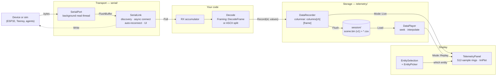

# Serial & Telemetry — Guide

**What this covers:** talking to a device over a COM port (`SerialPort`, and the `SerialLink`
service that manages it for you), framing a binary protocol with COBS + CRC16, defining telemetry
channels and recording them from any thread, exporting a session to disk, replaying it with
scrubbing and interpolation, putting the ImGui/ImPlot panel on screen, and the entity-selection
service the panel plots against.
**Source of truth:** `Cosmic/src/serial/SerialPort.{h,cpp}`, `serial/SerialLink.{h,cpp}`,
`serial/Framing.h`, `Cosmic/src/telemetry/TelemetryChannel.h`, `telemetry/DataRecorder.{h,cpp}`,
`telemetry/DataPlayer.{h,cpp}`, `telemetry/TelemetryPanel.{h,cpp}`,
`telemetry/EntitySelection.{h,cpp}`, `telemetry/EntityPicker.h`, `scene/SelectableComponent.h`,
`Runtime/Main.cpp`, `Projects/SF_Telem/src/{TelemHub,Telemetry,SF_Telem}.*`,
`Projects/ViperSim/src/fc_glue/HilBridge.h`,
`Cosmic/templates/ExampleProject/src/TemplateTelemetryLayer.cpp`,
`tests/test_serial_lifecycle.cpp`, `tests/test_framing.cpp`, `tests/test_telemetry_roundtrip.cpp`,
`tests/test_telemetry_robustness.cpp`, `tests/test_sftelem_hub.cpp`
**API Reference:** [`../reference/serial-telemetry.md`](../reference/serial-telemetry.md)
*(skeleton — D17 unwritten; this chapter is the client-facing source until it lands)* ·
**How it works:** [`../systems/serial-telemetry.md`](../systems/serial-telemetry.md)
*(skeleton — D33)*
**Configuration:** **both.** Every header here is included by `Cosmic.h` unfenced and compiles
identically on the 2D and 3D engines.

> **`SerialPort` is Windows-only.** It is built directly on Win32 — `CreateFileA` with
> `FILE_FLAG_OVERLAPPED`, `WaitForMultipleObjects`, and a registry walk of
> `HKEY_LOCAL_MACHINE\HARDWARE\DEVICEMAP\SERIALCOMM` for port discovery. `SerialPort.cpp` includes
> `<windows.h>` unconditionally. The rest of this chapter — framing, recording, replay, the panel —
> is plain C++ and has no platform dependency.

The engine ships **transport**, **framing** and **storage**. It does not ship a protocol. What the
bytes on your wire *mean* is your code's job, and the two shipped exemplars pick opposite answers:
SF_Telem uses a newline-terminated ASCII protocol with an XOR checksum, ViperSim's
hardware-in-the-loop bridge uses the binary COBS+CRC16 codec in `serial/Framing.h`. Both sit on the
same `SerialLink`.

### DG-13 — The telemetry data path



## Quick start

Read bytes from a device, decode them, and record two channels:

```cpp
#include <Cosmic.h>

class LinkLayer : public Cosmic::Layer
{
public:
    void OnAttach() override
    {
        m_Id = m_Recorder.Register("Motor", "Drive", { "Volts", "Amps" });
        m_Recorder.ReserveCapacity(60 * 300);   // 5 minutes at 60 Hz — no allocation after this
        m_Panel.SetRecorder(&m_Recorder);       // switches the panel to Mode::Live
        m_Panel.SetPlayer(&m_Player);
    }

    void OnUpdate(float ts) override
    {
        m_Link.OnUpdate(ts);                            // port scan + async auto-reconnect

        if (m_Link.ConsumeJustConnected())
            m_Rx.clear();                               // drop a half-line from the old session

        m_Rx += m_Link.Poll();                          // empty string when nothing arrived
        size_t nl;
        while ((nl = m_Rx.find('\n')) != std::string::npos)
        {
            const std::string line = m_Rx.substr(0, nl);
            m_Rx.erase(0, nl + 1);
            if (std::sscanf(line.c_str(), "%f,%f", &m_Volts, &m_Amps) == 2)
                m_Recorder.Record(m_Id, { m_Volts, m_Amps });
        }

        m_Recorder.Tick(ts);
        m_Panel.OnUpdate(ts);
    }

    void OnImGuiRender() override
    {
        ImGui::Begin("Connection");
        m_Link.DrawConnectionUI();      // Refresh / COM / Baud / Auto-reconnect / Connect
        ImGui::End();

        ImGui::Begin("Telemetry");
        m_Panel.OnImGuiRender();        // loader, entity combo, per-channel plots, inspector
        ImGui::End();
    }

    void OnDetach() override
    {
        m_Link.Shutdown();
        m_Recorder.WaitForFlush();
    }

private:
    Cosmic::SerialLink     m_Link;
    Cosmic::DataRecorder   m_Recorder;
    Cosmic::DataPlayer     m_Player;
    Cosmic::TelemetryPanel m_Panel;
    std::string            m_Rx;
    uint32_t               m_Id    = 0;
    float                  m_Volts = 0.0f, m_Amps = 0.0f;
};
```

Three things in that sketch are the whole shape of this chapter. `SerialLink` is **owner-ticked** —
nothing in the engine drives it, so if you forget `OnUpdate` you get no reconnects and no data.
`Record` takes an **ID from `Register`**, not a name, because it is designed to be called from a
worker thread. And the panel switches source by **mode**, not by which pointer you last set.

## Connect to a device

`SerialLink` is the component you almost always want. It owns a `SerialPort` plus everything an app
has to build around one: the discovered-port list, the selected port and baud rate, connect intent,
an auto-reconnect policy, staleness tracking, and the connection UI.

```cpp
Cosmic::SerialLink m_Link;          // a member of your layer — never a local

void OnUpdate(float ts)
{
    m_Link.OnUpdate(ts);            // MUST be called every frame
    const std::string chunk = m_Link.Poll();
    if (!chunk.empty())
        Ingest(chunk);
}

void OnDetach() { m_Link.Shutdown(); }
```

`OnUpdate(dt)` does three things: advances an internal clock (using `std::fabs(dt)`, so a negative
global time scale still ages the link rather than freezing it), re-scans the available ports at
about 1 Hz **while the port is closed**, and runs the auto-reconnect retry. `Poll()` returns
everything the background read thread has accumulated since the last call and clears the buffer;
it returns an empty string when the port is closed or nothing arrived.

| Call | What it does |
| --- | --- |
| `Connect()` | Sets connect intent and starts an **async** open on the selected port. No-op when no port is selected — including the intent flag, so clicking Connect with an empty list does nothing at all. |
| `Disconnect()` | Clears intent and closes. Auto-reconnect stops. |
| `Shutdown()` | Clears intent *before* closing — use this on detach and on return-to-launcher so no stale "keep retrying" flag survives. |
| `Write(data, len)` / `Write(std::string)` | Binary-safe pass-through to `SerialPort::Write`. Returns `false` if the port is closed or the device dropped mid-write. |
| `IsOpen()` | The OS handle is open. **Not** the same as "data is flowing." |
| `IsReceiving()` | Open **and** a byte arrived less than 1 second ago. This is the one to drive a "link healthy" indicator with. |
| `GetState()` | `SerialPort::State::{Idle, Connecting, Open, Failed}`. |
| `SecondsSinceLastByte()` | Staleness metric for your own timeouts. Starts at 100 before the first byte. |
| `ConsumeJustConnected()` | Returns `true` exactly once after each fresh open. Clear your RX accumulator here. |
| `DrawConnectionUI()` | Draws Refresh / COM combo / Baud combo / Auto-reconnect / status + Connect\|Disconnect. No `Begin`/`End` — drop it inside your own window so you can add your own widgets around it. |

**Auto-reconnect** is on by default. While the user wants a connection (`Connect()` was pressed and
`Disconnect()` was not) and `IsReceiving()` is false, the link re-scans ports and calls
`BeginOpen` every **3 seconds** of silence — including while the port is nominally still open,
which is what catches a Bluetooth SPP link that has gone quiet without dropping. Retries never
stack: the attempt is skipped while `GetState() == Connecting`.

> **Auto-reconnect can silently move you to a different port.** Each retry calls `RefreshPorts()`,
> which keeps the current selection only if that port is still in the list; otherwise it falls back
> to `m_Ports.front()`. Unplug the device on COM7 while a Bluetooth COM3 exists and the link will
> happily open COM3 and report `RECEIVING` on whatever noise arrives. If you support more than one
> serial device, validate the first frames after `ConsumeJustConnected()` before trusting the link.

### Owning the port yourself

Use `SerialPort` directly only when you genuinely don't want the policy layer — a fixed port baked
into a config file, a headless tool, a test.

```cpp
Cosmic::SerialPort port;

for (const std::string& name : Cosmic::SerialPort::GetAvailablePorts())
    CS_INFO("Found {}", name);          // {"COM3", "COM7", ...}; empty vector if none

if (port.Open("COM3", 115200))          // blocking: configures 8N1, spawns the read thread
    CS_INFO("Connected");

// Drain from any per-frame hook. Thread-safe; clears the shared buffer.
const std::string data = port.FlushBuffer();

port.Write("$RESET\n");                 // bounded blocking overlapped write; false on failure
port.Close();                           // joins the read thread; safe when never opened
```

**`Open` blocks, and on an unreachable Bluetooth port it blocks for 10–20 seconds.** That is a
frozen render thread. Use `BeginOpen` instead, which runs the same work on a one-shot worker and
returns immediately:

```cpp
port.BeginOpen("COM3", 115200);
// ... later frames ...
switch (port.GetState())
{
    case Cosmic::SerialPort::State::Connecting: DrawSpinner();       break;
    case Cosmic::SerialPort::State::Open:       DrawConnected();     break;
    case Cosmic::SerialPort::State::Failed:     DrawRetryButton();   break;
    case Cosmic::SerialPort::State::Idle:       DrawConnectButton(); break;
}
```

Failure behaviour, all verified in `tests/test_serial_lifecycle.cpp`:

- `Open` returns `false` and leaves the state `Failed` when the port cannot be opened, the DCB
  cannot be read, or `SetCommState` fails. It also **refuses to run at all** while a `BeginOpen` is
  in flight — it logs a warning and returns `false` rather than racing the worker for `m_Handle`.
- `BeginOpen` never stacks: a second call while `Connecting` is a silent no-op.
- A device unplugged mid-session is detected by the read thread, which logs
  `SerialPort: read error N — device disconnected.`, sets the state to `Failed` and exits. Callers
  polling `IsOpen()` observe it without calling `Close()`.
- `Close()` is idempotent, safe from the destructor, and **bounded** even against a wedged port: it
  signals a manual-reset stop event that the read thread waits on alongside its pending overlapped
  read, so the `join()` returns promptly instead of waiting out a timeout. A `Close()` issued while
  a connect worker is still blocked in `CreateFileA` sets an abandon flag, and the worker tears its
  own freshly-opened session down when it finally returns.
- `Write` returns `false` immediately when the port is closed, the handle is invalid, or `length`
  is zero — it never touches the handle in those cases.

> **The README's old §20 said `Write` was "planned but not yet implemented."** It is implemented and
> exported (`SerialPort.h`, `SerialPort.cpp`) — an overlapped, waited write that is safe to call
> from the main thread while the read thread has its own pending read on the same handle.

## Frame a binary protocol

`serial/Framing.h` is a COBS + CRC16 frame codec. It is **deliberately freestanding**: it includes
nothing from the engine and nothing from the STL beyond `<stdint.h>`/`<stddef.h>`, uses no heap and
never throws, so the *same file* compiles unmodified on a Teensy or Arduino toolchain. That is the
point — it is the shared wire contract, not an engine convenience.

One frame on the wire is:

```
COBS( payload …  CRC16-hi  CRC16-lo )  0x00
```

- **CRC16-CCITT-FALSE** (poly `0x1021`, init `0xFFFF`, no reflection, no xorout) over the raw
  payload, appended **big-endian**, *before* COBS encoding. The check value
  `Crc16Ccitt("123456789", 9) == 0x29B1` is asserted in `tests/test_framing.cpp`.
- **COBS** removes every interior zero byte, so the single trailing `0x00` unambiguously terminates
  the frame and a receiver resynchronises after corruption by scanning to the next `0x00`.

```cpp
#include <Cosmic.h>   // or just "serial/Framing.h" on an embedded target

// --- Send ---
uint8_t frame[Cosmic::Framing::MaxFrameSize(sizeof(MyPacket))];
const size_t n = Cosmic::Framing::EncodeFrame(
    reinterpret_cast<const uint8_t*>(&pkt), sizeof(pkt), frame, sizeof(frame));
if (n > 0)
    m_Link.Write(reinterpret_cast<const char*>(frame), n);   // n INCLUDES the 0x00 delimiter

// --- Receive: accumulate, split on 0x00, decode the span between delimiters ---
for (const char c : m_Link.Poll())
{
    const uint8_t b = static_cast<uint8_t>(c);
    if (b == 0x00)
    {
        if (!m_Rx.empty())
        {
            uint8_t payload[256];
            const size_t len = Cosmic::Framing::DecodeFrame(
                m_Rx.data(), m_Rx.size(), payload, sizeof(payload));
            if (len > 0)
                HandlePayload(payload, len);     // 0 == corrupt / short / CRC mismatch — drop it
        }
        m_Rx.clear();
    }
    else if (m_Rx.size() < 512) m_Rx.push_back(b);
    else                        m_Rx.clear();    // overflow — resync at the next delimiter
}
```

Members: `std::vector<uint8_t> m_Rx;`.

**Every function in the codec reports failure as `0`, and never logs.** `EncodeFrame` returns 0 when
the output buffer is too small; `CobsDecode` returns 0 on an embedded zero, a truncated group, or
insufficient output capacity; `DecodeFrame` returns 0 on any of those *plus* a CRC mismatch or a
frame shorter than the two CRC bytes. Because a real frame always carries at least the CRC, 0 is
unambiguous. Size your buffers with the two `constexpr` helpers rather than guessing:

| Helper | Meaning |
| --- | --- |
| `CobsMaxEncoded(n)` | `n + n/254 + 2` — worst-case COBS output for `n` input bytes. |
| `MaxFrameSize(payloadLength)` | `CobsMaxEncoded(payloadLength + 2) + 1` — payload + CRC + COBS overhead + delimiter. Size your TX buffer with this. |

`CobsDecode`'s `outputCap` must be **at least `length`**; decoded output is never longer than its
input, so passing the same size is always correct.

The worked example is ViperSim's hardware-in-the-loop bridge
(`Projects/ViperSim/src/fc_glue/HilBridge.h`), whose PC side and Teensy firmware
(`Projects/ViperSim/viper-fc/firmware/src/main.cpp`) share this header verbatim. Note the pattern it
uses: one fixed TX buffer sized to `MaxFrameSize(sizeof(SensorPacket))`, the **largest** packet in
the protocol, reused for every packet type.

> **A frame that does not fit is dropped in total silence.** `EncodeFrame` returns 0 and
> `HilBridge::SendFramed` simply skips the write — no log, no counter. If you size a TX buffer to
> one packet type and later add a bigger one, the new packet stops transmitting with no diagnostic
> anywhere. Size to your largest packet, and consider counting the zeros.

**The alternative is ASCII line framing**, and it is a perfectly good choice for a link you want to
read in a terminal. SF_Telem uses `$<side>,<temp>,<volts>,<amps>,<count>,<extra>*<XOR-hex>\n`,
splits on `\n`, validates an XOR checksum over the payload, and routes on the side tag
(`Projects/SF_Telem/src/Telemetry.h`). Whichever you pick, two rules hold:

1. **Reassemble across chunk boundaries.** `Poll()` returns whatever the OS had buffered — a frame
   routinely arrives split across two calls. `tests/test_sftelem_hub.cpp` splits a frame at *every*
   byte boundary and requires it to decode.
2. **Bound the accumulator.** A device that stops emitting delimiters must not grow your buffer
   without limit. SF_Telem clears its accumulator past 4 KB; the ViperSim bridge clears past 512 B.

## Define channels and record

A `DataRecorder` holds time-series float data for a set of named entities. Each entity is registered
once with a fixed channel list and gets a stable `uint32_t` ID; every sample after that is one float
per channel plus the recorder's own elapsed-time stamp.

```cpp
// 1. Register — MAIN THREAD ONLY, before any worker can call Record.
const uint32_t id = m_Recorder.Register(
    "Agent_00",                                        // entity name — the lookup key
    "Agent",                                           // tag — selects the panel's inspector
    { "PosX", "PosY", "Speed", "Heading", "Power" });  // channels, in order, fixed for good

// 2. Reserve once, after all Register calls. expectedFrames = duration_s * sample_rate.
m_Recorder.ReserveCapacity(static_cast<size_t>(60.0f * 300.0f));

// 3. Record — thread-safe, zero-allocation after the reserve.
m_Recorder.Record(id, { x, y, speed, heading, power });

// 4. Advance the clock once per tick while recording.
m_Recorder.Tick(dt);
```

**The registration rule is not advisory.** `m_Records` is grown only by `Register` and never resized
afterwards, which is exactly what makes `m_Records[id]` lock-free on a worker. Calling `Register`
after the first worker-thread `Record` is undefined behaviour. Do all registration in `OnAttach`.

| Call | Thread | Behaviour |
| --- | --- | --- |
| `Register(name, tag, channels)` | Main only | Returns a stable ID. A **duplicate name returns the existing ID** and ignores the new channel list — it never creates a second record. |
| `ReserveCapacity(frames)` | Main only | Reserves the timestamp vector and every channel column. Removes all allocation from the hot path. |
| `Record(id, values)` | **Any** | Takes the per-entity mutex for well under a microsecond. Two overloads: `std::initializer_list<float>` and `const std::vector<float>&`. |
| `Tick(dt)` | Main | Adds `dt` to the elapsed-time counter and drives autosave. |
| `GetCurrentFrame(name, out)` | Main | Copies the most recent frame. Returns `false` for an unknown name **or when nothing has been recorded yet**. |
| `GetInfo(name)` | Main | `const EntityTelemetryInfo*` (name, tag, channels), or `nullptr`. |
| `GetEntityNames()` | Main | Registration order. |
| `GetRecordedDuration()` | Any | The elapsed-time counter, in seconds. |
| `GetTotalFrameCount()` | Main | The **maximum** frame count across entities — entities registered at different times diverge. |
| `Clear()` | Main | Drops all frames, keeps registrations and reserved capacity, resets elapsed time to zero. Use it between runs; you never re-`Register`. |

A mismatched value count is silently tolerated, in both directions: extra values past the channel
count are dropped, and missing channels are **written as 0.0f**, not left at their previous value.
That is deliberate — it keeps the CSV columns rectangular when a device goes quiet — but it means a
row of zeros is indistinguishable from a real reading of zero.

`Record` stamps every sample with the recorder's *current* elapsed time, so the tick order matters.
Both shipped hosts record first and `Tick` last, which stamps a step's samples with the time at the
**start** of that step and puts the first sample at `t = 0`:

```cpp
void MyLayer::OnFixedUpdate(float dt)
{
    if (dt <= 0.0f) return;                       // paused / rewinding — capture nothing
    if (m_Mode == Cosmic::TelemetryPanel::Mode::Replay) return;

    StepSimulationAndRecord(dt);                  // ... m_Recorder.Record(...) ...
    m_Recorder.Tick(dt);
}
```

Because `Tick` takes the *simulated* `dt` rather than wall-clock time, a recording made at a global
time scale of 0.25 replays at its authored speed: the timestamps in the file are simulation seconds.

### Recording from worker threads

This is what the columnar storage exists for. `Cosmic/templates/ExampleProject/src/AgentSystem.h` is
the in-tree reference — a `ParallelSystem` whose workers call `Record` directly:

```cpp
void OnFixedParallelExecute(Cosmic::Scene& scene, float fixedDt) override
{
    Cosmic::DataRecorder* recorder = m_Recorder;   // capture the pointer BY VALUE
    const float dt = fixedDt;

    m_Agents.ForEachAsync([recorder, dt](AgentComponent& agent)
    {
        // ... integrate agent ...
        recorder->Record(agent.recordId, {
            agent.position.x, agent.position.y, vLen, agent.heading, agent.power });
    });
}
```

Each entity has its own mutex, so N workers recording N different entities never contend. See
[`jobs-and-parallelism.md`](jobs-and-parallelism.md) for the surrounding four-pass contract.

## Export a session

`Flush` snapshots every entity under its own lock and hands the copy to a background thread. It
returns immediately; workers may keep calling `Record` while the write runs.

```cpp
m_Recording = false;
m_Recorder.Flush("recordings/MyApp", m_SessionName, 60.0f);
// Poll IsFlushing() to drive a status line; WaitForFlush() blocks (call it before shutdown).
```

Output layout:

```
recordings/MyApp/<sessionName>/
├── scene.bin        all entities, v1 binary
├── Agent_00.csv     one CSV per entity: Time, ch0, ch1, …
└── Agent_01.csv
```

An empty `sessionName` produces an ISO-8601-ish folder name (`2026-07-26_14-30-05`) from local time.
The directory is created if absent; a failure to create it, or to open `scene.bin`, logs an error,
clears the flushing flag and abandons the write — **the CSVs are not written either**.

A second `Flush` while one is in flight logs `a flush is already in progress — ignoring.` and
returns without writing. `~DataRecorder()` calls `WaitForFlush()`, so a recorder destroyed with a
write outstanding blocks rather than truncating the file (`tests/test_telemetry_robustness.cpp`
covers all three).

> **Neither `Flush` nor `DataPlayer::Load` resolves VFS paths.** `baseFolder` and the load path go
> straight to `std::filesystem`, so `"user://takes"` is created as a literal directory named
> `user:` — it does not fail, which is worse. Wrap the path yourself:
> `m_Recorder.Flush(Cosmic::FileSystem::Resolve("user://takes"), name, 60.0f)`. This is the same
> trap `SceneManager::Load`, `Shader::Create` and `DataExport` have; see
> [`assets-and-vfs.md`](assets-and-vfs.md).

### The v1 binary format

> **Read this from the source, not from a comment.** `DataRecorder.cpp:257` still labels the write
> `v3 format with per-entity sample_count` — three lines above `const uint32_t version = 1u;`. The
> writer emits **1**, and `DataPlayer::LoadBinaryFile` accepts **only** 1, logging
> `Unknown binary version N` for anything else. There is no v2 or v3 anywhere in the tree. The table
> below is read off `DataRecorder::Flush` and cross-checked against `DataPlayer::LoadBinaryFile`.

| Offset | Field | Type |
| --- | --- | --- |
| 0 | `magic` | `char[4]` = `"CSMC"` |
| 4 | `version` | `uint32` = `1` |
| 8 | `entity_count` | `uint32` |
| 12 | `sample_rate` | `float32` (nominal; header metadata only) |

Then one descriptor per entity, in registration order:

| Field | Type |
| --- | --- |
| `entity_name` | `char[64]`, NUL-padded |
| `entity_tag` | `char[64]`, NUL-padded |
| `channel_count` | `uint32` |
| `sample_count` | `uint32` — **per entity** |
| `channel_name[i]` | `char[32]` × `channel_count` |

Then one contiguous data block per entity, in the same order: `sample_count` rows of
`(channel_count + 1)` `float32`, row-major, each row `[timestamp, ch0, ch1, …, chN-1]`.

Practical consequences: entity and tag names are **truncated at 63 characters**, channel names at
31 (`strncpy_s` with `_TRUNCATE`). The per-row timestamp is what makes the file independent of the
nominal `sample_rate` and of any time scale in force during recording. And every scalar is written
raw, so a file is **little-endian x86 only** — it is a local artifact, not an interchange format.

The loader validates hard, because a corrupt count used to be fatal. Counts are bounded both by
absolute caps (`k_MaxEntities = 4096`, `k_MaxChannels = 1024`) *and* by the bytes actually remaining
in the file, and a short read now fails instead of zero-filling. Load failures are loud and total —
you get `false` and an error line naming the reason, never a half-populated player.

### Keep a crash failsafe

`SetAutosave` makes `Tick` roll a snapshot to a fixed folder while recording, so a hard crash costs
at most one interval:

```cpp
// When recording starts:
m_Recorder.SetAutosave("recordings/MyApp/_autosave",   // base dir
                       m_SessionName,                  // fixed name — REUSED, not timestamped
                       5.0f,                           // seconds of RECORDED time per snapshot
                       60.0f);                         // sample rate written to the header

// When recording stops, before the final Flush:
m_Recorder.DisableAutosave();
```

The snapshot is the same non-blocking `Flush`, so the main thread never stalls; if a flush is still
running when the interval elapses, that one is skipped rather than queued. The session name is
forced non-empty (`"autosave"` if you pass `""`) precisely so each snapshot **overwrites one folder**
instead of spawning a timestamped folder every few seconds. The interval is clamped to a minimum of
0.1 s. `DisableAutosave` stops the periodic write only — files already on disk stay until the next
autosaved session overwrites them.

Recovery is nothing special: the autosave folder is a complete, loadable session. Adopt SF_Telem's
`_autosave` naming so users can tell a rolling snapshot from a deliberately saved run.

## Replay a recording

```cpp
Cosmic::DataPlayer m_Player;

// A directory loads scene.bin; if that yields nothing, every *.bin in the folder is
// tried instead (the legacy per-entity layout). A single .bin path loads just that file.
if (m_Player.Load("recordings/MyApp/session_04"))
{
    m_Player.SetSpeed(1.0f);        // negative plays in reverse
    m_Player.Play();
}

void OnUpdate(float ts)
{
    m_Player.Tick(ts);              // no-op when paused or not loaded

    Cosmic::TelemetryFrame frame;
    if (m_Player.GetFrame("Agent_00", frame) && frame.values.size() >= 2)
        MoveGhost(frame.values[0], frame.values[1]);
}
```

`Load` **clears the previously loaded recording before it does anything else**, so a failed load
leaves the player empty rather than keeping the old take. It returns `false` (and warns) when the
path is neither a `.bin` file nor a directory, and when no entity loaded successfully. `Duration` is
derived from the largest last-timestamp across entities, not from the nominal sample rate.

| Call | Behaviour |
| --- | --- |
| `Tick(dt)` | Advances by `dt × speed`. **Auto-pauses at both endpoints** — forward at `Duration`, reverse at 0. |
| `SetPosition(s)` | Clamped to `[0, Duration]`. |
| `GetFrame(name, out)` | Interpolated frame at the current playhead; `out.timestamp` is set to the playhead, not to a sample time. |
| `SampleAt(name, s, out)` | Same, at an arbitrary position, without moving the playhead. Use it for trails and lookaheads. |
| `GetSampleRate()` | The file header's rate; **60 if nothing is loaded**. |
| `Unload()` | Clears data and resets position, duration, speed intent and the playing flag. |

Sampling is a binary search for the last frame at or before the requested time, then linear
interpolation into the straddling pair — correct regardless of the recorded rate, and correct for
recordings made under a non-unit time scale. Two edge cases worth knowing: a single-frame entity is
returned verbatim, and a zero-length span (two samples with identical timestamps) yields the
earlier sample rather than dividing by zero.

`GetFrame`/`SampleAt` return `false` for an unknown name or an entity with no frames. **Channels are
positional** — `frame.values[2]` is whatever was third in the `Register` call. Read the names back
from `GetInfo(name)->channels` if you need to map them.

### The `--replay` flag

`Runtime/Main.cpp` accepts `--replay <file>`, and the Inno Setup template
(`installer/AppSetup.iss`, mirrored by Starforge's packager) registers a `.cham` file association
pointing at it, so a double-clicked recording launches the app. The flag does not open anything
itself — it puts the path in the `COSMIC_REPLAY_FILE` environment variable for the app to read on
boot.

> **Nothing reads `COSMIC_REPLAY_FILE`, and `.cham` is not a format the engine writes.** A tree-wide
> search for the variable finds only the two lines in `Runtime/Main.cpp` that set it. And even if an
> app read it, `DataPlayer::Load` accepts only a directory or a path ending in `.bin` — the recorder
> writes `scene.bin` and `<name>.csv`, never `.cham`. So the association currently launches the app
> and does nothing else. If you want this to work today, read the variable yourself on attach and
> hand the path to `DataPlayer::Load` (and register `.bin`, not `.cham`):
>
> ```cpp
> if (const char* replay = std::getenv("COSMIC_REPLAY_FILE"))
>     if (m_Player.Load(replay))
>         m_Panel.SetMode(Cosmic::TelemetryPanel::Mode::Replay);
> ```

## Put the panel on screen

`TelemetryPanel` bridges either data source to ImGui/ImPlot. It tracks an explicit **mode** so the
source is never ambiguous:

| Mode | Set by | Source |
| --- | --- | --- |
| `Mode::None` | Initial state | — |
| `Mode::Live` | `SetRecorder(non-null)`, or `SetMode(Mode::Live)` | `DataRecorder` |
| `Mode::Replay` | A successful **Load in the panel's own UI**, or `SetMode(Mode::Replay)` | `DataPlayer` |

`SetPlayer` deliberately does **not** change the mode — attaching a player only makes the loader UI
available. Every mode change clears the ring buffers and the channel-name list (stale data from the
old source would otherwise be plotted, or worse, indexed against the wrong channel count), then
re-resolves the current selection against the new source.

```cpp
void OnAttach()
{
    m_Panel.SetRecorder(&m_Recorder);          // -> Mode::Live
    m_Panel.SetPlayer(&m_Player);              // mode unchanged
    m_Panel.SetReplayPath("recordings/MyApp/");// where the loader's path box + Browse start

    // Priority: entity-name inspector > tag inspector > raw channel-value fallback.
    m_Panel.RegisterTagInspector("Agent",
        [](const std::string& name, const Cosmic::TelemetryFrame& f)
        {
            if (f.values.size() < 5) return;
            ImGui::Text("Position : (%.2f, %.2f)", f.values[0], f.values[1]);
            ImGui::Text("Speed    : %.3f u/s",     f.values[2]);
        });
}

void OnUpdate(float ts)
{
    m_Panel.OnUpdate(ts);   // advances the player in Replay mode; pushes a frame into the rings
}
```

There are **three** draw entry points, and they compose rather than nest — each assumes you are
already inside an `ImGui::Begin`/`End`:

| Call | Draws |
| --- | --- |
| `OnImGuiRender()` | Replay loader (if a player is attached) · "Click to Select" checkbox · entity combo · one ImPlot chart per channel · inspector. **Not** the transport bar. |
| `DrawTransportControls()` | Only the transport: `\|< << \|> >> >\|`, speed slider, scrub bar, position readout. No-op outside `Mode::Replay` or with nothing loaded. |
| `DrawTransport()` | Loader + transport, without plots or inspector — for screens that render one big plot of their own. |

The transport is split out on purpose so it can live in a different window from the charts (SF_Telem
puts it above its own plot grid).

The plot buffers are a **512-sample ring per channel**. `OnUpdate` pushes one frame per call in Live
mode, and in Replay mode only when the playhead has actually moved — so a paused replay freezes the
plot rather than filling the ring with 512 copies of the same sample. Y ranges are computed from the
valid portion of the ring only, not from all 512 slots, so an axis does not stay pinned to zero
while the buffer fills.

## Select an entity

`EntitySelection` is a process-wide static service holding one selection: a name, a tag, and
optionally a live `Entity` handle. It is what tells the panel which entity to plot, and it is the
seam between viewport picking and the charts.

```cpp
// Live selection (simulation) — carries an entity handle.
Cosmic::EntitySelection::Set(entity, name, "Agent");

// Replay selection — name and tag only; GetEntity() returns an invalid handle.
Cosmic::EntitySelection::SetByName("Agent_00", "Agent");

Cosmic::EntitySelection::Clear();       // fires callbacks with empty name/tag

// Read from anywhere (mutex-guarded).
const std::string name = Cosmic::EntitySelection::GetName();
Cosmic::Entity e = Cosmic::EntitySelection::GetEntity();
if (e) { /* only valid after Set(), never after SetByName() */ }
```

Subscribe with `OnChanged`, and **always unsubscribe**:

```cpp
m_Sub = Cosmic::EntitySelection::OnChanged(
    [this](const std::string& name, const std::string& tag) { RebuildCharts(name, tag); });

MySystem::~MySystem() { Cosmic::EntitySelection::Unsubscribe(m_Sub); }
```

Member: `Cosmic::EntitySelection::SubscriptionHandle m_Sub = 0;`. `Unsubscribe` on a stale or
already-removed handle is a safe no-op. Callbacks fire on the thread that called `Set`/`SetByName`/
`Clear`, from a snapshot taken outside the mutex — so subscribing from inside a handler is safe and
does not receive the in-flight notification. `TelemetryPanel` subscribes in its constructor and
unsubscribes in its destructor; you do not have to wire it up.

### Click-to-select in the viewport

Tag the entities you want pickable — the component is empty, its presence is the whole signal:

```cpp
entity.AddComponent<Cosmic::SelectableComponent>();
```

`EntityPicker` is a header-only CPU picker for 2D scenes. `ScreenToWorld` unprojects through an
`OrthographicCamera`'s inverse view-projection; `Pick` walks every entity with **both**
`TransformComponent` and `SelectableComponent` and returns the first hit, or an invalid `Entity{}`.

```cpp
void MyLayer::OnEvent(Cosmic::Event& e)
{
    Cosmic::EventDispatcher dispatcher(e);
    dispatcher.Dispatch<Cosmic::MouseButtonPressedEvent>(
        [this](Cosmic::MouseButtonPressedEvent& ev) -> bool
        {
            if (ev.GetMouseButton() != CS_MOUSE_BUTTON_LEFT) return false;
            if (!m_Panel.IsPickingEnabled()) return false;           // the panel's checkbox
            if (m_Panel.GetMode() == Cosmic::TelemetryPanel::Mode::Replay) return false;

            auto& app = Cosmic::Application::Get();
            const glm::vec2 vpPos  = app.GetViewportPos();
            const glm::vec2 vpSize = app.GetViewportSize();
            const glm::vec2 mouse  = Cosmic::Input::GetMouseScreenPosition() - vpPos;

            if (mouse.x < 0.0f || mouse.y < 0.0f || mouse.x > vpSize.x || mouse.y > vpSize.y)
                return false;                                        // clicked the panel chrome

            const glm::vec2 world = Cosmic::EntityPicker::ScreenToWorld(
                m_Camera.GetCamera(), mouse, vpSize);

            if (Cosmic::Entity hit = Cosmic::EntityPicker::Pick(m_Scene, world))
            {
                Cosmic::EntitySelection::Set(
                    hit, hit.GetComponent<Cosmic::TagComponent>().Tag, "Agent");
                ev.Handled = true;
                return true;
            }
            return false;
        });
}
```

The coordinate contract is the part that goes wrong. The rendered image lives inside a docked
viewport panel offset from the OS window origin, so you must subtract `GetViewportPos()` and pass
`GetViewportSize()` — not the window size — or every pick lands somewhere else. Use
`Input::GetMouseScreenPosition()`, which is the space `GetViewportPos()` lives in; see
[`windowing-and-viewport.md`](windowing-and-viewport.md).

`Pick` takes an optional `std::function<bool(Entity)>` filter — return `false` to reject an
otherwise-hit entity, so different systems can define their own rules without removing the tag:

```cpp
Cosmic::Entity hit = Cosmic::EntityPicker::Pick(m_Scene, world,
    [](Cosmic::Entity e) { return e.GetComponent<Cosmic::TagComponent>().Tag.starts_with("Agent"); });
```

The hit test is the entity's `Scale`-sized rectangle **rotated by `Rotation.z`** (the query point is
transformed into the entity's local frame first), Z is ignored, and the raw `TransformComponent` is
used — so, like every other 2D path in the engine, **parenting does not move the pick box**. It also
ignores `TagComponent::Active` and every per-component `Enabled` flag: a hidden entity is still
pickable.

> `EntityPicker` is not `ScenePicker`. This one is a CPU AABB test against an `OrthographicCamera`
> for 2D scenes; `ScenePicker` (see [`cameras.md`](cameras.md)) is the editor's GPU entity-ID pass
> for 3D and is excluded from the 2D build.

## Common patterns

**One link, many screens.** Make the *root* layer own the `SerialLink` and drive
`OnUpdate`/`Shutdown`; hand child screens a `SerialLink*`. That is how SF_Telem keeps one connection
alive across screen switches (`SF_Telem.cpp` ticks the link, `TelemHub` only calls `Poll`).

**Split I/O from protocol so you can test the protocol.** SF_Telem's `PumpSerial()` is two lines —
`ConsumeJustConnected` and `Poll` — feeding a public `IngestChunk(const std::string&)` that does all
the framing and decoding. `tests/test_sftelem_hub.cpp` drives `IngestChunk` directly with no COM
port and covers split frames, garbage, and accumulator overflow. Structure your decoder the same way
and the hard half of your protocol becomes unit-testable.

**Gate the simulation on mode, not on a bool.** During replay the player owns the entity state;
running your fixed step as well means two writers:

```cpp
void OnFixedUpdate(float dt)
{
    if (dt <= 0.0f) return;
    if (m_Panel.GetMode() != Cosmic::TelemetryPanel::Mode::Replay)
    {
        m_Scene->OnFixedUpdate(dt);
        if (m_Recording) m_Recorder.Tick(dt);
    }
}
```

**Drive entities from the playhead.** Push the interpolated frame back into transforms each frame so
the scene animates with the scrubber:

```cpp
if (m_Panel.GetMode() == Cosmic::TelemetryPanel::Mode::Replay && m_Player.IsLoaded())
{
    auto view = m_Scene->View<Cosmic::TagComponent, Cosmic::TransformComponent>();
    for (auto raw : view)
    {
        Cosmic::TelemetryFrame f;
        if (m_Player.GetFrame(view.get<Cosmic::TagComponent>(raw).Tag, f) && f.values.size() >= 2)
        {
            auto& t = view.get<Cosmic::TransformComponent>(raw);
            t.Position.x = f.values[0];
            t.Position.y = f.values[1];
        }
    }
}
```

**Never lose a run.** SF_Telem combines three failsafes: rolling autosave while recording,
auto-export on Stop, and a final `Flush` in `Shutdown` if a deliberate recording was never exported.
The last one is cheap and worth copying — a dirty flag set when the user presses Record and cleared
on export.

**Record every entity every tick, even absent ones.** SF_Telem records all three ESCs on every fixed
step regardless of whether that ESC is transmitting. Missing devices record zeros, and the CSV
columns and plot X-axes stay aligned. The alternative — recording only present entities — gives you
files whose entities have different frame counts and a `GetTotalFrameCount()` that means little.

## Pitfalls

**"The port says OPEN but no data arrives."** That is the normal Bluetooth SPP failure: the COM port
opens fine even when the device is not streaming. Use `IsReceiving()`, not `IsOpen()`, for anything
user-facing; `SerialLink::DrawConnectionUI` already distinguishes the two.

**"The UI froze for ten seconds when I hit Connect."** You called the blocking `SerialPort::Open` on
the render thread. Use `SerialLink` (which always uses `BeginOpen`), or `BeginOpen` + `GetState()`
polling.

**"It reconnected to the wrong device."** Auto-reconnect re-scans and falls back to the first port in
the list when the selected one has vanished. See the warning under *Connect to a device*.

**"The first frame after a reconnect is garbage."** Your accumulator still holds half a frame from
the previous session. Call `ConsumeJustConnected()` every frame and clear on `true`.

**"My decoder works on the bench and drops frames in the field."** You are assuming one `Poll()`
returns whole frames. It does not. Accumulate and split on your delimiter.

**"Nothing was recorded."** Three usual causes, in order: `Tick` was never called (every timestamp
is 0 and `GetTotalFrameCount()` may still be non-zero); `Record` was called with the wrong ID —
`RecordImpl` silently returns for `id >= m_Records.size()`; or the recorder was `Clear()`ed by a
Start-Recording button after the samples arrived.

**"Some channels are zero and I never wrote zero."** `Record` zero-fills any channel your value list
did not reach. Count your channels.

**"The recording folder appeared with a `user:` directory in it."** `Flush` and `Load` do not resolve
VFS schemes. Wrap the path in `FileSystem::Resolve` yourself.

**"Load returns false and now the old recording is gone too."** `Load` clears first, then parses.
Keep the path if you want to retry.

**"The plot is frozen."** In Replay mode `OnUpdate` only pushes a frame when the playhead moved.
That is intended for a paused replay — but it also means a player at `Duration` with `Play()`
pressed pushes nothing, because `Tick` auto-paused at the endpoint.

**"Live and replay plot different channels for the same entity."** Nothing forces a recorder's
channel list and a loaded file's channel list to agree. The panel rebuilds its buffers from
whichever source the current mode names, so a schema change between recording and replaying shows up
as silently shifted channels. Version your channel list if it can change.

**"The transport bar doesn't draw."** `DrawTransportControls` is a no-op unless the mode is
`Mode::Replay` *and* a player is attached *and* something is loaded. `OnImGuiRender` never draws it
at all — that is by design; call it yourself.

**Don't trust the "v3" comment.** `DataRecorder.cpp` still has one. The format is v1.

## See also

- [`jobs-and-parallelism.md`](jobs-and-parallelism.md) — the threading contract behind
  worker-thread `Record`, and the `ParallelSystem` the template's agents run in.
- [`assets-and-vfs.md`](assets-and-vfs.md) — `FileSystem::Resolve`, the `user://` root, and the
  other path-taking APIs that do and don't resolve.
- [`entities-and-components.md`](entities-and-components.md) — `TagComponent`,
  `TransformComponent`, and the component catalogue.
- [`cameras.md`](cameras.md) — `OrthographicCamera` (which `EntityPicker::ScreenToWorld` takes) and
  `ScenePicker`, the 3D picking path.
- [`windowing-and-viewport.md`](windowing-and-viewport.md) — `GetViewportPos`/`GetViewportSize` and
  the screen-pixel mouse contract picking depends on.
- [`editor-ui-and-theming.md`](editor-ui-and-theming.md) — ImGui docking and the `PlotStyle`
  helpers around ImPlot.
- [`../reference/serial-telemetry.md`](../reference/serial-telemetry.md) — per-call signatures
  (skeleton — D17).
- [`../systems/serial-telemetry.md`](../systems/serial-telemetry.md) — internals and rationale
  (skeleton — D33).
- In-tree exemplars: `Projects/SF_Telem` (ASCII protocol, recording, replay, the full panel),
  `Projects/ViperSim/src/fc_glue/HilBridge.h` (COBS framing over `SerialLink`),
  `Cosmic/templates/ExampleProject/src/TemplateTelemetryLayer.cpp` (20 agents recording from
  worker threads).
