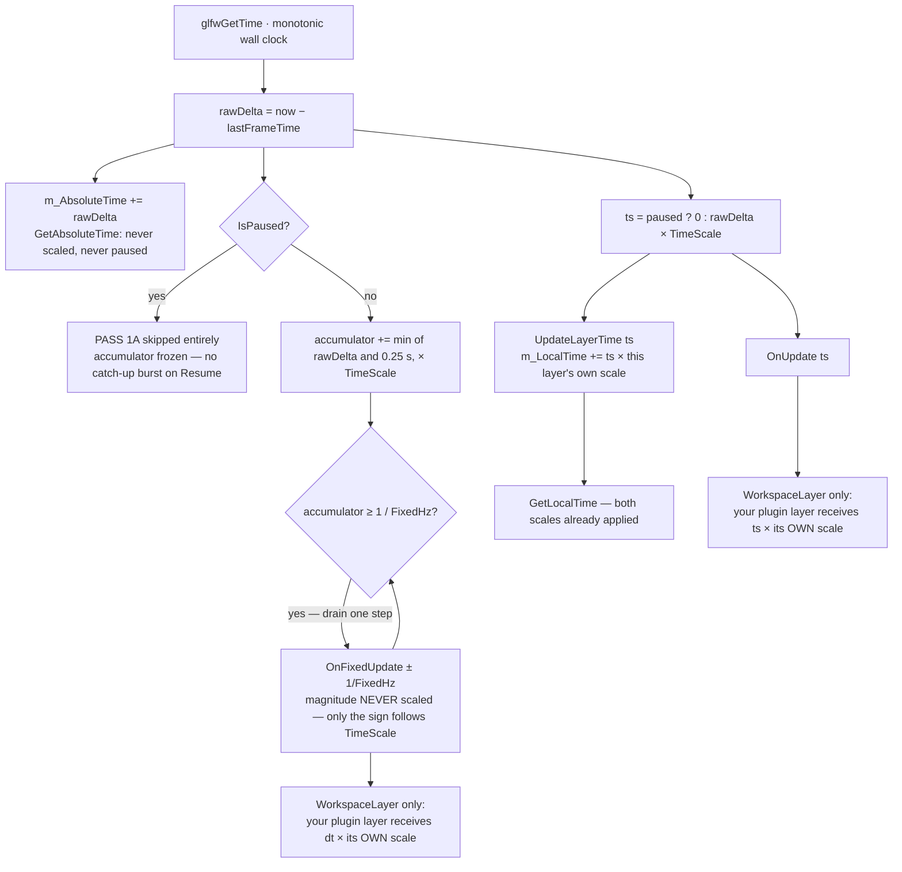

# Time & Ticks — Guide

**What this covers:** `Timestep`; the four clocks the engine keeps; the global time scale; `Pause()`
versus `SetTimeScale(0)`; per-layer local time; and the fixed-versus-variable dual-rate model that
physics and every deterministic simulation depend on.
**Source of truth:** `Cosmic/src/core/Timestep.h`, `core/Application.{h,cpp}` (`RenderSingleFrame`),
`core/Layer.h`, `layers/WorkspaceLayer.cpp`, `layers/PlayerLayer.cpp`
**API Reference:** [../reference/core.md](../reference/core.md) ·
[../reference/physics.md](../reference/physics.md) · **How it works:**
[../systems/core-runtime.md](../systems/core-runtime.md)
**Configuration:** both — the time model is identical in the 3D and 2D engine builds.

Cosmic runs **two update rates in the same frame**. A variable-rate pass tracks the display, and a
fixed-rate pass advances simulation in constant-size steps. On top of that sit a global speed
control, a first-class pause, and a per-layer clock. All of it is worth ten minutes now, because
every "my physics explodes at 144 Hz" and "my animation won't pause" bug lives here.

---

## Quick start

```cpp
class MyLayer : public Cosmic::Layer
{
public:
    MyLayer() : Cosmic::Layer("MyLayer") {}

    void OnUpdate(float ts) override            // variable rate — once per frame
    {
        m_Camera.Update(ts);                    // ts is seconds since the last frame
        m_Material->Set("u_Time", GetLocalTime());   // pre-scaled by every scale that applies
        DrawEverything();                       // yes: drawing happens in OnUpdate
    }

    void OnFixedUpdate(float dt) override       // fixed rate — 0..15 times per frame
    {
        m_Velocity += kGravity * dt;            // dt is EXACTLY 1/60 s by default
        m_Position += m_Velocity * dt;
    }
};
```

```cpp
// Global controls, from anywhere.
auto& app = Cosmic::Application::Get();
app.SetTimeScale(0.25f);        // slow motion
app.TogglePause();              // freeze the simulation; the UI stays live
app.SetFixedTimestepHz(120.0f); // finer physics steps
float uptime = app.GetAbsoluteTime();   // wall clock, never scaled, never paused
```

---

## The four clocks

Keeping these straight is most of the chapter:

| Clock | Where from | Scaled by | Pauses? | Rewinds? | Use it for |
| --- | --- | --- | --- | --- | --- |
| `GetAbsoluteTime()` | `Application` | nothing | **no** | no | profiling, session length, a live clock on a pause screen |
| `ts` in `OnUpdate(float ts)` | the frame | global scale (+ the layer's own, for a plugin layer) | yes — becomes `0` | yes — goes negative | movement, cameras, anything per-frame |
| `dt` in `OnFixedUpdate(float dt)` | the accumulator | **nothing** — the magnitude is constant | the pass is **skipped** | see [rewind](#rewind-and-the-accumulator-debt) | physics, integrators, control loops |
| `GetLocalTime()` | each `Layer` | global scale **×** that layer's scale | yes — stops advancing | yes | shader `u_Time`, particle age, any accumulated value |

The one people get wrong is `dt`. **The fixed delta's magnitude is never scaled.** `SetTimeScale(0.5f)`
does not halve `dt`; it halves how *often* the fixed pass fires. That is deliberate — a fixed-step
simulator (Jolt included) is only stable when every step is the same size.

### DG-10 — the time waterfall



---

## `Timestep`

`Timestep` is a one-member wrapper around a `float` of **seconds**, defined in `core/Timestep.h`. It
exists to stop seconds/milliseconds confusion at the boundary:

```cpp
Cosmic::Timestep step = 0.016f;
float s  = step.GetSeconds();        // 0.016
float ms = step.GetMilliseconds();   // 16.0
float f  = step;                     // implicit conversion — usable as a plain float
```

You will rarely name the type. Every `Layer` hook takes a plain `float` (`OnUpdate(float)`,
`OnFixedUpdate(float)`), and `Application` converts internally. **The unit is always seconds** — a
velocity in m/s times `ts` gives metres, with no conversion.

---

## One frame's two passes

`Application::RenderSingleFrame` runs, in order:

**Pass 1A — fixed.** Skipped entirely while paused, and skipped if you called
`UseFixedTimeStep(false)`. Otherwise:

```
frameTime    = min(rawDelta, 0.25)          // spiral-of-death clamp
accumulator += frameTime × TimeScale
while (accumulator >= 1/FixedHz)
    every layer: OnFixedUpdate(±1/FixedHz)
    accumulator -= 1/FixedHz
```

The 0.25 s clamp is applied to the **frame time**, before it enters the accumulator. At the default
60 Hz that caps a single frame at 15 fixed steps (plus at most one carried over from the previous
frame's residue), so a 2-second hitch — a shader compile, a scene load — costs you simulated time
rather than a freeze while physics catches up.

**Pass 1B — variable.** For every layer: `UpdateLayerTime(ts)` first, then `OnUpdate(ts)`. Because
the local clock is advanced *before* your hook, `GetLocalTime()` inside `OnUpdate` already includes
the current frame.

**In Cosmic, `OnUpdate` is also the render pass.** World drawing happens there — which is why pause
runs this pass with `ts = 0` instead of skipping it. Skipping would blank the screen.

**Pass 2 — ImGui**, then `SwapBuffers`. UI never freezes, at any scale, paused or not.

`Layer::OnRender()` is declared but never called by anything. Do not put drawing there.

---

## Fixed versus variable

| | `OnUpdate(float ts)` | `OnFixedUpdate(float dt)` |
| --- | --- | --- |
| **Rate** | once per frame — display-driven, variable | `GetFixedTimestepHz()`, default **60 Hz** |
| **Calls per frame** | exactly 1 | **0 to 15** (0 while paused or when the frame was short) |
| **`dt` value** | `rawDelta × TimeScale` (`0` while paused) | exactly `±1 / FixedHz` — magnitude never scaled |
| **Deterministic?** | no | yes, given the same step count |
| **Drawing** | **yes — this is the render pass** | **never** |
| **Shader uniforms** | yes | no — GPU state does not belong here |
| **Use for** | cameras, animation, interpolation, UI-driven logic, all rendering | physics, integrators, control loops, serial polling, character movement |
| **Anti-pattern** | collision maths that changes behaviour at 144 Hz | sprite lerps and camera smoothing — they visibly stutter at 60 Hz |

The rule that follows from the "calls per frame" row: **anything you draw from `OnFixedUpdate` will
be drawn a variable number of times per frame, including zero.** That is the actual mechanism behind
"my debug lines flicker".

Cosmic's own tick order inside the fixed pass is the contract physics depends on — scripts, then the
physics step, then navigation, then contact callbacks:

```cpp
// PlayerLayer::OnFixedUpdate — the reference implementation
m_Scripts.FixedTick(fixedDt);                       // 1. script OnFixedUpdate
m_TrackedScene->OnPhysicsStep(fixedDt);             // 2. PhysicsWorld::Step
m_TrackedScene->OnNavStep(fixedDt);                 // 3. crowd steering (3D builds)
m_TrackedScene->DispatchPhysicsEvents(m_Scripts);   // 4. contact callbacks
```

Note there is no pause check there: `Application` skips the whole fixed pass while paused, so the
simulation freezes and the scene keeps drawing, for free.

### Change the fixed rate

```cpp
auto& app = Cosmic::Application::Get();
app.SetFixedTimestepHz(120.0f);         // clamped to [1, 1000]; a clamp logs a warning
float hz = app.GetFixedTimestepHz();
app.UseFixedTimeStep(false);            // disable the fixed pass entirely
```

The rate is sampled once per frame, so a change mid-frame can never tear the accumulator loop; it
takes effect on the next frame. `PlayerLayer` reads `fixed_dt_hz` from `project://project.cproj` and
applies it on attach — set it there rather than in code for a shipped app.

> **Raising the rate ticks *every* layer faster, not just yours.** For a high-rate control loop
> (a 400 Hz flight controller, say) prefer substepping inside your own `OnFixedUpdate`:
> `for (int i = 0; i < 8; ++i) m_Controller.Step(dt / 8.0f);`. `Projects/ViperSim` does exactly this.

There is no getter for the on/off flag — track it yourself if you toggle it.

---

## Physics is the load-bearing consumer

The fixed pass exists for physics. `PhysicsWorld::Step` is called **exactly once per accumulated
fixed step**, from inside `ScenePhysics::Step`, and the rest of the physics API is specified against
that ordering — kinematic targets are pushed before the step, contact events are drained after it,
and `CharacterController::Tick` runs after `Step` in the same step.

Two consequences for your code:

- **Never call physics from `OnUpdate`.** A variable-rate `Step` produces different results at
  different frame rates, and `MoveKinematic`'s derived velocity is computed from the `dt` you pass —
  hand it anything other than the step the world is about to take and the velocity is wrong.
- **Raising `SetFixedTimestepHz` changes physics behaviour**, not just its precision. Tune it
  deliberately, and re-test anything tuned against the old rate.

Full per-call detail, including the tick-order contract, is in
[`../reference/physics.md`](../reference/physics.md) — start at its opening rule box and
[`PhysicsWorld::Step`](../reference/physics.md#physicsworldstep). The task-oriented half ("make a
character climb stairs") is [`physics.md`](physics.md).

---

## Change the global speed

```cpp
auto& app = Cosmic::Application::Get();
app.SetTimeScale(1.0f);     // normal
app.SetTimeScale(0.25f);    // quarter speed — a bullet-time effect
app.SetTimeScale(0.0f);     // soft freeze (but prefer Pause(), below)
app.SetTimeScale(-1.0f);    // "rewind" — read the caveat first
float scale = app.GetTimeScale();
```

The scale is not clamped and not validated. What it actually reaches:

- **`ts` in `OnUpdate`** — multiplied directly. Halve the scale, halve every per-frame delta.
- **The fixed accumulator** — multiplied, so the fixed pass fires proportionally *less often*. `dt`
  itself is unchanged.
- **`GetLocalTime()`** — via `ts`, so shader time and particle age follow automatically.
- **`GetAbsoluteTime()`** — never. It is raw wall clock, by design.

### Rewind and the accumulator debt

A negative `TimeScale` is **not** a working rewind for fixed-step simulation, and this is worth
knowing before you build a feature on it.

`Application` computes a signed fixed delta (`m_TimeScale >= 0 ? +fixedDt : -fixedDt`) so that layers
*could* receive a negative `dt`. But the drain loop is `while (accumulator >= fixedDt)`, and a
negative scale drives the accumulator **downward**. The condition never becomes true, so:

- **`OnFixedUpdate` does not run at all while `TimeScale < 0`.** The negative-`dt` branch is
  unreachable in the current code.
- The accumulator keeps going more negative for as long as you rewind, and nothing resets it. After
  five seconds at `-1.0`, returning to `+1.0` means roughly **five seconds of forward time before the
  first fixed step fires again**.

The variable pass *does* run with a negative `ts`, and `GetLocalTime()` genuinely runs backwards — so
rewind works fine for visuals, shaders and anything you integrate yourself in `OnUpdate`. If you need
a rewindable simulation, keep it in `OnUpdate` with your own integrator, or record and replay states
rather than driving physics backwards.

For an ordinary freeze, use `Pause()` — it leaves the accumulator alone and has none of this
behaviour.

---

## Pause versus `TimeScale(0)`

They are **orthogonal**, and the distinction is subtle enough to be worth a table. `Pause()` is the
one you want for a user-facing pause:

| | `Application::Pause()` | `SetTimeScale(0.0f)` |
| --- | --- | --- |
| Fixed pass (`OnFixedUpdate`) | **skipped entirely**, accumulator frozen | never fires either — the accumulator stops growing |
| On resume | **no catch-up burst** — the accumulator is exactly where it was | same, but you must restore the scale by hand |
| Variable pass (`OnUpdate`) | runs with `ts = 0` | runs with `ts = 0` |
| Rendering | continues — the scene stays on screen, frozen | continues |
| ImGui + present | fully interactive; pause menus animate and click | fully interactive |
| `GetAbsoluteTime()` | keeps advancing | keeps advancing |
| `GetLocalTime()` | frozen | frozen |
| The user's chosen speed | **preserved** — `Resume()` restores it exactly | **destroyed** — you must remember the old value yourself |
| Queryable | `IsPaused()` | only as `GetTimeScale() == 0`, which is ambiguous |

```cpp
auto& app = Cosmic::Application::Get();
app.Pause();
app.Resume();          // never touches TimeScale
app.TogglePause();
if (app.IsPaused()) { /* draw the pause overlay */ }
```

Both can be active at once; `Pause()` wins, because it forces `ts = 0` regardless of scale.

Two behaviours that follow, and are usually what people want without realizing:

- **Effects driven by `GetAbsoluteTime()` keep moving while paused** — a spinning loading icon or a
  session clock on the pause screen. Effects driven by `GetLocalTime()` freeze. Pick per effect.
- **Scripts stop receiving events while paused.** `PlayerLayer::OnEvent` skips
  `ScriptHost::DispatchEvent` when `IsPaused()`, so your gameplay scripts go quiet while your pause
  UI stays live.

**The engine binds no pause hotkey.** Bind your own:

```cpp
bool MyLayer::OnKeyPressed(Cosmic::KeyPressedEvent& e)
{
    if (e.GetKeyCode() == CS_KEY_ESCAPE && e.GetRepeatCount() == 0)
    {
        Cosmic::Application::Get().TogglePause();
        return true;
    }
    return false;
}
```

Separately, `SetPauseOnMinimize(bool)` controls whether *all* passes are skipped while the window is
minimized. **It defaults to `false`** — the engine keeps running in the tray, which is what a
simulation, a telemetry tool or a headless server wants. Set it `true` for game-like behaviour.

---

## Per-layer local time

Every `Layer` carries its own clock and its own scale:

```cpp
float t = GetLocalTime();     // accumulated, both scales applied
SetLocalTime(0.0f);           // reset — e.g. on level restart
float s = GetTimeScale();     // this layer's own multiplier (default 1.0)
SetTimeScale(0.5f);           // run this layer at half speed
```

The engine advances it for you, once per frame, before `OnUpdate`:

```
m_LocalTime += ts × m_LocalTimeScale
```

> **Call these unqualified from inside your derived class** — `GetLocalTime()`, not
> `Cosmic::Layer::GetLocalTime()`. They are instance methods; the qualified form is a static scope
> resolution and does not mean what it looks like.

### What `ts` and `dt` actually contain — and where it differs

This is the one place the model is genuinely non-uniform, because a **plugin layer is not on the
engine's `LayerStack`** — `WorkspaceLayer` hosts it and forwards the hooks, applying the plugin
layer's own scale on the way through (see
[`project-anatomy.md`](project-anatomy.md#the-load-sequence)):

| Your layer is… | `ts` in `OnUpdate` | `dt` in `OnFixedUpdate` | `GetLocalTime()` |
| --- | --- | --- | --- |
| **on the engine `LayerStack`** (engine-internal layers) | `rawDelta × globalScale` — **global only** | `±1/FixedHz` — unscaled | `× globalScale × layerScale` |
| **your plugin layer** (returned from `CreatePluginLayer`) | `rawDelta × globalScale × thisLayerScale` | `±1/FixedHz × thisLayerScale` | `× globalScale × layerScale` |
| **a child layer you own and drive** | whatever your root passes it | whatever your root passes it | only if your root calls `UpdateLayerTime` |

Practical readings:

- **In a plugin layer, do not multiply `ts` by `GetTimeScale()` again** — the shell already did.
  Doing it twice squares the scale, which looks fine at `1.0` and wrong at everything else.
- **In a plugin layer, `dt` really can be `0`**, if you set the layer's own scale to zero. That is
  the one case where guarding `if (dt == 0.0f) return;` in `OnFixedUpdate` does something.
- **For a layer on the engine stack, that guard is dead code**: `dt` is always exactly `±1/FixedHz`,
  and while paused the hook is not called at all.
- **Apply scales for your children in your root layer**, once, so each child gets a pre-scaled delta:

```cpp
void MyRootLayer::OnUpdate(float ts)
{
    auto& active = m_Modes[m_Active];
    active->UpdateLayerTime(ts);                       // drives the child's GetLocalTime()
    active->OnUpdate(ts * active->GetTimeScale());     // child sees global × its own scale
}
```

Do that once and every child gets a working slow-motion slider without re-applying anything.

---

## Feed time to shaders

```cpp
void MyLayer::OnUpdate(float ts)
{
    if (m_Material)
        m_Material->Set("u_Time", GetLocalTime());

    Cosmic::Renderer2D::BeginScene(m_Camera.GetCamera());
    Cosmic::Renderer2D::DrawQuad({ 0.0f, 0.0f, 0.0f }, { 2.0f, 2.0f }, m_Material);
    Cosmic::Renderer2D::EndScene();
}
```

`GetLocalTime()` is the right source for almost every animated uniform: it is already multiplied by
the global scale *and* your layer's scale, so a shader written against it responds to pause, slow
motion and rewind with no extra code.

> **Nothing sets `u_Time` for you.** The shader preprocessor will *declare* `u_Time` (and `#define
> iTime u_Time`) for Shadertoy-style sources, and several engine subsystems — `Water`,
> `EnvironmentMap`, `PostProcessStack`, the Launcher background — set it on their own shaders. But
> there is no global per-frame upload for client materials. If your shader samples `u_Time` and
> nothing moves, that is why. See [`materials-and-shaders.md`](materials-and-shaders.md) for the
> uniform contract.

Use `GetAbsoluteTime()` instead only when the effect must *not* freeze — a busy spinner over a paused
scene, for instance.

---

## Common patterns

**Freeze gameplay, keep the UI.** `Pause()`. Nothing else needed: the fixed pass stops, the scene
keeps drawing at `ts = 0`, ImGui stays interactive, and scripts stop receiving events.

**Slow motion with a restore.** Use `SetTimeScale` for the effect and `Pause()` for pausing, and the
two never fight — `Resume()` will not clobber your slow-motion value.

**Frame-rate-independent smoothing.** `value += (target - value) * (1 - std::exp(-rate * ts));` — the
naive `value += (target - value) * 0.1f` is silently tied to frame rate.

**A high-rate inner loop.** Substep inside your own `OnFixedUpdate` rather than raising the engine
rate; only your layer pays.

**Interpolate between fixed steps.** The engine exposes no leftover-accumulator value, so if you need
sub-step visual smoothing, keep previous and current simulation states yourself and lerp in
`OnUpdate`.

**Measure something.** `GetAbsoluteTime()`. It is the only clock that will not lie to you when
someone pauses or scrubs the scale.

---

## Pitfalls

**"My physics behaves differently at 144 Hz."** It is running in `OnUpdate`. Move it to
`OnFixedUpdate`, where the step is constant.

**"My camera lerp stutters."** It is in `OnFixedUpdate`, updating 60 times a second while the display
runs faster. Move visual smoothing to `OnUpdate`.

**"Draw calls from `OnFixedUpdate` flicker or double up."** The pass runs a variable number of times
per frame — zero to fifteen. Draw only from `OnUpdate`.

**"`SetTimeScale(0.5f)` didn't halve my physics `dt`."** It isn't supposed to. The magnitude of `dt`
is constant; the scale changes how often the pass fires.

**"Rewind does nothing to my physics."** Correct, and expected: with `TimeScale < 0` the accumulator
runs backwards and the fixed pass never fires. See
[the accumulator debt](#rewind-and-the-accumulator-debt).

**"After rewinding, physics took seconds to restart."** Same cause — the accumulator went deeply
negative and has to climb back. Use `Pause()` and your own state history instead.

**"Everything runs at a quarter speed when I set 0.5."** You multiplied `ts` by `GetTimeScale()`
inside a plugin layer. `WorkspaceLayer` already applied it; you squared it.

**"`if (dt == 0.0f) return;` in `OnFixedUpdate` never triggers."** For a layer on the engine stack it
can't — `dt` is always `±1/FixedHz`, and while paused the hook is not called. It fires only for a
plugin layer whose own `SetTimeScale(0)` you set.

**"My shader's `u_Time` never advances."** Nothing feeds it automatically. Set it yourself, from
`GetLocalTime()`.

**"Manual `m_Time += ts` doesn't respect my layer's scale."** `ts` carries the global scale (and, for
a plugin layer, its own) — but a hand-rolled accumulator misses whatever the engine would have
applied in `UpdateLayerTime`. Use `GetLocalTime()`.

**"The app keeps simulating while minimized."** By design. `SetPauseOnMinimize` defaults to `false`.
Pass `true` for game-like behaviour. The Safe Zone runs either way, so queued transitions are never
stranded.

**"A long hitch skipped simulated time."** The 0.25 s clamp did that on purpose, to avoid a
catch-up avalanche after a stall. Nothing to fix.

**"Milliseconds where I expected seconds."** Every `ts`/`dt` in the engine is **seconds**. Use
`Timestep::GetMilliseconds()` — or `ts * 1000.0f` — only for display.

---

## See also

- [`project-anatomy.md`](project-anatomy.md) — the frame loop end to end, the Safe Zone, and why
  your plugin layer is hosted rather than stacked.
- [`events-and-input.md`](events-and-input.md) — which tick to poll input from, and the event pass
  that runs before both of these.
- [`physics.md`](physics.md) · [`../reference/physics.md`](../reference/physics.md) — the fixed-step
  contract's most demanding consumer.
- [`scripting.md`](scripting.md) — `ScriptableEntity::OnUpdate` / `OnFixedUpdate` follow the same
  two-rate model.
- [`sim-math-toolkit.md`](sim-math-toolkit.md) — integrators, `FixedSubstepper`, and determinism.
- [`materials-and-shaders.md`](materials-and-shaders.md) — the uniform contract behind `u_Time`.
- [`../reference/core.md`](../reference/core.md) — formal signatures for `Application`'s time API,
  `Layer` and `Timestep`.
- [`../systems/core-runtime.md`](../systems/core-runtime.md) — the accumulator's internals, and
  [`../design/responsive-rendering-and-pause.md`](../design/responsive-rendering-and-pause.md) for
  the pause design record.
