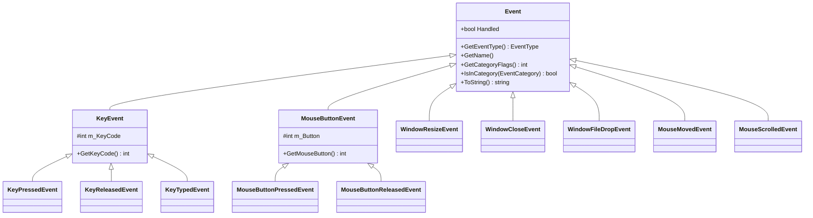

# API Reference — Events & Input

> **STATUS: WRITTEN** — work order **D7** (2026-07-26) in
> [`docs/plans/12-documentation-plan.md`](../plans/12-documentation-plan.md).
> Entry format: [reference/README.md → Entry format](README.md#entry-format-mandatory--copy-this-shape).

**Scope (headers are the truth):** `Cosmic/src/events/Event.h`, `events/ApplicationEvent.h`,
`events/KeyEvent.h`, `events/MouseEvent.h`, `core/Input.h`, `codes/KeyCodes.h`,
`codes/MouseButtonCodes.h`, `codes/GamepadCodes.h`.

**Read first:** [`../guide/events-and-input.md`](../guide/events-and-input.md) — the task-oriented
half ("react to a key", "walk with a stick", "handle a file drop"), the propagation walkthrough, and
diagram **[DG-4](../guide/events-and-input.md#dg-4--event-propagation)**. This chapter is the
per-call lookup behind it: verbatim signature, exact behaviour, failure mode, pitfalls. It does not
repeat the guide's idiom, and it never restates DG-4.
**How it works:** [`../systems/events-input.md`](../systems/events-input.md).

**Configuration:** all eight headers are included by `Cosmic.h` **unfenced** (`Cosmic.h:20`, `:27-30`,
`:152-154`), so every symbol below exists in **both** the 3D and the 2D engine builds. Nothing here
is `COSMIC_2D_ONLY`-sensitive. See [README §1.6](../../README.md#16-the-two-engine-configurations).

**DLL-boundary note.** Only two classes in this chapter are `COSMIC_API`-exported: `Event`
(`Event.h:86`) and `Input` (`Input.h:40`). `EventDispatcher` and all nine concrete event classes are
**header-only** — every member is defined in-class, so a project DLL instantiates them itself and
needs no export. That is why you can construct and dispatch a `WindowFileDropEvent` inside a plugin
without linking anything.

---

## Contents

- [Enums and macros](#enums-and-macros) — [`EventType`](#eventtype) · [`EventCategory`](#eventcategory) · [`EVENT_CLASS_TYPE`](#event_class_type) · [`EVENT_CLASS_CATEGORY`](#event_class_category) · [`CS_BIND_EVENT_FN`](#cs_bind_event_fn)
- [`Event`](#event) — [`Handled`](#eventhandled) · [`GetEventType`](#eventgeteventtype) · [`GetName`](#eventgetname) · [`GetCategoryFlags`](#eventgetcategoryflags) · [`IsInCategory`](#eventisincategory) · [`ToString`](#eventtostring) · [`operator<<`](#operator-eventh)
- [`EventDispatcher`](#eventdispatcher) — [ctor](#eventdispatchereventdispatcher) · [`Dispatch`](#eventdispatcherdispatch)
- [Application events](#application-events) — [`WindowResizeEvent`](#windowresizeevent) · [`WindowCloseEvent`](#windowcloseevent) · [`WindowFileDropEvent`](#windowfiledropevent)
- [Key events](#key-events) — [`KeyEvent`](#keyevent) · [`KeyPressedEvent`](#keypressedevent) · [`KeyReleasedEvent`](#keyreleasedevent) · [`KeyTypedEvent`](#keytypedevent)
- [Mouse events](#mouse-events) — [`MouseMovedEvent`](#mousemovedevent) · [`MouseScrolledEvent`](#mousescrolledevent) · [`MouseButtonEvent`](#mousebuttonevent) · [`MouseButtonPressedEvent`](#mousebuttonpressedevent) · [`MouseButtonReleasedEvent`](#mousebuttonreleasedevent)
- [Who produces and who consumes each event](#who-produces-and-who-consumes-each-event)
- [`Input`](#input) — [keyboard](#inputiskeypressed) · [mouse](#inputismousebuttonpressed) · [the two mouse spaces](#the-two-mouse-coordinate-spaces) · [gamepad](#inputisgamepadconnected)
- [Code tables](#code-tables) — [`CS_KEY_*`](#cs_key_--keycodesh) · [`CS_MOUSE_BUTTON_*`](#cs_mouse_button_--mousebuttoncodesh) · [`CS_GAMEPAD_*`](#cs_gamepad_--gamepadcodesh)
- [The raw-GLFW seam](#the-raw-glfw-seam-fullscreen-hotkey-override)

### The type hierarchy

*(Chapter-local inventory diagram — it is **not** a `DG-n` diagram from
[doc 12 §4](../plans/12-documentation-plan.md#4-diagram-inventory-build-exactly-these-ids-are-referenced-by-skeletons),
and it does not duplicate DG-4, which is a propagation flowchart.)*



`KeyEvent` and `MouseButtonEvent` have **protected constructors** — they are shared-state bases, not
things you instantiate. Everything else is concrete.

---

## Enums and macros

### `EventType`

```cpp
enum class EventType
{
    None = 0,
    WindowClose, WindowResize, WindowFocus, WindowLostFocus, WindowMoved, WindowFileDrop,
    KeyPressed, KeyReleased, KeyTyped,
    MouseButtonPressed, MouseButtonReleased, MouseMoved, MouseScrolled
};
```

**What it does** — the runtime tag every event carries.
[`EventDispatcher::Dispatch`](#eventdispatcherdispatch) compares `GetEventType()` against
`T::GetStaticType()` to decide whether your handler runs.

**Why you'd use it** — almost never directly. Reach for it only when you need a `switch` over many
types in one place (a logger, a recorder, an event tap) where chained `Dispatch` calls would be
noisier. For everything else use `Dispatch<T>`.

**Example**

```cpp
void MyLayer::OnEvent(Cosmic::Event& e)
{
    if (e.GetEventType() == Cosmic::EventType::MouseScrolled)
        CS_TRACE("scroll: {0}", e.ToString());
}
```

**Notes & pitfalls**
- **Three enumerators have no class and are never produced:** `WindowFocus`, `WindowLostFocus`,
  `WindowMoved`. No event class returns them, and no GLFW callback in `Window.cpp` constructs one.
  They are placeholders. A `switch` case for them is dead code; a handler waiting on them never
  fires.
- It is an `enum class`, so it needs the `EventType::` qualification and never implicitly converts
  to `int`.

**See also** — [`Event::GetEventType`](#eventgeteventtype),
[`EVENT_CLASS_TYPE`](#event_class_type)

### `EventCategory`

```cpp
enum EventCategory
{
    None = 0,
    EventCategoryApplication = BIT(0),
    EventCategoryInput = BIT(1),
    EventCategoryKeyboard = BIT(2),
    EventCategoryMouse = BIT(3),
    EventCategoryMouseButton = BIT(4)
};
```

**What it does** — the bitmask family tags. `BIT(x)` is `(1u << (x))` from `core/Core.h:92`. One
event belongs to several categories at once, which is what makes "block all input" possible without
naming types.

**Why you'd use it** — to gate or swallow a whole family: a cutscene that eats input but must still
see resizes, a modal that eats mouse but not keyboard. If you only care about one concrete type, use
`Dispatch<T>` instead.

| Constant | Expression | Value | Set on |
| --- | --- | --- | --- |
| `None` | — | 0 | nothing |
| `EventCategoryApplication` | `BIT(0)` | 1 | `WindowResizeEvent`, `WindowCloseEvent`, `WindowFileDropEvent` |
| `EventCategoryInput` | `BIT(1)` | 2 | every key and mouse event |
| `EventCategoryKeyboard` | `BIT(2)` | 4 | `KeyPressedEvent`, `KeyReleasedEvent`, `KeyTypedEvent` |
| `EventCategoryMouse` | `BIT(3)` | 8 | `MouseMovedEvent`, `MouseScrolledEvent`, both button events |
| `EventCategoryMouseButton` | `BIT(4)` | 16 | `MouseButtonPressedEvent`, `MouseButtonReleasedEvent` only |

Resolved per class:

| Class | `GetCategoryFlags()` | Value |
| --- | --- | --- |
| `WindowResizeEvent`, `WindowCloseEvent`, `WindowFileDropEvent` | `Application` | 1 |
| `KeyPressedEvent`, `KeyReleasedEvent`, `KeyTypedEvent` | `Keyboard \| Input` | 6 |
| `MouseMovedEvent`, `MouseScrolledEvent` | `Mouse \| Input` | 10 |
| `MouseButtonPressedEvent`, `MouseButtonReleasedEvent` | `Mouse \| Input \| MouseButton` | 26 |

**Example**

```cpp
void MyLayer::OnEvent(Cosmic::Event& e)
{
    if (m_CutscenePlaying && e.IsInCategory(Cosmic::EventCategoryInput))
    {
        e.Handled = true;      // window events still get through
        return;
    }
}
```

**Notes & pitfalls**
- **Application events are not input events.** `EventCategoryInput` is set on key and mouse events
  only. Blocking `EventCategoryInput` never blocks a resize, a close or a file drop — and blocking
  `EventCategoryApplication` silently kills your file-drop handling.
- It is an **unscoped** enum, but the constants are still `EventCategory`-typed. `a | b` promotes to
  `int`, and `int` does not implicitly convert back to an enum — so
  `e.IsInCategory(EventCategoryMouse | EventCategoryKeyboard)` **does not compile**. Either call
  `IsInCategory` twice, or cast:
  `e.IsInCategory(static_cast<Cosmic::EventCategory>(Cosmic::EventCategoryMouse | Cosmic::EventCategoryKeyboard))`.
- `None = 0` collides by name with `EventType::None`, but they live in different scopes
  (`EventType` is an `enum class`), so there is no ambiguity in practice.

**See also** — [`Event::IsInCategory`](#eventisincategory),
[`Event::GetCategoryFlags`](#eventgetcategoryflags)

### `EVENT_CLASS_TYPE`

```cpp
#define EVENT_CLASS_TYPE(type) static EventType GetStaticType() { return EventType::type; }\
                            virtual EventType GetEventType() const override { return GetStaticType(); }\
                            virtual const char* GetName() const override { return #type; }
```

**What it does** — expands to the three type-identity members every concrete event needs:
`GetStaticType()` (for the dispatcher, no instance required), `GetEventType()` (the runtime tag) and
`GetName()` (the stringified enumerator).

**Why you'd use it** — only if you define your own event class. Nothing in the engine dispatches a
client-defined event for you, but a project that owns a layer tree can build one and route it
through its own `OnEvent` chain.

**Example**

```cpp
class SaveRequestedEvent : public Cosmic::Event
{
public:
    EVENT_CLASS_TYPE(None)                                    // no free enumerator exists — see pitfalls
    EVENT_CLASS_CATEGORY(Cosmic::EventCategoryApplication)
};
```

**Notes & pitfalls**
- The macro takes a **bare enumerator name**, not a qualified one: `EVENT_CLASS_TYPE(KeyPressed)`,
  never `EVENT_CLASS_TYPE(EventType::KeyPressed)` — it pastes `EventType::` on for you and
  stringifies the argument for `GetName()`.
- `EventType` is a closed engine enum. A custom event has to reuse an existing enumerator (typically
  `None`) or you must add one to `Event.h`, which makes it engine code. If two custom types both use
  `None`, `Dispatch<T>` cannot tell them apart and will invoke the wrong handler. Custom events are
  workable but unpoliced — prefer a plain callback or the signal bus for project-local messaging.
- Defined **outside** the `Cosmic` namespace in effect: macros ignore namespaces, so
  `EVENT_CLASS_TYPE` is usable unqualified anywhere `Event.h` has been included.

### `EVENT_CLASS_CATEGORY`

```cpp
#define EVENT_CLASS_CATEGORY(category) virtual int GetCategoryFlags() const override { return category; }
```

**What it does** — implements `GetCategoryFlags()` with a constant expression.

**Why you'd use it** — same as above: defining a custom event. The argument may be an OR of several
[`EventCategory`](#eventcategory) values because the return type is `int`.

**Example**

```cpp
class MyInputEvent : public Cosmic::Event
{
public:
    EVENT_CLASS_TYPE(None)
    EVENT_CLASS_CATEGORY(Cosmic::EventCategoryInput | Cosmic::EventCategoryKeyboard)
};
```

**Notes & pitfalls**
- Returns `int`, not `EventCategory` — that asymmetry with
  [`IsInCategory`](#eventisincategory)'s `EventCategory` parameter is why OR-ing works here and not
  there.

### `CS_BIND_EVENT_FN`

```cpp
#define CS_BIND_EVENT_FN(fn) std::bind(&fn, this, std::placeholders::_1)
```

*Declared in `Cosmic/src/core/Core.h:100` — the header belongs to [core.md](core.md), the macro is
documented here because its only use is `Dispatch`.*

**What it does** — binds a member function of `this` as a one-argument callable for
[`Dispatch`](#eventdispatcherdispatch).

**Why you'd use it** — legacy compatibility only. Core.h's own comment says to prefer a lambda, and
so does this chapter: a lambda reads better, has no `std::bind` overhead, and gives you a
correctly-typed parameter instead of a placeholder.

**Example**

```cpp
// Legacy form — still compiles, still works:
dispatcher.Dispatch<Cosmic::KeyPressedEvent>(CS_BIND_EVENT_FN(MyLayer::OnKeyPressed));

// Preferred:
dispatcher.Dispatch<Cosmic::KeyPressedEvent>(
    [this](Cosmic::KeyPressedEvent& e) { return OnKeyPressed(e); });
```

**Notes & pitfalls**
- Requires `<functional>`; `Core.h` does not include it, so the macro compiles only where something
  else in the translation unit already pulled it in. Another reason to use a lambda.
- Captures `this` implicitly by name. Using it outside a member function does not compile.

---

## Event

```cpp
class COSMIC_API Event
```

*Declared in `Cosmic/src/events/Event.h:86`.*

The abstract base for every signal in the engine. It carries exactly one piece of mutable state
(`Handled`), three pure virtuals that concrete classes implement through
[`EVENT_CLASS_TYPE`](#event_class_type) / [`EVENT_CLASS_CATEGORY`](#event_class_category), and two
conveniences.

Events are **stack-allocated in the GLFW callback and destroyed when it returns** — see
`Window.cpp:391-480`. You get a reference for the duration of the call chain and nothing longer. Copy
anything you intend to keep (this matters most for
[`WindowFileDropEvent::GetPaths`](#windowfiledropeventgetpaths)).

There is no `virtual ~Event()`. Events are never owned through a base pointer anywhere in the tree,
so this is safe as used — but do **not** `new Event`-derived objects and delete them through
`Event*`.

### `Event::Handled`

```cpp
bool Handled = false;
```

**What it does** — the propagation flag. `Application::OnEvent` re-checks it at the top of every
`LayerStack` iteration (`Application.cpp:456`) and breaks out the moment it is `true`.
`WorkspaceLayer::OnEvent` early-returns on it (`WorkspaceLayer.cpp:523`).

**Why you'd use it** — set it directly when you want to swallow a whole **category** in one place
(see the [`EventCategory` example](#eventcategory)). To consume a single **type**, return `true`
from your `Dispatch` handler instead — that is the same write, expressed where the type is known.

**Example**

```cpp
void MyLayer::OnEvent(Cosmic::Event& e)
{
    if (m_ModalOpen && e.IsInCategory(Cosmic::EventCategoryInput))
        e.Handled = true;
}
```

**Notes & pitfalls**
- It is a **plain public field**, so nothing stops you writing `e.Handled = false` to un-consume an
  event a previous layer claimed. The engine never does this, and neither should you — the layer
  below has no way to know it was resurrected. `Dispatch` and `ImGuiLayer` both only ever OR it to
  `true` (`Event.h:138-139`, `ImGuiLayer.cpp:155-156`).
- Setting it in a handler does **not** stop the rest of *your* `OnEvent` body — it is a flag, not a
  `return`. Chained `Dispatch` calls after it still run and still match.
- `Handled` has no effect on scripts: `ScriptHost::DispatchEvent` never reads it
  (`ScriptHost.cpp:207-215`).

### `Event::GetEventType`

```cpp
virtual EventType GetEventType() const = 0;
```

**What it does** — returns this instance's [`EventType`](#eventtype) tag.

**Why you'd use it** — for a `switch` over many types in one function, or to log/record a type
without downcasting. For "run my handler if this is a `KeyPressedEvent`", use
[`Dispatch`](#eventdispatcherdispatch), which does this comparison for you and hands you the
downcast reference.

**Example**

```cpp
if (e.GetEventType() == Cosmic::EventType::WindowFileDrop)
    m_PendingImport = true;
```

**Notes & pitfalls**
- Pure virtual, implemented by [`EVENT_CLASS_TYPE`](#event_class_type). Every concrete class in this
  chapter has it; the two abstract bases (`KeyEvent`, `MouseButtonEvent`) do not.

### `Event::GetName`

```cpp
virtual const char* GetName() const = 0;
```

**What it does** — returns the stringified type name (`"KeyPressed"`, `"WindowFileDrop"`, …) as a
static string literal.

**Why you'd use it** — logging and debug UI. It is the cheapest identification available: no
allocation, no formatting.

**Example**

```cpp
CS_TRACE("event: {0}", e.GetName());   // "event: MouseScrolled"
```

**Notes & pitfalls**
- The returned pointer is a literal produced by `#type` inside
  [`EVENT_CLASS_TYPE`](#event_class_type) — it has static storage duration and is safe to keep past
  the event's lifetime.
- The name is the **`EventType` enumerator**, not the class name: `MouseScrolledEvent::GetName()`
  returns `"MouseScrolled"`, without the `Event` suffix.

### `Event::GetCategoryFlags`

```cpp
virtual int GetCategoryFlags() const = 0;
```

**What it does** — returns the OR of this event's [`EventCategory`](#eventcategory) bits as an `int`.

**Why you'd use it** — rarely, directly. Reach for it when you want to test several categories at
once without the cast [`IsInCategory`](#eventisincategory) forces on you.

**Example**

```cpp
const int uiRelevant = Cosmic::EventCategoryMouse | Cosmic::EventCategoryKeyboard;
if (e.GetCategoryFlags() & uiRelevant)
    m_LastInteractionTime = Cosmic::Application::Get().GetAbsoluteTime();
```

**Notes & pitfalls**
- Pure virtual, implemented by [`EVENT_CLASS_CATEGORY`](#event_class_category).
- Returns `int`, so `&`/`|` work without casts — the opposite of `IsInCategory`.

### `Event::IsInCategory`

```cpp
inline bool IsInCategory(EventCategory category) const
{
    return GetCategoryFlags() & category;
}
```

**What it does** — bitwise-ANDs the event's flags with one category and returns the result as a
`bool`.

**Why you'd use it** — the readable form of a family test: "is this any kind of input?", "is this a
mouse *button* rather than a move?". It is the call the guide's cutscene/modal patterns are built
on.

**Example**

```cpp
if (e.IsInCategory(Cosmic::EventCategoryMouseButton))
    m_ClickCount++;       // presses AND releases — MouseButton is set on both
```

**Notes & pitfalls**
- **The parameter is `EventCategory`, so you cannot pass an OR.**
  `IsInCategory(EventCategoryMouse | EventCategoryKeyboard)` fails to compile: the OR yields `int`,
  and `int` does not implicitly convert to an unscoped enum type. Call it twice, cast explicitly, or
  use [`GetCategoryFlags`](#eventgetcategoryflags).
- It answers "does the event have **any** of these bits", not "all of them" — irrelevant for a
  single category, but a trap if you cast a multi-bit value in.
- Cannot fail and never allocates.

### `Event::ToString`

```cpp
virtual std::string ToString() const { return GetName(); }
```

**What it does** — a readable one-line description. The base implementation returns just the name;
every concrete class except `WindowCloseEvent` overrides it to append its payload.

**Why you'd use it** — debugging and trace logging. Use [`GetName`](#eventgetname) instead in a hot
path: `ToString` builds a `std::stringstream` and allocates on every call.

**Example**

```cpp
CS_TRACE("{0}", e.ToString());   // "KeyPressedEvent: 87 (0 repeats)"
```

Exact formats, copied from the overrides:

| Class | `ToString()` |
| --- | --- |
| `WindowResizeEvent` | `WindowResizeEvent: <w>, <h>` |
| `WindowCloseEvent` | `WindowClose` *(not overridden — the base returns `GetName()`)* |
| `WindowFileDropEvent` | `WindowFileDropEvent: <n> file(s) (<first>, …)` — the `, …` appears only when `n > 1`; the whole parenthesis is omitted when empty |
| `KeyPressedEvent` | `KeyPressedEvent: <code> (<repeat> repeats)` |
| `KeyReleasedEvent` | `KeyReleasedEvent: <code>` |
| `KeyTypedEvent` | `KeyTypedEvent: <codepoint>` |
| `MouseMovedEvent` | `MouseMovedEvent: <x>, <y>` |
| `MouseScrolledEvent` | `MouseScrolledEvent: <dx>, <dy>` |
| `MouseButtonPressedEvent` | `MouseButtonPressedEvent: <button>` |
| `MouseButtonReleasedEvent` | `MouseButtonReleasedEvent: <button>` |

**Notes & pitfalls**
- `WindowCloseEvent` is the odd one out: its string is `"WindowClose"` (the enumerator name), not
  `"WindowCloseEvent"`. Do not match on these strings.
- Floats print through `operator<<` with default precision, so `MouseMovedEvent: 640, 360` — not
  `640.000000`.
- `WindowFileDropEvent::ToString` embeds the **first** path only, however many were dropped.

### `operator<<` (`Event.h`)

```cpp
inline std::ostream& operator<<(std::ostream& os, const Event& e)
{
    return os << e.ToString();
}
```

**What it does** — stream insertion for any event, delegating to
[`ToString`](#eventtostring).

**Why you'd use it** — writing an event into an `std::ostream`-based sink. Cosmic's own logger is
spdlog/fmt-based, so the idiomatic call is `CS_TRACE("{0}", e.ToString())`, not this operator; it
exists for interop with plain C++ streams.

**Example**

```cpp
#include <sstream>
std::ostringstream os;
os << e;                       // "MouseScrolledEvent: 0, -1"
```

**Notes & pitfalls**
- `Event.h` includes only `<string>`. It does not include `<ostream>`, and it relies on `<string>`
  transitively declaring `std::ostream` and `operator<<(ostream&, const string&)`. That holds on
  MSVC (the only supported toolchain), but include `<sstream>`/`<ostream>` yourself before using it
  rather than depending on the transitive include.

---

## EventDispatcher

```cpp
class EventDispatcher
```

*Declared in `Cosmic/src/events/Event.h:117`.* Not `COSMIC_API` — it is a header-only template
helper, instantiated in whatever DLL uses it.

A three-line adapter that replaces a `switch` on [`GetEventType`](#eventgeteventtype). Construct one
per `OnEvent` call, on the stack, from the event reference you were handed; then chain one
[`Dispatch<T>`](#eventdispatcherdispatch) per type you care about. It holds an `Event&`, stores
nothing else, and has no lifetime of its own beyond the enclosing scope.

### `EventDispatcher::EventDispatcher`

```cpp
EventDispatcher(Event& event)
    : m_Event(event)
{
}
```

**What it does** — binds the dispatcher to one event for the duration of the enclosing scope.

**Why you'd use it** — it is the only way to build one. Not `explicit`, but always written out in
the tree.

**Example**

```cpp
void MyLayer::OnEvent(Cosmic::Event& e)
{
    Cosmic::EventDispatcher dispatcher(e);
    // ... Dispatch calls
}
```

**Notes & pitfalls**
- Stores a **reference**. Never let a dispatcher outlive the event — never make one a member, never
  capture it in a `std::function` that escapes `OnEvent`.
- Constructing several dispatchers over the same event is harmless; they share the same `Handled`
  flag because they share the event.

### `EventDispatcher::Dispatch`

```cpp
template<typename T, typename F>
bool Dispatch(const F& func)
```

**What it does** — if the bound event's runtime type matches `T::GetStaticType()`, downcasts it to
`T&`, calls `func`, and sets `Handled = true` **if and only if** `func` returned `true`. Returns
whether the *type matched* — not whether the event was consumed.

**Why you'd use it** — this is the normal way to handle events. Reach for
[`GetEventType`](#eventgeteventtype) + a `switch` instead only when one function must fan out over
many types; reach for [`IsInCategory`](#eventisincategory) when you care about a family rather than
a type.

**Example**

```cpp
void MyLayer::OnEvent(Cosmic::Event& e)
{
    Cosmic::EventDispatcher dispatcher(e);

    dispatcher.Dispatch<Cosmic::KeyPressedEvent>(
        [this](Cosmic::KeyPressedEvent& key)
        {
            if (key.GetKeyCode() == CS_KEY_ESCAPE && key.GetRepeatCount() == 0)
            {
                TogglePauseMenu();
                return true;            // consumed
            }
            return false;               // let it keep going
        });

    dispatcher.Dispatch<Cosmic::WindowResizeEvent>(
        [this](Cosmic::WindowResizeEvent& r)
        {
            m_Aspect = (float)r.GetWidth() / (float)r.GetHeight();
            return false;               // everyone needs this one
        });
}
```

**Notes & pitfalls**
- **`func` must return something convertible to `bool`.** A handler returning `void` does not
  compile (`if (func(...))`).
- **It only ever sets `Handled` to `true`.** Returning `false` does not clear a flag another layer
  already set (`Event.h:137-139` — the comment states this explicitly and the code matches).
- The **return value is the type match**, which is almost never what you want to branch on. Read
  `e.Handled` if you need to know whether the event was consumed.
- The downcast is a `static_cast`, guarded only by the `GetStaticType()` comparison. Dispatching
  with a `T` whose `GetStaticType()` collides with another class's (see
  [`EVENT_CLASS_TYPE`](#event_class_type) pitfalls) is undefined behaviour, not a failed match.
- Chaining is cheap: each non-matching `Dispatch` is one enum comparison. There is no reason to
  guard them with `if (!e.Handled)`, though doing so is harmless.
- Dispatch order within your `OnEvent` is your business — but note the engine itself dispatches
  `WindowCloseEvent` before `WindowResizeEvent` (`Application.cpp:449-450`).

**See also** — [`Event::Handled`](#eventhandled),
[guide: handle an event in your layer](../guide/events-and-input.md#handle-an-event-in-your-layer)

---

## Application events

*Declared in `Cosmic/src/events/ApplicationEvent.h`.* All three are
`EventCategoryApplication` **only** — none of them carries `EventCategoryInput`, so `ImGuiLayer`
never blocks them (`ImGuiLayer.cpp:155-156` tests only the Mouse and Keyboard categories).

### `WindowResizeEvent`

```cpp
class WindowResizeEvent : public Event
{
public:
    WindowResizeEvent(uint32_t width, uint32_t height);

    inline uint32_t GetWidth() const;
    inline uint32_t GetHeight() const;

    std::string ToString() const override;

    EVENT_CLASS_TYPE(WindowResize)
    EVENT_CLASS_CATEGORY(EventCategoryApplication)
};
```

**Fired when** — `glfwSetWindowSizeCallback` reports a new window size (`Window.cpp:391-399`). The
callback first writes the new size into `WindowData` so `Window::GetWidth()/GetHeight()` are already
current when your handler runs.

**Propagation** — `Application::OnEvent` dispatches it to `Application::OnWindowResize`, which
returns **`false`** (`Application.cpp:648-661`). It therefore **reaches every layer**. Before you see
it, `Application` has already resized the main framebuffer and called `Renderer::OnWindowResize`.

> **The engine's synthetic resize does *not* go through the event system.**
> `Application::SynchronizeRenderingState` (`Application.cpp:824-833`) builds a `WindowResizeEvent`
> and calls `OnWindowResize(e)` **directly** — not `OnEvent(e)`. It fires at boot
> (`Application.cpp:604`) and when the Workspace is torn back down to the Launcher
> (`Application.cpp:307`). No layer, no script and no ImGui code ever receives those two. Do not rely
> on a resize event arriving at startup: read `Window::GetWidth()/GetHeight()` (or
> `Application::GetViewportSize()`) in `OnAttach` instead.

#### `WindowResizeEvent::WindowResizeEvent`

```cpp
WindowResizeEvent(uint32_t width, uint32_t height)
```

**What it does** — stores the new size. No validation, no clamping.

**Why you'd use it** — to drive the resize path yourself, e.g. a test that pumps a layer without a
window.

**Example**

```cpp
Cosmic::WindowResizeEvent e(1920u, 1080u);
myLayer.OnEvent(e);
```

#### `WindowResizeEvent::GetWidth`

```cpp
inline uint32_t GetWidth() const
```

**What it does** — the new client width in pixels.

**Why you'd use it** — recomputing an aspect ratio, resizing your own framebuffer, re-laying-out a
custom overlay. If you only need the current size at an arbitrary moment, poll
`Application::Get().GetWindow().GetWidth()` instead of caching the event.

**Example**

```cpp
m_Aspect = (float)e.GetWidth() / (float)e.GetHeight();
```

**Notes & pitfalls**
- **Can be `0`** — a minimize reports `0 × 0`. `Application::OnWindowResize` sets `m_Minimized` and
  returns early *without* resizing the framebuffer, but it still returns `false`, so the zero-sized
  event **reaches your layer**. Guard before dividing.
- These are the **window client** dimensions from GLFW's size callback, not the ImGui viewport
  panel's size. For the rendered-viewport rectangle use `Application::GetViewportSize()`.

#### `WindowResizeEvent::GetHeight`

```cpp
inline uint32_t GetHeight() const
```

**What it does** — the new client height in pixels.

**Why you'd use it** — the height half of everything under [`GetWidth`](#windowresizeeventgetwidth).

**Example**

```cpp
if (e.GetHeight() == 0) return false;   // minimized — nothing to lay out
```

**Notes & pitfalls**
- Same zero-on-minimize caveat as `GetWidth`.

### `WindowCloseEvent`

```cpp
class WindowCloseEvent : public Event
{
public:
    WindowCloseEvent() {}

    EVENT_CLASS_TYPE(WindowClose)
    EVENT_CLASS_CATEGORY(EventCategoryApplication)
};
```

**What it does** — signals that the OS window was asked to close (title-bar ✕, `Alt+F4`,
`glfwSetWindowShouldClose`). It carries no payload and has no accessors.

**Why you'd use it** — you would not, in practice. See the box below.

> **There is no client veto on close.** `Application::OnEvent` dispatches it to
> `Application::OnWindowClose`, which sets `m_Running = false` and returns **`true`**
> (`Application.cpp:637-641`). `Dispatch` therefore sets `Handled = true` *before* the `LayerStack`
> walk begins (`Application.cpp:452-462`), so **no layer, overlay or script ever receives a
> `WindowCloseEvent`**. Registering a handler for it is dead code.
>
> For a "save before quit?" prompt, own the decision yourself: intercept nothing, drive the prompt
> from your own UI, and call `Cosmic::Application::Get().Close()` when the user confirms.

**Example**

```cpp
// The only working shape — your own control, not an event handler.
if (ImGui::MenuItem("Exit"))
    m_ConfirmQuitOpen = true;
// ... later, in the modal:
if (ImGui::Button("Quit without saving"))
    Cosmic::Application::Get().Close();
```

**Notes & pitfalls**
- `ToString()` is not overridden, so it returns `"WindowClose"` from the base — the enumerator name,
  which does not match the class name.
- `Application::Run` also exits when `Window::ShouldClose()` becomes true (`Application.cpp:138`),
  independently of this event.

### `WindowFileDropEvent`

```cpp
class WindowFileDropEvent : public Event
{
public:
    explicit WindowFileDropEvent(std::vector<std::string> paths);

    inline const std::vector<std::string>& GetPaths() const;

    std::string ToString() const override;

    EVENT_CLASS_TYPE(WindowFileDrop)
    EVENT_CLASS_CATEGORY(EventCategoryApplication)
};
```

**Fired when** — the user drops one or more OS files onto the window
(`glfwSetDropCallback`, `Window.cpp:471-480`). GLFW supplies absolute UTF-8 paths; a null entry in
GLFW's array becomes an empty string rather than being skipped.

**Propagation** — `Application` gives it no special handling, so it goes straight down the
`LayerStack` like any other event. It carries **no** input category, so `ImGuiLayer` never blocks it.
The engine attaches **no meaning** to the paths: nothing is imported, copied or opened unless you do
it. Starforge consumes it and queues the paths for the Content Browser
(`StarforgeApp.cpp:4783-4793`); a shipped app may ignore it entirely.

Covered by `tests/test_events.cpp` (type, category, payload, `ToString`, and dispatch behaviour).

#### `WindowFileDropEvent::WindowFileDropEvent`

```cpp
explicit WindowFileDropEvent(std::vector<std::string> paths)
```

**What it does** — takes the path vector **by value** and moves it into the event.

**Why you'd use it** — synthesising a drop in a headless test, or replaying a recorded drop.

**Example**

```cpp
Cosmic::WindowFileDropEvent e({ "C:/models/rover.obj", "C:/textures/rust.png" });
myLayer.OnEvent(e);
```

**Notes & pitfalls**
- `explicit`, so `myLayer.OnEvent({ "a.png" })` does not compile — name the type.
- By-value + move means passing an **lvalue copies**. Pass a braced list or `std::move` if the copy
  matters.
- Does not validate that the paths exist, are readable, or are files rather than directories.

#### `WindowFileDropEvent::GetPaths`

```cpp
inline const std::vector<std::string>& GetPaths() const
```

**What it does** — returns a const reference to the dropped absolute paths, in the order GLFW
reported them.

**Why you'd use it** — the only accessor; it is how you read the drop.

**Example**

```cpp
dispatcher.Dispatch<Cosmic::WindowFileDropEvent>(
    [this](Cosmic::WindowFileDropEvent& drop)
    {
        for (const std::string& p : drop.GetPaths())
            m_PendingImports.push_back(p);       // copy — do the work next frame
        return true;
    });
```

**Notes & pitfalls**
- **The reference dies with the event**, which dies when the GLFW callback returns. Copy every path
  you keep.
- Paths are **absolute OS paths**, not VFS paths. Do not feed them to `FileSystem::Resolve`; they are
  already resolved, and a `C:`-rooted string is not a `res://` URI.
- Can legitimately be **empty** (GLFW reported `count == 0`); the constructor does not reject it.
- Do the actual work **next frame**. `OnEvent` runs inside `Window::PollEvents()`, before
  `ImGui::NewFrame()` for the current frame — opening a modal or touching panel state from here is
  at best awkward.

---

## Key events

*Declared in `Cosmic/src/events/KeyEvent.h`.* All three concrete classes are
`EventCategoryKeyboard | EventCategoryInput` (value 6) and are produced by
`glfwSetKeyCallback`/`glfwSetCharCallback` (`Window.cpp:444-466`).

**Events carry no modifier bits.** There is no `GetMods()` anywhere in the hierarchy — the mouse
button callback discards GLFW's `mods` outright (`Window.cpp:415`), and the key callback forwards
them only to [the fullscreen hotkey override](#the-raw-glfw-seam-fullscreen-hotkey-override). To
detect `Ctrl+S`, poll the modifier with [`Input::IsKeyPressed`](#inputiskeypressed) while handling
the key.

### `KeyEvent`

```cpp
class KeyEvent : public Event
{
public:
    inline int GetKeyCode() const;

    EVENT_CLASS_CATEGORY(EventCategoryKeyboard | EventCategoryInput)

protected:
    KeyEvent(int keycode);

    int m_KeyCode;
};
```

**What it does** — abstract base holding the key code shared by pressed / released / typed. Its
constructor is `protected`, so it cannot be instantiated and cannot be `Dispatch`ed (it has no
`GetStaticType()`).

**Why you'd use it** — as a parameter type for a helper that handles any keyboard event uniformly,
or to test `IsInCategory(EventCategoryKeyboard)` polymorphically.

**Example**

```cpp
void LogKey(Cosmic::KeyEvent& e)          // takes press, release or typed
{
    CS_TRACE("{0} -> {1}", e.GetName(), e.GetKeyCode());
}
```

#### `KeyEvent::GetKeyCode`

```cpp
inline int GetKeyCode() const
```

**What it does** — returns the stored code.

**Why you'd use it** — to compare against a [`CS_KEY_*`](#cs_key_--keycodesh) constant. Reach for
polling instead if the question is "is it held *right now*".

**Example**

```cpp
if (e.GetKeyCode() == CS_KEY_SPACE) Jump();
```

**Notes & pitfalls**
- **Its meaning depends on the subclass.** For `KeyPressedEvent` and `KeyReleasedEvent` it is a
  physical `CS_KEY_*` code (GLFW key). For [`KeyTypedEvent`](#keytypedevent) it is a **Unicode
  codepoint** — a different namespace entirely, which happens to overlap in the ASCII range and
  therefore compares "successfully" against `CS_KEY_A` for the wrong reason.
- Never validated. Whatever GLFW passed through is what you get, including `GLFW_KEY_UNKNOWN`
  (`-1`) for a key with no mapping.

### `KeyPressedEvent`

```cpp
class KeyPressedEvent : public KeyEvent
{
public:
    KeyPressedEvent(int keycode, int repeatCount);

    inline int GetRepeatCount() const;

    std::string ToString() const override;

    EVENT_CLASS_TYPE(KeyPressed)
};
```

**Fired when** — GLFW reports `GLFW_PRESS` (`repeatCount = 0`) **or** `GLFW_REPEAT`
(`repeatCount = 1`) — `Window.cpp:455,457`.

**Why you'd use it** — one-shot key actions: menu toggles, jumps, hotkeys, weapon fire. Anything
continuous (walking, aiming) belongs to [`Input::IsKeyPressed`](#inputiskeypressed) instead.

**Example**

```cpp
bool MyLayer::OnKeyPressed(Cosmic::KeyPressedEvent& e)
{
    const bool ctrl = Cosmic::Input::IsKeyPressed(CS_KEY_LEFT_CONTROL)
                   || Cosmic::Input::IsKeyPressed(CS_KEY_RIGHT_CONTROL);

    if (ctrl && e.GetKeyCode() == CS_KEY_S && e.GetRepeatCount() == 0)
    {
        Save();
        return true;
    }
    return false;
}
```

#### `KeyPressedEvent::GetRepeatCount`

```cpp
inline int GetRepeatCount() const
```

**What it does** — returns the repeat flag the window callback supplied.

**Why you'd use it** — to fire an action once per physical press instead of once per OS auto-repeat.
`== 0` is the idiomatic "freshly pressed" test.

**Example**

```cpp
if (e.GetKeyCode() == CS_KEY_SPACE && e.GetRepeatCount() == 0)
    Jump();                    // once per press, however long it is held
```

**Notes & pitfalls**
- **It is a flag, not a counter.** `Window.cpp` passes a literal `0` for a fresh press and a literal
  `1` for every auto-repeat (`:455`, `:457`). It never counts upward, so `GetRepeatCount() == 3` is
  never true and `> 1` is dead code.
- Auto-repeat rate and initial delay are the OS's, not the engine's.

### `KeyReleasedEvent`

```cpp
class KeyReleasedEvent : public KeyEvent
{
public:
    KeyReleasedEvent(int keycode);

    std::string ToString() const override;

    EVENT_CLASS_TYPE(KeyReleased)
};
```

**Fired when** — GLFW reports `GLFW_RELEASE` (`Window.cpp:456`).

**Why you'd use it** — charge-and-release mechanics, "key up" state machines, clearing a held-key
latch. If you just want "is it down", poll instead.

**Example**

```cpp
dispatcher.Dispatch<Cosmic::KeyReleasedEvent>(
    [this](Cosmic::KeyReleasedEvent& e)
    {
        if (e.GetKeyCode() == CS_KEY_SPACE) { ReleaseCharge(); return true; }
        return false;
    });
```

**Notes & pitfalls**
- Only [`KeyEvent::GetKeyCode`](#keyeventgetkeycode) is available — there is no repeat count on a
  release, and there never is one from GLFW.
- A release is **not guaranteed**. If the window loses focus while a key is down, GLFW may never
  deliver the release. Latches built purely on press/release can get stuck; re-sync from
  [`Input::IsKeyPressed`](#inputiskeypressed) when that matters.

### `KeyTypedEvent`

```cpp
class KeyTypedEvent : public KeyEvent
{
public:
    KeyTypedEvent(int keycode);

    std::string ToString() const override;

    EVENT_CLASS_TYPE(KeyTyped)
};
```

**Fired when** — GLFW's **character** callback produces a codepoint (`Window.cpp:461-466`), i.e.
after the OS has applied keyboard layout, modifiers, dead keys and IME composition.

**Why you'd use it** — text entry, and only text entry. For controls and hotkeys use
[`KeyPressedEvent`](#keypressedevent).

**Example**

```cpp
dispatcher.Dispatch<Cosmic::KeyTypedEvent>(
    [this](Cosmic::KeyTypedEvent& e)
    {
        const unsigned int codepoint = (unsigned int)e.GetKeyCode();
        if (codepoint < 128) m_Buffer += (char)codepoint;   // ASCII fast path
        return true;
    });
```

**Notes & pitfalls**
- **`GetKeyCode()` is not a key code here.** It is the UTF-32 codepoint, `static_cast<int>` from
  GLFW's `unsigned int` (`Window.cpp:464`). `65` means the user produced a capital `A` — by
  `Shift+A`, by caps lock, or by a dead-key sequence — whereas `KeyPressedEvent`'s `65` is the
  physical `CS_KEY_A` regardless of case. Comparing a `KeyTypedEvent` against `CS_KEY_*` compiles and
  is almost always a bug.
- Non-BMP codepoints arrive as a single value above `0xFFFF`; the naive `(char)` cast above truncates
  them. Encode to UTF-8 properly for anything beyond ASCII.
- No `KeyTypedEvent` is produced for keys that generate no character (arrows, F-keys, modifiers).
- ImGui does its own text input through its GLFW backend; this event is for *your* text widgets, not
  ImGui's.

---

## Mouse events

*Declared in `Cosmic/src/events/MouseEvent.h`.*

### `MouseMovedEvent`

```cpp
class MouseMovedEvent : public Event
{
public:
    MouseMovedEvent(float x, float y);

    inline float GetX() const;
    inline float GetY() const;

    std::string ToString() const override;

    EVENT_CLASS_TYPE(MouseMoved)
    EVENT_CLASS_CATEGORY(EventCategoryMouse | EventCategoryInput)
};
```

**Fired when** — the cursor moves, from `glfwSetCursorPosCallback` (`Window.cpp:435-440`). Values are
GLFW's `double` cursor position narrowed to `float`.

**Why you'd use it** — drag gestures and look/orbit deltas, where you need the position *at the
moment of the move* rather than at the moment you happen to poll. For "where is the cursor now", use
[`Input::GetMousePosition`](#inputgetmouseposition) — same space, no event needed.

**Example**

```cpp
dispatcher.Dispatch<Cosmic::MouseMovedEvent>(
    [this](Cosmic::MouseMovedEvent& m)
    {
        const glm::vec2 now{ m.GetX(), m.GetY() };
        if (m_Dragging) m_Orbit += (now - m_LastMouse) * 0.25f;
        m_LastMouse = now;
        return false;
    });
```

#### `MouseMovedEvent::GetX`

```cpp
inline float GetX() const
```

**What it does** — the cursor's horizontal position in **window-client pixels**, origin at the
top-left of your window's client area.

**Why you'd use it** — drag math. Compare it against `Window::GetWidth()`, never against an ImGui
rectangle.

**Example**

```cpp
const float dx = m.GetX() - m_LastMouseX;
```

**Notes & pitfalls**
- **Window-client space, not screen space.** This is the same space as
  [`Input::GetMousePosition`](#inputgetmouseposition) and *not* the space
  `Application::GetViewportPos()` or any ImGui rect lives in. See
  [the two mouse coordinate spaces](#the-two-mouse-coordinate-spaces).
- Can go **negative or beyond the client size** while a button is held and the cursor is dragged
  outside the window — GLFW keeps reporting during an implicit grab.
- No sub-pixel guarantee: the `float` exists because GLFW's API is `double`, not because the OS
  reports fractional pixels.

#### `MouseMovedEvent::GetY`

```cpp
inline float GetY() const
```

**What it does** — the vertical position in window-client pixels, **increasing downward**.

**Why you'd use it** — the vertical half of everything under [`GetX`](#mousemovedeventgetx).

**Example**

```cpp
const float dy = m.GetY() - m_LastMouseY;   // positive = cursor moved DOWN
```

**Notes & pitfalls**
- Y grows **downward** (screen convention), the opposite of the engine's world Y. Negate before
  feeding a camera pitch.
- Same out-of-window and space caveats as `GetX`.

### `MouseScrolledEvent`

```cpp
class MouseScrolledEvent : public Event
{
public:
    MouseScrolledEvent(float xOffset, float yOffset);

    inline float GetXOffset() const;
    inline float GetYOffset() const;

    std::string ToString() const override;

    EVENT_CLASS_TYPE(MouseScrolled)
    EVENT_CLASS_CATEGORY(EventCategoryMouse | EventCategoryInput)
};
```

**Fired when** — the wheel turns or a trackpad scroll gesture occurs
(`glfwSetScrollCallback`, `Window.cpp:408-413`).

**Why you'd use it** — zoom, camera speed, list scrolling. **There is no polled scroll state** — GLFW
reports scroll only as a delta, and `Input` has no wheel query. If you need an accumulated value, you
must keep it yourself.

**Example**

```cpp
dispatcher.Dispatch<Cosmic::MouseScrolledEvent>(
    [this](Cosmic::MouseScrolledEvent& s)
    {
        m_Zoom = std::clamp(m_Zoom - s.GetYOffset() * 0.25f, 1.0f, 50.0f);
        return true;
    });
```

#### `MouseScrolledEvent::GetXOffset`

```cpp
inline float GetXOffset() const
```

**What it does** — horizontal scroll delta since the last scroll event.

**Why you'd use it** — horizontal timeline/graph panning on hardware that has a tilt wheel or a
trackpad. Most mice never produce a non-zero value here.

**Example**

```cpp
m_TimelineOffset -= s.GetXOffset() * 10.0f;
```

**Notes & pitfalls**
- Almost always `0` on a standard wheel mouse. Do not build a required interaction on it.

#### `MouseScrolledEvent::GetYOffset`

```cpp
inline float GetYOffset() const
```

**What it does** — vertical scroll delta: **positive is scroll-up / away from the user**.

**Why you'd use it** — the standard zoom axis. Note that both shipped camera controllers already
consume this event, so a layer that forwards to a controller before dispatching may never see it —
see [cameras.md](cameras.md).

**Example**

```cpp
m_CameraDistance -= s.GetYOffset() * m_ZoomSpeed;   // scroll up = move closer
```

**Notes & pitfalls**
- Magnitude is **not normalised**: a notched wheel gives `±1` per click on Windows, but a
  precision trackpad emits many small fractional deltas. Scale, don't assume `1`.
- Because it is a delta, missing one event loses that scroll permanently — there is no state to
  re-read.

### `MouseButtonEvent`

```cpp
class MouseButtonEvent : public Event
{
public:
    inline int GetMouseButton() const;

    EVENT_CLASS_CATEGORY(EventCategoryMouse | EventCategoryInput | EventCategoryMouseButton)
protected:
    MouseButtonEvent(int button);

    int m_Button;
};
```

**What it does** — abstract base for the two button events, holding the button index and the
three-category flag set (value 26). `protected` constructor; no `GetStaticType()`, so it cannot be
`Dispatch`ed.

**Why you'd use it** — a helper that treats press and release uniformly, or an
`IsInCategory(EventCategoryMouseButton)` test that excludes moves and scrolls.

**Example**

```cpp
bool IsPrimary(Cosmic::MouseButtonEvent& e)
{
    return e.GetMouseButton() == CS_MOUSE_BUTTON_LEFT;
}
```

#### `MouseButtonEvent::GetMouseButton`

```cpp
inline int GetMouseButton() const
```

**What it does** — returns the button index as reported by GLFW.

**Why you'd use it** — compare against a [`CS_MOUSE_BUTTON_*`](#cs_mouse_button_--mousebuttoncodesh)
constant.

**Example**

```cpp
if (e.GetMouseButton() == CS_MOUSE_BUTTON_RIGHT) OpenContextMenu();
```

**Notes & pitfalls**
- Not validated or clamped — a gaming mouse with many buttons can report indices above
  `CS_MOUSE_BUTTON_8` if GLFW does.

### `MouseButtonPressedEvent`

```cpp
class MouseButtonPressedEvent : public MouseButtonEvent
{
public:
    MouseButtonPressedEvent(int button);

    std::string ToString() const override;

    EVENT_CLASS_TYPE(MouseButtonPressed)
};
```

**Fired when** — GLFW reports `GLFW_PRESS` on a mouse button (`Window.cpp:420-425`).

**Why you'd use it** — clicks: selection, picking, firing, starting a drag. For "is the button held",
poll [`Input::IsMouseButtonPressed`](#inputismousebuttonpressed).

**Example**

```cpp
dispatcher.Dispatch<Cosmic::MouseButtonPressedEvent>(
    [this](Cosmic::MouseButtonPressedEvent& b)
    {
        if (b.GetMouseButton() != CS_MOUSE_BUTTON_LEFT) return false;

        // Viewport-relative pick: BOTH operands must be in SCREEN space.
        const glm::vec2 local = Cosmic::Input::GetMouseScreenPosition()
                              - Cosmic::Application::Get().GetViewportPos();
        return TryPick(local);
    });
```

**Notes & pitfalls**
- **No modifier bits.** The mouse-button callback discards GLFW's `mods` (`Window.cpp:415`), so a
  `Ctrl+click` or `Shift+click` chord must be assembled by polling
  [`Input::IsKeyPressed`](#inputiskeypressed) inside the handler.
- **No position.** The event carries only the button. Read the cursor with
  [`Input::GetMouseScreenPosition`](#inputgetmousescreenposition) (for ImGui-rect math) or
  [`GetMousePosition`](#inputgetmouseposition) (for window-client math). Getting this pair wrong is
  the recurring picking bug — see [the two mouse coordinate spaces](#the-two-mouse-coordinate-spaces).
- There is **no double-click event**. Detect it yourself with timestamps, or use `ImGui::IsMouseDoubleClicked` inside an ImGui window.
- `ImGuiLayer` claims this event whenever `io.WantCaptureMouse` is set and blocking is on
  (`ImGuiLayer.cpp:150-160`) — twice over, in fact: once by the category test and again through its
  own `OnMouseButtonPressed` handler.

### `MouseButtonReleasedEvent`

```cpp
class MouseButtonReleasedEvent : public MouseButtonEvent
{
public:
    MouseButtonReleasedEvent(int button);

    std::string ToString() const override;

    EVENT_CLASS_TYPE(MouseButtonReleased)
};
```

**Fired when** — GLFW reports `GLFW_RELEASE` on a mouse button (`Window.cpp:426-431`).

**Why you'd use it** — ending a drag, committing a marquee selection, click-vs-drag disambiguation.

**Example**

```cpp
dispatcher.Dispatch<Cosmic::MouseButtonReleasedEvent>(
    [this](Cosmic::MouseButtonReleasedEvent& b)
    {
        if (b.GetMouseButton() == CS_MOUSE_BUTTON_LEFT) { m_Dragging = false; return true; }
        return false;
    });
```

**Notes & pitfalls**
- Same "release is not guaranteed" caveat as [`KeyReleasedEvent`](#keyreleasedevent): a focus loss
  mid-drag can leave your `m_Dragging` latch set. Re-sync from
  [`Input::IsMouseButtonPressed`](#inputismousebuttonpressed) in `OnUpdate` if a stuck drag would be
  visible to the user.
- `ImGuiLayer` blocks it by category when `io.WantCaptureMouse` is set — so a drag that *starts* over
  the viewport and *ends* over a panel may never deliver its release to you.

---

## Who produces and who consumes each event

Everything below is a fact about the *engine's* handling, verified in the sources cited. Your layer
sits at the end of this chain.

**Production** — every event originates in a GLFW callback installed by `Window::Init`, and those
callbacks fire inside `Window::PollEvents()`, called at the top of `Application::Run`
(`Application.cpp:140`) before the frame body. There is no queue and no deferral.

| GLFW callback | `Window.cpp` | Produces |
| --- | --- | --- |
| `glfwSetWindowSizeCallback` | 391 | `WindowResizeEvent` |
| `glfwSetWindowCloseCallback` | 401 | `WindowCloseEvent` |
| `glfwSetScrollCallback` | 408 | `MouseScrolledEvent` |
| `glfwSetMouseButtonCallback` | 415 | `MouseButtonPressedEvent` / `MouseButtonReleasedEvent` (`mods` discarded) |
| `glfwSetCursorPosCallback` | 435 | `MouseMovedEvent` |
| `glfwSetKeyCallback` | 444 | `KeyPressedEvent(key, 0)` on press, `KeyPressedEvent(key, 1)` on repeat, `KeyReleasedEvent(key)` on release — **after** `HandleFullscreenHotkey` gets first refusal |
| `glfwSetCharCallback` | 461 | `KeyTypedEvent` |
| `glfwSetDropCallback` | 471 | `WindowFileDropEvent` |

**Consumption** — in order:

| Stage | Source | What it does |
| --- | --- | --- |
| `Window::HandleFullscreenHotkey` | `Window.cpp:1103-1120` | Override first, then **`F11` on `GLFW_PRESS` only**. If consumed, **no `Event` object is constructed at all**. |
| `Application::OnWindowClose` | `Application.cpp:637-641` | `m_Running = false`, returns `true` → `Handled` **before** the layer walk. |
| `Application::OnWindowResize` | `Application.cpp:648-661` | Sets `m_Minimized` on a `0×0` size and returns early; otherwise resizes the main framebuffer and calls `Renderer::OnWindowResize`. Returns `false` either way → keeps propagating. |
| `LayerStack` walk | `Application.cpp:452-462` | `rbegin() → rend()` — **overlays before layers**, the reverse of update order. Re-checks `Handled` each iteration and breaks. |
| `ImGuiLayer::OnEvent` | `ImGuiLayer.cpp:150-161` | Only when `m_BlockEvents` (default **`true`**, `ImGuiLayer.h:96`): ORs `Handled` with `IsInCategory(Mouse) & io.WantCaptureMouse` and `IsInCategory(Keyboard) & io.WantCaptureKeyboard`. Application events are in neither category, so they are never blocked. |
| `WorkspaceLayer::OnEvent` | `WorkspaceLayer.cpp:521-527` | Early-returns on `Handled`, then forwards to the client viewport layer. Your plugin layer is **not** on the engine `LayerStack` — the shell forwards to it. |
| `ScriptHost::DispatchEvent` | `ScriptHost.cpp:207-215` | Fans the event to every live `ScriptableEntity::OnEvent` in `m_Live` order. **Does not check `Handled`** and never stops early. `PlayerLayer` calls it for every event unless `Application::IsPaused()` (`PlayerLayer.cpp:428-432`); `StarforgeApp` calls it only while the Play session is `Playing` (`StarforgeApp.cpp:4795-4796`). |

> **Two engine behaviours here differ from what the guide chapter says. The sources above are
> authoritative:**
>
> 1. **`F11` is only swallowed on the initial press.** `HandleFullscreenHotkey` tests
>    `action == GLFW_PRESS` (`Window.cpp:1113`). A held `F11` still produces
>    `KeyPressedEvent(CS_KEY_F11, 1)` on every auto-repeat, and letting go still produces
>    `KeyReleasedEvent(CS_KEY_F11)`. Only the fresh press never becomes an event.
> 2. **`ScriptHost::DispatchEvent` does not respect entity deactivation.** `Tick` and `FixedTick`
>    both skip entities failing `IsActiveInHierarchy` (`ScriptHost.cpp:182`, `:200` — the T13 rule);
>    `DispatchEvent` has no such check, so a **deactivated entity's script still receives
>    `OnEvent`**. Guard inside your script if that matters.

---

## Input

```cpp
class COSMIC_API Input
```

*Declared in `Cosmic/src/core/Input.h:40`; defined in `Cosmic/src/core/Input.cpp`.*

A static-only class — no instances, no state, no initialization. Every call is a thin wrapper over
GLFW, reached through `Application::Get().GetWindow().GetHandle()` (keyboard/mouse) or GLFW's
window-independent joystick API (gamepad).

**Lifetime and threading — the same three rules apply to every call below:**

- **A live `Application` is required.** `Application::Get()` is `return *s_Instance;` with **no null
  guard** (`Application.cpp:524-527`). Calling any `Input` method before `Application`'s constructor
  has run, or after it has been destroyed, dereferences a null pointer and crashes. Never poll from a
  static initializer, a file-scope constructor, or a worker thread that may outlive the app.
- **Main thread only.** GLFW's input functions must be called from the thread that created the
  window. There is no locking anywhere in `Input.cpp`.
- **Reads the state GLFW last latched.** Values change only when `Window::PollEvents()` runs, so
  polling twice within one frame returns identical values. That makes it safe to poll from
  `OnUpdate` and `OnFixedUpdate` in the same frame — and it means `Input` is *not* a way to observe
  input that happened between frames.

**`Input` knows nothing about ImGui.** It bypasses `ImGuiLayer`, focus, and the viewport rectangle
entirely, by design. A layer that polls `CS_KEY_W` keeps walking the character while the user types
"world" into a text box. Gate it yourself when that matters:

```cpp
if (!ImGui::GetIO().WantCaptureKeyboard && Cosmic::Input::IsKeyPressed(CS_KEY_W))
    MoveForward();
```

> **A stale docstring in `Input.h`.** The prototype block at `Input.h:26-27` says
> `GetMousePosition()` *"Returns the (x, y) screen coordinates of the cursor"*. **It does not** — it
> returns window-client coordinates, as `Input.cpp:48-50` and the accurate comment at
> `Input.h:59-64` both state. Trust the implementation and
> [the table below](#the-two-mouse-coordinate-spaces).

### `Input::IsKeyPressed`

```cpp
static bool IsKeyPressed(int keycode);
```

**What it does** — returns `true` while the key is held, including while the OS is auto-repeating it
(`Input.cpp:23` tests `GLFW_PRESS || GLFW_REPEAT`).

**Why you'd use it** — continuous state: movement, camera pan, a held modifier. For "the user *just*
pressed it", use [`KeyPressedEvent`](#keypressedevent) with `GetRepeatCount() == 0` — `Input` has no
edge detection.

**Example**

```cpp
void MyLayer::OnUpdate(float ts)
{
    glm::vec3 dir{ 0.0f };
    if (Cosmic::Input::IsKeyPressed(CS_KEY_W)) dir.z -= 1.0f;   // forward = -Z
    if (Cosmic::Input::IsKeyPressed(CS_KEY_S)) dir.z += 1.0f;
    if (Cosmic::Input::IsKeyPressed(CS_KEY_A)) dir.x -= 1.0f;
    if (Cosmic::Input::IsKeyPressed(CS_KEY_D)) dir.x += 1.0f;

    if (glm::length(dir) > 0.0f)
        m_Position += glm::normalize(dir) * m_Speed * ts;
}
```

**Failure mode** — an out-of-range `keycode` (below `CS_KEY_SPACE` = 32, above `CS_KEY_MENU` = 348)
returns **`false`** and raises a `GLFW_INVALID_ENUM` error inside GLFW. The engine installs **no
`glfwSetErrorCallback`**, so that error is **silent**: no log, no assert, no crash. A typo'd or
computed key code simply reads as "not pressed" forever.

**Notes & pitfalls**
- **Left and right modifiers are distinct codes.** `CS_KEY_LEFT_CONTROL` (341) and
  `CS_KEY_RIGHT_CONTROL` (345) are separate keys; test both or a right-hand chord is dead.
- Crashes if no `Application` exists — see the lifetime rules above.
- Sticky keys are not enabled anywhere in the engine, so a press shorter than one frame can be
  missed by polling entirely. Use the event for anything that must not be dropped.

**See also** — [`KeyPressedEvent`](#keypressedevent), [`CS_KEY_*` table](#cs_key_--keycodesh)

### `Input::IsMouseButtonPressed`

```cpp
static bool IsMouseButtonPressed(int button);
```

**What it does** — returns `true` while the button is held (`Input.cpp:40` tests `GLFW_PRESS`
exactly).

**Why you'd use it** — drag state, "is the user still holding it", combining a button with a key
chord. For the click itself use [`MouseButtonPressedEvent`](#mousebuttonpressedevent), which is the
only path ImGui can block.

**Example**

```cpp
if (Cosmic::Input::IsMouseButtonPressed(CS_MOUSE_BUTTON_RIGHT))
{
    const glm::vec2 now = Cosmic::Input::GetMousePosition();
    m_Yaw   += (now.x - m_LastMouse.x) * m_LookSpeed;
    m_Pitch -= (now.y - m_LastMouse.y) * m_LookSpeed;
    m_LastMouse = now;
}
```

**Failure mode** — an out-of-range `button` (below 0, above `CS_MOUSE_BUTTON_8` = 7) returns
**`false`** with a silent `GLFW_INVALID_ENUM`, exactly as for
[`IsKeyPressed`](#inputiskeypressed).

**Notes & pitfalls**
- There is no `GLFW_REPEAT` for buttons, so unlike `IsKeyPressed` this is a plain `== GLFW_PRESS`.
- Bypasses ImGui: this returns `true` while the user is dragging an ImGui slider.

### `Input::GetMousePosition`

```cpp
static glm::vec2 GetMousePosition();
```

**What it does** — the cursor position in **window-client pixels**: origin at the top-left of your
window's client area, Y increasing downward (`Input.cpp:53-60`, `glfwGetCursorPos`).

**Why you'd use it** — any math against the window itself: `Window::GetWidth()/GetHeight()`, or a
delta against a previous [`MouseMovedEvent`](#mousemovedevent) (same space). For anything involving
an ImGui rectangle — viewport picking, gizmos, zoom-to-cursor — use
[`GetMouseScreenPosition`](#inputgetmousescreenposition) instead.

**Example**

```cpp
const glm::vec2 p = Cosmic::Input::GetMousePosition();
const float u = p.x / (float)Cosmic::Application::Get().GetWindow().GetWidth();
const float v = p.y / (float)Cosmic::Application::Get().GetWindow().GetHeight();
```

**Failure mode** — cannot fail beyond the `Application` lifetime rule. Returns the last position
GLFW latched; while the cursor is outside the window (with no button held) that value is simply
stale.

**Notes & pitfalls**
- **Window-client, despite the `Input.h:26-27` docstring saying "screen".** See the boxed correction
  in the [`Input` intro](#input).
- Can be negative or larger than the client size during an implicit drag grab.
- Two `glfwGetCursorPos` calls per frame is nothing, but `GetMouseX()` + `GetMouseY()` performs the
  query **twice** — call `GetMousePosition()` once instead.

**See also** — [the two mouse coordinate spaces](#the-two-mouse-coordinate-spaces)

### `Input::GetMouseX`

```cpp
static float GetMouseX();
```

**What it does** — `GetMousePosition().x` (`Input.cpp:91-94`) — window-client horizontal position.

**Why you'd use it** — readability when you genuinely need one axis. If you need both, call
[`GetMousePosition`](#inputgetmouseposition) once.

**Example**

```cpp
const float edgeScroll = Cosmic::Input::GetMouseX() < 8.0f ? -1.0f : 0.0f;
```

**Notes & pitfalls**
- Same space and same caveats as `GetMousePosition`. It is literally implemented in terms of it.

### `Input::GetMouseY`

```cpp
static float GetMouseY();
```

**What it does** — `GetMousePosition().y` (`Input.cpp:103-106`) — window-client vertical position,
increasing downward.

**Why you'd use it** — the vertical half of [`GetMouseX`](#inputgetmousex).

**Example**

```cpp
const bool nearTitleBar = Cosmic::Input::GetMouseY() < 32.0f;
```

**Notes & pitfalls**
- Y grows **downward**, the opposite of world Y.
- Calling `GetMouseX()` and `GetMouseY()` back to back queries GLFW twice and — in principle — can
  straddle a cursor move on another thread's clock. Prefer one `GetMousePosition()`.

### `Input::GetMouseScreenPosition`

```cpp
static glm::vec2 GetMouseScreenPosition();
```

**What it does** — the cursor position in **OS screen pixels** (virtual-desktop origin), computed as
the client-relative cursor plus the window's client-area origin from `glfwGetWindowPos`
(`Input.cpp:72-82`).

**Why you'd use it** — **any** math that touches an ImGui rectangle. ImGui runs with multi-viewport
enabled, so `ImGui::GetIO().MousePos`, every ImGui window/item rect, and
`Application::GetViewportPos()` / `GetViewportSize()` are all in screen space. This is the call that
makes viewport picking, gizmo hit-testing and zoom-to-cursor correct.

**Example**

```cpp
// Cursor position inside the rendered viewport image, in viewport pixels.
const glm::vec2 vpPos  = Cosmic::Application::Get().GetViewportPos();      // screen space
const glm::vec2 vpSize = Cosmic::Application::Get().GetViewportSize();
const glm::vec2 local  = Cosmic::Input::GetMouseScreenPosition() - vpPos;  // screen − screen

const bool inside = local.x >= 0.0f && local.y >= 0.0f
                 && local.x <  vpSize.x && local.y <  vpSize.y;
```

**Failure mode** — cannot fail beyond the `Application` lifetime rule.

**Notes & pitfalls**
- `glfwGetWindowPos` reports the **client-area** origin, not the frame origin, which is exactly what
  makes the sum land in ImGui's space rather than off by the title-bar height.
- On a multi-monitor desktop with a monitor left of or above the primary, screen coordinates go
  **negative**. That is correct, not a bug — do not clamp.

### The two mouse coordinate spaces

This is the single most common input bug in the codebase, and the reason
`GetMouseScreenPosition` exists at all. `Input.h:59-64` states the rule outright: the two spaces
*"only match by luck when the window sits at the desktop origin"*.

| Call | Space | Origin | Compare against |
| --- | --- | --- | --- |
| [`GetMousePosition`](#inputgetmouseposition) / [`GetMouseX`](#inputgetmousex) / [`GetMouseY`](#inputgetmousey) | **window client** | top-left of your window's client area | `Window::GetWidth()`/`GetHeight()`, [`MouseMovedEvent::GetX/GetY`](#mousemovedeventgetx) |
| [`GetMouseScreenPosition`](#inputgetmousescreenposition) | **OS screen** | virtual-desktop origin | `Application::GetViewportPos()`/`GetViewportSize()`, `ImGui::GetIO().MousePos`, any ImGui window or item rect |

The difference between them is exactly `glfwGetWindowPos` — the window's desktop position. Mixing the
two produces picking that is off by that constant offset, which is **zero** when the window is
maximized at the top-left of the primary monitor. That is why the bug survives testing and appears
the moment someone moves the window or plugs in a second display.

> `Application::GetViewportPos()` / `GetViewportSize()` are screen-space too, even though
> `Application.h:93` describes them as "GLFW window-space pixels" — they are
> `ImGui::GetCursorScreenPos()` recorded in `WorkspaceLayer.cpp:214-215`. That docstring is wrong and
> is corrected in [core.md](core.md).

### `Input::IsGamepadConnected`

```cpp
static bool IsGamepadConnected(int gamepad = 0);
```

**What it does** — `true` when a joystick or gamepad is present in the slot
(`glfwJoystickPresent`, `Input.cpp:116-121`). Slots map directly onto `GLFW_JOYSTICK_1..16`.

**Why you'd use it** — showing a "plug in a controller" message, or picking a control scheme. You do
**not** need it as a guard: every other gamepad call already checks it internally and returns a
neutral value.

**Example**

```cpp
if (Cosmic::Input::IsGamepadConnected())
    ImGui::Text("Pad: %s", Cosmic::Input::GetGamepadName().c_str());
else
    ImGui::TextDisabled("No gamepad connected.");
```

**Failure mode** — `gamepad < 0` or `> CS_GAMEPAD_LAST` (15) returns `false` without touching GLFW.

**Notes & pitfalls**
- **Gamepad support is pure polling.** There are no gamepad events, no connect/disconnect
  notifications, and no engine-side state to initialize — hot-plug is observed only by this call
  returning a different answer on a later frame.
- "Connected" means *any* joystick, not necessarily one GLFW has a gamepad **mapping** for. See
  [`GetGamepadAxis`](#inputgetgamepadaxis).

### `Input::GetGamepadAxis`

```cpp
static float GetGamepadAxis(int axis, int gamepad = 0);
```

**What it does** — returns one axis in `[-1, 1]` (`Input.cpp:131-151`). If GLFW has a **mapping** for
the device (`glfwJoystickIsGamepad`), `axis` is a standardized
[`CS_GAMEPAD_AXIS_*`](#cs_gamepad_--gamepadcodesh) index into `GLFWgamepadstate`. If it does not — an
RC transmitter in USB-joystick mode, a sim yoke, a HOTAS — the same call falls back to **raw**
`glfwGetJoystickAxes` indexing, and the axis order is whatever the device reports.

**Why you'd use it** — analogue input: movement, look, throttle. There is no event equivalent; this
is the only way to read a stick.

**Example**

```cpp
// Rescaled deadband — no "pop" when the stick engages. Use for anything analogue.
static float Deadband(float v, float db = 0.12f)
{
    return std::fabs(v) < db ? 0.0f : (v - (v > 0.0f ? db : -db)) / (1.0f - db);
}

const float x = Deadband(Cosmic::Input::GetGamepadAxis(Cosmic::CS_GAMEPAD_AXIS_LEFT_X));
const float y = Deadband(Cosmic::Input::GetGamepadAxis(Cosmic::CS_GAMEPAD_AXIS_LEFT_Y));
```

**Failure mode** — returns **`0.0f`** for: a disconnected or out-of-range slot; a negative `axis`; a
mapped pad queried above `CS_GAMEPAD_AXIS_LAST` (5); an unmapped device queried at or above its own
axis count; or a `glfwGetGamepadState` failure. Never throws, never logs, never asserts. A wrong axis
index is therefore indistinguishable from a centred stick.

**Notes & pitfalls**
- **No deadzone is applied anywhere in the engine.** `GetGamepadAxis` returns exactly what the driver
  reports, drift included. Apply your own — the example above, or a plain
  `if (std::fabs(v) > 0.2f)` threshold for digital-feeling movement.
- **Triggers report `-1` released and `+1` fully pressed** on mapped pads, not `0..1`. Convert with
  `(raw + 1.0f) * 0.5f` before treating one as a throttle.
- **Y axes point down**: pushing a stick forward gives a **negative** `LEFT_Y`.
- The engine deliberately does not expose *which* kind of device you got. If you support unmapped
  hardware, drive your bindings off [`GetGamepadAxisCount`](#inputgetgamepadaxiscount) and let the
  user assign axes.

### `Input::IsGamepadButtonPressed`

```cpp
static bool IsGamepadButtonPressed(int button, int gamepad = 0);
```

**What it does** — mirrors [`GetGamepadAxis`](#inputgetgamepadaxis) for buttons
(`Input.cpp:159-179`): mapped [`CS_GAMEPAD_BUTTON_*`](#cs_gamepad_--gamepadcodesh) layout when GLFW
has a mapping, raw `glfwGetJoystickButtons` indexing otherwise.

**Why you'd use it** — jump, fire, menu confirm. There are no gamepad events, so this is also your
only "just pressed" mechanism — you must edge-detect it yourself.

**Example**

```cpp
const bool jumpDown = Cosmic::Input::IsGamepadButtonPressed(Cosmic::CS_GAMEPAD_BUTTON_A);
if (jumpDown && !m_WasJumpDown) Jump();     // rising edge
m_WasJumpDown = jumpDown;
```

**Failure mode** — returns **`false`** for a disconnected/out-of-range slot, a negative `button`, a
mapped pad queried above `CS_GAMEPAD_BUTTON_LAST` (14), an unmapped device queried at or above its
button count, or a `glfwGetGamepadState` failure. Silent in every case.

**Notes & pitfalls**
- **The D-pad is buttons** (11–14) on mapped pads, not an axis. Triggers are the reverse — axes, not
  buttons. Do not look for a `CS_GAMEPAD_BUTTON_LEFT_TRIGGER`; there isn't one.

### `Input::GetGamepadAxisCount`

```cpp
static int GetGamepadAxisCount(int gamepad = 0);
```

**What it does** — how many axes the device actually reports (`glfwGetJoystickAxes`,
`Input.cpp:181-188`).

**Why you'd use it** — building a binding UI for unmapped hardware. On a mapped pad the answer is
always 6 and the constants are meaningful; on an RC transmitter it is device-specific and the
constants are just raw indices, so a live readout is the only way to discover which axis is which.

**Example**

```cpp
const int axisCount = Cosmic::Input::GetGamepadAxisCount();
for (int i = 0; i < axisCount; ++i)
{
    const float v = Cosmic::Input::GetGamepadAxis(i);
    char label[32];
    snprintf(label, sizeof(label), "axis %d: %+.3f", i, v);
    ImGui::ProgressBar(v * 0.5f + 0.5f, ImVec2(-1.0f, 0.0f), label);
}
```

**Failure mode** — returns **`0`** for a disconnected or out-of-range slot.

**Notes & pitfalls**
- This is the **raw joystick** count even for a mapped pad, so it is not guaranteed to equal
  `CS_GAMEPAD_AXIS_LAST + 1`. Use it as a loop bound, not as a device-class test.

### `Input::GetGamepadButtonCount`

```cpp
static int GetGamepadButtonCount(int gamepad = 0);
```

**What it does** — how many buttons the device reports (`glfwGetJoystickButtons`,
`Input.cpp:190-197`).

**Why you'd use it** — the button half of [`GetGamepadAxisCount`](#inputgetgamepadaxiscount): a
binding UI, or a diagnostic readout.

**Example**

```cpp
ImGui::Text("%d axes, %d buttons",
    Cosmic::Input::GetGamepadAxisCount(),
    Cosmic::Input::GetGamepadButtonCount());
```

**Failure mode** — returns **`0`** for a disconnected or out-of-range slot.

**Notes & pitfalls**
- GLFW folds a hat/POV switch into the raw **button** list for unmapped devices, so this count can
  exceed the physical button count.

### `Input::GetGamepadName`

```cpp
static std::string GetGamepadName(int gamepad = 0);
```

**What it does** — a human-readable device name (`Input.cpp:199-216`). For a mapped pad it prefers
`glfwGetGamepadName` (the controller-database name); otherwise, and if that returns null, it falls
back to `glfwGetJoystickName`.

**Why you'd use it** — showing the user which controller is active, or logging what a tester had
plugged in when a binding misbehaved.

**Example**

```cpp
CS_INFO("Gamepad 0: {0}", Cosmic::Input::GetGamepadName());
```

**Failure mode** — returns **`""`** for a disconnected or out-of-range slot, and also if both GLFW
name queries return null.

**Notes & pitfalls**
- Returns by value — a fresh `std::string` allocation on every call. Cache it in UI code rather than
  calling it per frame.
- The name is **not** a stable identifier. Two identical pads report the same string; a different
  driver can change it. It is display text, not a key.

---

## Code tables

Generated from `Cosmic/src/codes/`. Three things about how these constants are declared:

- **`CS_KEY_*` and `CS_MOUSE_BUTTON_*` are preprocessor `#define`s.** They appear inside
  `namespace Cosmic { … }` in the headers, but macros ignore namespaces entirely, so they are
  **global and unqualified**: write `CS_KEY_W`, never `Cosmic::CS_KEY_W` (which does not compile).
- **`CS_GAMEPAD_*` are `inline constexpr int` inside `namespace Cosmic`.** They *do* need
  `Cosmic::` unless you have a `using namespace Cosmic;` in scope. This asymmetry is the single most
  common compile error in this chapter's surface.
- **Every value mirrors GLFW's**, deliberately, so the engine can pass them straight through
  (`GamepadCodes.h:8-10`, `KeyCodes.h:8-10`). Passing a raw `GLFW_*` value therefore also happens to
  work — do not rely on it; a project that includes `<GLFW/glfw3.h>` has stepped outside the
  abstraction.

### `CS_KEY_*` — `KeyCodes.h`

Values are GLFW key codes. The valid range for [`Input::IsKeyPressed`](#inputiskeypressed) is
**32 … 348** inclusive; anything else reads as "not pressed", silently.

**Printable keys**

| Constant | Value | | Constant | Value |
| --- | --- | --- | --- | --- |
| `CS_KEY_SPACE` | 32 | | `CS_KEY_A` … `CS_KEY_Z` | 65 … 90 |
| `CS_KEY_APOSTROPHE` `'` | 39 | | `CS_KEY_LEFT_BRACKET` `[` | 91 |
| `CS_KEY_COMMA` `,` | 44 | | `CS_KEY_BACKSLASH` `\` | 92 |
| `CS_KEY_MINUS` `-` | 45 | | `CS_KEY_RIGHT_BRACKET` `]` | 93 |
| `CS_KEY_PERIOD` `.` | 46 | | `CS_KEY_GRAVE_ACCENT` `` ` `` | 96 |
| `CS_KEY_SLASH` `/` | 47 | | `CS_KEY_WORLD_1` *(non-US #1)* | 161 |
| `CS_KEY_0` … `CS_KEY_9` | 48 … 57 | | `CS_KEY_WORLD_2` *(non-US #2)* | 162 |
| `CS_KEY_SEMICOLON` `;` | 59 | | | |
| `CS_KEY_EQUAL` `=` | 61 | | | |

Letters and digits use their ASCII values, so `CS_KEY_A + 1 == CS_KEY_B` and `CS_KEY_0 + n` walks the
digit row. **The letter codes are always uppercase-ASCII regardless of shift state** — case belongs
to [`KeyTypedEvent`](#keytypedevent), not here.

**Function and navigation keys**

| Constant | Value | | Constant | Value |
| --- | --- | --- | --- | --- |
| `CS_KEY_ESCAPE` | 256 | | `CS_KEY_END` | 269 |
| `CS_KEY_ENTER` | 257 | | `CS_KEY_CAPS_LOCK` | 280 |
| `CS_KEY_TAB` | 258 | | `CS_KEY_SCROLL_LOCK` | 281 |
| `CS_KEY_BACKSPACE` | 259 | | `CS_KEY_NUM_LOCK` | 282 |
| `CS_KEY_INSERT` | 260 | | `CS_KEY_PRINT_SCREEN` | 283 |
| `CS_KEY_DELETE` | 261 | | `CS_KEY_PAUSE` | 284 |
| `CS_KEY_RIGHT` | 262 | | `CS_KEY_F1` … `CS_KEY_F10` | 290 … 299 |
| `CS_KEY_LEFT` | 263 | | `CS_KEY_F11` | 300 |
| `CS_KEY_DOWN` | 264 | | `CS_KEY_F12` | 301 |
| `CS_KEY_UP` | 265 | | `CS_KEY_F13` … `CS_KEY_F25` | 302 … 314 |
| `CS_KEY_PAGE_UP` | 266 | | | |
| `CS_KEY_PAGE_DOWN` | 267 | | | |
| `CS_KEY_HOME` | 268 | | | |

> **`CS_KEY_F11` is intercepted before the event system exists** — but only on the *initial press*.
> `Window::HandleFullscreenHotkey` toggles borderless fullscreen and consumes the key when
> `action == GLFW_PRESS` (`Window.cpp:1113`). Auto-repeat and release still arrive as normal
> `KeyPressedEvent` / `KeyReleasedEvent`. `Input::IsKeyPressed(CS_KEY_F11)` is unaffected and reads
> the true hardware state. To take the key over entirely, register
> [a hotkey override](#the-raw-glfw-seam-fullscreen-hotkey-override).

**Keypad and modifiers**

| Constant | Value | | Constant | Value |
| --- | --- | --- | --- | --- |
| `CS_KEY_KP_0` … `CS_KEY_KP_9` | 320 … 329 | | `CS_KEY_LEFT_SHIFT` | 340 |
| `CS_KEY_KP_DECIMAL` | 330 | | `CS_KEY_LEFT_CONTROL` | 341 |
| `CS_KEY_KP_DIVIDE` | 331 | | `CS_KEY_LEFT_ALT` | 342 |
| `CS_KEY_KP_MULTIPLY` | 332 | | `CS_KEY_LEFT_SUPER` | 343 |
| `CS_KEY_KP_SUBTRACT` | 333 | | `CS_KEY_RIGHT_SHIFT` | 344 |
| `CS_KEY_KP_ADD` | 334 | | `CS_KEY_RIGHT_CONTROL` | 345 |
| `CS_KEY_KP_ENTER` | 335 | | `CS_KEY_RIGHT_ALT` | 346 |
| `CS_KEY_KP_EQUAL` | 336 | | `CS_KEY_RIGHT_SUPER` | 347 |
| | | | `CS_KEY_MENU` | 348 |

Left and right modifiers are **distinct codes** — test both. The keypad digits are **separate** from
the number row: `CS_KEY_KP_1` (321) is not `CS_KEY_1` (49).

`CS_KEY_MENU` (348) is the highest defined code and equals GLFW's `GLFW_KEY_LAST`.

### `CS_MOUSE_BUTTON_*` — `MouseButtonCodes.h`

| Constant | Value | Alias | Typical use |
| --- | --- | --- | --- |
| `CS_MOUSE_BUTTON_1` | 0 | `CS_MOUSE_BUTTON_LEFT` | primary action, select |
| `CS_MOUSE_BUTTON_2` | 1 | `CS_MOUSE_BUTTON_RIGHT` | context menu, look / orbit |
| `CS_MOUSE_BUTTON_3` | 2 | `CS_MOUSE_BUTTON_MIDDLE` | pan |
| `CS_MOUSE_BUTTON_4` | 3 | — | extra |
| `CS_MOUSE_BUTTON_5` | 4 | — | extra |
| `CS_MOUSE_BUTTON_6` | 5 | — | extra |
| `CS_MOUSE_BUTTON_7` | 6 | — | extra |
| `CS_MOUSE_BUTTON_8` | 7 | `CS_MOUSE_BUTTON_LAST` | extra |

The aliases are macros expanding to other macros (`#define CS_MOUSE_BUTTON_LEFT CS_MOUSE_BUTTON_1`),
so they are interchangeable everywhere, including in `case` labels.

### `CS_GAMEPAD_*` — `GamepadCodes.h`

**All of these require the `Cosmic::` qualification** (or a `using namespace Cosmic;`) — they are
`inline constexpr int`, not macros.

**Slots**

| Constant | Value |
| --- | --- |
| `Cosmic::CS_GAMEPAD_1` | 0 |
| `Cosmic::CS_GAMEPAD_2` | 1 |
| `Cosmic::CS_GAMEPAD_3` | 2 |
| `Cosmic::CS_GAMEPAD_4` | 3 |
| `Cosmic::CS_GAMEPAD_LAST` | 15 |

Slots 4 … 15 exist but have no named constants — pass the integer. `CS_GAMEPAD_LAST` is the
inclusive upper bound every gamepad call range-checks against.

**Axes — mapped layout, all in `[-1, 1]`**

| Constant | Value | Convention |
| --- | --- | --- |
| `Cosmic::CS_GAMEPAD_AXIS_LEFT_X` | 0 | −1 left, +1 right |
| `Cosmic::CS_GAMEPAD_AXIS_LEFT_Y` | 1 | **−1 up / forward**, +1 down |
| `Cosmic::CS_GAMEPAD_AXIS_RIGHT_X` | 2 | −1 left, +1 right |
| `Cosmic::CS_GAMEPAD_AXIS_RIGHT_Y` | 3 | same sign convention as `LEFT_Y` |
| `Cosmic::CS_GAMEPAD_AXIS_LEFT_TRIGGER` | 4 | **−1 released, +1 fully pressed** |
| `Cosmic::CS_GAMEPAD_AXIS_RIGHT_TRIGGER` | 5 | same |
| `Cosmic::CS_GAMEPAD_AXIS_LAST` | 5 | inclusive bound checked by `GetGamepadAxis` |

**Buttons — mapped layout**

| Constant | Value | Xbox | PlayStation |
| --- | --- | --- | --- |
| `Cosmic::CS_GAMEPAD_BUTTON_A` | 0 | A | ✕ |
| `Cosmic::CS_GAMEPAD_BUTTON_B` | 1 | B | ○ |
| `Cosmic::CS_GAMEPAD_BUTTON_X` | 2 | X | □ |
| `Cosmic::CS_GAMEPAD_BUTTON_Y` | 3 | Y | △ |
| `Cosmic::CS_GAMEPAD_BUTTON_LEFT_BUMPER` | 4 | LB | L1 |
| `Cosmic::CS_GAMEPAD_BUTTON_RIGHT_BUMPER` | 5 | RB | R1 |
| `Cosmic::CS_GAMEPAD_BUTTON_BACK` | 6 | View | Share |
| `Cosmic::CS_GAMEPAD_BUTTON_START` | 7 | Menu | Options |
| `Cosmic::CS_GAMEPAD_BUTTON_GUIDE` | 8 | Xbox | PS |
| `Cosmic::CS_GAMEPAD_BUTTON_LEFT_THUMB` | 9 | LS click | L3 |
| `Cosmic::CS_GAMEPAD_BUTTON_RIGHT_THUMB` | 10 | RS click | R3 |
| `Cosmic::CS_GAMEPAD_BUTTON_DPAD_UP` | 11 | | |
| `Cosmic::CS_GAMEPAD_BUTTON_DPAD_RIGHT` | 12 | | |
| `Cosmic::CS_GAMEPAD_BUTTON_DPAD_DOWN` | 13 | | |
| `Cosmic::CS_GAMEPAD_BUTTON_DPAD_LEFT` | 14 | | |
| `Cosmic::CS_GAMEPAD_BUTTON_LAST` | 14 | inclusive bound checked by `IsGamepadButtonPressed` | |

`GamepadCodes.h` defines **no** `CS_GAMEPAD_BUTTON_CROSS` / `_CIRCLE` / `_SQUARE` / `_TRIANGLE`
aliases — the PlayStation names appear only as comments on the A/B/X/Y lines
(`GamepadCodes.h:37-40`). Use the Xbox-style names.

---

## The raw-GLFW seam: fullscreen hotkey override

`Window::SetFullscreenHotkeyOverride` is the **only** place in the public surface where raw GLFW
`action` and `mods` values reach client code. It runs inside the GLFW key callback, before any
`Event` object exists — so a key it consumes is invisible to the entire event system, ImGui included.

```cpp
// Cosmic/src/core/Window.h:101
using FullscreenToggleActionFn = std::function<bool(int key, int action, int mods)>;

// Cosmic/src/core/Window.h:271, :276 — both inline, both reachable from a project DLL
void SetFullscreenHotkeyOverride(const FullscreenToggleActionFn& fn);
void ClearFullscreenHotkeyOverride();
```

*(`Window.h` belongs to [core.md](core.md); the `action`/`mods` decoding lives here because it is the
one raw-input seam.)*

**The engine defines no `CS_ACTION_*` or `CS_MOD_*` constants.** There is no engine-side name for
these values anywhere in `Cosmic/src/` — you compare against the literals below, or include GLFW
yourself and step outside the abstraction.

**`action`** — from `GLFW/glfw3.h:331,338,345`:

| Meaning | Value |
| --- | --- |
| release | `0` |
| press | `1` |
| repeat (OS auto-repeat) | `2` |

**`mods`** — a bitmask, from `GLFW/glfw3.h:535-562`:

| Modifier | Value |
| --- | --- |
| Shift | `0x0001` |
| **Control** | **`0x0002`** |
| **Alt** | **`0x0004`** |
| Super / Windows | `0x0008` |
| Caps Lock | `0x0010` |
| Num Lock | `0x0020` |

> Control is `0x0002` and Alt is `0x0004`. A previous revision of the documentation swapped these
> two; they are verified against the vendored GLFW header above.

**Example**

```cpp
// Take over F11 so it becomes an ordinary KeyPressedEvent, and claim Ctrl+Alt+D
// at the very top of the pipeline (before ImGui can see it).
Cosmic::Application::Get().GetWindow().SetFullscreenHotkeyOverride(
    [this](int key, int action, int mods) -> bool
    {
        constexpr int kPress = 1;          // GLFW_PRESS — no engine constant exists
        constexpr int kCtrl  = 0x0002;     // GLFW_MOD_CONTROL
        constexpr int kAlt   = 0x0004;     // GLFW_MOD_ALT

        if (key == CS_KEY_D && action == kPress && (mods & kCtrl) && (mods & kAlt))
        {
            ToggleDebugOverlay();
            return true;                   // consumed — no Event is ever built
        }

        if (key == CS_KEY_F11)
            return false;                  // fall through... but see the pitfall below

        return false;
    });
```

**Notes & pitfalls**
- **Returning `false` for `F11` does not give you the key.** The override only gets *first refusal*;
  `HandleFullscreenHotkey` then runs its own `F11 && GLFW_PRESS` check and consumes it
  (`Window.cpp:1112-1117`). To actually receive `F11` as an event you must return `true` from the
  override on the press and do nothing — which consumes it just as thoroughly. There is currently no
  way to make `F11` arrive as a `KeyPressedEvent` on its initial press; you can only choose who
  handles it.
- A consumed key produces **no event at all** — not for your layer, not for ImGui, not for scripts.
  Use this sparingly; it is a global steal.
- **One override at a time.** `SetFullscreenHotkeyOverride` replaces the previous callback; there is
  no chaining and no unregister-by-handle.
- The override is stored on `Window`, not in `WindowData`, precisely so `Application` can reach it.
  `Application::UnloadProjectDLL` calls `ClearFullscreenHotkeyOverride()` for you
  (`Application.cpp:795-798`), so a plugin DLL cannot leave a dangling `std::function` pointing into
  unloaded code.
- The callback runs on the main thread inside `PollEvents`, with no ImGui frame active. Queue work;
  do not open modals from here.

---

## See also

- [`../guide/events-and-input.md`](../guide/events-and-input.md) — usage, idiom, worked examples,
  and DG-4.
- [`../systems/events-input.md`](../systems/events-input.md) — why dispatch is immediate.
- [core.md](core.md) — `Application`, `Layer::OnEvent`, `Window`, `Core.h` macros.
- [ui.md](ui.md) — `ImGuiLayer::BlockEvents`, `WorkspaceLayer`, and the chrome that competes for
  input.
- [cameras.md](cameras.md) — the controllers that consume mouse and scroll events.
- [ecs.md](ecs.md) — `ScriptableEntity::OnEvent` and the script tier.

---
*Changelog:*
- 2026-07-26 — chapter written (D7). Full `Event`/`EventDispatcher`/`Input` surface, all nine
  concrete event classes, and the complete `CS_KEY_*` / `CS_MOUSE_BUTTON_*` / `CS_GAMEPAD_*` tables.
