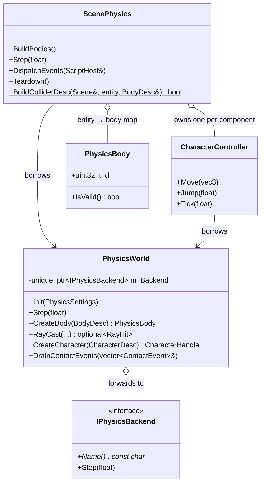

# API Reference — Physics

> **STATUS: WRITTEN** — work order **D43** (Phase 29 W10, 2026-07-25) in
> [`docs/plans/12-documentation-plan.md`](../plans/12-documentation-plan.md).
> Entry format: [reference/README.md → Entry format](README.md#entry-format-mandatory--copy-this-shape).

**Scope (headers are the truth):** `Cosmic/src/physics/PhysicsTypes.h`, `physics/PhysicsBody.h`,
`physics/PhysicsWorld.h`, `physics/PhysicsBackend.h`, `physics/CharacterController.h`,
`physics/ScenePhysics.h`.

**Read first:** guide chapter [`../guide/physics.md`](../guide/physics.md) — the task-oriented half
("make a crate fall", "make a character climb stairs", "make a trigger fire once"); systems
explainer [physics-backends](../systems/physics-backends.md) (why `PhysicsWorld` is a dispatcher,
and how to write your own simulator);
[`../guide/entities-and-components.md`](../guide/entities-and-components.md) (the physics component
tier — bodies, colliders, the character controller);
[`../guide/scripting.md`](../guide/scripting.md) (the `Physics()` / `Character()` proxies in
context, and the fixed-step tick order a script sees).

**The one rule that governs everything here:** physics advances on the **fixed** timestep, in this
order, every step:

```
scripts' OnFixedUpdate  →  Scene::OnPhysicsStep  →  Scene::DispatchPhysicsEvents
```

`PhysicsWorld::Step` is called exactly once per accumulated fixed-dt, from inside
`ScenePhysics::Step`. **Never call it from a variable-rate `OnUpdate`.**

Physics ships in **both** engine configurations — `COSMIC_2D_ONLY` does not remove it. Only the
geometry-derived colliders (mesh, terrain heightfield, voxel chunks) are 3D-only. See
[build-2d-3d-split.md](../systems/build-2d-3d-split.md) §4.3.

---

## Contents

- [Value types](#value-types) — `MotionType`, `PhysicsObjectLayer`, `CollisionShapeDesc`, `BodyDesc`, `RayHit`, `ContactKind`, `ContactEvent`, `PhysicsSettings`, `PhysicsStats`, `CharacterDesc`
- [`PhysicsBody`](#physicsbody) · [`CharacterHandle`](#characterhandle)
- [`PhysicsWorld`](#physicsworld) — lifecycle · bodies · motion · queries · characters · events · introspection · debug
- [`CharacterController`](#charactercontroller)
- [`ScenePhysics`](#scenephysics)
- [`IPhysicsBackend` / `PhysicsBackendRegistry`](#iphysicsbackend--physicsbackendregistry)
- [Reaching physics from a script](#reaching-physics-from-a-script)



---

## Value types

Everything in `PhysicsTypes.h` is a plain value type — glm plus PODs, no Jolt header anywhere.
Coordinates match `TransformComponent`: right-handed, metres, `glm::quat{w,x,y,z}`. The physics
path uses the **quaternion** slot, never Euler.

### `MotionType`

```cpp
enum class MotionType : int32_t { Static = 0, Kinematic = 1, Dynamic = 2 };
```

**What it does** — how a body is driven. `Static` never moves and has infinite mass (the world and
the ground). `Kinematic` is moved by script or transform, pushes dynamic bodies, and is not pushed
back. `Dynamic` is fully simulated: gravity, forces, contacts.

**Why you'd use it** — it is the first field you set on `RigidBodyComponent` and on `BodyDesc`, and
it decides which of the three code paths in `ScenePhysics::Step` touches your entity. Reach for
`Kinematic` (with [`MoveKinematic`](#physicsworldmovekinematic)) for a script-driven platform;
reach for `Dynamic` for anything that should fall.

**Notes & pitfalls**
- It is an `enum class : int32_t` specifically so the reflection registry boxes it as an `Enum` and
  the Inspector shows a dropdown.
- Only `Kinematic` bodies read the ECS transform each step; only `Dynamic` bodies write it back.
  Moving a `Dynamic` body by editing its `TransformComponent` mid-session does nothing — the
  write-back overwrites you next step. Use [`SetBodyTransform`](#physicsworldsetbodytransform).

### `PhysicsObjectLayer`

```cpp
namespace PhysicsObjectLayer
{
    enum : uint16_t
    {
        Static    = 0,   // non-moving world geometry
        Dynamic   = 1,   // simulated / kinematic bodies
        Trigger   = 2,   // sensors: report overlap, no contact response
        Character  = 3,  // character-controller capsules
        Count      = 4
    };
}
```

**What it does** — the **coarse** broadphase category, derived automatically from a body's
`MotionType` / trigger flag / character role. It is *not* the fine 16-bit gameplay filter.

**Why you'd use it** — mostly you don't; the engine assigns it. It is documented because the
two-level filtering model surprises people: the coarse layer decides which broadphase pairs are
even considered, and `BodyDesc::Category` / `CollidesWith` are then applied on top.

### `CollisionShapeDesc`

```cpp
struct CollisionShapeDesc
{
    enum class Kind { Box, Sphere, Capsule, ConvexHull, Mesh, HeightField };

    Kind      Shape       = Kind::Box;
    glm::vec3 HalfExtents{ 0.5f };               // Box: half-size per axis
    float     Radius      = 0.5f;                // Sphere / Capsule
    float     HalfHeight  = 0.5f;                // Capsule: half the cylinder part (excl. caps)
    glm::vec3 Offset{ 0.0f };                    // local translation
    glm::quat OffsetRotation{ 1.0f, 0.0f, 0.0f, 0.0f };
    glm::vec3 Scale{ 1.0f };                     // baked world scale

    std::vector<glm::vec3> Vertices;             // ConvexHull points / Mesh triangle soup
    std::vector<uint32_t>  Indices;              // Mesh triangle indices

    std::vector<float> HeightSamples;            // HeightField, row-major, world height applied
    uint32_t  HeightFieldSize = 0;
    glm::vec3 HeightFieldOffset{ 0.0f };         // world position of sample (0,0)
    float     HeightFieldCellSize = 1.0f;        // metres between samples along X and Z
};
```

**What it does** — one collider primitive. A body carries one or more; more than one produces a
compound shape. `Offset`/`OffsetRotation` place the shape in the body's local frame; `Scale` bakes
the entity's world scale into the primitive at build time.

**Why you'd use it** — you fill these in when building a `BodyDesc` by hand. In an authored scene
`ScenePhysics::BuildColliderDesc` fills them for you from `BoxColliderComponent`,
`SphereColliderComponent`, `CapsuleColliderComponent` and (3D only) the mesh/terrain collider
components.

**Notes & pitfalls**
- `HalfHeight` on a capsule is **half the cylinder section only** — the caps are extra. A capsule's
  total height is `2 * (HalfHeight + Radius)`.
- `Mesh` and `HeightField` are **3D-only** in the 2D engine configuration; `Box`, `Sphere` and
  `Capsule` are the dimension-agnostic subset that ships in both.
- A backend is free to ignore kinds it does not implement — but the engine will still hand them to
  it, so ignore explicitly rather than crashing.

### `BodyDesc`

```cpp
struct BodyDesc
{
    MotionType Motion = MotionType::Dynamic;
    glm::vec3  Position{ 0.0f };
    glm::quat  Rotation{ 1.0f, 0.0f, 0.0f, 0.0f };

    float Mass           = 1.0f;
    float Friction       = 0.5f;
    float Restitution    = 0.1f;
    float LinearDamping  = 0.05f;
    float AngularDamping = 0.05f;
    float GravityFactor  = 1.0f;
    bool  CCD            = false;   // continuous collision (fast small bodies)
    bool  StartAsleep    = false;
    bool  IsTrigger      = false;   // sensor: overlap events, no contact forces

    uint16_t Category    = 0x0001;
    uint16_t CollidesWith = 0xFFFF;

    uint64_t EntityId = 0;   // owning entity UUID -> body userData (query round-trip)

    std::vector<CollisionShapeDesc> Shapes;   // >= 1 required
};
```

**What it does** — everything [`PhysicsWorld::CreateBody`](#physicsworldcreatebody) needs.

**Why you'd use it** — directly, when you are creating bodies outside the ECS (a test, a tool, a
procedural system). Inside a scene, `ScenePhysics` builds it for you from `RigidBodyComponent` plus
the sibling collider components at play-start.

**Notes & pitfalls**
- **`Shapes` must not be empty.** `CreateBody` with no shapes returns an invalid handle.
- **The collision filter is Box2D-style and two-sided.** Two bodies collide iff
  `(A.Category & B.CollidesWith) && (B.Category & A.CollidesWith)`. Setting only one side does
  nothing.
- **`EntityId` is the query round-trip.** Whatever you put here comes back in
  [`RayHit::EntityId`](#rayhit) and in [`ContactEvent`](#contactkind--contactevent). `0` means "no entity". In a
  scene it is the entity's `IDComponent` UUID.
- `IsTrigger` bodies report `TriggerEnter`/`TriggerExit` and apply no contact response — things fall
  straight through them.

### `RayHit`

```cpp
struct RayHit
{
    uint64_t  EntityId = 0;        // owning entity UUID (0 = the query missed)
    glm::vec3 Point{ 0.0f };       // world hit point
    glm::vec3 Normal{ 0.0f };      // world surface normal at the hit
    float     Distance = 0.0f;     // along the ray from its origin
    bool      Hit = false;
};
```

**What it does** — the result of a [`RayCast`](#physicsworldraycast) or
[`SphereCast`](#physicsworldspherecast), delivered inside a `std::optional`.

**Notes & pitfalls** — the `optional` is the miss signal; `Hit` is redundant with it and exists so
the struct is self-describing when copied out. Resolve `EntityId` back to an `Entity` with
`Scene::FindByUUID(UUID(hit->EntityId))`.

### `ContactKind` / `ContactEvent`

```cpp
enum class ContactKind { CollisionEnter, CollisionExit, TriggerEnter, TriggerExit };

struct ContactEvent
{
    uint64_t    EntityA = 0;   // for Trigger* events, A is the sensor's entity
    uint64_t    EntityB = 0;
    ContactKind Kind = ContactKind::CollisionEnter;
};
```

**What it does** — one collision or trigger transition, queued during `Step` and drained afterwards.

**Notes & pitfalls**
- **For `TriggerEnter`/`TriggerExit`, `EntityA` is the sensor.** For the collision kinds the order
  is unconstrained — do not depend on it.
- Events are edge transitions, not per-step states. There is no "still touching" event.

### `PhysicsSettings`

```cpp
struct PhysicsSettings
{
    glm::vec3 Gravity{ 0.0f, -9.81f, 0.0f };
    uint32_t  MaxBodies            = 10240;
    uint32_t  MaxBodyPairs         = 65536;
    uint32_t  MaxContactConstraints = 20480;

    int32_t ThreadCount = -1;
    std::string Backend;
};
```

**What it does** — one-time world configuration, passed to [`Init`](#physicsworldinit).

**Notes & pitfalls**
- **`ThreadCount`:** `-1` = auto (the Jolt backend uses `min(hardware_concurrency() - 1, 4)`);
  `0` = single-threaded and **deterministic**. `tests/test_physics_determinism.cpp` pins `0` and
  asserts two runs are bit-identical. A third-party backend either honours `0` or documents that it
  ignores it.
- **`Backend`:** empty ⇒ `PhysicsBackendRegistry::Default()` (which is `"jolt"` unless the app
  called `SetDefault`, or `"null"` when built without Jolt). An unregistered name **logs an error
  and falls back to `"null"`** — it is never fatal.
- The `Max*` caps are backend hints, not hard engine limits; the null backend ignores them entirely.

### `PhysicsStats`

```cpp
struct PhysicsStats
{
    uint32_t BodyCount   = 0;
    uint32_t ActiveBodies = 0;   // awake (non-sleeping) dynamic/kinematic bodies
};
```

**What it does** — cheap per-step counters for the editor HUD. Returned by
[`GetStatistics`](#physicsworldgetstatistics).

### `CharacterDesc`

```cpp
struct CharacterDesc
{
    glm::vec3 Position{ 0.0f };
    float     Height      = 1.8f;   // total capsule height (incl. both caps)
    float     Radius      = 0.3f;
    float     MaxSlopeDeg = 45.0f;
    float     StepHeight  = 0.35f;  // max obstacle height auto-stepped onto
    float     Mass        = 80.0f;
    uint64_t  EntityId    = 0;
};
```

**What it does** — the capsule a [character controller](#charactercontroller) walks around in.

**Notes & pitfalls** — unlike `CollisionShapeDesc::Capsule`, **`Height` here is the total capsule
height including both caps**, not a half-extent. `Height` must be at least `2 * Radius`.

---

## `PhysicsBody`

**Declared in** `Cosmic/src/physics/PhysicsBody.h`.

A trivially-copyable, backend-free handle to a body living inside a `PhysicsWorld`. It stores only
a packed 32-bit id; every operation goes back through `PhysicsWorld`. Held by
`RigidBodyComponent` at runtime (not reflected, not serialized) and handed to scripts through the
`Physics()` proxy.

```cpp
struct PhysicsBody
{
    uint32_t Id = 0xFFFFFFFFu;

    bool IsValid() const { return Id != 0xFFFFFFFFu; }

    bool operator==(const PhysicsBody& o) const { return Id == o.Id; }
    bool operator!=(const PhysicsBody& o) const { return Id != o.Id; }
};
```

**Notes & pitfalls**
- A default-constructed handle is **invalid** (`0xFFFFFFFF`), which is what `CreateBody` returns
  when it declines to create anything. Every `PhysicsWorld` method tolerates an invalid handle —
  setters no-op, getters return zeros.
- The handle is **not stable across sessions.** Bodies exist only while a play session runs; stop
  and start and every handle is new. Never serialize one.

## `CharacterHandle`

```cpp
struct CharacterHandle
{
    uint32_t Id = 0xFFFFFFFFu;

    bool IsValid() const { return Id != 0xFFFFFFFFu; }

    bool operator==(const CharacterHandle& o) const { return Id == o.Id; }
    bool operator!=(const CharacterHandle& o) const { return Id != o.Id; }
};
```

Same shape, same rules, for a character-controller capsule.

---

## `PhysicsWorld`

**Declared in** `Cosmic/src/physics/PhysicsWorld.h`.

The engine's rigid-body / query / character service. **Concrete and copy-deleted, held by value** —
`PlayerLayer` and `StarforgeApp` each own one directly. Since Phase 29 W3 it is a *dispatcher*: it
holds one `IPhysicsBackend` resolved by name at `Init` and forwards every call. Its public API is
identical to what it was before that change.

Owned by whoever runs a simulation session (the editor's play mode, `PlayerLayer`). **Bodies exist
only while a session runs; edit mode holds no backend objects.**

GL-free and headless-testable — `CosmicTests` constructs a real `PhysicsWorld` and simulates
without a window.

### `PhysicsWorld::Init`

```cpp
void Init(const PhysicsSettings& settings = {});
```

**What it does** — resolves and constructs the backend, then initialises it. Calls `Shutdown()`
first, so `Init` on a live world **restarts** it. Registers the built-in backends (`"null"` always,
`"jolt"` when built with `COSMIC_WITH_JOLT`) before resolving.

**Why you'd use it** — once, when a play session starts, before `Scene::OnPhysicsStart`. Use
[`Shutdown`](#physicsworldshutdown) at the end of the session rather than destroying and
reconstructing the world, so the play/stop cycle stays allocation-light.

**Example**

```cpp
Cosmic::PhysicsWorld world;

Cosmic::PhysicsSettings ps;
ps.Gravity     = { 0.0f, -9.81f, 0.0f };
ps.ThreadCount = 0;                 // single-threaded => bit-reproducible
world.Init(ps);

scene.OnPhysicsStart(world);        // build bodies from the authored components
```

**Notes & pitfalls**
- An **unknown `settings.Backend` is not fatal**: it logs `CS_CORE_ERROR` and falls back to
  `"null"`, leaving a world where `IsInitialized()` is `true` but nothing simulates. That is a
  deliberate choice — a typo degrades rather than crashes.
- Restarting via `Init` invalidates every outstanding `PhysicsBody` and `CharacterHandle`.

**See also** — [`Shutdown`](#physicsworldshutdown), [`PhysicsSettings`](#physicssettings),
[`PhysicsBackendRegistry`](#iphysicsbackend--physicsbackendregistry)

### `PhysicsWorld::Shutdown`

```cpp
void Shutdown();
```

**What it does** — shuts the backend down and releases it. Idempotent; the destructor calls it.

**Notes & pitfalls** — after `Shutdown` the world is back in its pre-`Init` state and every call is
a tolerated no-op. Every outstanding handle is dead.

### `PhysicsWorld::IsInitialized`

```cpp
bool IsInitialized() const;
```

**What it does** — true when a backend exists *and* reports itself initialised.

**Why you'd use it** — guard code that only makes sense during a session. Note that it is `true`
even on the null backend, so it answers "is there a physics world" and not "will anything move".

### `PhysicsWorld::Step`

```cpp
/** @brief Advance the simulation by exactly one fixed step (see contract). */
void Step(float fixedDt);
```

**What it does** — advances the simulation by exactly one fixed step.

**Why you'd use it** — you almost certainly should **not** call this directly. `ScenePhysics::Step`
calls it in the right place, sandwiched between kinematic push and dynamic write-back. Call it
yourself only when driving a `PhysicsWorld` with no `Scene` at all (a test, a headless tool).

**Notes & pitfalls**
- **Fixed step only.** Once per accumulated fixed-dt, after scripts' `OnFixedUpdate`, before
  write-back and event dispatch. Stepping from a variable `OnUpdate` makes the simulation
  frame-rate dependent and non-reproducible.
- A no-op before `Init` and after `Shutdown`.

**See also** — [`ScenePhysics::Step`](#scenephysicsstep), [`DrainContactEvents`](#physicsworlddraincontactevents)

### `PhysicsWorld::CreateBody`

```cpp
PhysicsBody CreateBody(const BodyDesc& desc);
```

**What it does** — creates a body from `desc` and returns its handle.

**Why you'd use it** — when you own bodies outside the ECS. Inside a scene, let `ScenePhysics` do
it: it reads the authored components and calls this for you at `OnPhysicsStart`.

**Example**

```cpp
Cosmic::BodyDesc desc;
desc.Motion   = Cosmic::MotionType::Dynamic;
desc.Position = { 0.0f, 4.0f, 0.0f };
desc.Mass     = 2.0f;
desc.EntityId = entity.GetComponent<Cosmic::IDComponent>().ID.Value();   // so RayHit::EntityId comes back as this

Cosmic::CollisionShapeDesc box;
box.Shape       = Cosmic::CollisionShapeDesc::Kind::Box;
box.HalfExtents = { 0.5f, 0.5f, 0.5f };
desc.Shapes.push_back(box);

Cosmic::PhysicsBody body = world.CreateBody(desc);
if (!body.IsValid())
    CS_ERROR("body creation failed — empty Shapes, or no session running");
```

**Notes & pitfalls**
- **Failure returns an invalid handle**, never throws. Causes: the world is not initialised,
  `desc.Shapes` is empty, or the backend declined (the null backend always declines).
- Always set `EntityId` if you want queries and contact events to name your entity.

**See also** — [`DestroyBody`](#physicsworlddestroybody), [`BodyDesc`](#bodydesc)

### `PhysicsWorld::DestroyBody`

```cpp
void DestroyBody(PhysicsBody body);
```

**What it does** — removes the body from the simulation. Safe on an invalid or already-destroyed
handle.

**Notes & pitfalls** — the handle is not zeroed for you; it is dangling afterwards. `ScenePhysics`
destroys everything it created in `Teardown`, so scene-owned bodies need no manual cleanup.

### `PhysicsWorld::SetBodyTransform`

```cpp
/** @brief Teleport (position + rotation). Use only on session start / hard
 *  resets — for per-step kinematic movement use MoveKinematic. */
void SetBodyTransform(PhysicsBody body, const glm::vec3& position, const glm::quat& rotation);
```

**What it does** — teleports a body.

**Why you'd use it** — respawns, resets, "put the player back at the checkpoint". For a platform
that moves every step, use [`MoveKinematic`](#physicsworldmovekinematic) instead: teleporting has no
velocity, so it does not push dynamic bodies and can tunnel through them.

**Example**

```cpp
world.SetBodyTransform(body, spawnPoint, glm::quat(1, 0, 0, 0));
```

### `PhysicsWorld::GetBodyTransform`

```cpp
void GetBodyTransform(PhysicsBody body, glm::vec3& outPosition, glm::quat& outRotation) const;
```

**What it does** — reads a body's world pose into the out-parameters.

**Notes & pitfalls**
- **On an unknown handle the out-parameters are left exactly as you passed them.** This is the
  documented contract, chosen over zeroing because zeroing silently teleports things to the origin.
  **Seed them before calling.** `ScenePhysics` does exactly that.

**Example**

```cpp
glm::vec3 p(0.0f);
glm::quat q(1, 0, 0, 0);          // seeded — a miss leaves these untouched
world.GetBodyTransform(body, p, q);
```

### `PhysicsWorld::MoveKinematic`

```cpp
/** @brief Velocity-consistent kinematic move: sets the body's velocity so it
 *  reaches (position, rotation) after `dt`, so it pushes dynamic bodies
 *  correctly (the script-driven-mover path). */
void MoveKinematic(PhysicsBody body, const glm::vec3& position, const glm::quat& rotation, float dt);
```

**What it does** — moves a kinematic body by *deriving the velocity* that reaches the target pose
after `dt`, instead of teleporting.

**Why you'd use it** — every moving platform, lift, door and rotating hazard. Because the body
carries real velocity, dynamic bodies resting on it get pushed instead of being passed through.

**Notes & pitfalls**
- `dt` must be the same fixed step the world is about to take, or the derived velocity is wrong.
- `ScenePhysics::Step` already calls this for every `Kinematic` body, using the (possibly
  script-modified) `TransformComponent`. **For a scene entity, just move its transform in
  `OnFixedUpdate`.**

### `PhysicsWorld::SetLinearVelocity` / `GetLinearVelocity`

```cpp
void      SetLinearVelocity(PhysicsBody body, const glm::vec3& v);
glm::vec3 GetLinearVelocity(PhysicsBody body) const;
```

**What it does** — sets/reads the body's linear velocity in m/s, world space.

**Why you'd use it** — direct velocity control for arcade-feel movement, where you want an exact
speed rather than an integrated force. For physical pushes prefer
[`AddImpulse`](#physicsworldaddimpulse).

**Notes & pitfalls** — the getter returns `vec3(0)` for an invalid handle or an uninitialised world.

### `PhysicsWorld::SetAngularVelocity` / `GetAngularVelocity`

```cpp
void      SetAngularVelocity(PhysicsBody body, const glm::vec3& w);
glm::vec3 GetAngularVelocity(PhysicsBody body) const;
```

**What it does** — sets/reads angular velocity in rad/s about the world axes.

**Notes & pitfalls** — a backend with no rotation model (like the `TinyPhysics` example) may
legitimately ignore the setter and return zero.

### `PhysicsWorld::AddForce`

```cpp
void AddForce(PhysicsBody body, const glm::vec3& force);            // N, this step
```

**What it does** — accumulates a force (newtons) applied over **this step only**.

**Why you'd use it** — continuous influences: thrust, wind, buoyancy, a magnet. Call it every fixed
step for as long as the influence lasts. For an instantaneous kick use
[`AddImpulse`](#physicsworldaddimpulse).

**Example**

```cpp
void OnFixedUpdate(float dt) override
{
    Physics().AddForce(glm::vec3(0.0f, 0.0f, -800.0f));   // thrust, every step
}
```

**Notes & pitfalls** — forces do not accumulate across steps; the buffer is consumed by `Step`.
Sleeping bodies ignore forces — [`Activate`](#physicsworldactivate) first if you need to be sure.

### `PhysicsWorld::AddImpulse`

```cpp
void AddImpulse(PhysicsBody body, const glm::vec3& impulse);        // N*s, instantaneous
```

**What it does** — applies an instantaneous change of momentum (newton-seconds).

**Why you'd use it** — jumps, explosions, bullet hits, launch pads — anything that happens *once*.
Impulse is mass-independent in effect: `impulse = mass * desired_velocity_change`.

### `PhysicsWorld::AddTorque`

```cpp
void AddTorque(PhysicsBody body, const glm::vec3& torque);
```

**What it does** — accumulates a torque (N·m) about the world axes for this step. Same lifetime
rules as [`AddForce`](#physicsworldaddforce).

### `PhysicsWorld::IsActive`

```cpp
/** @brief True while the body is awake (not sleeping). */
bool IsActive(PhysicsBody body) const;
```

**What it does** — reports whether the body is awake. Physics engines put settled bodies to sleep to
save time; sleeping bodies do not integrate.

**Why you'd use it** — "has this stack settled yet?" checks, and debugging the classic *"my force
does nothing"* bug — the body was asleep.

### `PhysicsWorld::Activate`

```cpp
void Activate(PhysicsBody body);
```

**What it does** — wakes a sleeping body.

**Why you'd use it** — before applying a force or impulse to something that may have settled, and
after changing the world underneath a resting body (removing the floor it sat on).

### `PhysicsWorld::RayCast`

```cpp
std::optional<RayHit> RayCast(const glm::vec3& origin, const glm::vec3& direction,
                              float maxDistance, uint16_t layerMask = 0xFFFF,
                              uint64_t ignoreEntity = 0) const;
```

**What it does** — casts a ray and returns the **closest** hit, or `std::nullopt`.

**Why you'd use it** — line of sight, ground checks, hitscan weapons, click-to-place. For a query
with thickness — a character probe that should not slip through a gap — use
[`SphereCast`](#physicsworldspherecast).

**Example**

```cpp
// "Am I standing on something?" — ignoring my own body.
const glm::vec3 pos = entity.GetComponent<Cosmic::TransformComponent>().Position;
if (auto hit = world.RayCast(pos, glm::vec3(0, -1, 0), 1.1f, 0xFFFF, myEntityId))
{
    CS_INFO("ground at {0} m, normal.y = {1}", hit->Distance, hit->Normal.y);
}
```

**Notes & pitfalls**
- `layerMask` filters against each body's fine `BodyDesc::Category` bits. `0xFFFF` (the default)
  disables the check entirely rather than testing every bit.
- **`ignoreEntity` is a UUID, not a body handle** — `0` means "ignore nothing". This is the
  "don't hit myself" convenience; the `Physics()` script proxy passes the calling entity's UUID
  automatically.
- **Trigger bodies are hit like any other.** All four of the Jolt backend's queries share one body
  filter that checks *only* the category mask and `ignoreEntity` — sensors are not excluded. If a
  ground check should ignore trigger volumes, give them a `Category` bit you mask out. (A custom
  backend may choose differently; the `TinyPhysics` example does skip them.)
- The Jolt backend **normalises `direction` internally** and treats a zero-length direction as a
  miss, so `Distance` is always in metres along the ray. A custom backend is not obliged to
  normalise — pass a unit vector and the meaning is unambiguous on every backend.

**See also** — [`SphereCast`](#physicsworldspherecast), [`RayHit`](#rayhit)

### `PhysicsWorld::SphereCast`

```cpp
std::optional<RayHit> SphereCast(const glm::vec3& origin, const glm::vec3& direction,
                                 float radius, float maxDistance, uint16_t layerMask = 0xFFFF,
                                 uint64_t ignoreEntity = 0) const;
```

**What it does** — sweeps a sphere of `radius` along the ray and returns the first hit.

**Why you'd use it** — a thickened raycast: character ground probes that must not fall through
cracks, projectile paths that should not thread needles, camera collision.

**Notes & pitfalls** — same masking and `ignoreEntity` semantics as `RayCast`. A backend may
legitimately not implement it and always return `nullopt` (the `TinyPhysics` example does).

### `PhysicsWorld::OverlapSphere`

```cpp
void OverlapSphere(const glm::vec3& center, float radius,
                   std::vector<uint64_t>& outEntities, uint16_t layerMask = 0xFFFF,
                   uint64_t ignoreEntity = 0) const;
```

**What it does** — fills `outEntities` with the UUIDs of every body overlapping the sphere.

**Why you'd use it** — explosion radii, "what is near me", aggro checks, pickup ranges.

**Example**

```cpp
std::vector<uint64_t> ids;
world.OverlapSphere(blastCenter, 6.0f, ids);
for (uint64_t id : ids)
    if (Cosmic::Entity e = scene.FindByUUID(Cosmic::UUID(id)))
        e.GetComponent<HealthComponent>().Value -= 25.0f;
```

**Notes & pitfalls** — **`outEntities` is cleared by the dispatcher before the backend runs**, so it
is always empty-or-results, never appended to. That guarantee holds for every backend.

### `PhysicsWorld::OverlapBox`

```cpp
void OverlapBox(const glm::vec3& center, const glm::vec3& halfExtents, const glm::quat& rotation,
                std::vector<uint64_t>& outEntities, uint16_t layerMask = 0xFFFF,
                uint64_t ignoreEntity = 0) const;
```

**What it does** — the oriented-box version of `OverlapSphere`. Same clearing guarantee.

**Why you'd use it** — rectangular trigger volumes evaluated on demand, room queries, selection
boxes.

### `PhysicsWorld::CreateCharacter`

```cpp
CharacterHandle CreateCharacter(const CharacterDesc& desc);
```

**What it does** — creates a kinematic character capsule with slope and step handling.

**Why you'd use it** — a walking player or NPC. A dynamic rigid body makes a terrible walker (it
tips, slides down slopes and bounces); a character controller is the purpose-built alternative.

**Notes & pitfalls** — you usually do **not** call this. Add a `CharacterControllerComponent` and
`ScenePhysics` creates one at play-start, wrapped in a [`CharacterController`](#charactercontroller)
that adds gravity, jump and stick-to-floor on top.

### `PhysicsWorld::DestroyCharacter`

```cpp
void DestroyCharacter(CharacterHandle ch);
```

**What it does** — destroys a character capsule. Safe on an invalid handle.

### `PhysicsWorld::UpdateCharacter`

```cpp
/** @brief Integrate one character against the world (called by the session
 *  AFTER Step()). desiredVelocity is the horizontal walk + vertical (jump/
 *  gravity) velocity the script set this step. */
void UpdateCharacter(CharacterHandle ch, const glm::vec3& desiredVelocity, float dt);
```

**What it does** — moves the capsule by `desiredVelocity * dt`, resolving contacts, slopes and
steps.

**Notes & pitfalls**
- **Call after `Step`, not before.** The character walks against the world as it is *after* this
  step's simulation.
- The raw call has **no gravity model**. `desiredVelocity` must already include the vertical
  component. [`CharacterController::Tick`](#charactercontrollertick) is the wrapper that owns
  gravity, jump and floor-sticking — use that.

### `PhysicsWorld::GetCharacterTransform`

```cpp
void GetCharacterTransform(CharacterHandle ch, glm::vec3& outPosition, glm::quat& outRotation) const;
```

**What it does** — reads a character's world pose. **Out-parameters are untouched on a miss** — the
same contract as [`GetBodyTransform`](#physicsworldgetbodytransform). Seed them.

### `PhysicsWorld::SetCharacterPosition`

```cpp
void SetCharacterPosition(CharacterHandle ch, const glm::vec3& position);
```

**What it does** — teleports the capsule. Use for spawns, respawns and cutscene placement.

**Notes & pitfalls** — teleporting into geometry is your problem; the controller resolves outward
from wherever you put it, which can look like a pop.

### `PhysicsWorld::IsCharacterGrounded`

```cpp
bool IsCharacterGrounded(CharacterHandle ch) const;
```

**What it does** — true when the capsule is standing on a surface within its slope limit.

**Why you'd use it** — jump gating, landing sounds, coyote-time windows. Prefer this over a manual
down-ray: it already accounts for `MaxSlopeDeg` and the step height.

**Notes & pitfalls** — returns `false` when the world is not initialised or the handle is invalid,
so "not grounded" is also the failure answer.

### `PhysicsWorld::GetCharacterGroundNormal`

```cpp
glm::vec3 GetCharacterGroundNormal(CharacterHandle ch) const;
```

**What it does** — the world-space normal of the surface underfoot.

**Why you'd use it** — slope-aware movement (projecting walk velocity onto the ground plane),
surface-type effects, aligning a mesh to a ramp.

**Notes & pitfalls** — returns `(0, 1, 0)` — straight up — when there is nothing to report. That is
a *safe* default, not a sentinel; pair it with `IsCharacterGrounded` if you need to distinguish
"flat ground" from "airborne".

### `PhysicsWorld::GetCharacterVelocity`

```cpp
glm::vec3 GetCharacterVelocity(CharacterHandle ch) const;
```

**What it does** — the velocity the controller actually achieved last update, which is *not*
necessarily what you asked for — walls, slopes and ceilings clamp it.

**Why you'd use it** — animation blending (walk/run speed), fall-damage from impact speed, and
reading back a clamped vertical velocity. `CharacterController::Tick` uses exactly this to notice
ceiling hits.

### `PhysicsWorld::DrainContactEvents`

```cpp
/** @brief Move queued contact events into `out` (clears the internal queue).
 *  Call once per fixed step after Step(); dispatch to scripts (J5). */
void DrainContactEvents(std::vector<ContactEvent>& out);
```

**What it does** — moves every queued contact event into `out` and clears the internal queue.

**Why you'd use it** — driving your own event dispatch. In a scene,
`Scene::DispatchPhysicsEvents(ScriptHost&)` does this and calls the `OnCollisionEnter` /
`OnCollisionExit` / `OnTriggerEnter` / `OnTriggerExit` script hooks for you.

**Example**

```cpp
std::vector<Cosmic::ContactEvent> events;
world.DrainContactEvents(events);
for (const auto& e : events)
    if (e.Kind == Cosmic::ContactKind::TriggerEnter)
        CS_INFO("entity {0} entered sensor {1}", e.EntityB, e.EntityA);
```

**Notes & pitfalls**
- **`out` is cleared by the dispatcher first**, so it is always exactly the new events.
- **Events are reported once.** Skipping a drain loses them; draining twice yields nothing the
  second time.
- The queue is filled from backend worker threads during `Step` and is only safe to drain on the
  main thread, after `Step` has returned.

### `PhysicsWorld::GetStatistics`

```cpp
PhysicsStats GetStatistics() const;
```

**What it does** — returns the body / active-body counters. Cheap enough to call every frame.

**Why you'd use it** — the editor's physics HUD chip, and asserting in tests that bodies were
actually created (`BodyCount == 0` after `OnPhysicsStart` means the null backend, or colliders that
did not resolve).

### `PhysicsWorld::DebugDraw`

```cpp
/** @brief Emit live body/character wireframes + contact points to the
 *  Renderer3D line batch (call between BeginScene/EndScene). Sleeping
 *  bodies draw grey, awake green, triggers cyan, characters yellow.
 *  Debug-config only (needs JPH_DEBUG_RENDERER); a no-op in Release. */
void DebugDraw() const;
```

**What it does** — draws the live simulation state as wireframes.

**Notes & pitfalls**
- **Debug configuration only** (it needs `JPH_DEBUG_RENDERER`); a no-op in Release.
- **A no-op in the 2D engine configuration too**, because it draws through `Renderer3D`, which the
  2D build does not compile. The 2D editor draws colliders with
  `ViewportController::DrawColliderOverlay2D` instead — that reads components rather than the
  backend, so it works on any backend.
- Must be called between `Renderer3D::BeginScene` and `EndScene`.

---

## `CharacterController`

**Declared in** `Cosmic/src/physics/CharacterController.h`. **Header-only** — thin inline calls into
the exported `PhysicsWorld` API; no backend types leak.

An ergonomic wrapper around a `CharacterHandle` that owns the walk model the raw capsule does not:
**gravity integration, jump, and stick-to-floor**. A gameplay script only has to say `Move(dir)` and
`Jump(v)`.

Lifecycle: the `Scene` creates one per `CharacterControllerComponent` at play-start and calls
`Tick(dt)` each fixed step *after* `PhysicsWorld::Step`. Scripts drive it through
`ScriptableEntity::Character()`.

### `CharacterController::CharacterController`

```cpp
CharacterController() = default;
CharacterController(PhysicsWorld* world, CharacterHandle handle);
```

**What it does** — binds the wrapper to a world and a capsule. The default constructor makes an
invalid controller that safely no-ops on every call.

**Notes & pitfalls** — the `PhysicsWorld*` is **borrowed, not owned**. It must outlive the
controller; `ScenePhysics` guarantees that because both die at `Teardown`.

### `CharacterController::IsValid`

```cpp
bool IsValid() const;
```

**What it does** — true when both the world pointer and the handle are usable. Every other method
checks this internally, so calling on an invalid controller is safe.

### `CharacterController::GetHandle`

```cpp
CharacterHandle GetHandle() const;
```

**What it does** — the underlying handle, for calls the wrapper does not expose.

### `CharacterController::Move`

```cpp
/** @brief Set the desired horizontal (X/Z) walk velocity for this step.
 *  Persists until changed — set it to zero when there's no input. The Y
 *  component is ignored (gravity + Jump own the vertical axis). */
void Move(const glm::vec3& horizontalVelocity);
```

**What it does** — sets the horizontal walk velocity, in m/s.

**Why you'd use it** — it is *the* movement call for a walking character. Do not move the entity's
transform directly; the controller writes the transform back each step and would overwrite you.

**Example**

```cpp
void OnFixedUpdate(float dt) override
{
    glm::vec3 dir(0.0f);
    if (Cosmic::Input::IsKeyPressed(CS_KEY_W)) dir.z -= 1.0f;
    if (Cosmic::Input::IsKeyPressed(CS_KEY_S)) dir.z += 1.0f;
    if (Cosmic::Input::IsKeyPressed(CS_KEY_A)) dir.x -= 1.0f;
    if (Cosmic::Input::IsKeyPressed(CS_KEY_D)) dir.x += 1.0f;
    if (glm::length(dir) > 0.0f) dir = glm::normalize(dir);

    Character().Move(dir * 4.5f);                      // 4.5 m/s walk

    if (Cosmic::Input::IsKeyPressed(CS_KEY_SPACE) && Character().IsGrounded())
        Character().Jump(5.0f);
}
```

**Notes & pitfalls**
- **`.y` is discarded.** Only X and Z are used.
- **It persists.** Set it to zero when input stops, or the character walks forever.

### `CharacterController::Jump`

```cpp
/** @brief Request a jump: takes effect next Tick if grounded. `speed` is the
 *  launch velocity (m/s), e.g. sqrt(2*g*height) for a target apex height. */
void Jump(float speed);
```

**What it does** — queues a jump, applied on the next `Tick` **only if grounded**.

**Why you'd use it** — jumping. For a target apex height *h* with gravity *g*, use
`speed = sqrt(2 * g * h)` — e.g. 1 m at 9.81 m/s² is ≈ 4.43 m/s.

**Notes & pitfalls** — the request is a single latched flag: calling it twice before a `Tick` is the
same as calling it once, and an ungrounded request is silently dropped rather than buffered.

### `CharacterController::IsGrounded` / `GetGroundNormal` / `GetVelocity` / `GetPosition`

```cpp
bool      IsGrounded() const;
glm::vec3 GetGroundNormal() const;
glm::vec3 GetVelocity() const;
glm::vec3 GetPosition() const;
```

**What they do** — forward to the matching `PhysicsWorld` calls, with safe defaults when the
controller is invalid: `false`, `(0,1,0)`, `vec3(0)` and `vec3(0)` respectively.

### `CharacterController::SetPosition`

```cpp
void SetPosition(const glm::vec3& p);
```

**What it does** — teleports the capsule. Spawns, respawns, cutscenes.

### `CharacterController::SetGravity`

```cpp
void SetGravity(float accelY);
```

**What it does** — sets the vertical acceleration this controller integrates, in m/s². Defaults to
`-9.81`.

**Why you'd use it** — per-character feel (a floatier jump), or low-gravity areas. **The value is
negative for downward gravity**; a positive value makes the character fall up.

**Notes & pitfalls** — this is *not* `PhysicsSettings::Gravity`. The controller is kinematic and
integrates its own vertical velocity; the world's gravity applies to dynamic rigid bodies. Changing
one does not change the other.

### `CharacterController::Tick`

```cpp
void Tick(float dt);
```

**What it does** — one fixed step of the walk model: zero the downward velocity when grounded,
consume a queued jump, integrate gravity, call `UpdateCharacter` with the combined
horizontal + vertical velocity, then **read the achieved vertical velocity back** so a ceiling hit
or ground contact clamps it for next step.

**Why you'd use it** — you don't, in a scene: `ScenePhysics::Step` calls it for every character
after `PhysicsWorld::Step`. Call it yourself only when driving a controller with no `Scene`.

**Notes & pitfalls** — a no-op when invalid or `dt <= 0`. Must run **after** `PhysicsWorld::Step`.

---

## `ScenePhysics`

**Declared in** `Cosmic/src/physics/ScenePhysics.h`.

The `Scene` ⇄ `PhysicsWorld` runtime binding. It lives only while a simulation session runs: built
by `Scene::OnPhysicsStart` from the authored components, torn down by `Scene::OnPhysicsStop`. The
`PhysicsWorld` is **borrowed** (the session owns it); `ScenePhysics` owns only the entity ⇄
body/character maps.

Most projects never name this class — they call the four `Scene` methods:

```cpp
scene.OnPhysicsStart(world);          // build bodies
scene.OnPhysicsStep(fixedDt);         // one step
scene.DispatchPhysicsEvents(scripts); // fire OnCollision*/OnTrigger*
scene.OnPhysicsStop(world);           // tear down
scene.GetPhysics();                   // ScenePhysics*, or nullptr in edit mode
```

### `ScenePhysics::ScenePhysics`

```cpp
ScenePhysics(Scene& scene, PhysicsWorld& world);
```

**What it does** — binds a scene to a world. Both references are borrowed and must outlive the
object.

### `ScenePhysics::BuildBodies`

```cpp
/** @brief Create bodies + character controllers from the scene's components
 *  (world transforms via Scene::GetWorldTransform). Called once at start. */
void BuildBodies();
```

**What it does** — walks the registry and creates one body per entity carrying a
`RigidBodyComponent` plus a collider, and one character per `CharacterControllerComponent`, using
**world** transforms (so parented entities land in the right place).

**Notes & pitfalls** — called for you by `Scene::OnPhysicsStart`. Entities created *after* the
session started get no body; stop and restart the session, or create the body yourself.

### `ScenePhysics::Step`

```cpp
/** @brief One fixed step: push kinematic targets -> PhysicsWorld::Step ->
 *  write dynamic transforms back -> advance characters. */
void Step(float fixedDt);
```

**What it does** — the four-part fixed step, in this exact order:

1. push kinematic targets from the (possibly script-moved) transforms via `MoveKinematic`
2. `PhysicsWorld::Step(fixedDt)` — **exactly once**
3. write `Dynamic` body transforms back into the ECS
4. tick character controllers

In the 3D configuration a step 0 runs first: rebuild collision for voxel chunks edited or streamed
since the last step, so characters walk on current geometry.

**Notes & pitfalls** — this is the **only** correct place `PhysicsWorld::Step` is called from in a
scene. Call it through `Scene::OnPhysicsStep`.

### `ScenePhysics::DispatchEvents`

```cpp
/** @brief Drain queued contact events and dispatch the OnCollision / OnTrigger
 *  callbacks to the matching script instances (J5). Call after Step each step. */
void DispatchEvents(ScriptHost& scripts);
```

**What it does** — drains the world's contact events and calls the matching script hooks.

**Notes & pitfalls** — must run after `Step` in the same fixed step, or events arrive one step late.
Reached through `Scene::DispatchPhysicsEvents`.

### `ScenePhysics::Teardown`

```cpp
/** @brief Destroy every body + character (called at stop). */
void Teardown();
```

**What it does** — destroys everything it created and empties the maps. Every outstanding
`PhysicsBody` and `CharacterHandle` for this scene is dead afterwards.

### `ScenePhysics::World`

```cpp
PhysicsWorld& World();
```

**What it does** — the borrowed world. This is how `ScriptableEntity::Physics()` reaches
`RayCast`/`AddForce` from a script.

### `ScenePhysics::BuildColliderDesc`

```cpp
static bool BuildColliderDesc(Scene& scene, entt::entity e, BodyDesc& out);
```

**What it does** — builds a `BodyDesc` (collider shapes + world pose) for `e` from `scene`.
**Edit-mode safe**: it reads components and assets only, and creates no backend objects. Returns
`false` when the entity carries no collider shape.

**Why you'd use it** — this is the scene's *collision-view enumeration*, and it is deliberately
public and static so non-physics systems can ask "what does collision look like here?" without
starting a session. The navmesh bake uses it to gather triangles — which is what makes the navmesh
an honest reflection of the physics world rather than a parallel guess.

**Example**

```cpp
Cosmic::BodyDesc desc;
if (Cosmic::ScenePhysics::BuildColliderDesc(scene, (entt::entity)entity, desc))
    CS_INFO("{0} collider shape(s), first is kind {1}",
            desc.Shapes.size(), (int)desc.Shapes.front().Shape);
```

**Notes & pitfalls** — `out` is only meaningful when the call returns `true`. The mesh-collider and
terrain-heightfield branches are **3D-only**; in the 2D configuration those shape kinds are never
produced.

### `ScenePhysics::GetBody` / `GetCharacter`

```cpp
/** @brief The body bound to `entity`, or an invalid handle. */
PhysicsBody GetBody(entt::entity entity) const;
/** @brief The character controller bound to `entity`, or nullptr. */
CharacterController* GetCharacter(entt::entity entity);
```

**What they do** — look up the runtime handle for an entity. `GetBody` returns an invalid handle and
`GetCharacter` returns `nullptr` when the entity has none.

**Notes & pitfalls** — the `CharacterController*` points into `ScenePhysics`'s own map. **Do not
store it** across a `Teardown`, and do not hold it across anything that could add or remove a
character.

---

## `IPhysicsBackend` / `PhysicsBackendRegistry`

**Declared in** `Cosmic/src/physics/PhysicsBackend.h`.

The swappable-simulator seam. `IPhysicsBackend` mirrors `PhysicsWorld`'s public surface 1:1 in
`PhysicsTypes.h` vocabulary — glm and PODs, no Jolt, no GL, no entt. `PhysicsWorld` holds one and
forwards.

**The narrative — what the interface is for, the contracts an implementation must honour, and a
complete worked example — is in the systems explainer:
[`../systems/physics-backends.md`](../systems/physics-backends.md).** Only the registry's call
surface is listed here.

### `PhysicsBackendRegistry::Register`

```cpp
using Factory = std::function<std::unique_ptr<IPhysicsBackend>()>;

/** @brief Register (or replace) the factory for `name`. */
static void Register(std::string name, Factory factory);
```

**What it does** — installs a factory under `name`, replacing any previous one.

**Why you'd use it** — to run your app on your own physics.

**Example**

```cpp
// In your project layer's OnAttach — before any Play session starts:
Cosmic::PhysicsBackendRegistry::Register("my2d",
    []{ return std::make_unique<My2DPhysics>(); });
Cosmic::PhysicsBackendRegistry::SetDefault("my2d");
```

**Notes & pitfalls**
- An empty name or a null factory is **ignored with a warning**, not an error.
- **Not thread-safe by design** — register at layer-attach time on the main thread.
- Registering does not change the default; call [`SetDefault`](#physicsbackendregistrysetdefault)
  or set `PhysicsSettings::Backend`.

### `PhysicsBackendRegistry::Has`

```cpp
static bool Has(const std::string& name);
```

**What it does** — whether a factory is registered under `name`.

**Notes & pitfalls** — the built-ins only appear after the first `PhysicsWorld::Init` (or an
explicit `RegisterBuiltinPhysicsBackends()`), so `Has("jolt")` can legitimately be `false` early in
startup.

### `PhysicsBackendRegistry::Names`

```cpp
/** @brief Every registered name, sorted — the editor/CLI listing. */
static std::vector<std::string> Names();
```

**What it does** — every registered name, sorted. Sorted so a UI listing or a log line is stable.

### `PhysicsBackendRegistry::SetDefault`

```cpp
/** @brief The app-level override: which backend an empty
 *  PhysicsSettings::Backend resolves to. Defaults to "jolt" when the
 *  engine was built with COSMIC_WITH_JOLT, otherwise "null". */
static void SetDefault(const std::string& name);
```

**What it does** — sets the process-wide default backend name.

**Notes & pitfalls**
- **Process-wide.** In a test binary, save `Default()` and restore it, or you change what every
  later test runs on.
- An unregistered name is **stored anyway**, with a warning — an app may legitimately set the
  default before the DLL that registers the factory has loaded. Resolution happens at `Init`.
- An empty name is ignored.

### `PhysicsBackendRegistry::Default`

```cpp
static const std::string& Default();
```

**What it does** — the current default name. Never empty: it starts as `"jolt"` under
`COSMIC_WITH_JOLT` and `"null"` otherwise.

### `PhysicsBackendRegistry::Create`

```cpp
/** @brief Instantiate `name`, or nullptr when it is not registered.
 *  The caller (PhysicsWorld::Init) owns the fallback policy. */
static std::unique_ptr<IPhysicsBackend> Create(const std::string& name);
```

**What it does** — instantiates a backend by name, or returns `nullptr`. The returned object is
**not** initialised — the caller calls `Init` on it.

**Notes & pitfalls** — the registry has no fallback policy of its own; that lives in
`PhysicsWorld::Init`, which logs and falls back to `"null"`.

### `RegisterBuiltinPhysicsBackends`

```cpp
/** @brief Register the engine's own backends: "null" always, "jolt" when
 *  built with COSMIC_WITH_JOLT. Idempotent, and called by PhysicsWorld::Init
 *  before it resolves a name — an app never has to call it. It does NOT
 *  touch the default, so a SetDefault made at layer-attach time survives. */
COSMIC_API void RegisterBuiltinPhysicsBackends();
```

**What it does** — registers the built-in backends. Idempotent (guarded by a function-local static).

**Why you'd use it** — only to inspect the registry *before* any `PhysicsWorld` has been
initialised, e.g. to populate a settings dropdown at startup.

---

## Reaching physics from a script

`ScriptableEntity` exposes two proxies. Every call on them is **optional-safe**: a no-op or an empty
result when no physics session is active or the entity has no body, so scripts still run in
edit-only harnesses.

### `ScriptableEntity::Physics`

```cpp
PhysicsProxy Physics() const;
```

| Call | Forwards to |
|---|---|
| `World()` | `ScenePhysics::World()` — `PhysicsWorld*`, or `nullptr` in edit mode |
| `Body()` | `ScenePhysics::GetBody(self)` |
| `SelfId()` | this entity's `IDComponent` UUID (`0` if none) |
| `AddForce(v)` · `AddImpulse(v)` · `AddTorque(v)` | the matching `PhysicsWorld` call on `Body()` |
| `SetVelocity(v)` · `GetVelocity()` | `Set/GetLinearVelocity` |
| `RayCast(origin, dir, maxDist, mask = 0xFFFF)` | `PhysicsWorld::RayCast` with `ignoreEntity = SelfId()` |
| `OverlapSphere(center, radius, mask = 0xFFFF)` | `PhysicsWorld::OverlapSphere`, **already resolved to `std::vector<Entity>`** |
| `IsGrounded(maxDist = 1.1f)` | a short down-ray from the entity's world origin, ignoring self |

**Notes & pitfalls**
- **The proxy passes `SelfId()` as `ignoreEntity` for you** — script raycasts never hit the caster.
- `OverlapSphere` on the proxy returns `Entity` objects, not UUIDs, and silently drops ids that no
  longer resolve.
- `Physics().IsGrounded()` is the convenience ray. **For a real walker use
  `Character().IsGrounded()`**, which knows about slope limits and step height.

### `ScriptableEntity::Character`

```cpp
CharacterProxy Character() const;
```

| Call | Forwards to |
|---|---|
| `Ctrl()` | `ScenePhysics::GetCharacter(self)` — `CharacterController*` or `nullptr` |
| `Move(v)` · `Jump(speed)` | the matching `CharacterController` call |
| `IsGrounded()` · `GetGroundNormal()` · `GetVelocity()` | ditto, with safe defaults |

### Contact callbacks

Override these on `ScriptableEntity`; `Scene::DispatchPhysicsEvents` calls them each fixed step.

```cpp
void OnCollisionEnter(Entity other) override;
void OnCollisionExit(Entity other) override;
void OnTriggerEnter(Entity other) override;
void OnTriggerExit(Entity other) override;
```

**Notes & pitfalls** — they fire on the **fixed** step, not the render frame, so several can arrive
between two frames (or none). Do not assume one per frame.

---

*See also:* [`../guide/physics.md`](../guide/physics.md) (the task-oriented guide chapter) ·
[physics-backends](../systems/physics-backends.md) (systems explainer) ·
[ecs.md](ecs.md) (`RigidBodyComponent`, `BoxColliderComponent`, `SphereColliderComponent`,
`CapsuleColliderComponent`, `CharacterControllerComponent`) ·
[build-2d-3d-split](../systems/build-2d-3d-split.md) (physics is shared by both configurations).

---
*Changelog:*
*2026-07-25 — created (D43, Phase 29 W10). Covers `PhysicsWorld`, `PhysicsTypes`, `PhysicsBody`,
`CharacterController`, `ScenePhysics`, `PhysicsBackendRegistry`, and the script proxies.*
