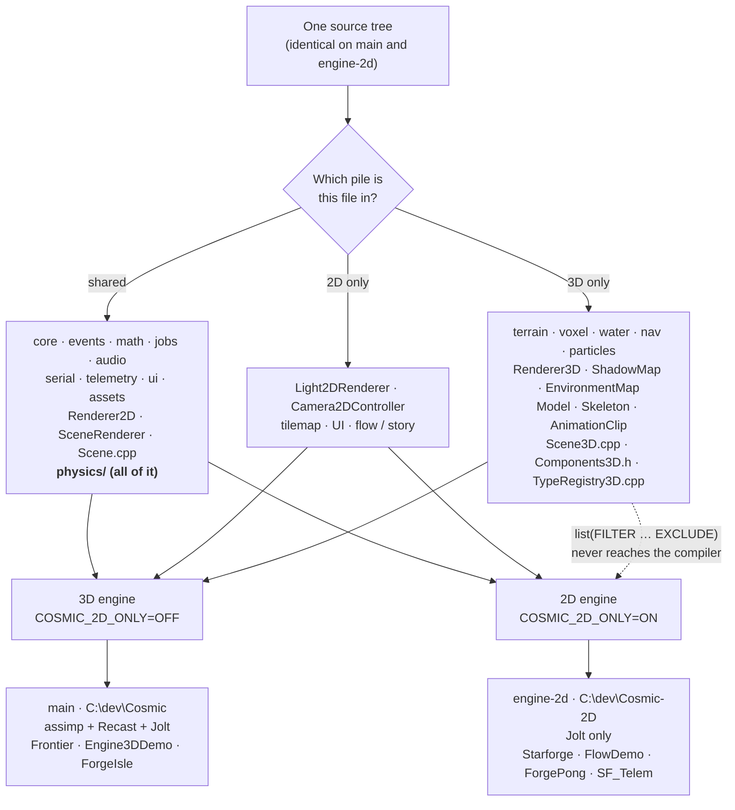

# The 2D / 3D Build Split — How It Works

**One-liner:** one source tree builds two engines — the full 3D engine and a pure-2D engine that
never compiles terrain, voxels, water, navigation, particles or the 3D renderer — selected by a
single CMake flag, with **byte-identical tracked files on both branches**.
**Source:** root `CMakeLists.txt`, `Cosmic/CMakeLists.txt`, `CMakePresets.json`, `build_2d.bat` / `build_3d.bat` / `build_all_2d.bat`, `Projects/Starforge/CMakeLists.txt`, `tests/CMakeLists.txt`
**API Reference:** README [§1.5](../../README.md#15-command-reference--every-command) (the command contract) · **Guide:** [`../guide/building-and-shipping.md`](../guide/building-and-shipping.md), root README [§1.6](../../README.md#16-the-two-engine-configurations)

> Written by work order **D41** (Phase 29 W10, 2026-07-25). The design record and the full
> work-order history are in [`../plans/28-phase29-engine-split-plan.md`](../plans/28-phase29-engine-split-plan.md);
> this document is the standing explainer.

---

## 1. Overview — what and why

Cosmic grew up as a 3D engine. Its 2D features — sprites, sprite animation, tilemaps, 2D lights,
canvas UI, flow and story graphs, the 2D camera rig — were all built *later*, and they were built
**inside files shared with 3D**: one `Scene.cpp`, one `Components.h`, one `SceneRenderer`. Nothing
about 2D was broken; 2D simply had no independent existence. Making a small 2D game meant dragging
terrain, voxels, water, navmesh baking, mesh import and the entire 3D render pipeline through the
compiler and into the shipped DLL.

Phase 29 gave 2D its own build. Turning on one flag, `COSMIC_2D_ONLY`, produces an engine that:

- **does not compile** the terrain, voxel, water, navigation or particle source trees,
- **does not compile** `Renderer3D` and the GPU resources only it owns (shadow maps, the IBL
  environment cube, the coverage capture, the instancing pool),
- **never even configures** two large vendored dependencies — assimp (159 translation units) and
  recastnavigation (26),
- skips the three 3D flagship projects, and
- still boots the Starforge editor, still runs physics, still ships SF_Telem.

The result is a genuinely smaller engine, not a 3D engine with its 3D features hidden. It is also
**not a different codebase**: every tracked file is identical on both branches. The only things
that differ are the build cache and which preset you pick.

**The honest headline about speed.** The split was justified partly on build time, and it does cut
it — but far less than the parallel-compilation flag we found while measuring it. The numbers are
in [§4.6](#46-the-recorded-build-times); read them before quoting a figure at anyone.

---

## 2. Mental model

Think of the engine source as a deck of cards where every card is already sorted into one of three
piles — **shared**, **2D**, **3D** — *before* anyone decides which game to play. Building the 3D
engine deals every pile. Building the 2D engine deals the shared and 2D piles and leaves the 3D
pile in the box.

The sorting is the hard part, and it happened **on the trunk**, in the 3D build, one work order at
a time (`Components.h` → `Components3D.h`, `Scene.cpp` → `Scene3D.cpp`, `TypeRegistry.cpp` →
`TypeRegistry3D.cpp`). Only once every file belonged to exactly one pile did the flag get to mean
anything. That order — *partition first, flag second* — is why the 3D build never regressed a pixel
during the whole phase.



The dotted arrow is the whole mechanism: **exclusion at the CMake source-list level**, not
`#ifdef`-ing out the body of a file. A file that belongs to 3D is simply not handed to the
compiler.

---

## 3. How it works, step by step

### Configuring

```bash
cmake -S . -B build -A x64 -DCOSMIC_2D_ONLY=ON
```

or, equivalently, `cmake --preset 2d`. Then:

1. **Root `CMakeLists.txt`** declares `COSMIC_2D_ONLY` before `add_subdirectory(Cosmic)`, so the
   flag is in the cache before anything reads it.
2. **`Cosmic/CMakeLists.txt`** decides which vendored dependencies to configure at all. In 2D mode
   `add_subdirectory(dependencies/recastnavigation)` and the assimp block never run — those 185
   translation units do not exist in the generated solution.
3. The engine's source GLOB is then filtered: one `list(FILTER … EXCLUDE REGEX …)` per row of the
   exclusion table, in table order.
4. `COSMIC_2D_ONLY` is added as a **PUBLIC** compile definition on the `Cosmic` target, so the
   editor, every project and the test binary see exactly the same value the engine was built with.
5. The root project scanner skips `Frontier`, `Engine3DDemo`, `ForgeIsle` and `ViperSim`.
6. `tests/CMakeLists.txt` drops the 3D-only test tier.

### Building

`cmake --build build --config Release --parallel`, or the `.bat` wrappers. The 2D solution has
**50 `.vcxproj` targets against the 3D solution's 78**, and compiles **347 translation units
against 572** — a 39 % cut in work.

### Running

The 2D editor boots into 2D mode with `m_Mode2D` pinned on. The View ▸ View Mode submenu drops the
3D-only entries, the 3D panels are gone, and physics colliders draw through a **Renderer2D**
overlay instead of `Renderer3D`'s debug lines (which do not exist in this build).

---

## 4. Technical implementation

### 4.1 The flag

Declared twice, deliberately:

```cmake
# root CMakeLists.txt — ahead of add_subdirectory(Cosmic)
option(COSMIC_2D_ONLY "Build the 2D-only engine (excludes all 3D subsystems)" OFF)
option(COSMIC_WITH_JOLT "Build the Jolt physics backend" ON)
```

and again in `Cosmic/CMakeLists.txt` so that directory still configures standalone (`option()` is a
no-op once the cache entry exists). It reaches consumers through one generator expression:

```cmake
# Cosmic/CMakeLists.txt
target_compile_definitions(Cosmic PUBLIC $<$<BOOL:${COSMIC_2D_ONLY}>:COSMIC_2D_ONLY>)
```

**PUBLIC is the load-bearing word.** Every other engine define (`COSMIC_BUILD_DLL`,
`COSMIC_WITH_JOLT`, `COSMIC_WITH_ASSIMP`, `COSMIC_DIST`) is PRIVATE, because it changes only what
the engine compiles. `COSMIC_2D_ONLY` changes the *shape of public headers* — `Cosmic.h`,
`Components.h`, `SceneRenderer.h`, `Scene.h`, `ScriptableEntity.h` all carry fences — so a consumer
that disagreed with the engine about the flag would silently build against a different ABI. In the
3D configuration the macro is not defined at all, so `#ifndef COSMIC_2D_ONLY` is the natural
polarity everywhere.

### 4.2 What the 2D build excludes

| Category | Excluded when `COSMIC_2D_ONLY=ON` |
|---|---|
| Engine dirs | `src/terrain/`, `src/voxel/`, `src/water/`, `src/nav/`, `src/particles/` |
| `renderer/` | `Renderer3D.*`, `EnvironmentMap.*`, `ShadowMap.*`, `CoverageCapture.*`, `InstanceSet.*` |
| `graphics/` | `Model.*`, `Skeleton.*`, `AnimationClip.*`, `CgltfImpl.cpp` — Mesh/Material/Buffer/Font/Gizmo/Texture/Shader **stay** (generic GPU infrastructure) |
| `camera/` | `NavigationCube.*` — its `Render()` calls `Renderer3D` directly, and a 2D viewport has no use for an orientation cube |
| `scene/` | `Scene3D.cpp`, `Components3D.h`, `SceneNav.*`, `ScenePicker.*`, `WorldSystemRecipes.*` |
| `reflect/` | `TypeRegistry3D.cpp` |
| `assets/` | `MeshImport.cpp` (`AssetLibrary` stays; `MeshImport.h` stays visible so fences read the same in both configurations) |
| Vendored | **assimp (159 TUs)** and **recastnavigation (26 TUs)** — `add_subdirectory` never runs. **Jolt (133 TUs) stays.** |
| Projects | `Frontier`, `Engine3DDemo`, `ForgeIsle`, `ViperSim` (root-scanner skip list) |
| Starforge TUs | `panels/VoxelPanel.*`, `panels/WorldSystemsPanel.*`, `editors/AnimationEditor.*` |
| Tests | The 3D tier in `tests/CMakeLists.txt` — 22 files, including every nav, voxel, mesh-import, skeletal and 3D-renderer suite plus the two partition baselines |

The exclusion block itself is written **one `list(FILTER)` per table row, in table order**, so the
table and the CMake stay auditable against each other:

```cmake
if(COSMIC_2D_ONLY)
    list(FILTER COSMIC_SOURCES EXCLUDE REGEX "/src/(terrain|voxel|water|nav|particles)/")
    list(FILTER COSMIC_SOURCES EXCLUDE REGEX "/src/renderer/(Renderer3D|EnvironmentMap|ShadowMap|CoverageCapture|InstanceSet)\\.")
    list(FILTER COSMIC_SOURCES EXCLUDE REGEX "/src/graphics/(Model|Skeleton|AnimationClip|CgltfImpl)\\.")
    list(FILTER COSMIC_SOURCES EXCLUDE REGEX "/src/camera/NavigationCube\\.")
    list(FILTER COSMIC_SOURCES EXCLUDE REGEX "/src/scene/(Scene3D|Components3D|SceneNav|ScenePicker|WorldSystemRecipes)\\.")
    list(FILTER COSMIC_SOURCES EXCLUDE REGEX "/src/reflect/TypeRegistry3D\\.")
    list(FILTER COSMIC_SOURCES EXCLUDE REGEX "/src/assets/MeshImport\\.cpp$")
endif()
```

**The GLOB has no `CONFIGURE_DEPENDS`.** Adding or removing an engine source file requires an
explicit reconfigure, not just a rebuild. This predates the split and applies to both
configurations.

### 4.3 What the 2D build *keeps* — and why physics is the interesting one

`src/physics/` ships **in full** on both configurations. That was a deliberate decision, and it
deleted a large amount of originally-planned fencing work: `Scene`'s physics block,
`ScenePhysics`, `PlayerLayer`'s and `StarforgeApp`'s by-value `PhysicsWorld` members, the
`Physics()` and `Character()` script proxies, and five of the six `test_physics_*` suites are all
**unfenced and unchanged**. Rigid bodies, box/sphere/capsule colliders and the character controller
are dimension-agnostic; a 2D game that wants gravity and collisions gets the real thing.

Only the genuinely-geometric collider paths are fenced inside `ScenePhysics.cpp`: the primitive
mesh data, the mesh-collider branch, the terrain heightfield branch and the whole voxel chunk-body
system. `MeshCollider` and `TerrainCollider` are 3D-only; everything else survives.

Two consequences follow from that:

- **`PhysicsWorld::DebugDraw()` is a no-op in 2D**, because it draws through `Renderer3D`. The 2D
  editor therefore ships its own collider overlay — `ViewportController::DrawColliderOverlay2D`,
  which projects Box/Sphere/Capsule shapes onto XY and draws them with `Renderer2D::DrawRect` /
  `DrawLine`, alongside the existing 2D pixel grid.
- **Physics is where the "write your own" story lives.** `COSMIC_WITH_JOLT` is orthogonal to
  `COSMIC_2D_ONLY`; a 2D app can turn Jolt off entirely and register its own XY solver. See
  [`physics-backends.md`](physics-backends.md).

`SceneRenderer` also stays outside the fence. Both configurations composite through the same
HDR → tonemap → overlay spine; the 3D passes inside it are fenced individually rather than the
whole orchestrator being duplicated.

### 4.4 The classification rule for new code

When you add a file, ask these in order. The first "yes" wins.

| # | Question | Verdict |
|---|---|---|
| 1 | Does it `#include` anything under `terrain/`, `voxel/`, `water/`, `nav/`, `particles/`, or `renderer/Renderer3D.h` / `ShadowMap.h` / `EnvironmentMap.h` / `CoverageCapture.h` / `InstanceSet.h` / `graphics/Model.h` / `graphics/Skeleton.h`? | **3D.** Add it to the `list(FILTER)` block. |
| 2 | Does its *behaviour* only make sense with a third axis — meshes, skinning, a perspective frustum, heightfields? | **3D.** |
| 3 | Does it only make sense in a flat world — tilemaps, sprite sorting, canvas layout, a 2D light? | **2D**, which in practice means *shared*: it compiles in both, it just does nothing useful in 3D. There is no "2D-only exclusion list", and there does not need to be one. |
| 4 | Otherwise | **Shared.** Compile it in both. |

Two rules that override the table:

- **Prefer whole-file classification over in-file fences.** A file the 2D build excludes has zero
  compile cost; a file full of `#ifndef COSMIC_2D_ONLY` has full parse cost and two code paths to
  keep honest. Fences are for the handful of *shared* files that genuinely must mention both worlds
  — the umbrella header, the component header, the serializer, `SceneRenderer`, `ScenePhysics`, and
  the editor's panels.
- **If a public header changes shape under the flag, the flag must stay PUBLIC and the header must
  be fenced identically for every consumer.** Never fence a public header on a PRIVATE define.

A file that lands on the wrong side fails **loudly, in the 3D build**, because the 3D build
compiles both paths continuously. That asymmetry is intentional: 3D is the trunk, and a mis-fence
is a compile error there rather than a silent behaviour change.

### 4.5 Build scripts, presets and the worktree

All scripts ship **identically on both branches** — there is no divergence, ever.

| Script | Behaviour |
|---|---|
| `build.bat [Debug\|Release]` | **Mode-preserving.** Reads `COSMIC_2D_ONLY` out of `build\CMakeCache.txt` with `findstr` and echoes `[MODE] 2D-only engine` or `[MODE] full 3D engine`. It never *forces* the value. |
| `build_all.bat [Debug\|Release]` | Same echo, on a clean rebuild. |
| `build_engine.bat [Debug\|Release]` | Same echo, engine-only. |
| `build_2d.bat [Debug\|Release]` | **Mode setter.** Reconfigures with `-DCOSMIC_2D_ONLY=ON` whenever the cache is absent or says OFF, then builds. |
| `build_3d.bat [Debug\|Release]` | The symmetric setter (`-DCOSMIC_2D_ONLY=OFF`) — switching a tree back is one command. |
| `build_all_2d.bat [Debug\|Release]` | Clean full build in 2D mode (mirrors `build_all.bat`). |

The CMake cache is sticky, which is the point: **run `build_2d.bat` once in a tree, and plain
`build.bat` stays fast there forever.** All of these end in `pause`; that is what makes them
double-clickable, and exactly why an automated session must never invoke them (drive `cmake.exe`
directly instead — root README §1.5 and the roadmap's working agreement have the recipe).

`CMakePresets.json` offers the same two configurations to IDEs:

```bash
cmake --preset default   # full 3D engine
cmake --preset 2d        # 2D-only engine
```

**Both presets use the same `binaryDir`: `${sourceDir}/build`.** This is not an oversight — it is
forced. `COSMIC_SDK_DIR` is the *source* directory, and every target writes to
`${COSMIC_SDK_DIR}/build/Runtime/$<CONFIG>`, so a second binary directory inside the same source
tree would clobber the first one's `Cosmic.dll`. **The mechanism for having both configurations
built at once is a git worktree, not a second build folder:**

```
C:\dev\Cosmic       branch main        →  3D configuration  →  C:\dev\Cosmic\build
C:\dev\Cosmic-2D    branch engine-2d   →  2D configuration  →  C:\dev\Cosmic-2D\build
```

Created once with:

```bash
git worktree add ../Cosmic-2D engine-2d
```

### 4.6 The recorded build times

These are measurements, not estimates. Clean Release builds (deleted `build/`, configure + build),
16 logical cores, same machine, same session.

**The authoritative table** — measured on the post-W9 tree:

| Configuration | without `/MP` | with `/MP` | cut |
|---|---|---|---|
| 3D (`C:\dev\Cosmic`) | 546.4 s | **169.4 s** | **−69.0 %** |
| 2D (`C:\dev\Cosmic-2D`) | 411.7 s | **123.1 s** | **−70.1 %** |

Derived from the same four runs:

| Comparison | Result |
|---|---|
| The 2D partition alone, no `/MP` (546.4 → 411.7) | **−24.7 %** — the honest "split only" number |
| The 2D partition measured on top of `/MP` (169.4 → 123.1) | **−27.3 %** |
| `/MP` alone, 3D (546.4 → 169.4) | **−69.0 %** |

Earlier points on the same curve, for the record:

- **W2 (2026-07-25), pre-split, pre-`/MP`, 3D:** 497.1 s on a fresh `build/`, configure + Release.
  That was the baseline the split was aimed at. It is lower than the 546.4 s above because the
  tree grew ~80 test cases and a whole render-test target between W2 and W9.
- **W8, immediately after the branch cut:** the partition measured **−20.3 %**, and with `/MP`
  freshly added, 3D 169.9 s → 2D 108.1 s (**−36.4 %**).

**Two things a reader should take away, in this order.**

**First: `/MP` was worth roughly 2.8× the entire engine split, and it cost no functionality.**
Before Phase 29 W8 measured it, `/MP` appeared in exactly one place in the whole build —
`Cosmic/dependencies/assimp/CMakeLists.txt`. Every other target, the engine included, compiled its
translation units *strictly serially*. `cmake --build --parallel` does not compensate: on the
Visual Studio generator it gives MSBuild parallel **projects**, not parallel **files**, and this
build is a deep dependency chain of relatively few projects. The fix is one line at MSVC scope in
the root `CMakeLists.txt`, ahead of every `add_subdirectory`:

```cmake
add_compile_options(/MP)
```

**Do NOT express this as `-DCMAKE_CXX_FLAGS=/MP`.** That *replaces* CMake's MSVC defaults
(`/DWIN32 /D_WINDOWS /EHsc`), silently disabling exceptions — which surfaces as 222 doctest
static-assert failures rather than anything that mentions flags. `add_compile_options` appends.

**Second: the partition itself came in at −24.7 %, against a 40–55 % target.** It is reported that
way rather than quietly rounded up. The shortfall is *not* the partition failing to exclude what it
claimed — the TU count really does drop 572 → 347 and neither assimp nor Recast is configured. Wall
time simply did not track TU count, because the split removed *the cheapest translation units per
unit of wall-clock* while leaving every serial bottleneck (Jolt's 133, the engine's ~100, Starforge,
`CosmicTests`) intact.

**A caveat that matters going forward.** With `/MP` on, the build is governed by the **critical
path**, not by total work. In 3D, assimp and Jolt still dominate and new test files disappear into
parallel slack. In 2D, assimp is gone, `CosmicTests` sits much closer to the critical path, and new
test files land *on* it. That is why the split's on-top-of-`/MP` figure moved from −36.4 % (W8) to
−27.3 % (post-W9) while the 3D number barely twitched (169.9 → 169.4 s). **Expect the 2D
clean-build figure to stay sensitive to test-suite growth in a way the 3D figure is not.**

Other levers, measured but not adopted: `COSMIC_WITH_JOLT=OFF` took the pre-`/MP` 2D tree from
387.7 s to 284.0 s (−27 %), and `/MP` + Jolt-off together reached 97.1 s. Turning Jolt off costs a
feature, so it stays available rather than adopted.

Incremental-build times were not recorded as part of the phase; only clean builds are quoted here.

### 4.7 The branch layout and the carry-over workflow

| Branch | Configuration | Worktree | CI |
|---|---|---|---|
| `main` | 3D (`COSMIC_2D_ONLY=OFF`) | `C:\dev\Cosmic` | `.github/workflows/ci.yml` watches `main`, 3D config only |
| `engine-2d` | 2D (`COSMIC_2D_ONLY=ON`) | `C:\dev\Cosmic-2D` | none — deliberately untouched |
| `phase-7-3d-foundations` | historical pointer | — | — |

`main` is the trunk. `engine-2d` was cut from it and holds **byte-identical tracked files**.

**Carrying a change across is copying a file.** Same path, same content, on both branches:

```bash
# from the 2D worktree, pull in a fix that landed on main
git merge main
```

`git merge` works and is near-conflict-free *by construction* — but nothing in the design depends
on it. Copying the file over, building, testing and committing is equally valid. This is the entire
payoff of flag-after-partition over deleting the 3D code on `engine-2d`: git treats
*modified-on-main / deleted-on-2d* as a conflict, per file, forever.

**The one invariant that keeps this true:** nothing may be branch-conditional except the build
cache and the preset choice. Any file that *must* differ between the branches is a design bug —
fix it with a flag, not with a divergent file.

### 4.8 Cross-build data safety

A 3D scene opened by the 2D engine does not lose its 3D data. `OpaqueComponentsComponent`
(`scene/Components.h`) stores any component block whose type was not registered at load time as
verbatim `(name → JSON text)` and re-emits it unchanged on save. Since `TypeRegistry3D.cpp` is the
file that registers the 3D components, and the 2D build does not compile it, every 3D block lands
in the opaque store and round-trips byte-for-byte. `tests/test_crossbuild_scene.cpp` asserts this in
both directions and runs in both suites.

### 4.9 The test suites

`tests/CMakeLists.txt` hand-lists two tiers. The **shared tier** compiles under both
configurations; several of its files carry in-file `COSMIC_2D_ONLY` fences around individual cases
that reach for a 3D component, but the file itself stays in both suites. The **3D tier** — nav,
voxel, mesh-import, skeletal, 3D-renderer, terrain-collision and the two partition-baseline suites
— leaves the build outright rather than becoming empty translation units.

Current counts: **3D 513/513, 2D 340/340**, both Debug and Release, zero warnings, GL conformance
clean in both.

The golden-image target `CosmicRenderTests` (`COSMIC_BUILD_RENDER_TESTS=ON`, local-only — it needs
a real GPU) runs in both configurations too. The 3D build runs all **14** cases against the 14
committed PNGs; the 2D build runs the **6** cases in `render_2d.cpp` — 5 goldens (`sprites`,
`tilemap`, `light2d`, `ui`, `scene2d`) plus one byte-exact A/B pair — **against the same PNGs the
3D build captured.** That shared baseline is the strongest single check that the partition changed
no behaviour. **A golden that drifts means a fence is wrong. Never update the golden to make it
pass.**

---

## 5. Design decisions & trade-offs

**Flag-after-partition, not deletion.** Deleting the 3D code on `engine-2d` would have made every
future cross-branch change a per-file merge conflict, forever, plus manual reconstruction of
context on every carry-over. Identical files on both branches is worth a compile flag.

**Flag-after-*partition*, not a bare flag.** A "2D preset" that still compiled every 3D TU would
have bought no build-time win and no honest separation. The partition is the deliverable; the flag
just harvests it.

**PUBLIC compile definition.** See [§4.1](#41-the-flag) — public headers change shape, so consumers
must agree with the engine or the ABI silently diverges.

**Jolt on both branches.** Physics is dimension-agnostic, and keeping it shared removed a large
amount of planned fencing. The cost is 133 vendored TUs the 2D build still pays for; the mitigation
is that `COSMIC_WITH_JOLT=OFF` is a supported configuration, not a bluff — the null backend keeps
the engine linking and an app can register its own solver.

**Particles are excluded from the 2D build in v1.** `ParticleEmitterComponent` still round-trips
opaquely, so authored scenes are safe. A 2D-native particle path is future work
([`../plans/FEATURE-MATRIX.md`](../plans/FEATURE-MATRIX.md)).

**CI untouched.** GitHub Actions keeps watching `main` with the 3D configuration only. The 2D
configuration is verified locally, every phase, by the same recipe. Adding a second CI matrix leg
is a reasonable future change and was deliberately kept out of the refactor's scope.

**The build-time target was missed and said so.** The plan predicted 40–55 %; the partition
delivered 24.7 %. Reporting that plainly is what surfaced the far larger `/MP` finding, which a
rounded-up number would have buried.

---

## 6. Limits & future work

- **ViperSim does not build against the 2D engine.** Its `FlightScreen` and `ReplayScreen` draw the
  airframe, pad, grid, axes and trail with direct `Renderer3D` calls, so it is on the 2D skip list.
  The original decision was that ViperSim ships on both branches; honouring that needs a Renderer2D
  rewrite of those two screens. **Open follow-up.**
- **No 2D-native particle system.** Excluded in v1, opaque-preserved in scenes, unplanned as of
  this writing.
- **`NavigationCube` is 3D-only.** A 2D viewport arguably wants no orientation widget at all, but if
  one is ever wanted it needs a Renderer2D implementation.
- **`NavigationCube`'s include in `Cosmic.h` is not fenced** (found by D53). Every other 3D-only
  header the umbrella pulls in — `graphics/Model.h`, `assets/MeshImport.h`, `scene/Components3D.h`,
  `scene/ScenePicker.h` — sits inside `#ifndef COSMIC_2D_ONLY`; `camera/NavigationCube.h`
  (`Cosmic.h:91`) does not. Its dependencies (`FrameBuffer.h`, `Mesh.h`,
  `OrbitCameraController.h`) all survive the 2D filter, so the header compiles cleanly and a
  `NavigationCube::Create(...)` call fails at **link** time with an unresolved external instead of
  at compile time with a clear message. One-line fix; a Phase 30 candidate.
- **No CI leg for the 2D configuration.** Verified locally, every phase.
- **Incremental build times were never recorded.** Only clean builds are measured here; the
  header-partition win (`Components.h` no longer dragging `Skeleton.h` / `AnimationClip.h` /
  `ParticleSystem.h` into every consumer) is therefore argued rather than quantified.
- **The 2D clean-build figure will drift with the test suite** — see the critical-path caveat in
  [§4.6](#46-the-recorded-build-times). Re-measure before quoting it in a later phase.

---

*See also:* [`physics-backends.md`](physics-backends.md) (the swappable physics seam this phase
also delivered) · [`build-plugin-packaging.md`](build-plugin-packaging.md) (CMake layout, plugin
DLLs, packaging) · [`../plans/28-phase29-engine-split-plan.md`](../plans/28-phase29-engine-split-plan.md)
(the full work-order record, including the deviation log).

*Changelog:*
*2026-07-25 — created (D41, Phase 29 W10).*
