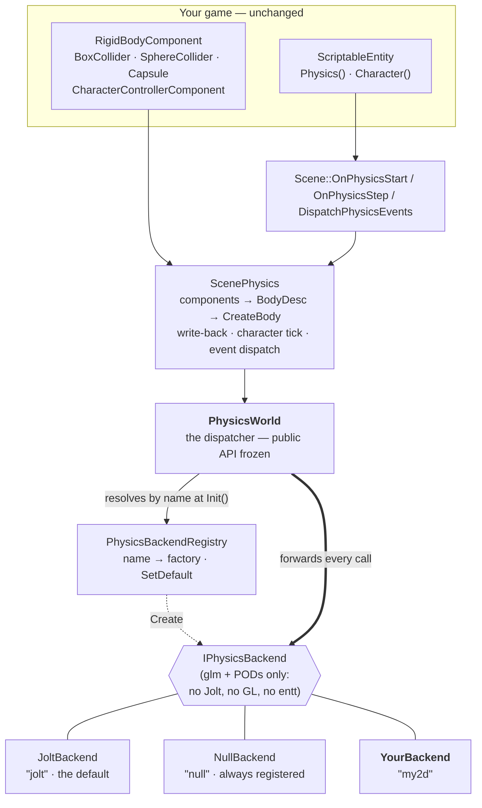

# Pluggable Physics Backends — How It Works

**One-liner:** `PhysicsWorld` is a dispatcher, not a simulator — it forwards every call to one
`IPhysicsBackend` resolved by name at `Init`, so an app can register and select its own physics
implementation without a single call site moving.
**Source:** `Cosmic/src/physics/` (`PhysicsBackend.{h,cpp}`, `PhysicsWorld.{h,cpp}`, `PhysicsTypes.h`, `PhysicsBody.h`, `CharacterController.h`, `ScenePhysics.{h,cpp}`, `backends/JoltBackend.cpp`, `backends/NullBackend.cpp`)
**API Reference:** [../reference/physics.md](../reference/physics.md) · **Guide:** root README §15 (ECS), §23 (scenes)

> Written by work order **D42** (Phase 29 W10, 2026-07-25). Design record:
> [`../plans/28-phase29-engine-split-plan.md`](../plans/28-phase29-engine-split-plan.md) §6.
> The complete worked example is a real, compiled, tested file:
> [`tests/test_physics_backend.cpp`](../../tests/test_physics_backend.cpp).

---

## 1. Overview — what and why

Cosmic's physics is [Jolt](https://github.com/jrouwe/JoltPhysics) — a fast, mature rigid-body
engine. That is the right default, and it stays the default. But "the engine ships one simulator,
take it or leave it" is a bad deal for a specific kind of project: a 2D game that wants
Box2D-flavoured behaviour on the XY plane; a simulation that needs a bespoke integrator it can
verify; a tool that wants physics turned off entirely without ripping components out of its scenes.

So physics grew a **seam**. There is now one interface, `IPhysicsBackend`, that describes
everything the engine asks a simulator to do. `PhysicsWorld` — the class the editor, the standalone
player and every script already talk to — no longer *is* the simulator. It holds one backend and
forwards.

Three things fall out of that, and they are the whole point:

1. **`PhysicsWorld`'s public API did not change by one character.** No call site moved, no gameplay
   script changed, no scene file changed. The editor's Play button, the Inspector, serialization and
   the `Physics()` script proxy are all untouched.
2. **Registering your own backend is two lines**, and everything above it — components, colliders,
   the scene binding, contact events reaching `OnCollisionEnter` — keeps working.
3. **`COSMIC_WITH_JOLT=OFF` became a real configuration**, not a bluff. A null backend is always
   registered, so the engine still links, still loads scenes with physics authored into them, and
   still runs.

---

## 2. Mental model

This is the same shape the renderer already uses. `RenderCommand` is not OpenGL; it is a thin
forwarder over a `RendererAPI` implementation. `PhysicsWorld` is `RenderCommand`;
`IPhysicsBackend` is `RendererAPI`.

The crucial design choice is that **`PhysicsWorld` is a dispatcher, not an abstract base class.**
Making it abstract would have been the obvious move — and it would have forced
`PlayerLayer::m_Physics` and `StarforgeApp::m_Physics`, both held *by value*, onto
`unique_ptr<IPhysicsWorld>` plus a factory, and dragged every call site with them. Dispatching
instead keeps `PhysicsWorld` concrete, copy-deleted, by-value constructible, and exactly as
`#include`-cheap as it was: `PhysicsWorld.h` forward-declares `IPhysicsBackend` and holds a
`unique_ptr` to it, which is the same compile-time firewall the old pimpl gave.



Everything above the `IPhysicsBackend` line is engine code you do not touch. Everything below it is
replaceable.

---

## 3. How it works, step by step

### Registering and selecting

In your project layer's `OnAttach`, **before any Play session starts**:

```cpp
Cosmic::PhysicsBackendRegistry::Register("my2d",
    []{ return std::make_unique<My2DPhysics>(); });
Cosmic::PhysicsBackendRegistry::SetDefault("my2d");
```

`SetDefault` is process-wide: it changes what an empty `PhysicsSettings::Backend` resolves to.
If you would rather choose per world, skip `SetDefault` and name it at `Init`:

```cpp
Cosmic::PhysicsSettings ps;
ps.Backend = "my2d";
world.Init(ps);
```

That is the entire integration.

### What happens at `Init`

1. `PhysicsWorld::Init` calls `Shutdown()` first — an `Init` on a live world *restarts* it, which
   is what the editor's play/stop cycle relies on.
2. It calls `RegisterBuiltinPhysicsBackends()`, which registers `"null"` always and `"jolt"` when
   the engine was built with `COSMIC_WITH_JOLT`. It is idempotent (a function-local static) and it
   **does not touch the default**, so a `SetDefault` you made at layer-attach time survives.
3. It resolves a name: `settings.Backend` if non-empty, otherwise `PhysicsBackendRegistry::Default()`.
4. It calls `PhysicsBackendRegistry::Create(name)`. **An unregistered name is not fatal** — it logs
   `CS_CORE_ERROR` and falls back to `"null"`, so a typo degrades to "no physics" rather than a dead
   world or a crash.
5. It calls `backend->Init(settings)` and keeps the `unique_ptr`.

### What happens each frame

The fixed-step chain is the same on every backend:

```
PlayerLayer::OnFixedUpdate (or the editor's play session)
  │
  ├─ ScriptHost::FixedTick(dt)        scripts' OnFixedUpdate
  ├─ Scene::OnPhysicsStep(dt)  ──►  ScenePhysics::Step(dt)
  │                                   1. push kinematic targets  (MoveKinematic)
  │                                   2. backend Step(dt)        ← exactly once
  │                                   3. write dynamic transforms back into the ECS
  │                                   4. tick character controllers
  └─ Scene::DispatchPhysicsEvents  ──►  DrainContactEvents  →  OnCollisionEnter/Exit,
                                                                OnTriggerEnter/Exit
```

Between construction and `Init`, and again after `Shutdown`, `m_Backend` is null — and **every
forward tolerates that**. `CreateBody` returns an invalid handle, `GetStatistics` returns zeros,
`Step` does nothing, out-parameters are left alone. Using a `PhysicsWorld` before `Init` is a valid
(if pointless) state, not undefined behaviour.

---

## 4. Technical implementation

### 4.1 `IPhysicsBackend`

Declared in `physics/PhysicsBackend.h`. It mirrors `PhysicsWorld`'s public surface **1:1** —
lifecycle, bodies, velocities and forces, queries, characters, events, statistics, debug draw.
Every parameter is `PhysicsTypes.h` / `PhysicsBody.h` vocabulary: glm vectors and quaternions plus
plain structs. **No Jolt type, no GL type, no entt type appears anywhere in the interface.** That is
what makes "write your own physics for one app" a real offer rather than a slogan.

The defaulted arguments (`layerMask = 0xFFFF`, `ignoreEntity = 0`) live on `PhysicsWorld`, so every
parameter on the interface is explicit. Signature groups:

| Group | Methods |
|---|---|
| Identity | `Name()` |
| Lifecycle | `Init` · `Shutdown` · `IsInitialized` · `Step` |
| Bodies | `CreateBody` · `DestroyBody` · `Set/GetBodyTransform` · `MoveKinematic` |
| Motion | `Set/GetLinearVelocity` · `Set/GetAngularVelocity` · `AddForce` · `AddImpulse` · `AddTorque` · `IsActive` · `Activate` |
| Queries | `RayCast` · `SphereCast` · `OverlapSphere` · `OverlapBox` |
| Characters | `CreateCharacter` · `DestroyCharacter` · `UpdateCharacter` · `Get/SetCharacterTransform`-family · `IsCharacterGrounded` · `GetCharacterGroundNormal` · `GetCharacterVelocity` |
| Events | `DrainContactEvents` |
| Introspection | `GetStatistics` |
| Debug | `DebugDraw` |

Per-call semantics are in [`../reference/physics.md`](../reference/physics.md).

### 4.2 The registry

```cpp
class COSMIC_API PhysicsBackendRegistry
{
public:
    using Factory = std::function<std::unique_ptr<IPhysicsBackend>()>;

    static void Register(std::string name, Factory factory);
    static bool Has(const std::string& name);
    static std::vector<std::string> Names();          // sorted
    static void SetDefault(const std::string& name);
    static const std::string& Default();
    static std::unique_ptr<IPhysicsBackend> Create(const std::string& name);   // nullptr if absent
};
```

Three implementation facts worth knowing:

- **The map is a function-local static** (a Meyers singleton) inside `PhysicsBackend.cpp`. Across a
  DLL boundary that removes any static-initialization-order question — the map is constructed on
  first use, whoever gets there first.
- **Built-in registration is an explicit call**, `RegisterBuiltinPhysicsBackends()`, not a
  file-scope registrar object, for exactly the same reason. `PhysicsWorld::Init` makes the call so
  an app never has to.
- **The default name is a build-time fact**, initialised to `"jolt"` under `COSMIC_WITH_JOLT` and
  `"null"` otherwise, and registration never mutates it. `SetDefault` accepts a name that is not
  registered *yet* (it warns and stores it), because an app may legitimately set the default before
  the DLL that registers the factory has loaded.
- **It is not thread-safe, by design.** Registration happens at layer-attach time on the main
  thread, long before any Play session steps.

### 4.3 `PhysicsSettings::Backend`

```cpp
struct PhysicsSettings
{
    glm::vec3 Gravity{ 0.0f, -9.81f, 0.0f };
    uint32_t  MaxBodies             = 10240;
    uint32_t  MaxBodyPairs          = 65536;
    uint32_t  MaxContactConstraints = 20480;
    int32_t   ThreadCount = -1;
    std::string Backend;          // ABI-appended in Phase 29 W3
};
```

Empty ⇒ `PhysicsBackendRegistry::Default()`. Unknown ⇒ logged error, falls back to `"null"`. The
field was **appended** to the struct, so existing aggregate initialisation and every existing call
site are unaffected.

### 4.4 The contracts a backend must honour

These are not suggestions. The engine, the editor and the test suite all depend on them.

**1 — The fixed-step rule.** `Step()` is called exactly once per accumulated fixed-dt, **after**
scripts' `OnFixedUpdate` and **before** transform write-back and event dispatch. Never integrate
from a variable-rate `OnUpdate`. The sequencing is `ScenePhysics::Step`'s, and is documented in
`ScenePhysics.h`'s header block:

```
kinematic targets pushed  →  backend Step(fixedDt)  →  dynamic write-back  →  character tick
```

A backend that internally sub-steps is fine; a backend that decides how much time has passed is
not. `fixedDt` is the truth.

**2 — `DrainContactEvents` moves *and* clears.** Every event is reported exactly once, never twice.
The dispatcher clears the caller's vector before forwarding, so an out-parameter arriving with old
contents is not your problem — but emptying your own queue is:

```cpp
void DrainContactEvents(std::vector<ContactEvent>& out) override
{
    out.clear();
    out.swap(m_Events);   // move AND clear — the contract
}
```

**3 — `ThreadCount == 0` means single-threaded and deterministic.** Honour it, **or document that
you ignore it.** Ignoring it is allowed; ignoring it silently is not.

- `-1` (the default) means *auto*: the Jolt backend uses `min(hardware_concurrency() - 1, 4)`.
- `0` means single-threaded. `tests/test_physics_determinism.cpp` pins `ThreadCount = 0` and
  asserts two runs produce **bit-identical** transforms. If your backend claims 0 and cannot deliver
  that, it will fail a real test, not a doc comment.
- `TinyPhysics` in `test_physics_backend.cpp` is deterministic anyway and states in a comment that
  it ignores the field — that is the compliant way to opt out.

**4 — `RayHit::EntityId` round-trips `BodyDesc::EntityId`.** The engine hands you the owning
entity's UUID when it creates a body; a query that hits that body must hand the same value back.
Everything downstream — `Physics().RayCast` in a script resolving a hit to an `Entity`, the
"don't hit myself" `ignoreEntity` filter, contact events naming their participants — depends on
this single round-trip. `EntityId == 0` means "no entity"; `RayHit` default-constructs to
`{ EntityId = 0, Hit = false }`.

**5 — Out-parameters on a miss are left as the caller passed them.** `GetBodyTransform` on an
unknown handle writes nothing. `ScenePhysics` seeds its locals before calling for exactly this
reason. The two vector-filling queries and `DrainContactEvents` are cleared **by the dispatcher**,
so the "always cleared" guarantee holds for every backend, including ones that forget.

**6 — Contact-event conventions.** For `TriggerEnter` / `TriggerExit`, `EntityA` is the **sensor's**
entity and `EntityB` is the entity that entered it. For `CollisionEnter` / `CollisionExit` the
order is unconstrained.

**7 — Handle validity.** `PhysicsBody` and `CharacterHandle` are trivially-copyable `uint32_t`
wrappers whose invalid value is `0xFFFFFFFF` (the default). Returning a default-constructed handle
is the honest answer for "I did not create anything" — `NullBackend` does exactly that, and
`ScenePhysics` stays coherent because it records nothing and never asks for a transform it cannot
get.

### 4.5 The two built-in backends

**`JoltBackend`** (`backends/JoltBackend.cpp`, ~1070 lines) is the default and holds everything
Jolt: the `<Jolt/…>` includes, the global-init guard, the contact listener, the broad/narrow-phase
layer filters, the query filters, `CharacterVirtual` management and the `JPH_DEBUG_RENDERER` debug
draw. It is the **only** translation unit in the engine that includes a Jolt header, and Jolt is
linked `PRIVATE` into `Cosmic.dll` — so `JPH::` types never reach a project DLL. `COSMIC_WITH_JOLT=OFF`
drops this one file and the `Jolt` link.

**`NullBackend`** (`backends/NullBackend.cpp`, 93 lines) creates no bodies, steps nothing and
returns empty queries. It is always built and always registered, which buys three things: it makes
`COSMIC_WITH_JOLT=OFF` valid, it keeps a scene with authored physics *running* (bodies are invalid,
transforms are simply never written back, so authored poses survive bit-exactly), and it is the
minimal reference implementation — every method in it is what a backend must at least provide.

### 4.6 The worked example

`tests/test_physics_backend.cpp` is **both the test and the reference example.** It implements
`TinyPhysics`, a complete third-party backend in under 150 lines — semi-implicit Euler on
axis-aligned boxes, with smallest-penetration-axis resolution, sensor overlap without response, and
enter/exit events as the set delta between steps — then drives it through the entire stack a real
game uses:

```
PhysicsWorld → ScenePhysics → ScriptHost contact dispatch
```

Nothing in `Scene`, `ScenePhysics`, the components, the serializer or the scripts knows the backend
changed. That is the property under test. `TinyPhysics` keeps its own instance and step counters and
the assertions read them, **so a run that silently fell back to Jolt cannot pass** — Jolt does not
increment them.

The opt-in, verbatim from the test:

```cpp
PhysicsBackendRegistry::Register("tiny", [] { return std::make_unique<TinyPhysics>(); });

PhysicsWorld world;
PhysicsSettings ps;
ps.Backend     = "tiny";       // <- the whole opt-in
ps.ThreadCount = 0;
world.Init(ps);
scene.OnPhysicsStart(world);
```

…and the shape of a minimal implementation:

```cpp
class TinyPhysics final : public IPhysicsBackend
{
public:
    const char* Name() const override { return "tiny"; }

    void Init(const PhysicsSettings& settings) override
    {
        m_Gravity = settings.Gravity;      // ThreadCount deliberately ignored — stated, per contract 3
        m_Bodies.clear(); m_Pairs.clear(); m_Events.clear();
        m_Init = true;
    }
    void Shutdown() override { m_Init = false; m_Bodies.clear(); m_Pairs.clear(); m_Events.clear(); }
    bool IsInitialized() const override { return m_Init; }

    void Step(float dt) override
    {
        if (!m_Init || dt <= 0.0f) return;
        for (Body& b : m_Bodies)
        {
            if (!b.Alive || b.Motion != MotionType::Dynamic) continue;
            b.Velocity += m_Gravity * b.GravityFactor * dt;   // semi-implicit Euler
            b.Position += b.Velocity * dt;
        }
        // …AABB pass: resolve overlaps, emit enter/exit as the set delta vs last step
    }

    PhysicsBody CreateBody(const BodyDesc& desc) override
    {
        if (!m_Init || desc.Shapes.empty()) return {};        // invalid handle == "I made nothing"
        Body b;
        b.Motion = desc.Motion;
        b.Position = desc.Position;
        b.Entity = desc.EntityId;                            // ← contract 4 starts here
        b.Half = HalfExtentsOf(desc.Shapes.front());
        m_Bodies.push_back(b);
        return PhysicsBody{ (uint32_t)m_Bodies.size() - 1 };
    }

    void DrainContactEvents(std::vector<ContactEvent>& out) override
    {
        out.clear();
        out.swap(m_Events);                                  // ← contract 2
    }
    // …the rest: velocities, forces, queries, characters, stats, debug draw
};
```

A backend that only cares about XY simply **ignores Z**. `ScenePhysics` keeps translating
components → `BodyDesc` → `CreateBody` either way, so authored scenes, the editor inspector,
serialization and scripts are all unchanged.

The suite also covers the registry itself (`Register`/`Has`/`Names`/`SetDefault`/`Default`/`Create`),
the unknown-name fallback, trigger volumes reaching `OnTriggerEnter`/`OnTriggerExit`, and
`PhysicsWorld`'s use-before-`Init` / after-`Shutdown` tolerance.

### 4.7 What is *not* pluggable

`ScenePhysics` — the component-to-`BodyDesc` translation, the collider enumeration, the write-back
and the event dispatch — is engine code and stays engine code. That is deliberate: it is the layer
that makes authored scenes portable across backends. A backend receives `BodyDesc` and returns
handles; it never sees a component, a registry, or an `Entity`.

The 3D-geometry collider paths inside `ScenePhysics.cpp` (mesh colliders, terrain heightfields,
voxel chunk bodies) are fenced out of the 2D engine — see
[`build-2d-3d-split.md`](build-2d-3d-split.md) §4.3. A backend never has to implement them; it
simply never receives those shape kinds in the 2D configuration.

---

## 5. Design decisions & trade-offs

**Dispatcher, not abstract base.** The deciding constraint was ownership: `PlayerLayer` and
`StarforgeApp` hold `PhysicsWorld` *by value*, and `Scene::OnPhysicsStart(PhysicsWorld&)` passes it
by reference. Making the class abstract would have converted all of that to
`unique_ptr<IPhysicsWorld>` + factory for no user-visible gain. Dispatching cost one indirection per
call — irrelevant next to a broadphase query — and kept every call site frozen.

**Explicit registration over static registrars.** A file-scope registrar object registering itself
at static-init time is the classic shape, and it is exactly what causes order-of-initialisation
bugs across a DLL boundary. One explicit call from `PhysicsWorld::Init`, guarded by a function-local
static, has no such failure mode and is trivially testable.

**Fallback to null, not failure.** An unknown backend name could reasonably be fatal. It is not:
it logs an error and degrades to a world where nothing simulates. In an editor, "my scene stopped
falling and there is a red line in the console" is a far better outcome than a crash on Play.

**`GetBodyTransform` leaves out-params untouched on a miss.** The alternative — zeroing them —
would be *worse*, because it silently teleports an entity to the origin. `ScenePhysics` seeds its
locals, so with Jolt (which always writes both for a live body) those are dead stores and behaviour
is bit-identical to before the seam existed.

**This is not a novel abstraction here.** `RendererAPI`/`RenderCommand` is the same shape;
`ITelemetrySink` is the same "let an app plug in its own implementation, reached through a
`ScriptableEntity` proxy" pattern that `Physics()` itself uses; and
`Projects/ViperSim/src/sim/IDynamics.h` is an in-tree, working proof of a swappable dynamics
interface at app level.

**It closes a filed modularity gap.** `docs/design/modularity-audit.md` **G3** noted that the
engine's concrete factories are *replaceable but not coexistable*, and recommended a registry-keyed
factory as the fix — held back at the time as speculative until a second implementation existed. The
physics backend registry is the first real instance of that pattern in the engine, and G3 is closed
against it.

---

## 6. Limits & future work

- **No per-scene or per-entity backend selection.** The choice is per `PhysicsWorld`, and a session
  owns one. Two simulators running side by side in one scene is not supported — nothing in the
  design forbids it, but nothing implements it either.
- **`PhysicsSettings::Backend` is not authored in the editor.** There is no Inspector field and no
  scene-file key; the name is set in code. `PhysicsBackendRegistry::Names()` returns a sorted list
  precisely so a future editor dropdown has something to populate from.
- **No versioning or capability negotiation.** A backend that does not implement characters returns
  invalid handles and no-ops (as `TinyPhysics` does); the engine has no way to *ask* first, and no
  way to warn an author that the character controller they placed will not move.
- **The interface is one main thread.** All `PhysicsWorld` calls are main-thread. Jolt runs its own
  solver pool internally and its contact listener pushes into a mutex-guarded queue drained after
  `Step`, but that is a backend-internal arrangement, not a contract the engine exposes.
- **`DebugDraw` is 3D-only in practice.** It emits through `Renderer3D`'s line batch, which the 2D
  engine does not build, so it is a no-op there. The 2D editor draws colliders through
  `ViewportController::DrawColliderOverlay2D` instead — that overlay reads components, not the
  backend, so a custom backend gets it for free.
- **Constraints, joints and ragdolls are not on the interface at all.** They are parked engine-wide
  (see [`../plans/FEATURE-MATRIX.md`](../plans/FEATURE-MATRIX.md)); when they land, `IPhysicsBackend`
  grows and every existing backend needs the new methods.

---

*See also:* [`../reference/physics.md`](../reference/physics.md) (per-call reference) ·
[`build-2d-3d-split.md`](build-2d-3d-split.md) (why physics is shared by both engine
configurations) · [`../design/modularity-audit.md`](../design/modularity-audit.md) §G3 ·
[`../plans/28-phase29-engine-split-plan.md`](../plans/28-phase29-engine-split-plan.md) §6.

*Changelog:*
*2026-07-25 — created (D42, Phase 29 W10).*
